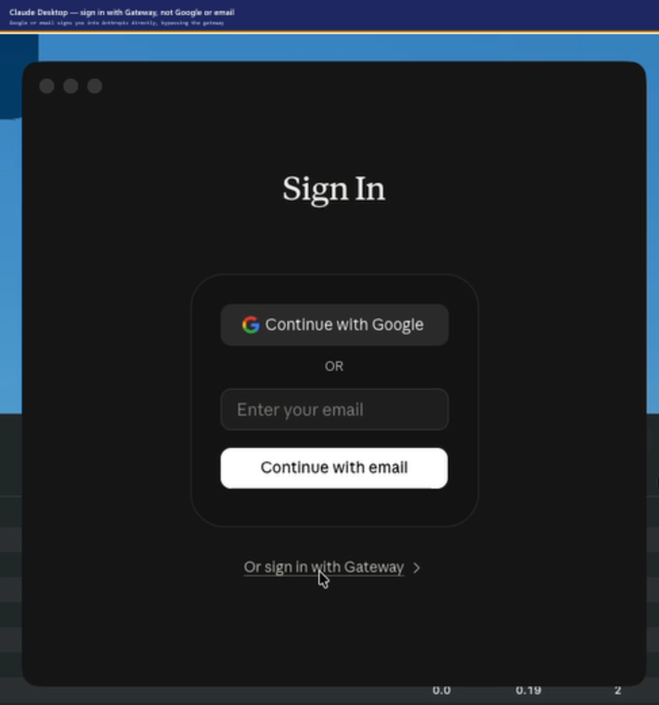

# Claude Code — developer setup

You have been granted access to Claude (Sonnet 5 and Opus 5) running in our own
Microsoft Foundry resource, reached through a gateway.

**There is no API key.** You authenticate as yourself with Microsoft Entra ID,
and your usage is metered against your own budget. You need no Azure role on
anything — the gateway holds that. Being in the entitlement group is all it
takes, and you already are.

Nothing on this page needs administrator rights. If you are the person *setting
the gateway up*, you want [docs/SETUP.md](docs/SETUP.md) instead.

---

## One command

Your platform team sent you `claude-gateway.json`. It holds the gateway URL,
tenant and tier limits, so you do not have to type any of them. Put it next to
the script:

```powershell
# Windows
.\Setup-ClaudeWorkstation.ps1 -ConfigPath .\claude-gateway.json
```

```bash
# macOS and Linux
./setup-claude-workstation.sh --config ./claude-gateway.json
```

It checks what you already have, installs anything missing, configures **all
three clients** — Claude Code CLI, the VS Code extension, and Claude Desktop
including Cowork — then makes a real call through the gateway to prove it works.


> **No `claude-gateway.json`?** It is not in this repository — your platform team
> generates it when they deploy the gateway. Ask them, or pass the two values
> directly:
>
> ```powershell
> .\Setup-ClaudeWorkstation.ps1 -GatewayUrl https://<apim>.azure-api.net/claude -TenantId <tenant-id>
> ```
>
> Neither is a secret. Your access comes from group membership, not from these.

Then restart the clients — all three read their configuration at startup:

| Client | Restart |
|---|---|
| Claude Code CLI | nothing to do |
| VS Code | reload the window |
| Claude Desktop | quit completely, **including the tray icon** |

Re-run the script any time; it reconciles rather than duplicating.

| Windows | macOS / Linux | Effect |
|---|---|---|
| `-SkipInstall` | `--skip-install` | configure only, install nothing |
| `-SkipDesktop` / `-SkipVSCode` | `--skip-desktop` / `--skip-vscode` | leave that client alone |
| `-NoCowork` | `--no-cowork` | configure Desktop without the Cowork tab |

> **macOS and Linux** need `jq`; the script installs it via Homebrew, apt, dnf,
> pacman or zypper. If `npm install -g` fails on Linux it is almost always a
> non-writable global prefix rather than anything to do with Claude:
> `npm config set prefix ~/.npm-global && export PATH=~/.npm-global/bin:$PATH`

---

## Using it

**In VS Code** — open a folder, then **Ctrl+Shift+P → `Claude Code: Open in Side
Bar`**. There is no sign-in step; your Entra credential is already resolved.


**In the terminal** — run `claude`. Confirm the backend with `/status`:


**In Claude Desktop** — this one has a sign-in step, and the option you need is
not the obvious one.

1. **Quit Desktop completely**, including the tray or menu-bar icon. It reads
   its configuration at startup, so a running instance will not pick this up.
2. Reopen it. You get the **Sign In** screen.
3. Choose **"Or sign in with Gateway"** at the bottom.



**Do not use "Continue with Google" or "Continue with email".** Those sign you
into Anthropic's own service with a personal or work Anthropic account. It will
appear to work — you get a working Claude — but your organisation's access rules
and usage tracking do not apply, and Anthropic bills that usage separately from
your organisation's Azure agreement.

Check **Settings → Connection**: it should name your gateway URL. If it shows an
Anthropic account instead, sign out and start again at step 1.

If there is no **Connection** entry under Settings at all, the setup script has
not run on this machine — it writes the developer setting that reveals it.

**Your budget is on every response:**

```
x-ratelimit-remaining-tokens: 19980
x-quota-remaining-today: 499980
```

Exceeding the per-minute limit returns `429` with `Retry-After`, and Claude Code
backs off on its own — you may only notice a pause. Exhausting the daily quota
returns `403` until the period rolls over; ask the platform team if you need the
premium tier.

Your usage is recorded against your name so your organisation can allocate its
cost. Nothing is anonymous — but nothing is inspected either. Only token counts
are recorded, never your prompts.

---

## If something is wrong

| Symptom | Cause → Fix |
|---|---|
| `401` / "Entra ID token required" | Signed into the wrong tenant. Re-run the setup script — it pins the right one |
| `403` "Not entitled to Claude Code" | Not in the group, or membership not synced yet. Ping the platform team |
| `429` | Per-minute budget hit. Resets within a minute; Claude Code retries automatically |
| `DeploymentNotFound` | A model alias points at something we do not host. Use only `claude-sonnet-5` / `claude-opus-5` |
| Extension prompts for Anthropic sign-in | Settings not picked up — reload the VS Code window |
| Desktop asks for an Anthropic password | You picked Google or email. Sign out, quit completely, reopen, choose **Or sign in with Gateway** |
| Desktop works but your usage never appears in your team's report | Same cause — you are signed into Anthropic, not the gateway. Check **Settings → Connection** names your gateway URL |
| No **Settings → Connection** in Desktop | Developer settings missing. Re-run the setup script; it writes `allowDevTools: true` |
| Panel fails but the CLI works | The extension host is running an older build. **Developer: Reload Window** in each open window |

Anything else → [docs/DEBUGGING.md](docs/DEBUGGING.md), or your platform team.

---

## FAQ

**Do I need an Anthropic account?**
No. You never create one and you never sign in to one. Your Entra ID is the
credential. If a screen is asking for an Anthropic password, you are on the
wrong path — see the Desktop sign-in step above.

**I signed in with Google by mistake. What now?**
Sign out in Desktop, quit it completely including the tray icon, open it again
and choose **Or sign in with Gateway**. Nothing is broken. That session was
served by Anthropic rather than your gateway, so its cost was not recorded
against your organisation and your prompts went to Anthropic's service.

**Why is there a developer-mode step at all?**
Desktop only shows **Settings → Connection** when a developer setting is turned
on, and the gateway configuration has nowhere to live without it. The setup
script writes it for you; there is nothing to switch on by hand.

**Do I have to re-run the setup when my token expires?**
No. The credential helper refreshes it silently. You only re-run setup if the
gateway URL changes or you move to a different machine.

**What does my platform team see?**
Token counts, the model, which client you used, and your name. Not your prompts
and not the replies. Usage is recorded against your name, and its cost is
allocated to the department or team your platform team has assigned you to.

**I get 403 and I am definitely in the group.**
Group membership is not available to the gateway the instant it changes — a sync
has to run. If your platform team has confirmed your membership and you still
get `403`, ask them to check the sync completed.

**Can I use a personal Anthropic subscription alongside this?**
On a different machine or profile, yes — but not through this configuration. If
you sign the same Desktop into an Anthropic account, it stops using the gateway
until you sign back in with Gateway.

---

## Appendix — configuring it by hand

Only needed if you cannot run the script, or you are checking what it did.

**1. Sign in, naming the tenant.** Guests land in their home directory
otherwise, and the gateway rejects the token:

```powershell
az login --tenant <your-tenant-id>
az account show --query "{tenant:tenantId, user:user.name}" -o table
```

**2. Install** the CLI and extension. Needs Node.js 18+, VS Code 1.94+, and the
Azure CLI:

```powershell
npm install -g @anthropic-ai/claude-code
code --install-extension anthropic.claude-code
```

**3. Write Claude Code's settings file.** It lives in your home directory, so
the path is the same on every platform:

| | Path |
|---|---|
| Windows | `%USERPROFILE%\.claude\settings.json` |
| macOS | `~/.claude/settings.json` |
| Linux | `~/.claude/settings.json` |

Take the gateway URL from your `claude-gateway.json`:

```json
{
  "env": {
    "CLAUDE_CODE_USE_FOUNDRY": "1",
    "ANTHROPIC_FOUNDRY_BASE_URL": "https://<your-gateway>.azure-api.net/claude",
    "ANTHROPIC_DEFAULT_OPUS_MODEL": "claude-opus-5",
    "ANTHROPIC_DEFAULT_SONNET_MODEL": "claude-sonnet-5",
    "ANTHROPIC_DEFAULT_HAIKU_MODEL": "claude-sonnet-5"
  },
  "availableModels": ["claude-sonnet-5", "claude-opus-5"],
  "enforceAvailableModels": true
}
```

Two traps the script handles for you:

- Do **not** also set `ANTHROPIC_FOUNDRY_RESOURCE`. It is mutually exclusive
  with the base URL, and the session dies with
  `baseURL and resource are mutually exclusive`
- Point the **haiku** alias at Sonnet. Most tenants have no Haiku deployment,
  and the failure otherwise surfaces mid-task as `DeploymentNotFound`

**4. VS Code usually needs nothing more.** The extension reads the same
`~/.claude/settings.json`, and its own setting description says to prefer it
over VS Code settings.

Two cases where you do open VS Code's own settings. It is a **different file in
a different place** — the shared name is all they have in common:

| | Path |
|---|---|
| Windows | `%APPDATA%\Code\User\settings.json` |
| macOS | `~/Library/Application Support/Code/User/settings.json` |
| Linux | `${XDG_CONFIG_HOME:-~/.config}/Code/User/settings.json` |

Or reach it without the path: **Ctrl+Shift+P → Preferences: Open User Settings
(JSON)**. Use the JSON editor rather than the Settings UI — the setting below is
an array of objects and the UI will not edit it properly.

If you need a VS Code-only override, `claudeCode.environmentVariables` is an
**array of name/value objects**, not a map — verified against extension 2.1.263,
whose schema requires both properties:

```json
"claudeCode.environmentVariables": [
  { "name": "CLAUDE_CODE_USE_FOUNDRY",     "value": "1" },
  { "name": "ANTHROPIC_FOUNDRY_BASE_URL",  "value": "https://<your-gateway>.azure-api.net/claude" }
]
```

If the extension keeps asking you to sign in to Anthropic, tell it not to —
authentication is happening outside it, through Entra:

```json
"claudeCode.disableLoginPrompt": true
```

Either way, **Developer: Reload Window** afterwards. The extension host reads
configuration at startup and will not pick up a change in a running window.

**5. Check it:**

```powershell
claude auth status     # expect apiProvider: foundry
claude -p "Reply with exactly: OK"
```
