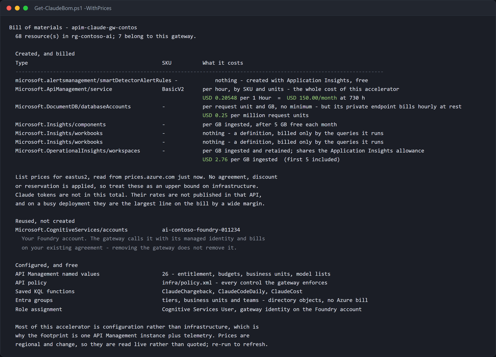

# Claude Code on Microsoft Foundry — Governed Gateway Accelerator

Run **Claude Code CLI, the VS Code extension and Claude Desktop** against your
organisation's Claude deployment in Microsoft Foundry. Azure API Management
validates each caller's Microsoft Entra token, checks entitlement and token
budgets, and records usage for business-unit chargeback. The gateway's managed
identity calls Foundry; developers need no model API key or Foundry role.

Start with [Setup](docs/SETUP.md) for deployment or
[DEVELOPER.md](DEVELOPER.md) if your platform team has already granted access.

> **How many developers this holds today:** the default installer stores
> entitlement in named values. Business-unit membership fills first, at
> **roughly 93 developers** with six-character unit IDs; tier lists hold 110
> each. Longer IDs reduce that capacity. Oversized writes fail, not truncate.
>
> The optional private Cosmos DB projection removes those membership lists.
> **It is not the default.** On 2026-09-24, **500,000 records were loaded and read**:
> 954 writes/second; point reads cost 1 RU, p99 51 ms. This is a storage test,
> **not 500,000 concurrent developers** or a completed directory scan.
>
> The current two-always-ready-instance profile costs **$91.56/month at rest**.
> Hourly lease renewal at 500,000 members adds about **365 million writes/month**,
> about **$538/month** at the measured create RU charge and stated list price
> (derived, not a measured scheduled-sync bill). APIM, Foundry and other usage
> costs are additional. See the [dated P19 record](docs/STATUS.md#where-p19-stands-2026-09-24),
> [Scale](docs/SCALE.md) and [private deployment](docs/SECURE-PROJECTION.md).
>
> `scripts/Measure-ClaudeCeiling.ps1` checks your named-value headroom and fails
> at 80%; [Operations](docs/OPERATIONS.md#2-check-health-and-headroom) gives the
> command, roles and portal checks.

## Start here

| You need to… | Start with |
|---|---|
| Use the CLI, VS Code or Desktop on Windows/macOS | [Developer setup](DEVELOPER.md) — prerequisites, setup, verification and fixes |
| Stand up a gateway | [Setup](docs/SETUP.md) — required roles, installer and portal deployment |
| Operate people, tiers, teams, budgets or models | [Operations](docs/OPERATIONS.md) — task router and portal paths |
| Own monthly chargeback or the FinOps process | [FinOps](docs/FINOPS.md) — close a month, investigate gaps and set allocations |
| Use a terminal FinOps console or automate reports | [AUM (Azure Usage Management)](docs/CLI-FINOPS.md) — terminal views and scriptable commands |
| Manage a business unit or view its usage | [Turnstile: viewers and managers](docs/TURNSTILE.md#viewers-and-managers) — assigned roles and sign-in without web consent |
| Review security, identities or revocation | [Authentication](docs/AUTHENTICATION.md), then [Network](docs/NETWORK.md) |
| Configure firewalls, private endpoints or VNet access | [Network](docs/NETWORK.md), then [Private projection](docs/SECURE-PROJECTION.md) |
| Plan for 500,000 developers | [Scale](docs/SCALE.md) — measured envelope, unresolved limits and cost assumptions |
| Move off first-party Claude | [Migration](docs/MIGRATION.md) — history, fleet policy, backup and cutover |
| Choose deployment options | [Decisions](docs/DECISIONS.md) and [Comparison](docs/COMPARISON.md) |
| Evaluate Foundry without governance | [Foundry direct](docs/FOUNDRY-DIRECT.md) — not the governed production path |
| Resolve a known error / find an unknown failure layer | [Troubleshooting](docs/TROUBLESHOOTING.md) / [Debugging](docs/DEBUGGING.md) |

### Running it day to day

A **tier** controls permitted models and personal token limits. A **business
unit** owns a monthly allocation; a **team** is a unit with a parent. These are
independent axes. Entra groups supply membership; changing an APIM allowlist by
hand is not durable and the next sync can overwrite it.

Use [Operations](docs/OPERATIONS.md) for health, add/remove, backup/restore and
retirement; [Onboarding](docs/ONBOARDING.md) for group changes;
[Budgets](docs/BUDGETS.md) for limits; [Models](docs/MODELS.md) and
[Plugins](docs/PLUGINS.md) for capability changes.
The combined health command is `scripts/Test-ClaudeHealth.ps1`; select its
gateway target and follow the portal checks in Operations before running it.

[](https://portal.azure.com/#create/Microsoft.Template/uri/https%3A%2F%2Fraw.githubusercontent.com%2Fnaveenneog%2Fclaude-code-foundry-gateway%2Fmain%2Finfra%2Fazuredeploy.json)


### How one request flows


Read [Architecture](docs/ARCHITECTURE.md) for the component map. Use the dated
[Scale](docs/SCALE.md) and [Status](docs/STATUS.md) records for capacity and cost,
not figures embedded in a diagram. `scripts/Get-ClaudeBom.ps1` reads the deployed
bill of materials; the [operations procedure](docs/OPERATIONS.md#5-inspect-cost-and-retire-only-what-you-own)
explains created, reused and optional resources.

## Why

Foundry provides Entra authentication. The gateway adds a shared enforcement
point for entitlement, token limits and model access. It governs only requests
that pass through it: audit and remove unintended direct Foundry permissions
before claiming the gateway is the only path.

### What makes per-developer metering trustworthy

The policy uses the validated token's `oid`, not a caller-supplied user header.
Entra tokens are still bearer credentials and must be protected; a signed claim
does not make a stolen token impossible to replay.
[Authentication](docs/AUTHENTICATION.md) explains identities and revocation.

## What you get

| Control | Mechanism |
|---|---|
| Entitlement | Entra membership published to named values or the optional projection |
| Personal minute/day and organisation/month limits | APIM token counters, with soft-cap and cache caveats |
| Business-unit and team allocation | Stable unit IDs, monthly budgets and chargeback |
| Model restrictions | Gateway allowlists, independent of client settings |
| Usage reporting | Request ledger, saved KQL functions and workbooks |
| Optional FinOps console | Turnstile fork; not in the inference request path |
| No distributed model keys | Gateway managed identity calls the customer's Foundry account |


### The three clients

Configuration and sign-in steps are in [DEVELOPER.md](DEVELOPER.md). Desktop
users choose **Or sign in with Gateway**, not Google or email.

<details>
<summary>Client screenshots</summary>


</details>

### Running the installer

The [setup walkthrough](docs/SETUP.md#option-a--the-interactive-wizard-recommended)
explains the choices and offers a portal alternative.

<details>
<summary>Installer screenshots</summary>


Identifiers are redacted with [terminal](guide/redact-terminal.mjs) and
[client](guide/redact-clients.mjs) tooling. Raw captures are not committed.

</details>

## Prerequisites

Platform deployment needs a Foundry account eligible to deploy Claude, an APIM
**v2** tier, Azure CLI/Bicep, and the Azure and Entra permissions listed in
[Setup](docs/SETUP.md#1-prerequisites). Developers need the platform team's
configuration and entitlement, not those administrator roles.

**USD budgets:** dollar inputs now retain their approved amount and dated tariff,
with an optional reconciler publishing gateway stops. This includes observed
cache categories, not a hard invoice or complete streaming-cost guarantee.
See [dollar budgets](docs/BUDGETS.md#dollar-budgets-what-is-enforced) and the
[AUM client API contract](docs/aum-usd-budgets-client-contract.md).

> ### ⚠️ The SKU matters more than anything else here
> Anthropic token parsing requires Basic v2, Standard v2 or Premium v2.
> Classic tiers can accept the policy but meter zero tokens. Private resolver
> access needs Standard v2 or Premium v2 outbound VNet integration.

## Quickstart

After reviewing the [roles](docs/SETUP.md#2-permissions-and-roles):

```powershell
git clone https://github.com/naveenneog/claude-code-foundry-gateway
cd claude-code-foundry-gateway
./Install-ClaudeGateway.ps1
```

**macOS/Linux:** use `./install-claude-gateway.sh` from the same directory.
**Portal:** [Setup option C](docs/SETUP.md#option-c--portal) covers template
deployment and the group, sync and handover steps it does not perform.
For preview and unattended parameters, see [Setup](docs/SETUP.md#3-deploy).

### What it does

The installer discovers resources, collects deployment and budget choices,
deploys/reuses the gateway and observability resources, grants the gateway
identity access to Foundry, configures the API/policy, creates or reuses tier
groups, syncs entitlement and generates the
[developer handover](onboarding/README.md). See [Setup](docs/SETUP.md) before a
redeploy; optional projection and Turnstile deployment are separate procedures.

## Onboarding a developer

Follow [Onboarding](docs/ONBOARDING.md): change the Entra group, publish the
change, verify it, then send [DEVELOPER.md](DEVELOPER.md), the generated config
and the complete scripts bundle. No developer API key is issued.

## Verifying the controls

Use [Governance checks](docs/GOVERNANCE-CHECKS.md). Agree a test window:
throttle tests temporarily change live limits and send billable model requests.

## Close the bypass

Run the [Foundry bypass audit](docs/SETUP.md#42-close-the-bypass) and review
inherited as well as direct roles. Keep the gateway's managed identity grant.
Do not remove another application's legitimate assignment without its owner.

## Tuning budgets

Moved to [Configure token budgets and model access](docs/BUDGETS.md), including
all defaults, per-person overrides, refusal bodies, portal edits and verification.

## Chargeback

Start with [FinOps](docs/FINOPS.md). `ClaudeChargeback` is the request ledger;
`ClaudeCost` prices its usage plus observed cache reads. The
[chargeback workbook](docs/MONITORING.md#the-chargeback-workbook--the-same-question-in-money)
is the reporting view, not a reconciled invoice.

[Business-unit commands](docs/BUSINESS-UNITS.md) manage allocations;
[Turnstile](docs/TURNSTILE.md) optionally provides a browser console and delegated
management. [AUM (Azure Usage Management)](docs/CLI-FINOPS.md) provides the
terminal FinOps console and scriptable commands over Turnstile or the gateway.
See [console choices](docs/FINOPS.md#optional-consoles) for access differences.
Custom metrics remain useful for pilot diagnostics, not complete scaled billing.

## What it costs

Use `scripts/Get-ClaudeBom.ps1 -WithPrices` with your selected gateway;
[Operations](docs/OPERATIONS.md#5-inspect-cost-and-retire-only-what-you-own)
gives the command and Cost Management portal path. It reads deployed regional
list prices, excludes Claude tokens, and does not replace your invoice.
Include the optional [projection](docs/SECURE-PROJECTION.md#cost) and
[Turnstile](docs/TURNSTILE.md#what-it-costs) separately.



## Repository layout

Moved to [Repository and command reference](docs/REFERENCE.md#repository-layout).
The scripts, templates, analytics, resolver, sync and screenshot tools are mapped
there; [Operations](docs/OPERATIONS.md) maps tasks to commands and portal paths.

## Documentation

| Guide | Purpose |
|---|---|
| [Developer](DEVELOPER.md) | CLI, VS Code and Desktop setup and verification |
| [Setup](docs/SETUP.md) | Prerequisites, roles, deployment and bypass closure |
| [Operations](docs/OPERATIONS.md) / [Onboarding](docs/ONBOARDING.md) | Daily administration, people, backup and retirement |
| [Budgets](docs/BUDGETS.md) / [Business units](docs/BUSINESS-UNITS.md) | Personal, tier, organisation, unit and team limits |
| [FinOps tools](docs/FINOPS-TOOLS.md) | Every FinOps tool side by side: sign-in for each person, end-to-end flows and the priced bill of materials |
| [FinOps](docs/FINOPS.md) / [Monitoring](docs/MONITORING.md) | Monthly close, ledger, workbooks, alerts and gaps |
| [Chargeback reports](docs/CHARGEBACK-REPORTS.md) | Generate monthly business-unit reports, configure recipients and schedule private ACS email delivery |
| [AUM - Azure Usage Management](docs/AUM.md) ([legacy guide](docs/CLI-FINOPS.md)) | `aum`: live usage, budgets and governance in a keyboard-first dashboard and scriptable commands, with safe previews and redacted live screenshots |
| [AUM service](docs/AUM-SERVICE.md) | Optional authority independent of Turnstile: viewers, scoped managers, budget requests and boosts |
| [Turnstile](docs/TURNSTILE.md) | Optional console, roles, governance authority and apply jobs |
| [Models](docs/MODELS.md) / [Plugins](docs/PLUGINS.md) | Model lifecycle and client capability policy |
| [Migration](docs/MIGRATION.md) | First-party history, MDM, bulk onboarding and cutover |
| [Architecture](docs/ARCHITECTURE.md) / [Decisions](docs/DECISIONS.md) | System map and deployment choices |
| [Authentication](docs/AUTHENTICATION.md) / [Network](docs/NETWORK.md) | Identities, revocation, client egress and private access |
| [Enterprise network](docs/NETWORK-ENTERPRISE.md) | Priced network reviews, caller access impact, live-tested regional WAF and private origins; reference-only hub and global-edge alternatives |
| [Data governance](docs/DATA-GOVERNANCE.md) | Retention, discovery, approved purge and its coverage limits |
| [Scale](docs/SCALE.md) / [Private projection](docs/SECURE-PROJECTION.md) | Measured limits, costs and migration runbook |
| [Comparison](docs/COMPARISON.md) / [Foundry direct](docs/FOUNDRY-DIRECT.md) | Adoption choices and ungoverned evaluation |
| [AI Gateway tier](docs/AI-GATEWAY-TIER.md) | Preview comparison and unverified model-serving path |
| [Troubleshooting](docs/TROUBLESHOOTING.md) / [Debugging](docs/DEBUGGING.md) | Known symptoms / isolate the failure layer |
| [Governance checks](docs/GOVERNANCE-CHECKS.md) | Live verification and safety precautions |
| [Reference](docs/REFERENCE.md) / [Releasing](docs/RELEASING.md) | Repository map, checks, quoting and release process |
| [Handover files](onboarding/README.md) / [Screenshot tooling](guide/README.md) | Generated artifacts and safe captures |

The engineering record is separate from the user guides:
[Charter](docs/CHARTER.md), [Roadmap](docs/ROADMAP.md), [Status](docs/STATUS.md),
[Unknowns](docs/UNKNOWNS.md), [ADRs](docs/adr/) and [Changelog](CHANGELOG.md).

## Companion accelerator

[claude-desktop-foundry](https://github.com/naveenneog/claude-desktop-foundry)
provides Desktop fleet-policy tooling that can reuse this gateway. Follow that
repository's instructions for its scripts; they are not all in this checkout.

## Contributing

Open an issue or pull request with a reproducible command, client/version,
status code and redacted output. Do not include tokens, tenant/resource IDs,
real addresses, prompt content or unredacted screenshots.

### Running the checks

Use [Contributor checks](docs/REFERENCE.md#contributor-checks) for offline/live
tests, the packet gate, PowerShell encoding and Windows Azure CLI quoting.

## License

MIT — see [LICENSE](LICENSE).
