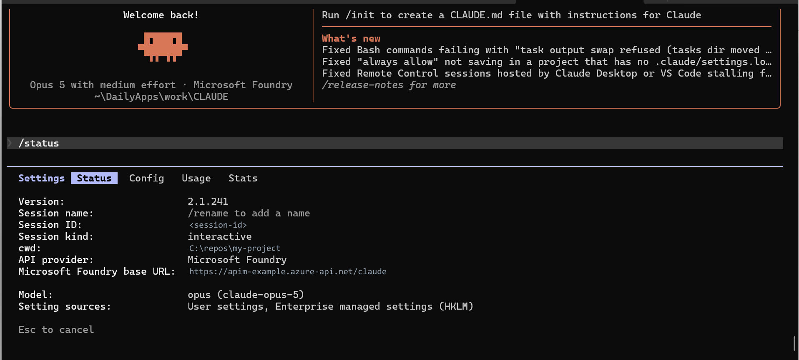
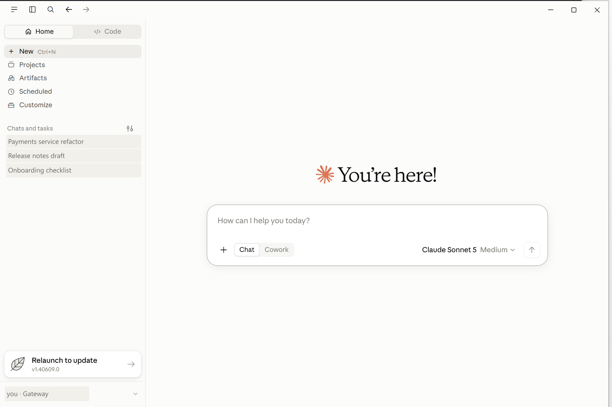
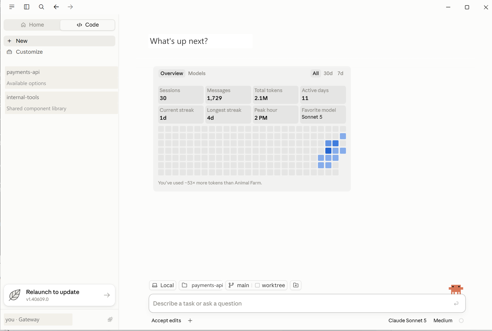

# Claude Code on Microsoft Foundry — Governed Gateway Accelerator

Give your engineering team **Claude Code** running on **your own Claude deployment in Microsoft
Foundry**, with per-developer budgets, cost reporting by team — and **no model credential on any
developer machine**.

One interactive command deploys the whole thing, once you have the files:

```powershell
git clone https://github.com/naveenneog/claude-code-foundry-gateway
cd claude-code-foundry-gateway
./Install-ClaudeGateway.ps1          # macOS/Linux: ./install-claude-gateway.sh
```

It asks what it needs, shows a summary, and creates nothing until you confirm.
Check the [prerequisites](#prerequisites) first if it stops early.

---

## Start here

**Which are you?**

| | | |
|---|---|---|
| 👩‍💻 | **A developer** told to use Claude Code here | **[DEVELOPER.md](DEVELOPER.md)** — one command, no Azure rights, one page |
| 🏗️ | **Standing it up** for the first time | [Setup](docs/SETUP.md) — about 60 minutes, 40 of it unattended |
| 🛠️ | **Running it** day to day | the table below |
| 🔀 | **Moving off** Claude bought directly from Anthropic | [Migration](docs/MIGRATION.md) |
| 📈 | **Sizing it** past a pilot, or asking what it can hold | [Scale](docs/SCALE.md) — the measured ceilings |
| 🤔 | **Deciding** whether to do this at all | [Comparison](docs/COMPARISON.md) |

### Running it day to day

One command for whether anything needs attention:

```powershell
./scripts/Test-ClaudeHealth.ps1 -ResourceGroup <rg> -ApimName <apim>
```

Two words worth knowing before the table, because every command below uses them:

- A **tier** is what a developer may do — which models, how many tokens a minute
  and a day. Two exist: `standard` and `premium`.
- A **business unit** is whose budget the spend comes out of — a team or cost
  centre, with a monthly figure. A **team** is a business unit inside another one.

Tiers control limits. Business units allocate cost. A developer has one of each,
and they are set independently.

| I want to… | Command |
|---|---|
| Add a developer | `./scripts/Set-ClaudeDeveloper.ps1 -User x@y.com -Tier standard -Sync` |
| Remove one | `./scripts/Set-ClaudeDeveloper.ps1 -User x@y.com -Remove -Sync` |
| See who has what | `./scripts/Get-ClaudeBudget.ps1` |
| See what the tiers allow | `./scripts/Set-ClaudeTier.ps1 -List` |
| Change a tier's daily limit | `./scripts/Set-ClaudeTier.ps1 -Tier standard -DailyQuota 750000` |
| Create a business unit or team | `./scripts/Set-ClaudeBusinessUnit.ps1 -Id mcaps -Group claude-bu-mcaps -MonthlyBudgetUsd 20000` |
| See who spent what | `./scripts/Get-ClaudeBusinessUnit.ps1` |
| Open the dashboard | `./scripts/Publish-ClaudeWorkbook.ps1 -List`, then open the link it prints |
| Back up before a change | `./scripts/Backup-ClaudeGateway.ps1` |
| Work out why something is refused | `./scripts/Debug-ClaudeCode.ps1` |

Deeper detail lives in [Onboarding](docs/ONBOARDING.md) (people and tiers),
[Monitoring](docs/MONITORING.md) (usage and cost), [Business
units](docs/BUSINESS-UNITS.md) (cost allocation) and [Debug](docs/DEBUGGING.md).

> **The one thing worth knowing before you start.** Entitlement comes from Entra
> groups. Every script here edits the group and then publishes to the gateway —
> editing the gateway directly works until the next sync and then silently stops.

---

[](https://portal.azure.com/#create/Microsoft.Template/uri/https%3A%2F%2Fraw.githubusercontent.com%2Fnaveenneog%2Fclaude-code-foundry-gateway%2Fmain%2Finfra%2Fazuredeploy.json)


### How one request flows


What it deploys is small, and `./scripts/Get-ClaudeBom.ps1` reads it off a live
gateway rather than repeating a design. On the reference deployment: **five
resources**, of which only API Management meaningfully costs anything. The
workbook and the saved KQL functions are definitions and bill nothing, and the
Foundry account is yours and was there first.

---

## Why

Claude Code is excellent, and the usual objection to rolling it out is not the tool — it is the
sentence *"and then every developer pastes a vendor API key into a file on their laptop."*

Foundry already fixes the key problem: Claude Code's Foundry mode authenticates with **Microsoft
Entra ID**, so `az login` is the whole credential story. But going direct to Foundry means every
developer needs `Cognitive Services User` on the resource, and you get:

- no per-developer rate limit
- no per-developer budget
- no tiering
- usage data only at the resource level, with no idea who spent it
- anyone with the role can point any tool at the endpoint

This accelerator puts an **Azure API Management AI gateway** in front. Developers hold no Foundry
role at all — the gateway's managed identity is the only principal with data-plane access, so the
gateway is not the recommended path, it is the **only** path.

### What makes per-developer metering trustworthy

Claude Code sends the **developer's own Entra ID token**, obtained through
`DefaultAzureCredential`. Every request carries a real `oid` that cannot be forged, shared, or
copied to a colleague's laptop. The gateway meters against that claim.

You do not need an app registration, a custom audience, or any client-side auth code.

---

## What you get

| Control | Mechanism | Result |
|---|---|---|
| Who may use Claude Code | Entra ID group membership | **403** with an actionable message |
| Tiered budgets | `llm-token-limit` per tier | standard vs premium limits |
| Per-developer rate limit | tokens/minute keyed on `oid` | **429** + `Retry-After` |
| Per-developer daily budget | `token-quota` + period | **403** until reset |
| Runaway-agent protection | `rate-limit-by-key` on requests | request ceiling |
| Chargeback | `llm-emit-token-metric` → App Insights | tokens per named person |
| No credential sprawl | gateway managed identity | nothing to leak or rotate |


### The three clients

One setup script configures all three against the gateway. None of them holds a
credential; each authenticates as the signed-in user through Entra ID.

**Claude Code CLI.** `/status` reports the provider and the settings sources it
read, including the enterprise policy pushed by MDM:



**VS Code extension**, streaming included, with no sign-in prompt:


**Claude Desktop**, Chat and Cowork, signed in against the gateway rather than
an Anthropic account — the account row reads `Gateway`:



**Claude Desktop, Code tab**, with session and token counts:



### Running the installer

The admin setup is interactive and shows a summary before it creates anything.


Existing v2 API Management instances are offered for reuse, so a second gateway
is not created by accident:


Every budget has a default already filled in:


Nothing is created before the summary is confirmed:


Identifiers in these screenshots are redacted. The redaction maps are
[`guide/redact-terminal.mjs`](guide/redact-terminal.mjs) and
[`guide/redact-clients.mjs`](guide/redact-clients.mjs); the raw captures are not
in this repository.

---

## Prerequisites

| Requirement | Notes |
|---|---|
| Microsoft Foundry account (`AIServices` kind) | with at least one Claude deployment |
| Azure CLI, signed in | `az login` |
| PowerShell 5.1+ or PowerShell 7+ | both supported |
| Permission to create Entra ID groups | or create them yourself and pass `-SkipGroups` |
| An APIM **v2** SKU is deployed | the installer creates Basic v2, or reuses a v2 instance you already have. Classic tiers cannot meter Anthropic tokens — see the SKU note below |

> ### ⚠️ The SKU matters more than anything else here
> APIM's `llm-*` policies parse the **Anthropic Messages API** shape **only on v2 tiers**
> (Basic v2, Standard v2, Premium v2). On classic Developer/Basic/Standard/Premium the policies
> apply happily but token counts come back empty — so budgets silently never trigger and you
> believe you are governed when you are not. This accelerator defaults to **Basic v2**.

---

## Quickstart

```powershell
git clone https://github.com/naveenneog/claude-code-foundry-gateway
cd claude-code-foundry-gateway

az login

# Interactive. Discovers your Foundry account, asks for each budget with a
# sensible default already filled in, and shows a summary before it creates
# anything. Enter throughout gives a working, governed deployment.
./Install-ClaudeGateway.ps1
```

**macOS and Linux** — same wizard, same Bicep, same result:

```bash
./install-claude-gateway.sh
```

Needs `az` and `jq`. The entitlement sync step also wants PowerShell 7
(`pwsh`); without it the script tells you the one command to run afterwards.

Preview without changing anything:

```powershell
./Install-ClaudeGateway.ps1 -WhatIf     # or: ./install-claude-gateway.sh --what-if
```

Unattended, taking every default:

```powershell
./Install-ClaudeGateway.ps1 -FoundryAccount ai-contoso -Yes
./install-claude-gateway.sh --foundry-account ai-contoso --yes
```

`deploy.ps1` is still there for anyone scripting against it; the wizard wraps
the same Bicep and produces the same result.

### What it does

1. Signs you in, picks the subscription, and finds Foundry accounts that
   actually have a Claude deployment
2. Collects every budget — tokens per minute and per day, per tier, plus a
   request ceiling — each with a default in place
3. Shows a summary and waits. **Nothing is created before you confirm**
4. Deploys APIM (v2, system-assigned identity), Log Analytics and Application
   Insights with custom metric dimensions enabled
5. Creates the Claude API, its operations, and the governance policy
6. Grants the gateway identity `Cognitive Services User` on your Foundry account
7. Creates the two Entra tier groups and syncs membership
8. Verifies the controls, and writes `onboarding/claude-gateway.json` — the file
   your developers' setup script reads. **It is generated, not shipped**; see
   [onboarding/README.md](onboarding/README.md).

Re-runnable, so it is also how you change budgets later.

---

## Onboarding a developer

**1. Entitle them** — portal or CLI. The
[portal walkthrough](docs/ONBOARDING.md#2-ui-walkthrough--adding-a-member-in-the-portal)
includes a deep link, and how to delegate this to a team lead without giving
them any Azure rights.

```powershell
az ad group member add --group claude-code-standard `
    --member-id (az ad user show --id alice@contoso.com --query id -o tsv)

./scripts/Sync-ClaudeAccess.ps1 -ApimName <apim-name> -ResourceGroup <rg>
```

**2. Send them the setup**

```powershell
./scripts/New-OnboardingEmail.ps1 `
    -ConfigPath ./onboarding/claude-gateway.json `
    -To alice@contoso.com -DisplayName Alice
```

Produces a formatted email — HTML, plain text, and an `.eml` to send from
Outlook. `-Send` tries Microsoft Graph and falls back cleanly.

**3. They run one command** — send them **[DEVELOPER.md](DEVELOPER.md)**, which
is the whole of their side:

```powershell
# Windows
.\Setup-ClaudeWorkstation.ps1 -ConfigPath .\claude-gateway.json
```

```bash
# macOS and Linux
./setup-claude-workstation.sh --config ./claude-gateway.json
```

No admin rights. Checks prerequisites, installs what is missing, and configures
**all three clients** — Claude Code CLI, the VS Code extension, and Claude
Desktop including Cowork — then makes a real call through the gateway to prove
it works.

No key, no Foundry role, and they appear in chargeback from their first request.

Revoking is `az ad group member remove` + sync. Promotion to premium is a group
change.

---

## Verifying the controls

```powershell
./scripts/Show-Governance.ps1 -ApimName <apim-name> -ResourceGroup rg-claude-gateway
```

Checks that an entitled developer is served, a second identity gets its own tier, an exhausted
budget is throttled with a `Retry-After`, and consumption is attributed per person. This produces
the screenshot above.

---

## Close the bypass

Until you do this, developers with a direct role can skip the gateway entirely:

```powershell
$scope = az cognitiveservices account show -n <foundry-account> -g <rg> --query id -o tsv
az role assignment delete --assignee <developer-oid> --role "Cognitive Services User" --scope $scope
```

Leave the role assigned only to the gateway's managed identity.

---

## Tuning budgets

Limits are stored as APIM **named values** — configuration entries the gateway
policy reads on every request. Editing one takes effect on the next call, with
no redeployment:

| Named value | Default | Meaning |
|---|---|---|
| `tpm-standard` | 20,000 | standard tier tokens/minute |
| `quota-standard` | 500,000 | standard tier tokens/day |
| `tpm-premium` | 80,000 | premium tier tokens/minute |
| `quota-premium` | 5,000,000 | premium tier tokens/day |
| `quota-org` | 100,000,000 | tokens/month across everyone, shared |
| `models-standard` | empty (all) | models the standard tier may call |
| `models-premium` | empty (all) | models the premium tier may call |
| `calls-per-minute` | 120 | request ceiling per developer |

`quota-org` is one counter shared by every caller, so tier budgets cascade
underneath it: a developer can be inside their own budget and still be refused
because the organisation's is spent. It is a **soft cap** — the
[`llm-token-limit` reference](https://learn.microsoft.com/en-us/azure/api-management/llm-token-limit-policy)
states high-concurrency requests can temporarily exceed the configured limit, so
it bounds spend rather than guaranteeing it.

It is also enforced **per gateway**. The same reference states the policy tracks
usage independently at each gateway and does not aggregate across the instance.
Basic v2 is single-region, so one gateway is one ceiling. A multi-region Premium
instance enforces `quota-org` once per region, so the effective ceiling is
`quota-org` × regions.

The default is roughly one premium developer's month. Raise it before a wider
rollout.

Both refusals are `403`. The gateway rewrites the reply so it says which budget
ran out:

```json
{ "type": "error",
  "error": { "type": "rate_limit_error",
             "budget": "organisation",
             "message": "The organisation's Claude budget for this period is spent. ..." } }
```

`budget` is `organisation` or `personal`. Successful replies carry
`x-org-quota-remaining` and `x-quota-remaining-today`.

`quota-overrides` gives one developer a different daily budget without moving
them between tiers:

```powershell
./scripts/Set-ClaudeBudget.ps1 -User someone@contoso.com -Tokens 2000000
./scripts/Set-ClaudeBudget.ps1 -User someone@contoso.com -Clear
./scripts/Set-ClaudeBudget.ps1 -List
```

It takes effect on the next request — the policy resolves it per call, so
there is no redeployment and no restart. An override changes the daily quota
only; tokens per minute stays at the tier value, because `llm-token-limit` does
not accept an expression for `tokens-per-minute`. To change someone's rate, move
them between tiers.

To see what the gateway would actually apply, and what has been spent this
month:

```powershell
./scripts/Get-ClaudeBudget.ps1
./scripts/Get-ClaudeBudget.ps1 -User someone@contoso.com -AsJson
```

`models-standard` and `models-premium` restrict which models a tier may call.
They are checked at the gateway before the request reaches Foundry, so the
restriction holds whatever the client is configured to send:

```powershell
az apim nv update -g rg-claude-gateway --service-name <apim-name> `
    --named-value-id models-standard --value ",claude-sonnet-5,"
```

Sentinel commas make the match exact, so `claude-opus-5` does not admit
`claude-opus-5-mini`. An empty value allows every deployed model.

None of this applies to traffic that skips the gateway. A principal with
data-plane access directly on the Foundry account can call it straight:

```powershell
./scripts/Get-ClaudeBypass.ps1
```

It derives the roles that grant access from their `dataActions` rather than
matching a name, includes inherited assignments, and exits non-zero when it finds
a holder other than the gateway. `docs/SETUP.md` §4.2 has the detail.

Every other capability control — permission rules, hooks, Desktop tabs,
connectors — is delivered to the client by
`./scripts/New-ClaudeCodePolicy.ps1 -Tier standard|premium` and is a management
control, not a security boundary. Anthropic is direct about this: "a user who
can run a modified Claude Code binary can bypass any client-side control"
([reference](https://code.claude.com/docs/en/server-managed-settings), retrieved
2026-09-03). What must hold — entitlement, budgets, models — is at the gateway.
`docs/adr/0004-policy-out-of-band.md` has the reasoning.

```powershell
az apim nv update -g rg-claude-gateway --service-name <apim-name> `
    --named-value-id tpm-standard --value 40000
```

---

## Chargeback

Token usage is emitted to Application Insights as custom metrics in the `claudecode` namespace,
dimensioned by `User`, `UserId`, `Tier`, `Model` and `SessionId`.

```
naveen.g@contoso.com      831 tokens
alice@contoso.com         728 tokens
```

> The Azure CLI's `az monitor metrics list` drops `--namespace` for custom namespaces and reports
> "metric not found". Use the REST API — `Show-Governance.ps1` does.

---

## What it costs

| Item | Approx |
|---|---|
| APIM Basic v2, 1 unit | ~$250/month |
| Log Analytics + Application Insights | ingestion-based, small at this volume |
| Claude tokens | Billed through your existing Claude deployment in Foundry. The gateway does not change what a token costs |

Tear it down:

```powershell
az group delete -n rg-claude-gateway --yes --no-wait
az apim deletedservice purge --service-name <apim-name> --location <region>
az ad group delete --group claude-code-standard
az ad group delete --group claude-code-premium
```

`purge` matters — a soft-deleted APIM keeps its globally unique name.

---

## Repository layout

```
deploy.ps1                     one-command deployment
DEVELOPER.md                   the developer's whole side - send them this
infra/
  main.bicep                   gateway, observability, API, policy, RBAC
  foundry-role.bicep           Cognitive Services User for the gateway identity
  policy.xml                   the governance policy
  azuredeploy.json             compiled ARM, for the Deploy to Azure button
Install-ClaudeGateway.ps1        interactive admin setup - start here (Windows)
install-claude-gateway.sh        the same, for macOS and Linux
scripts/
  Setup-ClaudeWorkstation.ps1  one-command developer setup (Windows)
  setup-claude-workstation.sh  the same, for macOS and Linux
  get-foundry-token.*          credential helper for Claude Desktop
  New-OnboardingEmail.ps1      generate the developer's onboarding email
  Test-ClaudeHealth.ps1        is the gateway healthy? one command, six checks
  Debug-ClaudeCode.ps1         a developer's machine, layer by layer
  Sync-ClaudeAccess.ps1        Entra groups -> APIM named values
  Compare-ClaudeEntitlement.ps1  what the gateway enforces vs what Entra says
  ClaudeGraphMembership.ps1    the shared Graph membership read
  Show-Governance.ps1          verify all four controls
  Set-ClaudeDeveloper.ps1      add or remove one developer, tiers and units
  Set-ClaudeTier.ps1           read and set a tier's limits and model list
  Set-ClaudeBusinessUnit.ps1   register a business unit, team or budget
  Get-ClaudeBusinessUnit.ps1   spend per business unit, and who is unassigned
  Measure-ClaudeCeiling.ps1    headroom against the measured scale limits
  Measure-ClaudeOvershoot.ps1  how far spend runs past a budget, measured
  Measure-ClaudeProjectionCost.ps1  what the P19 entitlement projection would cost
  Add-ClaudeModel.ps1          deploy-check, allow, price a new Claude model
  Get-ClaudeBypass.ps1         principals that can reach Foundry directly
  Get-ClaudeBom.ps1            what this gateway created, reuses, and bills for
  Backup-ClaudeGateway.ps1     configuration backup; Restore- is the pair
  Migrate-ClaudeWorkstation.ps1  move one machine from first-party to gateway
  Get-FoundryValues.ps1        discover your Foundry values (-Mask to share)
  Set-GatewayPolicy.ps1        apply a policy file on its own
  Test-FoundryDirect.ps1       verify Foundry with the gateway bypassed
  inspect-proxy.mjs            see exactly what Claude Code sends
docs/
  SETUP.md                     prerequisites, roles, deployment
  ONBOARDING.md                add/change/revoke access; developer setup
  BUSINESS-UNITS.md            business units, teams, tiers, dollar budgets
  MIGRATION.md                 moving a population off first-party Claude
  MONITORING.md                metrics, chargeback, KQL, alerts
  MODELS.md                    adding a new Claude model end to end
  PLUGINS.md                   marketplaces, plugins and extensions
  SCALE.md                     measured ceilings and the load envelope
  DEBUGGING.md                 isolate a failure layer by layer
  COMPARISON.md                Foundry vs Anthropic direct
  ARCHITECTURE.md              how it works, and why each piece is there
  GOVERNANCE-CHECKS.md         command reference for verifying controls
  TROUBLESHOOTING.md           symptom -> fix lookup
  adr/                         architecture decision records
  CHARTER.md ROADMAP.md STATUS.md UNKNOWNS.md
                               the working record the build gate reads
guide/
  capture.mjs                  Playwright capture of the portal flow
  compose.mjs                  banner treatment for existing stills
  auth.mjs                     one-time portal sign-in
```

`inspect-proxy.mjs` is how the identity model was established rather than assumed: it decodes the
JWT Claude Code sends and prints the claims, without ever logging the token.

---

## Documentation

The router is at the [top of this page](#start-here). Reading orders, for the
journeys that span several guides:

| You are… | Read, in order |
|---|---|
| **Standing this up for the first time** | [Setup](docs/SETUP.md) → [Onboarding](docs/ONBOARDING.md) → [Monitoring](docs/MONITORING.md) |
| **Moving a population off first-party Claude** | [Migration](docs/MIGRATION.md) → [Setup](docs/SETUP.md) |
| **Charging usage back to budget holders** | [Business units](docs/BUSINESS-UNITS.md) → [Monitoring](docs/MONITORING.md) |
| **Sizing this past a pilot** | [Scale](docs/SCALE.md) → [ADR-0005](docs/adr/0005-identity-projection.md) |
| **Adding a model Anthropic just released** | [Models](docs/MODELS.md) |

**The guides:**

| Guide | For | Covers |
|-------|-----|--------|
| [Developer](DEVELOPER.md) | **developers** | one command, using it, what to do when it fails — nothing else |
| [Setup](docs/SETUP.md) | platform team | prerequisites, **roles and permissions**, deployment, closing the bypass |
| [Onboarding](docs/ONBOARDING.md) | platform team | add a developer, change tiers, revoke, offboard |
| [Business units](docs/BUSINESS-UNITS.md) | platform team, FinOps | business units, teams, tiers, dollar budgets, who is unassigned |
| [Migration](docs/MIGRATION.md) | platform team | moving off first-party Claude at scale: what survives, MDM push, bulk entitlement |
| [Monitoring](docs/MONITORING.md) | whoever owns the spend | metrics, filters, chargeback, KQL, alerts |
| [Models](docs/MODELS.md) | platform team | adding a new Claude model: deploy, allow, price, and what developers change |
| [Plugins](docs/PLUGINS.md) | platform team | marketplaces, plugin and extension controls for Code and Desktop, and their limits |
| [Scale](docs/SCALE.md) | platform team | measured ceilings, what runs out first, how to establish a capacity figure |
| [Debug](docs/DEBUGGING.md) | anyone | isolate a failure layer by layer |

**Reference, when you need it:**

- [Foundry vs Anthropic direct](docs/COMPARISON.md) — what changes, and what you give up
- [Architecture](docs/ARCHITECTURE.md) — request path, identity model, design decisions
- [Governance checks](docs/GOVERNANCE-CHECKS.md) — command reference for verifying controls
- [Troubleshooting](docs/TROUBLESHOOTING.md) — symptom → fix lookup, when you already know what broke
- [Screenshot tooling](guide/README.md) — regenerate the screenshots against your own deployment

**How this repository is run.** These are the working record rather than
instructions for using the gateway, and they are kept current because the
build gate reads them:

- [Charter](docs/CHARTER.md) — the contract the gate enforces on every change
- [Roadmap](docs/ROADMAP.md) — what is done, what is planned, and the acceptance criterion for each
- [Status](docs/STATUS.md) — the packet in flight, with its measurements and review
- [Unknowns](docs/UNKNOWNS.md) — questions that are open, and what each one blocks
- [Decisions](docs/adr/) — the architecture decision records, including why entitlement
  moves to a [durable projection](docs/adr/0005-identity-projection.md)
- [Changelog](CHANGELOG.md) and [Releasing](docs/RELEASING.md)

---

## Companion accelerator

**[claude-desktop-foundry](https://github.com/naveenneog/claude-desktop-foundry)** —
the same treatment for **Claude Desktop**, the GUI client.

It reuses *this* gateway, so if you already run it there is no new Azure
infrastructure: generate a managed-policy payload, deploy it with Intune or your
MDM, and Desktop traffic lands under the same budgets, tiering and chargeback.

Entitle a person once in the Entra group and they get both clients.

---

## Contributing

Issues and pull requests welcome. This accelerator was built and verified end to end against a
live Foundry deployment; if something does not work in your tenant, please open an issue with the
failing command and its output.

### Running the checks

```powershell
./tests/Test-All.ps1                 # offline: encoding, shell scripts, both PowerShell hosts
./tests/Test-All.ps1 -IncludeAzure   # adds the checks that call Azure
```

Two things these guard that are easy to get wrong, and that a syntax check will not catch:

**PowerShell scripts containing non-ASCII characters must be saved as UTF-8 *with* a BOM.**
Windows PowerShell 5.1 reads `.ps1` files as ANSI unless a BOM says otherwise, so non-ASCII
characters are mangled at parse time — before anything is printed, and regardless of the console
code page. PowerShell 7 reads UTF-8 either way, so this is invisible until someone runs it on 5.1.
`./scripts/Repair-ScriptEncoding.ps1` fixes it; `-Check` just reports. The banner used to depend
on this and no longer does — its art is pure ASCII — but the rule still applies to anything else
that reaches for a box-drawing or accented character.

**Keep `&`, `^`, `<`, `>`, `|` — and `( )` in `--query` — out of Azure CLI arguments.** On Windows
`az` is a `.cmd` shim, and PowerShell only quotes a native argument if it contains a space. An
argument with no space reaches `cmd.exe` bare and its metacharacters are interpreted. This has
bitten twice:

```
--query "[?contains(name,'claude')].name"        ->  ].name was unexpected at this time
--uri   ".../members?$select=id&$top=999"        ->  '$top' is not recognized as a command
```

Both affect PowerShell 5.1 and 7 equally — it's a Windows property, not a host one. Both fail
*quietly*: the error text is a non-empty string, so a plain `if ($result)` reads it as success.
Filter in PowerShell, or call the REST API directly with `Invoke-RestMethod` — which is also the
only way to follow Graph's `@odata.nextLink`, since paging URLs carry `&` too. Brackets and braces
are safe; bash is unaffected. `./tests/Test-AzArguments.ps1` enforces this.

## License

MIT — see [LICENSE](LICENSE).
