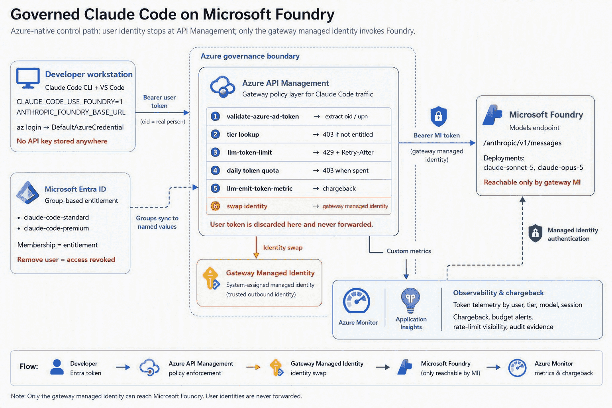
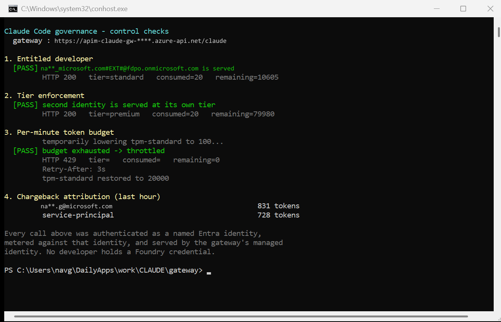
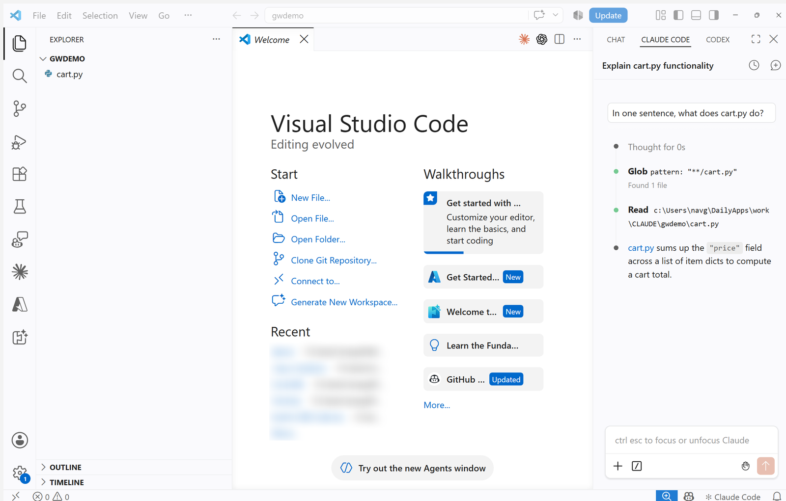

# Claude Code on Microsoft Foundry — Governed Gateway Accelerator

Give your engineering team **Claude Code** running on **your own Claude deployment in Microsoft
Foundry**, with per-developer budgets, tiering, and chargeback — and **no model credential on any
developer machine**.

One command deploys the whole thing.

```powershell
./deploy.ps1 -FoundryAccount <your-foundry-account> -ResourceGroup rg-claude-gateway
```

[](https://portal.azure.com/#create/Microsoft.Template/uri/https%3A%2F%2Fraw.githubusercontent.com%2Fnaveenneog%2Fclaude-code-foundry-gateway%2Fmain%2Finfra%2Fazuredeploy.json)



---

## Why

Claude Code is excellent, and the usual objection to rolling it out is not the tool — it is the
sentence *"and then every developer pastes a vendor API key into a file on their laptop."*

Foundry already fixes the key problem: Claude Code's Foundry mode authenticates with **Microsoft
Entra ID**, so `az login` is the whole credential story. But going direct to Foundry means every
developer needs `Cognitive Services User` on the resource, and you get:

- no per-developer rate limit
- no per-developer budget
- no tiering
- usage data only at the resource level, with no idea who spent it
- anyone with the role can point any tool at the endpoint

This accelerator puts an **Azure API Management AI gateway** in front. Developers hold no Foundry
role at all — the gateway's managed identity is the only principal with data-plane access, so the
gateway is not the recommended path, it is the **only** path.

### What makes per-developer metering trustworthy

Claude Code sends the **developer's own Entra ID token**, obtained through
`DefaultAzureCredential`. Every request carries a real `oid` that cannot be forged, shared, or
copied to a colleague's laptop. The gateway meters against that claim.

You do not need an app registration, a custom audience, or any client-side auth code.

---

## What you get

| Control | Mechanism | Result |
|---|---|---|
| Who may use Claude Code | Entra ID group membership | **403** with an actionable message |
| Tiered budgets | `llm-token-limit` per tier | standard vs premium limits |
| Per-developer rate limit | tokens/minute keyed on `oid` | **429** + `Retry-After` |
| Per-developer daily budget | `token-quota` + period | **403** until reset |
| Runaway-agent protection | `rate-limit-by-key` on requests | request ceiling |
| Chargeback | `llm-emit-token-metric` → App Insights | tokens per named person |
| No credential sprawl | gateway managed identity | nothing to leak or rotate |



Works with both the CLI and the VS Code extension, streaming included:



---

## Prerequisites

| Requirement | Notes |
|---|---|
| Microsoft Foundry account (`AIServices` kind) | with at least one Claude deployment |
| Azure CLI, signed in | `az login` |
| PowerShell 5.1+ or PowerShell 7+ | both supported |
| Permission to create Entra ID groups | or create them yourself and pass `-SkipGroups` |
| An APIM **v2** SKU is deployed | see the SKU note below |

> ### ⚠️ The SKU matters more than anything else here
> APIM's `llm-*` policies parse the **Anthropic Messages API** shape **only on v2 tiers**
> (Basic v2, Standard v2, Premium v2). On classic Developer/Basic/Standard/Premium the policies
> apply happily but token counts come back empty — so budgets silently never trigger and you
> believe you are governed when you are not. This accelerator defaults to **Basic v2**.

---

## Quickstart

```powershell
git clone https://github.com/naveenneog/claude-code-foundry-gateway
cd claude-code-foundry-gateway

az login

# Auto-discovers a Foundry account that has Claude deployments
./deploy.ps1

# ...or be explicit
./deploy.ps1 -FoundryAccount ai-contoso-foundry -FoundryResourceGroup rg-ai -ResourceGroup rg-claude-gateway
```

Preview without changing anything:

```powershell
./deploy.ps1 -WhatIf
```

Deployment takes about **five minutes** (API Management v2 provisions in minutes; classic tiers
take 30–45).

### What `deploy.ps1` does

1. Finds your Foundry account and its Claude deployment names, and maps the `sonnet` / `opus` /
   `haiku` aliases to deployments that actually exist
2. Deploys APIM (v2, system-assigned identity), Log Analytics and Application Insights with
   custom metric dimensions enabled
3. Creates the Claude API, its operations, and the governance policy
4. Grants the gateway identity `Cognitive Services User` on your Foundry account
5. Creates the `claude-code-standard` and `claude-code-premium` Entra groups
6. Syncs membership into the gateway
7. Writes `claude-settings.json` — the file you hand to developers

---

## Onboarding a developer

```powershell
# 1. entitle them
az ad group member add --group claude-code-standard `
    --member-id (az ad user show --id alice@contoso.com --query id -o tsv)

# 2. push it to the gateway
./scripts/Sync-ClaudeAccess.ps1 -ApimName <apim-name> -ResourceGroup rg-claude-gateway
```

They then put `claude-settings.json` at `~/.claude/settings.json`, run `az login`, and start
working. No key, no Foundry role, and they appear in chargeback from their first request.

Revoking is `az ad group member remove` + sync. Promotion to premium is a group change.

> **Guest accounts:** if the developer is a B2B guest in your tenant (a `#EXT#` UPN), they must
> sign in with `az login --tenant <tenant-id>`. A plain `az login` lands them in their home
> tenant and the gateway returns 401.

---

## Verifying the controls

```powershell
./scripts/Show-Governance.ps1 -ApimName <apim-name> -ResourceGroup rg-claude-gateway
```

Checks that an entitled developer is served, a second identity gets its own tier, an exhausted
budget is throttled with a `Retry-After`, and consumption is attributed per person. This produces
the screenshot above.

---

## Close the bypass

Until you do this, developers with a direct role can skip the gateway entirely:

```powershell
$scope = az cognitiveservices account show -n <foundry-account> -g <rg> --query id -o tsv
az role assignment delete --assignee <developer-oid> --role "Cognitive Services User" --scope $scope
```

Leave the role assigned only to the gateway's managed identity.

---

## Tuning budgets

Limits live in APIM named values, so changing one is a config edit, not a redeployment:

| Named value | Default | Meaning |
|---|---|---|
| `tpm-standard` | 20,000 | standard tier tokens/minute |
| `quota-standard` | 500,000 | standard tier tokens/day |
| `tpm-premium` | 80,000 | premium tier tokens/minute |
| `quota-premium` | 5,000,000 | premium tier tokens/day |
| `calls-per-minute` | 120 | request ceiling per developer |

```powershell
az apim nv update -g rg-claude-gateway --service-name <apim-name> `
    --named-value-id tpm-standard --value 40000
```

---

## Chargeback

Token usage is emitted to Application Insights as custom metrics in the `claudecode` namespace,
dimensioned by `User`, `UserId`, `Tier`, `Model` and `SessionId`.

```
naveen.g@contoso.com      831 tokens
alice@contoso.com         728 tokens
```

> The Azure CLI's `az monitor metrics list` drops `--namespace` for custom namespaces and reports
> "metric not found". Use the REST API — `Show-Governance.ps1` does.

---

## What it costs

| Item | Approx |
|---|---|
| APIM Basic v2, 1 unit | ~$250/month |
| Log Analytics + Application Insights | ingestion-based, small at this volume |
| Claude tokens | Foundry CCU billing, unchanged by the gateway |

Tear it down:

```powershell
az group delete -n rg-claude-gateway --yes --no-wait
az apim deletedservice purge --service-name <apim-name> --location <region>
az ad group delete --group claude-code-standard
az ad group delete --group claude-code-premium
```

`purge` matters — a soft-deleted APIM keeps its globally unique name.

---

## Repository layout

```
deploy.ps1                     one-command deployment
infra/
  main.bicep                   gateway, observability, API, policy, RBAC
  foundry-role.bicep           Cognitive Services User for the gateway identity
  policy.xml                   the governance policy
  azuredeploy.json             compiled ARM, for the Deploy to Azure button
scripts/
  Sync-ClaudeAccess.ps1        Entra groups -> APIM named values
  Show-Governance.ps1          verify all four controls
  Get-FoundryValues.ps1        discover your Foundry values (-Mask to share)
  Set-GatewayPolicy.ps1        apply a policy file on its own
  inspect-proxy.mjs            see exactly what Claude Code sends
docs/
  ARCHITECTURE.md              how it works, and why each piece is there
  ONBOARDING.md                hand this to a developer
  TROUBLESHOOTING.md           every failure mode found while building this
```

`inspect-proxy.mjs` is how the identity model was established rather than assumed: it decodes the
JWT Claude Code sends and prints the claims, without ever logging the token.

---

## Documentation

- [Architecture](docs/ARCHITECTURE.md) — request path, identity model, design decisions
- [Onboarding](docs/ONBOARDING.md) — developer-facing instructions
- [Troubleshooting](docs/TROUBLESHOOTING.md) — the traps, and how to get out of them

---

## Contributing

Issues and pull requests welcome. This accelerator was built and verified end to end against a
live Foundry deployment; if something does not work in your tenant, please open an issue with the
failing command and its output.

## License

MIT — see [LICENSE](LICENSE).
