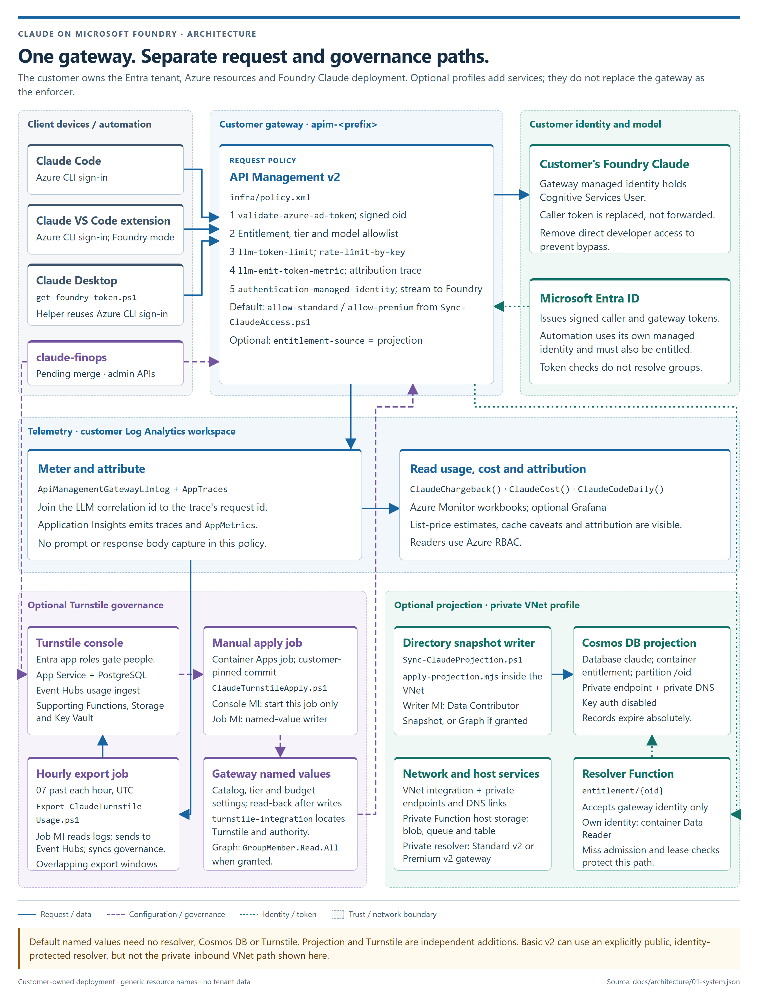
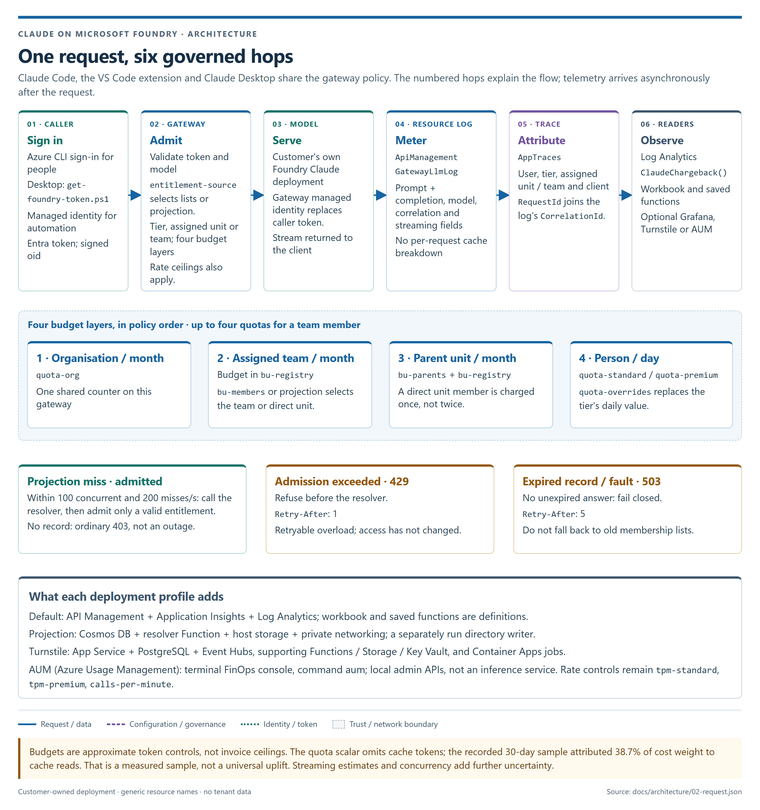
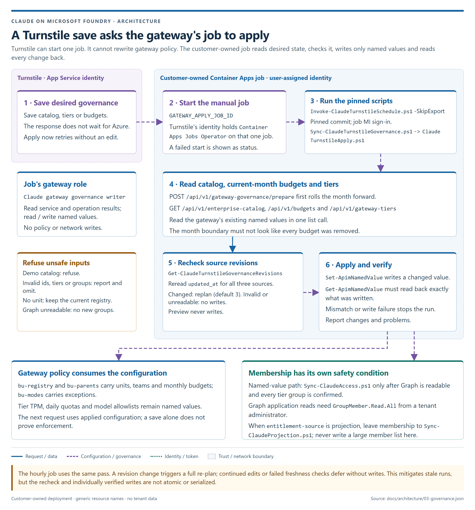
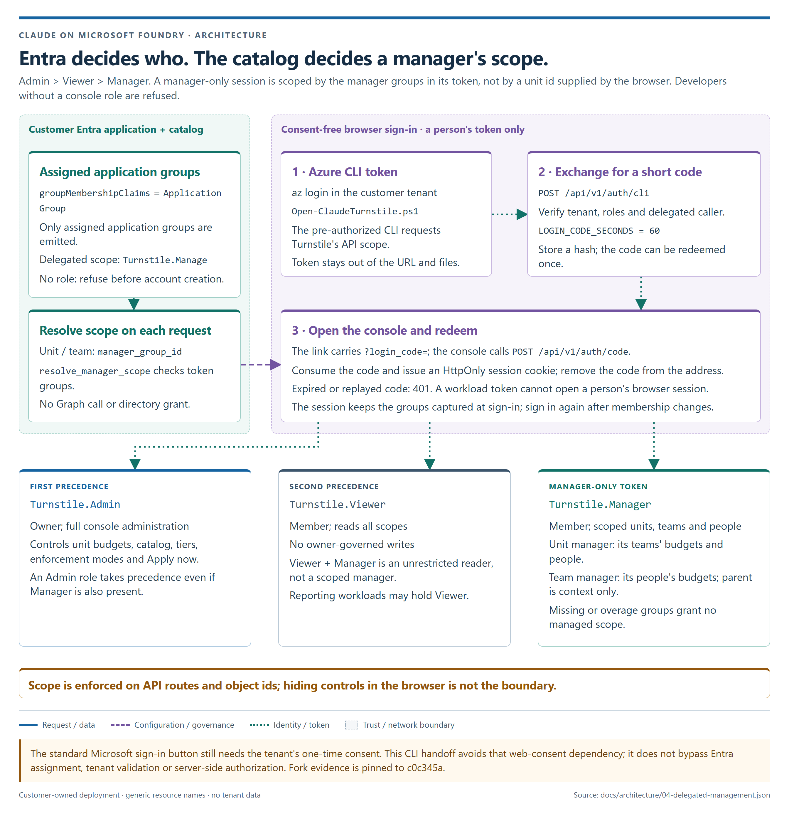
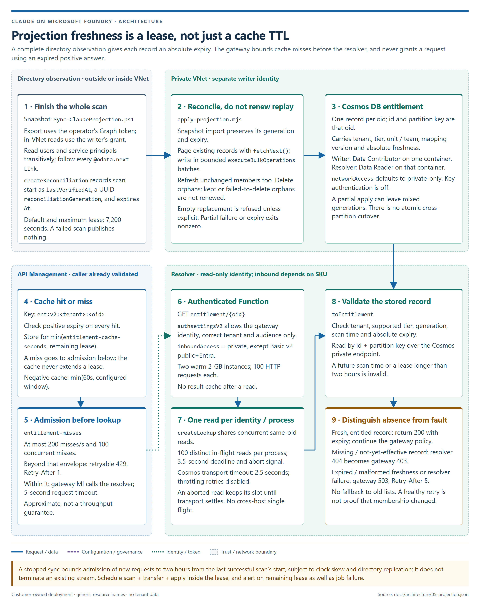
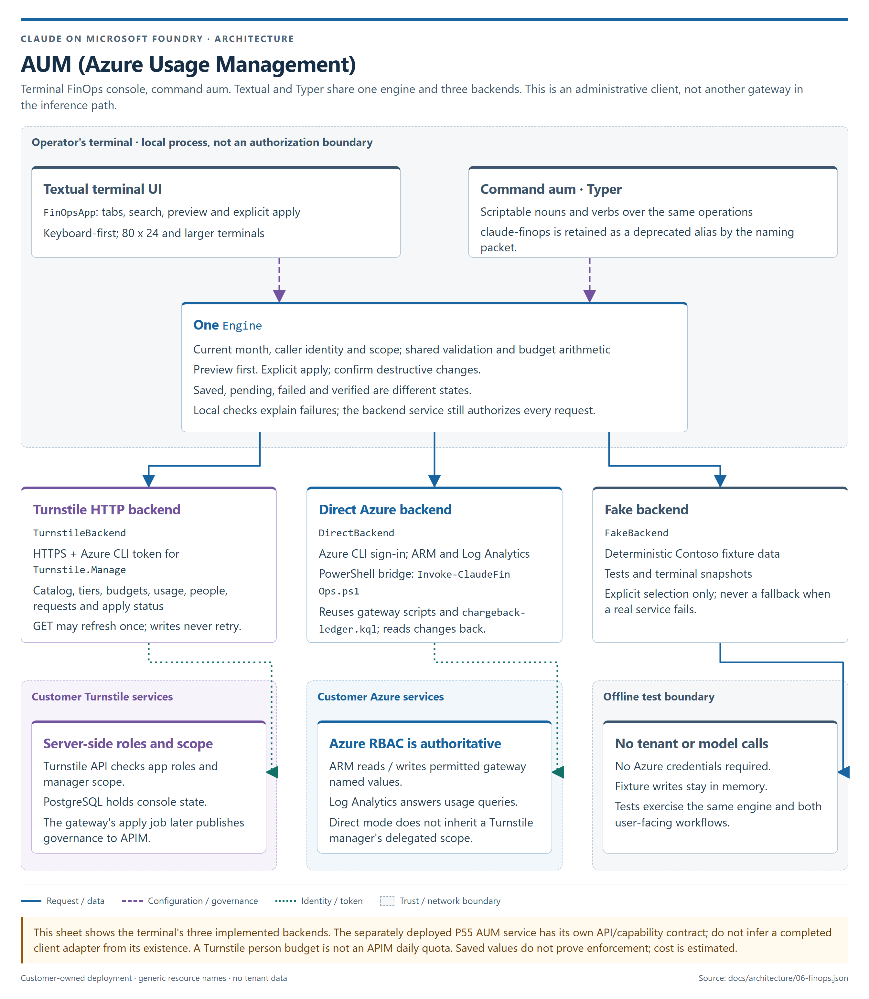
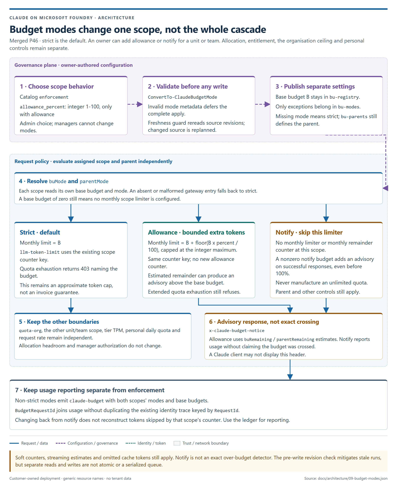
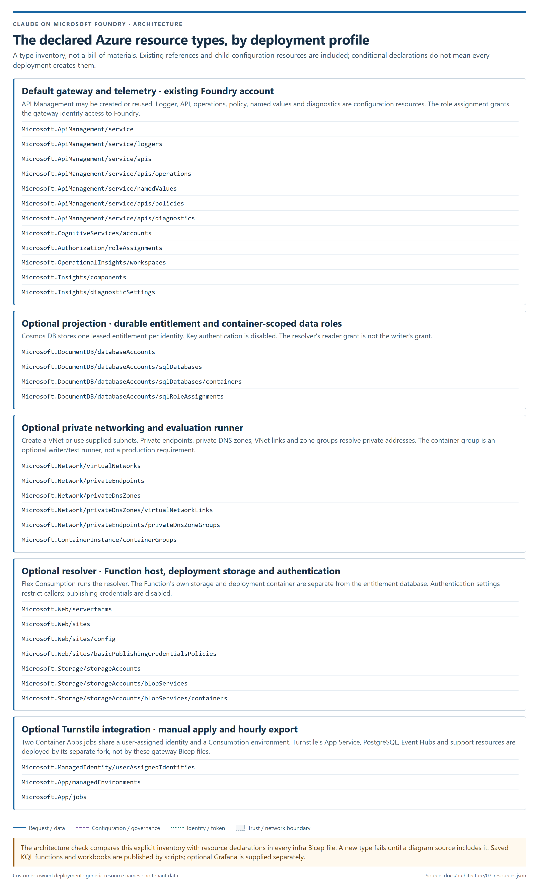

# Architecture of the governed Claude gateway

This article explains how Claude Code, the Claude VS Code extension and Claude Desktop use
the customer's Claude deployment in Microsoft Foundry through Azure API Management. It
also explains the optional entitlement projection, Turnstile governance console and
AUM (Azure Usage Management), the terminal FinOps console. It is a concept article; use the linked how-to guides to deploy or
operate each part.

For current operational evidence, use
[Verify the architecture in the Azure portal](architecture/LIVE-VERIFICATION.md).
It pairs portal inspections with Azure CLI commands and redacted live screenshots.
Its coverage table distinguishes successful live requests and sign-in from configuration
inspection, prior job history and tests still blocked or deliberately not performed.

## Overview

API Management is the enforcement point. It validates the caller's Microsoft Entra token,
resolves entitlement, checks model access and token budgets, and replaces the caller's
token with the gateway's managed identity before calling Foundry. The governance and
reporting tools configure or observe that path; they do not proxy inference.



Source: [01-system.json](architecture/01-system.json).

### Choose the components you need

| Profile | Adds to the deployment | Identity and operational boundary |
|---|---|---|
| **Default: named values** | API Management v2, Application Insights and Log Analytics. Foundry already exists. Workbooks and saved KQL functions are published separately as definitions. | Entra groups are synchronized to gateway named values. No resolver, Cosmos database or Turnstile service is required. |
| **Projection** | Cosmos DB, a resolver Function, Function host/deployment storage, private endpoints and DNS. A writer runs separately to reconcile the directory. | The writer and resolver have different identities and container-scoped data roles. The private-inbound path requires Standard v2 or Premium v2 outbound VNet integration. |
| **Turnstile** | A separate fork deployment: App Service, PostgreSQL, Event Hubs and supporting Functions, Storage, Key Vault and networking. This repository adds the manual apply and hourly export Container Apps jobs. | Entra app roles control console access. The console starts one apply job; the job, not the console, writes gateway named values. |
| **AUM (Azure Usage Management)** | A local Python terminal FinOps console, command `aum`; no new inference service or mandatory Azure resource. The terminal release is merged; the naming packet is staged on branch `aum`. | It uses Turnstile's HTTP API or Direct Azure with the operator's Azure CLI sign-in. A fake backend is for tests, never an outage fallback. |
| **Monthly chargeback reports (P50, pending merge)** | A dedicated reports VNet and Consumption environment, generator/dispatcher/admin jobs, private Blob storage and Azure Communication Services Email. | The reporting identity reads telemetry/configuration and writes reports. A separate administration identity writes configuration only. No Turnstile dependency. |

Projection and Turnstile are independent options. Turning on one does not imply the other.
The default deployment has no additional application database, processor or queue, but
that statement does **not** describe the optional profiles. Use
[`Get-ClaudeBom.ps1`](../scripts/Get-ClaudeBom.ps1) and
[`Get-ClaudeTurnstileBom.ps1`](../scripts/Get-ClaudeTurnstileBom.ps1) for the resources actually
deployed, rather than treating an architecture picture as a resource count or price quote.

## Request path



Source: [02-request.json](architecture/02-request.json). The README's
`images/request-flow.png` is a byte-identical compatibility copy.

1. **Sign in.** Claude Code and the VS Code extension use Foundry mode with Azure
   credentials from the developer's Azure CLI sign-in. The default Desktop setup installs
   [`get-foundry-token.ps1`](../scripts/get-foundry-token.ps1), through a platform shim, as
   its credential helper. It reuses Azure CLI sign-in and writes only the token to stdout.
   Azure automation can use its own managed identity; that identity must also be entitled.
2. **Admit.** [`infra/policy.xml`](../infra/policy.xml) validates the tenant, signature,
   audience and expiry, then uses the signed `oid`. The accepted audiences are
   `https://cognitiveservices.azure.com` and `https://ai.azure.com`.
   `entitlement-source` selects `named-value` or `projection`. Entitlement, tier and the
   requested model are checked before Foundry is called.
3. **Serve.** `authentication-managed-identity` obtains the gateway's Foundry token.
   The policy replaces `Authorization` and deletes `x-api-key`. The existing customer
   Foundry deployment receives the gateway identity, not the developer token.
4. **Meter.** The built-in `ApiManagementGatewayLlmLog` records request-level token usage,
   model and streaming metadata. It is not the custom-metric budget counter.
5. **Attribute.** The outbound `claude-chargeback` trace supplies the user, tier, assigned
   unit or team and raw client string in `AppTraces`. The trace's `Properties.RequestId`
   joins the LLM log's `CorrelationId`. Application Insights operation ids are not that key.
6. **Observe.** Saved functions, workbooks and optional consumers read the Log Analytics
   data. Ingestion is asynchronous; a successful request is not an immediately complete
   reporting window.

### Entitlement and budgets

In the default profile, [`Sync-ClaudeAccess.ps1`](../scripts/Sync-ClaudeAccess.ps1) reads
Entra groups and writes `allow-standard`, `allow-premium` and `bu-members`. Premium takes
precedence over standard. The assigned unit can be a team; `bu-parents` supplies its parent.
The policy does not perform a live Microsoft Graph membership call for each request.

The maximum four budget layers for a team member are, in policy order:

| Order | Counter | Configuration |
|---|---|---|
| 1 | Organisation, monthly | `quota-org`, shared key `claude-org` |
| 2 | Assigned team or direct unit, monthly | Its budget in `bu-registry` |
| 3 | Parent business unit, monthly, when the assignment is a team | `bu-parents` plus the parent's budget in `bu-registry` |
| 4 | Person, daily | `quota-standard` or `quota-premium`, replaced by a valid `quota-overrides` entry |

A direct member of a business unit is not charged twice for that unit. Zero at a unit or
team means its monthly limiter is not set, not a zero-token entitlement. Tier
`tpm-standard` / `tpm-premium` controls run before the daily quota, and
`calls-per-minute` also protects against many small requests. These rate controls are
separate from the four budget layers.

Unit and team limits default to strict. `bu-modes` can add allowance or skip an individual
scope's monthly limiter in notify mode; it does not disable the other layers. See
[budget enforcement modes](#budget-enforcement-modes).

| Failure | Gateway result | What it means |
|---|---|---|
| Missing, invalid or wrong-audience token | 401 | Authentication failed. |
| No entitlement, forbidden model or a required unit is missing | 403 with a specific error | A policy decision, not a resolver outage. |
| Token quota exhausted | 403 naming the organisation, unit or personal budget | Access remains assigned; that budget is spent. |
| Rate ceiling or projection miss admission exceeded | 429 | Retryable throttling. Projection admission returns `Retry-After: 1` before calling the resolver. |
| Expired/invalid projection freshness or resolver fault, with no valid cached answer | 503, normally `Retry-After: 5` | Fail closed. Do not fall back to the old named-value lists. |

Budgets are **approximate token controls**, not hard currency limits. High concurrency and
streaming affect estimates, and the quota scalar excludes cache tokens. The recorded
30-day sample attributed 38.7% of cost weight to cache reads; that is evidence for the
gap, not a universal multiplier. Counters are not globally aggregated across gateways.
See [business-unit budgets](BUSINESS-UNITS.md) and [scale and measured limits](SCALE.md).

### Identity and streaming boundaries

The gateway identity needs `Cognitive Services User` on the Foundry account. To make the
gateway mandatory, remove developers' direct data-plane access to that account and audit
other bypass principals with [`Get-ClaudeBypass.ps1`](../scripts/Get-ClaudeBypass.ps1).
Possessing an Entra token alone is neither entitlement nor proof that direct Foundry
access has been removed.

Group removal becomes effective only after synchronization and, on the projection path,
the relevant cache window. It is not instantaneous token revocation. See
[authentication types](AUTHENTICATION.md) and [client onboarding](ONBOARDING.md).

The policy uses `forward-request timeout="600"` and `buffer-request-body="false"`.
It does not parse the outbound response body for cache categories, because that would
interfere with streaming. `buffer-response` is not explicitly set in this revision;
recheck observed SSE behavior on the chosen tier rather than assuming the deployment
sets it to false.

## Telemetry and chargeback

The default gateway uses a resource diagnostic for the LLM log and an Application Insights
diagnostic for traces and custom token metrics. The shipped diagnostic does not capture
prompt or response bodies. Identity and client metadata still require appropriate
workspace access and retention controls.

[`Publish-ClaudeQueries.ps1`](../scripts/Publish-ClaudeQueries.ps1) publishes
`ClaudeChargeback()`, `ClaudeCost()` and `ClaudeCodeDaily()` from the
[`analytics`](../analytics) sources. [`Publish-ClaudeWorkbook.ps1`](../scripts/Publish-ClaudeWorkbook.ps1)
publishes the workbook; [`Publish-ClaudeGrafana.ps1`](../scripts/Publish-ClaudeGrafana.ps1)
targets an existing Grafana instance.

The request ledger joins usage to identity. Cache reads available through `AppMetrics`
are aggregates, not a per-request cache breakdown; missing per-request cache categories
remain unknown, not zero. Price-based costs remain estimates, not a reconciled Azure
invoice. An unjoined row remains visible as unattributed rather than being silently
discarded. See [monitoring](MONITORING.md), [analytics provenance](adr/0006-ledger-is-the-llm-log.md)
and [financial semantics](adr/0010-financial-semantics.md).

## Private monthly reports and email delivery (P50, pending merge)


Source: [08-chargeback-reports.json](architecture/08-chargeback-reports.json), verified
against the pushed `chargeback-reports` branch at
[`d1a304f`](https://github.com/naveenneog/claude-code-foundry-gateway/tree/d1a304f095274d0542073a616f020d9a0e523e42).
This profile is not merged into this checkout. The
[P50 how-to](https://github.com/naveenneog/claude-code-foundry-gateway/blob/d1a304f095274d0542073a616f020d9a0e523e42/docs/CHARGEBACK-REPORTS.md)
and [ADR-0020](https://github.com/naveenneog/claude-code-foundry-gateway/blob/d1a304f095274d0542073a616f020d9a0e523e42/docs/adr/0020-chargeback-reports.md)
describe deployment, recipient administration and measured limitations.

P50 reads the existing `ClaudeCost()` and `ClaudeChargeback()` saved functions over
Entra-authenticated HTTPS. It is independent of Turnstile and never proxies a model call.
The scheduled default is `0 6 1 * *`: 06:00 UTC on the first day of each month, reporting
the previous UTC calendar month. Month-to-date is an explicit configuration choice.

### Generate and reconcile before publishing

`Invoke-ClaudeChargebackSchedule.ps1` selects the generator, dispatcher or administration
mode. The generator calls `New-ClaudeChargebackReport.ps1`. It aggregates server-side
rather than downloading raw request rows, splitting bounded person pages by hash.
Units including Unassigned must reconcile to workspace totals, and person totals must
reconcile to their unit. Teams are subdivisions, not extra totals to add again.

Partial query results, reconciliation mismatches or changing saved-function definitions
invalidate the report instead of silently publishing incomplete data. A complete run
archives scoped CSV/HTML and a manifest under `runs/<month>/<run>/`. The manifest records
the UTC window, query/artifact hashes, price-book and membership provenance, and budgets
as read at generation time. It does not reconstruct historical budget or tariff changes.
Costs remain the existing saved function's list-price showback; unknown cache-write
categories stay null/empty, not zero.

### Separate private storage from administration

The reports-only VNet has a delegated Container Apps subnet and a private-endpoint subnet.
The dedicated Consumption environment uses that network. Storage has a Blob private
endpoint and `privatelink.blob.core.windows.net` zone/link, disables public network and
shared-key access, and requires HTTPS/TLS 1.2. P50's deployment measured an inherited
policy enforcing private storage; granting a blob data role does not make an off-network
terminal able to reach it. No gateway or Turnstile network is modified.

`configuration/settings.json` lives in a separate, versioned container. ETag conditional
writes refuse stale edits. Allowed recipient domains are required and matched exactly.
Report artifacts, pending `outbox/` items and dispatch state live in the `reports`
container; lifecycle retention defaults to 400 days and is configurable.

| Identity | Access |
|---|---|
| Reporting user-assigned managed identity | Workspace Log Analytics Reader; gateway `namedValues/read` only; configuration-container Blob Data Reader; reports-container Blob Data Contributor. A custom read/write role is scoped to the dedicated ACS resource, with no keys or delete. |
| Separate administration managed identity | Configuration-container Blob Data Contributor only; no workspace or email role. |
| Administrator starting the manual job | Privileged configuration authority, not a role to give report recipients. |

The ACS role is not a fictitious email-send-only role: the inspected provider exposes no
send-only data action for this path. Its residual resource management privilege is
contained on a dedicated ACS resource.

For off-network administration, the manual job accepts a validated, structured
`REPORT_ADMIN_REQUEST`, not arbitrary shell code. It performs Initialize, Recipients,
Settings or Inspect operations. Logs and off-network inspection contain status and counts,
not address lists. Full recipient lists are read from a VNet-connected terminal.

### Pace delivery and recheck recipients

The generator queues recipient hashes and scope, not address lists. The blob-triggered
dispatcher polls every 420 seconds with zero minimum and one maximum execution, so an
empty outbox does not keep a container running. An infinite lease on `state/dispatch.json`
serializes sends; persisted `NextActionUtc` pacing survives process restarts.

Before sending, the dispatcher rereads current configuration, honors recipient removals
and domain restrictions, verifies archived artifact hashes, and sends scoped HTML/CSV
parts through the Entra ACS Email endpoint. Unit recipients receive their unit's report
using BCC. Explicit all-units recipients receive the selected report set. Team-specific
recipient delivery is deferred; sending the parent unit report would widen their scope.
Email contains no SAS or unrestricted download link.

Send/poll operation ids, scope, status and recipient counts are recorded in the run
manifest. An ambiguous send is polled using its existing operation id, not resent as a
new message. Unknown outcomes require inspection. A crashed worker can leave its lease
held; an administrator checks for active executions before explicitly breaking a stale
lease.

Azure-managed domains permit at most 10 sends per hour. At one send and one poll per
message, the 420-second pacing permits about 4.3 completed messages per hour; more polls
are slower. Hundreds of unit reports therefore require a verified custom domain and an
approved quota for timely production delivery. A successful ACS operation is not proof
of inbox placement, and emailed data is outside the archive's retention control.

## Governance apply path



Source: [03-governance.json](architecture/03-governance.json).

When `governanceAuthority=Turnstile`, the console owns desired units, teams, groups,
budgets and tier settings. A save records desired state, then requests a background start
of the job named by `GATEWAY_APPLY_JOB_ID`. A failed start is visible in status; a successful
save is not an assertion that the gateway has changed.

The console's managed identity holds **Container Apps Jobs Operator on that one job**.
The job's user-assigned identity holds **Claude gateway governance writer** at the
gateway. That custom role permits service reads, named-value reads/writes and operation
result reads, not policy, certificate or network changes. The manual and hourly jobs
share the user-assigned identity in
[`turnstile-schedule.bicep`](../infra/turnstile-schedule.bicep).

The manual job runs `Invoke-ClaudeTurnstileSchedule.ps1 -SkipExport`, then
`Sync-ClaudeTurnstileGovernance.ps1`, which invokes the functions in
[`ClaudeTurnstileApply.ps1`](../scripts/ClaudeTurnstileApply.ps1):

1. Prepare the current month through `/api/v1/gateway-governance/prepare` before reading
   budgets, so a not-yet-rolled month does not look like all budgets were removed.
2. Read the configured catalog, budgets and gateway tiers, and the gateway's current values.
3. Calculate changes. Seeded demo catalogs are refused; unsupported tiers, malformed
   ids and unconfirmed groups are reported, not invented. Teams need an applied parent.
   If no applicable unit remains, existing units are preserved.
4. Validate all mode metadata before writing. Invalid `enforcement` or
   `allowance_percent` defers the complete apply with no writes. `bu-modes` is separate
   from the legacy registry.
5. Before applying, compare catalog/tiers and budget-row `updated_at` revisions with a
   fresh read. A changed snapshot restarts planning, including rereading the gateway and
   rechecking groups, up to three times by default. Missing required revisions, a failed
   read or continued edits defer with no writes. Usage and `generated_at` are not revisions.
6. Apply only differences with `Set-ApimNamedValue`, then compare every value returned by
   `Get-ApimNamedValue`. A write error or mismatch fails the run. Without `-Apply`, report only.
7. Refresh named-value membership only when Graph is readable and every tier group is
   confirmed. With unreadable Graph, existing known groups can remain, new unconfirmed
   groups cannot be introduced, and membership is not overwritten from an empty read.
   Tier limits still apply. When the entitlement source is the projection, its own
   reconciliation remains responsible for membership.

The optional Graph application permission is `GroupMember.Read.All`; it requires a tenant
administrator. Console manager scopes do not require that grant.

The hourly job defaults to **07 past each hour, UTC** (`7 * * * *`). It exports a
120-minute window ending 15 minutes before the run, sends usage to Event Hubs and runs the
same governance synchronization. Overlapping export windows are deduplicated by the
Turnstile ingest path. Export failures fail the pass; no automatic job retry is configured.
The next hourly pass or **Apply now** can catch up.

These are individually verified writes, not an atomic transaction or a serialized queue.
The pre-write revision check mitigates stale runs but cannot make separate reads and
writes atomic. Follow the
[Turnstile setup and governance guide](TURNSTILE.md#manage-everything-in-turnstile)
and [ADR-0019](adr/0019-budget-enforcement-modes.md); do not infer a stronger
ordering guarantee from the arrows.

## Delegated management and console sign-in



Source: [04-delegated-management.json](architecture/04-delegated-management.json).
The manager implementation is verified against the
[Turnstile fork at c0c345a](https://github.com/naveenneog/turnstile/tree/c0c345a6009eaada755850ee15f76ddc85bad74f).

`New-ClaudeTurnstileEntraApp.ps1` configures the app roles and
`groupMembershipClaims=ApplicationGroup`. Tokens list groups assigned to this application,
not every group in the directory. Precedence is **Admin > Viewer > Manager**:

| Role | Reach |
|---|---|
| `Turnstile.Admin` | Owner. Controls the catalog, tiers, modes, unit budgets and Apply now. |
| `Turnstile.Viewer` | Member. Reads every scope; cannot perform owner-governed writes. Viewer plus Manager remains an unrestricted reader. |
| `Turnstile.Manager` alone | Scoped member. Catalog `manager_group_id` values are resolved against the token's groups on each request. |
| None | Refused before a console account is written. Developers do not receive console access merely by being entitled to inference. |

A unit manager sees that unit, its teams and direct members and may set its teams' and
people's budgets. A team manager sees its team and people, with the parent only as context,
and may set person budgets. Child allocation still cannot exceed its parent. Routes and
objects outside the manager allowlist are refused server-side. Missing or overage group
claims grant no managed scope. Sessions retain the groups captured at sign-in.

The consent-free sign-in is:

`Azure CLI token -> POST /api/v1/auth/cli -> single-use 60-second code -> ?login_code= -> POST /api/v1/auth/code -> session cookie`

[`Open-ClaudeTurnstile.ps1`](../scripts/Open-ClaudeTurnstile.ps1) implements the handoff.
The CLI is pre-authorized on Turnstile's API. The code is stored hashed and consumed on
redemption; the access token is not put in the browser URL. Expired or reused codes return
401, and workload identities cannot open a person's browser session. Treat the short-lived
link as a credential while valid.

This does not remove the tenant consent requirement for the normal Microsoft web sign-in
button. See [viewers and managers](TURNSTILE.md#viewers-and-managers),
[manager setup](TURNSTILE.md#managers),
[sign-in before consent](TURNSTILE.md#sign-in-before-the-tenant-grants-consent)
and [ADR-0016](adr/0016-delegated-management.md).

## Projection freshness, admission and private networking



Source: [05-projection.json](architecture/05-projection.json).

The projection replaces membership lists that reach the 4,096-character named-value limit.
It does not replace Entra as the source of entitlement. Each Cosmos record is partitioned
by `oid` and carries the tenant, tier, assigned unit/team and freshness:

- `lastVerifiedAt` is the beginning of the directory observation, not the end of the upload.
- `reconciliationGeneration` identifies a complete scan.
- `expiresAt` is an absolute UTC epoch-second expiry. The default and maximum lease is
  7,200 seconds; the configured range is 60 to 7,200 seconds.

The writer follows Graph `@odata.nextLink` pages for users and service principals and
pages existing Cosmos records with `fetchNext()`. Publication starts only after a complete
observation. Snapshot replay preserves the original lease; it cannot renew stale access.
Every retained member is refreshed, even if its tier and unit are unchanged. Kept or
failed-to-delete orphans do not receive a new lease. A partial write can leave mixed
generations, each with its own expiry, and exits nonzero.

Before a resolver call, APIM limits `entitlement-misses` to 200 per second and 100
concurrent. Excess returns retryable 429. These approximate distributed controls bound
the admitted burst; they are not a 500,000-user throughput guarantee.

The resolver's `createLookup` shares concurrent reads for the same identity **within one
process**, with no completed-result cache. It caps distinct in-flight reads at 100,
uses a 3.5-second deadline and abort signal, and retains an aborted operation's slot until
transport settles. Cosmos uses a 2.5-second transport timeout with throttling retries
disabled. The deployment defaults to two warm 2-GB instances with 100 HTTP requests per
instance. There is no cross-instance single-flight lock.

`toEntitlement` distinguishes absent records from invalid ones. No record becomes a
gateway entitlement refusal, while expired or malformed freshness becomes 503. APIM
includes tenant and schema version in the cache key, clips positive caching to the
remaining lease, and checks expiry on every hit. A stopped sync cannot authorize new
requests indefinitely; it does not terminate a stream already admitted.

### Separate network reachability from identity

- Cosmos defaults to `networkAccess=private-only` with key authentication disabled.
- The writer runs where it can reach the Cosmos private endpoint, using container-scoped
  Data Contributor. The resolver has a separate container-scoped Data Reader identity.
- Resolver `authsettingsV2` requires the correct tenant, audience and allowed gateway
  identity before the HTTP function executes.
- Private resolver inbound access requires an APIM Standard v2 or Premium v2 VNet path.
  Basic v2 requires an **explicitly public**, still identity-protected resolver endpoint.
- The private profile also supplies private endpoints and DNS for Function host storage:
  blob, queue and table. Private DNS links and endpoint zone groups are part of the path,
  not optional decoration.

Schedule observation, transfer and apply well inside the lease. Alert on failures and
remaining lease. Existing unleased records need a fresh reconciliation before the stricter
reader and policy are deployed. See
[the private deployment how-to](SECURE-PROJECTION.md),
[the migration and measurement guide](SCALE.md) and
[ADR-0017](adr/0017-projection-freshness-and-admission.md).

## AUM (Azure Usage Management) - terminal FinOps console



Source: [06-finops.json](architecture/06-finops.json), verified against the local
[`cli/finops`](../cli/finops) implementation merged to main at `c7f0a29`. The design is
recorded in [ADR-0018](adr/0018-terminal-finops.md).

The product is **AUM - Azure Usage Management**, a terminal FinOps console with command
**`aum`**. The naming packet on branch `aum` adds that command and retains `claude-finops`
as a deprecated alias. Its entry points were verified at `a1f0836`; that packet is not
yet merged into this checkout. The terminal implementation itself is no longer pending.
Follow the [AUM terminal guide](CLI-FINOPS.md), whose existing URL remains valid as a
pointer when the guide moves to `docs/AUM.md`.

The Textual `FinOpsApp` and Typer commands share `Engine` for period selection, scope,
budget validation, previews and explicit writes. The backend is a choice, not an
automatic fallback:

- **Turnstile HTTP:** Azure CLI token, role/scope checks at the server, bounded API reads
  and explicit writes. A failed GET can refresh its token once; writes are not retried.
- **Direct Azure:** ARM, Log Analytics and `Invoke-ClaudeFinOps.ps1`, reusing the
  repository's gateway scripts and chargeback query. Azure RBAC is authoritative; this
  is not an alternate implementation of Turnstile's delegated manager scope.
- **Fake:** deterministic Contoso fixtures for tests and terminal snapshots; no tenant,
  model or credential calls.

A preview is not a write. A saved Turnstile value is not a completed gateway apply.
Turnstile person budgets are not the gateway's per-person daily overrides. These distinctions
belong in both terminal faces. The [AUM how-to](CLI-FINOPS.md) describes installation,
configuration, commands and the first release's scope.

## Budget enforcement modes



Source: [09-budget-modes.json](architecture/09-budget-modes.json). The implementation is
merged in main; [ADR-0019](adr/0019-budget-enforcement-modes.md) records its contract.

`bu-registry` retains base monthly budgets. The separate `bu-modes` map holds exceptions
for a unit or team. Missing entries mean strict. The owner controls modes; they do not
alter manager scope or allocation rules.

| Mode | That scope's monthly limiter | Response behavior |
|---|---|---|
| **Strict** | Uses the base budget and existing counter key | Quota exhaustion refuses with 403. |
| **Allowance** | Base plus the floored 1-100 percent allowance, capped at the integer maximum | The extended quota still refuses. Estimated remaining tokens can cause an advisory after the base budget. |
| **Notify** | Skips only this scope's monthly limiter; there is no monthly remaining counter there | A successful response with a nonzero notify budget carries a usage advisory, including before 100 percent. |

The assigned scope and its parent resolve modes independently. The organisation ceiling,
the other scope, personal daily quota, tier TPM and request-rate controls remain in force.
A malformed gateway map entry falls back to strict; invalid authored Turnstile metadata
is refused before the apply writes anything.

`x-claude-budget-notice` is advisory. It does not prove an exact budget-crossing request,
invoice cost or that a Claude client displayed a warning. The `claude-budget` trace carries
base budgets and modes and uses `BudgetRequestId`; it does not reuse the identity trace's
`RequestId` and duplicate that join. The ledger remains the reporting source.

Switching a scope from notify back to a limiting mode does not reconstruct usage that
was not counted while its limiter was skipped. Streaming estimates, concurrency and
missing cache tokens still limit enforcement precision. See
[business-unit budget modes](BUSINESS-UNITS.md) for commands and measured mode behavior.
The architecture capture's live scope remains the explicit
[verification coverage](architecture/LIVE-VERIFICATION.md#live-coverage-and-limitations);
it does not claim an additional live mode mutation run.

## Azure resource inventory



Source: [07-resources.json](architecture/07-resources.json). This explicit list includes
existing references and child configuration resources. It is not the live deployment's
resource count. Turnstile's separate fork has its own infrastructure; saved functions and
workbooks are published by scripts rather than by these Bicep files. The P50 diagram
separately displays five additional resource types from its pinned branch: custom role
definitions, Storage management policies and the three Communication/Email resource types.
These are not claimed as resources in the current default deployment.

## Keep architecture current after every feature

The sources are JSON under [`docs/architecture`](architecture), one file per diagram.
The layout is deterministic HTML/SVG with real code identifiers, rendered by the existing
Playwright dependency. No image-generation service or additional npm dependency is used.
[ADR-0021](adr/0021-source-backed-architecture.md) records this choice.

From the repository root:

```powershell
npm ci
node guide/render-architecture.mjs
pwsh -NoProfile -File tests/Test-Architecture.ps1
```

The single render command discovers every spec, checks its labels and resource coverage,
renders at device scale factor 2, checks for clipped text, writes the PNGs and records a
SHA-256 manifest. It keeps the README's `docs/images/architecture.png` and
`docs/images/request-flow.png` copies byte-identical to their canonical images.

### Add a diagram for a new feature

1. Add **one** `docs/architecture/<number>-<feature>.json` file. Start with an existing
   `flow` spec: set a unique `id`, title, subtitle, width/height, output path, nodes and
   edges. A node has `id`, `x`, `y`, `w`, `h`, `tone`, `title` and `lines`. Groups draw
   trust/network boundaries; edge `kind` is `data`, `control` or `identity`, with explicit
   coordinate `points`. Use the existing palette and readable text sizes.
2. Put implementation paths in `sources`. Bind every code label with `[[key]]` and an
   `identifiers` entry: `label`, `source`, and an exact `match` in that file.
   File labels use `kind: "file"` and name their own source. Prefer a declaration or
   executable use as the match, not prose that could outlive the code.
3. If the feature adds an Azure resource type, put the exact type in an inventory
   `sections[].types` list, or draw a `[[key]]` label with `kind: "resource"` bound to its
   Bicep declaration. A code-backed resource label must match a real declaration, not
   a commented example. Existing, conditional and child resources all count.
4. Add the image to this article with an explanation of components, identities, data
   flow, failures and deployment-profile changes. Run the render command. Open **every**
   changed image and check labels, arrows, boundaries and readability before committing.
5. Run the architecture test and the packet gate. Commit the source, pictures, manifest
   and article together. A new diagram does not require editing the generator or a registry.

The P50 diagram is an example of adding one spec without changing the diagram registry:
it carries pinned implementation witnesses while pending merge, including rendered
resource-type labels. When those files become local, the checker uses them and requires
a new render. Do not represent a pending path as already deployed.

### What the check proves

`Test-Architecture.ps1` is registered in `Test-All.ps1`. It runs offline with Node and no
browser, credentials, Git history or network dependency. The manifest binds each image
to its spec, shared renderer/layout, lockfile and implementation inputs. Text hashes
normalize BOM/CRLF differences; PNG hashes cover the actual image bytes.

It rejects stale sources or pixels, missing or orphan images/sources, pictures no
document references, broken code-label witnesses, duplicate/unsafe output paths, junction
escapes and unrepresented Azure resource types. Its isolated mutations prove those failures without
editing the real sources; commented Bicep examples and line-ending conversion are
positive controls.

Repeated source and path reads are cached only inside one synchronous check and discarded
on return, including on an exception. A later mutation gets a new snapshot, so performance
does not hide edits between checks. `Test-Architecture.ps1` runs in the parallel lane:
it does not use Azure CLI state or scan the entire working tree, and every mutation uses
a uniquely named copy in the ignored `.shots-entra` area, never a repository source file.

The current main runner follows [ADR-0025](adr/0025-parallel-test-suite.md): isolated
parallel checks and complete mutation shards restored the 30-minute gate command budget.
That supersedes [ADR-0024](adr/0024-test-suite-time-budget.md)'s temporary 60-minute
budget. Use the merged contract, not a worktree-local timeout change.

Live screenshots are separate from deterministic diagrams. Current portal requirements
are in `guide/captures/architecture.json` for the lead-operated batch after fresh sign-in;
the earlier direct portal entry point is retired. Discovery choices remain runtime inputs.
Pending batch ids and final output paths are listed in the verification guide. Non-portal
console capture uses an isolated browser and a consent-free code, with management writes
blocked. Publication requires reviewed image ids. Hidden authentication/input values are
not rewritten. These checks protect the evidence pipeline; a screenshot is not a
replacement for a successful flow test.

The Turnstile fork carries small, pinned upstream code witnesses inside its spec. These
are an explicitly versioned external contract, **not a live check of another repository's
branch**. AUM's implementation labels now refer to local code; the merge invalidated the
old manifest as intended. The command rename is separately recorded as pinned naming
evidence until its packet merges. Re-render after that integration, and review and repin
fork witnesses when the external dependency changes. P50's pending implementation and
resource declarations use the same pinned-witness mechanism; its actual files take over
when merged. Resource types backed by a pinned external declaration are explicitly
distinguished from the current local Bicep inventory.

The architecture image ownership check covers `docs/images/architecture/` and the two
legacy PNG aliases, not `docs/images/finops/*.svg`. Those SVGs are terminal snapshot-test
baselines; an unreferenced baseline is not an orphan architecture diagram.

Hashes detect drift; they cannot prove that an explanation is semantically correct.
Review behavior against the implementation whenever a feature changes a component,
flow, identity, schedule or network path. PNGs are repeatable with the same locked
Playwright/browser and installed fonts; cross-platform font rasterization can differ
without changing the architecture.
