# Architecture of the governed Claude gateway

This article explains how Claude Code, the Claude VS Code extension and Claude Desktop use
the customer's Claude deployment in Microsoft Foundry through Azure API Management. It
also explains the optional entitlement projection, Turnstile governance console and
AUM (Azure Usage Management), the terminal FinOps console. It is a concept article; use the linked how-to guides to deploy or
operate each part.

For current operational evidence, use
[Verify the architecture in the Azure portal](architecture/LIVE-VERIFICATION.md).
It pairs portal inspections with Azure CLI commands and redacted live screenshots.
Its coverage table distinguishes successful live requests and sign-in from configuration
inspection, prior job history and tests still blocked or deliberately not performed.

## Overview

API Management is the enforcement point. It validates the caller's Microsoft Entra token,
resolves entitlement, checks model access and token budgets, and replaces the caller's
token with the gateway's managed identity before calling Foundry. The governance and
reporting tools configure or observe that path; they do not proxy inference.

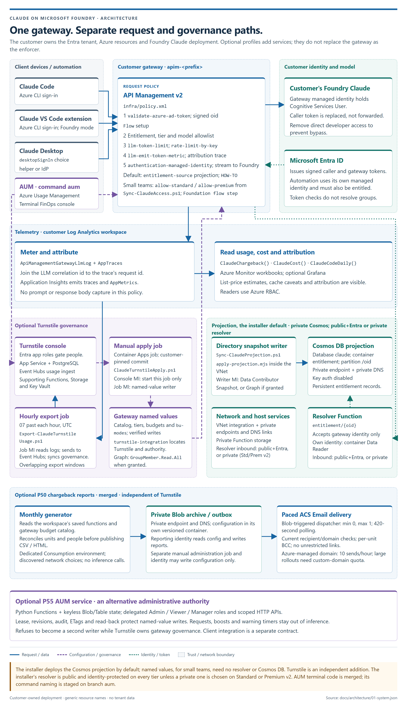

Source: [01-system.json](architecture/01-system.json).

### Choose the components you need

| Profile | Adds to the deployment | Identity and operational boundary |
|---|---|---|
| **Default: named values** | API Management v2, Application Insights and Log Analytics. Foundry already exists. Workbooks and saved KQL functions are published separately as definitions. | Entra groups are synchronized to gateway named values. No resolver, Cosmos database or Turnstile service is required. |
| **Projection** | Cosmos DB, a resolver Function, Function host/deployment storage, private endpoints and DNS. A writer runs separately to reconcile the directory. | The writer and resolver have different identities and container-scoped data roles. Cosmos stays private. Standard v2 and Premium v2 use a private resolver; Basic v2 uses a public resolver endpoint restricted by Microsoft Entra to the gateway managed identity. |
| **Turnstile** | A separate fork deployment: App Service, PostgreSQL, Event Hubs and supporting Functions, Storage, Key Vault and networking. This repository adds the manual apply and hourly export Container Apps jobs. | Entra app roles control console access. The console starts one apply job; the job, not the console, writes gateway named values. |
| **AUM (Azure Usage Management)** | A local Python terminal FinOps console, command `aum`; no new inference service or mandatory Azure resource. The terminal release is merged; the naming packet is staged on branch `aum`. | It uses Turnstile's HTTP API or Direct Azure with the operator's Azure CLI sign-in. A fake backend is for tests, never an outage fallback. |
| **Monthly chargeback reports (P50)** | A separate Consumption environment, generator/dispatcher/admin jobs, discovered existing or explicit new VNet, private Blob storage and Azure Communication Services Email. | The reporting identity reads telemetry/configuration and writes reports. A separate administration identity writes configuration only. No Turnstile dependency. |
| **AUM service (P55)** | Optional Python Functions, keyless Blob/Table state, scoped administrative API and timers. Network, redundancy, warm capacity and telemetry are explicit priced choices. | An independent administrative authority; it refuses gateway writes while Turnstile owns them. It does not proxy inference or make an unimplemented client adapter complete. |
| **USD budget reconciliation (P21/P59)** | Two preserved named values, a five-minute timer in the optional AUM service, and an on-demand script. | Dated decimal tariffs and observed-category spend become gateway stops. The timer uses the service identity/lease/audit; Direct uses Azure CLI and ETags. Neither writes while Turnstile owns governance. |

Projection and Turnstile are independent options. Turning on one does not imply the other.
The default deployment has no additional application database, processor or queue, but
that statement does **not** describe the optional profiles. Use
[`Get-ClaudeBom.ps1`](../scripts/Get-ClaudeBom.ps1) and
[`Get-ClaudeTurnstileBom.ps1`](../scripts/Get-ClaudeTurnstileBom.ps1) for the resources actually
deployed, rather than treating an architecture picture as a resource count or price quote.

`Start-ClaudeGateway.ps1` is the guided orchestration path over these same
components. It discovers live resources, asks the step modules' questions once,
prints one combined review and fingerprint, applies steps in dependency order,
writes the decision record after each completed step, verifies, and generates
`onboarding/HOW-TO-USE.md`. It does not replace API Management, Foundry,
Turnstile, AUM or the reporting jobs; it coordinates their setup and handover.


## Lean installer phase 0

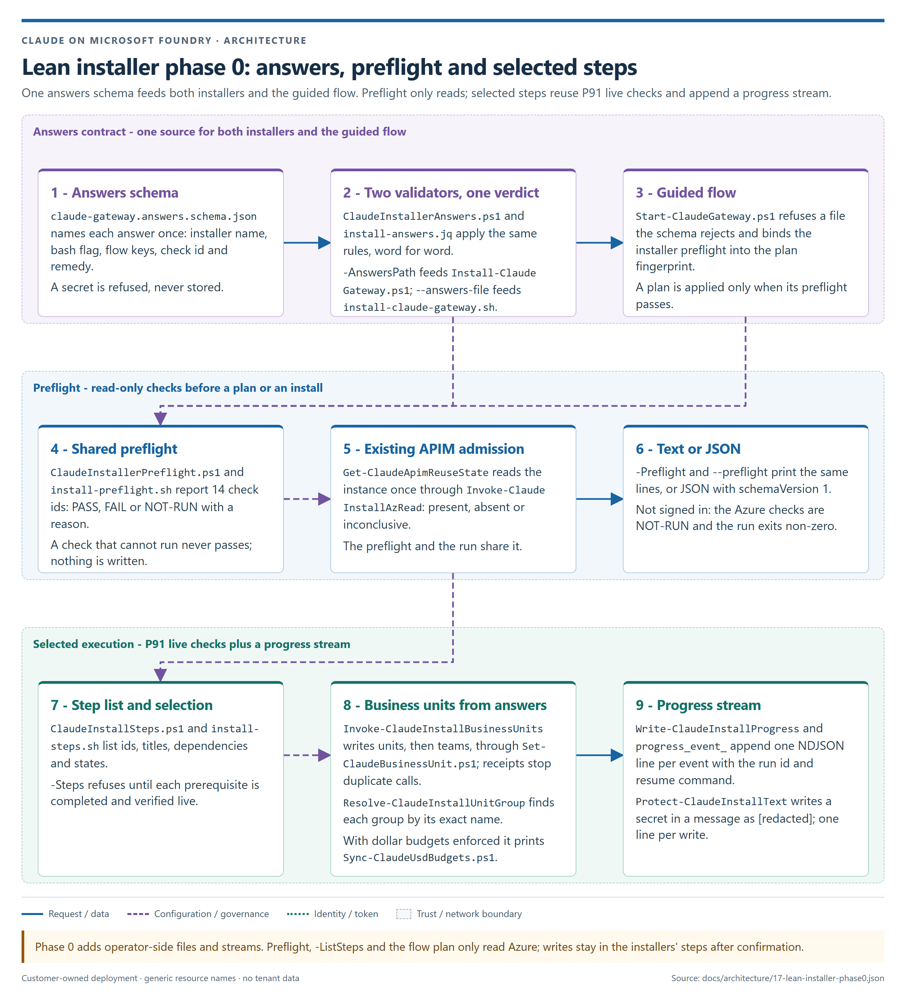

Source: [17-lean-installer-phase0.json](architecture/17-lean-installer-phase0.json);
[ADR-0047](adr/0047-lean-installer-phase-0.md).

Phase 0 adds operator-side files and streams. Azure writes stay in the installers' steps after the
confirmed summary; the preflight, `-ListSteps` and the guided flow's plan only read.

## Installer UI

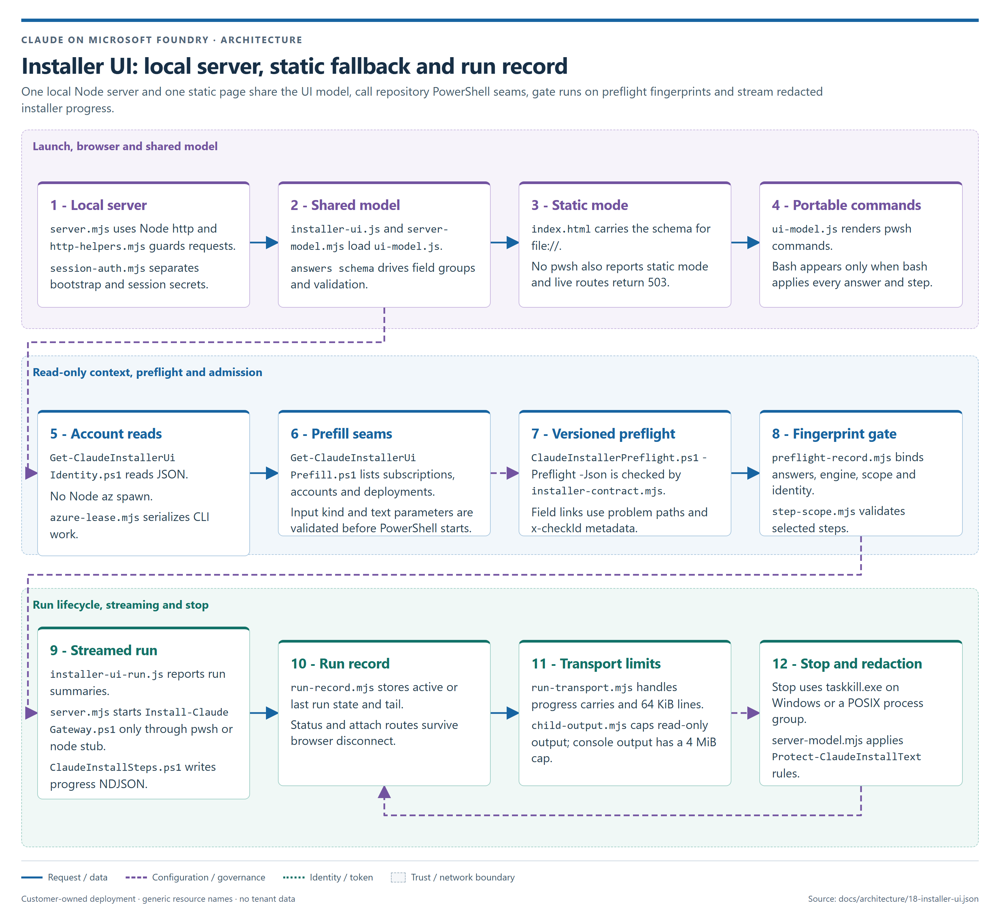

Source: [18-installer-ui.json](architecture/18-installer-ui.json);
[Installer UI](INSTALLER-UI.md); [ADR-0048](adr/0048-installer-ui-local-server.md).

The installer UI adds an operator-side local server and static page. It adds no Azure resource and no
hosted control plane. `tools/installer-ui/server.mjs` owns the HTTP routes, local session controls,
PowerShell child process calls and idle lifecycle (`tools/installer-ui/server.mjs:51-127`;
`tools/installer-ui/server.mjs:179-203`; `tools/installer-ui/server.mjs:297-547`). `tools/installer-ui/http-helpers.mjs` owns Host, cookie,
CSRF, same-origin and JSON-body helpers (`tools/installer-ui/http-helpers.mjs:13-30`;
`tools/installer-ui/http-helpers.mjs:61-119`). The browser, server and tests share `tools/installer-ui/ui-model.js` through
`tools/installer-ui/server-model.mjs`, command and preflight rendering is split into
`tools/installer-ui/installer-ui-render.js`, and the UI model's copied address defaults are checked
against `scripts/ClaudeGatewayAddressInput.ps1`; the static page serves the same `index.html` bytes
as the live server (`tools/installer-ui/installer-ui-render.js:7-109`;
`tools/installer-ui/ui-model.js:155-161`;
`scripts/ClaudeGatewayAddressInput.ps1:27-28`; `tools/installer-ui/server.mjs:336`;
`tools/installer-ui/server-model.mjs:77-91`; `tests/installer-ui-structure.test.mjs:30-31`).

The first page load consumes the URL token and `tools/installer-ui/session-auth.mjs` issues a
separate session cookie secret, so the bootstrap token is not a reusable API credential
(`tools/installer-ui/session-auth.mjs:4-13`; `tools/installer-ui/server.mjs:309-325`).

Azure context and prefill reads go through `scripts/Get-ClaudeInstallerUiIdentity.ps1` and
`scripts/Get-ClaudeInstallerUiPrefill.ps1`, not Node-to-`az` calls. Installer execution stays in
`Install-ClaudeGateway.ps1`, with selected steps, `-ProgressPath` and the existing redaction table.
The Node server starts only the configured PowerShell command, a Node test stub through
`process.execPath` or `taskkill.exe` for Windows stop (`tools/installer-ui/server.mjs:25-27`;
`tools/installer-ui/server.mjs:51-108`; `tools/installer-ui/ui-model.js:585-605`; `tools/installer-ui/server-model.mjs:21-42`;
`tests/installer-ui-structure.test.mjs:69-96`).
`tools/installer-ui/azure-lease.mjs` serializes identity, prefill, preflight and run admission so the
server has one Azure CLI-producing operation at a time (`tools/installer-ui/azure-lease.mjs:1-89`;
`tools/installer-ui/server.mjs:205-209`; `tools/installer-ui/server.mjs:443`).

Preflight admission is fingerprinted by `tools/installer-ui/preflight-record.mjs`; a run needs a
stored PASS for the same answers, a covering step scope and the same identity snapshot
(`tools/installer-ui/preflight-record.mjs:28-37`; `tools/installer-ui/preflight-record.mjs:46-64`;
`tools/installer-ui/server.mjs:406-414`; `tools/installer-ui/server.mjs:443-456`).
`tools/installer-ui/step-scope.mjs` validates selected step ids against the producer step list before
the Azure lease is requested (`tools/installer-ui/step-scope.mjs:1-37`;
`tools/installer-ui/server.mjs:386-390`; `tools/installer-ui/server.mjs:434-443`).
Versioned installer-interface checks live in `tools/installer-ui/installer-contract.mjs`, so malformed
step lists and preflight payloads fail closed and malformed progress events become stream errors
(`tools/installer-ui/installer-contract.mjs:12-17`; `tools/installer-ui/installer-contract.mjs:31-116`;
`tools/installer-ui/installer-stream.mjs:61-68`).

Run state lives in `tools/installer-ui/run-record.mjs`, not in a browser connection. `GET
/api/run/status` reports the active or last run, `GET /api/run/attach?after=<seq>` replays the tail
and follows live events, and `POST /api/run/stop` stops the child process tree. `tools/installer-ui/run-transport.mjs`
handles UTF-8 carries, progress-file offsets, NDJSON writes and backpressure. The server caps console
bytes and line bytes before publishing output (`tools/installer-ui/run-record.mjs:10-127`;
`tools/installer-ui/server.mjs:357-367`; `tools/installer-ui/server.mjs:517-530`;
`tools/installer-ui/run-transport.mjs:5-91`; `tools/installer-ui/installer-stream.mjs:6-7`;
`tools/installer-ui/installer-stream.mjs:23-38`; `tools/installer-ui/installer-stream.mjs:57-60`; `tools/installer-ui/installer-stream.mjs:70-74`).
Read-only children use `tools/installer-ui/child-output.mjs` for UTF-8 decoding and a 1 MiB
stdout/stderr cap. Streaming runs keep a 4 MiB console cap and a 64 KiB line cap for console and
progress lines (`tools/installer-ui/child-output.mjs:3-60`; `tools/installer-ui/server.mjs:163`;
`tools/installer-ui/installer-stream.mjs:6-7`; `tools/installer-ui/installer-stream.mjs:23-75`; `tools/installer-ui/run-transport.mjs:28-67`).

**Answers schema.** [`schemas/claude-gateway.answers.schema.json`](../schemas/claude-gateway.answers.schema.json)
names each answer once, by its installer parameter, with the programs that apply it (`x-appliedBy`),
its bash flag (`x-bashFlag`), its guided-flow keys (`x-flowKeys`) and the preflight check that reports
a problem with it (`x-checkId`). `scripts/ClaudeInstallerAnswers.ps1` and `scripts/install-answers.jq`
read it and report the same problems word for word (ADR-0047 decision 2). The schema lists no secret:
`x-secrets` names `AddressCertificatePassword`, which an answers file is refused for holding.

**Preflight.** `-Preflight` and `--preflight` report the 14 checks that `x-preflightChecks` lists, as
text or as JSON with `schemaVersion`, `installer`, `answersSchemaVersion`, `result` and `checks`
(`scripts/ClaudeInstallerPreflight.ps1:125-201`, `scripts/install-preflight.sh:222-286`). Each check is
PASS, FAIL or NOT-RUN with a reason. A check starts NOT-RUN with reason `not-evaluated`, which fails the
preflight, and is PASS only where a branch passes it with a message (ADR-0047 decision 5). Its reads go
through the P91 verdict readers, and the API Management reads are the ones the run's reuse path makes
(`Get-ClaudeApimReuseState`, `scripts/ClaudeInstallerPreflight.ps1:22-43`). The guided flow applies an
approved plan only when this result is PASS (ADR-0047 decision 9).

**Progress stream.** `-ProgressPath` and `--progress-file` append one JSON object per line
(`scripts/ClaudeInstallSteps.ps1:29-61`, `scripts/install-steps.sh:24-45`):

| Key | Value |
|---|---|
| `schemaVersion` | `1` |
| `time` | UTC, `yyyy-MM-ddTHH:mm:ssZ` |
| `runId` | The install checkpoint's run id, 32 hexadecimal digits |
| `stepId` | A step id of ADR-0046, or empty for an event of the whole run |
| `event` | `started`, `completed`, `skipped-verified`, `warning`, `failed` or `refused` |
| `message` | `<step title>: started`, `completed`, `verified live, skipped`, `incomplete` or `failed: <reason>`; a refusal's line starts with `Refused:` |
| `resumeCommand` | The command that resumes the run, on `warning` and `failed`; otherwise empty |

Both installers write the same events with the same messages for the steps both run. Each line is one
write. A JWT, `Bearer <token>` or a named secret such as `sig=` or `password:` in a message or resume
command is written as `[redacted]`, and the preflight's messages and remedies pass the same rules: both
installers hold one rule table (`Protect-ClaudeInstallText`, `scripts/ClaudeInstallResume.ps1:46-54`;
`redact`, `scripts/install-checkpoint.sh:36-37`; ADR-0047 decision 12). The same rules apply to each line
either installer prints from an error or a refusal, and to the error output of the Azure CLI calls whose
output the run shows (`Invoke-ClaudeInstallAzShown`, `scripts/ClaudeInstallResume.ps1:20-33`; `ckpt_shown_`,
`scripts/install-checkpoint.sh:47-52`). A file
that cannot be written refuses the run at startup, before any Azure call, and no event is written before
that check passes (`scripts/ClaudeInstallSteps.ps1:19-27`, `scripts/install-steps.sh:134-144`).

## Optional company hostname

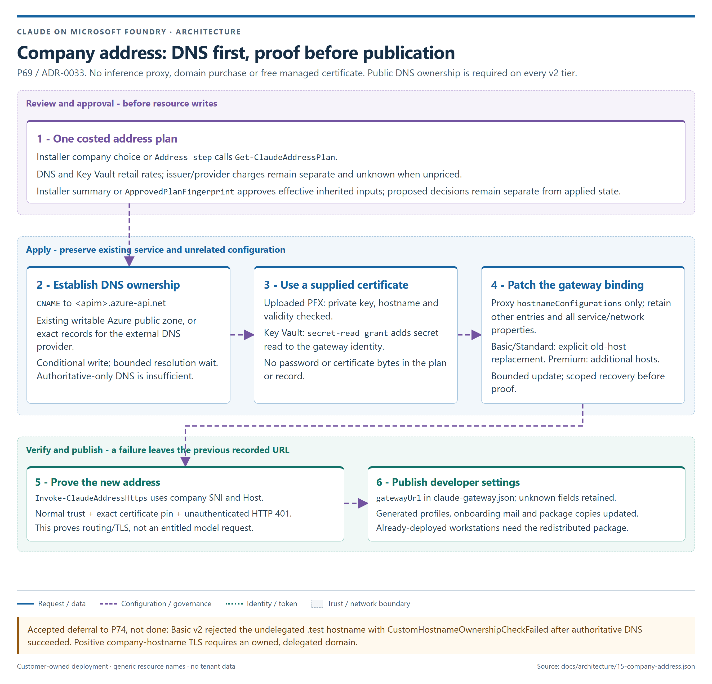

Source: [15-company-address.json](architecture/15-company-address.json);
[ADR-0033](adr/0033-company-address.md).

The address path adds no inference proxy. Azure DNS maps the company hostname
to the same gateway. A supplied PFX is uploaded to APIM, or the gateway's
system-assigned identity reads the certificate's backing secret from Key Vault.
The address script patches only the hostname collection, preserving other
bindings and service/network properties. The decision record and generated
handover artifacts change only after a DNS/TLS gateway proof. Public DNS
ownership remains required; an authoritative-only `.test` zone was rejected
on the isolated Basic v2 gateway ([U30](UNKNOWNS.md#u30--the-company-address--closed-2026-09-28)).
The lead deferred the positive delegated-domain proof to P74. Proposed decisions
are separate from applied state; a failed replacement has a separately recorded,
unverified receipt for a new scoped recovery review. Deadline-bound workers
include native reads and clean their private files when cancelled.

## Model lifecycle administration

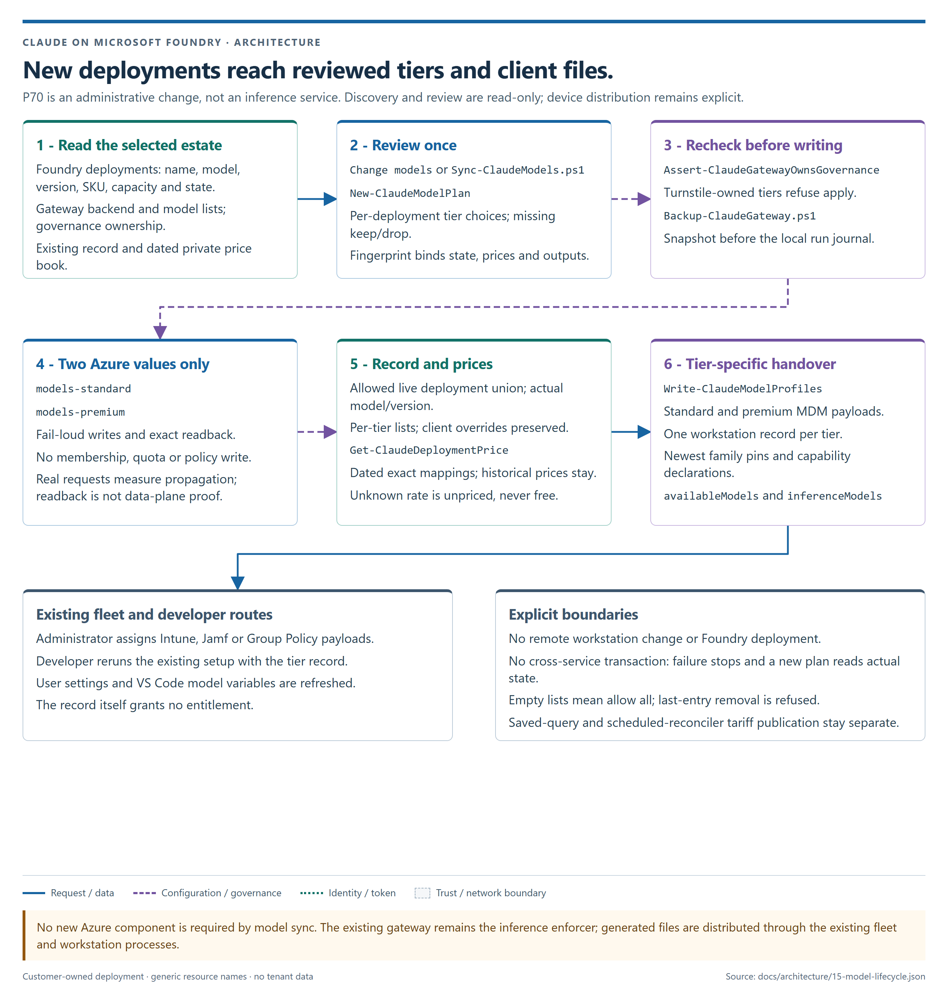

Source: [15-model-lifecycle.json](architecture/15-model-lifecycle.json);
[ADR-0034](adr/0034-model-lifecycle.md). The Change-only model step introduces no
Azure resource or new inference path. It snapshots before writes and refuses
Turnstile-owned tiers. Client-file generation is separate from MDM assignment
and a developer rerunning setup. Unpriced models remain visible; publication
of a changed tariff to reporting and scheduled reconcilers is a separate
financial operation.
Raw deployment identities are validated before publisher filtering. The
review fingerprint includes all current profile/record renderer dependencies,
not just the top-level generator. The installer persists the same per-tier
lists that later model changes use, and both workstation setup implementations
remove aliases for families that are no longer selected.

## Install checkpoint and resume

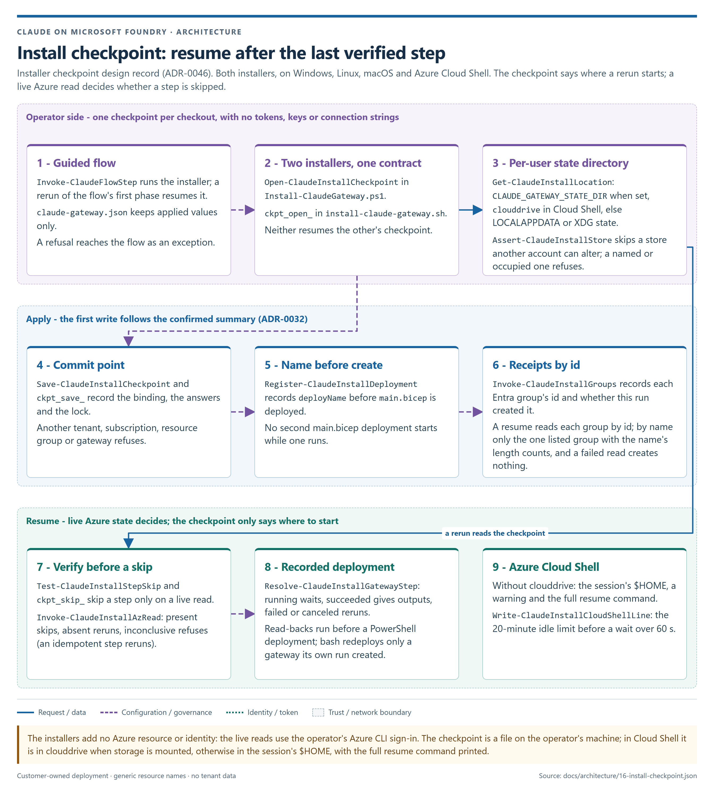

Source: [16-install-checkpoint.json](architecture/16-install-checkpoint.json);
[installer checkpoint design record (ADR-0046)](adr/0046-installer-checkpoint-and-resume.md); [Setup](SETUP.md#resume-after-a-failure).

The install checkpoint is an operator-side data store: one JSON file per checkout in
a per-user state directory on the machine or Cloud Shell session that runs the
installer ([store and location](adr/0046-installer-checkpoint-and-resume.md#1-store-and-location)). It holds the binding
(tenant, subscription, resource group, gateway), the non-secret answers, each step's
state and input hash, and receipts: deployment names, Entra group ids, the role
assignment id, the Desktop client id and the projection resolver app id
([schema](adr/0046-installer-checkpoint-and-resume.md#4-schema-version-1), [receipts](adr/0046-installer-checkpoint-and-resume.md#11-receipts)). It holds no tokens,
keys or connection strings, and the checkpoint test suites check that
([no secrets](adr/0046-installer-checkpoint-and-resume.md#15-no-secrets)). The decision record
`onboarding/claude-gateway.json` still holds applied values only
([ADR-0030](adr/0030-guided-flow.md)).

- **Components.** `scripts/ClaudeInstallCheckpoint.ps1` and
  `scripts/install-checkpoint.sh` keep the run state, the lock and the answers;
  `scripts/ClaudeInstallStore.ps1` and `scripts/install-store.sh` place the store
  and decide whether it is trusted; `scripts/ClaudeInstallResume.ps1` and
  `scripts/install-resume.sh` hold the live reads and step actions. Each installer
  resumes only its own checkpoint
  ([resume across installers](adr/0046-installer-checkpoint-and-resume.md#13-resume-across-installers)).
- **Identities.** The checkpoint adds no Azure resource, identity or role. The live
  reads run under the operator's Azure CLI sign-in, as the installers' other calls do.
- **Data flow.** The first write follows the confirmed summary
  ([ADR-0032](adr/0032-guided-flow-starts-at-once.md)), and each step records its
  state. The deployment name is recorded before `az deployment group create`
  ([deployments](adr/0046-installer-checkpoint-and-resume.md#10-deployments)). A rerun skips a step only when a live read
  returns present; absent reruns the step, and inconclusive refuses unless the step
  is idempotent ([verification before a skip](adr/0046-installer-checkpoint-and-resume.md#7-verification-before-a-skip)).
  Receipt values are checked on read, before they reach `az` as arguments, and a
  receipt is used only when the live object it names is the one the run recorded:
  the group listed under the configured name, the role assignment of Cognitive
  Services User on the Foundry account for the gateway's identity, the resolver app
  by its name, the Desktop app by its `appId`
  ([receipts](adr/0046-installer-checkpoint-and-resume.md#11-receipts)).
- **Store.** The state directory is inside the user's home directory or profile (in
  Cloud Shell, inside `clouddrive` when storage is mounted), is not itself a link,
  and is used by its real path. Before either installer reads, locks or replaces
  anything in it, it checks for a directory, checkpoint, lock or temporary file that
  another account could have written or replaced: on Linux and macOS one the current
  user does not own, one its group or other users can write, a symbolic link, or a
  directory between it and `$HOME` that another user owns or that its group or
  other users can write without the sticky bit; on Windows a junction or symbolic
  link, one owned by an account other than the current user, SYSTEM or
  Administrators, one with an access rule that lets another account write it, a
  state directory whose rules are inherited, and a directory up to the user profile
  that another account may delete, rename or re-permission. Such a store refuses
  when `CLAUDE_GATEWAY_STATE_DIR` names it or when it holds a file of the checkout;
  otherwise the run keeps no store and continues on its live checks. The bash
  installer under Git Bash keeps no store
  ([store and location](adr/0046-installer-checkpoint-and-resume.md#1-store-and-location), [file mechanics](adr/0046-installer-checkpoint-and-resume.md#2-file-mechanics)).
- **Failures.** A refusal is one line that names the field or reason and, for the
  refusals [Setup](SETUP.md#resume-after-a-failure) lists, the command that resumes
  the run or discards the checkpoint ([output](adr/0046-installer-checkpoint-and-resume.md#14-output)). A corrupt checkpoint
  is refused and kept. A lock held by a live process refuses and names when a later
  run takes it over, and a stale lock is renamed ([lock](adr/0046-installer-checkpoint-and-resume.md#3-lock)). A deployment
  that is still running is waited on for up to 3,600 s; the run then stops with the
  resume command.
- **Cloud Shell.** The checkpoint is in `clouddrive` when storage is mounted;
  otherwise it is in the session's `$HOME`, with the full resume command printed.
  Files in `clouddrive` are readable by principals with access to the Cloud Shell
  storage account ([Persist files](https://learn.microsoft.com/azure/cloud-shell/persisting-shell-storage#securing-storage-access)),
  and the store check does not apply there. Before a wait longer than 60 s the
  installer prints the 20-minute idle limit
  ([Cloud Shell FAQ](https://learn.microsoft.com/azure/cloud-shell/faq-troubleshooting)).
## Request path

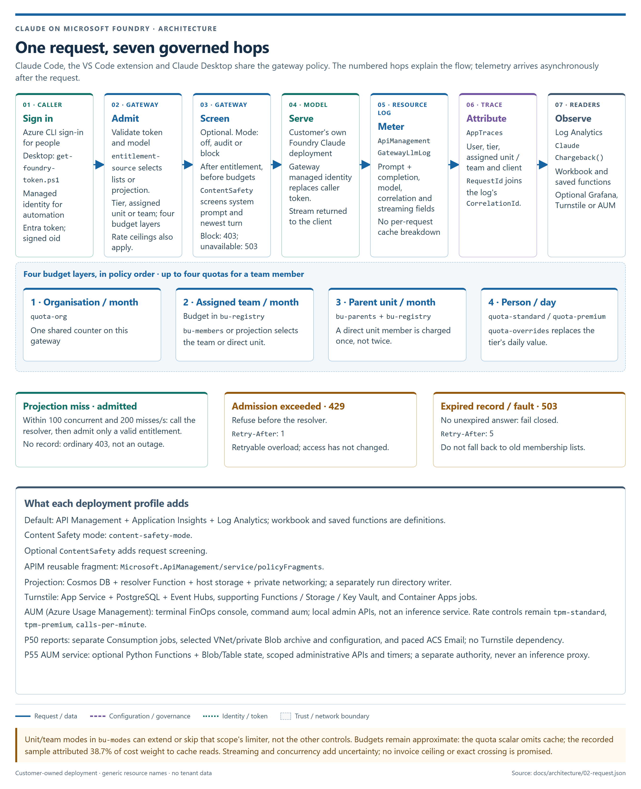

Source: [02-request.json](architecture/02-request.json). The README's
`images/request-flow.png` is a byte-identical compatibility copy.

1. **Sign in.** Claude Code and the VS Code extension use Foundry mode with Azure
   credentials from the developer's Azure CLI sign-in. Desktop follows the
   admin-recorded `desktopSignIn` choice in `claude-gateway.json`: the default
   installs [`get-foundry-token.ps1`](../scripts/get-foundry-token.ps1), through
   a platform shim, as its credential helper and reuses Azure CLI sign-in;
   external-idp browser or broker sign-in uses the recorded Entra public-client
   app and the gateway's optional `external-idp-extra-audience`. Azure automation can
   use its own managed identity; that identity must also be entitled.
2. **Admit.** [`infra/policy.xml`](../infra/policy.xml) validates the tenant, signature,
   audience and expiry, then uses the signed `oid`. The default accepted
   audiences are `https://cognitiveservices.azure.com` and `https://ai.azure.com`;
   an additional Desktop audience is accepted only when `external-idp-extra-audience`
   is non-empty.
   `entitlement-source` selects `named-value` or `projection`. Entitlement, tier and the
   requested model are checked before Foundry is called.
3. **Serve.** `authentication-managed-identity` obtains the gateway's Foundry token.
   The policy replaces `Authorization` and deletes `x-api-key`. The existing customer
   Foundry deployment receives the gateway identity, not the developer token.
4. **Meter.** The built-in `ApiManagementGatewayLlmLog` records request-level token usage,
   model and streaming metadata. It is not the custom-metric budget counter.
5. **Attribute.** The outbound `claude-chargeback` trace supplies the user, tier, assigned
   unit or team and raw client string in `AppTraces`. The trace's `Properties.RequestId`
   joins the LLM log's `CorrelationId`. Application Insights operation ids are not that key.
6. **Observe.** Saved functions, workbooks and optional consumers read the Log Analytics
   data. Ingestion is asynchronous; a successful request is not an immediately complete
   reporting window.

### Entitlement and budgets

In the default profile, [`Sync-ClaudeAccess.ps1`](../scripts/Sync-ClaudeAccess.ps1) reads
Entra groups and writes `allow-standard`, `allow-premium` and `bu-members`. Premium takes
precedence over standard. The assigned unit can be a team; `bu-parents` supplies its parent.
The policy does not perform a live Microsoft Graph membership call for each request.

The maximum four budget layers for a team member are, in policy order:

| Order | Counter | Configuration |
|---|---|---|
| 1 | Organisation, monthly | `quota-org`, shared key `claude-org` |
| 2 | Assigned team or direct unit, monthly | Its budget in `bu-registry` |
| 3 | Parent business unit, monthly, when the assignment is a team | `bu-parents` plus the parent's budget in `bu-registry` |
| 4 | Person, daily | `quota-standard` or `quota-premium`, replaced by a valid `quota-overrides` entry |

A direct member of a business unit is not charged twice for that unit. Zero at a unit or
team means its monthly limiter is not set, not a zero-token entitlement. Tier
`tpm-standard` / `tpm-premium` controls run before the daily quota, and
`calls-per-minute` also protects against many small requests. These rate controls are
separate from the four budget layers.

Unit and team limits default to strict. `bu-modes` can add allowance or skip an individual
scope's monthly limiter in notify mode; it does not disable the other layers. See
[budget enforcement modes](#budget-enforcement-modes).

| Failure | Gateway result | What it means |
|---|---|---|
| Missing, invalid or wrong-audience token | 401 | Authentication failed. |
| No entitlement, forbidden model or a required unit is missing | 403 with a specific error | A policy decision, not a resolver outage. |
| Token quota exhausted | 403 naming the organisation, unit or personal budget | Access remains assigned; that budget is spent. |
| Rate ceiling or projection miss admission exceeded | 429 | Retryable throttling. Projection admission returns `Retry-After: 1` before calling the resolver. |
| Expired/invalid projection freshness or resolver fault, with no valid cached answer | 503, normally `Retry-After: 5` | Fail closed. Do not fall back to the old named-value lists. |

The original budgets are **approximate token controls**, not hard currency limits. High concurrency and
streaming affect estimates, and the quota scalar excludes cache tokens. The recorded
30-day sample attributed 38.7% of cost weight to cache reads; that is evidence for the
gap, not a universal multiplier. Counters are not globally aggregated across gateways.
See [business-unit budgets](BUSINESS-UNITS.md) and [scale and measured limits](SCALE.md).

### Identity and streaming boundaries

The gateway identity needs `Cognitive Services User` on the Foundry account. To make the
gateway mandatory, remove developers' direct data-plane access to that account and audit
other bypass principals with [`Get-ClaudeBypass.ps1`](../scripts/Get-ClaudeBypass.ps1).
Possessing an Entra token alone is neither entitlement nor proof that direct Foundry
access has been removed.

Group removal becomes effective only after synchronization and, on the projection path,
the relevant cache window. It is not instantaneous token revocation. See
[authentication types](AUTHENTICATION.md) and [client onboarding](ONBOARDING.md).

The policy uses `forward-request timeout="600"`, `buffer-request-body="false"` and
`buffer-response="false"`. It parses usage counts only for successful nonstream JSON
Messages responses. It never reads an SSE response body. `UsageJson` carries the
provider's nonstream cache TTL split into the existing identity trace.

### Dated USD budgets and delayed enforcement

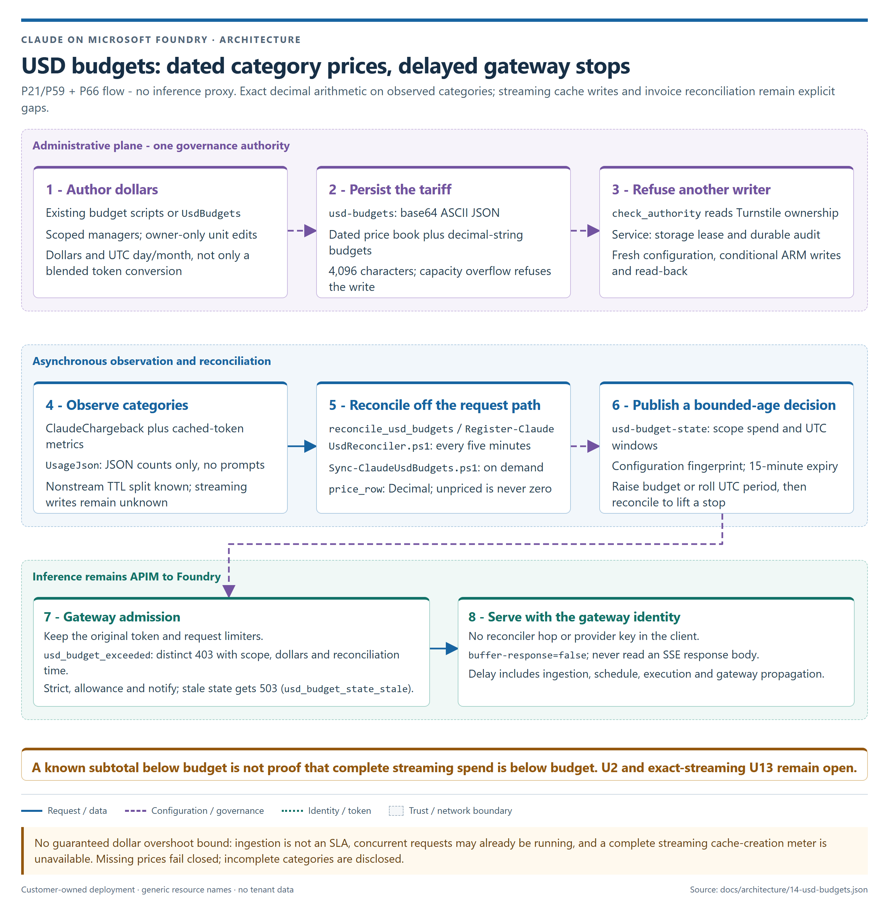

Source: [14-usd-budgets.json](architecture/14-usd-budgets.json);
[ADR-0026](adr/0026-usd-budget-reconciliation.md).

`usd-budgets` persists dollar strings and the price-book date, separately from
the existing approximate token guard. The shared reconciler reads integer category
counts, prices them with Decimal, and publishes `usd-budget-state`. A matched scope's
missing, stale or configuration-mismatched state fails closed. Strict stops at the
nominal limit; allowance stops above its effective limit; notify only adds a header.
Unpriced models are reported and refused for enforced scopes, never counted as zero.

The AUM service timer runs every five minutes under its existing identity, lease and
audit. `Sync-ClaudeUsdBudgets.ps1` invokes the same engine on demand with Azure CLI
sign-in. P66's guided Budgets step adds the non-service fallback: a five-minute
Container Apps job definition pinned to a repository commit, with a managed identity
limited to gateway named values and workspace reads. State expires after 15 minutes. Ingestion, execution and APIM propagation add
delay; no hard currency overshoot guarantee is made. Nonstream counts can be complete,
including both cache-write TTLs. Streaming cache reads depend on capped custom metrics
and cache writes remain unknown. A known subtotal under budget is not complete spend.
See [BUDGETS.md](BUDGETS.md) and the
[AUM client contract](aum-usd-budgets-client-contract.md).

## Telemetry and chargeback

The default gateway uses a resource diagnostic for the LLM log and an Application Insights
diagnostic for traces and custom token metrics. The shipped diagnostic does not capture
prompt or response bodies. Identity and client metadata still require appropriate
workspace access and retention controls.

[`Publish-ClaudeQueries.ps1`](../scripts/Publish-ClaudeQueries.ps1) publishes
`ClaudeChargeback()`, `ClaudeCost()` and `ClaudeCodeDaily()` from the
[`analytics`](../analytics) sources. [`Publish-ClaudeWorkbook.ps1`](../scripts/Publish-ClaudeWorkbook.ps1)
publishes the workbook; [`Publish-ClaudeGrafana.ps1`](../scripts/Publish-ClaudeGrafana.ps1)
targets an existing Grafana instance.

The request ledger joins usage to identity. Cache reads available through `AppMetrics`
are aggregates, not a per-request cache breakdown; missing per-request cache categories
remain unknown, not zero. Price-based costs remain estimates, not a reconciled Azure
invoice. An unjoined row remains visible as unattributed rather than being silently
discarded. See [monitoring](MONITORING.md), [analytics provenance](adr/0006-ledger-is-the-llm-log.md)
and [financial semantics](adr/0010-financial-semantics.md).

## Private monthly reports and email delivery (P50)


Source: [08-chargeback-reports.json](architecture/08-chargeback-reports.json), verified
against the implementation now merged into main. The
[P50 how-to](CHARGEBACK-REPORTS.md), [portal/CLI appendix](chargeback-reports/PORTAL-CLI.md)
and [ADR-0020](adr/0020-chargeback-reports.md)
describe deployment, recipient administration and measured limitations.

P50 reads the existing `ClaudeCost()` and `ClaudeChargeback()` saved functions over
Entra-authenticated HTTPS. It is independent of Turnstile and never proxies a model call.
The scheduled default is `0 6 1 * *`: 06:00 UTC on the first day of each month, reporting
the previous UTC calendar month. Month-to-date is an explicit configuration choice.

### Generate and reconcile before publishing

`Invoke-ClaudeChargebackSchedule.ps1` selects the generator, dispatcher or administration
mode. The generator calls `New-ClaudeChargebackReport.ps1`. It aggregates server-side
rather than downloading raw request rows, splitting bounded person pages by hash.
Units including Unassigned must reconcile to workspace totals, and person totals must
reconcile to their unit. Teams are subdivisions, not extra totals to add again.

Partial query results, reconciliation mismatches or changing saved-function definitions
invalidate the report instead of silently publishing incomplete data. A complete run
archives scoped CSV/HTML and a manifest under `runs/<month>/<run>/`. The manifest records
the UTC window, query/artifact hashes, price-book and membership provenance, and budgets
as read at generation time. It does not reconstruct historical budget or tariff changes.
Costs remain the existing saved function's list-price showback; unknown cache-write
categories stay null/empty, not zero.

### Separate private storage from administration

The network selection offers discovered existing VNets/subnets/DNS or an explicitly
sized new network. Shared discovered networks are not silently retagged as reports-owned.
The chosen network has a Container Apps subnet and a private-endpoint subnet; the
dedicated Consumption environment uses it. Storage has a Blob private
endpoint and `privatelink.blob.core.windows.net` zone/link, disables public network and
shared-key access, and requires HTTPS/TLS 1.2. P50's deployment measured an inherited
policy enforcing private storage; granting a blob data role does not make an off-network
terminal able to reach it. No gateway or Turnstile network is modified.

`configuration/settings.json` lives in a separate, versioned container. ETag conditional
writes refuse stale edits. Allowed recipient domains are required and matched exactly.
Report artifacts, pending `outbox/` items and dispatch state live in the `reports`
container; lifecycle retention defaults to 400 days and is configurable.

| Identity | Access |
|---|---|
| Reporting user-assigned managed identity | Workspace Log Analytics Reader; gateway `namedValues/read` only; configuration-container Blob Data Reader; reports-container Blob Data Contributor. A custom read/write role is scoped to the dedicated ACS resource, with no keys or delete. |
| Separate administration managed identity | Configuration-container Blob Data Contributor only; no workspace or email role. |
| Administrator starting the manual job | Privileged configuration authority, not a role to give report recipients. |

The ACS role is not a fictitious email-send-only role: the inspected provider exposes no
send-only data action for this path. Its residual resource management privilege is
contained on a dedicated ACS resource.

For off-network administration, the manual job accepts a validated, structured
`REPORT_ADMIN_REQUEST`, or readable `REPORT_ADMIN_JSON` for the portal editor, not arbitrary
shell code. Supplying both forms is refused. It performs Initialize, Recipients,
Settings or Inspect operations. Logs and off-network inspection contain status and counts,
not address lists. Full recipient lists are read from a VNet-connected terminal.

### Pace delivery and recheck recipients

The generator queues recipient hashes and scope, not address lists. The blob-triggered
dispatcher polls every 420 seconds with zero minimum and one maximum execution, so an
empty outbox does not keep a container running. An infinite lease on `state/dispatch.json`
serializes sends; persisted `NextActionUtc` pacing survives process restarts.

Before sending, the dispatcher rereads current configuration, honors recipient removals
and domain restrictions, verifies archived artifact hashes, and sends scoped HTML/CSV
parts through the Entra ACS Email endpoint. Unit recipients receive their unit's report
using BCC. Explicit all-units recipients receive the selected report set. Team-specific
recipient delivery is deferred; sending the parent unit report would widen their scope.
Email contains no SAS or unrestricted download link.

Send/poll operation ids, scope, status and recipient counts are recorded in the run
manifest. An ambiguous send is polled using its existing operation id, not resent as a
new message. Unknown outcomes require inspection. A crashed worker can leave its lease
held; an administrator checks for active executions before explicitly breaking a stale
lease.

Azure-managed domains permit at most 10 sends per hour. At one send and one poll per
message, the 420-second pacing permits about 4.3 completed messages per hour; more polls
are slower. Hundreds of unit reports therefore require a verified custom domain and an
approved quota for timely production delivery. A successful ACS operation is not proof
of inbox placement, and emailed data is outside the archive's retention control.

## Governance apply path

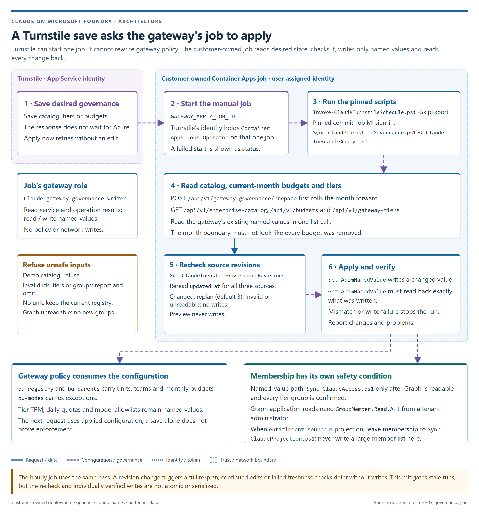

Source: [03-governance.json](architecture/03-governance.json).

When `governanceAuthority=Turnstile`, the console owns desired units, teams, groups,
budgets and tier settings. A save records desired state, then requests a background start
of the job named by `GATEWAY_APPLY_JOB_ID`. A failed start is visible in status; a successful
save is not an assertion that the gateway has changed.

The console's managed identity holds **Container Apps Jobs Operator on that one job**.
The job's user-assigned identity holds **Claude gateway governance writer** at the
gateway. That custom role permits service reads, named-value reads/writes and operation
result reads, not policy, certificate or network changes. The manual and hourly jobs
share the user-assigned identity in
[`turnstile-schedule.bicep`](../infra/turnstile-schedule.bicep).

The manual job runs `Invoke-ClaudeTurnstileSchedule.ps1 -SkipExport`, then
`Sync-ClaudeTurnstileGovernance.ps1`, which invokes the functions in
[`ClaudeTurnstileApply.ps1`](../scripts/ClaudeTurnstileApply.ps1):

1. Prepare the current month through `/api/v1/gateway-governance/prepare` before reading
   budgets, so a not-yet-rolled month does not look like all budgets were removed.
2. Read the configured catalog, budgets and gateway tiers, and the gateway's current values.
3. Calculate changes. Seeded demo catalogs are refused; unsupported tiers, malformed
   ids and unconfirmed groups are reported, not invented. Teams need an applied parent.
   If no applicable unit remains, existing units are preserved.
4. Validate all mode metadata before writing. Invalid `enforcement` or
   `allowance_percent` defers the complete apply with no writes. `bu-modes` is separate
   from the legacy registry.
5. Before applying, compare catalog/tiers and budget-row `updated_at` revisions with a
   fresh read. A changed snapshot restarts planning, including rereading the gateway and
   rechecking groups, up to three times by default. Missing required revisions, a failed
   read or continued edits defer with no writes. Usage and `generated_at` are not revisions.
6. Apply only differences with `Set-ApimNamedValue`, then compare every value returned by
   `Get-ApimNamedValue`. A write error or mismatch fails the run. Without `-Apply`, report only.
7. Refresh named-value membership only when Graph is readable and every tier group is
   confirmed. With unreadable Graph, existing known groups can remain, new unconfirmed
   groups cannot be introduced, and membership is not overwritten from an empty read.
   Tier limits still apply. When the entitlement source is the projection, its own
   reconciliation remains responsible for membership.

The optional Graph application permission is `GroupMember.Read.All`; it requires a tenant
administrator. Console manager scopes do not require that grant.

The hourly job defaults to **07 past each hour, UTC** (`7 * * * *`). It exports a
120-minute window ending 15 minutes before the run, sends usage to Event Hubs and runs the
same governance synchronization. Overlapping export windows are deduplicated by the
Turnstile ingest path. Export failures fail the pass; no automatic job retry is configured.
The next hourly pass or **Apply now** can catch up.

These are individually verified writes, not an atomic transaction or a serialized queue.
The pre-write revision check mitigates stale runs but cannot make separate reads and
writes atomic. Follow the
[Turnstile setup and governance guide](TURNSTILE.md#manage-everything-in-turnstile)
and [ADR-0019](adr/0019-budget-enforcement-modes.md); do not infer a stronger
ordering guarantee from the arrows.

## Delegated management and console sign-in

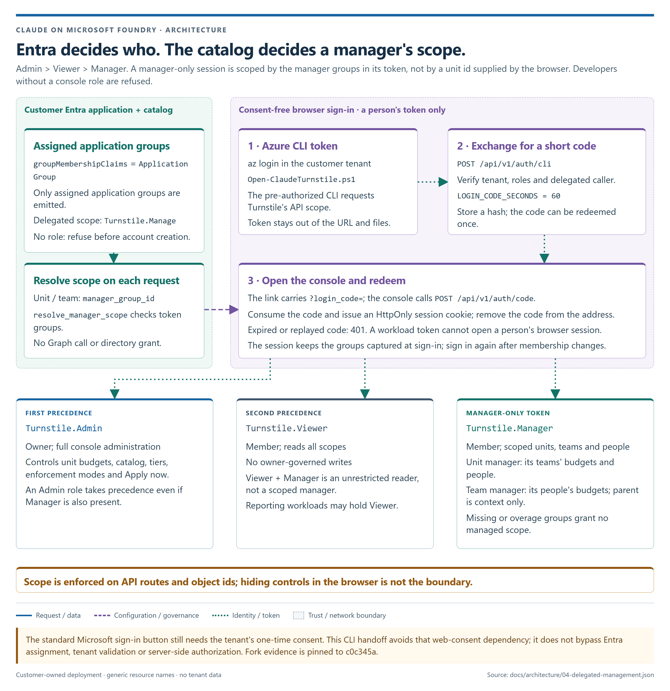

Source: [04-delegated-management.json](architecture/04-delegated-management.json).
The manager implementation is verified against the
[Turnstile fork at c0c345a](https://github.com/naveenneog/turnstile/tree/c0c345a6009eaada755850ee15f76ddc85bad74f).

`New-ClaudeTurnstileEntraApp.ps1` configures the app roles and
`groupMembershipClaims=ApplicationGroup`. Tokens list groups assigned to this application,
not every group in the directory. Precedence is **Admin > Viewer > Manager**:

| Role | Reach |
|---|---|
| `Turnstile.Admin` | Owner. Controls the catalog, tiers, modes, unit budgets and Apply now. |
| `Turnstile.Viewer` | Member. Reads every scope; cannot perform owner-governed writes. Viewer plus Manager remains an unrestricted reader. |
| `Turnstile.Manager` alone | Scoped member. Catalog `manager_group_id` values are resolved against the token's groups on each request. |
| None | Refused before a console account is written. Developers do not receive console access merely by being entitled to inference. |

A unit manager sees that unit, its teams and direct members and may set its teams' and
people's budgets. A team manager sees its team and people, with the parent only as context,
and may set person budgets. Child allocation still cannot exceed its parent. Routes and
objects outside the manager allowlist are refused server-side. Missing or overage group
claims grant no managed scope. Sessions retain the groups captured at sign-in.

The consent-free sign-in is:

`Azure CLI token -> POST /api/v1/auth/cli -> single-use 60-second code -> ?login_code= -> POST /api/v1/auth/code -> session cookie`

[`Open-ClaudeTurnstile.ps1`](../scripts/Open-ClaudeTurnstile.ps1) implements the handoff.
The CLI is pre-authorized on Turnstile's API. The code is stored hashed and consumed on
redemption; the access token is not put in the browser URL. Expired or reused codes return
401, and workload identities cannot open a person's browser session. Treat the short-lived
link as a credential while valid.

This does not remove the tenant consent requirement for the normal Microsoft web sign-in
button. See [viewers and managers](TURNSTILE.md#viewers-and-managers),
[manager setup](TURNSTILE.md#managers),
[sign-in before consent](TURNSTILE.md#sign-in-before-the-tenant-grants-consent)
and [ADR-0016](adr/0016-delegated-management.md).

## Projection freshness, admission and private networking

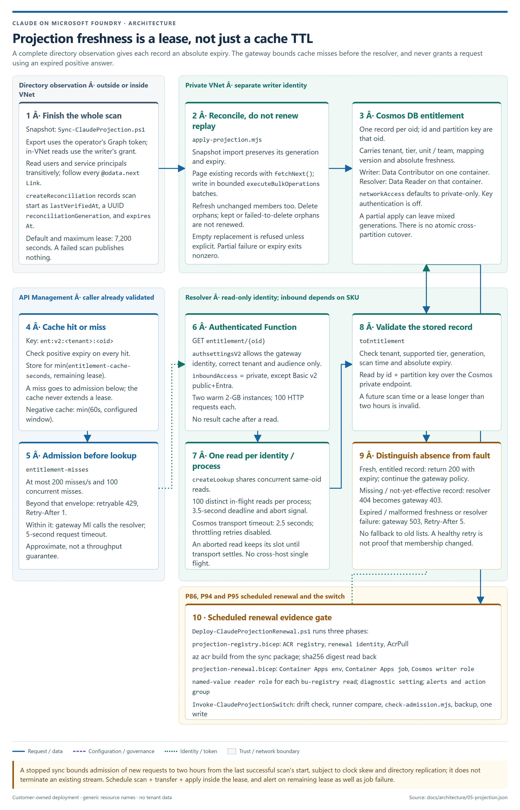

Source: [05-projection.json](architecture/05-projection.json).

The projection replaces membership lists that reach the 4,096-character named-value limit.
It does not replace Entra as the source of entitlement. Each Cosmos record is partitioned
by `oid` and carries the tenant, tier, assigned unit/team and freshness:

- `lastVerifiedAt` is the beginning of the directory observation, not the end of the upload.
- `reconciliationGeneration` identifies a complete scan.
- `expiresAt` is an absolute UTC epoch-second expiry. The default and maximum lease is
  7,200 seconds; the configured range is 60 to 7,200 seconds.

The writer follows Graph `@odata.nextLink` pages for users and service principals and
pages existing Cosmos records with `fetchNext()`. Publication starts only after a complete
observation. Snapshot replay preserves the original lease; it cannot renew stale access.
Every retained member is refreshed, even if its tier and unit are unchanged. Kept or
failed-to-delete orphans do not receive a new lease. A partial write can leave mixed
generations, each with its own expiry, and exits nonzero.

P86 adds the scheduled renewal path in `infra/projection-renewal.bicep`. It declares an
ACR registry, an internal Container Apps environment, a scheduled Container Apps job, a
user-assigned identity, a container-scoped Cosmos SQL data-plane writer role, an email-backed
action group and scheduled-query alerts. The job writes destination-bound status records in
the entitlement container. Switch admission reads those records through
`sync/src/check-admission.mjs` and also checks that the ARM job uses the tested pinned image
without command or args overrides.

Before a resolver call, APIM limits `entitlement-misses` to 200 per second and 100
concurrent. Excess returns retryable 429. These approximate distributed controls bound
the admitted burst; they are not a 500,000-user throughput guarantee.

The resolver's `createLookup` shares concurrent reads for the same identity **within one
process**, with no completed-result cache. It caps distinct in-flight reads at 100,
uses a 3.5-second deadline and abort signal, and retains an aborted operation's slot until
transport settles. Cosmos uses a 2.5-second transport timeout with throttling retries
disabled. The deployment defaults to two warm 2-GB instances with 100 HTTP requests per
instance. There is no cross-instance single-flight lock.

`toEntitlement` distinguishes absent records from invalid ones. No record becomes a
gateway entitlement refusal, while expired or malformed freshness becomes 503. APIM
includes tenant and schema version in the cache key, clips positive caching to the
remaining lease, and checks expiry on every hit. A stopped sync cannot authorize new
requests indefinitely; it does not terminate a stream already admitted.

### Separate network reachability from identity

- Cosmos defaults to `networkAccess=private-only` with key authentication disabled.
- The writer runs where it can reach the Cosmos private endpoint, using container-scoped
  Data Contributor. The resolver has a separate container-scoped Data Reader identity.
- Resolver `authsettingsV2` requires the correct tenant, audience and allowed gateway
  identity before the HTTP function executes.
- Private resolver inbound access requires an APIM Standard v2 or Premium v2 VNet path.
  Basic v2 requires an **explicitly public**, still identity-protected resolver endpoint.
- The private profile also supplies private endpoints and DNS for Function host storage:
  blob, queue and table. Private DNS links and endpoint zone groups are part of the path,
  not optional decoration.

Schedule observation, transfer and apply well inside the lease. Alert on failures and
remaining lease. Existing unleased records need a fresh reconciliation before the stricter
reader and policy are deployed. See
[the private deployment how-to](SECURE-PROJECTION.md),
[the migration and measurement guide](SCALE.md) and
[ADR-0017](adr/0017-projection-freshness-and-admission.md).

## Enterprise network ingress (P54)

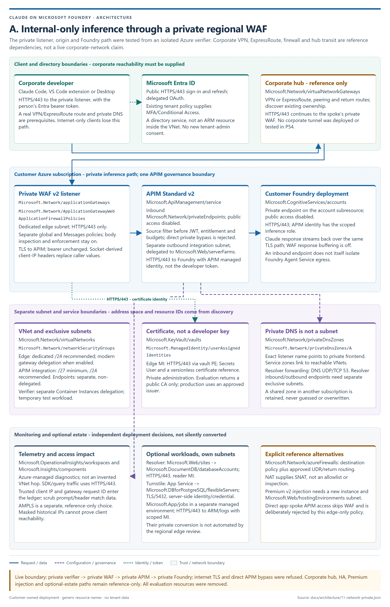

Sources: [11-network-private.json](architecture/11-network-private.json),
[12-network-public.json](architecture/12-network-public.json) (internet listener, private
origins) and [13-network-hybrid.json](architecture/13-network-hybrid.json) (split-DNS listeners,
one governed origin); the other two images are in the
[enterprise network design](NETWORK-ENTERPRISE.md#source-backed-topology-diagrams).

A regional Application Gateway WAF_v2 is the only ingress to the gateway: APIM accepts traffic
from the edge subnet alone and reads the caller's address from a header the edge sets from its
socket peer, never from a forwarded header. Foundry, Key Vault and the verifier sit behind
private endpoints. The script discovers every choice, prices it from the retail price list and
states its implications, then shows one frozen review, including the identities that may lose
access, before any write. It does not convert Turnstile, PostgreSQL, the projection or the
scheduled jobs (P49); a plan that needs those fails before it writes. See
[ADR-0022](adr/0022-enterprise-network-edge.md).

## AUM (Azure Usage Management) - terminal FinOps console

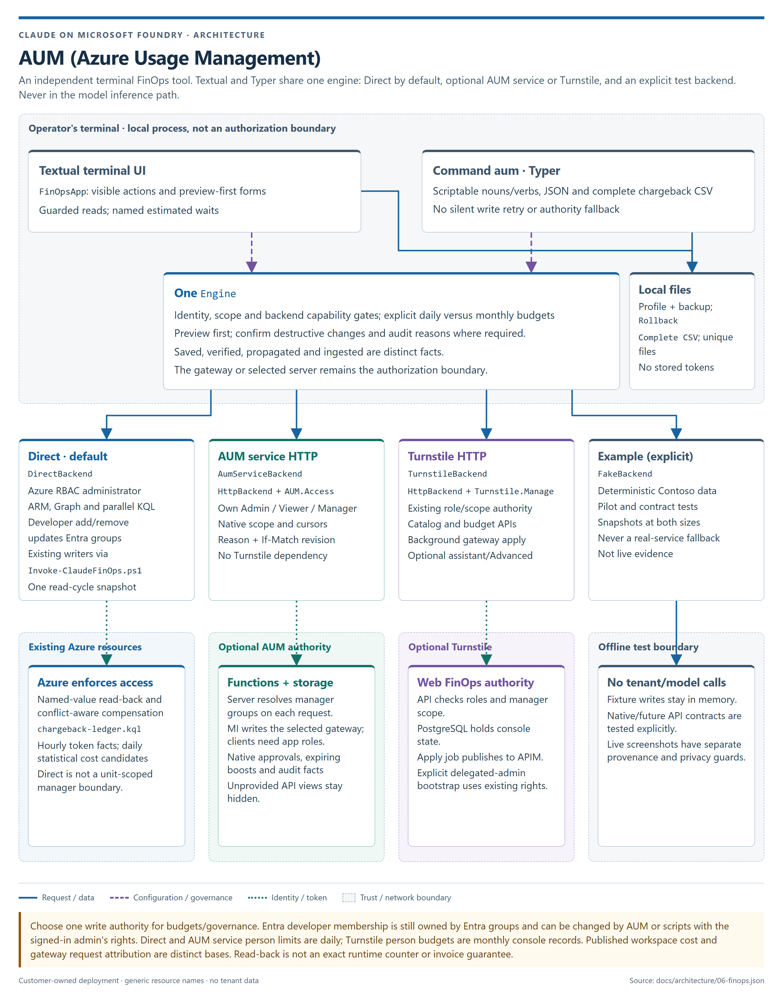

Source: [06-finops.json](architecture/06-finops.json), verified against the local
[`cli/finops`](../cli/finops) implementation merged to main at `c7f0a29`. The design is
recorded in [ADR-0018](adr/0018-terminal-finops.md), P71's
[ADR-0035](adr/0035-aum-bounded-readiness-and-progressive-reads.md), and P80's
[ADR-0038](adr/0038-aum-actions-and-connection.md). P85 adds the Cloud Shell
launch surface and deliberate session controls in
[ADR-0041](adr/0041-aum-session-safety-and-cloud-shell.md).

The product is **AUM - Azure Usage Management**, a terminal FinOps console with command
**`aum`**. `claude-finops` remains a deprecated alias; the internal package stays
`claude_finops`. The [AUM terminal guide](AUM.md#install) starts with installation
and connection setup. The [legacy guide URL](CLI-FINOPS.md) remains a pointer.

The [Cloud Shell launcher](../scripts/aum-cloudshell.sh) provisions only a
HOME-local Python/venv/cache and an editable install from the checkout, using
the existing Azure CLI sign-in. It does not deploy Cloud Shell, a VNet or
storage, and does not introduce a governance writer. Its hosted terminal uses
the same backend endpoints and permissions. Private endpoints require an
appropriately connected VNet Cloud Shell. Runtime/bootstrap and actual HOME
persistence verification remain owner-only in U61.

The Textual `FinOpsApp` and Typer commands share `Engine` for period selection, scope,
budget validation, previews and explicit writes. The backend is a choice, not an
automatic fallback:

- **Turnstile HTTP:** Azure CLI token, role/scope checks at the server, bounded API reads
  and explicit writes. A failed GET can refresh its token once; writes are not retried.
- **AUM service HTTP:** its existing Entra roles, native capability contract and
  server-resolved management scope; the service is independent of Turnstile.
- **Direct Azure:** ARM, Log Analytics and `Invoke-ClaudeFinOps.ps1`, reusing the
  repository's gateway scripts and chargeback query. AUM developer add/remove uses the
  signed-in administrator's delegated Graph token to update Entra group membership,
  then publishes the gateway allow lists through the selected authority path. Azure
  RBAC and Graph remain authoritative; this is not an alternate implementation of
  Turnstile's delegated manager scope.
- **Fake:** deterministic Contoso fixtures for tests and terminal snapshots; no tenant,
  model or credential calls.

A preview is not a write. A saved Turnstile value is not a completed gateway apply.
Turnstile person budgets are not the gateway's per-person daily overrides. These distinctions
belong in both terminal faces. The [AUM how-to](CLI-FINOPS.md) describes installation,
configuration, commands and the first release's scope.

P80 changes local interaction and file flows, not Azure architecture. The
People/Budgets controls retain existing authorization and preview-first writers.
Directory and catalog results keep their publication guards through the add
form. Connection settings use an address-only local profile, a timestamped
backup and atomic replacement. An OS-held sibling-file lock serializes AUM
profile writers; the reviewed candidate/revision is not rediscovered at commit.
Both `whoami` and the saved profile revision are checked before the UI adopts
the candidate. Failure keeps the previous engine, identity and cached UI and
attempts profile restoration. Failed restoration retains the connection form
with focused, keyboard-scrollable backup/recovery instructions.
Complete chargeback CSVs use exclusive file creation
with numbered collision handling. No Azure component, identity, schedule,
network destination or write authority is added. The diagram's local-files
node records these paths; Turnstile still has no USD writer.

P71 adds progressive source completion within the terminal and a read-cycle
snapshot within Direct. Azure still authorizes each Direct request; HTTP scope
verification still precedes protected data. Tokens remain in process memory,
and writes invalidate read snapshots rather than using cached preflight state.
The stopped-database diagnostic reads ARM metadata in the recorded Turnstile
group after an authenticated readiness failure. Its credential may be acquired
concurrently, but no healthy-path database inventory or automatic start is added.
Council round 1 binds resource reuse to a verified principal/session, checks the
Direct account once per read cycle, and rejects obsolete in-flight results.
Fatal data errors are observed concurrently with identity and capability reads.
Council round 2 pins that verified generation immutably to each Direct cycle.
Snapshot completion and complete multi-source aggregates validate the same
generation; cached account metadata cannot revive an invalidated cycle.
Round 3 extends complete-cycle pinning to HTTP backends and adds captured
publication guards before cache, partial/final rendering and command/file output.
Deferred controls retain the source guard rather than checking only after display.
Round 5 routes presentation and assistant-context reuse through one
`guarded_publish` function. `PrincipalUI` clears prior-principal state before
input dispatch; an AST test checks the publication boundary across UI/output
modules with exact static-write exceptions.
Round 6 adds sink-layer enforcement in `publication_widgets.py` and
`publication_output.py`, with assistant egress checked at the HTTP transport.
`publication_sink` delegates to the same publication boundary at each write.
`guarded_deferred` re-enters a retained origin on execution; async work holds
no identity lock while suspended. Framework input has narrowly identified
handlers, not a general exemption for application callbacks. The AST contract
checks indirect sinks and escaping callbacks as a second line of defense.
Round 7 protects `content` provenance and rejects unchecked descriptor,
raw-state and dynamic-code escapes. The shared application exception boundary
unwraps publication refusals before Textual builds a fatal diagnostic. Its
app-scoped loop handler covers event-loop callbacks and restores the prior
owner on exit. Refused timers and screen callbacks retain input and show only
the safe error, not callback arguments or traceback locals.
Round 8 validates retained widget subtrees before registration inserts them
into the DOM. Copied widgets keep their original source; a new caller scope
does not reauthorize that data. Protected instances cannot change class.
The source detector uses an explicit import/member allowlist and module
classification. Native output and widget capabilities are confined to the
reviewed, fingerprinted boundary modules. Exact metaprogramming exceptions
also pin the function body on which their justification depends.
Round 9 carries notification origins through the message queue, toast
creation and cached rendering. Raw notification calls refuse; principal
clearing removes prior-source notifications.
Round 10 adapts only exact reviewed native DOM classes before attachment.
Their properties, mutating methods and cached rendering validate their source;
unsupported content widgets are refused. App titles stay static and raw exit
messages are refused. Queued messages and notifications omit payloads from
normal and Rich representations before Textual diagnostic logging. The receiver
and effect approval procedure is in
[ADR-0035](adr/0035-aum-bounded-readiness-and-progressive-reads.md#approval-recipe-for-attributes-and-builtins).

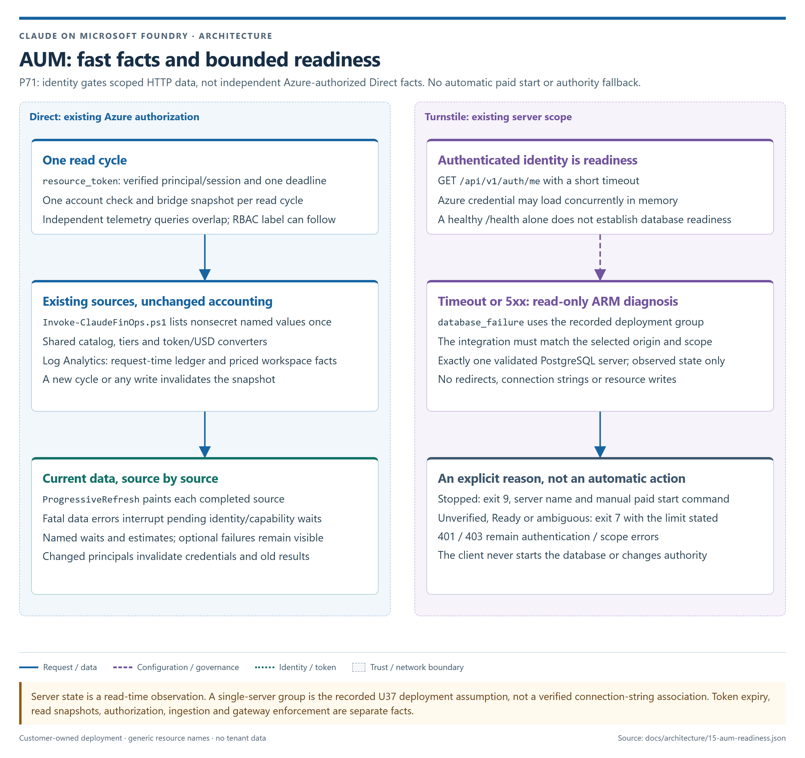

Source: [15-aum-readiness.json](architecture/15-aum-readiness.json). The Windows
MSI launcher runs its existing Python entry point directly; other command
wrappers are created suspended, assigned to their timeout job, then resumed.

## Optional independent AUM service (P55)


Source: [10-aum-service.json](architecture/10-aum-service.json), verified against the
merged `service/aum` implementation and [ADR-0023](adr/0023-aum-service.md).
Use [the AUM service guide](AUM-SERVICE.md) for deployment choices, commands and measured
acceptance limits. A service-aware client's integration is a separate API contract; the
three-backend terminal diagram is not a claim that every client already implements it.

The service is a Python Functions Flex Consumption application, not another model proxy.
Assigned people use a v2 Entra access token with `AUM.Access`. The precedence is
`AUM.Admin` > `AUM.Viewer` > `AUM.Manager`; application-assigned groups determine manager
scope. `Api.handle` validates each route through `TokenVerifier`; function-key
`anonymous` does not mean unauthenticated. Missing/overage groups never widen scope.

`AumService` reads the current gateway configuration and service-owned manager mappings.
A null `manager_scope` is unrestricted, while an object, even empty, is scoped.
Unit managers can reach their teams/direct members; a displayed parent does not grant a
team manager the parent's scope. Direct Azure remains an Azure RBAC path, not a delegated
manager boundary. If `turnstile-integration` says Turnstile owns governance or budgets,
the service refuses gateway writes rather than becoming a second authority.

The service uses its managed identity for a narrow gateway named-value role, workspace
Log Analytics Reader, and Blob/Table data roles on its own keyless storage. `AumState`
holds manager mappings, requests, boosts, warning records and audit; these do not consume
named-value space. A gateway-wide lease lives in `aum-control/gateway-writer`.
Mutation safety is durable audit intent, fresh revisions, lease renewal/deadline checks,
ARM ETags, read-back and reverse-order compensation. Rollback cannot overwrite a later
independent write. An ambiguous response requires state inspection, not an automatic retry.

Allocation is independent of strict/allowance/notify. Daily person overrides reserve
31 days against monthly parents. Requests route upward and recheck scope/headroom when
decided; self-approval is denied unless an Admin explicitly uses the audited
`admin_override` with a reason. That does not imply independent two-person approval.
`expire_boosts` runs every minute and compare-restores overdue values.
`warning_thresholds` runs every 15 minutes and creates idempotent records; it is not an
email-delivery implementation.

Network access, storage redundancy, telemetry and zero/one warm instance are explicit
choices. Private storage uses Blob/Table private endpoints, DNS and outbound VNet
routing. The deployment does not repurpose shared storage/plans or modify the gateway's
network. Bounded observed-user queries do not remove the 4,096-character named-value
limit or prove capacity for 500,000 per-person overrides.

## Budget enforcement modes

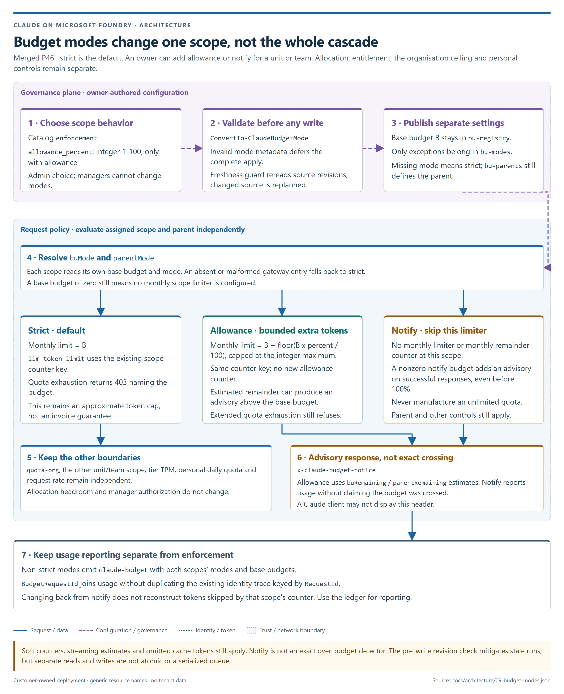

Source: [09-budget-modes.json](architecture/09-budget-modes.json). The implementation is
merged in main; [ADR-0019](adr/0019-budget-enforcement-modes.md) records its contract.

`bu-registry` retains base monthly budgets. The separate `bu-modes` map holds exceptions
for a unit or team. Missing entries mean strict. The owner controls modes; they do not
alter manager scope or allocation rules.

| Mode | That scope's monthly limiter | Response behavior |
|---|---|---|
| **Strict** | Uses the base budget and existing counter key | Quota exhaustion refuses with 403. |
| **Allowance** | Base plus the floored 1-100 percent allowance, capped at the integer maximum | The extended quota still refuses. Estimated remaining tokens can cause an advisory after the base budget. |
| **Notify** | Skips only this scope's monthly limiter; there is no monthly remaining counter there | A successful response with a nonzero notify budget carries a usage advisory, including before 100 percent. |

The assigned scope and its parent resolve modes independently. The organisation ceiling,
the other scope, personal daily quota, tier TPM and request-rate controls remain in force.
A malformed gateway map entry falls back to strict; invalid authored Turnstile metadata
is refused before the apply writes anything.

`x-claude-budget-notice` is advisory. It does not prove an exact budget-crossing request,
invoice cost or that a Claude client displayed a warning. The `claude-budget` trace carries
base budgets and modes and uses `BudgetRequestId`; it does not reuse the identity trace's
`RequestId` and duplicate that join. The ledger remains the reporting source.

Switching a scope from notify back to a limiting mode does not reconstruct usage that
was not counted while its limiter was skipped. Streaming estimates, concurrency and
missing cache tokens still limit enforcement precision. See
[business-unit budget modes](BUSINESS-UNITS.md) for commands and measured mode behavior.
The architecture capture's live scope remains the explicit
[verification coverage](architecture/LIVE-VERIFICATION.md#live-coverage-and-limitations);
it does not claim an additional live mode mutation run.

## Azure resource inventory

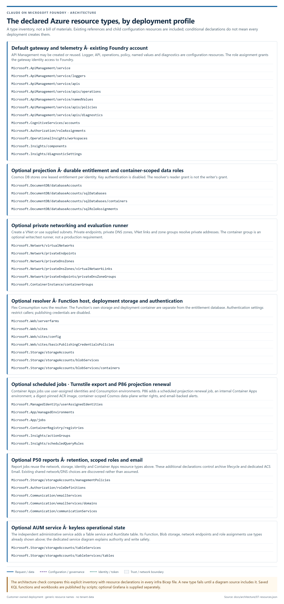

Source: [07-resources.json](architecture/07-resources.json). This explicit list includes
existing references and child configuration resources. It is not the live deployment's
resource count. Turnstile's separate fork has its own infrastructure; saved functions and
workbooks are published by scripts rather than by these Bicep files. The P50 diagram
separately displays five additional resource types from its merged implementation: custom role
definitions, Storage management policies and the three Communication/Email resource types.
These are not claimed as resources in the current default deployment.

## Keep architecture current after every feature

The sources are JSON under [`docs/architecture`](architecture), one file per diagram.
The layout is deterministic HTML/SVG with real code identifiers, rendered by the existing
Playwright dependency. No image-generation service or additional npm dependency is used.
[ADR-0021](adr/0021-source-backed-architecture.md) records this choice.

From the repository root:

```powershell
npm ci
node guide/render-architecture.mjs
pwsh -NoProfile -File tests/Test-Architecture.ps1
```

The single render command discovers every spec, checks its labels and resource coverage,
renders at device scale factor 2, checks for clipped text, writes the PNGs and records a
SHA-256 manifest. It keeps the README's `docs/images/architecture.png` and
`docs/images/request-flow.png` copies byte-identical to their canonical images.

### Add a diagram for a new feature

1. Add **one** `docs/architecture/<number>-<feature>.json` file. Start with an existing
   `flow` spec: set a unique `id`, title, subtitle, width/height, output path, nodes and
   edges. A node has `id`, `x`, `y`, `w`, `h`, `tone`, `title` and `lines`. Groups draw
   trust/network boundaries; edge `kind` is `data`, `control` or `identity`, with explicit
   coordinate `points`. Use the existing palette and readable text sizes.
2. Put implementation paths in `sources`. Bind every code label with `[[key]]` and an
   `identifiers` entry: `label`, `source`, and an exact `match` in that file.
   File labels use `kind: "file"` and name their own source. Prefer a declaration or
   executable use as the match, not prose that could outlive the code.
3. If the feature adds an Azure resource type, put the exact type in an inventory
   `sections[].types` list, or draw a `[[key]]` label with `kind: "resource"` bound to its
   Bicep declaration. A code-backed resource label must match a real declaration, not
   a commented example. Existing, conditional and child resources all count.
4. Add the image to this article with an explanation of components, identities, data
   flow, failures and deployment-profile changes. Run the render command. Open **every**
   changed image and check labels, arrows, boundaries and readability before committing.
5. Run the architecture test and the packet gate. Commit the source, pictures, manifest
   and article together. A new diagram does not require editing the generator or a registry.

The P50 diagram is an example of adding one spec without changing the diagram registry:
its pinned witnesses were adopted from local implementation files at merge, requiring
a new render. Its resource types remain visibly drawn. Do not represent an unmerged
path or an untested deployment variant as already deployed.

### What the check proves

`Test-Architecture.ps1` is registered in `Test-All.ps1`. It runs offline with Node and no
browser, credentials, Git history or network dependency. The manifest binds each image
to its spec, shared renderer/layout, lockfile and implementation inputs. Text hashes
normalize BOM/CRLF differences; PNG hashes cover the actual image bytes.

It rejects stale sources or pixels, missing or orphan images/sources, pictures no
document references, broken code-label witnesses, duplicate/unsafe output paths, junction
escapes and unrepresented Azure resource types. Its isolated mutations prove those failures without
editing the real sources; commented Bicep examples and line-ending conversion are
positive controls.

Repeated source and path reads are cached only inside one synchronous check and discarded
on return, including on an exception. A later mutation gets a new snapshot, so performance
does not hide edits between checks. `Test-Architecture.ps1` runs in the parallel lane:
it does not use Azure CLI state or scan the entire working tree, and every mutation uses
a uniquely named copy in the ignored `.shots-entra` area, never a repository source file.

The current main runner follows [ADR-0025](adr/0025-parallel-test-suite.md): isolated
parallel checks and complete mutation shards, at a default throttle of four. ADR-0025 restored
the 30-minute gate command budget after [ADR-0024](adr/0024-test-suite-time-budget.md)'s temporary
60-minute one; [ADR-0036](adr/0036-gate-budget-until-sharded.md) sets 60 minutes again from
2026-09-28, until P78 shards the long exclusive checks. Use the merged contract, not a
worktree-local timeout change.

Live screenshots are separate from deterministic diagrams. Current portal requirements
are in `guide/captures/architecture.json` for the lead-operated batch after fresh sign-in;
the earlier direct portal entry point is retired. Discovery choices remain runtime inputs.
Pending batch ids and final output paths are listed in the verification guide. Non-portal
console capture uses an isolated browser and a consent-free code, with management writes
blocked. Publication requires reviewed image ids. Hidden authentication/input values are
not rewritten. These checks protect the evidence pipeline; a screenshot is not a
replacement for a successful flow test.

The Turnstile fork carries small, pinned upstream code witnesses inside its spec. These
are an explicitly versioned external contract, **not a live check of another repository's
branch**. AUM's implementation labels now refer to local code; the merge invalidated the
old manifest as intended. The command rename is separately recorded as pinned naming
evidence until its packet merges. Re-render after that integration, and review and repin
fork witnesses when the external dependency changes. P50's implementation and resource
declarations now use local files. Resource types backed by any still-pinned external
declaration are explicitly distinguished from the local Bicep inventory.

The architecture image ownership check covers `docs/images/architecture/` and the two
legacy PNG aliases, not `docs/images/finops/*.svg`. Those SVGs are terminal snapshot-test
baselines; an unreferenced baseline is not an orphan architecture diagram.

Hashes detect drift; they cannot prove that an explanation is semantically correct.
Review behavior against the implementation whenever a feature changes a component,
flow, identity, schedule or network path. PNGs are repeatable with the same locked
Playwright/browser and installed fonts; cross-platform font rasterization can differ
without changing the architecture.

