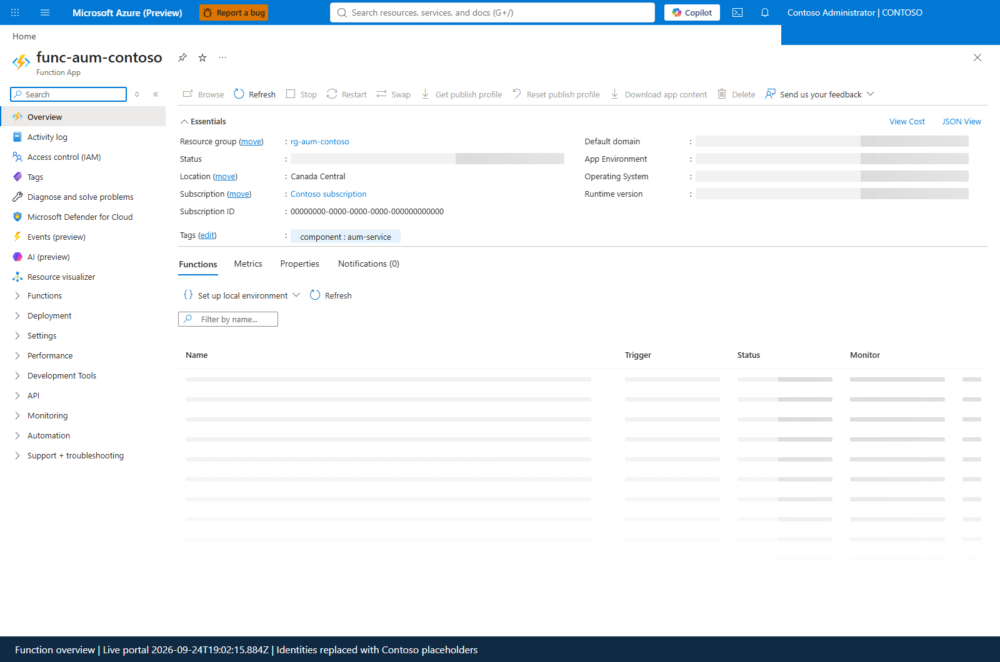
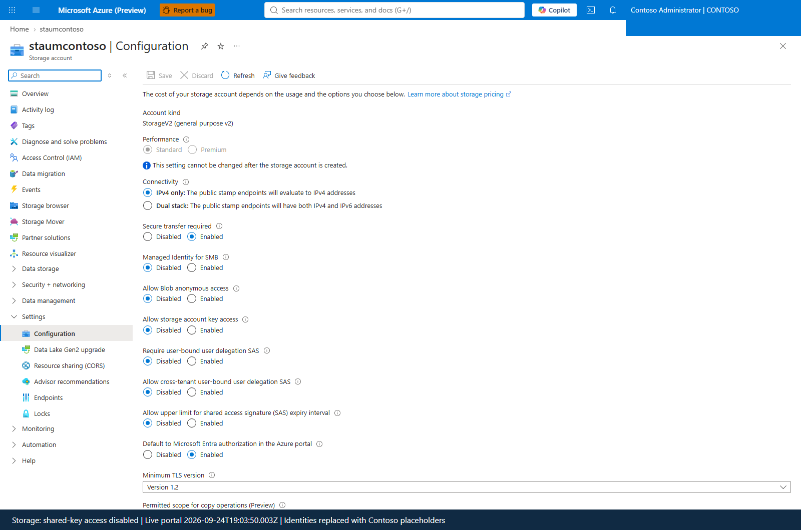
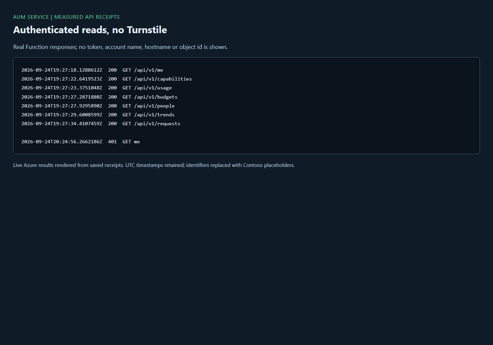
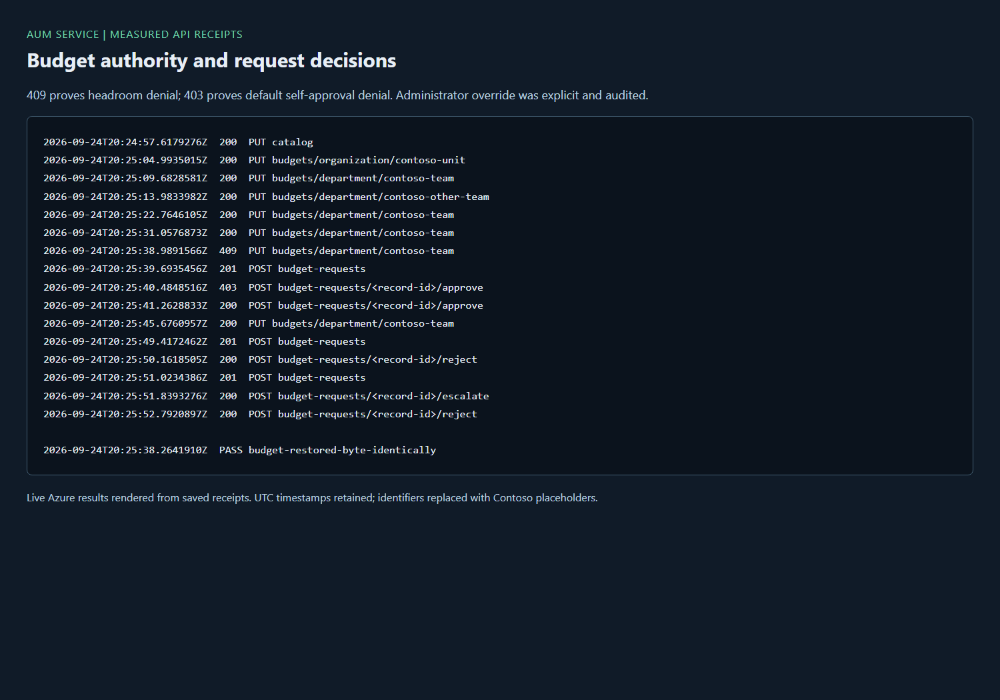
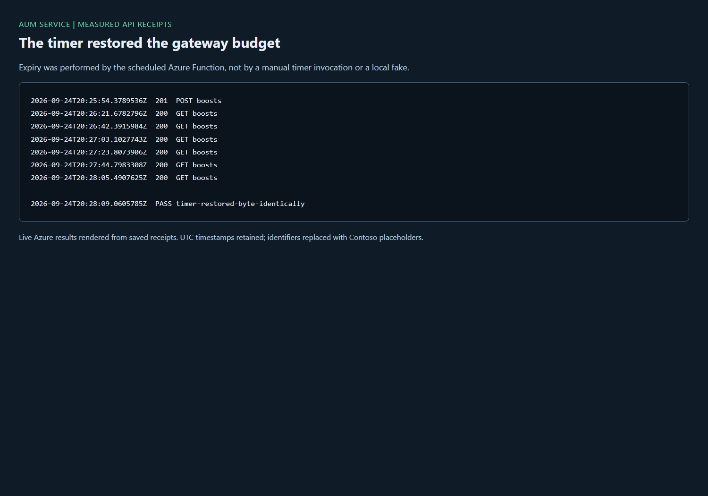

# Manage gateway budgets with the AUM service

The optional **Azure Usage Management (AUM) service** gives AUM a server-side
authority for viewers and scoped managers. It runs in your subscription on
Azure Functions Flex Consumption with identity-based Storage. It does not
require Turnstile, PostgreSQL, tenant administrator privileges, a client secret,
or a developer sign-in.

The gateway continues to enforce access and budgets. The service reads named
values and saved Log Analytics functions, validates every operation, writes
budgets with read-back, and records changes in its own audit table. It adds
budget requests, next-level decisions, temporary boosts and warning records.

> [!IMPORTANT]
> Gateway token quotas are approximate brakes, not hard monetary guarantees.
> AUM's headroom checks prevent over-allocation of configured child budgets;
> they do not turn delayed telemetry or APIM's approximate counters into a
> reservation ledger. Dollars remain estimated list-price showback.

## Choose a FinOps tool

Run the selector before creating infrastructure:

```powershell
.\scripts\Select-ClaudeFinOpsTooling.ps1
```

| Choice | Who signs in | Added infrastructure | Operational implications |
|---|---|---|---|
| None | Azure administrators use existing scripts | None | Gateway enforcement and telemetry still work |
| AUM Direct | Azure administrators only | None | Uses the person's Azure RBAC. It cannot scope a manager to one unit |
| AUM + AUM service | Assigned administrators, viewers, scoped managers | Functions and Storage; optional Insights/private endpoints | Independent authority, audit, requests and expiring boosts |
| Turnstile | Assigned administrators, viewers, scoped managers | App Service, PostgreSQL and its ingestion components | Web console and database operations |
| Turnstile + AUM | Same people, through Turnstile's API | Turnstile; no additional AUM service | AUM is another client of Turnstile, not a second writer |

The selector shows costs, roles and prerequisites. For a new gateway,
`Install-ClaudeGateway.ps1 -ChooseFinOps` opens the same selector after install.
Without the switch, the installer prints its command and creates no FinOps tool.

Pass `-Region <discovered-region>` for regional comparison prices. The selector
quotes a lean/public and a dedicated/private Turnstile shape from Retail meters
and calls out any additional Standard v2 APIM separately. A missing regional
meter is unknown, not a zero-cost component. Turnstile deployment requires its
existing parameter file and Python environment; no clone is silently modified.

Only one authority should write the gateway. If `turnstile-integration` says
Turnstile owns budgets or governance, AUM service mutations return
`other_authority`; its capabilities disable writes. Choose the Turnstile backend
in AUM, or intentionally move authority with the existing Turnstile connection
tools. Deployment does not change that setting for you.

## Prerequisites and roles

| Principal | Required access | Why |
|---|---|---|
| Deployer | Subscription Owner, or equivalent resource creation, role definition and assignment rights | Creates resources and least-privilege grants |
| App creator | Can create an app registration and own it | Defines AUM roles, API scope and pre-authorized CLI |
| Administrator | `AUM.Admin` assignment | Catalog, tiers, modes, manager mappings and all budget operations |
| Viewer | `AUM.Viewer` assignment | Unrestricted reads, no mutations or request decisions |
| Manager | `AUM.Manager` plus assigned manager-group membership | Reads and changes only the server-resolved scope |
| Developer | **No AUM assignment** | Uses the governed Claude client, never this administrative API |
| Function identity | Existing custom named-value writer role on one gateway | Reads/writes named values, not policies, network or keys |
| Function identity | Log Analytics Reader on the discovered workspace | Executes saved query functions |
| Function identity | Storage Blob Data Owner and Storage Table Data Contributor on its own account | Host/timer leases, package and service state |

The registration requires assignment and is single-tenant. Groups assigned to
the enterprise application are included with `groupMembershipClaims =
ApplicationGroup`. Group app-role assignment requires Entra ID P1/P2; direct
user-role assignments do not. Scoped managers still need their actual manager
group in the token. No directory-wide Graph application permission is requested.

Install Azure CLI, PowerShell 5.1 or 7, and Python 3.12 for local tests. Run
`az login` as the app-owning person. The gateway should have the current named
values and published analytics functions:

```powershell
.\scripts\Publish-ClaudeQueries.ps1 `
  -ResourceGroup <gateway-resource-group> `
  -ApimName <gateway-name> -WorkspaceName <gateway-workspace-name>
```

Publish all three functions: `ClaudeChargeback`, `ClaudeCost`, `ClaudeCodeDaily`.
The service's financial views use the first two. `ClaudeCodeDaily` remains the
gateway's optional productivity source; it is not represented as invented
per-unit productivity when telemetry cannot attribute it.

The budget-modes gateway version must already be deployed for mode writes.
If `bu-modes` is absent, mode-write capability is false; missing metadata reads
as strict. The service never rewrites the gateway policy to enable a feature.

## Deploy with the script

### 1. Discover targets

```powershell
.\scripts\Deploy-ClaudeAumService.ps1 -DiscoveryOnly
```

Select a subscription and gateway. The script follows the gateway's Application
Insights logger to its actual workspace, including a workspace in another
resource group. It never chooses the first workspace in a group. For an
ambiguous logger, pass `-WorkspaceResourceId`.

Gateway defaults come only from `Get-ClaudeGatewayTarget.ps1`: environment or
the installer's uncommitted record. Region and new service names have no
deployment-specific defaults.

### 2. Preview every cost choice

```powershell
.\scripts\Deploy-ClaudeAumService.ps1 `
  -SubscriptionId <subscription-id> `
  -GatewayResourceGroup <gateway-resource-group> -ApimName <gateway-name> `
  -ResourceGroup <new-service-resource-group> -Location <discovered-region> `
  -NamePrefix <chosen-prefix> -AlwaysReady 0 -Redundancy LRS `
  -Insights Off -Network Public -StorageNetwork Public -WhatIf
```

The script presents numbered choices even when parameters select them:

- **Always ready 0 or 1.** Zero has cold starts and no fixed compute charge.
  One keeps a 512-MiB HTTP instance warm and adds baseline and execution costs.
- **LRS, ZRS or GRS.** The quote is per GB-month actually stored. ZRS depends on
  regional support. GRS is asynchronous; it does not deploy a second Function.
- **Insights off or on.** Off retains audit records and platform metrics, not
  request traces. On adds ingestion/retention and disables local ingestion auth.
- **Public Entra-only or private.** Public still validates every token and
  disables storage shared keys. Private needs connected clients, VNet
  integration and DNS, and has fixed endpoint charges.
- **Storage network independently.** A public API can use private storage.
  Choose this when policy disables storage's public endpoint; two storage
  endpoints and DNS zones add $15.60/month in the dated example below.

`-WhatIf` performs discovery/pricing only. It creates no app registration,
resources, role assignments, deployment package or access token for the service.
An unavailable Retail API meter is displayed as **unknown**, never as free.

The inventory includes existing storage and plans. A shared plan is not an
eligible Flex host. Reuse requires an empty FC1 plan in the chosen region/group,
or a service-owned keyless storage account with matching redundancy. The script
does not turn off keys or change networking on somebody else's account.

### 3. Confirm and deploy

Repeat the command without `-WhatIf`. Review the summary and type `DEPLOY`.
For a reviewed unattended deployment, add `-Accept -Confirm:$false`.

The script:

1. Creates or reconciles the owned **AUM** registration and assigns the operator
   `AUM.Admin`.
2. Reuses the governance writer role's four actions, with assignment scoped to
   the selected gateway.
3. Deploys `infra/aum-service.bicep` and its scoped access modules.
4. Deploys the Python package with an Azure remote build, not Windows binaries.
5. Writes the uncommitted `onboarding/aum-service.json` deployment/removal record.

For later code-only updates, use `scripts/Publish-ClaudeAumService.ps1`. It uses
the recorded target and remote build without changing roles or infrastructure.

Keep the record. It contains addresses and identifiers, not secrets.
Re-run with the same group and prefix to update the same deployment.
`-SkipCodeDeploy` provisions infrastructure only and does not claim a working API.

### Private deployment

For a public API and private storage, choose `-Network Public -StorageNetwork
Private`. For an entirely private service, choose `-Network Private`. An
isolated service VNet can be created with `-NewNetworkAddressPrefix
<administrator-selected-nonoverlapping-RFC1918-/24>`; it has no peering to the
gateway. Alternatively supply existing service subnets and DNS zones.

Supply `-IntegrationSubnetId`, `-PrivateEndpointSubnetId`, `-SitesDnsZoneId`,
`-BlobDnsZoneId` and `-TableDnsZoneId`. Use service-specific subnets:

- Integration subnet delegated to `Microsoft.App/environments`, sized for Flex.
- Separate private-endpoint subnet.
- Linked `privatelink.azurewebsites.net`, `privatelink.blob.core.windows.net`
  and `privatelink.table.core.windows.net` zones.

The template creates three endpoints and disables public access to the Function
and new storage. The deployer and administrators must resolve/reach the private
Function and SCM endpoints. Private DNS zone reuse can reduce the quoted fixed
cost. VPN/ExpressRoute and central DNS operations are separate administrator
choices, not hidden free components. The gateway's topology is untouched.

Public API/private storage uses only the blob and table endpoints and zones;
it needs no sites private zone. In both private-storage shapes the template
explicitly enables `outboundVnetRouting.allTraffic`. Measured in this deployment:
private endpoints, DNS and data roles without it still gave OneDeploy a 403;
the same deployment succeeded after this routing property was enabled.

## Deploy in the Azure portal

The portal route uses the same Bicep deployment translated to ARM, so identity,
role and storage settings do not drift from the script.

### 1. Create the registration

1. Open **Microsoft Entra ID > App registrations > New registration**.
2. Set **Name** to your chosen AUM display name and **Supported account types**
   to **Accounts in this organizational directory only**. Leave redirect URI
   empty: AUM obtains a token through Azure CLI, not a web redirect.
3. On **Owners**, confirm your account is an owner.
4. On **App roles > Create app role**, create `AUM.Admin`, `AUM.Viewer` and
   `AUM.Manager`, each with **Allowed member types: Users/Groups** and enabled.
5. On **Expose an API**, set the Application ID URI to `api://<application-id>`.
   Add scope `AUM.Access`, enabled, **Who can consent: Admins and users**.
   This does not override tenant consent policy.
6. Under **Authorized client applications > Add a client application**, enter
   Azure CLI's published public-client ID
   `04b07795-8ddb-461a-bbee-02f9e1bf7b46` and select `AUM.Access`.
7. On **Manifest**, set `api.requestedAccessTokenVersion` to `2` and
   `groupMembershipClaims` to `ApplicationGroup`. Save.
8. Open the linked **Enterprise application > Properties**. Set
   **Assignment required? Yes**. Under **Users and groups**, assign the operator
   **AUM.Admin**.

Azure CLI pre-authorization is the consent-free route proven by Turnstile.
No `User.Read` permission, secret or tenant-wide admin-consent grant is needed.

### 2. Create the narrow gateway role

In **Subscription > Access control (IAM) > Add > Add custom role**, reuse
**Claude gateway governance writer** if present. Otherwise create it with:

```text
Microsoft.ApiManagement/service/read
Microsoft.ApiManagement/service/namedValues/read
Microsoft.ApiManagement/service/namedValues/write
Microsoft.ApiManagement/service/operationresults/read
```

Set the gateway resource group as an assignable scope. The eventual role
assignment is on the gateway itself, not the whole subscription. No delete,
policy, network, credential or wildcard action belongs in this role.

### 3. Deploy the template and code

```powershell
az bicep build --file .\infra\aum-service.bicep `
  --outfile .\.aum-local\aum-service.json
```

1. Open **Deploy a custom template > Build your own template in the editor**.
2. Load that generated ARM file and save.
3. Select the chosen **Subscription**, isolated **Resource group**, and supported
   **Region**. Fill `namePrefix`, `clientId`, the discovered gateway/workspace
   resource IDs and workspace customer ID, and `writerRoleDefinitionId`.
4. Explicitly choose `alwaysReadyInstances`, `storageRedundancy`,
   `enableInsights` and `inboundAccess`. Supply the private subnet/DNS parameters
   only for private mode.
5. Select **Review + create**, inspect the resources/role assignments, then
   **Create**.
6. In the Function's **Identity > System assigned**, verify **Status: On**.
7. In the storage account's **Configuration**, verify **Allow storage account
   key access: Disabled** and **Allow Blob anonymous access: Disabled**.
8. In the Function's **Settings > Environment variables**, verify the
   `AzureWebJobsStorage__accountName` and five `AUM_*` settings. There is no
   storage connection string.
9. Deploy the Python package from your workstation as in the CLI instructions
   below. The portal editor does not build a Flex Python application.
10. In **Functions**, verify `http_api`, `expire_boosts` and
    `warning_thresholds`; in **Flex Consumption > Scale and concurrency** verify
    the administrator's warm-instance choice.

The following captures are from the real deployment, with identities replaced
by Contoso placeholders. The overview was captured before code deployment;
its loading details are not proof of a healthy API. The copied session then
required sign-in on the Entra blade and capture stopped. Do not treat missing
Entra/Functions screenshots as completed portal tests.





### Pending owner batch captures

The lead captures version-1 `guide/captures/p55.json` after fresh owner sign-in.
These inline paths are deliberately pending, not broken images, placeholders or
passing evidence. Resource discovery uses the logical `component=aum-service`
tag; Entra discovery uses the operator's `AUM_APP_DISPLAY_FILTER`. Runtime
`--select` values choose discovered candidates. The spec explicitly distinguishes
app-registration from enterprise-application blades and uses a private redaction map.

| Pending batch capture (spec id) | Exact portal verification | Image |
|---|---|---|
| `p55-aum-app-roles` | App registrations > AUM > App roles: Admin, Viewer, Manager enabled for Users/Groups | `docs/guide/p55-aum-app-roles.png` |
| `p55-aum-api-scope` | Expose an API: AUM.Access enabled; Azure CLI listed under Authorized client applications | `docs/guide/p55-aum-api-scope.png` |
| `p55-aum-token-manifest` | Manifest: requestedAccessTokenVersion 2, groupMembershipClaims ApplicationGroup | `docs/guide/p55-aum-token-manifest.png` |
| `p55-aum-assignment-required` | Enterprise applications > AUM > Properties: Assignment required? Yes | `docs/guide/p55-aum-assignment-required.png` |
| `p55-aum-assigned-roles` | Enterprise applications > AUM > Users and groups: correct user/group roles | `docs/guide/p55-aum-assigned-roles.png` |
| `p55-aum-function-overview` | Function App > Overview: Running, selected region, Python runtime | `docs/guide/p55-aum-function-overview.png` |
| `p55-aum-function-identity` | Settings > Identity > System assigned: Status On | `docs/guide/p55-aum-function-identity.png` |
| `p55-aum-function-triggers` | Functions: http_api, expire_boosts, warning_thresholds | `docs/guide/p55-aum-function-triggers.png` |
| `p55-aum-scale-choice` | Scale and concurrency: administrator-selected always-ready count and 512-MiB instance size | `docs/guide/p55-aum-scale-choice.png` |
| `p55-aum-private-routing` | Networking > VNet integration: service subnet, all outbound traffic routed | `docs/guide/p55-aum-private-routing.png` |
| `p55-aum-storage-keyless` | Storage > Configuration: shared-key and anonymous blob access Disabled | `docs/guide/p55-aum-storage-keyless.png` |
| `p55-aum-storage-private` | Storage > Networking: Public network access Disabled; private endpoint connections Approved | `docs/guide/p55-aum-storage-private.png` |

Optional Insights uses a **non-secret routing connection string** and
`APPLICATIONINSIGHTS_AUTHENTICATION_STRING=Authorization=AAD`. It is not a
storage/authentication credential. `DisableLocalAuth=true` makes the routing
string insufficient to send telemetry. With Insights off, neither setting exists.

## Deploy with Azure CLI

Use the script for app-owner reconciliation, or reproduce the preceding Graph
manifest steps with `az rest` and JSON body files. Never put quoted JSON, `&`,
or an unquoted pipe into an `az` argument on Windows.

After registration, pass your explicit values in a local ARM parameter file:

```powershell
az group create --name <service-group> --location <selected-region>
az deployment group what-if --resource-group <service-group> `
  --template-file .\infra\aum-service.bicep `
  --parameters '@<local-parameter-file>'
az deployment group create --name <chosen-deployment-name> `
  --resource-group <service-group> --template-file .\infra\aum-service.bicep `
  --parameters '@<local-parameter-file>'

# Zip the CONTENTS of service\aum, not its containing folder.
Compress-Archive -Path .\service\aum\* -DestinationPath .\.aum-local\aum-package.zip
az functionapp deployment source config-zip --resource-group <service-group> `
  --name <function-name> --src .\.aum-local\aum-package.zip --build-remote true
```

The deployer creates unique worktree-local package paths and cleans them.
Remote build is required for Linux-compatible Python dependencies when the
workstation runs Windows.

## Assign roles and manager groups

Role precedence is **Admin > Viewer > Manager**. A Viewer+Manager sees everything
but cannot edit. Remove the Viewer assignment if the person should be scoped.
An Admin assignment always makes the person unrestricted.

### Assign an app role

- **Script:** `New-ClaudeAumEntraApp.ps1` assigns the app-owning operator Admin.
  Use the portal or Graph for other user/group role assignments.
- **Portal:** **Microsoft Entra ID > Enterprise applications > AUM > Users and
  groups > Add user/group**. Select the person or owned manager group and the
  appropriate app role.
- **CLI:** find the enterprise application's object ID with
  `az ad sp show --id <client-id>`. Write a JSON file with `principalId`,
  `resourceId` (enterprise application object ID), and `appRoleId`, then:

```powershell
az rest --method POST `
  --url 'https://graph.microsoft.com/v1.0/groups/<group-id>/appRoleAssignments' `
  --headers 'Content-Type=application/json' --body '@<role-assignment.json>'
```

Assign each manager group to the AUM enterprise application as `AUM.Manager`,
and add its managers as **direct members**. Do not rely on nested group
membership for an enterprise-app group assignment. Use a group you own; no
directory-wide consent is involved.

### Map a unit or team to its manager group

Get a token and a fresh revision, then call the Admin-only mapping route:

```powershell
$record = Get-Content .\onboarding\aum-service.json -Raw | ConvertFrom-Json
$token = az account get-access-token --scope $record.scope --query accessToken -o tsv
$headers = @{ Authorization = 'Bearer ' + $token.Trim() }
$budgets = Invoke-RestMethod "$($record.endpoint)/api/v1/budgets" -Headers $headers
$headers['If-Match'] = '"' + $budgets.revision + '"'
$body = @{ manager_group_id = '<owned-group-object-id>'; reason = 'Delegate the finance unit' } | ConvertTo-Json
Invoke-RestMethod "$($record.endpoint)/api/v1/manager-groups/<unit-id>" `
  -Method Put -Headers $headers -ContentType application/json -Body $body
```

The mapping is in service storage, not the 4,096-character registry. In the
portal, inspect **Storage account > Storage browser > Tables > AumState**,
partition `managers`. Treat the table as an inspection/recovery surface, not
a competing editing interface: ordinary changes must go through the audited API.
The CLI equivalent of the last request is `az rest` with
`--resource api://<client-id>`, `--headers If-Match=<revision>`, and a JSON body
file. The explicit PowerShell token form is preferable when requesting the
delegated `AUM.Access` scope.

A unit manager sees its teams and direct members and can set its teams'
budgets. A team manager does not gain access to the whole parent unit. Any
manager can set observed person budgets in scope. Unit budgets, catalog, tiers
and enforcement modes are Admin-only.

An overage claim grants **no group-based scope**. `/me` returns
`manager_scope: null` for unrestricted principals and a scope object for managers,
including an object of empty arrays for no assignments. Clients must not turn
that empty object into unrestricted access.

## Verify reads, writes and expiry

### Read-only verification

```powershell
$record = Get-Content .\onboarding\aum-service.json -Raw | ConvertFrom-Json
$token = az account get-access-token --scope $record.scope --query accessToken -o tsv
$headers = @{ Authorization = 'Bearer ' + $token.Trim() }
foreach ($view in @('me','capabilities','usage','budgets','people','trends','requests')) {
    Invoke-RestMethod "$($record.endpoint)/api/v1/$view" -Headers $headers
}
```

Never print or persist the token. An anonymous call must return 401, not a
sign-in redirect or data. A bad-role token returns 403. A scope denial is
**Not in your scope**, not a zero-usage result.

People are **observed in Log Analytics**, not every person in Entra. An inactive
person can be absent. Requests use `ClaudeChargeback`; costs/trends/people use
`ClaudeCost`. Query windows are UTC, at most 93 days. A request page has at most
200 rows; use `next_cursor`. Explicit out-of-scope filters return 403.

### Reversible budget change

1. Use a test team with headroom and record its limit.
2. Read `/budgets`, retain `revision`, then PUT
   `/budgets/department/<test-team>` with `If-Match` and
   `{"token_limit":<new-monthly-tokens>,"reason":"Pilot verification"}`.
3. Inspect the gateway's **APIs > Named values > bu-registry** in the portal,
   or run `az apim nv show --resource-group <gateway-group> --service-name
   <gateway> --named-value-id bu-registry --query value`.
4. Read budgets again and restore the original limit with the new revision.
5. Inspect `/audit` as Admin. Both writes must have durable intents and outcomes.

Never restore an entire old registry over another administrator's changes.
The API serializes service writers, uses ARM ETags, checks read-back and
compensates completed writes in reverse order when a multi-value write fails.
External writers do not share the service lease. Conflicts fail rather than
overwrite them; `rollback_failed` needs administrator reconciliation.

Unit/team budgets are monthly. Person overrides are daily and reserve their
daily amount across 31 days when checking parent allocation, so the next longer
calendar month cannot silently over-allocate the parent.
Remaining allocation is not the same as remaining metered usage.
Clearing an override must still fit the higher tier default; making a child
unlimited under a finite parent is refused.

### Requests, decisions and boosts

1. POST `/budget-requests` with `scope_type`, `scope_id`, `token_limit` and
   `reason`. The server selects the next-level approver, never a client group ID.
2. The next-level manager or another Admin calls
   `/budget-requests/<id>/approve` or `/reject`, with the current `version`
   and a reason. Self-approval is refused by default. Approval rechecks current scope and
   headroom; submitting a request does not reserve headroom.
3. The requester or approver can call `/escalate`. A team-level approver becomes
   its unit; the next escalation reaches Admin. Escalating beyond Admin is refused.
4. POST `/boosts`, with a fresh budget revision, the target, larger `token_limit`,
   reason and timezone-qualified `expires_at` (within 31 days).
5. Watch `/boosts` and the gateway named value. The minute timer restores the
   prior value. A newer independent edit is preserved and the boost becomes
   `superseded`; an Azure failure leaves it due for a later tick.

Do not allocate permanent child budgets into temporary parent headroom: the
server checks against the parent's post-expiry baseline too. Overlapping boosts
and normal edits to an actively boosted target are refused.

The 15-minute warning timer writes version-1 `budget.warning` facts: tokens,
`prompt_completion_only` basis, exact decimal usage text, exclusive UTC period
bounds, source and an effective-limit version (a stable policy/content
fingerprint, not a monotonically increasing revision). The deterministic ID includes the
scope, interval, threshold, basis and limit version. A changed nominal limit
rearms a warning; restoring an identical limit reuses its earlier fact.
Facts contain no recipient addresses or transport status. Future delivery must
resolve current scope recipients/domain policy separately. Email is not
configured: `email_delivery` is false. [ACS's Azure-managed-domain quota](https://learn.microsoft.com/azure/communication-services/concepts/service-limits#email) of ten
sends per subscription/hour requires aggregated digests, not a promise of
real-time per-person emails at 500,000.

An Admin can explicitly include `admin_override: true` on a decision, with a
reason. Managers cannot use it. It is recorded in both the decision and audit,
does not bypass headroom, and is advertised as `approval_admin_override`.
This is the same ultimate authority an Admin already has through direct budget
writes, not a claim of independent two-person approval. A sole-admin installation
can test the workflow without inventing a second identity.

### Manager-only live journey

Use `scripts/Test-ClaudeAumManagerJourney.ps1`, first
as a dry run. Changing the current account's role/group membership affects
other tests and already-issued tokens remain valid until expiry. Coordinate
with the lead before `-Execute`, and require a fresh token after each change.
The script must restore assignments and owned-group membership in `finally`,
then prove Admin access. Never use a browser profile owned by another run.

```powershell
# Default is read-only: reports exactly what would change.
.\scripts\Test-ClaudeAumManagerJourney.ps1 `
  -UnitManagerGroupId <owned-unit-manager-group-id> `
  -TeamManagerGroupId <owned-team-manager-group-id> `
  -UnitId <test-unit> -TeamId <test-team> -OutsideTeamId <other-team>
```

Only after the lead's explicit go-ahead, add `-Execute -LeadApproval go`.
If CLI token caching retains Admin claims, the script refuses to call it a
manager test. Supply `-TokenAcquirer` with a script block that returns a freshly
issued delegated token for the supplied scope/phase. It never clears the shared
CLI cache, and always restores access in `finally`.

## API reference

The versioned contract is
[`service/aum/openapi.yaml`](../service/aum/openapi.yaml).
Every route requires a delegated Entra bearer token with `AUM.Access`.
No cookies, client secrets or Function keys grant authority.

| Route | Purpose |
|---|---|
| `GET /api/v1/me` | Identity, access and Turnstile-compatible manager scope |
| `GET /api/v1/capabilities` | Schema version 1, caller-narrowed boolean feature flags and limits |
| `GET /api/v1/usage`, `/trends`, `/people`, `/requests` | Scoped analytics; bounded people/request pages |
| `GET /api/v1/budgets`, `/catalog`, `/tiers` | Gateway-backed configuration |
| `PUT/DELETE /api/v1/budgets/{scope_type}/{scope_id}` | Audited, revision-checked budget mutation |
| `PUT /api/v1/catalog`, `/tiers/{tier}`, `/modes/{scope_id}` | Admin-only configuration |
| `PUT /api/v1/manager-groups/{scope_id}` | Admin-only manager-group mapping |
| `GET/POST /api/v1/budget-requests` | Caller-visible next-level budget requests |
| `POST /api/v1/budget-requests/{id}/{approve,reject,escalate}` | Version-checked decisions |
| `GET/POST /api/v1/boosts` | Temporary budget increases with durable expiry |
| `GET /api/v1/notifications` | Scope-filtered warning records; not delivered email |
| `GET /api/v1/audit` | Admin-only change intents/outcomes |

All mutation bodies require `reason`. Budget/configuration writes require
`If-Match` from a fresh `/budgets` revision, wrapped in double quotes as an HTTP
entity-tag (or use the response's `ETag` header). Never automatically retry a write.
After a timeout, read the target and audit log to establish its outcome.
Unknown capabilities default to false in a client.

## Cost

The script fetches list-price meters from the
[Azure Retail Prices API](https://learn.microsoft.com/rest/api/cost-management/retail-prices/azure-retail-prices).
The following is a **dated example**, not a deployment default: Canada Central,
2026-09-24, USD, 730 hours per month.

| Choice/meter | List price | Basis |
|---|---|---|
| Zero always-ready instances | $0 fixed compute | Execution, timer and storage operations still bill |
| One 512-MiB always-ready HTTP instance | $6.57/month baseline | Baseline GB-seconds; active execution extra |
| Tables LRS | $0.05/GB-month | Actual stored data, not preallocated capacity |
| Tables ZRS | $0.0625/GB-month | Regional support required |
| Tables GRS | $0.066/GB-month | Asynchronous geo replication |
| Application Insights off | $0 added log ingestion | No request traces |
| Optional Insights ingestion | $2.76/GB | Retention/allowances are workspace-specific |
| Three private endpoints | $21.90/month | Global $0.01/hour per endpoint |
| Three new private DNS zones | $1.50/month | First 25 zones, $0.50 each |
| Public API with private storage | $15.60/month fixed networking | Two endpoints and two new DNS zones |
| On-demand execution | $0.000037/GB-second | Regional marginal rate; grants are subscription-wide |

Blob package/host storage, Table operations, bandwidth and retained audit growth
are additional usage charges. A timer running each minute is not literally zero
activity at rest. With no warm instance, public Entra-only access, Insights off
and a small retained ledger, there is no fixed compute/network bill. Measure
actual consumption; never promise a free service based on subscription grants.

Turnstile's approximately $58-159/month examples describe its different
architectures, not a required AUM cost. See [Turnstile costs](TURNSTILE.md#what-it-costs).

## Limits and 500,000 developers

| Boundary | What this release does |
|---|---|
| Observed people | Server-side KQL filter, stable-ID paging, maximum 200 results per HTTP page; no directory scan |
| Manager scope | Token groups only, 200-group claim ceiling, fail-closed overage; no Graph broadening |
| Catalog/overrides | Existing gateway formats, **4,096 characters per named value**; reject capacity rather than truncate |
| 500,000 person overrides | **Not supported by named values.** Projection-backed budgets and single cross-tool writer are P48 |
| Active/idle membership | Legacy gateway membership, or the latest unambiguous request stamp for projection-backed people; never an obsolete legacy map under projection. Unknown parents cannot receive allocations |
| Scope revocation | Fresh mapping lookup each request, but group-role changes require a newly issued token; existing tokens expire normally |
| Telemetry | Delayed, retained for a finite workspace window; cache-write cost is unknown rather than fabricated |
| Mutations | Serialized per service, conditional ARM writes; no distributed transaction with an independent external writer |
| Storage | Dedicated Table account; requests, boosts, notifications and audit are not placed in named values |
| Full-scale performance | Bounded-query tests are not a measured 500,000-person latency/SLA claim |

Do not present this as complete P48. Choosing a server-side authority fixes
authorization; it does not remove a named-value storage ceiling or an ARM
throttle. Large organizations must plan catalog size, individual override
count, audit retention, query latency and manager concurrency explicitly.

## Troubleshoot

| Exact error/symptom | Cause | Action |
|---|---|---|
| `Not signed in. Run: az login` | CLI has no account | Sign in as the app-owning administrator |
| `AADSTS50105` | No app-role assignment | Enterprise application > Users and groups; assign an AUM role |
| `AADSTS65001` / **Need admin approval** | Wrong scope/client or CLI was not pre-authorized | Reconcile the owned app; request `api://<app-id>/AUM.Access`, not Graph permissions |
| `Links to EntitlementGrant are not supported between specified entities.` | Graph relationship does not support `principalId` filtering | Use the script's paged unfiltered `appRoleAssignedTo` route |
| Azure CLI `KeyError: 'roleName'` | CLI custom-role update schema mismatch | The AUM deployer uses the explicit ARM role-definition schema |
| `'logger' is misspelled or not recognized by the system` | `az apim logger` is not available in that CLI | Discovery uses the APIM `/loggers` ARM resource |
| `Gateway telemetry is ambiguous` | Multiple/no identifiable logger | Pass the linked workspace's resource ID; do not pick an arbitrary workspace |
| `Invalid or expired AUM access token` | Issuer, audience, signature, time or token version mismatch | Get a fresh v2 token for this AUM registration/tenant |
| Empty `manager_scope` | No matching assigned group, overage, stale token or missing mapping | Inspect role assignment, direct group membership, mapping and token claims locally |
| `AUM.Viewer is read-only` | Viewer takes precedence over Manager | Remove Viewer if scoped management is intended; refresh token |
| `other_authority` | Turnstile owns the gateway | Choose one authority; do not run two writers |
| `stale_revision` | Configuration changed after preview | Refresh budgets, inspect differences, confirm again |
| PowerShell `The format of value '<revision>' is invalid.` | An unquoted `If-Match` value is not an HTTP entity-tag | Wrap the JSON revision in double quotes, or use the API's `ETag` header |
| `insufficient_headroom` | Parent allocations are already committed | Lower another allocation or request more one level up |
| `unknown_parent` | Person is not attributable to a known budget parent | Correct membership/telemetry; never grant guessed scope |
| `named_value_capacity` | Serialized value exceeds 4,096 characters | Remove unnecessary overrides or complete the projection-backed budget migration |
| `rollback_failed` | Azure/external writer prevented compensation | Inspect audit and current named values; reconcile only affected entries |
| `analytics_incomplete` | Partial/failed query, missing saved function or permission | Publish queries; verify workspace selection and Log Analytics Reader; do not report zero usage |
| KQL `SEM0064: Cannot compare values of types string and string` | Relational comparison on a string cursor | Use the current service, which applies `strcmp()` to people/request IDs |
| `writer_busy` / `lease_lost` | Another writer or storage connectivity loss | Read state before retrying; inspect private DNS/RBAC |
| ARM `RequestDisallowedByPolicy` | Tenant policy rejects chosen public/service shape | Choose a compliant private topology; do not re-enable shared keys |
| Storage `AuthorizationPermissionMismatch` | Data-role propagation or wrong identity | Verify Blob Data Owner and Table Data Contributor on this account, then retry reads later |
| `RoleAssignmentScopeNotAssignableToRoleDefinition` just after extending a custom role | Role-definition propagation | Confirm the selected gateway group is an assignable scope; wait and rerun the idempotent deployment |
| `InaccessibleStorageException` / `BlobUploadFailedException` / 403 during OneDeploy | Policy disabled public storage, or deployment traffic still bypasses the integration subnet | Select and price private storage; verify approved endpoints, private DNS and `outboundVnetRouting.allTraffic=true`. Never enable keys as a workaround |
| HTTP 404 after package deployment | Root package layout or Functions indexing failed | Ensure `host.json`, `function_app.py`, requirements and package directory are at ZIP root |
| Timer not listed / boost remains active | Missing extension bundle, indexing, storage lease or failed restore | Inspect Functions/host logs and durable boost/audit records; minute ticks retry |
| Private DNS zone deletion fails on nested resources | VNet links still exist | The removal script unlinks only recorded service VNets first; a new shared link is refused for review |
| Portal capture reaches sign-in | Copied session expired | Stop capture and tell the lead; never open or share the original profile |

## Test and remove

```powershell
python -m venv .venv-aum-service
.\.venv-aum-service\Scripts\python.exe -m pip install -r .\service\aum\requirements.txt
.\tests\Test-AumService.ps1
.\tests\Test-AumDeployment.ps1
node .ironclad\gate.mjs --stage packet
```

The service tests include real RSA verification, scope boundaries, PowerShell/
Python byte parity, headroom, fake ARM/Log Analytics HTTP requests, decisions,
warning records and timer expiry. Five isolated mutations must fail the tests:
scope widening, removed headroom, serializer drift, no expiry, and an
out-of-scope manager write. `Test-All.ps1` explicitly records SKIP when the
service venv is absent; it does not claim those checks passed.

`tests/Test-AumServiceLive.ps1` is an explicitly opted-in, empty-test-catalog
Admin harness. It checks real reads, request paging, a named-value change and
byte-identical restore, headroom denial, default self-approval denial, explicit
Admin decisions, escalation and a short boost reverted by the actual timer.
It does not change any Entra membership. Use only the discovered isolated test
gateway; never run it against an existing business catalog.

Before removal, export audit/history and resolve outstanding boosts. The service
does not restore every budget merely because its resources are removed.

```powershell
.\scripts\Remove-ClaudeAumService.ps1 -WhatIf
.\scripts\Remove-ClaudeAumService.ps1
# Optionally remove the owned AUM app too:
.\scripts\Remove-ClaudeAumService.ps1 -RemoveAppRegistration
```

Removal uses the deployment record, deletes only its service resources and
external role assignments, and leaves the gateway, workspace, resource group
and reused resources. Do not delete a shared resource group as a shortcut.
Tenant policy can create extra NSGs. Inspect any remainder and delete an isolated
test group only after confirming no shared or attached resource remains.

## Live verification receipt

Measured 2026-09-24 UTC, against the isolated non-production gateway/workspace,
not the reference gateway's Turnstile authority:

| Flow | Result |
|---|---|
| Owned AUM registration and Azure CLI token | `AUM.Admin`, v2 `AUM.Access`, audience matched; no consent prompt |
| `/me`, capabilities, usage, budgets, people, trends, requests | HTTP 200; anonymous `/me` 401 |
| Real analytics | 3,883 requests, one observed person; four unpriced rows, so the priced subtotal is not a zero-cost claim |
| Request cursor | Two real 100-row pages, no overlapping request IDs; both returned a continuation |
| Test-team limit | Changed through the Function, read from ARM, restored byte-identically at 20:25:38Z |
| Headroom | Above-parent write returned 409 |
| Approval/rejection/escalation | Default self-approval 403; explicit audited Admin override and versioned decisions succeeded |
| Boost | Expiry 20:27:04Z; observed expired and byte-identical registry restoration at 20:28:09Z, performed by the real minute timer |
| Manager-only journey | Read-only preparation passed at 20:29:47Z; execution held for the lead's explicit go-ahead |
| Portal | Two resource captures; stopped at Entra sign-in, as required |
| Final restoration | At 20:53:06Z the original empty registry matched byte-for-byte, no boosts were active, Admin access remained, and 38 audit records were exported |
| Cost cleanup | At 21:11:56Z all paid pilot resources and the isolated group were removed; only the free owned AUM registration remains |

The following images render the **actual saved API receipts**, with IDs removed.
They are API evidence, not screenshots of an AUM or Azure portal interface.





## Next steps

- Configure the AUM client with the returned endpoint and scope. It uses
  `/capabilities` to show only supported operations.
- Assign a Viewer and a scoped Manager and verify both with fresh tokens.
- Choose an audit retention/export policy before large-scale use.
- Connect warning delivery to the chargeback-report notification pipeline when
  available; pending records do not imply email delivery.
- Read [ADR-0023](adr/0023-aum-service.md) for authority and failure semantics.
