# Use AUM - Azure Usage Management

AUM is an independent FinOps tool for an existing Claude gateway. It provides a
terminal dashboard and scriptable commands over one engine. **Turnstile is not a
prerequisite.** Without an explicitly configured HTTP backend, AUM defaults to
**Direct**: Azure CLI, the gateway's named values, Log Analytics and the repository's
PowerShell writers. Run `aum` for the console, or add a noun and verb for automation.

An optional **AUM service** adds its own Entra roles and server-enforced scoped
management, without Turnstile. Administrators can instead choose Turnstile as
their web FinOps tool; AUM can optionally use its API as another keyboard-facing
client. Example data is an explicit test backend, never the production default.

## Choose the FinOps tool and authority

| Choice | What it offers | Who signs in | Additional Azure resources and cost |
|---|---|---|---|
| **AUM Direct** | Terminal/commands, gateway budgets and modes, observed-people search, hourly token facts, daily statistical cost findings, reports; no FinOps server | Azure administrators with gateway permissions and workspace query access | No additional server infrastructure. Existing API Management, logging and applicable workspace-query charges continue |
| **AUM + AUM service** | Independent scoped authority, current gateway budgets, audited conditional changes, native requests/approvals, expiring boosts and warning facts | Its own `AUM.Admin`, `AUM.Viewer`, `AUM.Manager` roles; manager groups resolved by the service | Functions and Storage, plus chosen monitoring/network features. Region, execution/storage volume, always-ready instances, private endpoints and DNS determine cost |
| **Turnstile** | Web FinOps console, richer charts, assistant and optional model-gateway pages | Its own Turnstile roles and server-resolved manager scope | App Service, PostgreSQL and background-job resources. Its standard deployer may create another gateway; do not accidentally pay for or overwrite a second one |
| **Turnstile + AUM client** | The same Turnstile authority with a terminal/automation face | Existing Turnstile role through the Azure CLI token | The CLI adds no server infrastructure; Turnstile costs remain. No AUM service is required |

These are deployment choices, not permission upgrades performed by AUM.
Use one write authority for a gateway. Direct and the AUM service respect an
existing Turnstile ownership setting rather than silently bypassing it.

> [!IMPORTANT]
> Direct is an **administrative Azure RBAC connection, not a unit-scoped boundary**.
> Azure roles do not restrict a caller to some business units inside one gateway.
> To add scoped managers or viewers, choose the AUM service or Turnstile.
> Settings states this explicitly. An AUM service user with an app role does not
> need the service managed identity's Azure permissions.

## Create owned groups and register governed scopes from AUM

This flow uses the signed-in administrator's existing delegated Graph access.
AUM does not grant consent, assign directory roles or create an application
credential. New groups are ordinary, non-mail-enabled security groups. Their
verified owner is the signed-in person; group ownership does not itself grant a
Turnstile/AUM service app role.

1. In **Governance**, open `:` and choose **Add unit or team**.
2. Enter an Entra group-name prefix. The picker searches Graph server-side;
   **Next page** follows its bounded continuation. Select an existing assigned
   security group, or choose **Create new**.
3. For a new group, enter a name and description, review the signed-in owner and
   membership-refresh implications, and type the entire name before **Apply**.
   Search again to select the newly created group.
4. In the scope form, choose **Unit** or **Team**, supply a stable scope id and
   display label, and select the parent unit for a team. Preview, then Apply.
5. Set the unit/team monthly token budgets and choose the enforcement mode.
   Direct verifies named values immediately; Turnstile follows the apply job;
   the AUM service requires a reason and current revision.
6. Group membership is not effective at the gateway merely because Graph saved
   it. Use **Refresh selected group membership** in Direct, or the selected
   server authority's membership publication path. Preview any reassignment.

Equivalent AUM commands:

```powershell
aum group find aum-e2e- --limit 50 --backend direct
aum group create aum-e2e-unit-example --description "Temporary acceptance group" --what-if
aum group create aum-e2e-unit-example --description "Temporary acceptance group" `
  --apply --confirm aum-e2e-unit-example
aum group member <owned-group-object-id> --apply
aum catalog set unit <unit-id> --name "Example test unit" --group <selected-group-object-id> --apply
aum catalog set team <team-id> --name "Example test team" --group <selected-group-object-id> --parent <unit-id> --apply
aum budget set unit <unit-id> 100k --apply
aum budget set team <team-id> 1k --apply
aum mode set team <team-id> strict --apply
aum mode set team <team-id> allowance --allowance 10 --apply
aum mode set team <team-id> notify --apply
aum governance refresh-membership --scope <unit-id> --scope <team-id> --what-if
aum governance refresh-membership --scope <unit-id> --scope <team-id> --apply --allow-reassignment
```

`group member` defaults to the signed-in person when `--member-id` is omitted.
It modifies only a group that person owns, verifies the result and never changes
unrelated memberships. `--remove` removes the member reference, not the directory
user. The example amounts are not deployment defaults.

Selected-scope refresh reuses the repository's delegated Graph group reader,
depth ordering and `bu-members` serializer. Teams win over their parent units.
Unrelated mappings and tier entitlement remain intact. Existing assignments that
move require explicit `--allow-reassignment`. A lookup error is not treated as an
empty group. Projection-backed gateways must use their projection pipeline.

## Add and remove developers

Developer entitlement is ordinary Entra group membership followed by gateway
publication. AUM uses the signed-in administrator's delegated Microsoft Graph
token from Azure CLI. It does not request tenant consent, add an app permission
or grant a directory role.

```powershell
aum developer find amara --limit 50
aum developer add amara@contoso.com --tier standard --unit sales-emea --what-if
aum developer add amara@contoso.com --tier premium --unit sales-emea --apply
aum developer remove amara@contoso.com --what-if
aum developer remove amara@contoso.com --apply --confirm amara@contoso.com
```

`developer find` searches the whole Entra directory by display name, mail and
UPN, including guest accounts by their invited address (`mail`/`otherMails`) and
their `#EXT#` UPN stem. Results are bounded and paged. Microsoft Graph directory
search uses the documented advanced-query shape: `ConsistencyLevel: eventual`
with `$count=true` for advanced filters, and `$search` support varies by entity
([Graph search](https://learn.microsoft.com/graph/search-query-parameter),
[advanced queries](https://learn.microsoft.com/graph/aad-advanced-queries),
retrieved 2026-09-26). The terminal People command **Add developer** uses the
same bounded search and refreshes as the operator types; redacted capture mode
hides the action.

Add and remove resolve exactly one account before any write. Resolution tries
object id, `mail`, `userPrincipalName`, `otherMails`, then the guest `#EXT#`
UPN stem. Ambiguous matches stop and require an object id. Preview lists the
exact group changes: add the selected discovered tier group, remove the other
tier group, and optionally add a catalog unit/team group. Remove lists direct
removal from both tier groups and every catalog unit/team group, then requires
typing the resolved UPN.

Apply writes Microsoft Graph `$ref` membership once per group, verifies each
change with bounded propagation reads, and then publishes to the gateway. Direct
runs the existing membership refresh and tier allow-list sync. Turnstile-backed
gateways use the existing delegated **publish as signed-in admin** path; the
Turnstile web app still does not own Entra membership. Projection-backed
gateways must use the projection publication pipeline after the group write.

Permissions are the administrator's existing rights. Microsoft Graph documents
group owners, Directory Writers, Groups Administrator, Identity Governance
Administrator and User Administrator as supported delegated roles for ordinary
group member updates; role-assignable groups require Privileged Role
Administrator
([Graph add members](https://learn.microsoft.com/graph/api/group-post-members),
retrieved 2026-09-26). AUM lets Graph decide and reports HTTP 403 with these
requirements.

Already-issued Entra access tokens remain valid until they expire; Microsoft
documents access-token lifetime as time-limited rather than live membership
state ([access tokens](https://learn.microsoft.com/entra/identity-platform/access-tokens),
retrieved 2026-09-26). Gateway publication refreshes the allow lists used for
new requests.

Manual Azure portal path:

1. Open **Microsoft Entra ID > Groups > All groups**.
2. Open the recorded tier, unit or team group.
3. Choose **Members > Add members** or select the member and **Remove**.
4. Publish with `Sync-ClaudeAccess.ps1` or the selected authority's publication
   path, then verify a real gateway request.

CLI equivalent:

```powershell
$user = az ad user show --id amara@contoso.com --query id -o tsv
$standard = az ad group show --group <standard-tier-group> --query id -o tsv
az ad group member add --group $standard --member-id $user
.\scripts\Sync-ClaudeAccess.ps1 -ResourceGroup <rg> -ApimName <apim>
```
Direct refresh refuses when Turnstile owns publication.

### Manual Azure portal and Azure CLI path

1. Open **Microsoft Entra ID > Groups > All groups**. Search the same prefix;
   inspect **Group type**, **Membership type** and **Owners** before selecting.
2. To create one, select **New group**, set **Group type** to **Security**,
   enter **Group name** and **Group description**, and choose **Assigned**
   membership. Under **Owners**, select the signed-in person. Select **Create**.
3. Reopen the group, choose **Owners**, and verify the owner. In **Members**,
   choose **Add members** and add only the intended test account.
4. Register the group in the correct governance authority as described in the
   manual governance steps later in this guide; do not override another authority.
5. After cleanup, remove only the temporary member, remove the test scopes,
   select **Delete** on each test group and verify it no longer appears.

Native Azure CLI equivalents:

```powershell
$prefix = Read-Host 'Test-only group prefix'
az ad group list --filter "startswith(displayName, '$prefix')" `
  --query '[].{id:id,name:displayName}' -o table
$owner = az ad signed-in-user show --query id -o tsv
$name = Read-Host 'Unique test-only security group name'
$newGroup = az ad group create --display-name $name --mail-nickname $name `
  --description 'Temporary AUM acceptance group' -o json | ConvertFrom-Json
az ad group owner list --group $newGroup.id --query '[].id' -o json
# If the signed-in account was not automatically made owner, add it with existing rights:
az ad group owner add --group $newGroup.id --owner-object-id $owner
az ad group member add --group $newGroup.id --member-id $owner
az ad group member check --group $newGroup.id --member-id $owner -o json
# Cleanup only the group created in this run:
az ad group member remove --group $newGroup.id --member-id $owner
az ad group delete --group $newGroup.id
```

The Graph service may automatically own a delegated non-admin creation; an
administrator's security-group creation can require explicitly adding its owner.
AUM verifies this rather than assuming the directory behavior. If ownership
verification fails, it attempts to remove only the newly created group and reports
any incomplete cleanup. A transport failure is never automatically retried.

## Verify budget enforcement with a tiny real request

`aum requests probe --what-if` explains the operation without obtaining a token
or sending a request. `--apply` sends one real request through the discovered
gateway, with a Cognitive Services token, `anthropic-version: 2023-06-01` and
`max_tokens: 1`. It reports status, quota/notice headers, usage and elapsed time.
This costs model tokens and creates ledger records; it is not a connectivity-only ping.

```powershell
aum requests probe --what-if
aum requests probe --apply --json
```

In the terminal, choose **Probe gateway budget enforcement** in `:`, Preview,
then Apply. To perform the same action manually, open the gateway's **APIs >
Claude API > Test** pane only if it supports the required bearer request without
revealing a credential. Otherwise use the direct HTTPS request below from an
authenticated shell; the Azure portal is not a replacement for the data-plane
request or evidence of its response headers.

```powershell
$gatewayUrl = az apim show --subscription $sub -g $rg -n $apim --query gatewayUrl -o tsv
$access = az account get-access-token --resource https://cognitiveservices.azure.com `
  --subscription $sub --query accessToken -o tsv
try {
  $body = @{ model='claude-sonnet-5'; max_tokens=1; messages=@(@{role='user';content='Reply OK.'}) } |
    ConvertTo-Json -Depth 5
  $response = Invoke-WebRequest -Method Post -Uri "$gatewayUrl/claude/v1/messages" `
    -Headers @{Authorization="Bearer $access";'anthropic-version'='2023-06-01'} `
    -ContentType application/json -Body $body -SkipHttpErrorCheck
  $response.StatusCode
  $response.Headers['x-bu-quota-remaining']
  $response.Headers['x-claude-budget-notice']
} finally { $access=$null }
```

Never print the bearer token. Strict should refuse an exhausted test scope,
allowance may report `estimated-over-budget`, and notify reports `usage-reported`
without a scope limiter. These are delayed token counters, not precise spend
guarantees. A mode save is not proof of effect until the actual gateway response
confirms it. Allow for membership/policy propagation and ledger ingestion.

The reference gateway reports an exhausted strict unit as **HTTP 403** with
`error.type=rate_limit_error`, `error.budget=business unit`, and the specific
unit/team in its message. Do not confuse that data-plane quota response with
an AUM/Turnstile API 403 scope denial. An acceptance probe must verify the body
and target scope, not assume every limiter uses HTTP 429.

### If the Turnstile apply identity cannot read a new group

The background job may complete while deliberately leaving a group it cannot
verify unapplied. A completed execution is not enough: check the actual registry
and subsequent gateway response. With existing Azure-administrator and delegated
Graph rights, AUM offers an explicit alternative:

```powershell
aum governance publish-as-admin --backend turnstile --what-if
aum governance publish-as-admin --backend turnstile --apply
aum governance refresh-membership --backend turnstile --scope <unit-id> `
  --scope <team-id> --apply --allow-reassignment
```

The terminal command is **Publish Turnstile as signed-in admin**. This runs the
repository's mode-aware `Sync-ClaudeTurnstileGovernance.ps1` as the signed-in
administrator. It is **not** the background job's identity and is labelled that
way in receipts. It does not grant Graph permissions to the workload identity.
Subsequent background budget/mode changes can use already-verified group references.

The manual CLI equivalent is:

```powershell
.\scripts\Sync-ClaudeTurnstileGovernance.ps1 -Direction FromTurnstile -Apply `
  -ResourceGroup $rg -ApimName $apim
```

In the portal, inspect **Container Apps Jobs > the discovered apply job >
Execution history** and its logs, then **API Management > Named values**.
The portal has no button that lends a signed-in person's delegated Graph token
to a managed-identity job. Use the explicit administrator path above instead
of asking for new consent or treating an unverified group as valid.

### Refresh a bounded usage window without waiting for the hourly schedule

1. In `:`, choose **Refresh recent Turnstile usage**. Enter an explicit UTC
   start/end window of no more than two hours and Preview.
2. Verify the discovered existing exporter job and the **usage-only** implication.
   Apply starts one execution using its already-authorized managed identity.
3. Inspect the execution result and then the request ids in AUM. The job definition,
   cron schedule and governance are not changed.

```powershell
aum usage refresh <UTC-start> <UTC-end> --backend turnstile --what-if
aum usage refresh <UTC-start> <UTC-end> --backend turnstile --apply --json
```

Manual portal path: **Container Apps Jobs > discovered exporter > Execution
history** verifies the run and result. **Run now** runs the normal configured
window. The Azure portal does not support a one-execution configuration override;
the equivalent CLI is `az containerapp job start --yaml <reviewed-template>`.
For a reviewed execution-only template, retain the existing image, identity,
resources and bootstrap, and invoke only `Export-ClaudeTurnstileUsage.ps1`
with `-From`, `-To` and `-NoCacheEvents`, never the governance scheduler.
See [Azure's documented execution override](https://learn.microsoft.com/azure/container-apps/jobs#start-a-job-execution-on-demand).

Do not change job secrets or grants. Do not repeat a start after an uncertain
transport result until execution history proves no execution was created.

```text
 _____ _____ _____
|  _  |  |  |     |
|     |  |  | | | |
|__|__|_____|_|_|_|
```

Terminal `aum --version` prints the ASCII banner on a TTY. In the full-screen
terminal, the four-line ASCII banner appears on every tab at
80x24 or larger, with the product name and signed-in identity folded into the
header. Smaller terminals use the compact **AUM · Azure Usage Management**
heading (an ASCII hyphen when `--ascii` is selected).
Piped output, `--json`, `--plain` and `--screen-reader` never print the banner
or launch a full-screen application.

> [!IMPORTANT]
> Budgets remain delayed brakes, not exact spend guarantees. Estimated cost is
> not an Azure invoice. A successful save is not proof that every gateway control
> is in effect; AUM reports the apply job's actual status.

## Prerequisites

- Python 3.12 or later and an 80x24 or larger terminal.
- Azure CLI signed in as a person in the relevant Microsoft Entra tenant.
- For Turnstile, its HTTPS origin, API scope and an assigned Turnstile role.
- For the AUM service, its HTTPS origin, `api://<app-id>/AUM.Access` scope and an
  already-assigned AUM app role. A supplied HTTP profile needs no client-side
  workspace or gateway management permissions.
- For Direct, PowerShell 7, this repository, gateway read access and Log Analytics
  access. Writes require effective named-value write permission.

No new tenant consent or permission is needed for an existing Turnstile Owner
and gateway subscription Owner to use the live read views or capture redacted
screenshots.

For an app-role user with no Azure subscriptions, the sign-in equivalent is
`az login --tenant <your-tenant-id> --allow-no-subscriptions`. HTTP profiles can
specify `tenant_id`; token acquisition then selects that tenant rather than
requiring access to the administrator's subscription.

## Install and sign in

From the repository root:

```powershell
python -m venv .venv-finops
.\.venv-finops\Scripts\python.exe -m pip install -e 'cli/finops[test]'
.\.venv-finops\Scripts\Activate.ps1
az login --tenant <your-tenant-id>
aum --version
aum --help
```

Without activation, use `.\.venv-finops\Scripts\aum.exe`. On Linux, activate
`.venv-finops/bin/activate`. `pipx` is not required.

`claude-finops` remains an alias for one release and emits a deprecation notice
on stderr. The package distribution is `azure-usage-management`; the internal
`cli/finops`, `claude_finops` and `.venv-finops` names are intentionally retained
to avoid disrupting imports, existing configurations and the repository test runner.

## Configure a backend

Use discovery instead of guessing a deployment name. Choose one backend; use
different `--config` paths if you want to keep more than one profile:

```powershell
aum configure
aum configure --backend direct --save
aum configure --backend aum-service --save
aum configure --backend turnstile --save
aum configure --subscription <selected-id> --resource-group <selected-name> `
  --apim-name <selected-name> --backend direct --no-prompt --save
```

The wizard shows numbered real subscriptions, resource groups containing
gateways, API Management instances and workspaces. It prefers the current
subscription, the deployment recorded by `Get-ClaudeGatewayTarget.ps1`, and the
workspace referenced by the gateway's actual diagnostic/logger. Parameters
make the same choices reproducible. It never changes the global Azure CLI
account. `--what-if` never writes even a local profile; `--force` is required
to replace an existing profile.

For `aum-service`, it discovers Function apps tagged `component=aum-service`.
It reads only four nonsecret address/identity settings, then follows that
service's **actual gateway**, which need not be the old Turnstile target. Use
`--service-app <listed-name>` to select among several apps non-interactively.
Explicitly mismatched gateway parameters are refused, not silently ignored.

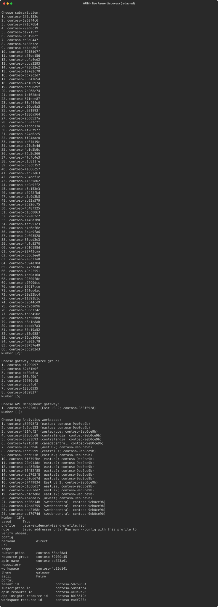

The wizard writes `%USERPROFILE%\.aum\config.json` (`~/.aum/config.json` on Linux).
If writing a profile by hand, use your discovered values, not these illustrative
Contoso names or zero ids:

```json
{
  "backend": "direct",
  "resource_group": "rg-contoso",
  "apim_name": "apim-contoso",
  "workspace": "00000000-0000-0000-0000-000000000000",
  "theme": "gateway",
  "ascii": false
}
```

Select another profile with `--config .\contoso-aum.json` or `AUM_CONFIG`.
`CLAUDE_FINOPS_CONFIG` and `~/.claude-finops/config.json` remain fallbacks.
Command-line options take precedence. Config stores addresses, never tokens.

```powershell
aum whoami --backend turnstile --url https://api-turnstile.contoso.com `
  --scope api://00000000-0000-0000-0000-000000000000/Turnstile.Manage
```

Alternatively, configure `resource_group` and `apim_name`; an administrator can
discover URL and scope from the gateway's `turnstile-integration` named value.

AUM obtains a bearer token in memory with Azure CLI. Read authentication can
refresh once; a write is never automatically repeated. Settings offers an explicit
sign-out preview; `az logout` is the equivalent outside AUM. Both affect the shared
Azure CLI session, not only AUM.

### Direct gateway access

```json
{
  "backend": "direct",
  "resource_group": "rg-contoso",
  "apim_name": "apim-contoso",
  "repository": "C:\\work\\claude-code-foundry-gateway",
  "workspace": "00000000-0000-0000-0000-000000000000"
}
```

`workspace` is the Log Analytics Workspace ID, not an ARM resource id.
Publish the repository's `ClaudeCost` function with
`scripts/Publish-ClaudeQueries.ps1` first. It contains the generated price book
and membership map. Request detail reuses `analytics/chargeback-ledger.kql`.

The existing `scripts/Invoke-ClaudeFinOps.ps1` bridge keeps its filename for
compatibility. It uses the shared registry serializers and `Set-ClaudeTier.ps1`,
not a second registry format. Direct writes are refused if Turnstile owns
governance.

Direct mode differs from Turnstile:

- Limits are current, not historical budget versions. Only the current month
  can be edited.
- People are observed ledger identities, searched/grouped/paged in KQL. AUM does
  not enumerate Entra or load a 500,000-person directory into the client.
- Person limits are **daily gateway overrides**, with the tier limit as the
  default. The UI labels daily used/limit separately from monthly unit/team
  allocation. `Set-ClaudeBudget.ps1` owns the shared override serialization.
- Hourly request/token trends come from the request ledger. Hourly cache/cost
  remain unknown; AUM never distributes daily cost into invented hourly values.
- Statistical anomaly candidates come from daily cost KQL, not a Turnstile rule
  engine. There is no independent acknowledge/false-positive state store.
- Multi-value writes check observed state, use the existing writers, read back
  every target and restore previous values when a later write fails. This is
  **compensation, not an atomic transaction**. Unexpected concurrent values are
  not overwritten; a failed restore reports manual recovery explicitly.
- Warning thresholds and scoped manager groups need a server authority. Those
  unsupported Direct form controls are hidden rather than accepted and ignored.
- New scopes have no monthly budget until one is assigned. Names come from
  their Entra groups; direct mode is not a delegated-manager security boundary.

### Standalone daily person budgets and modes

```powershell
aum people find dev --team <observed-team-id> --backend direct --limit 50
aum people show <observed-person-object-id> --team <observed-team-id> --backend direct
aum budget set person <observed-person-object-id> 200k --team <observed-team-id> --backend direct --what-if
aum budget remove person <observed-person-object-id> --team <observed-team-id> `
  --backend direct --apply --confirm <observed-person-object-id>
aum mode set team <team-id> allowance --allowance 10 --backend direct --what-if
```

A daily limit is not multiplied into a fictitious monthly allocation. Monthly
unit/team ceilings still apply independently. Only identities with an observed
Entra object id are writable; an unresolved actor label is not a directory grant.
The gateway's `quota-overrides` named value has a 4,096-character capacity:
scalable people **search** does not imply 500,000 individual override records fit.

Direct governance verifies control-plane state. Gateway propagation can lag,
so read-back is not claimed as a measured runtime counter result. No separate
Turnstile apply job is required.

For request-time acceptance evidence, choose **Usage: request-time attribution**
in `:` or run `aum usage show --basis ledger --dimension department`. This
reads the team stamped on each request rather than substituting a possibly older
published cost-function membership map. Cost/cache remain unknown on this basis.
**Usage: current priced membership** returns to the existing priced workspace
view; the two bases answer different questions and are labelled separately.

### Dollar budgets in AUM

Dollar budgets are separate from token budgets. They use the gateway's P59 USD
definition and reconciled-state named values, price every observed category with
the pinned tariff, and enforce through the gateway after reconciliation. AUM does
not convert a token budget to dollars and does not use the token-budget commands
as a fallback.

```powershell
aum usd list --backend direct --json
aum usd set unit <unit-id> 0.02 --period month --backend direct --what-if
aum usd set team <team-id> 0 --period month --backend direct --apply
aum usd set person <entra-object-id> 1.250000001 --period day --backend direct --apply
aum usd clear team <team-id> --backend direct --apply --confirm <team-id>
aum usd status --backend direct --json
aum usd reconcile --backend direct --what-if
aum usd reconcile --backend direct --apply
aum usd price-book show --backend direct --json
aum usd price-book set .\approved-price-book.json --backend direct --apply
```

Amounts are decimal strings: nonnegative, below one trillion, with at most nine
fractional digits. `0` is a real zero-dollar stop. Unit and team budgets are
monthly. Person budgets may be daily or monthly when the connected service
supports the selected period. A successful write says **Saved; awaiting
reconciliation**. It is not reported as enforced until `aum usd reconcile
--apply`, or the AUM service timer, writes a fresh state.

`aum usd status` reports the reconciled UTC window, nominal and effective budget,
observed spend, enforcement mode, `allow`/`notice`/`stop`/`unpriced` status,
cache completeness, exactness and unpriced model names. Null spend is unpriced
or unknown, never zero. The Budgets tab shows these dollar columns next to token
budget, usage and mode. The dollar edit form is preview-first; clearing a dollar
budget requires typing the exact scope id.

Direct mode reuses the gateway's existing USD implementation:

- `scripts\ClaudeUsdBudgets.ps1` for validation, encoding, named-value capacity
  checks and the shared `UsdBudgets` authority guard.
- `scripts\Sync-ClaudeUsdBudgets.ps1` for on-demand reconciliation. It calls the
  same Python engine used by the optional AUM service timer.
- `scripts\Invoke-ClaudeFinOps.ps1` only bridges AUM requests into those shared
  scripts; it does not implement a second price book or serializer.

The AUM service backend uses the service contract in
[AUM client contract: USD budgets](aum-usd-budgets-client-contract.md). It
requires advertised capability flags, sends `If-Match` for writes, and keeps
manager scope on the server. A manager never sees reconcile or price-book actions
unless the service advertises them. A 409 conflict requires a fresh read and a
new preview.

The Turnstile backend currently has no real USD budget source. AUM hides or
refuses dollar writes and reconciliation through Turnstile with an authority
message. It does not write token budgets as a substitute for dollars.

Manual Azure equivalents:

```powershell
# Inspect the stored definitions and state.
az apim nv show -g $rg --service-name $apim --named-value-id usd-budgets `
  --query value -o tsv
az apim nv show -g $rg --service-name $apim --named-value-id usd-budget-state `
  --query value -o tsv

# Set or clear a USD budget through the shared writer.
.\scripts\ClaudeUsdBudgets.ps1
.\scripts\Set-ClaudeBusinessUnit.ps1 -Id <unit-id> -MonthlyBudgetUsd 0.02 `
  -ResourceGroup $rg -ApimName $apim

# Reconcile observed spend into gateway stops.
.\scripts\Sync-ClaudeUsdBudgets.ps1 -ResourceGroup $rg -ApimName $apim `
  -WorkspaceId <workspace-customer-id>
```

The named values are base64-encoded ASCII JSON so policy literals remain safe.
Edit them by script or AUM, not by hand. If Turnstile owns budgets or governance,
the shared authority guard refuses Direct dollar writes and reconciliation.

### Direct anomaly method and accounting scope

`aum anomalies list --backend direct` runs
[`series_decompose_anomalies()`](https://learn.microsoft.com/kusto/query/series-decompose-anomalies-function)
over daily estimated cost by unit and team:

1. Read the selected period from published `ClaudeCost`.
2. Exclude the unfinished UTC day and series with any unpriced facts.
3. Require at least 14 active priced days, then build one-day bins.
4. Use residual threshold **3**, weekly seasonality **7**, and a linear trend.
5. Return bounded positive/negative candidates with the observed cost, baseline,
   score and date; absolute score 6 or greater is labelled critical.

These are statistical candidates, not confirmed incidents. Missing days are
treated as no *observed* cost, so ingestion gaps can produce findings. Sparse or
unpriced series are excluded; no returned findings is **not** an all-clear.

Request-level Direct facts are constrained to the discovered gateway's resource
id. Priced daily facts come from the **published workspace function** and its
current membership/price book. In a shared workspace, validate that function's
source before treating its cost as one gateway's cost. The dashboard labels
**Workspace usage | selected gateway budgets** to keep those bases separate.
Unpriced aggregate cost and per-request cache remain unknown.

### Optional independent AUM service

An administrator can discover the existing service:

```powershell
aum configure --backend aum-service --config .\aum-service.json --save
aum whoami --config .\aum-service.json --json
aum status --config .\aum-service.json --json
```

An app-role user can use an address-only profile supplied by that administrator:

```json
{
  "backend": "aum-service",
  "url": "https://aum.contoso.com",
  "scope": "api://00000000-0000-0000-0000-000000000000/AUM.Access",
  "tenant_id": "00000000-0000-0000-0000-000000000000"
}
```

The backend uses `/api/v1/me` and `/api/v1/capabilities`, not Turnstile routes.
`manager_scope: null` means unrestricted; a scope object with empty lists stays
scoped. Native boolean flags normalize to the same client action-capability model.
Every native budget/configuration change needs an explicit audit reason and a
current quoted `If-Match` revision. A conflict is never automatically retried.

```powershell
aum mode set team <team-id> notify --config .\aum-service.json `
  --reason "Approved notification-only policy" --what-if
aum budget set person <object-id> 200k --team <team-id> --config .\aum-service.json `
  --reason "Approved daily capacity" --what-if
aum request list --view waiting --config .\aum-service.json
aum notifications list --config .\aum-service.json
```

The current published service contract (1.0.3) provides daily trends, native
requests/decisions/escalation, daily person boosts with expiry within 31 days,
and immutable warning facts. It does not yet provide usage distribution,
anomaly findings, assistant/model-gateway pages, notification mark-read, boost
revocation or an indexed arbitrary-request detail route. Unsupported views/actions
are hidden. Selected request detail rechecks the server; an id outside the current
bounded page is not treated as a failed search of all history. No missing feature
silently falls back to Direct or Turnstile.

Native People and Requests use server cursors. For unit managers, complete-scope
CSV export consolidates actually managed units (including direct members) plus
separately managed teams, never a context-only parent or overlapping subtotal.

With the AUM service, **All authorized observed people** searches its ledger even
when the gateway catalog is empty. Unparented observations are readable, not
automatically writable. The service applies scope on every request and page.

### Live independent-backend evidence

All images below are **live**, display-redacted and recorded in the same
[provenance manifest](images/aum/manifest.json). Empty results are not seeded
with examples. The service target differs from the reference Direct gateway;
their totals are not presented as interchangeable.

| Tab | AUM Direct live | AUM service live |
|---|---|---|
| Overview | [80x24](images/aum/direct-overview-80x24-after.svg) · [160x48](images/aum/direct-overview-160x48-after.svg) | [80x24](images/aum/aum-service-overview-80x24-after.svg) · [160x48](images/aum/aum-service-overview-160x48-after.svg) |
| Budgets | [80x24](images/aum/direct-budgets-80x24-after.svg) · [160x48](images/aum/direct-budgets-160x48-after.svg) | [80x24](images/aum/aum-service-budgets-80x24-after.svg) · [160x48](images/aum/aum-service-budgets-160x48-after.svg) |
| People | [80x24](images/aum/direct-people-80x24-after.svg) · [160x48](images/aum/direct-people-160x48-after.svg) | [80x24](images/aum/aum-service-people-80x24-after.svg) · [160x48](images/aum/aum-service-people-160x48-after.svg) |
| Governance | [80x24](images/aum/direct-governance-80x24-after.svg) · [160x48](images/aum/direct-governance-160x48-after.svg) | [80x24](images/aum/aum-service-governance-80x24-after.svg) · [160x48](images/aum/aum-service-governance-160x48-after.svg) |
| Usage | [80x24](images/aum/direct-usage-80x24-after.svg) · [160x48](images/aum/direct-usage-160x48-after.svg) | No distribution endpoint in contract 1.0.3; hidden |
| Trends | [80x24](images/aum/direct-trends-80x24-after.svg) · [160x48](images/aum/direct-trends-160x48-after.svg) | [80x24](images/aum/aum-service-trends-80x24-after.svg) · [160x48](images/aum/aum-service-trends-160x48-after.svg) |
| Requests | [80x24](images/aum/direct-requests-80x24-after.svg) · [160x48](images/aum/direct-requests-160x48-after.svg) | [80x24](images/aum/aum-service-requests-80x24-after.svg) · [160x48](images/aum/aum-service-requests-160x48-after.svg) |
| Anomalies | [80x24](images/aum/direct-anomalies-80x24-after.svg) · [160x48](images/aum/direct-anomalies-160x48-after.svg) | No finding endpoint in contract 1.0.3; hidden |
| Approvals | Requires a server authority | [80x24](images/aum/aum-service-approvals-80x24-after.svg) · [160x48](images/aum/aum-service-approvals-160x48-after.svg) |
| Settings | [80x24](images/aum/direct-settings-80x24-after.svg) · [160x48](images/aum/direct-settings-160x48-after.svg) | [80x24](images/aum/aum-service-settings-80x24-after.svg) · [160x48](images/aum/aum-service-settings-160x48-after.svg) |

The hourly Direct query has separate live evidence:
[80x24](images/aum/direct-trends-hour-80x24-after.svg) ·
[160x48](images/aum/direct-trends-hour-160x48-after.svg). Its cost column is
unknown because the source is the request ledger, not daily prices divided into hours.

On 2026-09-25, the independent live journeys ran **14 Direct commands** and
**15 AUM service commands**, then visited the matching terminal views. Identity,
catalog, tiers, budget limits, request ids and overview totals agreed within
each backend. Direct returned 51 hourly buckets and one observed person;
the native service returned one observed person despite an empty catalog.
No remote writes were performed. Direct anomaly output contained no candidates;
pricing/coverage exclusions mean this is not a health or security verdict.

## Tour the live terminal

The images below are captured from **live backends with display redaction on**.
Their [manifest](images/aum/manifest.json) records backend, UTC capture time,
source commit, dimensions and redaction state. Example renders are kept beside
the snapshot tests, not presented as live documentation. The recaptured Direct
Overview and Budgets images show the compact ASCII-art header at 80x24 and 160x48.

### Overview

The KPI strip separates monthly usage from allocated-scope budget use. Daily
token and estimated-cost charts share the same time window. Forecast comes from
the server; missing forecasts and prices are labeled unknown.

Top units/teams use proportional bars. Risk and anomaly panels keep attention on
exceptions. Tab focuses each panel; Enter opens selectable ranking, risk or finding
rows, and `d` shows exact source values. Drilldown preserves authorized filters;
a context-only parent unit never becomes a broader manager query. The source
timestamp and fetch timestamp are distinct: fetching does not eliminate ledger lag.

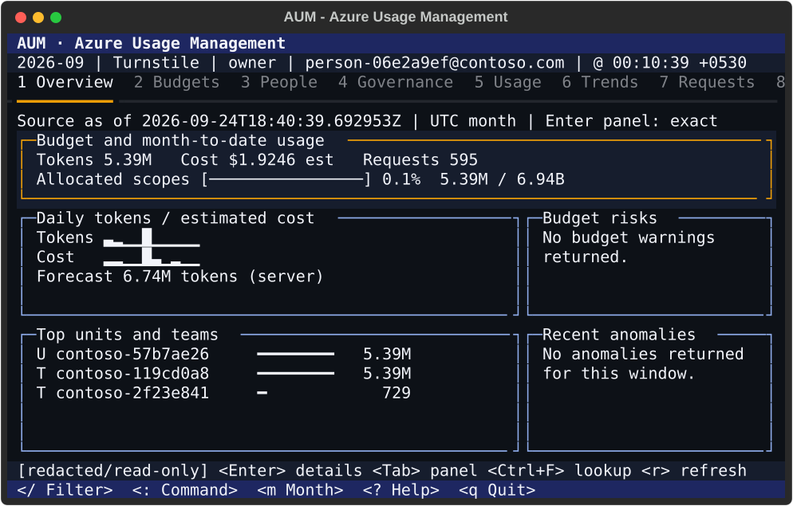

[Wide Overview](images/aum/turnstile-overview-160x48-after.svg) ·
[Before the redesign, live and redacted](images/aum/turnstile-overview-80x24-before.svg)

### Budgets

Read the unit/team hierarchy with used tokens, budget, remaining usage and
unallocated parent headroom. These are different quantities. The mode badge
shows `STRICT`, `ALLOW +N%` or `NOTIFY` from the catalog's `enforcement` and
`allowance_percent` attributes; absent enforcement means strict.

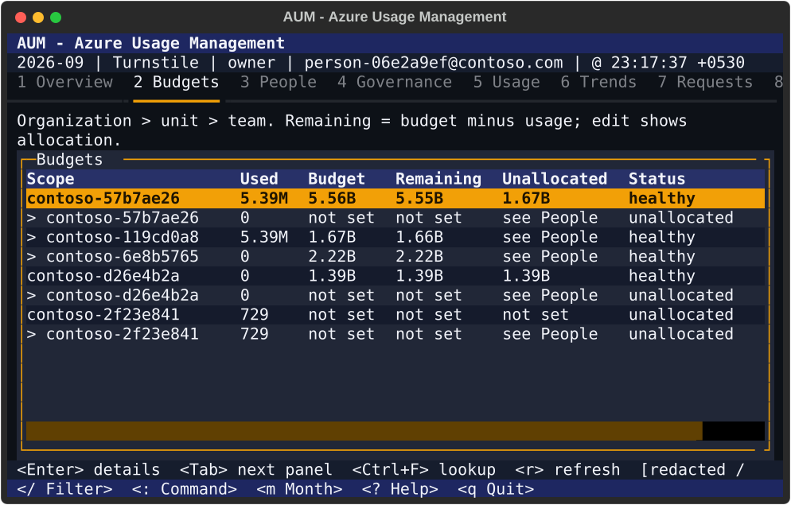

### People

Choose a team and search on the server, 50 rows at a time. Parent headroom uses
the complete server allocation total, never just the visible page.

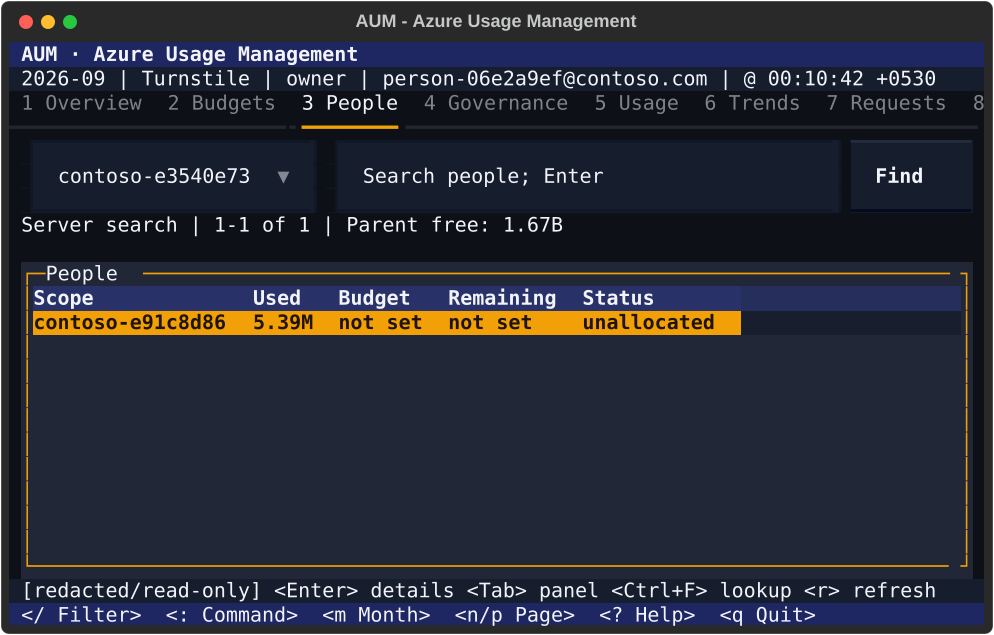

### Governance

Read units, teams, member and manager groups, enforcement badges, tiers and apply
status. Owners can edit with `e` or choose add/remove/apply in `:` command mode.
Owners choose **Set budget enforcement mode** in `:` to preview strict, allowance
(1–100 percent) or notify. Direct uses the repository's `Set-ClaudeBusinessUnit.ps1`
with `-Mode` and `-AllowancePercent`; it never duplicates the registry serializer.

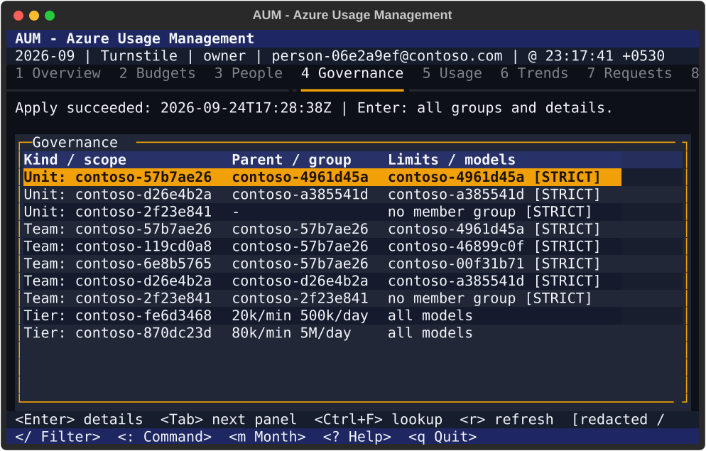

### Usage

Pivot between units, teams, people, models, surfaces and tiers. Rankings are explicitly
top 100. Chargeback export instead enumerates every authorized catalog scope.

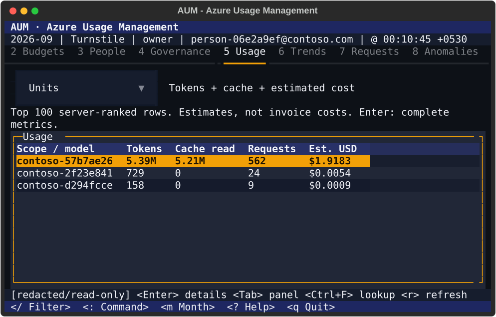

### Trends

Choose daily, hourly or weekly buckets. Bars compare volume inside the selected
month; Enter retains full precision. **Compare trend periods** in `:` compares
returned month buckets, without filling missing values with invented zeroes.
`f` chooses an explicit time range. Dates display local time and UTC offset;
month accounting remains UTC.

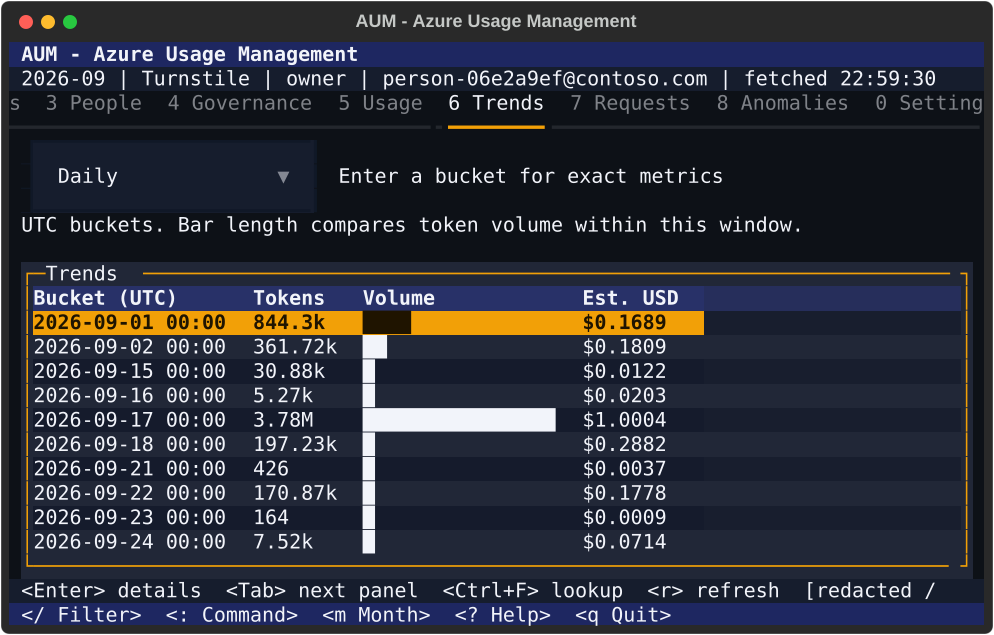

### Requests

Filter by model or an ISO Before timestamp. A server window holds at most 200
requests; AUM pages it in groups of 50. When the server advertises the cursor
contract, AUM instead follows its snapshot-bound pages, including tied timestamps.
Until then this is not an exhaustive history export. Keep timestamp overlap
when inspecting older windows. `c` copies the real id and `o` opens its discovered
Log Analytics workspace. Both are hidden during redacted capture.

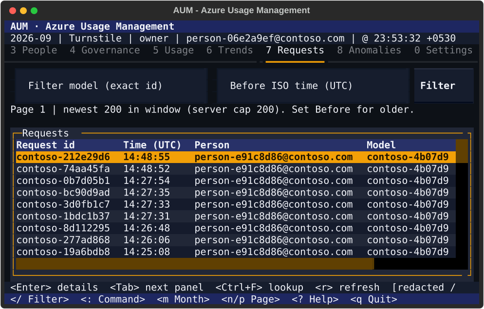

### Anomalies

Severity, scope, time and details come from the read-only usage-anomalies API.
Acknowledgment and false-positive disposition appear in `:` only when the server
advertises the corresponding scoped API.

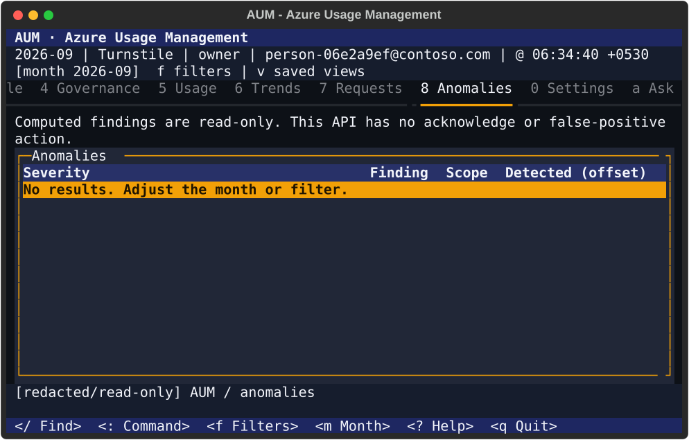

### Settings

Inspect identity, role, managed scope, backend and config. Change the session
theme, open **Profile / backend**, or preview **Sign out**. A replacement profile
is authenticated before the working connection is closed. **Tour** repeats the
first-run keyboard introduction.

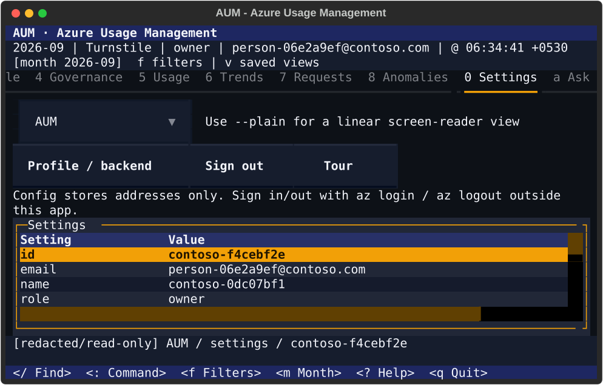

### Ask, Approvals and Advanced

**Ask** (`a`) appears when the permitted assistant API exists. Enter a question,
then choose **Ask**. Requests can incur model cost and create conversation history.
The answer and chart rows are the server's response, not client-generated facts.
Choose **Pin** to preview a chart pin; `:` also opens history, pinned reports and
Owner-only model settings. Redacted and `--what-if` sessions never send a question.

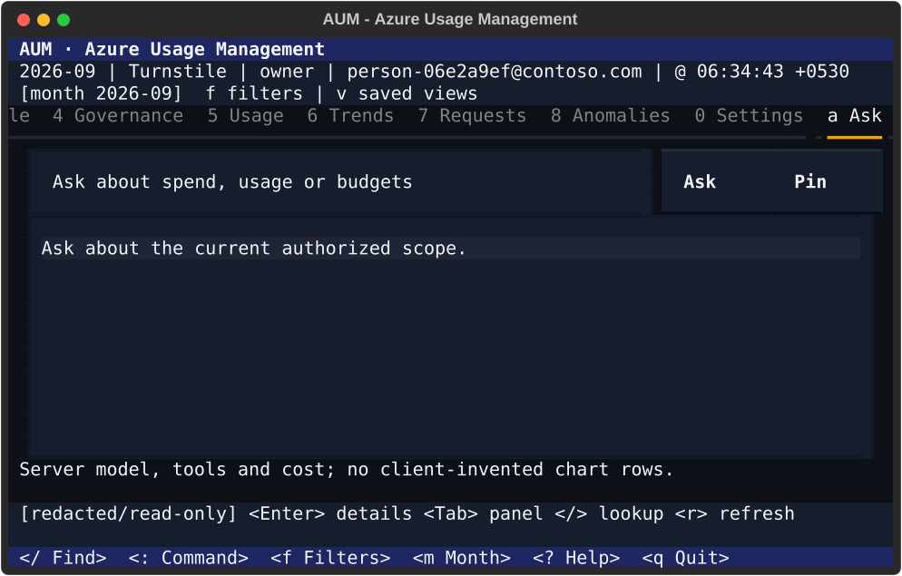

**Approvals** (`9`) is hidden until the server advertises the budget-request
contract. Its My requests, Waiting for me and History views share the request,
approve, reject and escalate clients. Boosts, notifications and anomaly
dispositions follow their own advertised actions; unavailable actions are hidden.

**Advanced** is read-only and appears only when the connected Turnstile has an
authorized, configured model gateway. Models, backend pools, releases and
application subscriptions belong to that gateway, not the Claude governance
registry. AUM does not reveal keys or offer model-gateway mutations.

The current live **Turnstile** connection does not advertise Approvals or expose
a configured Advanced registry. Their Turnstile contract screenshots are test
baselines, not mislabelled live documentation. The independent AUM service does
offer native Approvals; its actual live queue appears in the table above.

### Direct Overview

This capture comes from the gateway's own ledger and published cost function.
Its accounting basis can differ from Turnstile's ingestion. Unknown prices are
not replaced by guessed costs.

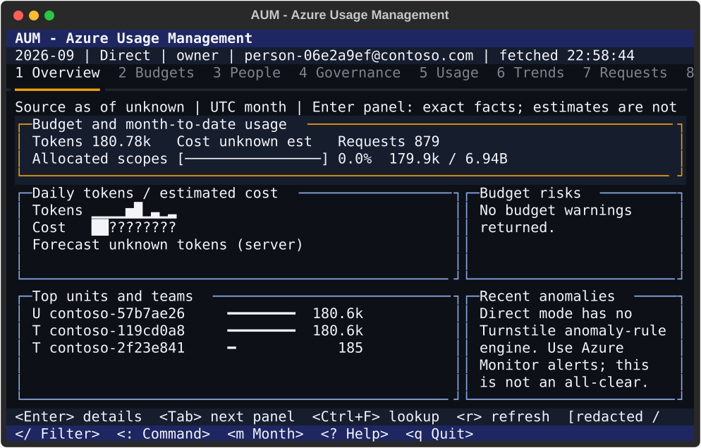

## Keyboard, accessibility and safe edits

The following interaction evidence was also captured against the live backend,
not FakeBackend:

| Flow | Live redacted evidence |
|---|---|
| Exact panel data | [Detail](images/aum/turnstile-flow-exact-detail-100x30-after.svg) |
| Help | [Help overlay](images/aum/turnstile-flow-help-100x30-after.svg) |
| Command mode | [Commands](images/aum/turnstile-flow-commands-100x30-after.svg) |
| Server-side lookup | [Lookup](images/aum/turnstile-flow-lookup-100x30-after.svg) |
| Local row filter | [Filter](images/aum/turnstile-flow-filter-100x30-after.svg) |
| Month selection | [Month](images/aum/turnstile-flow-month-100x30-after.svg) |
| Model pivot | [Models](images/aum/turnstile-flow-model-pivot-100x30-after.svg) |
| Hourly trends | [Hourly buckets](images/aum/turnstile-flow-hourly-trends-100x30-after.svg) |
| Request paging and detail | [Second page](images/aum/turnstile-flow-request-page-two-100x30-after.svg), [detail](images/aum/turnstile-flow-request-detail-100x30-after.svg) |
| Accessible themes | [High contrast](images/aum/turnstile-flow-high-contrast-100x30-after.svg), [monochrome/ASCII](images/aum/turnstile-flow-monochrome-ascii-100x30-after.svg) |
| CSV export | [Completed export](images/aum/turnstile-flow-export-100x30-after.svg) |
| Server filter chips | [Filter editor](images/aum/turnstile-flow-r4-filters-100x32-after.svg) |
| Private saved view | [Validated local preview](images/aum/turnstile-flow-r4-saved-view-100x32-after.svg) |
| Profile/backend switch | [Validated profile preview](images/aum/turnstile-flow-r4-profile-switch-100x32-after.svg) |
| Sign-out | [Preview only; shared CLI session retained](images/aum/turnstile-flow-r4-signout-preview-100x32-after.svg) |
| First-run tour | [Tour](images/aum/turnstile-flow-r4-first-run-tour-100x32-after.svg) |
| Period comparison | [Live comparison](images/aum/turnstile-flow-r4-comparison-100x32-after.svg) |
| Assistant reads | [History](images/aum/turnstile-flow-r4-assistant-history-100x32-after.svg), [pins](images/aum/turnstile-flow-r4-assistant-pins-100x32-after.svg) |
| Reconciled local report | [Live manifest and totals; no email](images/aum/direct-flow-r4-report-110x36-after.svg) |

| Key or option | Behavior |
|---|---|
| `1`–`8`, `0` | Tabs; `0` opens Settings |
| `Tab` / `Shift+Tab` | Focus panels and controls |
| `Enter` | Exact panel/row detail |
| `/` | Lookup scopes, people, models or `request:<id>` |
| `Ctrl+F` | Filter visible rows; `Esc` clears |
| `f`, click the filter bar | Edit server filters: unit, team, person, tier, model, surface, range |
| `v` | Open a saved view; `:` saves/removes views private to this identity/profile |
| `:` | Search available commands and actions |
| `m`, `r`, `?`, `q` | Month, refresh, help, quit |
| `e` | Edit a selected budget/tier/catalog row when authorized |
| `Ctrl+A` | Preview Apply now on Governance |
| `a`, `9` | Ask and Approvals, only when available and authorized |
| `c`, `o`, `d` | Copy request id, open ledger, exact selected details |
| `n`, `p` | Next/previous People, Requests or Approvals page |
| `--theme high-contrast` | High-contrast terminal palette |
| `--no-color`, `--ascii` | Monochrome or ASCII-cell rendering |
| `--plain`, `--screen-reader` | Linear output; no art or full-screen UI |

Motion is disabled. Status always has words, not only color.

Every governance change starts with Preview. Changing a field invalidates the
preview; server state and role are rechecked. Removal and lowering below usage
require typing the scope id. Apply follows the job without retrying the write.
Whole-catalog/tier writes send `If-Match` only when the server advertises conditional
writes and returns an ETag. A 412 requires a fresh preview; no write is retried.
Until that contract is advertised, avoid concurrent collection editors.

Person monthly budgets are **saved in Turnstile**, not claimed as gateway
per-person quota enforcement.

### Scoped managers

`manager_scope: null` is unrestricted; an object is scoped even if its lists are
empty. Member alone does not imply a manager. AUM refreshes assignments, clears
stale data and hides unavailable navigation. Managers with assignments retain
the permitted views. A unit manager may edit the departments in the server's
`writable_department_ids`; managers may edit person budgets in assigned departments.
Unit budgets, modes, catalog, tiers and explicit Apply now remain Owner-only.
Viewers remain read-only.

Parent units shown for context are not authorized unit filters. Scoped exports
query managed departments, not those context parents. A 403 means **Not in your
scope / not permitted for this sign-in**, never zero usage or token expiry.

## Publish safe live screenshots

```powershell
aum --redact
$env:AUM_REDACT = '1'
aum status --json
```

Redaction is display-time only: numbers and backend requests stay unchanged;
people, addresses and deployment identifiers become deterministic Contoso
pseudonyms. Free-form private descriptions and query-field text are hidden;
selected person ids are still sent unchanged to the API, not echoed into captures.
Redacted interactive
sessions are intentionally read-only to prevent pseudonyms being mistaken for
write targets. Turn redaction off when making an authorized edit.

```powershell
.\.venv-finops\Scripts\python.exe cli\finops\tools\capture_live.py `
  --url https://api-turnstile.contoso.com `
  --scope api://00000000-0000-0000-0000-000000000000/Turnstile.Manage `
  --month 2026-09
```

The capture tool uses live reads, Textual `save_screenshot`, and a privacy guard
before publication. It never saves tokens or unredacted source screenshots.
The guard rejects undocumented images, live images without redaction, non-Contoso
addresses, GUIDs and Azure service hostnames. A mutation test turns redaction off
and proves that the guard catches it.

## Command reference

`--json`, `--plain`, `--what-if`, `--redact`, `--month`, `--backend`, `--config`,
`--url`, `--scope`, `--resource-group`, `--apim-name`, `--theme`, `--no-color`
and `--ascii` work before or after the noun/verb. `--reason` supplies native
AUM-service audit text for budget/configuration changes. `--what-if` wins over `--apply`.
Use token suffixes `k`, `M`, `B`; USD strings are rejected.

| Task | Example |
|---|---|
| Identity | `aum whoami --json` |
| Month status | `aum status --month 2026-09 --unit sales` |
| Budgets | `aum budget list` |
| Preview | `aum budget set team sales-emea 9M --what-if` |
| Save and follow | `aum budget set team sales-emea 9M --apply` |
| Warning threshold | `aum budget set team sales-emea 9M --warning 85 --apply` |
| Remove | `aum budget remove team sales-emea --apply --confirm sales-emea` |
| Person budget | `aum budget set person dev@contoso.com 200k --team sales-emea --apply` |
| People search | `aum people find dev --team sales-emea --offset 0 --limit 50` |
| Directory developer search | `aum developer find amara --limit 50` |
| Add developer | `aum developer add amara@contoso.com --tier standard --unit sales-emea --apply` |
| Remove developer | `aum developer remove amara@contoso.com --apply --confirm amara@contoso.com` |
| Governance | `aum governance show --json` |
| Native service audit | `aum governance audit --backend aum-service --limit 50` |
| Apply preview | `aum governance apply --what-if` |
| Apply job | `aum governance apply --apply` |
| Tier view | `aum tier show` |
| Tier limits | `aum tier set standard --per-minute 20k --per-day 500k --apply` |
| Tier models | `aum tier set premium --models claude-sonnet-5,claude-opus-5 --apply` |
| Unit | `aum catalog set unit sales --name Sales --group contoso-sales --apply` |
| Team | `aum catalog set team sales-emea --name "Sales EMEA" --group contoso-sales-emea --parent sales --apply` |
| Manager group | `aum catalog set team sales-emea --manager-group 00000000-0000-0000-0000-000000000001 --apply` |
| Remove scope | `aum catalog remove team sales-apac --apply --confirm sales-apac` |
| Requests | `aum requests list --team sales-emea --limit 50` |
| Older window | `aum requests list --before 2026-09-20T00:00:00Z --limit 200` |
| Request detail | `aum requests show <request-id> --json` |
| Anomalies | `aum anomalies list --month 2026-09` |
| Usage | `aum usage show --dimension model --split-by department` |
| Trends | `aum trends show --interval day --group-by department` |
| Unit chargeback | `aum report chargeback --month 2026-09 --csv > chargeback.csv` |
| Team chargeback | `aum report chargeback --dimension department --csv` |
| Global/bounded lookup | `aum lookup sales-emea --team sales-emea --json` |
| Person detail | `aum people show dev@contoso.com --team sales-emea` |
| Entra membership path | `aum people membership sales-emea` |
| Modes | `aum mode show` |
| Mode preview | `aum mode set team sales-emea allowance --allowance 10 --what-if` |
| Mode save | `aum mode set team sales-emea strict --apply` |
| Bulk person budgets | `aum budget import .\allocations.csv --what-if` |
| Filtered usage | `aum usage show --dimension tier --unit sales --team sales-emea --tier standard` |
| Compared months | `aum trends show --compare 2026-08 --month 2026-09 --interval day` |
| Explicit range | `aum trends show --start 2026-09-01T00:00:00Z --end 2026-09-08T00:00:00Z` |
| Request ledger link | `aum requests ledger <request-id>` |
| Copy request id | `aum requests copy <request-id> --what-if` |
| Saved views | `aum view list` |
| Save a view | `aum view save sales-models --tab usage --unit sales --dimension model --apply` |
| Use a saved view | `aum view load sales-models --json` |
| Remove a view | `aum view remove sales-models --apply` |
| Profile and capabilities | `aum session show --json` |
| Sign-out preview | `aum session signout --what-if` |
| Sign out explicitly | `aum session signout --apply --confirm "sign out"` |
| Ask, with no request sent | `aum ask query "Compare token use by unit" --what-if` |
| Ask and store a conversation | `aum ask query "Compare token use by unit"` |
| Conversation list/detail | `aum ask history`; `aum ask show <conversation-id>` |
| Pinned charts | `aum ask pins` |
| Pin a returned chart | `aum ask pin <conversation-id> <chart-id> "Monthly tokens" --apply` |
| Assistant settings | `aum ask settings` |
| Owner assistant configuration | `aum ask configure --model <advertised-model-id> --auto-title --apply` |
| Advanced models | `aum advanced show models` |
| Backend pool | `aum advanced show pools --key <model-id>` |
| Releases/detail/diff | `aum advanced show releases`; `aum advanced show release --key <release-id>`; `aum advanced show diff --key <release-id>` |
| Application subscriptions | `aum advanced show subscriptions`; `aum advanced show application --key <application-id>` |
| Reconciled completed-month report | `aum report generate --month 2026-08 --unit sales --formats CSV,HTML --apply` |
| Reconciled current-month report | `aum report generate --month 2026-09 --month-to-date --apply` |

The reconciled report delegates to the merged P50 generator. It verifies source
functions and reconciliation before publishing local files. `--send` is separate,
explicit, and requires an already-configured delivery path; AUM never silently
emails a report. Its Azure subscription remains process-local.

The recorded live report on **2026-09-25** completed in **80.289 seconds**:
884 ledger requests, six people, matched source reconciliation and nine unpriced
rows. CSV and HTML were written locally; no delivery was requested. These are
dated capture facts, not an estimate of your workload or a claim that Turnstile
ingestion and the gateway ledger use identical accounting bases.

Bulk CSV uses a header `team,person,tokens` and optional `warning` percentage.
It accepts at most 500 rows/2 MB, rejects duplicates, validates total allocation
across the complete plan, and shows every normalized change before Apply.

```csv
team,person,tokens,warning
sales-emea,dev@contoso.com,200000,80
```

### Optional workflows by selected authority

These clients are implemented and tested. Turnstile needs the advertised
contracts; the AUM service already supplies its native request/approval/boost
and warning-read contracts. Unavailable actions return an actionable error
rather than calling an unadvertised mutation route.

| Task | Example | Required capability |
|---|---|---|
| Request queues | `aum request list --view waiting` | `approvals` |
| Request capacity | `aum request budget team sales-emea 9M "Capacity review" --apply` | `approvals.request` |
| Approve/reject/escalate | `aum request approve <id> "Reviewed" --apply` (or `reject`, `escalate`) | corresponding `approvals` action |
| Active/expired boosts | `aum boost list` | `boosts.read` |
| Temporary boost | `aum boost set dev@contoso.com sales-emea 100k 2099-01-01 "Capacity review" --apply` | `boosts.create` |
| Revoke boost | `aum boost revoke <id> --apply` | `boosts.revoke` |
| Notifications | `aum notifications list` | `notifications.read` |
| Mark read | `aum notifications read <id> --apply` | `notifications.mark_read` |
| Finding disposition | `aum anomalies set-status <id> acknowledged "Reviewed" --apply` (or `false_positive`) | `anomaly_dispositions` |
| Continue request page | `aum requests list --cursor <opaque-cursor>` | `request_cursor` |

Choose a real approved expiry; the far-future sample is syntax only for the
proposed Turnstile contract. With AUM service, use `--window daily` and an expiry
within 31 days. The server
must reserve headroom and restore the baseline at expiry/revocation. The client
refuses self-approval and tracks a returned gateway apply anchor, but does not
pretend to enforce a server-side quota itself.

Interactive `:` → **Export complete chargeback CSV** writes under
`finops-reports` and never overwrites an existing file.

## Troubleshoot and validate

| Exit / symptom | Fix |
|---|---|
| 2, invalid input | Check month, stable id, token amount and parent headroom |
| 3, 401 | Run `az login` in the correct tenant |
| 4, AADSTS50105 | Ask an existing administrator to check your Turnstile assignment |
| 4, 403 | Choose an assigned scope; see Settings |
| 5, missing scope/route | Check month/id and the selected backend's advertised API version; do not install another authority to bypass an unavailable route |
| 6, conflict | Refresh and preview again |
| 7, service/job failure | Check network, Azure access and job logs; do not blindly repeat a write |
| 8, apply still pending | Follow `aum governance show`; the save may already have succeeded |
| Unknown Direct cost | Check unpriced facts and the published `ClaudeCost` price book |

```powershell
.\.venv-finops\Scripts\python.exe -m pytest cli\finops\tests -q
node .ironclad\gate.mjs --stage packet --verbose
```

Test-All uses the worktree `.venv-finops` or reports an explicit skip. Fake SVGs
and exact screen grids live under `cli/finops/tests/snapshots`; regenerate them
deliberately with `cli/finops/tools/capture.py`. Live evidence is separate.

The [revision-4 parity manifest](../cli/finops/src/claude_finops/parity.json)
distinguishes implemented current APIs from named server dependencies. Exact
future request/response contracts ship in
[`contracts.json`](../cli/finops/src/claude_finops/contracts.json).

## Do the same Azure steps by hand

These paths use the resources you discover, not the redacted names in the
screenshots. AUM does not create VNets, subnets, DNS zones, Key Vaults or gateways;
there is no hidden infrastructure deployment to reproduce.

### 1. Choose the subscription, resource group and gateway

1. In the Azure portal, open **Subscriptions** and select the subscription you
   already manage. Check the signed-in account and directory in the top-right menu.
2. Open **Resource groups**, choose the group containing the existing gateway,
   and open its **API Management service**.
3. On **Overview**, verify **Status**, **Resource group**, **Location**,
   **Subscription**, **Subscription ID**, **Gateway URL** and **Tier**.
4. Record your own values locally. The screenshot deliberately replaces names,
   hostnames and ids; do not copy its Contoso placeholders.

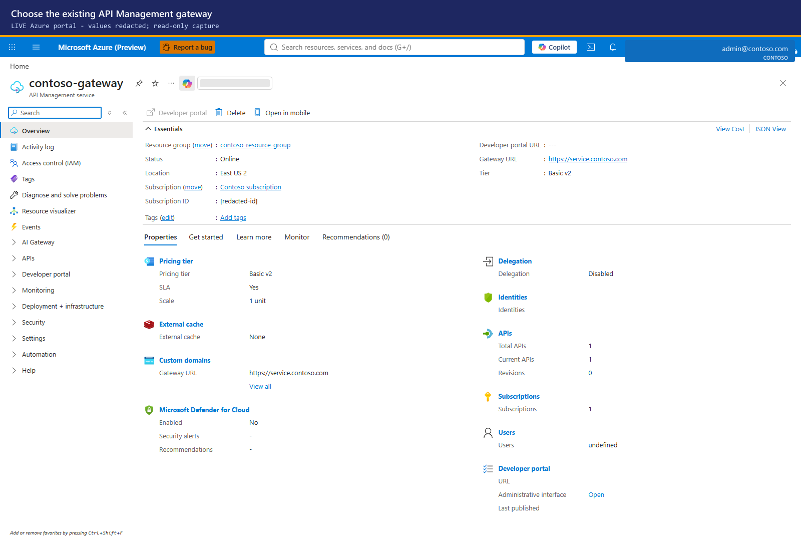

Equivalent Azure CLI:

```powershell
az account list -o table
$sub = Read-Host 'Subscription id from the list'
az apim list --subscription $sub -o table
$rg = Read-Host 'Resource group from the list'
$apim = Read-Host 'API Management name from the list'
az apim show --subscription $sub -g $rg -n $apim `
  --query '{id:id,name:name,location:location,sku:sku.name,gatewayUrl:gatewayUrl}' -o json
```

Verification: the CLI's resource, location and tier match **Overview**. AUM
passes the selected subscription explicitly rather than running `az account set`.

### 2. Read the Turnstile connection and governance authority

1. In the gateway's left menu, expand **APIs** and select **Named values**.
2. Use **Search to filter items by display name and name** to find
   `turnstile-integration`.
3. Open that named value and read **Value**. Copy its `url` and `scope` fields
   into the local AUM profile. Read `governanceAuthority` and `budgetAuthority`
   before deciding where a change belongs.
4. Do not reveal or copy unrelated secret named values. This connection is
   address metadata, not a bearer token.

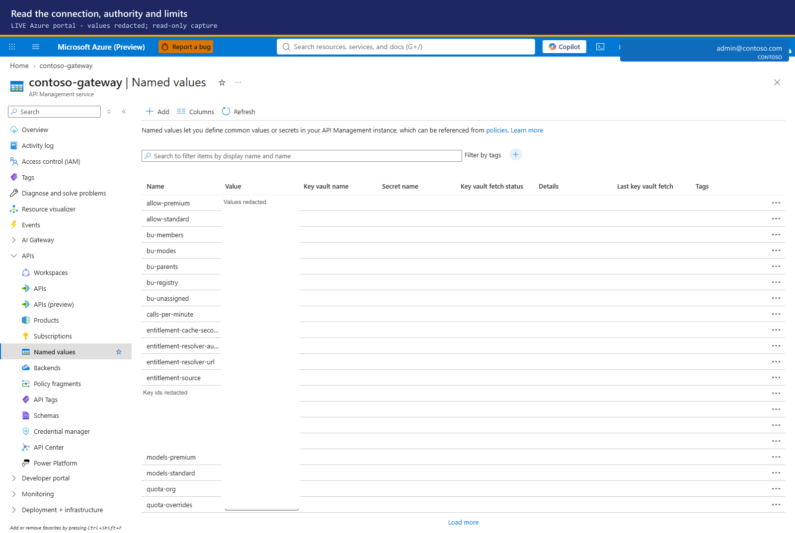

Equivalent Azure CLI:

```powershell
$connection = az apim nv show --subscription $sub -g $rg `
  --service-name $apim --named-value-id turnstile-integration --query value -o tsv
$settings = @{}
foreach ($pair in ($connection -split ';')) {
  if ($pair.Contains('=')) {
    $parts = $pair -split '=', 2
    $settings[$parts[0]] = $parts[1]
  }
}
$api = $settings.url.TrimEnd('/')
$scope = $settings.scope
$audience = $scope.Substring(0, $scope.LastIndexOf('/'))
az rest --method get --url "$api/api/v1/auth/me" --resource $audience `
  --subscription $sub --query '{role:role,method:method}' -o json
```

Verification: `/auth/me` reports the expected role and method. This native
`az rest --resource` path was run live as Owner; the CLI obtains the token
without putting it in your command arguments or printing it.

### 3. Find the actual telemetry workspace

1. In API Management, expand **APIs**, then select **APIs**. Select the Claude
   API and inspect **Settings** / its Application Insights diagnostic.
2. Open the referenced **Application Insights** resource, not another resource
   with a similar name.
3. On its **Overview**, find **Logs workspace** and open that workspace.
4. On the workspace's **Overview**, verify **Workspace name**, **Workspace ID**,
   **Subscription**, **Location** and **Access control mode**.
5. Put **Workspace ID** in AUM's `workspace` field. This is not the ARM resource id.

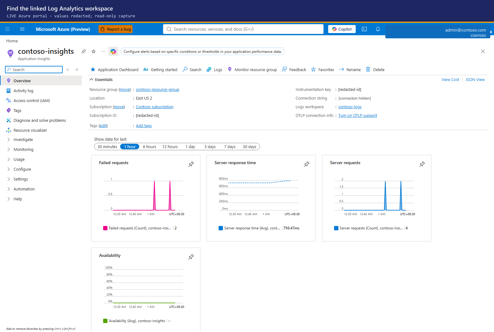

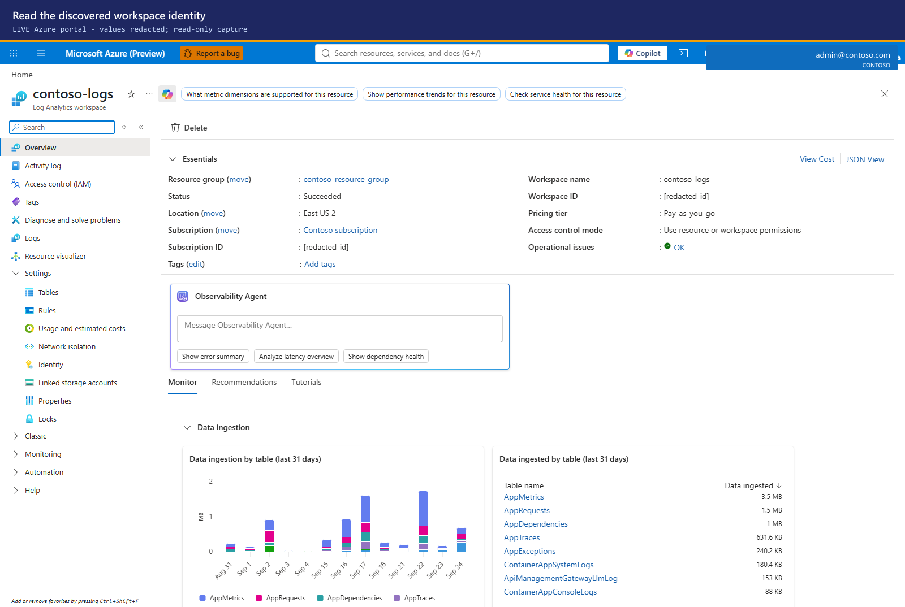

Equivalent Azure CLI, following references rather than assuming names:

```powershell
$apimId = az apim show --subscription $sub -g $rg -n $apim --query id -o tsv
$diag = az rest --method get --subscription $sub `
  --url "https://management.azure.com$apimId/apis/claude-foundry/diagnostics/applicationinsights" `
  --url-parameters api-version=2024-05-01 -o json | ConvertFrom-Json
$logger = az rest --method get --subscription $sub `
  --url "https://management.azure.com$($diag.properties.loggerId)" `
  --url-parameters api-version=2024-05-01 -o json | ConvertFrom-Json
$insights = az rest --method get --subscription $sub `
  --url "https://management.azure.com$($logger.properties.resourceId)" `
  --url-parameters api-version=2020-02-02 -o json | ConvertFrom-Json
$workspaceResourceId = $insights.properties.WorkspaceResourceId
az rest --method get --subscription $sub `
  --url "https://management.azure.com$workspaceResourceId" `
  --url-parameters api-version=2023-09-01 `
  --query '{name:name,workspaceId:properties.customerId}' -o json
```

If the API has no diagnostic, inspect the service-level
`$apimId/diagnostics/applicationinsights` instead. The wizard performs that
fallback and offers accessible workspaces when no logger reference can be read.

### 4. Query usage and export a report

1. Open the selected workspace and choose **Logs**.
2. Close **Welcome to Log Analytics** if shown. In the current preview,
   turn **Agent** off and choose **Use Query** when prompted.
3. Select **Simple mode** in the query toolbar, then **KQL mode**.
4. Enter the query below and select **Run** (or **Shift+Enter**).
5. Verify the returned scope, token, cache and cost columns. Use the result
   export control to save CSV. Unknown prices must remain unknown.

```kusto
ClaudeCost(startofmonth(now()), now())
| summarize tokens=sum(prompt_tokens + completion_tokens),
            cache_read_tokens=sum(cache_read_tokens),
            requests=sum(requests), estimated_usd=sum(usd),
            unpriced=countif(not(priced_ok)) by business_unit
| extend estimated_usd=iff(unpriced > 0, real(null), estimated_usd)
```

The mode and Run controls are documented in
[Microsoft Learn's Log Analytics guide](https://learn.microsoft.com/azure/azure-monitor/logs/log-analytics-simple-mode#switch-modes).
An earlier copied session expired and capture stopped without attempting sign-in.
For the culminating run, a fresh copy of the owner's supplied profile worked.
The current image includes a verified successful query response and real results;
blank editors, welcome screens and onboarding overlays are rejected.

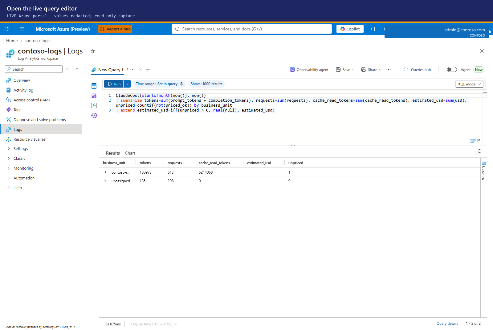

Equivalent Azure CLI: write the KQL into `query.kql`, then send the JSON body
through a file so shell pipes never become Azure CLI arguments:

```powershell
$workspaceId = Read-Host 'Workspace ID verified above'
@{query=(Get-Content .\query.kql -Raw)} | ConvertTo-Json |
  Set-Content -Encoding utf8 .\query-body.json
az rest --method post --resource https://api.loganalytics.io `
  --url "https://api.loganalytics.io/v1/workspaces/$workspaceId/query" `
  --body '@query-body.json' --subscription $sub -o json
```

AUM's equivalent is `aum report chargeback --csv`. Its complete-catalog export,
and the underlying Direct queries, were run live.

### 5. Inspect or change governance in the correct control plane

1. Read the authority in step 2. If Turnstile is authoritative, **do not edit
   the gateway's named values to bypass it**.
2. In the Azure portal, open the discovered Turnstile **App Service**.
   On **Overview**, verify **Status** and **Runtime status**, then select
   **View app** (called **Browse** in the classic portal experience).
3. In Turnstile, use **Budget Management** for scope budgets and
   **Gateway governance** for units, teams, groups and tiers. Preview the exact
   scope and amount, save, then follow the gateway apply result.
4. If normal web sign-in requires tenant consent that you do not hold, use the
   existing consent-free Azure CLI sign-in path described in [Turnstile](TURNSTILE.md).
   AUM itself uses that already-authorized CLI token, not a new grant.

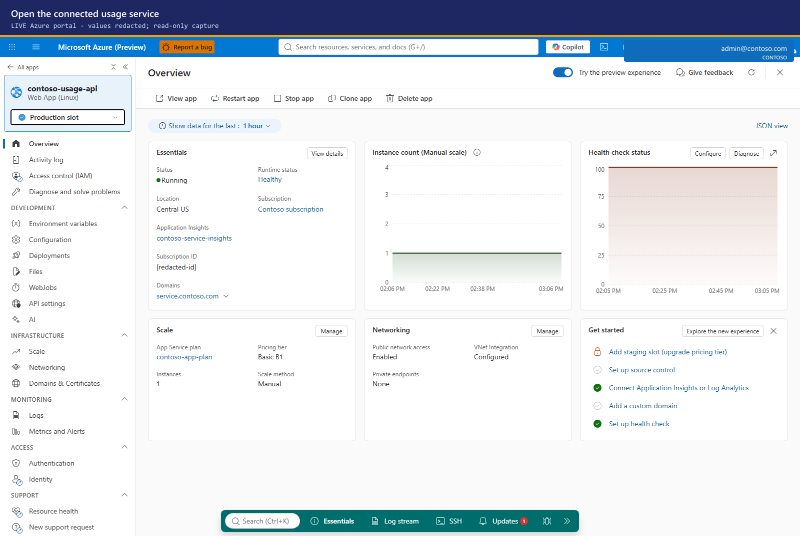

The Azure portal does not contain native fields for Turnstile's business-unit,
team or person budgets. **View app** opens the actual management GUI; a portal
database edit would bypass its validation and is not an equivalent safe procedure.

For Gateway authority only, use **API Management > APIs > Named values**:
`tpm-standard` / `tpm-premium` are per-minute tier limits; `quota-standard` /
`quota-premium` are daily limits; `models-*` are model allowlists; `bu-registry`
and `bu-parents` hold the unit/team hierarchy. Open the item, edit **Value** and
select **Save**, preserving every unrelated entry. Check parent allocation
before changing a team. Read the value back after saving.

Equivalent Azure CLI for a direct tier value:

```powershell
$tier = Read-Host 'Existing tier id'
$newLimit = Read-Host 'Approved tokens per minute'
az apim nv update --subscription $sub -g $rg --service-name $apim `
  --named-value-id "tpm-$tier" --value $newLimit -o none
az apim nv show --subscription $sub -g $rg --service-name $apim `
  --named-value-id "tpm-$tier" --query value -o tsv
```

For Turnstile authority, the equivalent REST operation is authenticated by
Azure CLI. Read the original first, write a body file, and follow apply:

```powershell
$month = Read-Host 'Month YYYY-MM'
$team = Read-Host 'Existing managed team id'
az rest --method get --url "$api/api/v1/budgets" --resource $audience `
  --url-parameters "period=$month" --subscription $sub -o json
@{token_limit=9000000; warning_threshold_percent=80} | ConvertTo-Json |
  Set-Content -Encoding utf8 .\budget-body.json
az rest --method put --url "$api/api/v1/budgets/department/$team" --resource $audience `
  --url-parameters "period=$month" --body '@budget-body.json' --subscription $sub -o json
az rest --method get --url "$api/api/v1/gateway-apply" --resource $audience `
  --subscription $sub -o json
```

`9000000` is an illustrative amount, not a deployment default. Choose the
approved value within the parent budget and retain the original for rollback.
Never print a bearer token or manually edit a secret named value to perform
these operations.

Installation, terminal themes, local filters, the banner and screenshot
rendering are local software operations; there is no Azure portal equivalent
because they do not change an Azure resource.

### 6. Change a mode or allocate person budgets

1. Follow **App Service > Overview > View app** to the authoritative Turnstile
   console. In **Gateway governance**, select the existing unit or team.
2. Inspect the current enforcement setting. Choose **strict**, **allowance** or
   **notify**. For allowance, enter an integer percentage from 1 through 100.
   Preserve the member and manager groups and all unrelated scopes.
3. Save, then inspect the gateway apply job. Verify the saved mode and, after
   completion, the gateway's **Named values > bu-modes > Value**. Absence of a
   scope in this value means strict; allowance is serialized as
   `scope-id=allowance:10` between sentinel commas.
4. For person allocation, use **Budget Management**, choose the team and search
   the person before editing. The displayed parent allocation must accommodate
   the entire change, not just the visible page. A person budget is a Turnstile
   budget record, not proof of a new gateway person-counter quota.

Azure CLI equivalent for a mode, using the connection variables established
above. This edits only the selected row but sends the complete preserved catalog:

```powershell
$catalog = az rest --method get --url "$api/api/v1/enterprise-catalog" `
  --resource $audience --subscription $sub -o json | ConvertFrom-Json -AsHashtable
$teamId = Read-Host 'Existing team id from the catalog'
$row = @($catalog.departments | Where-Object id -eq $teamId)
if ($row.Count -ne 1) { throw 'Choose exactly one existing team.' }
$row[0].attributes.enforcement = 'allowance'
$row[0].attributes.allowance_percent = 10
foreach ($unit in $catalog.organizations) { $unit.Remove('parent_id') | Out-Null }
@{
  organizations=$catalog.organizations
  departments=$catalog.departments
  default_department_id=$catalog.default_department_id
} | ConvertTo-Json -Depth 30 | Set-Content -Encoding utf8 .\catalog-body.json
az rest --method put --url "$api/api/v1/enterprise-catalog" --resource $audience `
  --subscription $sub --body '@catalog-body.json' -o json
az rest --method get --url "$api/api/v1/gateway-apply" --resource $audience `
  --subscription $sub -o json
```

Read and retain the original before editing. `10` is an illustrative approved
percentage, not a deployment default. For strict or notify, remove
`allowance_percent`; it is invalid outside allowance mode. If conditional writes
are advertised, include the current ETag as `If-Match`; a conflict requires rereading.

For bulk person allocation, the equivalent supported API is:

```powershell
$personId = Read-Host 'Person id returned by the selected team search'
@{
  department_id=$teamId
  selection='ids'
  user_ids=@($personId)
  allocation_mode='fixed'
  token_limit=200000
  warning_threshold_percent=80
} | ConvertTo-Json | Set-Content -Encoding utf8 .\bulk-budget-body.json
az rest --method post --url "$api/api/v1/budgets/users/bulk" `
  --resource $audience --subscription $sub --url-parameters "period=$month" `
  --body '@bulk-budget-body.json' -o json
```

`200000` and `80` are illustrative, not defaults read from a deployment.
Verify with `GET /api/v1/budgets/users?period=...&department_id=...&query=...`.
The portal has no native Turnstile bulk-budget blade; do not replace the
validated endpoint with a database edit. AUM's CSV client groups only the
prevalidated people/amounts and reports partial failure without retrying a write.

### 7. Inspect a request or move team membership

1. In **Log Analytics workspace > Logs**, use **KQL mode** and the repository's
   `analytics/chargeback-ledger.kql` query. Add a filter for the selected
   `request_id`. Select **Run** and verify the request id, timestamp and unit/team
   fields against the terminal detail.
2. AUM's `o` action builds this workspace link from the discovered ARM workspace
   id and tenant. `c` copies only the selected id; it does not modify Azure.
3. For membership, open **Microsoft Entra ID > Groups > All groups**, select the
   team member group recorded in the catalog, and open **Members**.
4. Only with existing group-owner/directory rights, use **Add members** on the
   target group and **Remove** on the former group. Verify both member lists.
   Directory propagation and gateway projection refresh are separate from the
   budget apply job. Do not grant yourself permissions to make this example work.

Azure CLI equivalents:

```powershell
$group = Read-Host 'Member group name or object id from the catalog'
az ad group show --group $group --query '{id:id,displayName:displayName}' -o json
az ad group member list --group $group --query '[].{id:id,displayName:displayName}' -o table
# After explicit approval, using the existing member's object id:
$personObjectId = Read-Host 'Verified person object id'
$targetGroup = Read-Host 'Verified target member group'
az ad group member add --group $targetGroup --member-id $personObjectId
az ad group member remove --group $group --member-id $personObjectId
```

The culminating acceptance performed directory writes only on clearly test-only
groups created and owned by the signed-in person, then deleted them. It did not
remove that person from unrelated groups. The final membership set matched the
starting set. Gateway/Turnstile Owner alone does not imply directory rights;
AUM verifies group ownership and never requests broader grants.

### 8. Ask, pin and inspect optional model-gateway views

1. Open the actual Turnstile GUI through **App Service > Overview > View app**.
   Choose **FinOps Assistant** with an unrestricted authorized sign-in. Scoped
   manager profiles do not gain access by opening the URL directly.
2. Review the selected model/cost settings. Submit a question only when its
   model cost and persistence are intended. Pin a chart actually returned by
   that conversation; the client must not fabricate chart rows.
3. If the connected Turnstile operates its own model gateway, open its model,
   backend-pool, release or subscription views. AUM exposes those same
   authorized reads, never key-reveal or provisioning operations.

Equivalent Azure CLI reads, with token acquisition kept inside Azure CLI:

```powershell
az rest --method get --url "$api/api/v1/assistant/settings" `
  --resource $audience --subscription $sub -o json
az rest --method get --url "$api/api/v1/assistant/conversations" `
  --resource $audience --subscription $sub -o json
az rest --method get --url "$api/api/v1/assistant/pinned-charts" `
  --resource $audience --subscription $sub -o json
az rest --method get --url "$api/api/v1/model-management" `
  --resource $audience --subscription $sub -o json
```

The last read may return 403 or no configured models; that is not an instruction
to request broader permissions. For an intended assistant invocation, write
`question`, `history`, `conversation_id`, `timezone` and `locale` to a JSON body
file and POST `/api/v1/assistant/ask`. A pin POSTs `title`, `description`,
`original_question` and the exact returned `chart` to
`/api/v1/assistant/pinned-charts`. The matching `aum ask` commands avoid hand-copying
response charts. This packet's live assistant evidence is read/preview evidence;
it is not a claim that a model invocation or pin write was performed.

### 9. Reports, local preferences and future service workflows

1. For a manual usage CSV, use **Log Analytics workspace > Logs > Run** and the
   result export control in step 4. This is a raw query export, not a substitute
   for P50's streaming reconciliation, provenance manifest and per-unit files.
2. `aum report generate` runs that existing generator. The report output remains
   local unless explicit `--send` is requested. No Azure portal blade performs
   the whole local reconciliation algorithm; the GUI path inspects its saved
   query functions and exported results instead.
3. Profiles, saved views and tour state are local to AUM. Use **Settings >
   Profile / backend**, `v` or `:`. Azure CLI's equivalent sign-in/session reads
   are `az account show` and `az account list`; `az logout` is the explicit shared
   session sign-out, not a harmless preview.
4. Turnstile does not yet advertise the proposed approvals/boosts/notification
   workflows on this connection. The independent AUM service offers native
   workflow endpoints with a different explicit contract. Neither authority
   should be bypassed by manually editing its storage records.

The current portal manifest covers all required gateway, workspace, verified
KQL-result and unobscured App Service pages, plus the created group's Overview,
Owners and Members. It records UTC times, source commits and image hashes.

## Measured end-to-end acceptance: create, enforce, restore

On **2026-09-25**, AUM completed the owner-approved journey through Direct and
Turnstile. Each used uniquely named `aum-e2e-*` security groups, verified the
signed-in owner, temporarily added only that person, registered a unit and team,
set monthly budgets, refreshed membership and sent tiny real Claude requests.
No new permission or consent was granted. Standard TPM was not changed.

| Step | Direct live evidence | Turnstile live evidence | Manual verification |
|---|---|---|---|
| Find/create group | [Group picker](images/aum/direct-group-form-lookup-110x36.svg), [owner preview](images/aum/direct-group-form-create-preview-110x36.svg), [created unit group](images/aum/direct-e2e-group-created-unit-ba354220.svg), [created team group](images/aum/direct-e2e-group-created-team-ba354220.svg) | [Unit group](images/aum/turnstile-e2e-group-created-unit-1f706bd1.svg), [team group](images/aum/turnstile-e2e-group-created-team-1f706bd1.svg) | Entra **Groups > Overview**, **Owners**, **Members** |
| Register hierarchy | [Scope form](images/aum/direct-group-form-scope-registration-110x36.svg), [unit](images/aum/direct-e2e-registered-unit-ba354220.svg), [team](images/aum/direct-e2e-registered-team-ba354220.svg) | [Unit](images/aum/turnstile-e2e-registered-unit-1f706bd1.svg), [team](images/aum/turnstile-e2e-registered-team-1f706bd1.svg), [explicit delegated bootstrap](images/aum/turnstile-e2e-delegated-bootstrap-team-1f706bd1.svg) | APIM **Named values > bu-registry / bu-parents**; server catalog and apply receipt |
| Set budgets | [Unit](images/aum/direct-e2e-budget-unit-ba354220.svg), [team](images/aum/direct-e2e-budget-team-ba354220.svg) | [Unit](images/aum/turnstile-e2e-budget-unit-1f706bd1.svg), [team](images/aum/turnstile-e2e-budget-team-1f706bd1.svg) | Reread original scope and current limit; distinguish parent allocation from usage |
| Refresh membership | [Delegated refresh](images/aum/direct-e2e-membership-refreshed-ba354220.svg) | [Authority-matched delegated refresh](images/aum/turnstile-e2e-membership-refreshed-1f706bd1.svg) | Entra member exists; APIM **bu-members** maps the object id to the test team |
| Strict refusal | [Actual HTTP 403](images/aum/direct-e2e-enforcement-strict-ba354220.svg) | [Actual HTTP 403](images/aum/turnstile-e2e-enforcement-strict-1f706bd1.svg) | `rate_limit_error`, business-unit budget and exact target scope; not generic access denial |
| Allowance 10% | [HTTP 200 + notice](images/aum/direct-e2e-enforcement-allowance-ba354220.svg) | [HTTP 200 + notice](images/aum/turnstile-e2e-enforcement-allowance-1f706bd1.svg) | `x-claude-budget-notice` contains `mode=allowance:10;status=estimated-over-budget` |
| Notify | [HTTP 200 + notice](images/aum/direct-e2e-enforcement-notify-ba354220.svg) | [HTTP 200 + notice](images/aum/turnstile-e2e-enforcement-notify-1f706bd1.svg) | Notice contains `mode=notify;status=usage-reported`; no team remaining-counter header is invented |
| Usage/request attribution | [Usage](images/aum/direct-e2e-post-cleanup-usage-ba354220.svg), [Requests](images/aum/direct-e2e-post-cleanup-requests-ba354220.svg) | [Usage](images/aum/turnstile-e2e-post-cleanup-usage-1f706bd1.svg), [Requests](images/aum/turnstile-e2e-post-cleanup-requests-1f706bd1.svg), [usage refresh](images/aum/turnstile-e2e-usage-refreshed-1f706bd1.svg) | Three accepted requests / 96 prompt+completion tokens remain attributed after cleanup |
| Cleanup | [Exact original values](images/aum/direct-e2e-cleanup-ba354220.svg) | [Exact values + original memberships](images/aum/turnstile-e2e-cleanup-1f706bd1.svg) | Test groups absent; original catalog, direct membership set and named-value bytes restored |

The live portal ownership/membership proof contains only the verified test identity:

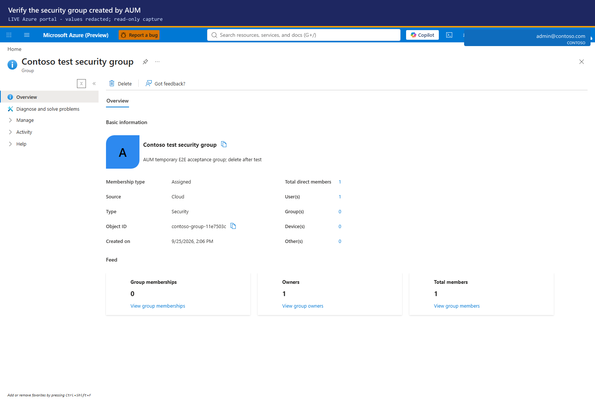

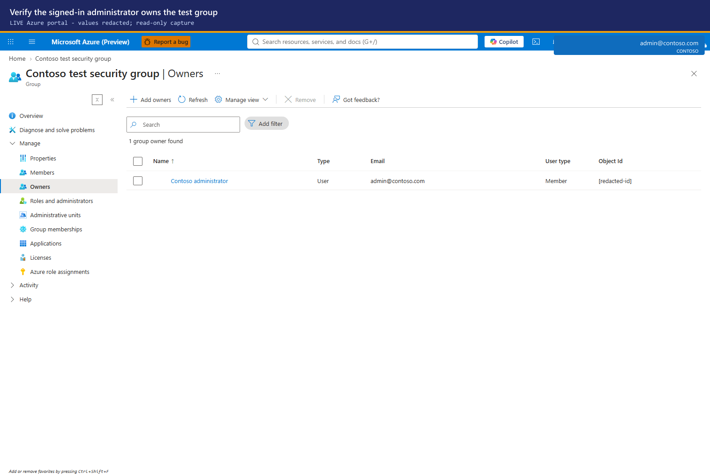

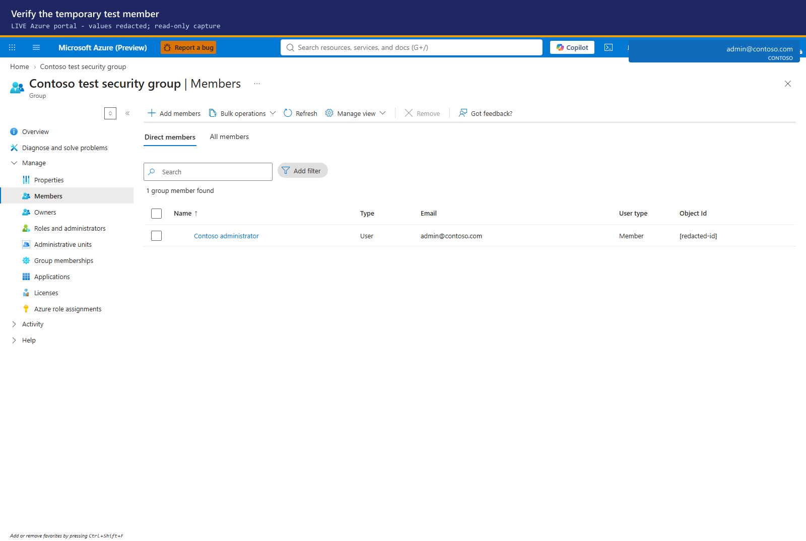

### Timings and what they prove

| Backend | Strict mode save → confirmed refusal | Allowance save → confirmed notice | Notify save → confirmed notice |
|---|---:|---:|---:|
| Direct | 26.498 s | 9.401 s | 7.994 s |
| Turnstile | 130.632 s | 156.900 s | 157.099 s |

These are measured upper bounds from save completion to the confirming response,
including the probe itself; they are not exact internal propagation latencies.
The strict test first admitted a 32-token request, then refused the next one at
the tiny limit. This confirms the documented delayed-counter behavior, not a
zero-overshoot hard ceiling.

Direct first observed two accepted rows 321.264 seconds after the first accepted
request; a later post-cleanup read confirmed all three / 96 tokens. Turnstile
waited for all accepted requests in the gateway ledger, then ran a **usage-only**
existing exporter execution for the bounded window. That execution took
160.156 seconds and left its job definition unchanged. All three ingested rows
were then visible; the first-observation upper bound was 794.006 seconds.

The background Turnstile job initially could not verify the new groups. AUM
measured that the execution completed but the registry lacked the test unit,
then explicitly used the signed-in-administrator publication path. Subsequent
budget/mode changes traversed **catalog/budget save → background apply job →
gateway**. The bootstrap is not mislabelled as success by the managed identity.

The AUM service's earlier read-only deployment was no longer deployed at the
culminating window: its endpoint was unreachable and its resource group returned
`ResourceGroupNotFound`. Its current contract/client tests remain, but no native
service group/budget mutation journey is claimed without an active target.

### Cleanup and operational pitfalls

The runner restores in `finally` even when a step fails. It preserves exact
`bu-registry`, `bu-members`, `bu-modes`, `bu-parents`, integration authority,
allowlists, TPM/daily-tier limits and model allowlists. The final Turnstile run
also compared the complete original direct-membership set: **14 memberships**,
unchanged after deleting both test groups.

An independent final read at **2026-09-25T09:45:44Z** verified all 13 named-value
strings, the original catalog (equivalent absent/default-strict representation),
the original membership set, zero remaining `aum-e2e-*` groups/catalog entries,
and zero active apply jobs:
[final restored live state](images/aum/turnstile-e2e-final-state-equal-restored.svg).

Earlier failed attempts exposed real issues, fixed and regression-tested:

- Graph create returned an id before `/owners` replicated it; deletion could
  remain readable briefly. Only verification reads are retried, not mutations.
- `az ad` rejects `--subscription`; ARM calls keep it, directory calls do not.
- A cached Direct capability still reflected the old authority after the explicit
  temporary switch. Native mode edits now refresh capability/authority state.
- The gateway's quota refusal is 403, not an assumed 429.
- A scheduled synchronization overlapped an early Direct attempt and copied test
  entities to Turnstile. They were removed and the original catalog verified.
  The runner now snapshots linked authority state and refuses a Direct window
  that can overlap the next scheduled governance pass.
- Cleanup removes child budgets before parents and follows the server's
  coalesced apply timestamp, then drains jobs before restoring exact gateway bytes.
- An immediate exporter override initially included unsupported template fields.
  The corrected execution-only payload was verified live; it changes no schedule,
  job definition, grants or governance.

Historical usage and audit facts from real test requests are retained, not deleted
to make the test disappear. Operational configuration, memberships and groups
are what the cleanup restores.

### 10. Configure AUM Direct without any Turnstile service

1. Use **Subscriptions > your subscription > Resource groups > your existing
   API Management service**. Verify the gateway **Overview** fields shown in
   step 1. Follow its configured **Application Insights** diagnostic to the
   **Logs workspace** as in step 3.
2. Choose **API Management > APIs > Named values**. Read `bu-registry`,
   `bu-parents`, `bu-modes`, `quota-overrides`, `quota-*`, `tpm-*` and `models-*`.
   None requires a Turnstile installation. If a `turnstile-integration` value
   exists and declares another write authority, do not bypass it.
3. Run `aum configure --backend direct --save`. The generated profile stores
   your selected subscription, gateway and workspace, never a token.
4. Run `aum whoami`, `aum status` and `aum people find --team <team-id>`.
   Settings must say Direct/Azure RBAC and explain the optional manager authorities.

The equivalent discovery CLI is the `az account list`, `az apim list`,
diagnostic/logger traversal and workspace query sequence in steps 1–4. No
deployment-specific resource name is a script default.

For a daily person override, use **Named values > quota-overrides > Value**.
The format is a comma-sentinel map of Entra object ids to daily tokens. Preserve
all other entries and stay within 4,096 characters. Removing one entry restores
that person's tier default; it does not change membership or per-minute tier
limits. The safer CLI equivalent invokes the existing serializer/writer:

```powershell
aum budget set person <observed-object-id> 200k --team <team-id> --backend direct --what-if
# Only after reviewing the preview:
aum budget set person <observed-object-id> 200k --team <team-id> --backend direct --apply
```

Equivalent native Azure CLI after preparing and validating the complete map:

```powershell
$existing = az apim nv show --subscription $sub -g $rg --service-name $apim `
  --named-value-id quota-overrides --query value -o tsv
# Retain $existing for rollback. $updated must preserve every unrelated object id.
$updated = Read-Host 'Reviewed complete override sentinel map'
az apim nv update --subscription $sub -g $rg --service-name $apim `
  --named-value-id quota-overrides --value $updated -o none
$actual = az apim nv show --subscription $sub -g $rg --service-name $apim `
  --named-value-id quota-overrides --query value -o tsv
if ($actual -cne $updated) { throw 'Read-back mismatch: inspect and restore the retained original.' }
```

For a multi-value manual edit, retain the exact old values and restore them in
reverse order when a later save fails. Reread first; if another operator changed
a value, stop for manual reconciliation rather than overwriting that change.
The AUM writer automates these checks and reports an incomplete restore as an error.

### 11. Query hourly facts or statistical candidates manually

1. Open **Log Analytics workspace > Logs > KQL mode**.
2. Start from `analytics/chargeback-ledger.kql`, replace its time bounds and add
   the discovered API Management resource-id filter before projecting the LLM log.
3. Append the following and choose **Run**:

```kusto
| summarize total_tokens=sum(total_tokens), total_requests=count()
    by bucket_start=bin(timestamp, 1h)
| order by bucket_start asc
```

The Azure CLI equivalent uses a `query.kql` file and `az rest --body
'@query-body.json'` as in step 4. Inspect hourly token/request buckets; do not
claim hourly cost or cache that the request ledger does not contain.

For statistical findings, the exact server query is composed in
[`direct_analytics.py::anomalies`](../cli/finops/src/claude_finops/direct_analytics.py).
Use that KQL in the same **Logs** editor, with your selected dates and preserved
pricing-exclusion/14-day guards. Its method and limits are described above.
The live query-result screenshot above is separate from the terminal/KQL API
proof; neither is substituted for the other.

### 12. Inspect the independent AUM service and call its native API

1. In **Azure portal > Function App**, choose the deployed app whose **Tags**
   include `component=aum-service`. Open **Overview** and verify its default
   domain and running state.
2. Open **Settings > Environment variables > App settings**. Read only
   `AUM_CLIENT_ID`, `AUM_TENANT_ID`, `AUM_APIM_RESOURCE_ID` and `AUM_WORKSPACE_ID`.
   These are address/identity metadata. Do not reveal or export unrelated
   connection strings or credentials.
3. Follow `AUM_APIM_RESOURCE_ID` to the actual governed gateway and verify it
   matches the intended target. An older recorded gateway default is not proof
   that the service governs that gateway.
4. In **Microsoft Entra ID > Enterprise applications > the existing AUM app >
   Users and groups**, inspect the already-assigned role. Admin, Viewer and
   Manager precedence is enforced by the service; this guide does not authorize
   assigning new roles or granting consent.
5. Run `aum configure --backend aum-service --save`, then `aum session show
   --json`. A supplied profile also works for app-role users without Azure
   resource-management rights.

Native Azure CLI reads:

```powershell
az functionapp list --subscription $sub --query "[?tags.component=='aum-service'].{name:name,group:resourceGroup,host:defaultHostName}" -o table
$functionGroup = Read-Host 'Selected Function App resource group'
$functionName = Read-Host 'Selected Function App name'
az functionapp config appsettings list --subscription $sub -g $functionGroup -n $functionName `
  --query "[?contains(['AUM_CLIENT_ID','AUM_TENANT_ID','AUM_APIM_RESOURCE_ID','AUM_WORKSPACE_ID'], name)].{name:name, value:value}" -o json
```

Use the discovered endpoint and audience for the following, never a function key:

```powershell
$aumApi = Read-Host 'Discovered AUM HTTPS origin'
$aumAudience = Read-Host 'api:// followed by the discovered AUM_CLIENT_ID'
az rest --method get --url "$aumApi/api/v1/me" --resource $aumAudience -o json
az rest --method get --url "$aumApi/api/v1/capabilities" --resource $aumAudience -o json
$budgets = az rest --method get --url "$aumApi/api/v1/budgets" --resource $aumAudience -o json | ConvertFrom-Json
$etag = '"' + $budgets.revision + '"'
@{ token_limit=200000; reason='Approved daily capacity' } | ConvertTo-Json |
  Set-Content -Encoding utf8 .\aum-budget-body.json
# Example mutation; choose an existing authorized object and review before running:
az rest --method put --url "$aumApi/api/v1/budgets/user/<object-id>" --resource $aumAudience `
  --headers "If-Match=$etag" --body '@aum-budget-body.json' -o json
```

Verify a native mutation by rereading `/api/v1/budgets` and its new revision;
an Admin may inspect `/api/v1/audit`. No Turnstile apply endpoint is involved.
A request uses POST `/api/v1/budget-requests` with scope, absolute `token_limit`
and reason; decisions POST `/api/v1/budget-requests/{id}/approve|reject|escalate`
with reason and the current integer `version`. A boost POSTs `/api/v1/boosts`
with the current `If-Match`, absolute raised limit and an expiry within 31 days.
The service's timer owns expiry restoration.

There is no native Azure portal form for these application workflows. The AUM
terminal is their GUI; Azure CLI REST is the manual API path. The Function App
portal verifies deployment and identity metadata, not application authorization
by editing its storage. At the culminating run the earlier native-service
deployment had been removed (`ResourceGroupNotFound`); no service deployment
or live mutation evidence is fabricated from the earlier read-only screenshots.
