# Azure CLI commands for a customer gateway setup

**Status:** commands checked against Azure CLI 2.86.0 help and the Bicep templates; not yet run end to end. The scripts remain the tested setup path. This guide is the plain Azure CLI equivalent for a reviewed customer deployment.

Run the commands in **Azure Cloud Shell bash** from the repository root; if Cloud Shell opens in PowerShell, switch with `bash` or the shell selector. Cloud Shell has `az`, `jq`, `git` and `node`. Windows users run the bash blocks in Cloud Shell, WSL or Git Bash. In Windows PowerShell, `az` arguments containing `( ) | & < > ^` are re-parsed by `cmd.exe` through the `az.cmd` shim; `--query` expressions and Graph URLs are common examples. Keep variables in the block below and substitute environment-specific values there, not inline.

A refusal prints `Refused: ...`, returns to the prompt, runs nothing after it in that block, and leaves the exported variables already set in the shell.

```bash
export SUBSCRIPTION_ID="<subscription-id>"
export TENANT_ID="<tenant-id>"
export LOCATION="<azure-region>"
export GATEWAY_RG="<gateway-resource-group>"
export FOUNDRY_RG="<foundry-resource-group>"
export FOUNDRY_ACCOUNT="<foundry-account-name>"
export NAME_PREFIX="<globally-unique-prefix>"
export APIM_NAME="apim-${NAME_PREFIX}"
export PUBLISHER_EMAIL="<operator-email>"
export PUBLISHER_NAME="AI Platform Team"
export STANDARD_GROUP="claude-code-standard"
export PREMIUM_GROUP="claude-code-premium"
export SONNET_DEPLOYMENT="claude-sonnet-5"
export OPUS_DEPLOYMENT="claude-opus-5"
export HAIKU_DEPLOYMENT="claude-sonnet-5"
export TPM_STANDARD="20000"
export QUOTA_STANDARD="500000"
export TPM_PREMIUM="80000"
export QUOTA_PREMIUM="5000000"
export QUOTA_ORG="100000000"
export CALLS_PER_MINUTE="120"
export MODELS_STANDARD=",${SONNET_DEPLOYMENT},"
export MODELS_PREMIUM=",${SONNET_DEPLOYMENT},${OPUS_DEPLOYMENT},"
export ENTITLEMENT_CACHE_SECONDS="3600"
export DESKTOP_EXTRA_AUDIENCE="urn:disabled:claude-extra-audience"
```

References use repository paths and line numbers from the source scripts that this guide mirrors.

## Portal and CLI overview

| Part | What it configures (the Azure object and setting) | az section (anchor link) | Portal blade path | Screenshot (existing, or pending capture) | Change later |
|---|---|---|---|---|---|
| 1 | Subscription, tenant, providers, Foundry account, operator access and model deployments | [§1](#1-variables-prerequisites-and-discovery) | [Part 1 in the portal](#part-1-in-the-portal) | Existing: `architecture-foundry-overview`, `architecture-foundry-access` | Change variables or Foundry deployments before rerunning dependent blocks. |
| 2 | API Management v2 service, template-created Claude API, operations, policy, logger, diagnostics and named-value readback | [§2](#2-gateway) | [Part 2 in the portal](#part-2-in-the-portal) | Existing: `gateway-overview`, `docs-review-api-settings`, `docs-review-api-policy`, `docs-review-gateway-diagnostics`, `p54-apim-network` | New APIM is written by `infra/main.bicep`; reused APIM SKU changes follow `docs/UPDATE-AND-CHANGE.md`. |
| 3 | Gateway system-assigned managed identity and Foundry `Cognitive Services User` role assignment | [§3](#3-gateway-managed-identity-and-foundry-role) | [Part 3 in the portal](#part-3-in-the-portal) | Existing: `gateway-identity`, `docs-review-gateway-identity`, `docs-review-foundry-iam`, `architecture-foundry-access` | Toggle identity and role assignments on the gateway and Foundry account, then rerun §3 verification. |
| 4 | API Management named values for limits, model allow lists, entitlement source and Desktop audience | [§4](#4-named-values-the-policy-needs) | [Part 4 in the portal](#part-4-in-the-portal) | Existing: `gateway-named-values` | Edit APIM named values or rerun the matching write block. |
| 5 | Entra tier groups, membership and published `allow-standard` / `allow-premium` named values | [§5](#5-entra-groups-and-entitlement-publishing) | [Part 5 in the portal](#part-5-in-the-portal) | Existing: `docs-review-entra-groups` | Change Entra membership, then rerun the Graph read and publish blocks. |
| 6 | Day-two tier limits, personal overrides, model deployments and tier model lists | [§6](#6-day-two-tier-operations) | [Part 6 in the portal](#part-6-in-the-portal) | Existing: `docs-review-daily-quota-editor` | Edit APIM named values and Foundry deployments, then rerun verification for the changed values. |
| 7 | Desktop public-client app registration, redirect URIs and APIM Desktop audience | [§7](#7-developer-sign-in-mode-and-claude-desktop-sign-in) | [Part 7 in the portal](#part-7-in-the-portal) | Pending: `p60-desktop-app-overview`, `p60-desktop-app-authentication`, `p60-desktop-app-api-permissions`, `p60-gateway-desktop-audience` | Edit the app registration and APIM audience named value, then regenerate the handover file. |
| 8 | `onboarding/claude-gateway.json` developer handover artifact | [§8](#8-developer-handover-file) | [Part 8 in the portal](#part-8-in-the-portal) | No screenshot; no portal equivalent | Regenerate and redistribute the JSON after endpoint, tenant, app id, SKU or tier-model changes. |
| 9 | Optional company gateway hostname, certificate source and APIM custom domain binding | [§9](#9-optional-company-address) | [Part 9 in the portal](#part-9-in-the-portal) | Existing: `p54-vault-certificate`, `p54-vault-role`; pending: `p90-company-custom-domains` | Change APIM Custom domains, Key Vault certificate and DNS together, then verify TLS. |
| 10 | Optional Cosmos projection, resolver app, private networking, resolver auth and APIM resolver named values | [§10](#10-optional-cosmos-projection) | [Part 10 in the portal](#part-10-in-the-portal) | Existing: `docs-review-cosmos-networking`, `docs-review-resolver-authentication`, `docs-review-resolver-networking`, `p54-private-endpoint`, `p54-private-dns`, `architecture-projection-networking` | Edit resolver named values only while keeping `entitlement-source` as `named-value` until the supported switch exists. |
| 11 | Data-plane verification, refusal cases, bypass audit, call ceiling and diagnostics review | [§11](#11-verification) | [Part 11 in the portal](#part-11-in-the-portal) | Existing: `docs-review-gateway-diagnostics`, `docs-review-workspace-tables`, `docs-review-workspace-functions`, `docs-review-workspace-workbooks` | Change named values, groups or role assignments, then rerun the relevant verification command. |
| 12 | Teardown of the gateway resource group and receipt-created external role/group/app objects | [§12](#12-teardown) | [Part 12 in the portal](#part-12-in-the-portal) | No current automated capture; `p90-resource-group-delete` moved to Tooling gaps | Delete only owned resources and receipt-created external objects after reviewing receipts. |

## Out of scope

FinOps beyond the gateway's named values (AUM, Turnstile, chargeback reports, USD reconciler, Grafana), business units and teams, workstation setup scripts, the network WAF edge, backup/restore/update, and analytics and data deletion.

- `bu-registry` — not covered: business units and teams are out of scope for this guide.
- `bu-members` — not covered: business units and teams are out of scope for this guide.
- `bu-parents` — not covered: business units and teams are out of scope for this guide.
- `bu-modes` — not covered: business-unit budget modes are out of scope for this guide.
- `bu-unassigned` — not covered: business-unit assignment behavior is out of scope for this guide.
- `usd-budgets` — not covered: USD reconciler and FinOps budget projection are out of scope.
- `usd-budget-state` — not covered: USD reconciler state is out of scope.

## 1. Variables, prerequisites and discovery

Set the subscription and confirm the signed-in tenant.

```bash
az account show --query "{subscription:id,tenant:tenantId,user:user.name}" -o json
az account list --query "[].{name:name,id:id,tenant:tenantId,state:state,isDefault:isDefault}" -o table
```

Expected result: the intended subscription and tenant appear. This mirrors `Install-ClaudeGateway.ps1:307`, `Install-ClaudeGateway.ps1:326` and `deploy.ps1:67`.


Register the resource providers the setup uses.

```bash
az provider register --namespace Microsoft.ApiManagement
az provider register --namespace Microsoft.CognitiveServices
az provider register --namespace Microsoft.Insights
az provider register --namespace Microsoft.OperationalInsights
az provider show --namespace Microsoft.ApiManagement --query registrationState -o tsv
az provider show --namespace Microsoft.CognitiveServices --query registrationState -o tsv
```

Expected result: each provider reaches `Registered`. This mirrors the prerequisite phase in `scripts/Test-Prerequisites.ps1` and the resource provider checks named in `docs/SETUP.md` section 2.

Discover the Foundry account and Claude deployments.

```bash
az cognitiveservices account list --query "[?kind=='AIServices'].{name:name,rg:resourceGroup,location:location,sku:sku.name}" -o table
az cognitiveservices account show -g "$FOUNDRY_RG" -n "$FOUNDRY_ACCOUNT" --query "{id:id,kind:kind,endpoint:properties.endpoints.\"AI Foundry API\"}" -o json
az cognitiveservices account deployment list -g "$FOUNDRY_RG" -n "$FOUNDRY_ACCOUNT" --query "[].{name:name,model:properties.model.name,format:properties.model.format,version:properties.model.version,sku:sku.name,capacity:sku.capacity,state:properties.provisioningState}" -o table
```

Expected result: the account kind is `AIServices`, the Foundry endpoint is present, and Claude deployments are listed. This mirrors `Get-FoundryValues.ps1`, `deploy.ps1:80-106`, and `scripts/ClaudeModelDeployment.ps1:1-120`.

List deployable Claude models when no deployment exists.

```bash
az cognitiveservices account list-models -g "$FOUNDRY_RG" -n "$FOUNDRY_ACCOUNT" --query "[?contains(tolower(kind),'anthropic') || contains(tolower(name),'claude')].{name:name,version:version,format:format,source:source}" -o table
```

Expected result: available Claude offers are visible, or an empty table states that the account cannot deploy Claude in that region. This mirrors `Install-ClaudeGateway.ps1:418` and `scripts/ClaudeModelDeployment.ps1:160-205`.

Check the operator roles without changing them.

```bash
export FOUNDRY_ID="$(az cognitiveservices account show -g "$FOUNDRY_RG" -n "$FOUNDRY_ACCOUNT" --query id -o tsv)"
az role assignment list --scope "$FOUNDRY_ID" --include-inherited --query "[].{principal:principalName,role:roleDefinitionName,scope:scope}" -o table
az role assignment list --scope "/subscriptions/${SUBSCRIPTION_ID}/resourceGroups/${GATEWAY_RG}" --include-inherited --query "[].{principal:principalName,role:roleDefinitionName,scope:scope}" -o table
```

Expected result: the operator has enough rights to deploy the gateway resource group and to inspect or assign the Foundry data-plane role. This mirrors `Install-ClaudeGateway.ps1:1526-1537` and `docs/SETUP.md` section 2.

### Part 1 in the portal

1. **Set the subscription and confirm the signed-in tenant.** portal.azure.com > Subscriptions: select the subscription whose ID is `$SUBSCRIPTION_ID`; Overview shows the tenant for `$TENANT_ID`. No Save button is used for read-only discovery.
2. **Register the resource providers.** portal.azure.com > Subscriptions > Resource providers: search `Microsoft.ApiManagement`, `Microsoft.CognitiveServices`, `Microsoft.Insights` and `Microsoft.OperationalInsights`; select each unregistered provider; **Register**.
3. **Discover the Foundry account and Claude deployments.** portal.azure.com > Foundry account > Overview: confirm resource group `$FOUNDRY_RG`, account `$FOUNDRY_ACCOUNT` and endpoint; ai.azure.com > Models + endpoints: confirm `$SONNET_DEPLOYMENT`, `$OPUS_DEPLOYMENT` and `$HAIKU_DEPLOYMENT`. Source: https://learn.microsoft.com/azure/ai-foundry/how-to/deploy-models-managed.

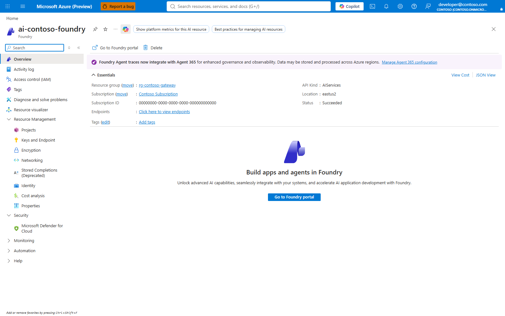

Capture id: `architecture-foundry-overview`.

4. **List deployable Claude models when no deployment exists.** ai.azure.com > Model catalog: filter for Claude/Anthropic; select a model; **Deploy** only when a required deployment variable has no matching deployment. Source: https://learn.microsoft.com/azure/ai-foundry/how-to/deploy-models-managed.
5. **Check the operator roles without changing them.** Foundry account > Access control (IAM) > Check access > View my access: verify the operator can assign roles on the Foundry account; resource group > Access control (IAM) > Check access: verify deployment rights. Source: `docs/SETUP.md:203-209` and `docs/SETUP.md:239-245`.

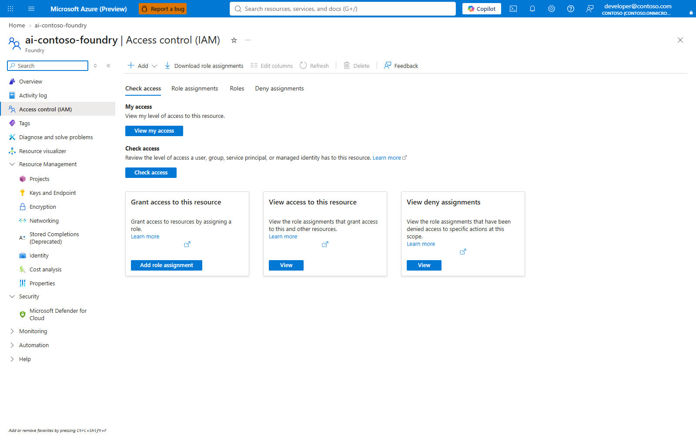

Capture id: `architecture-foundry-access`.

**Change later.** Edit the variables at the top of this guide for subscription, tenant, Foundry resource group, account or deployment names; rerun the discovery and role-check blocks before any dependent deployment block.

## 2. Gateway

Create the resource group.

```bash
az group create -n "$GATEWAY_RG" -l "$LOCATION" -o none
az group show -n "$GATEWAY_RG" --query "{name:name,location:location}" -o json
```

Expected result: the group exists in the chosen region. This mirrors `deploy.ps1:134`.


Validate the gateway template before deployment.

```bash
az bicep build --file infra/main.bicep
az deployment group what-if -g "$GATEWAY_RG" --template-file infra/main.bicep --parameters namePrefix="$NAME_PREFIX" location="$LOCATION" foundryAccountName="$FOUNDRY_ACCOUNT" foundryResourceGroup="$FOUNDRY_RG" publisherEmail="$PUBLISHER_EMAIL" publisherName="$PUBLISHER_NAME" apimSku=BasicV2 apimCapacity=1 sonnetDeployment="$SONNET_DEPLOYMENT" opusDeployment="$OPUS_DEPLOYMENT" haikuDeployment="$HAIKU_DEPLOYMENT" tpmStandard="$TPM_STANDARD" quotaStandard="$QUOTA_STANDARD" tpmPremium="$TPM_PREMIUM" quotaPremium="$QUOTA_PREMIUM" quotaOrg="$QUOTA_ORG" modelsStandard="$MODELS_STANDARD" modelsPremium="$MODELS_PREMIUM" callsPerMinute="$CALLS_PER_MINUTE" entitlementSource=named-value entitlementCacheSeconds="$ENTITLEMENT_CACHE_SECONDS" desktopExtraAudience="$DESKTOP_EXTRA_AUDIENCE"
```

Expected result: Bicep builds and what-if shows APIM, API, policy, logger, named values, diagnostics, workspace and role-assignment changes. This mirrors `deploy.ps1:157-170`, `Install-ClaudeGateway.ps1:1543-1585` and `infra/main.bicep:8-179`.

Deploy Basic v2.

```bash
az deployment group create -g "$GATEWAY_RG" -n "claude-gateway-basicv2" --template-file infra/main.bicep --parameters namePrefix="$NAME_PREFIX" location="$LOCATION" foundryAccountName="$FOUNDRY_ACCOUNT" foundryResourceGroup="$FOUNDRY_RG" publisherEmail="$PUBLISHER_EMAIL" publisherName="$PUBLISHER_NAME" apimSku=BasicV2 apimCapacity=1 sonnetDeployment="$SONNET_DEPLOYMENT" opusDeployment="$OPUS_DEPLOYMENT" haikuDeployment="$HAIKU_DEPLOYMENT" tpmStandard="$TPM_STANDARD" quotaStandard="$QUOTA_STANDARD" tpmPremium="$TPM_PREMIUM" quotaPremium="$QUOTA_PREMIUM" quotaOrg="$QUOTA_ORG" modelsStandard="$MODELS_STANDARD" modelsPremium="$MODELS_PREMIUM" callsPerMinute="$CALLS_PER_MINUTE" entitlementSource=named-value entitlementCacheSeconds="$ENTITLEMENT_CACHE_SECONDS" desktopExtraAudience="$DESKTOP_EXTRA_AUDIENCE" -o json
az deployment group show -g "$GATEWAY_RG" -n "claude-gateway-basicv2" --query "properties.outputs.{apim:apimName.value,url:gatewayUrl.value,principal:apimPrincipalId.value}" -o json
```

Expected result: outputs include the APIM name, gateway URL and APIM principal id. Basic v2 has no outbound VNet integration. This mirrors `infra/main.bicep:31-35`, `infra/main.bicep:443-460` and `Install-ClaudeGateway.ps1:1585`.

Deploy Standard v2 when outbound VNet integration is required.

```bash
export APIM_SUBNET_ID="<standard-v2-outbound-subnet-resource-id>"
az deployment group create -g "$GATEWAY_RG" -n "claude-gateway-standardv2" --template-file infra/main.bicep --parameters namePrefix="$NAME_PREFIX" location="$LOCATION" foundryAccountName="$FOUNDRY_ACCOUNT" foundryResourceGroup="$FOUNDRY_RG" publisherEmail="$PUBLISHER_EMAIL" publisherName="$PUBLISHER_NAME" apimSku=StandardV2 apimCapacity=1 apimVirtualNetworkType=External apimSubnetId="$APIM_SUBNET_ID" apimPublicNetworkAccess=Enabled sonnetDeployment="$SONNET_DEPLOYMENT" opusDeployment="$OPUS_DEPLOYMENT" haikuDeployment="$HAIKU_DEPLOYMENT" tpmStandard="$TPM_STANDARD" quotaStandard="$QUOTA_STANDARD" tpmPremium="$TPM_PREMIUM" quotaPremium="$QUOTA_PREMIUM" quotaOrg="$QUOTA_ORG" modelsStandard="$MODELS_STANDARD" modelsPremium="$MODELS_PREMIUM" callsPerMinute="$CALLS_PER_MINUTE" entitlementSource=named-value entitlementCacheSeconds="$ENTITLEMENT_CACHE_SECONDS" desktopExtraAudience="$DESKTOP_EXTRA_AUDIENCE" -o json
az apim show -g "$GATEWAY_RG" -n "$APIM_NAME" --query "{sku:sku.name,vnet:virtualNetworkType,subnet:virtualNetworkConfiguration.subnetResourceId}" -o json
```

Expected result: SKU is `StandardV2`, `virtualNetworkType` is `External`, and the subnet id is retained. This mirrors `infra/main.bicep:53-80` and the preservation comments in `infra/main.bicep:36-52`.

Deploy Premium v2 when the gateway itself must be injected privately.

```bash
export APIM_SUBNET_ID="<premium-v2-apim-subnet-resource-id>"
az deployment group create -g "$GATEWAY_RG" -n "claude-gateway-premiumv2" --template-file infra/main.bicep --parameters namePrefix="$NAME_PREFIX" location="$LOCATION" foundryAccountName="$FOUNDRY_ACCOUNT" foundryResourceGroup="$FOUNDRY_RG" publisherEmail="$PUBLISHER_EMAIL" publisherName="$PUBLISHER_NAME" apimSku=PremiumV2 apimCapacity=1 apimVirtualNetworkType=Internal apimSubnetId="$APIM_SUBNET_ID" apimPublicNetworkAccess=Disabled sonnetDeployment="$SONNET_DEPLOYMENT" opusDeployment="$OPUS_DEPLOYMENT" haikuDeployment="$HAIKU_DEPLOYMENT" tpmStandard="$TPM_STANDARD" quotaStandard="$QUOTA_STANDARD" tpmPremium="$TPM_PREMIUM" quotaPremium="$QUOTA_PREMIUM" quotaOrg="$QUOTA_ORG" modelsStandard="$MODELS_STANDARD" modelsPremium="$MODELS_PREMIUM" callsPerMinute="$CALLS_PER_MINUTE" entitlementSource=named-value entitlementCacheSeconds="$ENTITLEMENT_CACHE_SECONDS" desktopExtraAudience="$DESKTOP_EXTRA_AUDIENCE" -o json
az apim show -g "$GATEWAY_RG" -n "$APIM_NAME" --query "{sku:sku.name,vnet:virtualNetworkType,publicNetworkAccess:publicNetworkAccess}" -o json
```

Expected result: SKU is `PremiumV2`, VNet type is `Internal`, and public network access is disabled. This mirrors the v2 SKU and network parameters in `infra/main.bicep:31-68`.

Read policy deployment state.

```bash
az apim api show -g "$GATEWAY_RG" --service-name "$APIM_NAME" --api-id claude-foundry --query "{path:path,subscriptionRequired:subscriptionRequired,serviceUrl:serviceUrl}" -o json
az apim api operation list -g "$GATEWAY_RG" --service-name "$APIM_NAME" --api-id claude-foundry --query "[].{name:name,method:method,url:urlTemplate}" -o table
```

Expected result: the API path is `claude`, subscription keys are disabled, and operations include `/v1/messages` and `/v1/messages/count_tokens`. This mirrors `infra/main.bicep:303-342` and `scripts/Set-GatewayPolicy.ps1`.

Write and read back one named value the same way the helper does.

```bash
p89_named_value_readback() {
  VALUE_LENGTH="$(printf '%s' "$MODELS_STANDARD" | wc -c | tr -d ' ')"
  az apim nv show -g "$GATEWAY_RG" --service-name "$APIM_NAME" --named-value-id models-standard --query value -o tsv
  if [ "$VALUE_LENGTH" -le 4096 ]; then
    az apim nv update -g "$GATEWAY_RG" --service-name "$APIM_NAME" --named-value-id models-standard --value "$MODELS_STANDARD" -o none
  else
    echo "Refused: models-standard is $VALUE_LENGTH characters, over the 4,096-character APIM named-value limit. Nothing was written." >&2
    return 1
  fi
  az apim nv show -g "$GATEWAY_RG" --service-name "$APIM_NAME" --named-value-id models-standard --query value -o tsv
}
p89_named_value_readback
```

Expected result: the value length is at most 4,096, and the final read returns the exact value written. This mirrors `scripts/ApimNamedValue.ps1:35-73` and `scripts/ApimNamedValue.ps1:125-191`.

### Part 2 in the portal

1. **Create the resource group.** portal.azure.com > Resource groups > Create: Subscription `$SUBSCRIPTION_ID`; Resource group `$GATEWAY_RG`; Region `$LOCATION`; **Review + create**; **Create**.
2. **Validate the gateway template before deployment.** No portal equivalent: Bicep build and what-if are computation and deployment-planning commands.
3. **Deploy the gateway template.** portal.azure.com > Create a resource > Integration > API Management > Basics: Subscription `$SUBSCRIPTION_ID`; Resource group `$GATEWAY_RG`; Region `$LOCATION`; Resource name `$APIM_NAME`; Organization name `$PUBLISHER_NAME`; Administrator email `$PUBLISHER_EMAIL`; Pricing tier `Basic v2`, `Standard v2` or `Premium v2`; Units `$APIM_CAPACITY`; Monitor + secure can select Log Analytics; Networking can select tier-supported inbound/outbound options; Managed identity can enable system-assigned identity; Tags can add tags; **Review + create**; **Create**. The portal wizard creates the API Management service only. The `claude` API, operations, policy, named values, `appinsights` logger, API diagnostic and `claude-llm-logs` diagnostic setting come from `infra/main.bicep`. Source: https://learn.microsoft.com/azure/api-management/get-started-create-service-instance and `infra/main.bicep:252-296`.


Capture id: `gateway-overview`.

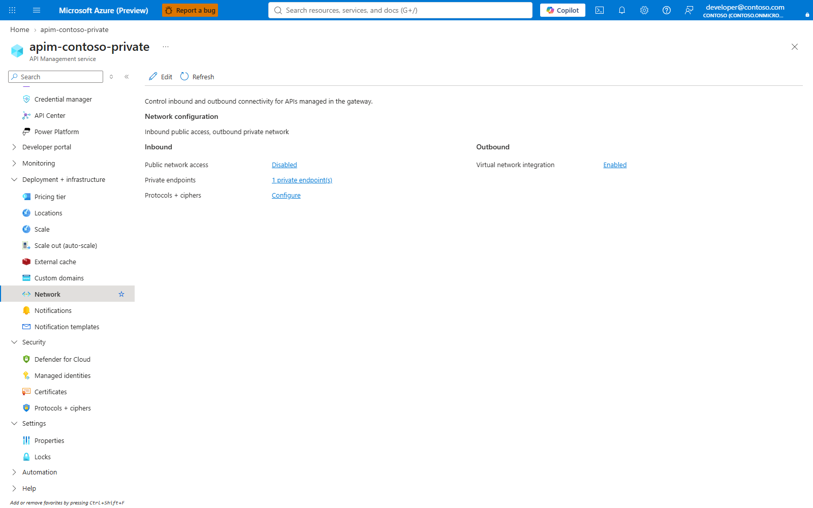

Capture id: `p54-apim-network`.

4. **Read back the deployment outputs.** API Management services > `$APIM_NAME` > Overview: compare Gateway URL with the deployment output. No Save button is used.
5. **Read policy deployment state.** API Management services > `$APIM_NAME` > APIs > `claude-foundry` > Settings: confirm API URL suffix `claude`, HTTPS and subscription setting; APIs > `claude-foundry` > Design > All operations: confirm operations and policy sections. The fields are template output, not portal-create fields.

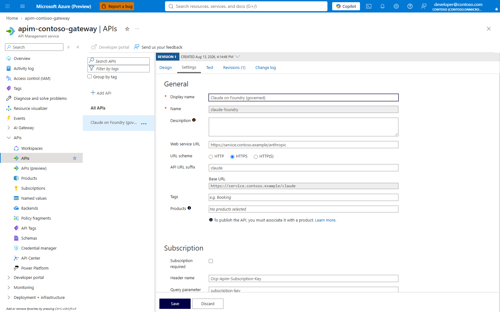

Capture id: `docs-review-api-settings`.

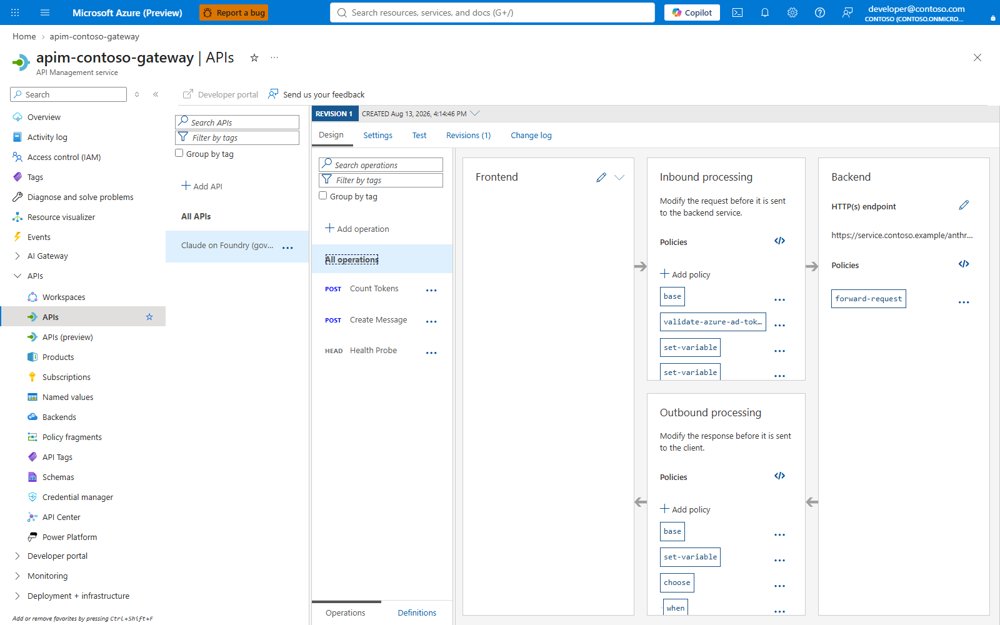

Capture id: `docs-review-api-policy`.

6. **Write and read back one named value.** API Management services > `$APIM_NAME` > APIs > Named values > `models-standard` > Edit: Value `$MODELS_STANDARD`; **Save**.
7. **Review template-created gateway diagnostics.** API Management services > `$APIM_NAME` > Monitoring > Diagnostic settings: confirm `claude-llm-logs` targets the Log Analytics workspace. This setting is deployed by `infra/main.bicep`, not by the APIM create wizard.


Capture id: `docs-review-gateway-diagnostics`.

**Change later.** For a newly owned APIM, edit `infra/main.bicep` parameters and rerun the deployment; for a reused APIM, the template never writes the service resource, so change Basic v2/Standard v2 SKU by following `docs/UPDATE-AND-CHANGE.md` and use a replacement gateway for Premium v2 network injection.

## 3. Gateway managed identity and Foundry role

Read the gateway identity and Foundry scope.

```bash
export APIM_PRINCIPAL_ID="$(az apim show -g "$GATEWAY_RG" -n "$APIM_NAME" --query identity.principalId -o tsv)"
export FOUNDRY_ID="$(az cognitiveservices account show -g "$FOUNDRY_RG" -n "$FOUNDRY_ACCOUNT" --query id -o tsv)"
az role assignment list --scope "$FOUNDRY_ID" --assignee "$APIM_PRINCIPAL_ID" --include-inherited --query "[?roleDefinitionName=='Cognitive Services User'].{role:roleDefinitionName,scope:scope}" -o table
```

Expected result: an existing assignment is listed, or the table is empty before the grant. This mirrors `Install-ClaudeGateway.ps1:1524-1537`.


Grant `Cognitive Services User` to the APIM managed identity when the list above is empty.

```bash
# P89-FOUNDRY-ROLE-BEGIN
mkdir -p .p89-receipts
EXISTING_FOUNDRY_ROLE_ID="$(az role assignment list --scope "$FOUNDRY_ID" --assignee "$APIM_PRINCIPAL_ID" --include-inherited --query "[?roleDefinitionName=='Cognitive Services User']|[0].id" -o tsv)"
if [ -n "$EXISTING_FOUNDRY_ROLE_ID" ]; then
  jq -n --arg existing "$EXISTING_FOUNDRY_ROLE_ID" '{foundryRole:{created:false,existingId:$existing}}' > .p89-receipts/foundry-role.json
  echo "Existing Cognitive Services User assignment recorded; teardown will not delete it."
else
  az role assignment create --assignee-object-id "$APIM_PRINCIPAL_ID" --assignee-principal-type ServicePrincipal --role "Cognitive Services User" --scope "$FOUNDRY_ID" -o json \
    | jq '{foundryRole:{created:true,id:.id}}' > .p89-receipts/foundry-role.json
fi
az role assignment list --scope "$FOUNDRY_ID" --assignee "$APIM_PRINCIPAL_ID" --include-inherited --query "[?roleDefinitionName=='Cognitive Services User'].{role:roleDefinitionName,scope:scope}" -o table
# P89-FOUNDRY-ROLE-END
```

Expected result: one assignment exists. `.p89-receipts/foundry-role.json` records whether this guide created it or found it already present. This mirrors `infra/foundry-role.bicep` and `infra/main.bicep:430-442`.

### Part 3 in the portal

1. **Read the gateway identity and Foundry scope.** API Management services > `$APIM_NAME` > Security > Managed identities > System assigned: Status **On**; copy **Object (principal) ID** into `$APIM_PRINCIPAL_ID`, not an application id. Source: https://learn.microsoft.com/azure/api-management/api-management-howto-use-managed-service-identity.


Capture id: `gateway-identity`.


Capture id: `docs-review-gateway-identity`.

2. **Enable a missing system-assigned identity before deployment reuses APIM.** API Management services > `$APIM_NAME` > Security > Managed identities > System assigned: Status **On**; **Save**. A reused instance with no identity fails deployment with `The language expression property 'identity' doesn't exist`, because `infra/main.bicep:506-513` passes `apim.identity.principalId` to `grant-apim-cognitive-services-user`. `az apim update` without `--enable-managed-identity true` sends the instance with no identity; Azure CLI `apim_update` sets `instance.identity = None` when `enable_managed_identity` is false. Source: https://github.com/Azure/azure-cli/blob/dev/src/azure-cli/azure/cli/command_modules/apim/custom.py and https://learn.microsoft.com/azure/api-management/api-management-howto-use-managed-service-identity.
3. **Grant `Cognitive Services User` to the APIM managed identity when the list above is empty.** Foundry account > Access control (IAM) > Add > Add role assignment: Role **Cognitive Services User**; Assign access to **Managed identity**; Members: the gateway object principal ID from `$APIM_PRINCIPAL_ID`; **Review + assign**. The operator needs User Access Administrator or Owner on the Foundry account because Contributor lacks `roleAssignments/write`; developers need no Azure role. Source: `docs/SETUP.md:203-209`, `docs/SETUP.md:239-245`, `docs/SETUP.md:270-276` and https://learn.microsoft.com/azure/role-based-access-control/role-assignments-portal.


Capture id: `docs-review-foundry-iam`.


Capture id: `architecture-foundry-access`.

**Change later.** If APIM is recreated or the system-assigned identity is toggled, copy the new Object principal ID, rerun §3, grant `Cognitive Services User` to the new principal and remove only confirmed-unused old assignments.

## 4. Named values the policy needs

Set tier limits, organisation ceiling, per-minute calls and model allow lists.

```bash
az apim nv update -g "$GATEWAY_RG" --service-name "$APIM_NAME" --named-value-id tpm-standard --value "$TPM_STANDARD" -o none
az apim nv update -g "$GATEWAY_RG" --service-name "$APIM_NAME" --named-value-id quota-standard --value "$QUOTA_STANDARD" -o none
az apim nv update -g "$GATEWAY_RG" --service-name "$APIM_NAME" --named-value-id tpm-premium --value "$TPM_PREMIUM" -o none
az apim nv update -g "$GATEWAY_RG" --service-name "$APIM_NAME" --named-value-id quota-premium --value "$QUOTA_PREMIUM" -o none
az apim nv update -g "$GATEWAY_RG" --service-name "$APIM_NAME" --named-value-id quota-org --value "$QUOTA_ORG" -o none
az apim nv update -g "$GATEWAY_RG" --service-name "$APIM_NAME" --named-value-id calls-per-minute --value "$CALLS_PER_MINUTE" -o none
az apim nv update -g "$GATEWAY_RG" --service-name "$APIM_NAME" --named-value-id models-standard --value "$MODELS_STANDARD" -o none
az apim nv update -g "$GATEWAY_RG" --service-name "$APIM_NAME" --named-value-id models-premium --value "$MODELS_PREMIUM" -o none
az apim nv list -g "$GATEWAY_RG" --service-name "$APIM_NAME" --query "[?starts_with(name,'tpm-') || starts_with(name,'quota-') || starts_with(name,'models-') || name=='calls-per-minute'].{name:name,value:value}" -o table
```

Expected result: values match the variables. Model lists use sentinel commas: `,claude-sonnet-5,` means only that deployment; `,,` means no model restriction. This mirrors `infra/main.bicep:350-377`, `scripts/Set-ClaudeTier.ps1:75-181` and `scripts/Add-ClaudeModel.ps1:245-253`.


Set entitlement source and resolver placeholders for the named-value path.

```bash
az apim nv update -g "$GATEWAY_RG" --service-name "$APIM_NAME" --named-value-id tenant-id --value "$TENANT_ID" -o none
az apim nv update -g "$GATEWAY_RG" --service-name "$APIM_NAME" --named-value-id entitlement-source --value "named-value" -o none
az apim nv update -g "$GATEWAY_RG" --service-name "$APIM_NAME" --named-value-id entitlement-resolver-url --value "https://resolver-not-deployed.invalid" -o none
az apim nv update -g "$GATEWAY_RG" --service-name "$APIM_NAME" --named-value-id entitlement-resolver-audience --value "https://resolver-not-deployed.invalid" -o none
az apim nv update -g "$GATEWAY_RG" --service-name "$APIM_NAME" --named-value-id entitlement-cache-seconds --value "$ENTITLEMENT_CACHE_SECONDS" -o none
az apim nv show -g "$GATEWAY_RG" --service-name "$APIM_NAME" --named-value-id tenant-id --query value -o tsv
az apim nv show -g "$GATEWAY_RG" --service-name "$APIM_NAME" --named-value-id entitlement-source --query value -o tsv
```

Expected result: `tenant-id` matches the deployment tenant and `entitlement-source` is `named-value`. This mirrors `infra/main.bicep:350`, `infra/main.bicep:144-160`, `infra/main.bicep:372-376` and `docs/SCALE.md:639-675`.

Verify the authorization and budget named values that the template initialized.

```bash
az apim nv list -g "$GATEWAY_RG" --service-name "$APIM_NAME" --query "[?name=='allow-standard' || name=='allow-premium' || name=='quota-overrides' || name=='external-idp-extra-audience'].{name:name,value:value}" -o table
```

Expected result: `allow-*` values are comma-sentinel lists, `quota-overrides` is `,,` until personal overrides exist, and the Desktop audience is the disabled sentinel until external sign-in is configured. Do not reset these values on an existing gateway; entitlement sync and budget commands own them after deployment. This mirrors `infra/main.bicep:215-224`, `infra/main.bicep:367-370`, `scripts/Sync-ClaudeAccess.ps1:122-129`, `scripts/ClaudeBudgetOverride.ps1:1-29` and `scripts/ApimNamedValue.ps1:150-154`.

### Part 4 in the portal

1. **Set tier limits, organisation ceiling, per-minute calls and model allow lists.** API Management services > `$APIM_NAME` > APIs > Named values: select `tpm-standard`, `quota-standard`, `tpm-premium`, `quota-premium`, `quota-org`, `calls-per-minute`, `models-standard` or `models-premium`; Edit > Value: matching variable; **Save**.

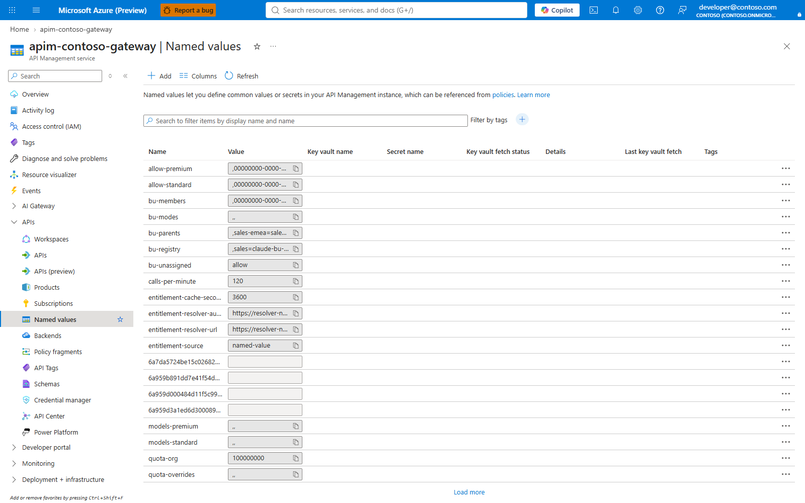

Capture id: `gateway-named-values`.

2. **Set entitlement source and resolver placeholders for the named-value path.** API Management services > `$APIM_NAME` > APIs > Named values: edit `tenant-id`, `entitlement-source`, `entitlement-resolver-url`, `entitlement-resolver-audience` and `entitlement-cache-seconds`; Value: matching command variable; **Save**.
3. **Verify the authorization and budget named values that the template initialized.** API Management services > `$APIM_NAME` > APIs > Named values: review `allow-standard`, `allow-premium`, `quota-overrides` and `external-idp-extra-audience`. No Save button is used for read-only verification.

**Change later.** Edit one named value in API Management or rerun the matching block; APIM policy reads limits, model allow lists, resolver settings and Desktop audience on later requests.

## 5. Entra groups and entitlement publishing

Create or discover the two tier groups.

```bash
# P89-GROUP-RECEIPTS-BEGIN
p89_group_receipts() {
  mkdir -p .p89-receipts
  record_group() {
    tier="$1"
    name="$2"
    receipt=".p89-receipts/group-${tier}.json"
    if printf '%s' "$name" | grep -q "'"; then
      echo "Refused: group name contains a single quote; nothing created or recorded." >&2
      return 1
    fi
    filter="displayName eq '$name'"
    if ! list_json="$(az ad group list --filter "$filter" --query "[].{id:id,createdDateTime:createdDateTime}" -o json)"; then
      echo "Refused: could not list group '$name'; nothing created or recorded." >&2
      return 1
    fi
    count="$(printf '%s' "$list_json" | jq 'length')"
    if [ "$count" -eq 1 ]; then
      printf '%s' "$list_json" | jq --arg name "$name" '{group:{created:false,id:.[0].id,displayName:$name,createdAt:(.[0].createdDateTime // "")}}' > "$receipt"
    elif [ "$count" -eq 0 ]; then
      if ! created_group_json="$(az ad group create --display-name "$name" --mail-nickname "$name" -o json)"; then
        echo "Refused: group '$name' could not be created. Tenant settings may block group creation by this principal; ask the tenant admin to create the group or grant permission. Nothing recorded." >&2
        return 1
      fi
      printf '%s' "$created_group_json" | jq --arg name "$name" '{group:{created:true,id:.id,displayName:$name,createdAt:(.createdDateTime // "")}}' > "$receipt"
    else
      echo "Refused: $count groups are named '$name'; nothing created or recorded." >&2
      return 1
    fi
    jq -e '.group.id | type == "string" and length > 0' "$receipt" >/dev/null || {
      rm -f "$receipt"
      echo "Refused: group '$name' receipt is invalid; nothing recorded." >&2
      return 1
    }
  }
  record_group standard "$STANDARD_GROUP" || return 1
  record_group premium "$PREMIUM_GROUP" || return 1
}
p89_group_receipts
# P89-GROUP-RECEIPTS-END
```

Expected result: each group has one exact-name match or is created, and `.p89-receipts/group-standard.json` / `.p89-receipts/group-premium.json` record whether this guide created it. This guide deliberately differs from `deploy.ps1:182-189`, which creates after a lookup error: a list failure, duplicate exact name or create failure refuses so teardown cannot delete the wrong directory object.


Read transitive members from Microsoft Graph as users and service principals.

```bash
# P89-ENTITLEMENT-GRAPH-BEGIN
p89_graph_membership_read() {
  if ! STANDARD_GROUP_ID="$(jq -r '.group.id // ""' .p89-receipts/group-standard.json)" || [ -z "$STANDARD_GROUP_ID" ]; then
    echo "Refused: could not resolve standard group receipt; no entitlement values were changed." >&2
    return 1
  fi
  if ! PREMIUM_GROUP_ID="$(jq -r '.group.id // ""' .p89-receipts/group-premium.json)" || [ -z "$PREMIUM_GROUP_ID" ]; then
    echo "Refused: could not resolve premium group receipt; no entitlement values were changed." >&2
    return 1
  fi

  GROUPS_JUST_CREATED="$(jq -s -r '[.[].group.created] | any' .p89-receipts/group-standard.json .p89-receipts/group-premium.json)"
  GROUPS_YOUNG="false"
  for receipt in .p89-receipts/group-standard.json .p89-receipts/group-premium.json; do
    created_at="$(jq -r '.group.createdAt // ""' "$receipt")"
    if [ -n "$created_at" ] && [ "$created_at" != "null" ]; then
      if created_epoch="$(date -u -d "$created_at" +%s 2>/dev/null)"; then
        now_epoch="$(date -u +%s)"
        if [ $((now_epoch - created_epoch)) -lt 900 ]; then GROUPS_YOUNG="true"; fi
      else
        echo "Graph retry note: could not parse createdAt '$created_at'; treating the group as not young." >&2
      fi
    fi
  done
  GRAPH_RETRY_ATTEMPTS="${GRAPH_RETRY_ATTEMPTS:-20}"
  GRAPH_RETRY_DELAY_SECONDS="${GRAPH_RETRY_DELAY_SECONDS:-30}"

  graph_get() {
    url="$1"
    file="$2"
    err="${file}.err"
    attempt=1
    while [ "$attempt" -le "$GRAPH_RETRY_ATTEMPTS" ]; do
      if az rest --method get --url "$url" --headers "ConsistencyLevel=eventual" --resource https://graph.microsoft.com -o json > "$file" 2> "$err"; then
        rm -f "$err"
        break
      fi
      rm -f "$file"
      error_text="$(cat "$err")"
      retryable_not_found="false"
      if printf '%s' "$error_text" | grep -Eq '(^|[[:space:]])Not Found\(' || printf '%s' "$error_text" | grep -q 'Request_ResourceNotFound'; then
        retryable_not_found="true"
      fi
      if [ "$retryable_not_found" = "true" ] && { [ "$GROUPS_JUST_CREATED" = "true" ] || [ "$GROUPS_YOUNG" = "true" ]; }; then
        if [ "$attempt" -lt "$GRAPH_RETRY_ATTEMPTS" ]; then
          echo "Graph advanced query returned 404 for a new group; retrying after index propagation ($attempt/$GRAPH_RETRY_ATTEMPTS)." >&2
          sleep "$GRAPH_RETRY_DELAY_SECONDS"
          attempt=$((attempt + 1))
          continue
        fi
        echo "Refused: Graph advanced query still returned 404 after bounded retry; no entitlement values were changed." >&2
        return 1
      fi
      echo "Graph read failed for $url; no entitlement values were changed." >&2
      return 1
    done
    if ! jq -e 'has("value") and (.value | type == "array")' "$file" >/dev/null; then
      echo "Graph response $file is not a confirmed collection; no entitlement values were changed." >&2
      return 1
    fi
    if jq -e 'has("@odata.nextLink")' "$file" >/dev/null; then
      echo "Graph response $file is paged. Follow @odata.nextLink and combine every page before publishing; no entitlement values were changed." >&2
      return 1
    fi
  }

  graph_get "https://graph.microsoft.com/v1.0/groups/${PREMIUM_GROUP_ID}/transitiveMembers/microsoft.graph.user?\$select=id,displayName,userPrincipalName&\$top=999&\$count=true" premium-users.json || return 1
  graph_get "https://graph.microsoft.com/v1.0/groups/${PREMIUM_GROUP_ID}/transitiveMembers/microsoft.graph.servicePrincipal?\$select=id,displayName&\$top=999&\$count=true" premium-service-principals.json || return 1
  graph_get "https://graph.microsoft.com/v1.0/groups/${STANDARD_GROUP_ID}/transitiveMembers/microsoft.graph.user?\$select=id,displayName,userPrincipalName&\$top=999&\$count=true" standard-users.json || return 1
  graph_get "https://graph.microsoft.com/v1.0/groups/${STANDARD_GROUP_ID}/transitiveMembers/microsoft.graph.servicePrincipal?\$select=id,displayName&\$top=999&\$count=true" standard-service-principals.json || return 1
}
p89_graph_membership_read
# P89-ENTITLEMENT-GRAPH-END
```

Expected result: the four JSON files exist and each contains a `value` array with no `@odata.nextLink`. A Graph error is an error, not an empty group; only a successful empty `value` array is empty. Microsoft Graph advanced directory queries use a separate index store and require `ConsistencyLevel: eventual` with `$count`; a just-created group can therefore be temporarily invisible to this query shape, so this block retries only for new or younger-than-15-minute groups and treats older 404s or any 403 as immediate errors (Microsoft Learn, "Advanced query capabilities on Microsoft Entra ID objects", https://learn.microsoft.com/graph/aad-advanced-queries, accessed 2026-10-01). Azure CLI 2.86.0's installed `azure/cli/core/util.pyc` for `send_raw_request` carries the `Reason(body)` formatting constants (`'{} {}'`, `'({})'`), so the retry checks the `Not Found(` reason or Graph `Request_ResourceNotFound` code, not any `404` substring. This mirrors `scripts/ClaudeGraphMembership.ps1:31-151`. The script uses direct REST in PowerShell because `az.cmd` on Windows re-parses `&`; in Cloud Shell bash, `az rest` is safe when the URL is quoted. The named-value path holds roughly 110 object ids per list; larger groups need the projection path.

Publish premium first, then standard without duplicates.

```bash
# P89-ENTITLEMENT-PUBLISH-BEGIN
p89_entitlement_publish() {
  for file in premium-users.json premium-service-principals.json standard-users.json standard-service-principals.json; do
    if ! jq -e 'has("value") and (.value | type == "array") and (has("@odata.nextLink") | not)' "$file" >/dev/null; then
      echo "Refused: $file is missing, invalid or incomplete; no entitlement values were changed." >&2
      return 1
    fi
  done

  jq -r '.value[].id' premium-users.json premium-service-principals.json | awk 'NF' | sort -fu > premium-oids.txt
  jq -r '.value[].id' standard-users.json standard-service-principals.json | awk 'NF' | sort -fu > standard-all-oids.txt
  comm -23 standard-all-oids.txt premium-oids.txt > standard-oids.txt

  oid_file_to_value() {
    file="$1"
    if [ -s "$file" ]; then
      printf ',%s,' "$(paste -sd, "$file")"
    else
      printf ','
    fi
  }

  PREMIUM_VALUE="$(oid_file_to_value premium-oids.txt)"
  STANDARD_VALUE="$(oid_file_to_value standard-oids.txt)"

  write_allow_value() {
    id="$1"
    value="$2"
    len="$(printf '%s' "$value" | wc -c | tr -d ' ')"
    if [ "$len" -gt 4096 ]; then
      echo "Refused: $id is $len characters, over the 4,096-character APIM named-value limit. Nothing was written." >&2
      return 1
    fi
    if [ "$value" = "," ] && [ "${ALLOW_EMPTY:-no}" != "yes" ]; then
      echo "Refused: $id is empty. Set ALLOW_EMPTY=yes only after review; everyone in that tier loses access after propagation." >&2
      return 1
    fi
    az apim nv update -g "$GATEWAY_RG" --service-name "$APIM_NAME" --named-value-id "$id" --value "$value" -o none
  }

  write_allow_value allow-premium "$PREMIUM_VALUE" || return 1
  write_allow_value allow-standard "$STANDARD_VALUE" || return 1
  az apim nv list -g "$GATEWAY_RG" --service-name "$APIM_NAME" --query "[?name=='allow-premium' || name=='allow-standard'].{name:name,value:value}" -o table
}
p89_entitlement_publish
# P89-ENTITLEMENT-PUBLISH-END
```

Expected result: `allow-premium` and `allow-standard` each have the `,oid,` form. A person in both groups appears only in `allow-premium`; premium precedence is deliberate. An empty tier is refused unless `ALLOW_EMPTY=yes` is set for an explicit review, because everyone in that tier loses access after propagation. The 4,096-character checks stop before any write. This mirrors `scripts/Sync-ClaudeAccess.ps1:77-130` and `scripts/ApimNamedValue.ps1:35-73`.

Add one developer to a tier and publish.

```bash
# P89-DEVELOPER-ADD-BEGIN
p89_developer_add_standard() {
  export DEVELOPER_UPN="<developer-upn-or-mail>"
  if ! DEVELOPER_ID="$(az ad user show --id "$DEVELOPER_UPN" --query id -o tsv)" || [ -z "$DEVELOPER_ID" ]; then
    echo "Refused: could not resolve developer '$DEVELOPER_UPN'; no group membership was changed." >&2
    return 1
  fi
  az ad group member add --group "$STANDARD_GROUP" --member-id "$DEVELOPER_ID" || return 1
  az ad group member remove --group "$PREMIUM_GROUP" --member-id "$DEVELOPER_ID" || return 1
  az ad group member list --group "$STANDARD_GROUP" --query "[?id=='${DEVELOPER_ID}'].id" -o tsv
  az ad group member list --group "$PREMIUM_GROUP" --query "[?id=='${DEVELOPER_ID}'].id" -o tsv
}
p89_developer_add_standard
# P89-DEVELOPER-ADD-END
```

Expected result: the developer id appears in the standard group and not in premium. This mirrors `scripts/Set-ClaudeDeveloper.ps1:175-260`: adding someone to one tier removes them from the other direct tier group so the portal and the published allow lists are unambiguous. Run the Graph read block and the publish block above after the group edit; until then the directory is updated but the gateway named values still hold the previous publication.

Remove one developer from both tiers and publish.

```bash
# P89-DEVELOPER-REMOVE-BEGIN
p89_developer_remove() {
  az ad group member remove --group "$STANDARD_GROUP" --member-id "$DEVELOPER_ID" || return 1
  az ad group member remove --group "$PREMIUM_GROUP" --member-id "$DEVELOPER_ID" || return 1
  az ad group member list --group "$STANDARD_GROUP" --query "[?id=='${DEVELOPER_ID}'].id" -o tsv
  az ad group member list --group "$PREMIUM_GROUP" --query "[?id=='${DEVELOPER_ID}'].id" -o tsv
}
p89_developer_remove
# P89-DEVELOPER-REMOVE-END
```

Expected result: both verification commands return no rows. This mirrors `scripts/Set-ClaudeDeveloper.ps1:175-260`.

Run the Graph read block and the publish block above after removal. The removal is not enforced at the gateway until the allow lists are republished.

### Part 5 in the portal

1. **Create or discover the two tier groups.** entra.microsoft.com > Groups > New group: Group type **Security**; Group name `$STANDARD_GROUP` or `$PREMIUM_GROUP`; Membership type **Assigned**; **Create**.

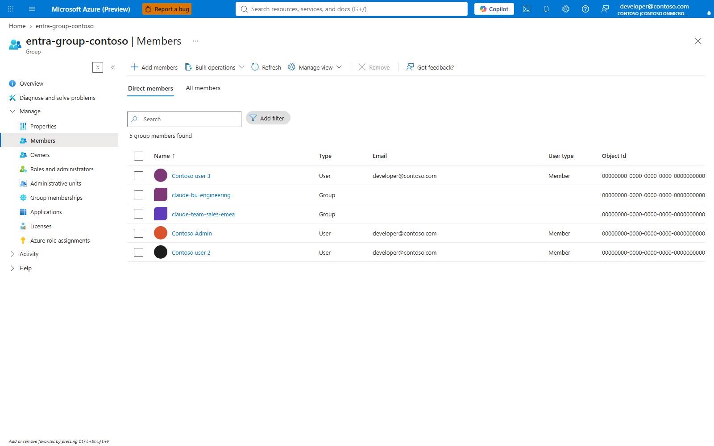

Capture id: `docs-review-entra-groups`.

2. **Read transitive members from Microsoft Graph as users and service principals.** No portal equivalent: the guarded block reads Graph collections, checks paging and writes local JSON files for publication.
3. **Publish the entitlement lists to APIM named values.** API Management services > `$APIM_NAME` > APIs > Named values: select `allow-standard` or `allow-premium`; Edit > Value: comma-sentinel object-id list; **Save**.
4. **Add one developer to a tier and publish.** entra.microsoft.com > Groups > `$STANDARD_GROUP` > Members > Add members: select `$DEVELOPER_UPN`; **Add**. Remove the same object from `$PREMIUM_GROUP` when moving tiers.
5. **Remove one developer from both tiers and publish.** entra.microsoft.com > Groups > tier group > Members: select the developer; **Remove**; confirm removal.

**Change later.** Change group membership in Entra, rerun the §5 Graph read and publish blocks, then verify the `allow-standard` and `allow-premium` named values before relying on enforcement.

## 6. Day-two tier operations

List the two tiers.

```bash
az apim nv list -g "$GATEWAY_RG" --service-name "$APIM_NAME" --query "[?name=='tpm-standard' || name=='quota-standard' || name=='models-standard' || name=='tpm-premium' || name=='quota-premium' || name=='models-premium'].{name:name,value:value}" -o table
```

Expected result: only `standard` and `premium` tier values are listed. A third tier is a policy change, not a named-value operation, because the policy names the two tiers directly (`docs/ONBOARDING.md:408-412`, `docs/ONBOARDING.md:472-476`). This mirrors `scripts/Set-ClaudeTier.ps1:1-34`.


Change one tier's model list and limits.

```bash
# P89-TIER-WRITES-BEGIN
p89_tier_writes() {
  az apim nv update -g "$GATEWAY_RG" --service-name "$APIM_NAME" --named-value-id tpm-standard --value "30000" -o none || return 1
  az apim nv update -g "$GATEWAY_RG" --service-name "$APIM_NAME" --named-value-id quota-standard --value "750000" -o none || return 1
  MODELS_STANDARD_NEXT=",${SONNET_DEPLOYMENT},"
  if [ "$(printf '%s' "$MODELS_STANDARD_NEXT" | wc -c | tr -d ' ')" -le 4096 ]; then
    az apim nv update -g "$GATEWAY_RG" --service-name "$APIM_NAME" --named-value-id models-standard --value "$MODELS_STANDARD_NEXT" -o none || return 1
  else
    echo "Refused: models-standard would exceed 4,096 characters. Nothing was written." >&2
    return 1
  fi
  az apim nv list -g "$GATEWAY_RG" --service-name "$APIM_NAME" --query "[?name=='tpm-standard' || name=='quota-standard' || name=='models-standard'].{name:name,value:value}" -o table
}
p89_tier_writes
# P89-TIER-WRITES-END
```

Expected result: the new values appear and take effect on the next request. This mirrors `scripts/Set-ClaudeTier.ps1:112-181`.

Set one person's daily token budget.

```bash
# P89-BUDGET-WRITE-BEGIN
p89_budget_write() {
  export BUDGET_OID="$(az ad user show --id "$DEVELOPER_UPN" --query id -o tsv | tr '[:upper:]' '[:lower:]')"
  export CURRENT_OVERRIDES="$(az apim nv show -g "$GATEWAY_RG" --service-name "$APIM_NAME" --named-value-id quota-overrides --query value -o tsv)"
  printf '%s\n' "$CURRENT_OVERRIDES" | grep -Eq '^,([^,=]+=([0-9]+),)*$|^,,$' || { echo "Refused: quota-overrides is malformed; no budget was written." >&2; return 1; }
  EXISTING_OVERRIDES="$(printf '%s' "$CURRENT_OVERRIDES" | tr ',' '\n' | awk -F= -v oid="$BUDGET_OID" 'NF && $1 != oid { print $0 }')"
  NEW_OVERRIDES="$(printf '%s\n%s=2000000\n' "$EXISTING_OVERRIDES" "$BUDGET_OID" | awk 'NF' | paste -sd, -)"
  NEW_OVERRIDES=",${NEW_OVERRIDES},"
  if [ "$(printf '%s' "$NEW_OVERRIDES" | wc -c | tr -d ' ')" -gt 4096 ]; then
    echo "Refused: quota-overrides would exceed 4,096 characters; no budget was written." >&2
    return 1
  fi
  az apim nv update -g "$GATEWAY_RG" --service-name "$APIM_NAME" --named-value-id quota-overrides --value "$NEW_OVERRIDES" -o none || return 1
  az apim nv show -g "$GATEWAY_RG" --service-name "$APIM_NAME" --named-value-id quota-overrides --query value -o tsv
}
p89_budget_write
# P89-BUDGET-WRITE-END
```

Expected result: `quota-overrides` contains `,<oid>=2000000,`. Preserve existing entries when more than one person has an override; the script reads the full map before changing it. This mirrors `scripts/Set-ClaudeBudget.ps1:1-41`, `scripts/Set-ClaudeBudget.ps1:137-220` and `scripts/ClaudeBudgetOverride.ps1:1-29`.

Clear that person's daily token budget.

```bash
az apim nv update -g "$GATEWAY_RG" --service-name "$APIM_NAME" --named-value-id quota-overrides --value ",," -o none
az apim nv show -g "$GATEWAY_RG" --service-name "$APIM_NAME" --named-value-id quota-overrides --query value -o tsv
```

Expected result: `,,` means no personal overrides. This mirrors `scripts/ClaudeBudgetOverride.ps1:24-29`.

Review Foundry deployments before adding a model.

```bash
az cognitiveservices account deployment list -g "$FOUNDRY_RG" -n "$FOUNDRY_ACCOUNT" --query "[].{name:name,model:properties.model.name,format:properties.model.format,version:properties.model.version,sku:sku.name,capacity:sku.capacity}" -o table
az apim nv list -g "$GATEWAY_RG" --service-name "$APIM_NAME" --query "[?name=='models-standard' || name=='models-premium'].{name:name,value:value}" -o table
```

Expected result: the deployment exists before it is added to a tier. This mirrors `scripts/Sync-ClaudeModels.ps1:1-91` and `scripts/Add-ClaudeModel.ps1:109-153`.

Deploy a new Claude model through ARM when Azure requires Anthropic provider data.

```bash
cat > deployment-body.json <<JSON
{"sku":{"name":"GlobalStandard","capacity":50},"properties":{"model":{"format":"Anthropic","name":"<model-name>","version":"<version>"},"modelProviderData":{"organizationName":"<organization-name>","industry":"<industry>","countryCode":"<country-code>"}}}
JSON
az rest --method put --headers "Content-Type=application/json" --body @deployment-body.json --url "https://management.azure.com/subscriptions/${SUBSCRIPTION_ID}/resourceGroups/${FOUNDRY_RG}/providers/Microsoft.CognitiveServices/accounts/${FOUNDRY_ACCOUNT}/deployments/<deployment-name>?api-version=2025-12-01" -o json
az cognitiveservices account deployment show -g "$FOUNDRY_RG" -n "$FOUNDRY_ACCOUNT" --deployment-name "<deployment-name>" --query "{name:name,state:properties.provisioningState,model:properties.model.name}" -o json
```

Expected result: provisioning reaches `Succeeded`. This mirrors `scripts/ClaudeModelDeployment.ps1:319-395`; it uses ARM because `az cognitiveservices account deployment create` cannot send `modelProviderData` for Anthropic deployments.

Add the deployed model to tiers and record prices.

```bash
p89_add_model_to_premium() {
  export NEW_MODEL="<deployment-name>"
  export MODELS_PREMIUM_NOW="$(az apim nv show -g "$GATEWAY_RG" --service-name "$APIM_NAME" --named-value-id models-premium --query value -o tsv)"
  export MODELS_PREMIUM_NEXT="$(printf '%s' "$MODELS_PREMIUM_NOW" | sed 's/,$//'),${NEW_MODEL},"
  if [ "$(printf '%s' "$MODELS_PREMIUM_NEXT" | wc -c | tr -d ' ')" -le 4096 ]; then
    az apim nv update -g "$GATEWAY_RG" --service-name "$APIM_NAME" --named-value-id models-premium --value "$MODELS_PREMIUM_NEXT" -o none || return 1
  else
    echo "Refused: models-premium would exceed 4,096 characters. Nothing was written." >&2
    return 1
  fi
  jq --arg model "$NEW_MODEL" --argjson input 5 --argjson output 25 '.date=(now|strftime("%Y-%m-%d")) | .source="list price, https://platform.claude.com/docs/en/about-claude/pricing" | .models[$model]={inputPerM:$input,outputPerM:$output}' config/price-book.json > config/price-book.next.json
  mv config/price-book.next.json config/price-book.json
  az apim nv show -g "$GATEWAY_RG" --service-name "$APIM_NAME" --named-value-id models-premium --query value -o tsv
}
p89_add_model_to_premium
```

Expected result: the premium model list contains the new deployment with sentinel commas, and `config/price-book.json` has a dated price entry. This mirrors `scripts/Add-ClaudeModel.ps1:208-253`.

### Part 6 in the portal

1. **List the two tiers.** API Management services > `$APIM_NAME` > APIs > Named values: filter for `standard` and `premium` tier values. No Save button is used for read-only review.

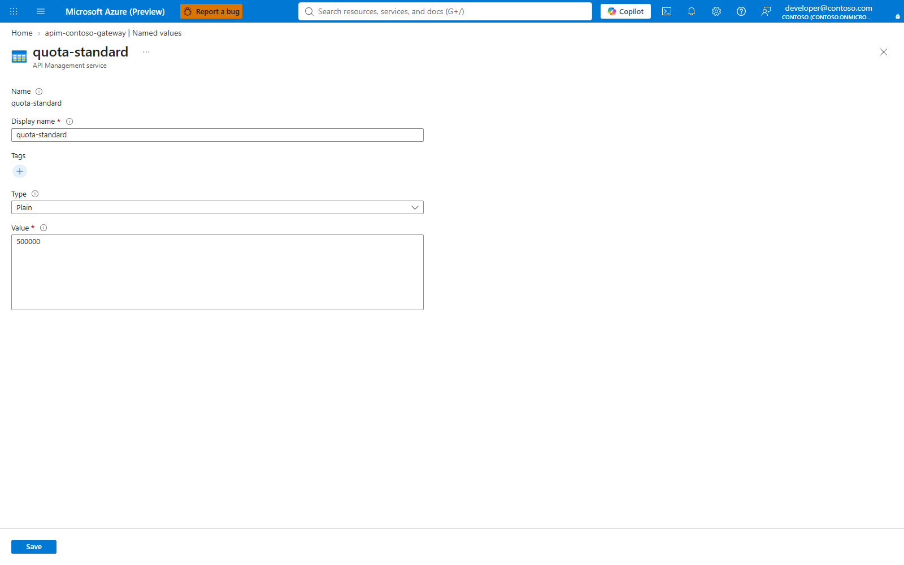

Capture id: `docs-review-daily-quota-editor`.

2. **Change one tier's model list and limits.** API Management services > `$APIM_NAME` > APIs > Named values: select `tpm-standard`, `quota-standard` or `models-standard`; Edit > Value: the next value; **Save**.
3. **Set one person's daily token budget.** API Management services > `$APIM_NAME` > APIs > Named values > `quota-overrides` > Edit: Value `,<object-id>=<tokens>,` preserving other entries; **Save**.
4. **Clear that person's daily token budget.** API Management services > `$APIM_NAME` > APIs > Named values > `quota-overrides` > Edit: Value `,,` or the remaining entries; **Save**.
5. **Review Foundry deployments before adding a model.** ai.azure.com > Models + endpoints: confirm the deployment name before editing tier model lists. No Save button is used for read-only review.
6. **Deploy a new Claude model through ARM when Azure requires Anthropic provider data.** ai.azure.com > Model catalog > Claude model > Deploy: deployment name `<deployment-name>`; capacity and version matching the deployment body; **Deploy**. Source: https://learn.microsoft.com/azure/ai-foundry/how-to/deploy-models-managed.
7. **Add the deployed model to tiers and record prices.** API Management services > `$APIM_NAME` > APIs > Named values > `models-premium` or `models-standard` > Edit: add the deployment name with sentinel commas; **Save**. No portal equivalent for the repository `config/price-book.json` edit.

**Change later.** Change tier limits and personal overrides in APIM named values; for a model change, deploy the model in Foundry, update the tier model-list named value and update `config/price-book.json` in the repository.

## 7. Developer sign-in mode and Claude Desktop sign-in

Create or discover the Desktop public-client app.

```bash
# P89-DESKTOP-APP-BEGIN
p89_desktop_app_receipt() {
  mkdir -p .p89-receipts
  export DESKTOP_APP_NAME="Claude Desktop gateway"
  if printf '%s' "$DESKTOP_APP_NAME" | grep -q "'"; then
    echo "Refused: Desktop app name contains a single quote; nothing created or recorded." >&2
    return 1
  fi
  filter="displayName eq '$DESKTOP_APP_NAME'"
  if ! app_list_json="$(az ad app list --filter "$filter" --query "[].{appId:appId,id:id}" -o json)"; then
    echo "Refused: could not list app '$DESKTOP_APP_NAME'; nothing created or recorded." >&2
    return 1
  fi
  count="$(printf '%s' "$app_list_json" | jq 'length')"
  if [ "$count" -eq 1 ]; then
    printf '%s' "$app_list_json" | jq --arg displayName "$DESKTOP_APP_NAME" '{app:{created:false,appId:.[0].appId,objectId:.[0].id,displayName:$displayName}}' > .p89-receipts/desktop-app.json
  elif [ "$count" -eq 0 ]; then
    if ! created_app_json="$(az ad app create --display-name "$DESKTOP_APP_NAME" --sign-in-audience AzureADMyOrg -o json)"; then
      echo "Refused: app '$DESKTOP_APP_NAME' could not be created. Tenant settings may block app registration by this principal; ask the tenant admin to create the app or grant permission. Nothing recorded." >&2
      return 1
    fi
    printf '%s' "$created_app_json" | jq '{app:{created:true,appId:.appId,objectId:(.id // ""),displayName:.displayName}}' > .p89-receipts/desktop-app.json
  else
    echo "Refused: $count apps are named '$DESKTOP_APP_NAME'; nothing created or recorded." >&2
    return 1
  fi
  export DESKTOP_CLIENT_ID="$(jq -r '.app.appId' .p89-receipts/desktop-app.json)"
  jq -e '.app.appId | type == "string" and length > 0' .p89-receipts/desktop-app.json >/dev/null || {
    rm -f .p89-receipts/desktop-app.json
    echo "Refused: Desktop app receipt is invalid; nothing recorded." >&2
    return 1
  }
}
p89_desktop_app_receipt
# P89-DESKTOP-APP-END
```

Expected result: one exact-name application id is available and `.p89-receipts/desktop-app.json` records whether this guide created it. This guide deliberately differs from `New-ClaudeDesktopEntraApp.ps1:31-37`, which creates after a lookup miss: a list failure, duplicate exact name or create failure refuses so teardown cannot delete the wrong app registration.

Set public-client redirect URIs, including broker redirects when the Desktop profile uses broker flow.

```bash
export DESKTOP_CLIENT_ID="<desktop-public-client-app-id>"
az ad app update --id "$DESKTOP_CLIENT_ID" --is-fallback-public-client true --public-client-redirect-uris "http://127.0.0.1/callback" "ms-appx-web://Microsoft.AAD.BrokerPlugin/${DESKTOP_CLIENT_ID}" "msauth.com.anthropic.claudefordesktop://auth" -o none
az ad app show --id "$DESKTOP_CLIENT_ID" --query "{appId:appId,publicClient:publicClient.redirectUris,isFallbackPublicClient:isFallbackPublicClient}" -o json
```

Expected result: the redirect URI list contains the loopback URI and broker URIs when broker is enabled. This mirrors `scripts/New-ClaudeDesktopEntraApp.ps1:43-64`.

Publish the Desktop gateway audience into APIM.

```bash
export DESKTOP_GATEWAY_AUDIENCE="$DESKTOP_CLIENT_ID"
az apim nv update -g "$GATEWAY_RG" --service-name "$APIM_NAME" --named-value-id external-idp-extra-audience --value "$DESKTOP_GATEWAY_AUDIENCE" -o none
az apim nv show -g "$GATEWAY_RG" --service-name "$APIM_NAME" --named-value-id external-idp-extra-audience --query value -o tsv
```

Expected result: the app id is stored as `external-idp-extra-audience` for id-token mode. For access-token mode, store the gateway API audience instead. Consent is not granted by these commands; a tenant admin grants user/admin consent for scopes that require it. This mirrors `Install-ClaudeGateway.ps1:1141-1238`, `Install-ClaudeGateway.ps1:1573` and `scripts/ClaudeDesktopSignIn.ps1:92-101`.

### Part 7 in the portal

1. **Create or discover the Desktop public-client app.** entra.microsoft.com > App registrations > New registration: Name `Claude Desktop gateway`; Supported account types **Accounts in this organizational directory only**; **Register**. Pending capture id: `p60-desktop-app-overview`.
2. **Configure Desktop redirect URIs.** App registrations > `Claude Desktop gateway` > Authentication > Add a platform > Mobile and desktop applications: Redirect URI `http://localhost` and the Desktop redirect values used by the command; **Configure**; **Save**. Pending capture id: `p60-desktop-app-authentication`.
3. **Configure API permissions if tenant policy requires review.** App registrations > `Claude Desktop gateway` > API permissions: add or review delegated permissions required by the Desktop sign-in flow; **Add permissions**. Pending capture id: `p60-desktop-app-api-permissions`.
4. **Publish the Desktop audience to APIM.** API Management services > `$APIM_NAME` > APIs > Named values > `external-idp-extra-audience` > Edit: Value `$DESKTOP_EXTRA_AUDIENCE`; **Save**. Pending capture id: `p60-gateway-desktop-audience`.

**Change later.** Edit the app registration Authentication/API permissions blades and the `external-idp-extra-audience` APIM named value, then rerun §8 to regenerate the handover file.

## 8. Developer handover file

Generate `onboarding/claude-gateway.json` with the same schema the installer writes.

```bash
# P89-HANDOVER-BEGIN
mkdir -p onboarding
GATEWAY_URL="$(az deployment group show -g "$GATEWAY_RG" -n "claude-gateway-basicv2" --query properties.outputs.gatewayUrl.value -o tsv)"
export SKU="${SKU:-BasicV2}"
export ENTITLEMENT_STORE="${ENTITLEMENT_STORE:-named-value}"
export RESOLVER_INBOUND_ACCESS="${RESOLVER_INBOUND_ACCESS:-private}"
export PROJECTION_DEPLOYER="${PROJECTION_DEPLOYER:-./scripts/Deploy-ClaudeProjection.ps1}"
export AUTH_MODE="${AUTH_MODE:-interactive}"
STANDARD_MODELS_JSON="$(printf '%s' "$MODELS_STANDARD" | tr ',' '\n' | awk 'NF' | jq -R . | jq -s .)"
PREMIUM_MODELS_JSON="$(printf '%s' "$MODELS_PREMIUM" | tr ',' '\n' | awk 'NF' | jq -R . | jq -s .)"
jq -n --arg mode "gateway" --arg gatewayUrl "$GATEWAY_URL" --arg tenantId "$TENANT_ID" --arg apimName "$APIM_NAME" --arg resourceGroup "$GATEWAY_RG" --arg subscriptionId "$SUBSCRIPTION_ID" --arg sku "$SKU" --arg location "$LOCATION" --arg foundryAccount "$FOUNDRY_ACCOUNT" --arg foundryResourceGroup "$FOUNDRY_RG" --arg standardGroup "$STANDARD_GROUP" --arg premiumGroup "$PREMIUM_GROUP" --arg authMode "$AUTH_MODE" --arg entitlementStore "$ENTITLEMENT_STORE" --arg resolverInboundAccess "$RESOLVER_INBOUND_ACCESS" --arg projectionDeployer "$PROJECTION_DEPLOYER" --arg sonnet "$SONNET_DEPLOYMENT" --arg opus "$OPUS_DEPLOYMENT" --arg haiku "$HAIKU_DEPLOYMENT" --argjson standardModels "$STANDARD_MODELS_JSON" --argjson premiumModels "$PREMIUM_MODELS_JSON" --argjson tpmStandard "$TPM_STANDARD" --argjson quotaStandard "$QUOTA_STANDARD" --argjson tpmPremium "$TPM_PREMIUM" --argjson quotaPremium "$QUOTA_PREMIUM" --argjson quotaOrg "$QUOTA_ORG" --argjson callsPerMinute "$CALLS_PER_MINUTE" --arg desktopClientId "$DESKTOP_CLIENT_ID" --arg issuer "https://login.microsoftonline.com/${TENANT_ID}/v2.0" --arg modelsStandard "$MODELS_STANDARD" --arg modelsPremium "$MODELS_PREMIUM" '{
  mode:$mode,
  gatewayUrl:$gatewayUrl,
  tenantId:$tenantId,
  apimName:$apimName,
  resourceGroup:$resourceGroup,
  subscriptionId:$subscriptionId,
  sku:$sku,
  location:$location,
  foundryAccount:$foundryAccount,
  foundryResourceGroup:$foundryResourceGroup,
  standardGroup:$standardGroup,
  premiumGroup:$premiumGroup,
  authMode:$authMode,
  entitlementStore:$entitlementStore,
  resolverInboundAccess:$resolverInboundAccess,
  projectionDeployer:$projectionDeployer,
  desktopSignIn:{kind:"external-idp",flow:"browser",bearerTokenType:"id_token",clientId:$desktopClientId,issuer:$issuer},
  deployments:[{name:$sonnet,model:$sonnet},{name:$opus,model:$opus},{name:$haiku,model:$haiku}],
  models:[$sonnet,$opus,$haiku],
  tiers:{
    standard:{tokensPerMinute:$tpmStandard,tokensPerDay:$quotaStandard,models:$standardModels,modelAllowList:$modelsStandard},
    premium:{tokensPerMinute:$tpmPremium,tokensPerDay:$quotaPremium,models:$premiumModels,modelAllowList:$modelsPremium}
  },
  organisation:{tokensPerMonth:$quotaOrg,shared:true,softCap:true},
  requestsPerMinute:$callsPerMinute,
  generated:(now|strftime("%Y-%m-%d %H:%M"))
}' > onboarding/claude-gateway.json
jq -e '.mode=="gateway" and (.gatewayUrl|test("^https://")) and (.desktopSignIn.kind=="external-idp" or .desktopSignIn.kind=="helper-script") and (.subscriptionId|type=="string") and (.tiers.standard.models|type=="array") and (.requestsPerMinute|type=="number")' onboarding/claude-gateway.json
# P89-HANDOVER-END
```

Expected result: `jq -e` exits 0, and the file contains no secrets. The key set matches the installer record, including subscription, SKU, region, Foundry account, entitlement store, projection deployer, tier model arrays, tier model allow-list strings and request ceiling. This mirrors `Install-ClaudeGateway.ps1:1699-1726` and `onboarding/README.md:13-41`. `scripts/Setup-ClaudeWorkstation.ps1` consumes this file through `-ConfigPath`; `Onboard-ClaudeDeveloper.ps1` distributes the same handover artifact rather than changing its schema.

### Part 8 in the portal

1. **Write the developer handover file.** No portal equivalent: `onboarding/claude-gateway.json` is a repository-local JSON artifact consumed by workstation scripts, and Azure, Entra and Foundry blades do not own or validate that schema.

**Change later.** Regenerate and redistribute `onboarding/claude-gateway.json` after gateway URL, tenant, SKU, Desktop app id, entitlement store or tier model changes.

## 9. Optional company address

Review the current gateway hostnames before binding a company address.

```bash
az apim show -g "$GATEWAY_RG" -n "$APIM_NAME" --query "{sku:sku.name,hosts:hostnameConfigurations[].{type:type,hostName:hostName,certificateSource:certificateSource,certificateStatus:certificateStatus}}" -o json
```

Expected result: built-in Azure hostname remains, and any existing custom Proxy hostname is visible before replacement. This mirrors `scripts/ClaudeGatewayAddress.ps1:12-18`, `scripts/ClaudeGatewayAddress.ps1:88-91` and `scripts/Set-ClaudeGatewayAddress.ps1`.

Validate a Key Vault certificate and grant APIM access.

```bash
export HOSTNAME="<gateway.company.example>"
export KEYVAULT_NAME="<key-vault-name>"
export CERT_NAME="<certificate-name>"
export CERT_SECRET_ID="$(az keyvault certificate show --vault-name "$KEYVAULT_NAME" --name "$CERT_NAME" --query sid -o tsv)"
az keyvault certificate show --vault-name "$KEYVAULT_NAME" --name "$CERT_NAME" --query "{enabled:attributes.enabled,subject:policy.x509CertificateProperties.subject,secretContentType:policy.secretProperties.contentType}" -o json
az role assignment create --assignee-object-id "$APIM_PRINCIPAL_ID" --assignee-principal-type ServicePrincipal --role "Key Vault Secrets User" --scope "$(az keyvault show -n "$KEYVAULT_NAME" --query id -o tsv)" -o json
```

Expected result: the certificate is enabled, backed by a PFX secret, and the gateway identity can read it. This mirrors `scripts/ClaudeGatewayCertificate.ps1:80-103` and `scripts/ClaudeGatewayAddress.ps1:107-115`.

Patch APIM hostname configurations and prove TLS before publishing the handover URL.

```bash
APIM_ID="$(az apim show -g "$GATEWAY_RG" -n "$APIM_NAME" --query id -o tsv)"
az rest --method patch --headers "Content-Type=application/json" --body "{\"properties\":{\"hostnameConfigurations\":[{\"type\":\"Proxy\",\"hostName\":\"${HOSTNAME}\",\"certificateSource\":\"KeyVault\",\"keyVaultId\":\"${CERT_SECRET_ID}\",\"identityClientId\":null}]}}" --url "https://management.azure.com${APIM_ID}?api-version=2024-05-01" -o json
az apim show -g "$GATEWAY_RG" -n "$APIM_NAME" --query "hostnameConfigurations[?hostName=='${HOSTNAME}'].{hostName:hostName,status:certificateStatus}" -o json
curl -sS -o /dev/null -w "%{http_code}\n" "https://${HOSTNAME}/claude/v1/messages"
```

Expected result: the hostname binding exists and an unauthenticated request returns `401`, proving DNS, SNI and certificate before clients use the address. This mirrors `scripts/ClaudeGatewayAddress.ps1:248-351`.

### Part 9 in the portal

1. **Review the current gateway hostnames before binding a company address.** API Management services > `$APIM_NAME` > Deployment + infrastructure > Custom domains: review existing Gateway hostnames. No Save button is used for read-only review.
2. **Validate a Key Vault certificate and grant APIM access.** Key Vault > `$KEYVAULT_NAME` > Objects > Certificates > `$CERT_NAME`: confirm Enabled and certificate status; Key Vault > Access control (IAM) > Add > Add role assignment: Role **Key Vault Secrets User**; Assign access to **Managed identity**; Members: gateway identity; **Review + assign**.

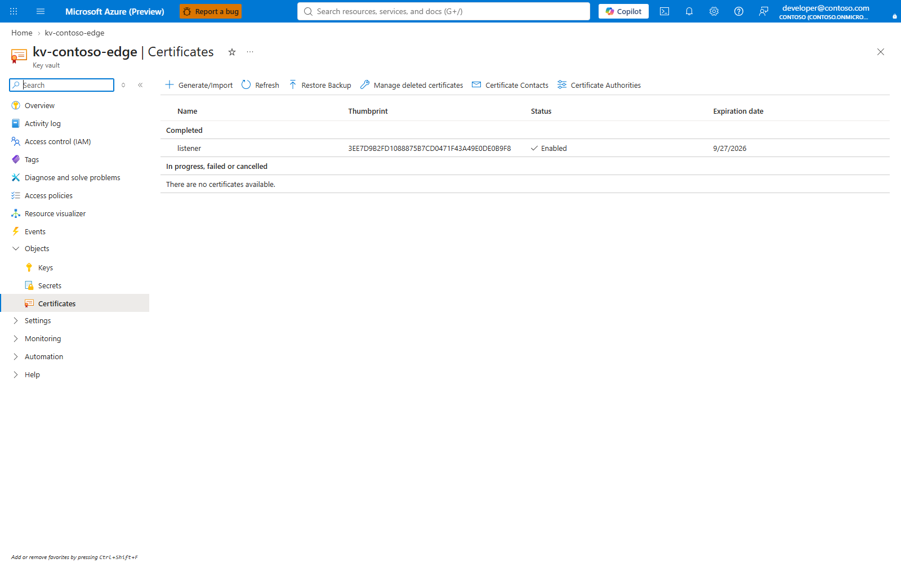

Capture id: `p54-vault-certificate`.

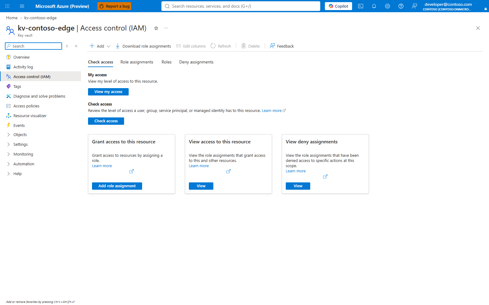

Capture id: `p54-vault-role`.

3. **Patch APIM hostname configurations and prove TLS before publishing the handover URL.** API Management services > `$APIM_NAME` > Deployment + infrastructure > Custom domains > Gateway > Add: Hostname `$HOSTNAME`; Certificate source **Key Vault**; Key Vault certificate secret `$CERT_SECRET_ID`; **Add** or **Save**. Pending capture id: `p90-company-custom-domains`.

**Change later.** Change the APIM Gateway custom-domain binding, Key Vault certificate and DNS record together; then rerun the TLS proof and update handover/client configuration if the URL changes.

## 10. Optional Cosmos projection

Run read-only preflight checks before any projection write.

```bash
az apim nv show -g "$GATEWAY_RG" --service-name "$APIM_NAME" --named-value-id entitlement-source --query value -o tsv
az apim show -g "$GATEWAY_RG" -n "$APIM_NAME" --query "{sku:sku.name,principal:identity.principalId,location:location}" -o json
az cognitiveservices account show -g "$FOUNDRY_RG" -n "$FOUNDRY_ACCOUNT" --query "{id:id,kind:kind}" -o json
az deployment group what-if -g "$GATEWAY_RG" --template-file infra/projection.bicep --parameters namePrefix="$NAME_PREFIX" location="$LOCATION" networkAccess=private-only -o json
```

Expected result: current entitlement source is visible, APIM has an identity, and what-if is reviewed. This mirrors `scripts/Deploy-ClaudeProjection.ps1`, `scripts/ClaudeProjectionChecks.ps1` and `docs/SCALE.md:515-527`.


Create the resolver app registration as a tenant-admin step.

```bash
export RESOLVER_APP_NAME="Claude entitlement resolver"
az ad app create --display-name "$RESOLVER_APP_NAME" --sign-in-audience AzureADMyOrg --query "{appId:appId,id:id,displayName:displayName}" -o json
az ad app show --id "<resolver-app-id>" --query "{appId:appId,identifierUris:identifierUris,appRoles:appRoles}" -o json
```

Expected result: a tenant admin owns the app-registration step and later grants any required Graph permissions. This mirrors the resolver boundary in `infra/resolver.bicep:41-51` and P84's tenant-admin separation.

Deploy private projection storage and networking.

```bash
# P89-PROJECTION-DEPLOY-BEGIN
export PROJECTION_NAME="projection-${NAME_PREFIX}"
export PROJECTION_NETWORK_NAME="projection-network-${NAME_PREFIX}"
az deployment group create -g "$GATEWAY_RG" -n "$PROJECTION_NAME" --template-file infra/projection.bicep --parameters namePrefix="$NAME_PREFIX" location="$LOCATION" networkAccess=private-only -o none
export COSMOS_ACCOUNT="$(az deployment group show -g "$GATEWAY_RG" -n "$PROJECTION_NAME" --query "properties.outputs.accountName.value" -o tsv)"
az deployment group create -g "$GATEWAY_RG" -n "$PROJECTION_NETWORK_NAME" --template-file infra/projection-network.bicep --parameters namePrefix="$NAME_PREFIX" location="$LOCATION" cosmosAccountName="$COSMOS_ACCOUNT" runnerEnabled=true -o none
az deployment group show -g "$GATEWAY_RG" -n "$PROJECTION_NAME" --query properties.outputs -o json
az deployment group show -g "$GATEWAY_RG" -n "$PROJECTION_NETWORK_NAME" --query properties.outputs -o json
# P89-PROJECTION-DEPLOY-END
```

Expected result: `projection.bicep` deploys first, then `projection-network.bicep` uses the Cosmos account output and creates private endpoints, DNS and the in-VNet runner. This mirrors `scripts/Deploy-ClaudeProjection.ps1:107-122`, `infra/projection.bicep:11-68` and `infra/projection-network.bicep:26-49`.

Deploy the resolver with Standard v2 outbound VNet integration and upload code.

```bash
# P89-RESOLVER-DEPLOY-BEGIN
export RESOLVER_APP_ID="<resolver-app-id>"
export GATEWAY_APP_ID="$(az ad sp show --id "$APIM_PRINCIPAL_ID" --query appId -o tsv)"
export NETWORK_OUTPUTS="$(az deployment group show -g "$GATEWAY_RG" -n "$PROJECTION_NETWORK_NAME" --query properties.outputs -o json)"
jq -n --arg namePrefix "$NAME_PREFIX" --arg location "$LOCATION" --arg cosmos "$COSMOS_ACCOUNT" --arg resolverAppId "$RESOLVER_APP_ID" --arg gatewayAppId "$GATEWAY_APP_ID" --arg gatewayObjectId "$APIM_PRINCIPAL_ID" --argjson network "$NETWORK_OUTPUTS" '{"$schema":"https://schema.management.azure.com/schemas/2019-04-01/deploymentParameters.json#","contentVersion":"1.0.0.0",parameters:{namePrefix:{value:$namePrefix},location:{value:$location},cosmosAccountName:{value:$cosmos},integrationSubnetId:{value:$network.resolverSubnetId.value},privateEndpointSubnetId:{value:$network.endpointsSubnetId.value},sitesDnsZoneId:{value:$network.sitesDnsZoneId.value},blobDnsZoneId:{value:$network.blobDnsZoneId.value},queueDnsZoneId:{value:$network.queueDnsZoneId.value},tableDnsZoneId:{value:$network.tableDnsZoneId.value},resolverAppId:{value:$resolverAppId},allowedCallerAppIds:{value:[$gatewayAppId]},allowedCallerObjectIds:{value:[$gatewayObjectId]},inboundAccess:{value:"private"}}}' > resolver-params.json
az deployment group create -g "$GATEWAY_RG" -n "projection-resolver-${NAME_PREFIX}" --template-file infra/resolver.bicep --parameters @resolver-params.json -o none
cd resolver && zip -r ../resolver.zip . && cd ..
export RESOLVER_SITE_NAME="$(az deployment group show -g "$GATEWAY_RG" -n "projection-resolver-${NAME_PREFIX}" --query "properties.outputs.siteName.value" -o tsv)"
az functionapp deployment source config-zip -g "$GATEWAY_RG" -n "$RESOLVER_SITE_NAME" --src resolver.zip -o none
az functionapp show -g "$GATEWAY_RG" -n "$RESOLVER_SITE_NAME" --query "{name:name,state:state,host:defaultHostName}" -o json
# P89-RESOLVER-DEPLOY-END
```

Expected result: the Function app is running with VNet integration and resolver code uploaded. `allowedCallerAppIds` is the gateway managed identity application id, and `allowedCallerObjectIds` is the gateway object id; otherwise the resolver refuses the gateway. This mirrors `scripts/Deploy-ClaudeProjection.ps1:130-168` and `infra/resolver.bicep:385-387`.

Set resolver named values without switching entitlement.

```bash
export RESOLVER_URL="https://func-${NAME_PREFIX}-resolver.azurewebsites.net/api"
export RESOLVER_AUDIENCE="api://${RESOLVER_APP_ID}"
az apim nv update -g "$GATEWAY_RG" --service-name "$APIM_NAME" --named-value-id entitlement-resolver-url --value "$RESOLVER_URL" -o none
az apim nv update -g "$GATEWAY_RG" --service-name "$APIM_NAME" --named-value-id entitlement-resolver-audience --value "$RESOLVER_AUDIENCE" -o none
az apim nv show -g "$GATEWAY_RG" --service-name "$APIM_NAME" --named-value-id entitlement-source --query value -o tsv
```

Expected result: resolver URL and audience are set, while `entitlement-source` remains `named-value`. This mirrors `docs/SCALE.md:670-675`.

Populate and compare the projection through an in-VNet runner container.

```bash
# P89-PROJECTION-RUNNER-BEGIN
p89_projection_runner() {
  export RUNNER_NAME="$(az deployment group show -g "$GATEWAY_RG" -n "$PROJECTION_NETWORK_NAME" --query "properties.outputs.runnerName.value" -o tsv)"
  export RUNNER_PRINCIPAL_ID="$(az deployment group show -g "$GATEWAY_RG" -n "$PROJECTION_NETWORK_NAME" --query "properties.outputs.runnerPrincipalId.value" -o tsv)"
  az cosmosdb sql role assignment create --account-name "$COSMOS_ACCOUNT" --resource-group "$GATEWAY_RG" --scope /dbs/claude/colls/entitlement --principal-id "$RUNNER_PRINCIPAL_ID" --role-definition-id 00000000-0000-0000-0000-000000000002 -o none || return 1
  ./scripts/Sync-ClaudeProjection.ps1 -Account "$COSMOS_ACCOUNT" -ApimName "$APIM_NAME" -ResourceGroup "$GATEWAY_RG" -StandardGroup "$STANDARD_GROUP" -PremiumGroup "$PREMIUM_GROUP" -ExportPath snapshot.json || return 1
  tar -c -z -f sync-source.tar.gz -C sync package.json src || return 1

  send_runner_file() {
    src="$1"
    dest="$2"
    tmp="${dest}.b64"
    dir="${dest%/*}"
    local_hash="$(sha256sum "$src" | awk '{print $1}')"
    b64="$(base64 < "$src" | tr '+/' '-_' | tr -d '=[:space:]')"
    if ! init_output="$(az container exec -g "$GATEWAY_RG" -n "$RUNNER_NAME" --exec-command "node -e require('fs').mkdirSync('$dir',{recursive:true});require('fs').writeFileSync('$tmp','')" 2>&1)"; then
      echo "Refused: runner could not initialize transfer for $dest. $init_output" >&2
      return 1
    fi
    if printf '%s' "$init_output" | grep -Eq 'ERROR|InvalidCommandLength|terminated with non-zero'; then
      echo "Refused: runner initialization reported an error for $dest. $init_output" >&2
      return 1
    fi
    while [ -n "$b64" ]; do
      chunk="${b64:0:4900}"
      b64="${b64:4900}"
      if ! chunk_output="$(az container exec -g "$GATEWAY_RG" -n "$RUNNER_NAME" --exec-command "node -e require('fs').appendFileSync('$tmp','$chunk')" 2>&1)"; then
        echo "Refused: runner transfer chunk failed for $dest. $chunk_output" >&2
        return 1
      fi
      if printf '%s' "$chunk_output" | grep -Eq 'ERROR|InvalidCommandLength|terminated with non-zero'; then
        echo "Refused: runner transfer chunk reported an error for $dest. $chunk_output" >&2
        return 1
      fi
    done
    if ! remote_output="$(az container exec -g "$GATEWAY_RG" -n "$RUNNER_NAME" --exec-command "node -e f=require('fs');c=require('crypto');f.writeFileSync('$dest',Buffer.from(f.readFileSync('$tmp','utf8'),'base64url'));f.unlinkSync('$tmp');console.log(c.createHash('sha256').update(f.readFileSync('$dest')).digest('hex'))" 2>&1)"; then
      echo "Refused: runner could not finalize transfer for $dest. $remote_output" >&2
      return 1
    fi
    if printf '%s' "$remote_output" | grep -Eq 'ERROR|InvalidCommandLength|terminated with non-zero'; then
      echo "Refused: runner finalization reported an error for $dest. $remote_output" >&2
      return 1
    fi
    remote_hash="$(printf '%s\n' "$remote_output" | tail -n 1 | tr -d '\r')"
    if [ "$remote_hash" != "$local_hash" ]; then
      echo "Refused: runner transfer hash mismatch for $dest. Local $local_hash, remote $remote_hash." >&2
      return 1
    fi
  }

  send_runner_file sync-source.tar.gz /work/sync-source.tar.gz || return 1
  send_runner_file snapshot.json /work/snapshot.json || return 1
  az container exec -g "$GATEWAY_RG" -n "$RUNNER_NAME" --exec-command "node -e require('fs').mkdirSync('/work/sync',{recursive:true})" || return 1
  az container exec -g "$GATEWAY_RG" -n "$RUNNER_NAME" --exec-command "tar -x -z -f /work/sync-source.tar.gz -C /work/sync" || return 1
  az container exec -g "$GATEWAY_RG" -n "$RUNNER_NAME" --exec-command "npm --prefix /work/sync install --omit=dev --no-audit --fund=false" || return 1
  az container exec -g "$GATEWAY_RG" -n "$RUNNER_NAME" --exec-command "node /work/sync/src/apply-projection.mjs --cosmos https://${COSMOS_ACCOUNT}.documents.azure.com:443/ --tenant ${TENANT_ID} --snapshot /work/snapshot.json" || return 1
  ./scripts/Compare-ClaudeEntitlement.ps1 -ResourceGroup "$GATEWAY_RG" -ApimName "$APIM_NAME" -StandardGroup "$STANDARD_GROUP" -PremiumGroup "$PREMIUM_GROUP" -ExportGatewayPath gateway-decisions.json -FailOnDrift || return 1
  send_runner_file gateway-decisions.json /work/gateway-decisions.json || return 1
  az container exec -g "$GATEWAY_RG" -n "$RUNNER_NAME" --exec-command "node /work/sync/src/apply-projection.mjs --cosmos https://${COSMOS_ACCOUNT}.documents.azure.com:443/ --tenant ${TENANT_ID} --compare /work/gateway-decisions.json"
}
p89_projection_runner
# P89-PROJECTION-RUNNER-END
```

Expected result: population and comparison run through the runner created by `projection-network.bicep`. `send_runner_file` mirrors `scripts/ClaudeRunner.ps1:113-148`: base64url chunks are appended through `az container exec` and decoded in the container. The snapshot and gateway-decision files are produced by the repository scripts because their Graph and named-value comparison logic is not an Azure CLI data-plane operation. This mirrors `scripts/Deploy-ClaudeProjection.ps1:199-221`, `scripts/Sync-ClaudeProjection.ps1`, `scripts/ClaudeRunner.ps1`, `docs/SCALE.md:681-726` and `infra/projection-network.bicep:46-49`.

Projection switch status.

```bash
az apim nv show -g "$GATEWAY_RG" --service-name "$APIM_NAME" --named-value-id entitlement-source --query value -o tsv
```

Expected result: the value stays `named-value`. P84 refuses automated switching. `docs/SCALE.md:744-760` states the reason: records lease for at most two hours, and without renewal every developer receives 503 after expiry. The legacy manual command can change `entitlement-source` to `projection`, but it is not P84-protected admission, creates no reconciler, and can cause that outage. P86, in progress on another branch, will add supported renewal and switch; this guide does not include P86's content.

### Part 10 in the portal

1. **Run read-only preflight checks before any projection write.** API Management services > `$APIM_NAME` > APIs > Named values: check `entitlement-source`; API Management Overview: check identity and SKU; Foundry account Overview: check kind. No Save button is used for read-only review.
2. **Create the resolver app registration as a tenant-admin step.** entra.microsoft.com > App registrations > New registration: Name `$RESOLVER_APP_NAME`; Supported account types **Accounts in this organizational directory only**; **Register**.
3. **Deploy private projection storage and networking.** portal.azure.com > Cosmos DB account > Networking: confirm public network access Disabled; Private access tab or private endpoint resource confirms private connectivity. The command deploys the resources; portal review is read-only after deployment.


Capture id: `docs-review-cosmos-networking`.

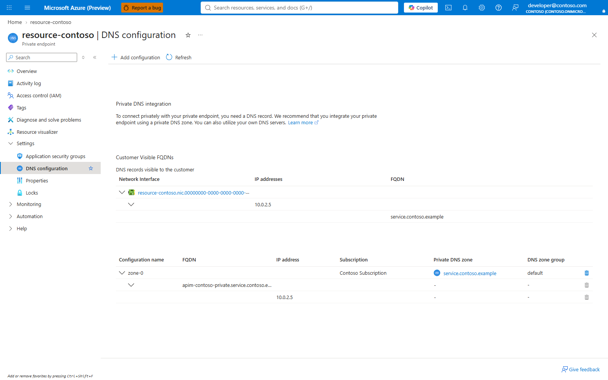

Capture id: `p54-private-endpoint`.

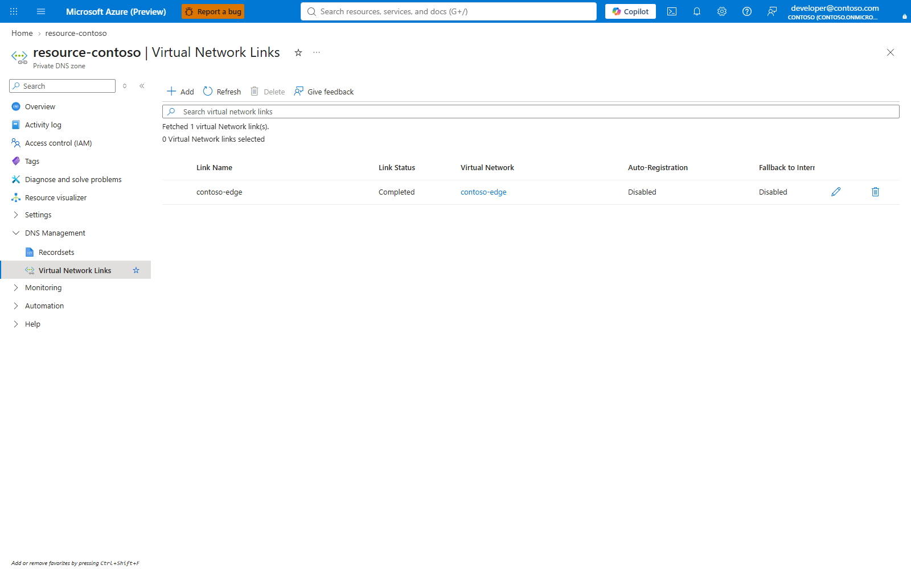

Capture id: `p54-private-dns`.

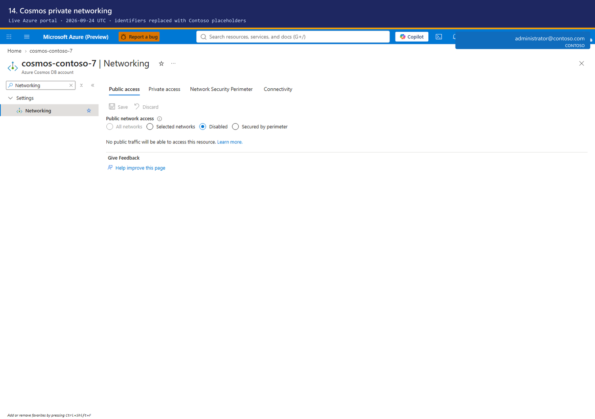

Capture id: `architecture-projection-networking`.

4. **Deploy the resolver with Standard v2 outbound VNet integration and upload code.** Function App > Networking: confirm inbound and outbound settings; Function App > Authentication: confirm Microsoft identity provider. The zip upload has no portal equivalent in this guide.


Capture id: `docs-review-resolver-authentication`.


Capture id: `docs-review-resolver-networking`.

5. **Set resolver named values without switching entitlement.** API Management services > `$APIM_NAME` > APIs > Named values: edit `entitlement-resolver-url` and `entitlement-resolver-audience`; Value: `$RESOLVER_URL` and `$RESOLVER_AUDIENCE`; **Save**. Keep `entitlement-source` as `named-value`.
6. **Populate and compare the projection through an in-VNet runner container.** No portal equivalent: the runner transfer, hash check, package install and compare are command-line computation steps.

**Change later.** Edit resolver URL and audience named values only after resolver verification; keep `entitlement-source` as `named-value` until the supported renewal and switch work is available.

## 11. Verification

Send a real request with the signed-in user's Foundry token through the gateway.

```bash
export GATEWAY_URL="$(az deployment group show -g "$GATEWAY_RG" -n "claude-gateway-basicv2" --query properties.outputs.gatewayUrl.value -o tsv)"
export FOUNDRY_TOKEN="$(az account get-access-token --resource https://ai.azure.com --query accessToken -o tsv)"
curl -sS -o response.json -w "%{http_code}\n" -H "Authorization: Bearer ${FOUNDRY_TOKEN}" -H "Content-Type: application/json" -d "{\"model\":\"${SONNET_DEPLOYMENT}\",\"max_tokens\":32,\"messages\":[{\"role\":\"user\",\"content\":\"Return the word ok.\"}]}" "${GATEWAY_URL}/v1/messages"
jq -r '.content[0].text // .error.message' response.json
```

Expected result: an entitled caller receives HTTP `200` and a model response. This mirrors `scripts/Test-ClaudeHealth.ps1`.

Verify a non-entitled caller is refused.

```bash
export NON_ENTITLED_TOKEN="<token-for-a-caller-not-in-allow-standard-or-allow-premium>"
curl -sS -o response-forbidden.json -w "%{http_code}\n" -H "Authorization: Bearer ${NON_ENTITLED_TOKEN}" -H "Content-Type: application/json" -d "{\"model\":\"${SONNET_DEPLOYMENT}\",\"max_tokens\":32,\"messages\":[{\"role\":\"user\",\"content\":\"Return the word ok.\"}]}" "${GATEWAY_URL}/v1/messages"
jq -r '.error.message' response-forbidden.json
```

Expected result: HTTP `403` with an entitlement refusal. Do not empty the live allow lists to make this test; use a caller that is not entitled. This mirrors `scripts/Test-ClaudeHealth.ps1` and `scripts/Sync-ClaudeAccess.ps1`.

Verify a model outside the tier is refused.

```bash
p89_verify_model_refusal() {
  MODELS_STANDARD_BEFORE="$(az apim nv show -g "$GATEWAY_RG" --service-name "$APIM_NAME" --named-value-id models-standard --query value -o tsv)"
  MODELS_STANDARD_NEXT=",${SONNET_DEPLOYMENT},"
  if [ "$(printf '%s' "$MODELS_STANDARD_NEXT" | wc -c | tr -d ' ')" -le 4096 ]; then
    az apim nv update -g "$GATEWAY_RG" --service-name "$APIM_NAME" --named-value-id models-standard --value "$MODELS_STANDARD_NEXT" -o none || return 1
  else
    echo "Refused: models-standard would exceed 4,096 characters. Nothing was written." >&2
    return 1
  fi
  curl -sS -o response-model.json -w "%{http_code}\n" -H "Authorization: ******" -H "Content-Type: application/json" -d "{\"model\":\"${OPUS_DEPLOYMENT}\",\"max_tokens\":32,\"messages\":[{\"role\":\"user\",\"content\":\"Return the word ok.\"}]}" "${GATEWAY_URL}/v1/messages"
  jq -r '.error.message' response-model.json
  az apim nv update -g "$GATEWAY_RG" --service-name "$APIM_NAME" --named-value-id models-standard --value "$MODELS_STANDARD_BEFORE" -o none
}
p89_verify_model_refusal
```

Expected result: HTTP `403` or gateway refusal naming the model outside the tier. This mirrors `scripts/Test-ClaudeHealth.ps1` and `scripts/Measure-ClaudeCeiling.ps1`.

Check for direct Foundry bypass.

```bash
az role assignment list --scope "$FOUNDRY_ID" --include-inherited --query "[?roleDefinitionName=='Cognitive Services User'].{principal:principalName,principalType:principalType,scope:scope}" -o table
az role assignment list --scope "$FOUNDRY_ID" --include-inherited --query "[?roleDefinitionName=='Cognitive Services User' && principalId!='${APIM_PRINCIPAL_ID}'].{principal:principalName,principalId:principalId}" -o table
```

Expected result: the gateway identity has the role; developers do not hold direct `Cognitive Services User` unless there is an explicitly approved bypass. This mirrors `scripts/Get-ClaudeBypass.ps1`.

Measure the per-minute call ceiling.

```bash
az apim nv show -g "$GATEWAY_RG" --service-name "$APIM_NAME" --named-value-id calls-per-minute --query value -o tsv
for i in $(seq 1 5); do curl -sS -o /dev/null -w "%{http_code}\n" -H "Authorization: Bearer ${FOUNDRY_TOKEN}" -H "Content-Type: application/json" -d "{\"model\":\"${SONNET_DEPLOYMENT}\",\"max_tokens\":1,\"messages\":[{\"role\":\"user\",\"content\":\"ok\"}]}" "${GATEWAY_URL}/v1/messages"; done
```

Expected result: normal traffic returns `200`; a deliberate high-rate test eventually returns the gateway's rate-limit status. This mirrors `scripts/Measure-ClaudeCeiling.ps1`.

### Part 11 in the portal

1. **Resolve the gateway URL and run an entitled request.** API Management services > `$APIM_NAME` > Overview: copy Gateway URL; no Save button is used.
2. **Verify non-entitled, model-refusal, bypass-audit and call-ceiling behavior.** No portal equivalent: these are data-plane request and policy-result checks.
3. **Review gateway diagnostic settings and Log Analytics tables.** API Management services > `$APIM_NAME` > Monitoring > Diagnostic settings: confirm `claude-llm-logs`; Log Analytics workspace > Tables/Logs/Workbooks: confirm emitted tables, functions and workbook surfaces.


Capture id: `docs-review-gateway-diagnostics`.

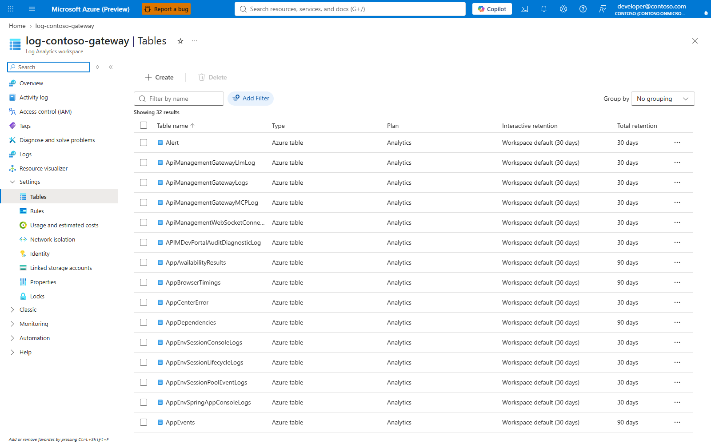

Capture id: `docs-review-workspace-tables`.

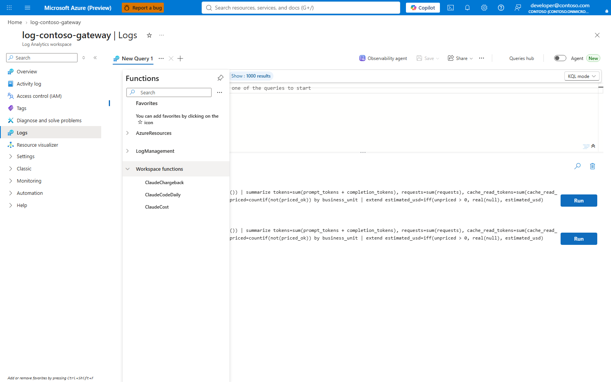

Capture id: `docs-review-workspace-functions`.

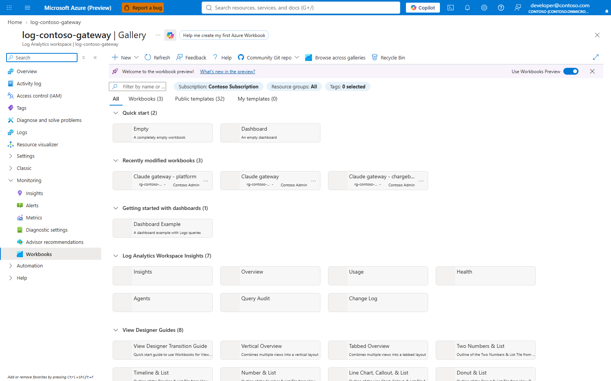

Capture id: `docs-review-workspace-workbooks`.

**Change later.** Change the named values, groups or role assignments that drive the failed verification, then rerun the specific §11 command and check diagnostic settings if log routing is part of the change.

## 12. Teardown

Read resources before deletion.

```bash
az resource list -g "$GATEWAY_RG" --query "[].{type:type,name:name}" -o table
az role assignment list --scope "$FOUNDRY_ID" --assignee "$APIM_PRINCIPAL_ID" --query "[].{id:id,role:roleDefinitionName}" -o table
```

Expected result: the operator sees the exact resources and role assignments that will be removed. This mirrors the installer's explicit review style before writes.

Delete the gateway resource group when the deployment was isolated to it.

```bash
az group delete -n "$GATEWAY_RG" --yes --no-wait
az group exists -n "$GATEWAY_RG"
```

Expected result: the group deletion starts; `az group exists` eventually returns `false`. Do not use this command if the group contains shared resources. This mirrors the resource-group boundary created by `deploy.ps1:134`.

Remove only external resources this guide recorded as created.

```bash
# P89-TEARDOWN-EXTERNAL-BEGIN
p89_teardown_external() {
  delete_created_role() {
    receipt=".p89-receipts/foundry-role.json"
    if [ ! -r "$receipt" ]; then
      echo "Refused: No receipt: this guide did not record creating the Foundry role assignment; nothing deleted." >&2
      return 1
    fi
    if jq -e '.foundryRole.created == true and (.foundryRole.id | type == "string" and length > 0)' "$receipt" >/dev/null; then
      az role assignment delete --ids "$(jq -r '.foundryRole.id' "$receipt")"
    else
      echo "Foundry role assignment was pre-existing; not deleting it."
    fi
  }

  delete_created_group() {
    tier="$1"
    receipt=".p89-receipts/group-${tier}.json"
    if [ ! -r "$receipt" ]; then
      echo "Refused: No receipt: this guide did not record creating group ${tier}; nothing deleted." >&2
      return 1
    fi
    if jq -e '.group.created == true and (.group.id | type == "string" and length > 0)' "$receipt" >/dev/null; then
      az ad group delete --group "$(jq -r '.group.id' "$receipt")"
    else
      echo "Group ${tier} was pre-existing; not deleting it."
    fi
  }

  delete_created_app() {
    receipt=".p89-receipts/desktop-app.json"
    if [ ! -r "$receipt" ]; then
      echo "No Desktop app receipt; nothing deleted for it."
      return 0
    fi
    if jq -e '.app.created == true and (.app.appId | type == "string" and length > 0)' "$receipt" >/dev/null; then
      az ad app delete --id "$(jq -r '.app.appId' "$receipt")"
    else
      echo "Desktop app registration was pre-existing; not deleting it."
    fi
  }

  for required in .p89-receipts/foundry-role.json .p89-receipts/group-standard.json .p89-receipts/group-premium.json; do
    if [ ! -r "$required" ]; then
      echo "Refused: No receipt: $required is missing or unreadable; nothing deleted." >&2
      return 1
    fi
  done
  delete_created_role || return 1
  delete_created_group standard || return 1
  delete_created_group premium || return 1
  delete_created_app || return 1
  az role assignment list --scope "$FOUNDRY_ID" --assignee "$APIM_PRINCIPAL_ID" --query "[?roleDefinitionName=='Cognitive Services User'].id" -o tsv
}
p89_teardown_external
# P89-TEARDOWN-EXTERNAL-END
```

Expected result: only role assignments, tier groups and Desktop app registrations recorded with `created:true` are deleted. Missing role or group receipts refuse and delete nothing; the Desktop app receipt is optional, because §7 can be skipped, and a missing app receipt prints "No Desktop app receipt; nothing deleted for it." Pre-existing directory objects survive. This mirrors the Foundry role assignment in `infra/foundry-role.bicep`, `deploy.ps1:182-187` and `scripts/New-ClaudeDesktopEntraApp.ps1:29-39`.

### Part 12 in the portal

1. **Delete the gateway resource group after external receipts are reviewed.** portal.azure.com > Resource groups > `$GATEWAY_RG` > Delete resource group: type `$GATEWAY_RG`; **Delete**. Source: https://learn.microsoft.com/azure/api-management/get-started-create-service-instance.
2. **Review soft-deleted APIM instances before name reuse.** No portal label is asserted here. The Learn soft-delete page documents REST API, Azure CLI and SDK support for deleted services, including `az apim deletedservice show/list/purge`, but not an Azure portal blade label. Source: https://learn.microsoft.com/azure/api-management/soft-delete.
3. **Delete receipt-created external objects.** entra.microsoft.com > Groups: select a group created by the receipt; **Delete**. entra.microsoft.com > App registrations: select the Desktop app created by the receipt; **Delete**. Foundry account > Access control (IAM) > Role assignments: select the receipt-created Cognitive Services User assignment; **Remove**.

**Change later.** Teardown is destructive; restore by redeploying or recreating only the owned resource and do not rerun receipt deletes against objects that were pre-existing or already removed.

## Pending portal captures

The staged P90 spec is `guide/captures-pending/p90.json`. It stays outside `guide/captures/` because the output below does not exist yet and would fail loaded capture/documentation checks. The Desktop app rows reuse the existing staged P60 spec from `guide/captures/p60.json`; their outputs are pending and are referenced in `DEVELOPER.md:654-660`.

| planned capture id | output path under `docs/guide/` | spec file | blade | which step it illustrates | what must exist live | capture discovery kind |
|---|---|---|---|---|---|---|
| `p90-company-custom-domains` | `p90-company-custom-domains.png` | `guide/captures-pending/p90.json` | portal.azure.com > API Management > gateway > Custom domains | §9 company address binding | A gateway and, for a final capture, a certificate/DNS-ready hostname | `gateway` |
| `p60-desktop-app-overview` | `p60-desktop-app-overview.png` | `guide/captures/p60.json` | entra.microsoft.com > App registrations > Desktop app > Overview | §7 Desktop app id discovery | A Desktop app registration | `entra-app` |
| `p60-desktop-app-authentication` | `p60-desktop-app-authentication.png` | `guide/captures/p60.json` | entra.microsoft.com > App registrations > Desktop app > Authentication | §7 public-client redirect URIs | A Desktop app registration with redirect URIs | `entra-app` |
| `p60-desktop-app-api-permissions` | `p60-desktop-app-api-permissions.png` | `guide/captures/p60.json` | entra.microsoft.com > App registrations > Desktop app > API permissions | §7 delegated permission review | A Desktop app registration | `entra-app` |
| `p60-gateway-desktop-audience` | `p60-gateway-desktop-audience.png` | `guide/captures/p60.json` | portal.azure.com > API Management > gateway > Named values | §7 Desktop audience named value | A gateway with `external-idp-extra-audience` | `gateway` |

Tooling gaps: the current capture schema cannot express a pre-resource create wizard such as Create a resource > API Management > Basics, because every step needs a discovered target. It also cannot express tenant-wide Entra creation entry points without an existing app or group target. `p90-resource-group-delete` was removed from `guide/captures-pending/p90.json` because `guide/lib/portal-discovery.mjs:50-52` discovers generic resources with `az resource list --resource-type <type>`, and Azure CLI resource listing returns resources rather than resource groups. The APIM soft-delete article documents REST, Azure CLI and SDK support for deleted services, but this round did not verify an Azure portal blade label for deleted services.
