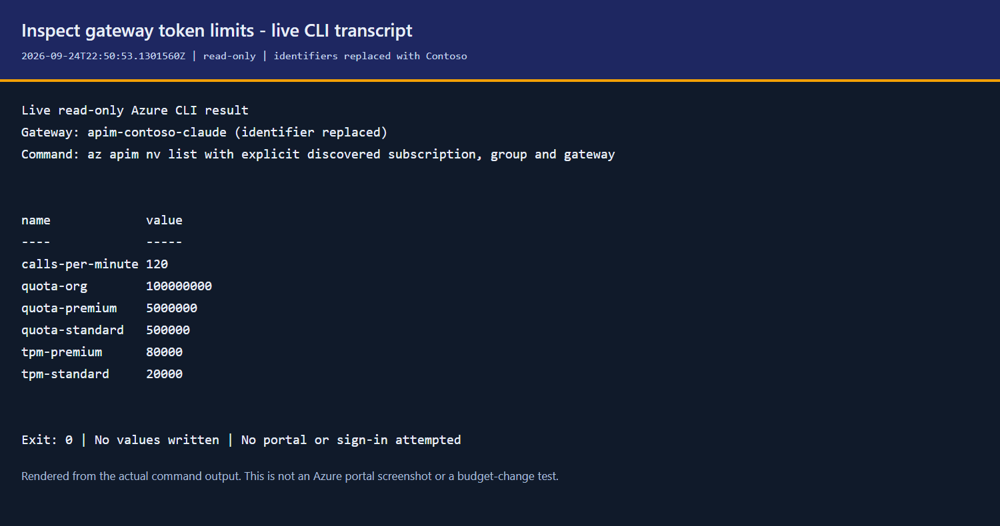

# Configure token and USD budgets, and model access

For gateway administrators. This is the operating reference formerly in
[README: Tuning budgets](../README.md#tuning-budgets). For business-unit dollar
budgets, start with [Business units](BUSINESS-UNITS.md); for monthly reporting,
use [FinOps](FINOPS.md). A token allowance is not an invoice cap.

## Dollar budgets: what is enforced

The dollar-input scripts now preserve the approved **USD amount and price-book
date**, as well as their existing approximate token quota. An optional reconciler
prices observed input, output, cache reads and known 5-minute/1-hour cache writes
separately with Decimal, then publishes a gateway decision.

| Control | Exact about | Delay / limitation |
|---|---|---|
| Existing token limiter | Its configured token allowance | Distributed estimates; does not count cache; retained as the realtime guard |
| Reconciled USD stop | Decimal arithmetic on the observed categories at the pinned tariff | Ledger ingestion + up to 5 minutes between timer runs + execution + APIM propagation |
| Nonstream JSON usage | All five categories when the provider reports their counts/TTL split | Delayed until the trace and LLM log join |
| Streaming usage | Known prompt/output and available cached-token metric subtotal | Cache creation/TTL remains unknown; custom metrics can lose high-cardinality series; not a complete exact streaming ceiling |
| Azure invoice | Not claimed | U2 remains open; CCU billing, negotiated rates, geography and tariffs absent from the book can differ |

A known subtotal reaching a budget is sufficient to stop. A subtotal below it
does **not** prove that full streaming spend is below budget. `exact: true`
means complete categorized arithmetic for observed rows, not complete ingestion
or invoice reconciliation. Null/unpriced is never $0.

### Enable and operate it

1. Upgrade the gateway template/policy first; the installer preserves both
   `usd-budgets` and `usd-budget-state`. New installations leave them disabled.
   The updated policy reads only nonstream JSON usage, never an SSE body.
2. Publish the current ledger to the gateway's selected workspace:

   ```powershell
   .\scripts\Publish-ClaudeQueries.ps1 -ResourceGroup $rg -ApimName $apim `
       -WorkspaceName '<gateway-linked-workspace>' -Query ClaudeChargeback
   ```

3. Deploy/update the optional [AUM service](AUM-SERVICE.md). Its existing
   managed identity, storage lease and audit run `reconcile_usd_budgets` every
   five minutes. It needs no Foundry data-plane permission: only gateway named
   values and workspace reads, with its existing storage data roles.
   This reuses the service's timer/job pattern rather than deploying a second
   always-on process. Without that service, arrange an approved managed-identity
   scheduler for the on-demand command; no separate Direct scheduler is
   provisioned automatically by the budget setter.
4. Approve the budget and select the tariff. On first use the scripts read
   `config/price-book.json`, or the shipped example if absent, and print the
   source. `-PriceBookPath` chooses a different file. Existing dollar budgets
   keep their stored tariff; changing local prices does not silently reprice them.

   ```powershell
   .\scripts\Set-ClaudeBusinessUnit.ps1 -Id finance -MonthlyBudgetUsd 25 `
       -ResourceGroup $rg -ApimName $apim
   .\scripts\Set-ClaudeBudget.ps1 -User '<approved-person-object-id>' -DailyUsd 2 `
       -ResourceGroup $rg -ApimName $apim
   ```

5. Reconcile now, or wait for the timer. Direct invocation uses Azure CLI
   sign-in and ETags; the service adds its lease/audit. Both refuse Turnstile
   authority before doing governance writes.

   ```powershell
   python -m venv .venv-aum-service
   .\.venv-aum-service\Scripts\python -m pip install -r service\aum\requirements.txt
   .\scripts\Sync-ClaudeUsdBudgets.ps1 -ResourceGroup $rg -ApimName $apim `
       -WorkspaceId '<workspace-customer-id>'
   ```

   Omit an unknown gateway/workspace to use `ClaudeChoice.ps1`; it shows the
   source of each candidate, not an assumed first match. Workspace ID is on
   the linked Log Analytics workspace's Overview page. The budget amount
   comes from its authorized owner, never from a remaining-quota estimate.

The service's additive USD endpoints, scoped permissions and exact fields are
in the [client contract](aum-usd-budgets-client-contract.md). The terminal
client is a separate integration: do not assume an existing token-budget
screen, request or boost now edits USD.

### Refusals, modes and recovery

- **Strict:** 403 `usd_budget_exceeded` at or above the nominal amount.
- **Allowance:** stop only above nominal plus the configured allowance; the
  parent and other controls still apply.
- **Notify:** this scope never blocks for USD, including when its snapshot
  is missing/expired; `x-claude-usd-budget-notice` is advisory. Other enforced
  scopes and the existing token guards can still refuse.
- **Unpriced:** enforced scopes return 403 `usd_budget_unpriced`, with the
  unpriced models/attribution problem. Repair the tariff/telemetry, then reconcile.
- **Stale:** missing, expired or mismatched state returns 503
  `usd_budget_state_stale` for enforced scopes. Snapshots expire after 15 minutes.
  A telemetry outage preserves the last decision until expiry; it never refreshes
  an old allow as if usage were zero.

The USD 403 names scope, nominal/effective budget, observed spend and
`reconciled_at` in UTC. Raise the approved dollar budget and reconcile to lift
it; UTC month/day rollover similarly needs a new snapshot. A definition save
can temporarily produce 503 while awaiting reconciliation. It does not reset
spent tokens, and an independent token ceiling may still refuse.

`-Clear` on a person removes both overrides; token-only edits retain a USD
control rather than silently deleting it. Removing a business unit clears its
USD entry. Clear affected USD allocations explicitly through the API before
reparenting a unit/team or removing a parent with budgeted teams.

Both named values retain the 4,096-character bound. State uses a compact
internal representation, with a lossless expanded API response; a fixture of
20 unit decisions fits. Capacity depends on identifiers, prices and errors,
not a promised fixed number of people. Overflow refuses the whole update;
projection-backed USD storage is not implemented by this packet.

### Measured delay and arithmetic, isolated Basic v2

On 2026-09-25, a $0.02 test unit accumulated:

```text
65 input         * $2/M   = $0.0001300
264 output       * $10/M  = $0.0026400
12,492 cache read * $0.2/M = $0.0024984
12,492 5m write   * $2.5/M = $0.0312300
0 1h write       * $4/M   = $0.0000000
                              ---------
Observed total                 $0.0364984
```

The crossing response completed at 12:37:16.802Z. Both cache requests were
visible with complete category fields at 12:39:43.112Z; the next call after
reconciliation returned the distinct 403 at 12:40:12.717Z: **175.9 seconds**
from crossing completion. Raising the budget to $0.50 and reconciling served
200 at 12:52:31.208Z. This was an on-demand run, not a measured timer SLA.

For a periodic job, the operational envelope is
`ingestion latency + [0,300s] schedule wait + execution + propagation`, plus
already-running requests. The measured two-request ingestion/visibility
lag was 146.3 seconds from crossing completion; adding a full timer interval
to this on-demand sample gives about **475.9 seconds**, not a guaranteed maximum.
Microsoft documents resource logs as *usually* 3-10 minutes
([source](https://learn.microsoft.com/azure/azure-monitor/logs/data-ingestion-time)).
Without a guaranteed maximum latency and spend rate there is no finite hard
dollar overshoot guarantee. A reservation system would be a different design.

The proof used only an isolated gateway and separate research/proof telemetry;
no reference-gateway policy, named value or authority was changed.
[ADR-0026](adr/0026-usd-budget-reconciliation.md) explains why response-weighted
APIM counters do not solve complete streaming accounting.

## Prerequisites

- A deployed gateway on a v2 tier, and a completed [bypass audit](SETUP.md#42-close-the-bypass).
- API Management Service Contributor on the gateway to change named values;
  Reader to inspect them. Reporting also needs access to the telemetry workspace.
- Azure CLI signed in to the correct subscription; PowerShell 5.1 or 7.
  Run commands at the repository root.
- Resolve `$rg`, `$apim` and the telemetry resources with the
  [operations target checklist](OPERATIONS.md#1-select-the-gateway-and-workspace).
- Check who owns governance first. When Turnstile is the authority, change its
  catalog and budgets there; the dollar writers and reconciler refuse a second authority.
  See [Manage everything in Turnstile](TURNSTILE.md#manage-everything-in-turnstile).

### Find the values for the commands

| Value | Portal source | CLI/read equivalent |
|---|---|---|
| `$rg` / `$apim` | Selected gateway > Overview > Essentials | `az apim list --query "[].{name:name,rg:resourceGroup}" -o table`; reuse the intended installer-recorded target |
| `-User` | Entra ID > Users > selected person > Overview; use their verified UPN or Object ID | `az ad user show --id <upn> --query "{upn:userPrincipalName,id:id}" -o table` |
| `-Tier` | The effective tier from the published entitlement, not the person's business-unit name | `scripts/Get-ClaudeBudget.ps1` with the explicit gateway target |
| Quota / rate / dollar amount | Approved allocation from the responsible budget owner | Inspect current values first with `scripts/Set-ClaudeTier.ps1 -List`; a report's remaining balance is not an approved new limit |
| `-Models` / gateway URL | Foundry deployment names and APIM Overview > Gateway URL | [Model discovery](MODELS.md#find-the-target-and-model-values) and `az apim show -g <gateway-rg> -n <apim> --query gatewayUrl -o tsv` |

The Contoso person and numeric budgets in examples are illustrative inputs,
not discovered policy or deployment defaults. Replace them only after selecting
the real target and approving the change. The live
[gateway Overview](OPERATIONS.md#1-select-the-gateway-and-workspace) shows where
the gateway values come from; its Online status does not prove a budget edit.

## Reference: shipped defaults

Named values are configuration the policy consumes, not consumed-quota storage.
Defaults below come from [main.bicep](../infra/main.bicep); an existing deployment
may have different values.

| Named value | Default | Meaning |
|---|---:|---|
| `tpm-standard` | 20,000 | Standard tokens per minute |
| `quota-standard` | 500,000 | Standard tokens per day |
| `tpm-premium` | 80,000 | Premium tokens per minute |
| `quota-premium` | 5,000,000 | Premium tokens per day |
| `quota-org` | 100,000,000 | Shared tokens per UTC calendar month |
| `quota-overrides` | empty | Per-person daily overrides, `,oid=tokens,` |
| `models-standard` | empty (all) | Standard model allowlist |
| `models-premium` | empty (all) | Premium model allowlist |
| `calls-per-minute` | 120 | Requests per minute per developer |

## 1. Read the effective limits

```powershell
./scripts/Set-ClaudeTier.ps1 -ResourceGroup $rg -ApimName $apim -List
./scripts/Get-ClaudeBudget.ps1 -ResourceGroup $rg -ApimName $apim
```

**Azure CLI read equivalent**, using the selected subscription and gateway:

```powershell
az apim nv list --subscription '<selected-subscription-id>' -g $rg --service-name $apim -o json |
    ConvertFrom-Json |
    Where-Object { $_.name -match '^(tpm|quota)-(standard|premium)$|^quota-org$|^calls-per-minute$' } |
    Select-Object name, value
```

This transcript was rendered from a live read on 2026-09-24 UTC, with identifiers
replaced. It is not a portal screenshot, a recommended allocation or proof of a
budget change. No values or shared CLI subscription settings were changed.



**Portal:** API Management > your gateway > APIs > Named values. Read the values
above, then find the person's object ID in Entra ID > Users > Overview. An
entry in `quota-overrides` replaces their tier's daily quota. Month-to-date
metrics in `Get-ClaudeBudget.ps1` are not the chargeback ledger or dollars.

**Pending batch capture (`docs-review-named-values`).**

Planned image: `docs/guide/docs-review-named-values.png` — tier limits and
quota settings in the Named values list.

## 2. Change a tier or the organisation ceiling

```powershell
./scripts/Set-ClaudeTier.ps1 -ResourceGroup $rg -ApimName $apim `
    -Tier standard -TokensPerMinute 40000 -DailyQuota 750000
az apim nv update -g $rg --service-name $apim --named-value-id quota-org --value 200000000
```

**Portal:** Named values > select `tpm-standard`, `quota-standard` or `quota-org`
> Edit > Value > Save. Save the original values before editing.

In the editor, verify **Name** / **Display name** identifies the intended
setting, retain its existing non-secret type, change only **Value** to the
approved whole-token amount and save. Inspecting the editor does not apply a
change; read the value back and test the caller after propagation.

**Pending batch capture (`docs-review-daily-quota-editor`).**

Planned image: `docs/guide/docs-review-daily-quota-editor.png` — the standard
daily-quota editor and its Value field.

No redeployment is needed. Wait for configuration propagation and verify a
request; a successful ARM write is not proof the running policy has changed.
Raising a quota does not erase consumption. It can admit requests again if the
new quota exceeds the amount consumed; changing tier is not a quota reset.

`quota-org` is checked before personal and unit budgets. A developer can have
personal headroom while the organisation is refused. The default is roughly
twenty premium daily allowances, not a rollout sizing recommendation. Check the
sum of top-level unit allocations and expected daily burn before expanding.

## 3. Override one person's daily allowance

```powershell
./scripts/Set-ClaudeBudget.ps1 -ResourceGroup $rg -ApimName $apim -User alice@contoso.com -Tokens 2000000
./scripts/Get-ClaudeBudget.ps1 -ResourceGroup $rg -ApimName $apim -User alice@contoso.com -AsJson
# To return to the tier default:
./scripts/Set-ClaudeBudget.ps1 -ResourceGroup $rg -ApimName $apim -User alice@contoso.com -Clear
./scripts/Set-ClaudeBudget.ps1 -ResourceGroup $rg -ApimName $apim -List
```

**Portal:** Entra ID > Users > Alice > Overview > Object ID; then APIM >
Named values > `quota-overrides`. Add or remove only that `oid=tokens` entry,
preserving surrounding commas and every other person's entry. The script is
safer than hand-editing this shared value.

An override changes the daily quota only. The minute rate remains the tier
value: `llm-token-limit` does not accept a per-person expression for
`tokens-per-minute`. For dollar input use `-DailyUsd` instead of `-Tokens`;
`-Model` and `-OutputShare` determine its estimated token conversion.

## 4. Restrict models

```powershell
./scripts/Set-ClaudeTier.ps1 -ResourceGroup $rg -ApimName $apim -Tier standard -Models claude-sonnet-5
```

**Portal:** Check the deployment name in Foundry > Models + endpoints first.
In APIM > Named values > `models-standard`, set `,claude-sonnet-5,`.
Sentinel commas make matching exact; a name does not allow another name with
the same prefix. An empty list allows every deployed model, not none.

The gateway enforces the list before forwarding, independent of the client.
For deployment, pricing and selectable-client models, follow [Models](MODELS.md).
Client settings, hooks, tabs and connectors are management controls, not a
security boundary ([ADR-0004](adr/0004-policy-out-of-band.md)).
Generate their profile with `scripts/New-ClaudeCodePolicy.ps1 -Tier standard`
or `-Tier premium`; deploy it using [Migration: MDM](MIGRATION.md#2-mass-deployment-through-mdm).
The manual equivalent is the registry, managed preferences or settings file in
that guide; there is no Azure portal switch for a local client setting.

## 5. Verify and troubleshoot

Have the affected developer make a fresh request. Successful responses can carry
`x-org-quota-remaining` and `x-quota-remaining-today`. Inspect a refusal's body:

```json
{
  "type": "error",
  "error": {
    "type": "rate_limit_error",
    "budget": "organisation",
    "message": "The organisation's Claude budget for this period is spent."
  }
}
```

`budget` distinguishes `organisation` from `personal`; unit/team refusals name
the exhausted unit. A rate refusal is `429` with `Retry-After`, not a daily
quota reset. Use [Governance checks](GOVERNANCE-CHECKS.md) for an isolated test;
its throttle test changes live limits, so agree a test window first.

**Portal verification:** APIM > Named values confirms configuration. The
developer request proves enforcement; the portal alone cannot prove a
particular person's access or restore APIM's volatile consumed counters.

### Limits of the guarantee

All these token ceilings are **soft caps**. Concurrent requests can exceed them;
the [policy reference](https://learn.microsoft.com/azure/api-management/llm-token-limit-policy)
also states usage is tracked independently at each gateway. Counters are not a
global, cross-region financial ledger. Classic Premium multi-region is not a
supported solution here: Anthropic token parsing requires v2.

Cache tokens are outside the quota scalar. Price categories separately, do not
multiply `Total Tokens` by a single rate, and do not promise a hard dollar cap.
Counter behaviour at 500,000 identities is measured, not exact: [Scale](SCALE.md)
and [U9/U13](UNKNOWNS.md) describe the remaining limits.

## Business-unit and team enforcement modes

The platform owner can select a mode for a unit or team independently of its
base allocation. This does not change who is authorised to manage it.

| Mode | Behavior at that scope |
|---|---|
| Strict (missing map entry) | Apply the base monthly token quota |
| Allowance | Apply the base plus an integer percentage from 1 to 100; fractional extra tokens are rounded down |
| Notify | Skip that scope's limiter; parent, organisation and personal controls still apply |

A zero base quota remains no budget at that scope. These are still soft token
controls, not precise currency caps. `bu-modes` stores exceptions separately from
`bu-registry`; the installer preserves it on redeploy.

When the gateway owns governance, first obtain the actual unit identifier from
`Set-ClaudeBusinessUnit.ps1 -List`, then use an approved change:

```powershell
./scripts/Set-ClaudeBusinessUnit.ps1 -ResourceGroup $rg -ApimName $apim `
    -Id '<unit-id>' -Mode Allowance -AllowancePercent 10
```

The percentage is an illustrative input, not a recommendation. Omit `-Mode` to
preserve the existing mode when editing another property. When Turnstile owns
governance, use its owner-only Gateway governance controls instead; the apply
job writes `bu-modes` and will overwrite a competing gateway-authored change.

**Portal/manual:** APIM > APIs > Named values > `bu-modes` > Edit > Value.
For the example, preserve all other entries and add `<unit-id>=allowance:10`
inside the sentinel-comma map. `,,` means no exceptions, therefore strict.
Do not reset the whole map to change one unit. For a policy-only upgrade, create
the named value only if absent before applying a policy that references it.

**Azure CLI equivalent:** read the complete map first, make the same reviewed
single-unit edit locally, then write and read back the full preserved map:

```powershell
az apim nv show -g $rg --service-name $apim --named-value-id bu-modes --query value -o tsv
az apim nv update -g $rg --service-name $apim --named-value-id bu-modes --value '<reviewed-complete-sentinel-map>'
az apim nv show -g $rg --service-name $apim --named-value-id bu-modes --query value -o tsv
```

This raw edit bypasses the script's mode validation. A read followed by a write
is not a transaction: coordinate the governance authority and other writers,
and do not use it to race a Turnstile apply.

**Verify:** `Set-ClaudeBusinessUnit.ps1 -List` reports the stored mode. Test an
approved identity's request after apply/propagation and inspect the body and
`x-claude-budget-notice`. The allowance notice uses estimated remaining quota;
notify reports usage even before the base is spent, and clients need not display
the custom header. Neither notice is an exact budget-crossing measurement.
Notify stops counting at that scope; returning to strict/allowance mid-month
does not reconstruct that interval in APIM's counter. The ledger still reports
usage. The [owner's dated live checks](BUSINESS-UNITS.md#measured-on-the-reference-gateway)
and [ADR-0019](adr/0019-budget-enforcement-modes.md) state the tested envelope.

## Next steps

- [FinOps monthly close](FINOPS.md) — prices, attribution and reconciliation.
- [Business units](BUSINESS-UNITS.md) — units, teams and monthly allocations.
- [Operations](OPERATIONS.md) — backup, change control and retirement.
