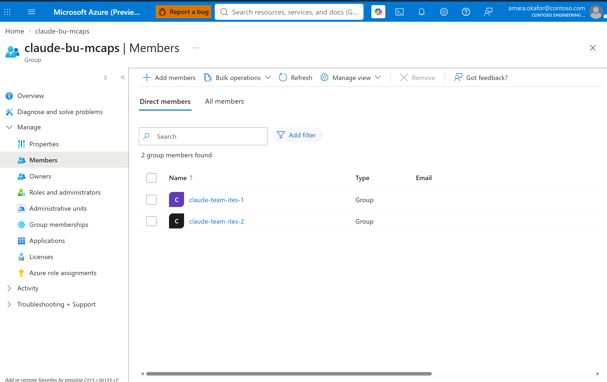
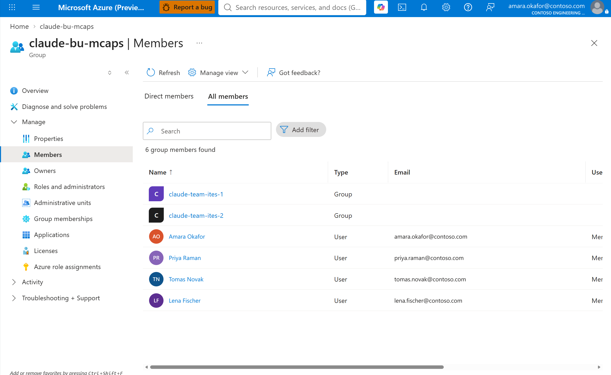
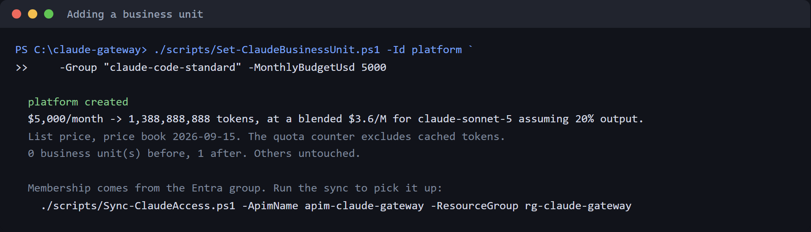
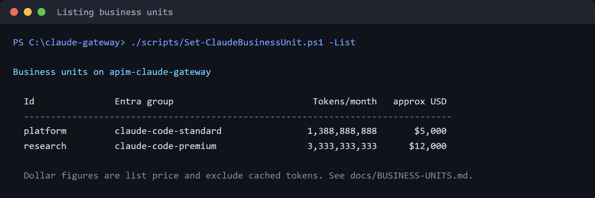
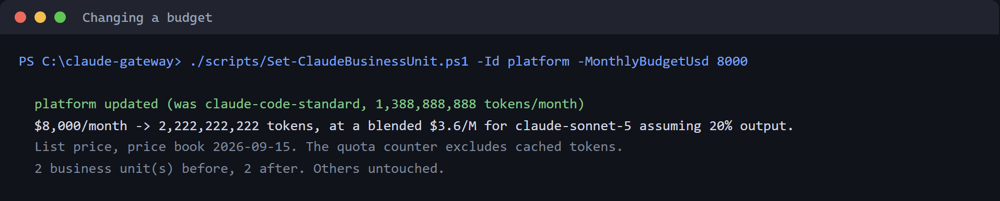
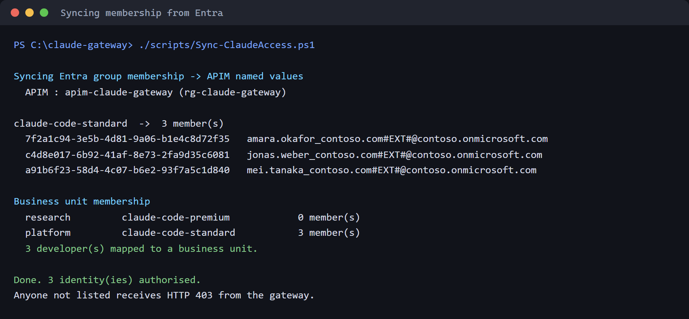
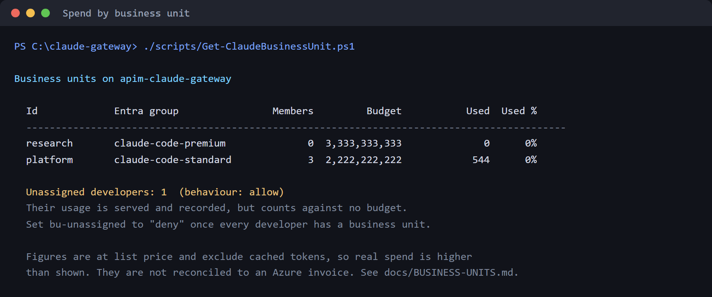
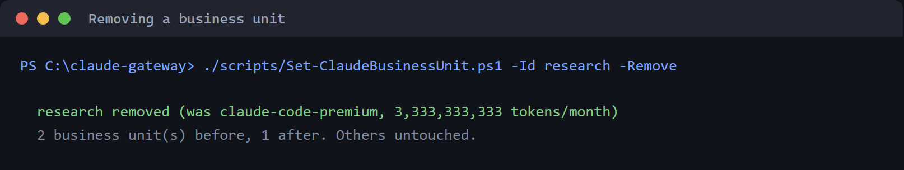

# Business units

Chargeback answers one question: whose budget did this request spend. A business
unit is the owner of that budget.

This page covers adding one, setting and changing its budget, moving people
between them, and removing one. The decision behind the design is in
[ADR-0007](adr/0007-business-unit-model.md).

## What a business unit is

An **Entra security group** with a **monthly budget**.

| | |
|---|---|
| **Identifier** | `platform`. Stable. It is what the budget counter, the ledger and every report use |
| **Entra group** | `claude-code-standard`. Who belongs to the unit. Can be renamed without touching the identifier |
| **Budget** | Set in dollars, stored in tokens, converted once when written |

Membership comes from the group, so moving a developer between business units is
done in Entra and picked up by the sync. There is no separate roster to keep in
step.

## Teams, and how they relate to tiers

A **team** is a business unit that names a parent. A request is charged to the
team **and** to the business unit above it — two counters, both monthly, both
soft. [ADR-0008](adr/0008-teams-and-tiers.md) records the model.

**Tier** is a separate axis. It answers "what may this developer do" — which
models, and what personal budget. Team answers "whose budget does this spend".
They are independent, so a team can move between tiers without disturbing
chargeback, and a team can move between business units without changing what its
members are allowed to call.

Both are expressed the same way: **one Entra group nested inside another**.

```
claude-bu-mcaps                     business unit, budget
├── claude-team-ites-1              team, own budget, charged to MCAPS too
│   ├── Naveen Gopalakrishna
│   └── Saurabh Seth
└── claude-team-ites-2              team, own budget, charged to MCAPS too
    ├── Nived Velayudhan
    └── Vraja Kishore Mudumbai

claude-bu-gbb                       business unit with direct members, no team
└── Somnath Banerjee

claude-code-standard                tier: which models, personal budget
├── claude-team-ites-1              → everyone in ITES 1 is standard
└── claude-bu-gbb                   → everyone in GBB is standard

claude-code-premium                 tier
└── claude-team-ites-2              → everyone in ITES 2 is premium
```

A group can sit in more than one parent, which is what makes the two axes
independent: `claude-team-ites-1` is inside `claude-bu-mcaps` for chargeback and
inside `claude-code-standard` for entitlement.

Changing a team's tier is one membership edit in Entra. Nothing in the gateway
changes, because entitlement is already resolved transitively.

### Seeing it in Entra

The hierarchy is ordinary group nesting, so it is visible in the portal.

**Direct members** of a business unit are its teams, not people:



**All members** resolves the nesting and shows the people underneath — the same
transitive view the sync reads:



The difference between those two tabs is the whole model. Membership is
maintained on the team, and the business unit gets it by containment.

Names and addresses in these captures are examples; the groups and the structure
are real.

These links open the **Members** blade of each group in the reference deployment;
substitute your own group object ids.

| Group | Role | Portal |
|---|---|---|
| `claude-bu-mcaps` | Business unit. Members are the two team groups | [Members](https://portal.azure.com/#view/Microsoft_AAD_IAM/GroupDetailsMenuBlade/~/Members/groupId/df529b3b-df37-40ab-9593-f19b9219f855) |
| `claude-team-ites-1` | Team. Members are people | [Members](https://portal.azure.com/#view/Microsoft_AAD_IAM/GroupDetailsMenuBlade/~/Members/groupId/cbe8263d-55fc-4080-b147-d1fc6fc36aed) |
| `claude-team-ites-2` | Team. Members are people | [Members](https://portal.azure.com/#view/Microsoft_AAD_IAM/GroupDetailsMenuBlade/~/Members/groupId/a2a9bda1-06dd-4774-a50a-63e89e45ad32) |
| `claude-bu-gbb` | Business unit with direct members and no team | [Members](https://portal.azure.com/#view/Microsoft_AAD_IAM/GroupDetailsMenuBlade/~/Members/groupId/058d5d1d-1823-4b43-b884-0938694e462a) |
| `claude-code-standard` | Tier. Contains `claude-team-ites-1` and `claude-bu-gbb` | [Members](https://portal.azure.com/#view/Microsoft_AAD_IAM/GroupDetailsMenuBlade/~/Members/groupId/bac8d3f3-a87e-493b-b607-cca92d013d18) |
| `claude-code-premium` | Tier. Contains `claude-team-ites-2` | [Members](https://portal.azure.com/#view/Microsoft_AAD_IAM/GroupDetailsMenuBlade/~/Members/groupId/78e38759-d8a3-4436-b0dd-699a5e0c31be) |

To see what one person inherits, open their profile and use **Groups →
transitive membership**, which is the view the sync reads.

`guide/capture-entra.mjs` screenshots all six blades and
`guide/redact-entra.mjs` replaces the identities in them. Sign in once first:

```powershell
node guide/auth.mjs              # complete MFA once; session is kept
node guide/capture-entra.mjs     # writes .shots-entra/
node guide/redact-entra.mjs      # writes docs/guide/entra-*.png
```

The capture exits non-zero if the session has expired rather than saving the
sign-in page, because a screenshot of a login form looks enough like a
screenshot of a group to get published by mistake. `.shots-entra/` is
git-ignored — the unredacted captures carry real names and the signed-in
account, and only the redacted output ships.

Redaction boxes are pixel coordinates, so each capture needs its own entry in
`JOBS`. The two shown above have one; the other four blades do not yet. If you
capture them, `redact-entra.mjs` **exits non-zero and names the files it could
not handle** rather than skipping them quietly — an unredacted capture sitting
in a folder is the one that gets copied into the docs by hand with a real name
still on it.

### Depth is two levels

Organisation ceiling → business unit → team. No deeper.

The cascade is written into the gateway policy as two counters with fixed keys,
and there is no loop, so a third level would not be charged at all. Rather than
let that happen quietly, `Set-ClaudeBusinessUnit.ps1` refuses a deeper chain when
you write it, and refuses a cycle.

### Creating a team

```powershell
./scripts/Set-ClaudeBusinessUnit.ps1 -Id mcaps `
    -Group "claude-bu-mcaps" -MonthlyBudgetUsd 20000

./scripts/Set-ClaudeBusinessUnit.ps1 -Id ites-1 `
    -Group "claude-team-ites-1" -MonthlyBudgetUsd 6000 -Parent mcaps
```

The parent must already exist. To promote a team back to top level, pass an
empty parent:

```powershell
./scripts/Set-ClaudeBusinessUnit.ps1 -Id ites-1 -Parent ''
```

Removing a business unit promotes its teams to top level rather than leaving them
pointing at something that is gone.

## Read this before you quote a number

The budget is a **spend guide, not an accounting figure**, and there are two
measured reasons why.

**A dollar does not buy a fixed number of tokens.** Claude's output tokens cost
five times base input, so the conversion assumes a mix — 20% output by default,
which is deliberately conservative. Change it with `-OutputShare` if your
workload differs.

**The counter does not see cached tokens.** API Management's `llm-token-limit`
policy "currently counts prompt and completion tokens only". Measured against
thirty days of live usage on the reference gateway, cache reads were 6.8 million
tokens against 320 thousand prompt and 152 thousand completion, which at Claude's
published rates is **38.7% of the real cost weight**. Real spend is therefore
**higher** than any figure here, not lower.

Figures are also at **list price**. Azure bills Claude as a single aggregated
Claude Consumption Unit meter, and private-offer discounts are applied before
that conversion, so none of this reconciles to an invoice. See `U2` in
[UNKNOWNS.md](UNKNOWNS.md).

Every command repeats these caveats in its own output, so nobody reads a number
without them.

## Adding a business unit

```powershell
./scripts/Set-ClaudeBusinessUnit.ps1 -Id platform `
    -Group "claude-code-standard" -MonthlyBudgetUsd 5000
```



The identifier must be lower-case letters, digits and hyphens. It becomes a
counter key and a map key, so a space, comma, equals or colon is refused rather
than silently mangled.

Creating one needs both `-Group` and `-MonthlyBudgetUsd`. After that, either can
be changed on its own.

## Listing them

```powershell
./scripts/Set-ClaudeBusinessUnit.ps1 -List
```



## Changing a budget

Pass the identifier and the new figure. The group is left alone.

```powershell
./scripts/Set-ClaudeBusinessUnit.ps1 -Id platform -MonthlyBudgetUsd 8000
```



The output states what the value was as well as what it now is, so a change made
by mistake is visible in the terminal rather than only in the audit log.

To point a unit at a different Entra group, pass `-Group` instead. To change
both, pass both.

## Moving people between business units

Membership is group membership. Add or remove the developer in Entra, then run
the sync:

```powershell
./scripts/Sync-ClaudeAccess.ps1
```



The sync reads the registry, resolves each unit's group, and writes the map the
gateway reads. A developer in two business-unit groups takes the **first in
registry order**, which is deterministic and visible in the list above.

If a group resolves to zero members while the map currently assigns people, the
sync **refuses to overwrite it** and says so. That guard exists because the
entitlement lists were once silently emptied by exactly this, and the symptom —
spend landing on no budget — is invisible until someone reconciles a report.

## Seeing what has been spent

```powershell
./scripts/Get-ClaudeBusinessUnit.ps1
```



Spend comes from the [chargeback ledger](adr/0006-ledger-is-the-llm-log.md), which
is the built-in API Management LLM log joined to the caller. `-AsJson` gives the
same data for a dashboard, and `-Days` overrides the default of month-to-date.

## Developers with no business unit

Anyone entitled but not in a business-unit group is **unassigned**. What happens
to them is set by the `bu-unassigned` named value:

| Value | Behaviour |
|---|---|
| `allow` (default) | Served, recorded against `unassigned`, counted against no budget |
| `deny` | Refused, with a message telling them to ask for a business unit |

The default is `allow` deliberately. Nobody has a business unit at the moment
this first deploys, so a default of `deny` would refuse every request on the
gateway that installs it.

The target state is `deny`. Move to it once the report shows zero unassigned:

```powershell
az apim nv update -g <rg> --service-name <apim> `
    --named-value-id bu-unassigned --value deny
```

## Removing one

```powershell
./scripts/Set-ClaudeBusinessUnit.ps1 -Id research -Remove
```



Its members become unassigned at the next sync. Their history in the ledger keeps
the identifier they spent under, because the ledger records the unit that was in
force at the time rather than looking it up later.

## When a budget runs out

The gateway returns `403` in Anthropic's error shape, naming the business unit:

```json
{ "type": "error",
  "error": {
    "type": "rate_limit_error",
    "budget": "business unit",
    "message": "The Claude budget for your business unit (platform) is spent for this period. Your access is unaffected - this budget is shared with your colleagues in that unit, and your platform team can raise it." } }
```

This is the fourth `403` the gateway can return, and they are deliberately
distinguishable: not entitled, personal budget, organisation budget, business
unit budget, wrong model. `budget` says which.

The limit is a **soft cap**. The policy reference states that high-concurrency
requests can temporarily exceed a configured limit, so it bounds spend rather
than guaranteeing it. Combined with the cache blind spot above, it should not be
described to a budget holder as a hard stop.

## Limits worth knowing

| | |
|---|---|
| Members per map | About 110. Named values cap at 4,096 characters and an object id is 37 of them. The sync now **fails loudly** rather than silently truncating |
| Business units | About 100 in a 4,096-character registry, depending on group name lengths |
| Enforcement | Monthly, soft, and blind to cached tokens |
| Reporting | List price, not reconciled to an invoice |

The membership ceiling is the same one entitlement already has, and
[ROADMAP.md](ROADMAP.md) `P19` replaces the store.

## Related

- [ADR-0007](adr/0007-business-unit-model.md) — why a group rather than a directory attribute
- [ADR-0006](adr/0006-ledger-is-the-llm-log.md) — where spend figures come from
- [ONBOARDING.md](ONBOARDING.md) — tiers, budgets and entitlement
