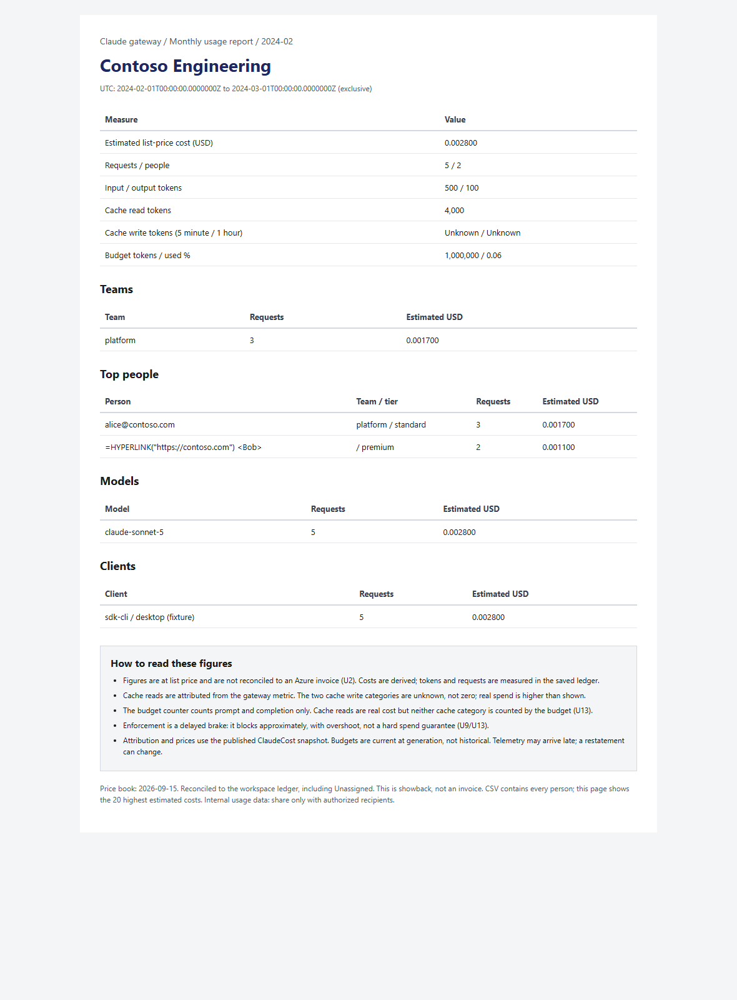
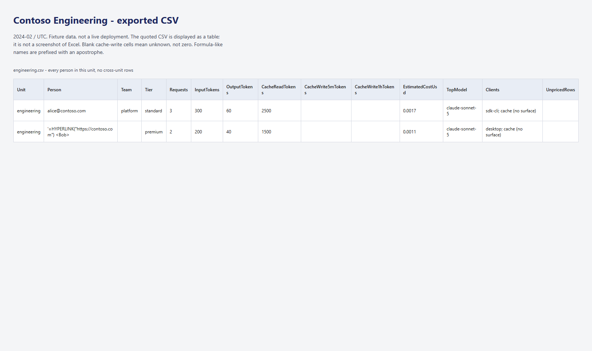

# Generate and deliver business-unit chargeback reports

## Overview

Use this guide to generate a monthly report for business-unit budget owners, archive it
privately, and deliver it to administrator-maintained recipient lists. The report reads
the gateway's existing `ClaudeCost` and `ClaudeChargeback` functions. It does not collect
prompts, responses or source code.

For numbered **Azure portal (GUI) procedures, equivalent Azure CLI commands and live
redacted screenshots**, see [Operate reports in the portal and CLI](chargeback-reports/PORTAL-CLI.md).
The email/CSV examples below remain clearly labeled fixtures.

**These are list-price showback reports, not Azure invoices.** Request, input, output and
cache-read counts come from the saved ledger. Dollar figures are derived. Cache writes
are unknown and are left blank, not reported as zero. The budget counter counts prompt
and completion only; cache reads are real cost but do not consume that counter.
Enforcement is a delayed brake that blocks approximately, with overshoot (U2/U9/U13).

| Recipient | Receives |
|---|---|
| Unit list | That unit's HTML summary inline, and only that unit's people CSV |
| All-units administrator list | The index inline, summary CSV and all selected unit CSVs |
| Team manager | No automatic parent-unit report. Team-specific delivery is not implemented |

Large CSVs are split at complete records and compressed into ZIP attachments. A message
can have several attachments; larger sets become numbered messages. No public link, SAS
or storage key is emailed. Recipients appear in BCC, not in each other's address lists.
Delivery attachments use content-addressed archive paths: a retry or explicit resend cannot
overwrite bytes that an earlier pending message references, even if ZIP metadata changes.

### Example report

The following images are rendered from **Contoso fixtures**, not a live deployment.
The formula-like person name is deliberate: it demonstrates HTML escaping and the
apostrophe that prevents spreadsheet formula execution.





The second image displays the actual exported CSV through a table renderer; it is not
an Excel screenshot. Reproduce both images with:

```powershell
node .\guide\capture-chargeback-reports.mjs
```

## Prerequisites

- Windows PowerShell 5.1 or PowerShell 7, Azure CLI, and an Azure sign-in.
- A governed gateway with request telemetry and published `ClaudeCost` and
  `ClaudeChargeback` saved functions. See [Monitoring](MONITORING.md) and
  [Business units](BUSINESS-UNITS.md).
- The gateway target recorded by the installer, or explicit `-ResourceGroup` and
  `-ApimName`. Scripts also honor `CLAUDE_RG` and `CLAUDE_APIM`.
- Owner, or Contributor plus Role Based Access Control Administrator, for initial
  deployment. Creating custom roles can require subscription-level role-definition
  permissions. Routine changes need only the relevant job/configuration permissions.
- A terminal connected to the reports VNet for direct blob operations, or `-ViaJob`
  for off-network administrative changes. Storage is private-endpoint-only.
- Approved recipient domains and a business decision about retention.
- An explicit network choice for first registration: select discovered VNet/subnets/DNS
  resources, or supply an approved private CIDR plan for a new dedicated reports network.

### Roles and identities

| Principal | Scope | Role or permission |
|---|---|---|
| Generator/dispatcher identity | Gateway workspace | Log Analytics Reader |
| Generator/dispatcher identity | Gateway | Custom role: `Microsoft.ApiManagement/service/namedValues/read` only |
| Generator/dispatcher identity | `configuration` blob container | Storage Blob Data Reader |
| Generator/dispatcher identity | `reports` blob container | Storage Blob Data Contributor |
| Generator/dispatcher identity | Dedicated ACS resource | Custom role: CommunicationServices read/write |
| Administration-job identity | `configuration` container only | Storage Blob Data Contributor |
| Deployment operator | Reports storage account | Storage Blob Data Contributor |
| Routine off-network administrator | Administration job | Permission to read/start that job; this is configuration authority |
| Report recipient | None | Receives email; no Azure role is granted |

ACS supports [Microsoft Entra authentication for email][email-auth]. The implementation
gets a token for `https://communication.azure.com`; it never reads an access key. There
is no email-send-only data action in the inspected provider. The custom role retains
read/write on a **dedicated ACS resource**, but excludes key listing, key regeneration,
delete and subscription-wide Contributor. This residual management permission is why
the feature must not share another application's ACS resource. See [ADR-0020](adr/0020-chargeback-reports.md).

Portal: resource **Access control (IAM) > Role assignments** shows each assignment.
For the custom roles, open **Subscription > Access control (IAM) > Roles**. A directory
administrator and Microsoft Graph application permission are not needed for literal
recipient addresses.

## Generate a report

### 1. Select the gateway

```powershell
$env:CLAUDE_RG = 'rg-contoso'
$env:CLAUDE_APIM = 'apim-contoso'
az login
```

If no installer/environment target is recorded, use the actual numbered choices rather
than copying example names:

```powershell
.\scripts\Get-ClaudeChargebackTarget.ps1 -Inventory
```

All administration commands accept `-SubscriptionId` and `-NonInteractive` in addition to
gateway parameters. Explicit choices can be automated; an ambiguous missing choice fails
in noninteractive mode instead of selecting the first resource silently.

Missing choices use the shared numbered picker, with their discovery source,
lookup command and Azure portal path. Enter takes a displayed recommendation.
Headless execution is detected even without `-NonInteractive`. Storage and
administration jobs recorded in `chargeback-<gateway>` deployment outputs count
as given when their gateway tag still matches; otherwise you choose from that
gateway's tagged resources. For unattended administration use `-StorageAccount`
or, with `-ViaJob`, `-JobName` when the refusal names several candidates.
The generator, dispatcher and admin job bootstrap always passes its storage
account and records the gateway resource group and name in environment variables.

Portal: **Resource groups > your group > API Management service**. For the workspace,
follow the API's **Diagnostics settings / Application Insights diagnostic > Logger >
Application Insights > Properties > Workspace**. Do not select the first similarly
named workspace in a resource group.

The scripts use the existing diagnostic/logger discovery helper. They do not guess the
workspace from a name. `CLAUDE_REPORT_WORKSPACE` or `-WorkspaceResourceId` is an explicit
override for a job or an administrator who has already verified that link.

### 2. Preview and generate

```powershell
# Defaults to the previous complete calendar month.
.\scripts\New-ClaudeChargebackReport.ps1 -WhatIf
.\scripts\New-ClaudeChargebackReport.ps1

# Recreate one unit's closed-month report.
.\scripts\New-ClaudeChargebackReport.ps1 -Month 2026-08 `
  -BusinessUnit engineering -OutputPath .\chargeback-reports

# An explicit current-month snapshot, not a projected full-month figure.
.\scripts\New-ClaudeChargebackReport.ps1 -MonthToDate
```

Portal alternative for the query: **Log Analytics workspace > Logs**. Run:

```kusto
ClaudeCost(datetime(2026-08-01T00:00:00Z),
           datetime(2026-08-31T23:59:59.9999999Z))
| summarize Requests=sum(requests),
    InputTokens=sum(prompt_tokens), OutputTokens=sum(completion_tokens),
    CacheReadTokens=sum(cache_read_tokens), EstimatedCostUsd=sum(usd)
```

Use **Export > CSV** for an ad hoc portal export. The portal does not generate this
feature's private per-unit HTML, provenance or reconciliation manifest; use the script
for that complete artifact.

### 3. Verify the result

The folder `chargeback-reports\2026-08` contains:

```text
summary.csv
engineering.csv
engineering.html
finance.csv
finance.html
unassigned.csv
unassigned.html
index.html
manifest.json
```

A unit filter emits only selected units, but reconciliation still checks all root units
plus Unassigned against the workspace total. Team rows are subdivisions of their parent;
do not add them to root-unit totals. Empty months and zero-usage catalog units are explicit.

```powershell
$m = Get-Content .\chargeback-reports\2026-08\manifest.json -Raw | ConvertFrom-Json
$m.Reconciliation
$m.Totals
$m.Source
```

`Status` must be `Complete` and `Reconciliation.Matched` must be true. Token/request
comparisons are exact. Cost comparison tolerates at most USD 0.000001 for the existing
Kusto real-valued cost function. Person, model and client totals are also checked.
Partial query results fail rather than become a plausible incomplete report.

The manifest records the exclusive UTC period, generation time, source-function SHA-256
hashes/versions, price-book date, membership date, selected units, row counts and artifact
hashes. Its workspace reconciliation data is for administrators; it is not attached to
unit emails. A filtered unit's HTML and CSV never contain another unit's people.

> Do not commit output. It contains personal usage data. The default report directory is
> ignored by Git. An alternative `-OutputPath` must be secured and excluded by its owner.
> Regeneration refuses unrelated files in an existing month folder. It stages a complete
> replacement before moving the old report aside. Use different output roots for concurrent
> manual runs; scheduled runs already use unique roots and archive prefixes.

## Deploy scheduled reporting

### 1. Publish the code revision

The jobs fetch a **full commit ID already on the repository's origin remote**. A branch
name is refused. A code update is deliberate; changing recipients or schedules is not a
code update.

```powershell
git push origin your-reviewed-branch
.\scripts\Register-ClaudeChargebackSchedule.ps1 `
  -AllowedDomains contoso.com -Cron '0 6 1 * *' -WhatIf
.\scripts\Register-ClaudeChargebackSchedule.ps1 `
  -AllowedDomains contoso.com -Cron '0 6 1 * *'
```

First registration presents discovered regions, VNets, subnets and private DNS zones.
Creating a new network requires its address plan; existing networks are not retagged as
reports-owned. An unattended example uses **example** CIDRs that your network owner must
replace or approve:

```powershell
.\scripts\Register-ClaudeChargebackSchedule.ps1 `
  -AllowedDomains contoso.com -VirtualNetworkPrefix '10.42.8.0/24' `
  -JobsSubnetPrefix '10.42.8.0/26' -EndpointSubnetPrefix '10.42.8.64/27' `
  -NonInteractive
```

Alternatively pass `-VirtualNetworkId`, `-JobsSubnetId`, `-EndpointSubnetId` and, when
reusing a zone, `-PrivateDnsZoneId` from discovery. The jobs subnet needs the Container Apps
delegation and must not be occupied by another environment. Network placement is an
initial-deployment choice, unlike editable recipients/schedules; the environment's subnet
cannot be changed in place.

The default is 06:00 UTC on day 1 for the previous month. Six hours is an ingestion
allowance, not a completeness guarantee. Regenerate after late telemetry when needed.

The deployment creates reports-only resources in the gateway resource group:

| Resource | Purpose | Manual portal path |
|---|---|---|
| Communication Services | Entra-authenticated email send endpoint | **Create a resource > Communication Services**, select data location |
| Email Communication Service | Email-domain configuration | **Create a resource > Email Communication Services** |
| Azure-managed domain | Preconfigured sender authentication; no DNS ownership work | Email Service **Provision domains > Add domain > Azure subdomain** |
| Domain connection | Allows the ACS endpoint to use the sender | Communication Services **Email > Domains > Connect domain** |
| StorageV2, Standard LRS | Private configuration, archive and outbox | **Storage accounts > Create > Advanced**: require HTTPS, disable anonymous blob and shared-key access |
| `configuration`, `reports` containers | Separate read/write boundaries | Storage **Data storage > Containers > Add container**, public access **Private** |
| Blob versioning/soft delete | Recover configuration and accidental deletion | Storage **Data protection**: enable versioning and seven-day blob/container soft delete |
| Lifecycle rule | Default 400-day archive/version retention | Storage **Data management > Lifecycle management > Add rule**; prefix and actions below |
| Dedicated VNet and subnets | Job access to private blobs | **Virtual networks > Create**; delegate jobs subnet to `Microsoft.App/environments` |
| Blob private endpoint | No public Storage network route | Storage **Networking > Private endpoint connections > + Private endpoint**, subresource **blob** |
| Blob private DNS zone and VNet link | Resolve the account to its private endpoint | **Private DNS zones > privatelink.blob.core.windows.net > Virtual network links** |
| Consumption Container Apps environment | Reports independent of Turnstile | **Container Apps environments > Create > Networking > Use your own virtual network** |
| Generator job | Monthly report generation/archive | **Container Apps Jobs > Create > Schedule**, cron `0 6 1 * *`, Consumption, 1 vCPU/2 GiB |
| Dispatcher job | Start only while pending blobs exist | **Container Apps Jobs > Create > Event**; `azure-blob`, `reports`, prefix `outbox` (KEDA adds `/`), count 1, poll 420 s, min 0/max 1 |
| Manual administration job | Configuration changes from outside the VNet | **Container Apps Jobs > Create > Manual**, separate admin identity |
| Two user-assigned identities | Separate reporting from configuration authority | **Managed Identities > Create**; jobs **Settings > Identity > User assigned > Add** |
| Diagnostic setting | Job console evidence in the existing workspace | Environment **Monitoring > Diagnostic settings > Add**, all log categories |

**Portal limitation:** managed-identity authentication for scale rules is not available
in the portal's rule editor. Use **Deploy a custom template > Build your own template
in the editor** with the compiled `infra\chargeback-reports.bicep`, or Azure CLI, to set
the dispatch rule's `identity`. Do not substitute a storage connection string.
[Microsoft documents this limitation][scale-identity].

The template bootstraps the Azure CLI image with PowerShell, fetches the pinned repository,
signs in with `az login --identity --client-id`, and runs
`Invoke-ClaudeChargebackSchedule.ps1`. In the portal job **Containers > Edit**, inspect
the command and `REPO_REF`; copy the template's command rather than hand-writing shell
quoting. Resource templates are the authoritative role/action and bootstrap reference.

### 2. Set recipients

From a VNet-connected terminal:

```powershell
.\scripts\Set-ClaudeChargebackRecipients.ps1 -BusinessUnit engineering `
  -Add alice@contoso.com,bob@contoso.com -WhatIf
.\scripts\Set-ClaudeChargebackRecipients.ps1 -BusinessUnit engineering `
  -Add alice@contoso.com,bob@contoso.com
.\scripts\Set-ClaudeChargebackRecipients.ps1 -AllUnits -Add finance-ops@contoso.com
.\scripts\Set-ClaudeChargebackRecipients.ps1 -BusinessUnit engineering -List
```

From an off-network administrator terminal, add `-ViaJob`. The same validation and ETag
write run in the private administration job; no resource redeploy is required:

```powershell
.\scripts\Set-ClaudeChargebackRecipients.ps1 -BusinessUnit engineering `
  -Add alice@contoso.com -ViaJob
```

Portal: Storage **Containers > configuration > settings.json**. On an approved network,
download and edit the JSON, then upload it with overwrite, or use a blob editor with an
ETag condition. The portal overwrite is **not** a safe concurrent-edit workflow; the
scripts prevent lost updates with `If-Match`. Use **Versions** to inspect prior versions.
Off-network, start the administration job with the structured execution override produced
by the script; do not change the job's pinned command.

### 3. Change settings later

```powershell
# Add/remove are idempotent. Addresses are normalized and deduplicated.
.\scripts\Set-ClaudeChargebackRecipients.ps1 -BusinessUnit engineering `
  -Remove bob@contoso.com -ViaJob -WhatIf
.\scripts\Set-ClaudeChargebackRecipients.ps1 -BusinessUnit engineering `
  -Remove bob@contoso.com -ViaJob

# The allow-list is exact: contoso.com does not allow sub.contoso.com.
.\scripts\Set-ClaudeChargebackSettings.ps1 `
  -AllowedDomains contoso.com,contoso.org -ViaJob
.\scripts\Set-ClaudeChargebackSettings.ps1 `
  -BusinessUnit engineering,finance -MonthToDate $false -ViaJob
.\scripts\Set-ClaudeChargebackSettings.ps1 -BusinessUnit @() -ViaJob

# Archive only. Delivery must be disabled before dropping either email format.
.\scripts\Set-ClaudeChargebackSettings.ps1 `
  -DeliveryEnabled $false -Format CSV -ViaJob
.\scripts\Set-ClaudeChargebackSettings.ps1 `
  -DeliveryEnabled $true -Format CSV,HTML -ViaJob
.\scripts\Set-ClaudeChargebackSettings.ps1 -RetentionDays 400 -ViaJob

# Update the existing schedule without redeploying the environment or code.
.\scripts\Register-ClaudeChargebackSchedule.ps1 -Cron '0 8 1 * *'
```

Portal: edit `settings.json` for selection, domain policy, period mode, formats and
delivery. Use job **Settings > Configuration > Schedule** for cron. For retention also
update Storage **Lifecycle management**: current blobs, previous versions and snapshots
under `reports/runs/` and `reports/outbox/`; previous versions only under `configuration/`.
The current configuration and `reports/state/dispatch.json` must not expire.

Removing an address takes effect on the next delivery, including queued reports. Adding
an address does not retroactively add it to old queued messages: regenerate/resend
explicitly. A message already accepted by ACS cannot be recalled.

`-List -ViaJob` produces scope/counts in the job logs, never address lists. Use ordinary
`-List` from a VNet-connected host for full addresses. Administrators should protect
terminal output as personal data.

### 4. Run and verify

```powershell
.\scripts\Register-ClaudeChargebackSchedule.ps1 -RunNow
```

Portal: generator job **Execution history** must show **Succeeded**. Open the execution's
console logs. The `Archived` record identifies the immutable run prefix. Storage
**Containers > reports > runs > yyyy-MM > run-id** contains the CSVs, HTML and manifest.
The dispatcher starts when `reports/outbox/` contains pending work.

An archived run and a successful generator are **not** proof of email delivery. Inspect
the dispatcher execution and the archived manifest's `Sends` array. `Succeeded` means the
ACS send operation completed; it does **not** identify inbox versus junk placement.
For mail-server delivery events, configure ACS **Monitoring > Diagnostic settings** or
an Event Grid subscription to email delivery reports. Only the recipient can confirm
the final mailbox folder.

**MEASURED, 2026-09-24:** the reference generator archived a current-month report, an
automatic managed-identity dispatcher submitted one owner-only email, and mailbox metadata
confirmed that it arrived in **Inbox at 17:42:49 UTC**. The receiving organization prepended
`[EXTERNAL]` to the subject. This is one delivery observation, not a guarantee for other
organizations or future messages. No live mailbox screenshot is published.

## Send, regenerate or resend by hand

From a VNet-connected terminal:

```powershell
.\scripts\New-ClaudeChargebackReport.ps1 -Month 2026-08 `
  -BusinessUnit engineering -Send
.\scripts\Send-ClaudeChargebackReport.ps1 `
  -ReportPath .\chargeback-reports\2026-08 -BusinessUnit engineering -Dispatch

# Explicitly creates new messages. Without -Resend, completed parts are not resent.
.\scripts\Send-ClaudeChargebackReport.ps1 `
  -ReportPath .\chargeback-reports\2026-08 -BusinessUnit engineering -Resend

# One bounded dispatch action; safe to run alongside the dispatcher job.
.\scripts\Invoke-ClaudeChargebackSchedule.ps1 `
  -Mode dispatcher -StorageAccount streportscontoso
```

Portal: start the corresponding job from **Overview > Run now**. The generator uses
current settings; use the script on a connected terminal for a specific historic month.
An empty recipient list archives the report without sending it. `-Send` queues mail;
`-Dispatch` attempts one paced action rather than waiting for the entire outbox.

## Delivery limits and 500,000 people

[Azure Monitor's query API limits][monitor-limits] are 500,000 rows, about 100 MiB raw /
64 MB compressed, 10 minutes, and 200 requests per 30 seconds per user/client IP.
Reports use server-side summarize, one unit at a time, and `take 20001` as a saturation
sentinel. A saturated person page splits into disjoint SHA-256 prefixes and is queried
again. No saturated page is exported. Requests are sequential; partial/error responses
stop generation rather than silently dropping rows.

Person fields, including team/tier/client sets, are aggregated in Azure. CSV is streamed;
the HTML keeps only 20 people. Source ingestion cardinality and retention are separate
constraints: reconciliation proves agreement with the saved ledger, not that every
source event reached that ledger. In particular, cache metrics have the limitations
recorded in the existing ledger design.

**MEASURED, 2026-09-24, PowerShell 7.6.6:** 100,000 synthetic people in 10 units generated
CSV, HTML, hashes and manifest in 52.943 seconds, 1,889 people/second, 14,988,292 output
bytes, and about 279 MiB process peak working set. The fixture and output reconciled.
This includes fixture row construction but excludes Azure query latency. It is not a
500,000-user end-to-end performance claim.

```powershell
.\tests\Measure-ChargebackReport.ps1 -People 100000
```

Portal equivalent: there is no Azure-side equivalent to this offline renderer benchmark.
Use job **Monitoring > Metrics** and execution start/end times for actual deployed runs.

### Azure-managed email is the capacity boundary

[ACS documents these limits][email-limits]:

| Limit | Azure-managed domain |
|---|---:|
| Send operations | 5/minute; 10/hour per subscription |
| Status reads | 10/minute; 20/hour per subscription |
| Recipients/message | 50 |
| Encoded request including attachments | 10 MB |
| Quota increase | Not available for Azure-managed domains |

The outbox permits one send **or** status action every 420 seconds and records pacing in
Blob Storage under an exclusive lease. It never sleeps in a container for days. One send
and one status read imply about 4.3 completed message parts/hour, before failures and
other workloads in the subscription. Five hundred units plus one admin copy take roughly
117 hours at one part each. Recipient batches, attachment parts and extra status reads
increase that duration. These are derived scheduling estimates, not measured throughput.

CSV records above 3 MB are split and ZIP-compressed. Actual Base64/JSON bytes are checked
against a conservative 9.5 MB request limit. A 50,000-person random-address fixture is
split and checked for exact row preservation by the tests. A single record too large for
the part budget is refused; use the private archive rather than weaken the limit.

For prompt organization-wide production delivery, use a [verified custom domain and
approved quota][email-quota]. Microsoft positions [Azure-managed domains for development][email-domain].
They require no DNS changes, but a recipient may not recognize the generated domain;
organization filtering or junk placement remains possible. Do not call a successful
send an inbox-delivery guarantee.

## Costs

Prices are USD list price for an **East US 2 deployment, retrieved 2026-09-24**, before tax,
discounts, free grants and existing-resource charges. Nonregional Global and Zone 1
meters are labeled below. The ACS data location is United States.
Use the repository's `AzureRetailPrice.ps1`; the Retail API calls the service **Email**,
not "Azure Communication Services".

```powershell
. .\scripts\AzureRetailPrice.ps1
Get-AzureRetailPrice -ServiceName Email -Region eastus2 -MeterName 'Basic Sent Email'
Get-AzureRetailPrice -ServiceName Email -Region eastus2 -MeterName 'Basic Data Transferred'
Get-AzureRetailPrice -ServiceName 'Azure Container Apps' -Region eastus2 `
  -MeterName 'Standard vCPU Active Usage'
Get-AzureRetailPrice -ServiceName 'Azure Container Apps' -Region eastus2 `
  -MeterName 'Standard Memory Active Usage'
Get-AzureRetailPrice -ServiceName Storage -Region eastus2 -ProductName 'General Block Blob v2' `
  -SkuName 'Hot LRS' -MeterName 'Hot LRS Data Stored' -Tier First
Get-AzureRetailPrice -ServiceName 'Virtual Network' -Region Global `
  -ProductName 'Virtual Network Private Link' -MeterName 'Standard Private Endpoint'
Get-AzureRetailPrice -ServiceName 'Azure DNS' -Region 'Zone 1' `
  -MeterName 'Private Zone' -Tier First
```

Portal: **Cost Management > Cost analysis > Resource**, filter to the reports resources.
Use **Pricing calculator** for an estimate. The Retail Prices API provides the dated
list-price evidence; Cost Management provides your agreement's billed costs when available.

| Component | List-price basis | Interpretation |
|---|---|---|
| ACS Email | $0.00025 per recipient email, $0.00012 per recipient MB | 500 one-MB recipient emails: $0.185, derived; not a measured bill |
| Consumption job | $0.000024/vCPU-second + $0.000003/GiB-second | 1 vCPU/2 GiB: $0.000030/active second, before shared free grants |
| ACS resources, managed identities | No fixed monthly email-resource charge | Usage is billed; leaving an unused endpoint is not a paid seat |
| Blob Hot LRS, StorageV2 | $0.0184/GB-month at the first tier | Archive, retained versions and soft-deleted data consume storage |
| Blob writes/list/create | $0.05/10,000 operations | KEDA still polls when idle; jobs do not start for an empty outbox |
| Log Analytics queries | Interactive Analytics-plan queries are not charged by bytes scanned | Existing ingestion, retention and new job logs still incur normal charges |
| Blob private endpoint | $0.01/hour, Global meter | $7.30 per 730-hour month, derived; data processing is additional |
| Private DNS zone | $0.50/zone-month, Zone 1 first tier | DNS queries are additional |
| Environment-managed Standard load balancer | $0.025/hour, Global included-rules meter | $18.25/month before usage, derived |
| Environment-managed Standard IPv4 public IP | $0.005/hour, East US 2 | $3.65/month, derived; this is environment networking, not a public blob endpoint |

**MEASURED resource inventory:** the VNet-integrated reference environment created one
Standard load balancer and one Standard public IP in its Azure-managed infrastructure
resource group. **DERIVED standing networking cost:** $29.70/month for those resources,
one blob private endpoint and one private DNS zone, at 730 hours and the quoted first
tiers. Add blob storage/operations, DNS queries, logs, job execution and emails. The
Consumption jobs have no running replica when idle, but private networking is not free.

For 400 days of retention, estimate stored bytes from actual manifests, not developer
headcount alone. A monthly 15 MB archive retained for 13 months is about 0.195 GB before
versions, roughly $0.0036/month at the first Hot LRS tier. Admin aggregate attachments
duplicate some stored bytes. The 420-second scaler issues approximately 6,257 list
operations per 730-hour month, about $0.0313 at the quoted list-operation rate, before
pagination and other operations. If delivery is disabled while an outbox remains pending,
the dispatcher can still start; drain/cancel pending work before treating it as idle.

Do not use the older "Data Analyzed" ingestion meters as a query tariff.
[Analytics-plan interactive queries are included][query-pricing]. The join used here is
not a Basic/Auxiliary-plan query. Private networking and the environment's Azure-managed
network resources must also be included in a deployed bill of materials.

## Troubleshoot

| Symptom or exact error | Cause and action |
|---|---|
| `Report storage operation failed (HTTP 403). Check Entra blob roles, network access and role propagation.` | First check Storage **Networking**, then role assignments. On the reference subscription Azure Policy forced `publicNetworkAccess: Disabled`; adding roles did not fix off-network access. Use the private administration job or a VNet-connected terminal. Do not disable policy |
| `Report reconciliation failed ... No report was published.` | Query snapshots disagree, a category was dropped, or telemetry arrived during the run. Regenerate; inspect direct workspace totals and function hashes. Never remove the check |
| `Log Analytics returned a partial result` | API size/time/resource limit. Narrow the unit/window or investigate the query. Partial data is not a report |
| `Report reconciliation failed ... (people count)` | Missing/duplicated person pages. Investigate the query and aggregation before any delivery |
| `Saved functions changed during generation. Report invalidated; regenerate before sending.` | A query publisher changed the source during the run. The manifest is invalidated |
| `Recipient domain is not in the allowed-domain list.` | Typo, unapproved domain, or a queued address removed from the current allow-list. Fix settings through the administrator, not a bypass switch |
| `Configuration or report changed concurrently (HTTP 412). Read it again and retry; no change was saved.` | Another writer changed the blob. Reload and reapply the intended edit |
| `Report storage lease is already held (HTTP 409). Another dispatcher is running.` | A concurrent dispatcher, or a crashed process left the infinite lease. Check active executions first |
| `Email operation ... is Unknown` | The send outcome is ambiguous. Inspect the operation/receipt; do not blindly create another send |
| `ACS email operation failed (HTTP 429; operation ...)` | Subscription sending/status quota, including other ACS workloads. Pending state and pacing are retained |
| `Encoded email request exceeds the safe 9.5 MB size limit.` | The serialized payload, not the CSV's on-disk size, exceeded the bound. Split further or use the archive |
| Report has cache reads but zero requests | Those are separate telemetry streams. This occurred for the prior month in live verification; it does not mean the report should discard cache cost |
| Report warns of unpriced ledger rows | The existing price function could not price a model. Correct/publish the price book and explicitly restate the report; do not treat missing price as free |
| Unexpected output directory from `.NET GetFullPath` | PowerShell's current location can differ from the process working directory. The script resolves output through PowerShell's path provider |
| `The term 'Get-ClaudeReportQuery' is not recognized` in a callback | A dynamic module created with `GetNewClosure()` could not see the dot-sourced helper. Query callbacks use the script scope |
| `Unable to find type [IO.Compression.ZipArchiveMode].` on 5.1 | Both `System.IO.Compression` and `System.IO.Compression.FileSystem` must be loaded; the helper loads both |
| `Address(int)` instead of an email array in a test | Arrays expose an `Address` method; read each dictionary's `address` explicitly rather than member-enumerating that name |
| First Add works; second Add produces `Invalid recipient address` | A singleton array unrolled into a string and concatenation joined addresses. Recipient accumulation is explicitly `string[]` |
| A valid serialized UTC timestamp fails a string assertion on PowerShell 7 | `ConvertFrom-Json` converts ISO dates to DateTime. The test asserts the serialized `Z`, not display formatting |
| `BCP265: The name "environment" is not a function` | The resource symbol shadows the Bicep function. Use `az.environment()` |
| `Unknown properties volumes in StartJobExecutionTemplate are not supported` | The management template is not the execution template. Send only execution-container fields, not `volumes` or `imageType` |
| Scaler reports `MetricValue: 0.00` although the outbox contains a message | KEDA appends its delimiter. A configured prefix `outbox/` becomes `outbox//`; use `outbox` |
| `The specified node cannot be inserted as the valid child of this node, because the specified node is the wrong type.` | The Azure Blob listing begins with a BOM. Strip U+FEFF from decoded text before the XML string parser; preserve raw bytes for artifact hashes |
| `No replicas found for execution` | Completed job pods have been cleaned up. Read durable `ContainerAppConsoleLogs` instead |
| `'charmap' codec can't encode character '\ufeff'` in `az containerapp job logs show` | The Windows CLI log-stream decoder failed on the BOM. Read the durable workspace log through the query API |
| Filtering console logs by the ARM environment name returns no rows | `EnvironmentName` is the runtime-generated name, not necessarily the ARM name. Filter by the exact `JobName` or execution's `ContainerGroupName` |
| Every mutation is caught, but Test-All reports the mutation check as FAIL | A final expected native failure left `LASTEXITCODE=1`. The harness explicitly exits zero only after all mutations are caught |
| A mutation appears caught because `ClaudeBudgetModes.ps1` is missing | The upstream business-unit helper gained that dependency. The isolated copy now includes it, and every unmutated suite must pass before any mutation can be counted; a setup failure is not mutation evidence |
| A BOM assertion fails after the BOM was removed | Culture-sensitive `StartsWith` can treat U+FEFF as ignorable. Compare with `StringComparison.Ordinal` |
| `Output month contains files not owned by this report.` | Move administrator notes or spreadsheets out of the generated month folder, or choose a new output root; the script will not delete them |
| A negative test throws for missing parameters rather than its intended scenario | `$args` is an automatic variable and can be shadowed in callbacks. Use a named splat; do not override a splatted parameter on PowerShell 5.1 |
| An administration execution reports `Failed` without a bootstrap log | One live pod failed before its first application log; the platform did not expose a more specific cause. An identical idempotent request succeeded on retry. Inspect system logs and retry the same operation, not a broader permission grant |
| A dispatcher succeeds with `RateLimited` just before `NextActionUtc` | Startup duration varies. A live poll was 1.6 seconds early and correctly deferred to the next seven-minute interval; it did not send a duplicate |
| Requeueing a large report invalidates an older attachment hash | ZIP bytes can change because of timestamps/compressor versions. Delivery blobs are named by content hash so previous pending messages remain valid |

After verifying that no dispatcher is active, break a stale lease from a connected host:

```powershell
.\scripts\Register-ClaudeChargebackSchedule.ps1 -BreakDispatchLease -WhatIf
.\scripts\Register-ClaudeChargebackSchedule.ps1 -BreakDispatchLease
```

Portal: Storage **Containers > reports > state > dispatch.json > Break lease**.
Breaking a live lease can allow duplicate sends; it is an operator recovery action,
not a normal retry mechanism.

## Reference

### Report columns

| Column | Meaning |
|---|---|
| `Unit` | Root business-unit identifier; `unassigned` is explicit |
| `Team` | Team identifier, or blank for direct unit membership; person rows may list several |
| `Name` | Catalog group display name, otherwise the identifier; Unassigned is named |
| `Person` | Name/address from the ledger, falling back to its identity key if no name exists |
| `Tier` | Tier(s) observed in the selected ledger period |
| `Requests` | Count of metered ledger requests; cache metric rows add no requests |
| `InputTokens` | Non-cache prompt tokens recorded by the request ledger |
| `OutputTokens` | Completion tokens |
| `CacheReadTokens` | Cache reads attributed from the gateway metric |
| `CacheWrite5mTokens`, `CacheWrite1hTokens` | Unknown: empty CSV/null JSON, never an invented zero |
| `EstimatedCostUsd` | Existing `ClaudeCost` list-price estimate; unrounded decimal accumulation, not invoice cost |
| `BudgetTokens` | Current monthly token budget from the gateway catalog |
| `BudgetUsdEstimate` | Sonnet list-price estimate using 20% output, not historical input dollars |
| `UsedPercent` | `(InputTokens + OutputTokens) / BudgetTokens * 100`, rounded to two decimals |
| `People` | Distinct ledger identities per scope, including workloads and an unidentified bucket where needed; not licensed headcount. Selected totals count unit-person rows |
| `UnpricedRows` | Saved cost rows lacking a recognized price; cost is incomplete when nonzero |
| `TopModel` | Highest estimated-cost model for that person |
| `Clients` | Observed client surfaces; cache has its own `cache (no surface)` label |

Numeric output uses invariant culture. HTML encodes untrusted names. CSV quotes every
field and prefixes formula-like leading `=`, `+`, `-`, `@`, whitespace/control variants
with an apostrophe. Six decimals are displayed for cost so low-volume examples remain
visible; the CSV retains calculation precision.

### Configuration schema

`configuration/settings.json`, schema version 1:

```json
{
  "SchemaVersion": 1,
  "AllowedDomains": ["contoso.com"],
  "AllUnitsRecipients": ["finance-ops@contoso.com"],
  "Units": { "engineering": ["alice@contoso.com"] },
  "BusinessUnits": [],
  "Formats": ["CSV", "HTML"],
  "MonthToDate": false,
  "DeliveryEnabled": true,
  "RetentionDays": 400,
  "UpdatedUtc": "2026-09-24T00:00:00Z",
  "Connection": {
    "Endpoint": "https://acs-contoso.communication.azure.com",
    "SenderAddress": "DoNotReply@example.azurecomm.net",
    "JobName": "job-reports-contoso",
    "DispatcherJobName": "job-reports-mail-contoso",
    "AdminJobName": "job-reports-admin-contoso",
    "EnvironmentName": "cae-reports-contoso",
    "WorkspaceResourceId": "/subscriptions/<subscription-id>/resourceGroups/rg-contoso/providers/Microsoft.OperationalInsights/workspaces/log-contoso"
  }
}
```

An empty `BusinessUnits` array means all. The allowed-domain array must not be empty.
Formats are CSV, HTML or both; email requires both. Unknown schema versions are refused.
The document supports hundreds of units and has a 4 MB safety limit, not APIM's
4,096-character named-value ceiling. ETag writes and blob versions provide concurrency
protection and recovery. Connection values are deployment metadata, not secrets.

### Command parameters

All public scripts accept `-ResourceGroup` and `-ApimName` from the target resolver.
Storage clients also accept `-StorageAccount`, otherwise discovering its gateway tag.
Write commands support `-WhatIf` and `-Confirm`.

| Command | Parameters |
|---|---|
| `New-ClaudeChargebackReport.ps1` | `Month` (`yyyy-MM`, previous month by default), `MonthToDate`, `BusinessUnit` array, `OutputPath`, `Format` array, `Send`, `StorageAccount`, `WorkspaceResourceId` |
| `Send-ClaudeChargebackReport.ps1` | `ReportPath`, `BusinessUnit` array or `AllUnits`, `Dispatch`, `Resend`, `StorageAccount` |
| `Set-ClaudeChargebackRecipients.ps1` | `BusinessUnit` or `AllUnits`; exactly one of `Add` array, `Remove` array, `List`; `StorageAccount`, `ViaJob`, `JobName` |
| `Set-ClaudeChargebackSettings.ps1` | `AllowedDomains`, `BusinessUnit` array (empty selects all), `Format`, nullable Boolean `MonthToDate`/`DeliveryEnabled`, `RetentionDays`, `List`, `StorageAccount`, `ViaJob`, `JobName` |
| `Register-ClaudeChargebackSchedule.ps1` | `Cron`, initial `AllowedDomains`, `MonthToDate`, `RunNow`, `Remove`, `PurgeArchive`, `BreakDispatchLease`, `RepositoryUrl`, `RepositoryRef`, `Location`, `OperatorObjectId`, `OperatorPrincipalType`, `RetentionDays`, `StorageAccount` |
| `Invoke-ClaudeChargebackSchedule.ps1` | `Mode` (`generator`, `dispatcher`, internal structured `admin`), `StorageAccount` (explicit in every job; discovered or chosen for a manual pass) |
| `Get-ClaudeChargebackTarget.ps1` | `SubscriptionId`, `ResourceGroup`, `ApimName`, `NonInteractive`, `Inventory`, `AsJson` |

Registration additionally accepts `VirtualNetworkId`, `JobsSubnetId`, `EndpointSubnetId`,
`PrivateDnsZoneId`, or the new-network `VirtualNetworkPrefix`, `JobsSubnetPrefix` and
`EndpointSubnetPrefix`. A bare first registration offers numbered choices. The readable
portal admin payload is `REPORT_ADMIN_JSON`; a CLI execution override uses
`REPORT_ADMIN_REQUEST`. Supplying both is refused.

Unit identifiers must be safe lower-case identifiers; path traversal and Windows reserved
filenames are refused. `all`, `index`, `summary`, `manifest` are reserved report names.
Cron accepts five numeric UTC fields with `*`, comma, ranges and steps; shell metacharacters
are rejected. Deployments pass JSON through a unique file, not inline `az` arguments
that Windows `cmd.exe` might reparse.

### Remove resources

```powershell
.\scripts\Register-ClaudeChargebackSchedule.ps1 -Remove -WhatIf
.\scripts\Register-ClaudeChargebackSchedule.ps1 -Remove

# Includes personal-data archives and configuration; irreversible after Azure recovery limits.
.\scripts\Register-ClaudeChargebackSchedule.ps1 -Remove -PurgeArchive -WhatIf
.\scripts\Register-ClaudeChargebackSchedule.ps1 -Remove -PurgeArchive
```

Portal: in the resource group, filter tags by the gateway's `claude-chargeback-gateway`
value. Remove jobs before their environment; then the reports private endpoint/VNet/DNS,
ACS connection/service, Email Service/domain, identities and, only if intended, storage.
Review IAM assignments for the removed identities and the two reports custom roles.
Never delete the resource group: it also contains the gateway and workspace.

## Next steps

- Verify report figures with your finance team before using them for allocation.
- Publish and version tariff changes deliberately. The current saved cost function uses
  a flat snapshot; it does not implement ADR-0010's future effective-dated invoice tariff.
- For production delivery at scale, use a verified custom domain and obtain an ACS quota.
- Proposed, not implemented: `claude-finops report`, Turnstile `report_recipients`
  catalog attributes, scoped team artifacts, and manager-group recipients. The latter
  needs the Graph permission still blocked by U17.

[email-auth]: https://learn.microsoft.com/azure/communication-services/quickstarts/email/send-email?tabs=windows&pivots=programming-language-csharp
[email-limits]: https://learn.microsoft.com/azure/communication-services/concepts/service-limits#email
[email-quota]: https://learn.microsoft.com/azure/communication-services/concepts/email/email-quota-increase
[email-domain]: https://learn.microsoft.com/azure/communication-services/concepts/email/email-domain-and-sender-authentication
[monitor-limits]: https://learn.microsoft.com/azure/azure-monitor/fundamentals/service-limits#query-api
[scale-identity]: https://learn.microsoft.com/azure/container-apps/scale-app#authentication
[query-pricing]: https://learn.microsoft.com/azure/azure-monitor/logs/cost-logs#table-plans
