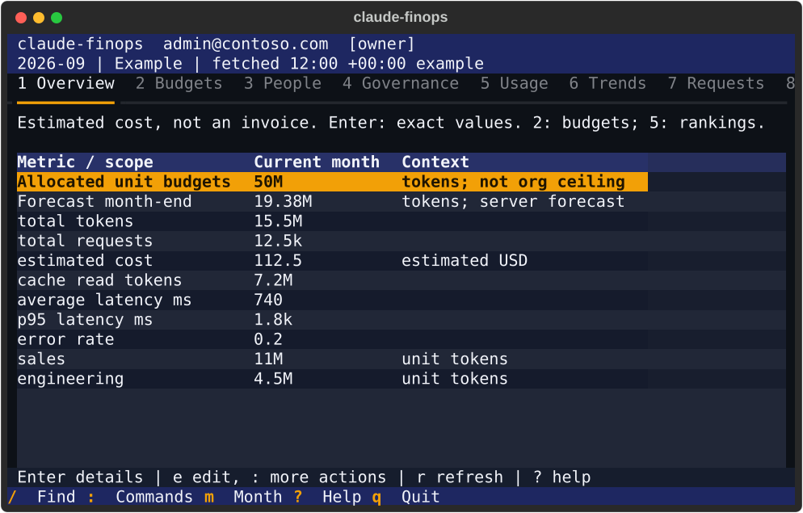
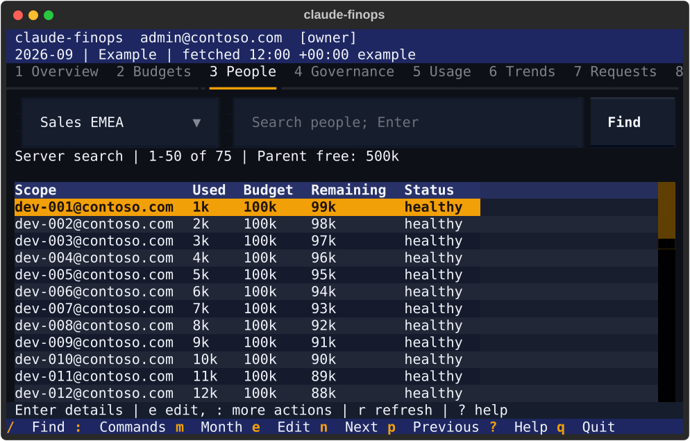
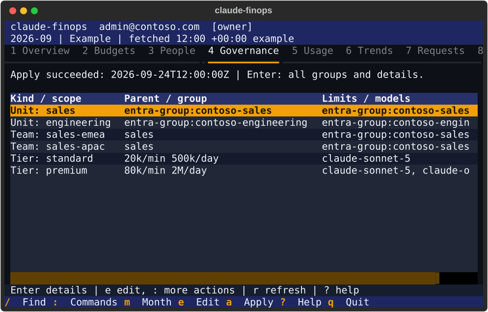
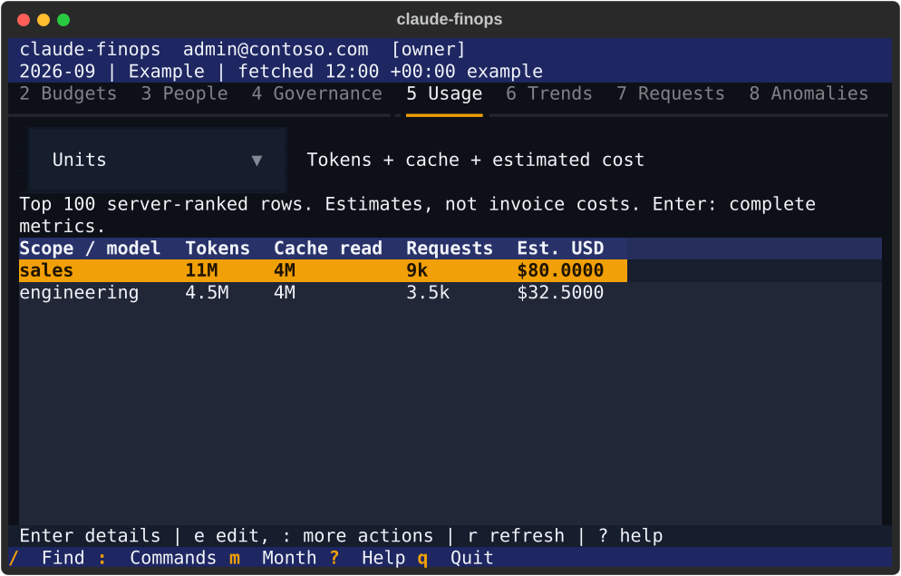
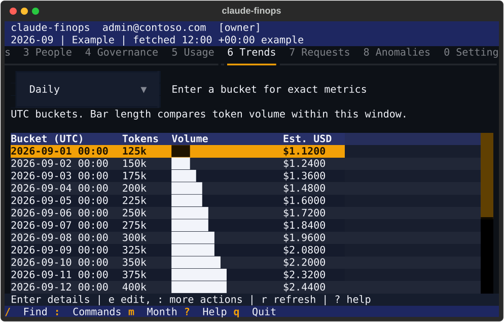
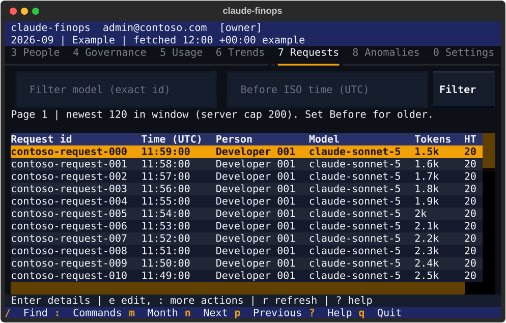
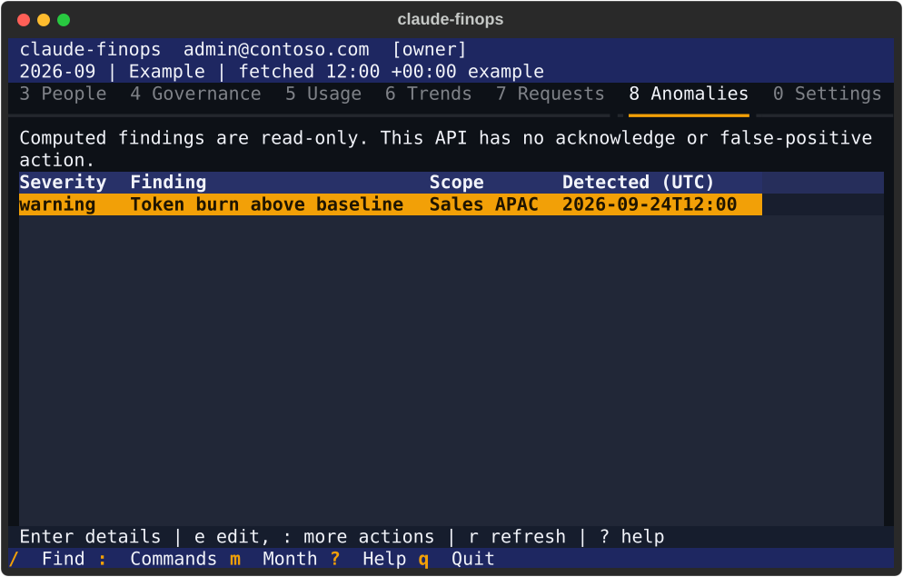
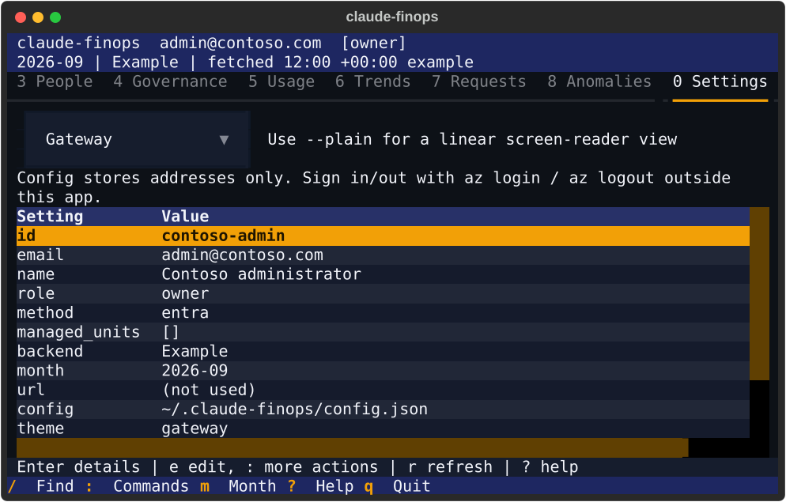

# Manage Claude gateway budgets from the terminal

`claude-finops` is a terminal FinOps console for Claude Code on Microsoft Foundry.
Run it without arguments for a full-screen app. Add a command for automation.
Both faces use the same backend, validation and preview rules.

This first release covers the nine views and 17 method-and-route combinations
listed in the [parity manifest](../cli/finops/src/claude_finops/parity.json).
It is not the entire revision 4 roadmap: approvals, expiring boosts, bulk person
allocation, assistant chat, enforcement-mode authoring and Turnstile's separate
model gateway administration are not included.

> [!IMPORTANT]
> Budget counters are delayed brakes, not exact spend guarantees. Cost is estimated,
> not reconciled to an Azure invoice. A saved budget is not proof of enforcement.
> The terminal follows the apply job and reports its result without claiming more.

## Prerequisites

- Python 3.12 or later and a terminal at least 80 columns by 24 rows.
- Azure CLI, signed in as a person in the gateway's Microsoft Entra tenant.
- For Turnstile: its HTTPS API origin, delegated API scope, and an assigned
  `Turnstile.Admin`, `Turnstile.Viewer` or `Turnstile.Manager` role.
- For direct mode: PowerShell 7, a checkout of this repository, and Azure roles to
  read the gateway and Log Analytics. Changes require named-value write permission.
  Direct mode is not a delegated manager boundary.

## Install

From the repository root in PowerShell:

```powershell
python -m venv .venv-finops
.\.venv-finops\Scripts\python.exe -m pip install -e 'cli/finops[test]'
.\.venv-finops\Scripts\Activate.ps1
claude-finops --help
```

If activation is restricted, use `.\.venv-finops\Scripts\claude-finops.exe` directly.
`pipx` is not required. On Linux or Cloud Shell, activate
`.venv-finops/bin/activate` and use the same package-install command.

Try the example data before connecting:

```powershell
claude-finops --backend fake --month 2026-09
claude-finops budget list --backend fake --month 2026-09 --json
```

Example changes last only for the process. They never call Azure.

## Sign in and connect

```powershell
az login --tenant <your-tenant-id>
claude-finops whoami `
  --url https://api-turnstile.contoso.com `
  --scope api://00000000-0000-0000-0000-000000000000/Turnstile.Manage
```

The app obtains a bearer token through
`az account get-access-token --scope <scope> --query accessToken -o tsv`.
The token is held in memory only; it is never put in a config file, screenshot,
log or report. A read can refresh an expired token once. Writes are never
automatically repeated.

Create `%USERPROFILE%\.claude-finops\config.json` (or
`~/.claude-finops/config.json`) with addresses only:

```json
{
  "backend": "turnstile",
  "url": "https://api-turnstile.contoso.com",
  "scope": "api://00000000-0000-0000-0000-000000000000/Turnstile.Manage",
  "theme": "gateway",
  "ascii": false
}
```

Alternatively, set `resource_group` and `apim_name`. An administrator who can read
the gateway's `turnstile-integration` named value can omit `url` and `scope`; the
app reads the version-1, semicolon-separated connection published by
`Connect-ClaudeTurnstile.ps1`. A reader without gateway access should use the
explicit address and scope instead.

Select another config with `--config .\contoso-finops.json` or the
`CLAUDE_FINOPS_CONFIG` environment variable. Command-line options override that
file. To change profile or backend, exit and restart with the desired config.
Sign out outside the app with `az logout`.

### Connect directly to the gateway

```json
{
  "backend": "direct",
  "resource_group": "rg-contoso",
  "apim_name": "apim-contoso",
  "repository": "C:\\work\\claude-code-foundry-gateway",
  "workspace": "00000000-0000-0000-0000-000000000000"
}
```

`workspace` is the Log Analytics **Workspace ID**, not the ARM resource id.
Publish the repository's queries with `scripts/Publish-ClaudeQueries.ps1` first.
Money views use the published `ClaudeCost` function, including its price-book
and current-membership data. Request detail uses `analytics/chargeback-ledger.kql`.
No query is passed through an Azure CLI argument containing a pipe.

Direct changes invoke `scripts/Invoke-ClaudeFinOps.ps1`, which uses the existing
registry serializers and `Set-ClaudeTier.ps1`. If Turnstile owns governance,
direct writes are refused rather than later overwritten by its apply job.
The adapter checks effective ARM permissions before exposing edit actions.

Direct-mode differences:

- Gateway limits are current, not historical versions. Only the current month
  can be changed.
- New units and teams initially have no monthly budget; use `budget set` next.
  Display labels come from their Entra groups. Manager-group authoring needs Turnstile.
- Person monthly budgets require Turnstile. For the separate daily gateway
  override, use the repository's `Set-ClaudeBudget.ps1`.
- Cost facts are daily, not hourly. Cache writes are unavailable; prices are a
  lower bound. Unknown per-request cost/cache fields remain null.
- There is no Turnstile apply job or anomaly-rule engine. The app says so; an empty
  direct anomaly view is not an all-clear.
- Multi-value catalog/tier changes are not transactional. After a failure, refresh
  and inspect the actual state before retrying.

## Use the terminal app

```powershell
claude-finops
claude-finops --month 2026-09 --theme high-contrast
claude-finops --no-color --ascii
claude-finops status --plain
```

The header shows identity, role, month, backend and fetch time with a UTC offset.
Fetch time is not ingestion time: the ledger can lag.
The footer shows actions available on the current screen and for your role.
At 80 columns, the tab strip scrolls; number keys always reach hidden tabs.

| Key | Action |
|---|---|
| `1`–`8`, `0` | Open the numbered tab; `0` opens Settings |
| `Tab`, `Shift+Tab` | Move focus; arrows move through tables and choices |
| `Enter` | Open exact values or the full request |
| `/` | Find units, teams, models, people and `request:<id>` |
| `:` | Search commands and available actions |
| `m` | Choose the month |
| `e` | Edit the selected budget, tier or catalog row, for Owners only |
| `a` | Preview Apply now on Governance, for Owners only |
| `n`, `p` | Next and previous page on People or Requests |
| `r` | Refresh the current view |
| `?` | Open the one-screen tour and help |
| `Esc`, `q` | Close a dialog; quit the app |

Lookup searches people only inside the team selected on People. This avoids
fan-out across every team or downloading a directory of 500,000 people.
Enter submits the search; move to the results and press Enter to open a match.

### Overview

Review allocated unit budgets, forecast, token counts, estimated spend, request
quality and the top units. Enter shows the selected metric at full precision.
Use Usage for other ranking dimensions.



### Budgets

Read units with their indented teams. **Remaining** is budget minus usage.
**Unallocated** is the unit budget minus its children's allocations. These are
different quantities. Enter preserves the complete server record, including its
warning threshold and forecast.


### People

Choose a team, type a name or identifier and press Enter. Search and offset
paging happen on the server, with 50 rows per page. The team headroom uses the
server's full allocation total, not the currently visible rows.



### Governance

Inspect units, teams, member groups, manager metadata, tiers and the last apply.
Enter opens all fields. Owners can edit with `e`, add or remove scopes from the
command palette, and preview **Apply now** with `a`. Members never see edit actions.



### Usage

Pivot between units, teams, people, models and client surfaces. Rankings are
explicitly bounded to the top 100 rows. A chargeback export is different: it
queries **every catalog scope**, so it does not silently export only that ranking.
Open `:` and choose **Export complete chargeback CSV** to save from the terminal.
Exports go under the current folder's `finops-reports` directory and never
overwrite an existing file.



### Trends

Choose daily, hourly or weekly buckets. Bars compare token volume within the
selected window. Enter exposes all metrics for a bucket. Dates in charts and
request columns are explicitly UTC; the header fetch time is local.



### Requests

Filter by model and an ISO **Before** timestamp. The release API returns at most
200 requests and no usable next cursor. The app pages that bounded window in
groups of 50 and tells you when the window ends. It does not pretend that a local
page is a complete server history. Set Before to inspect older windows; retain
overlap at identical timestamps rather than treating this as a lossless export.



### Anomalies

Read severity, scope, time and finding details. The usage-anomalies API is
read-only; acknowledgment and false-positive actions belong to separate
Turnstile APIs and are not shown as nonworking buttons.



### Settings

Inspect who you are, how you authenticated, role and server-supplied management
scope, backend and config. Change the session theme without restarting. Use
`--plain` for linear command output; the full-screen terminal is not a replacement
for screen-reader-friendly output.



[Wide 160-by-48 budget view](images/finops/budgets-160x48.svg).
Every tab also has a wide SVG in the same directory. All screenshots use
`FakeBackend`; none captures a live identity.

## Change a budget safely

1. Open Budgets, select `sales-emea`, and press `e`.
2. Enter `9M`. The form recalculates parent allocation headroom.
3. Select **Preview**. The app refreshes permissions, budgets and allocation.
4. Review before, after and headroom. If lowering below usage or removing a
   budget, type its stable identifier in the confirmation field.
5. Select **Apply**. Inputs changing after a preview invalidate it; a changed
   server record requires a new preview.
6. Wait for the apply result. If it remains pending, open Governance rather
   than submitting the save again.

The server rechecks authorization and budget constraints. There is no API ETag
on whole-catalog or tier replacements: refresh immediately before editing, and
avoid concurrent administrators editing the same collection.

> [!NOTE]
> Person budgets are stored in Turnstile and do not change the gateway's per-person
> daily quotas. Their successful save is labeled **Saved in Turnstile**, not
> **in effect at the gateway**.

## Run commands

Global `--json`, `--plain`, `--what-if`, `--month`, `--backend`, `--config`,
`--url`, `--scope`, `--resource-group`, `--apim-name`, `--theme`, `--no-color`
and `--ascii` options work before or after the noun and verb.
`--what-if` always wins over `--apply`. Reads are already read-only.
Token amounts support `k`, `M` and `B`; dollar strings are rejected rather than
converted with an unstated price assumption.

| Task | Example |
|---|---|
| Identity and role | `claude-finops whoami --json` |
| Month status | `claude-finops status --month 2026-09 --unit sales` |
| Budgets | `claude-finops budget list --month 2026-09` |
| Preview a team budget | `claude-finops budget set team sales-emea 9M --what-if` |
| Save and follow apply | `claude-finops budget set team sales-emea 9M --apply --json` |
| Change warning threshold | `claude-finops budget set team sales-emea 9M --warning 85 --apply` |
| Remove a budget | `claude-finops budget remove team sales-emea --apply --confirm sales-emea` |
| Person monthly budget | `claude-finops budget set person dev@contoso.com 200k --team sales-emea --apply` |
| Search one team's people | `claude-finops people find dev --team sales-emea --offset 0 --limit 50` |
| Governance and last apply | `claude-finops governance show --json` |
| Preview an apply | `claude-finops governance apply --what-if` |
| Start and follow apply | `claude-finops governance apply --apply` |
| Tier limits and models | `claude-finops tier show` |
| Change tier limits | `claude-finops tier set standard --per-minute 20k --per-day 500k --apply` |
| Change tier models | `claude-finops tier set premium --models claude-sonnet-5,claude-opus-5 --apply` |
| Add or edit a unit | `claude-finops catalog set unit sales --name Sales --group contoso-sales --apply` |
| Add or edit a team | `claude-finops catalog set team sales-emea --name "Sales EMEA" --group contoso-sales-emea --parent sales --apply` |
| Store manager metadata | `claude-finops catalog set team sales-emea --manager-group contoso-sales-emea-managers --apply` |
| Remove an empty scope | `claude-finops catalog remove team sales-apac --apply --confirm sales-apac` |
| List a request window | `claude-finops requests list --month 2026-09 --team sales-emea --limit 50` |
| Older requests | `claude-finops requests list --before 2026-09-20T00:00:00Z --limit 200` |
| Full request | `claude-finops requests show <request-id> --json` |
| Anomalies | `claude-finops anomalies list --month 2026-09` |
| Usage pivot | `claude-finops usage show --dimension model --split-by department` |
| Trend buckets | `claude-finops trends show --interval day --group-by department` |
| Complete unit chargeback | `claude-finops report chargeback --month 2026-09 --csv > chargeback.csv` |
| Complete team chargeback | `claude-finops report chargeback --month 2026-09 --dimension department --csv` |

Run `<command> --help` for field descriptions. Stable identifiers are used for
changes so duplicate display names cannot select the wrong scope. Manager metadata
does not grant access by itself; the connected server defines and enforces scopes.

## Troubleshoot

| Symptom / exit | What to do |
|---|---|
| `AADSTS50105`, 4 | Ask an administrator to assign your account a Turnstile role. Signing in again cannot grant one. |
| Token missing or HTTP 401, 3 | Run `az login --tenant <tenant-id>`. Check that the configured delegated scope belongs to this Turnstile. |
| HTTP 403, 4 | Check role, account enabled state and managed scope. Members remain read-only in this release. |
| Invalid input or HTTP 422, 2 | Use `YYYY-MM`, a stable scope id and positive whole token amount. Check parent allocation. |
| Scope or route missing, 5 | Check the month and scope. For HTTP 405, deploy the `claude-gateway` fork's API. |
| Conflict, 6 | Refresh and preview again. Do not overwrite a concurrent change. |
| Network, job or service failure, 7 | Check VPN, HTTPS origin, Azure permissions and job logs. A failed response does not justify repeating a write blindly. |
| Apply pending after three minutes, 8 | Run `governance show`. The save may have succeeded; wait for its execution. |
| Direct money query unavailable | Publish `ClaudeCost` with `Publish-ClaudeQueries.ps1`; verify workspace and Log Analytics access. |
| Empty view | Check month, server scope and ingestion lag. Missing data is not proof of zero spend. |
| Box characters do not render | Use `--ascii`, or `--plain` for linear output. |

Successful commands exit 0. `--json` domain errors include `error` and `exit_code`.
Argument-parser usage errors exit 2 with standard CLI help.

## Validate a checkout

```powershell
.\.venv-finops\Scripts\python.exe -m pytest cli\finops\tests -q
pwsh -NoProfile -File tests\Test-FinOps.ps1
node .ironclad\gate.mjs --stage packet
```

`tests/Test-All.ps1` runs the CLI tests when this worktree's venv exists; otherwise
it prints a clear skip without changing any existing checks.

To intentionally update example screenshots after reviewing a UI change:

```powershell
.\.venv-finops\Scripts\python.exe cli\finops\tools\capture.py
```

This calls Textual's `save_screenshot` for every tab at 80-by-24 and 160-by-48,
and records the terminal grids used by regression tests. It never connects live.

The optional `cli/finops/tools/live_read.py` runs the five live read journeys in
both faces and records redacted counts and equality checks. It never writes a
budget or saves a live screenshot. Pass `--url`, `--scope`, `--month` and a local
`--out` evidence path.
