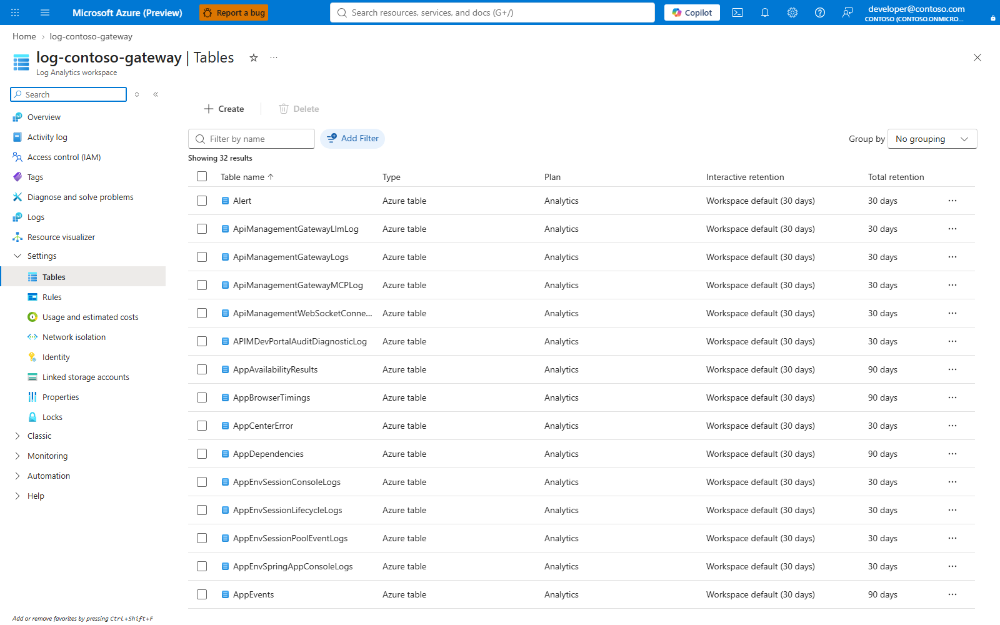

# Review retention and handle a data-subject request

For privacy/security owners and authorised platform operators. Start with
[Authentication: data locations](AUTHENTICATION.md#what-data-lives-where).
Default gateway telemetry excludes prompt/reply bodies, but optional client
capture, local histories, exports and connected systems can hold them.

## Prerequisites

- An approved request identifying the subject, required time window and systems
  in scope. Purge is destructive and not routine log housekeeping.
- The subject's Entra object ID, especially if the account has been deleted or
  renamed. Entra ID > Users > Overview supplies it while the account exists.
- Explicit gateway and telemetry targets from
  [Operations](OPERATIONS.md#1-select-the-gateway-and-workspace).
- Query access for discovery; **Data Purger** on the workspace for erasure.
  A resource lock does not prevent this data operation.
- PowerShell **7** and Azure CLI. The purge script uses `-SkipHttpErrorCheck`,
  which is not available in Windows PowerShell 5.1.

## 1. Review collection and retention

**Portal:** APIM > APIs > Claude API > Diagnostics, then the linked Application
Insights resource and Log Analytics workspace > Tables > Manage table.
Review the configured data, table plan and retention with the privacy owner.
Client content capture is a separate MDM/local setting, not an APIM portal switch.
See [Migration](MIGRATION.md#where-history-lives-afterwards-local-or-cloud).

In **Tables**, locate the actual table, open **Manage table**, and inspect its
**Table plan** and retention settings. Do not change a plan or retention period
merely to complete an inspection; obtain the privacy owner's approval first.

**Pending batch capture (`docs-review-workspace-tables`).**



Choose retention before enabling capture. A lower-cost table plan can forfeit
selective purge: the recorded U7 constraints allow Analytics-plan tables, not
Basic/Auxiliary. Exports and Sentinel data-lake mirrors have separate lifecycles.

## 2. Discover before deleting

```powershell
./scripts/Find-ClaudeUserData.ps1 -User '<subject-object-id>' -Since 90 `
    -ResourceGroup '<gateway-resource-group>' -ApimName '<apim-name>' -AsJson
```

**Portal/manual:** open the discovered Log Analytics workspace > Logs. For
example, inspect the subject predicate before using it in any deletion:

```kusto
AppMetrics
| where TimeGenerated >= ago(90d)
| where tostring(Properties.UserId) == "<subject-object-id>"
| summarize rows=count(), earliest=min(TimeGenerated), latest=max(TimeGenerated)
```

Repeat for the actual tables and identity fields, not a guessed list. The finder
currently covers `AppMetrics`, `AppEvents`, `AppRequests`, `AppTraces` and
`AppGenAIContent` in the workspace behind the gateway's Application Insights.
For `AppGenAIContent`, the identity field is `Attributes.UserId`.

This is **not an organisation-wide discovery API**. It does not inventory other
workspaces, the raw LLM ledger through a correlation join, Turnstile/PostgreSQL,
Cosmos, local clients, backups, exports or a separate OTEL collector. No rows
found is not proof no data exists: verify query permissions, expected tables
and ingestion paths first.

## 3. Preview and approve the purge

```powershell
./scripts/Remove-ClaudeUserData.ps1 -User '<subject-object-id>' -Since 90 `
    -ResourceGroup '<gateway-resource-group>' -ApimName '<apim-name>'
```

Without `-Execute`, this is a preview. Confirm the subject, workspace, table
plans and expected counts. `-Since` is a rolling lower bound in days, not an
absolute from/to range. For a legally required fixed window, use a separately
reviewed Purge API predicate with both time bounds; do not invent `-From` or
`-To` parameters.

**Portal/manual:** workspace > Properties provides the resource ID; Logs verifies
the predicate. There is no portal button equivalent to this script's subject
discovery and per-table purge. An authorised operator can use the
[Azure Monitor Purge API](https://learn.microsoft.com/azure/azure-monitor/logs/personal-data-mgmt)
from Azure Cloud Shell after reviewing the table, identity key and time filters.
Application Insights aliases such as `customMetrics` are not valid purge table
names; use workspace names such as `AppMetrics`.

## 4. Execute and verify completion

Only after approval, repeat the exact reviewed command with `-Execute`.
Keep every returned operation ID and status URL in the restricted case record.
`-Wait` polls accepted operations; it is not a promise of immediate deletion.

The recorded U7 limits are **one table per request**, **50 requests/hour** and
a formal **30-day completion SLA**, with no expedite route. Check the current
service reference before making a commitment; the documented limit's scope is
not established in this repository.

**Verify:** inspect every accepted operation until complete, then rerun the
reviewed queries for the same subject/window. Check failed and non-purgeable
tables individually; success for one table is not success for the whole case.
Coordinate separately with the owners of all other data locations in step 2.
Deletion does not change Azure billing or revoke inference entitlement.

## Troubleshoot and next steps

| Symptom | Action |
|---|---|
| Cannot resolve an old UPN | Use the case's verified object ID |
| Preview says non-purgeable | Confirm table plan; escalate to the privacy owner rather than hiding the result |
| No request accepted | Check workspace scope and Data Purger rights; inspect each reported failure |
| Operation remains pending | Track its status; do not claim deletion before completion |
| User still calls the gateway | Follow [revocation](ONBOARDING.md#5-revoke-access); data purge is unrelated |

[U7](UNKNOWNS.md) records the constraints and research.
[FinOps](FINOPS.md) covers usage exports; treat those exports as separate copies
with their own access and retention.
