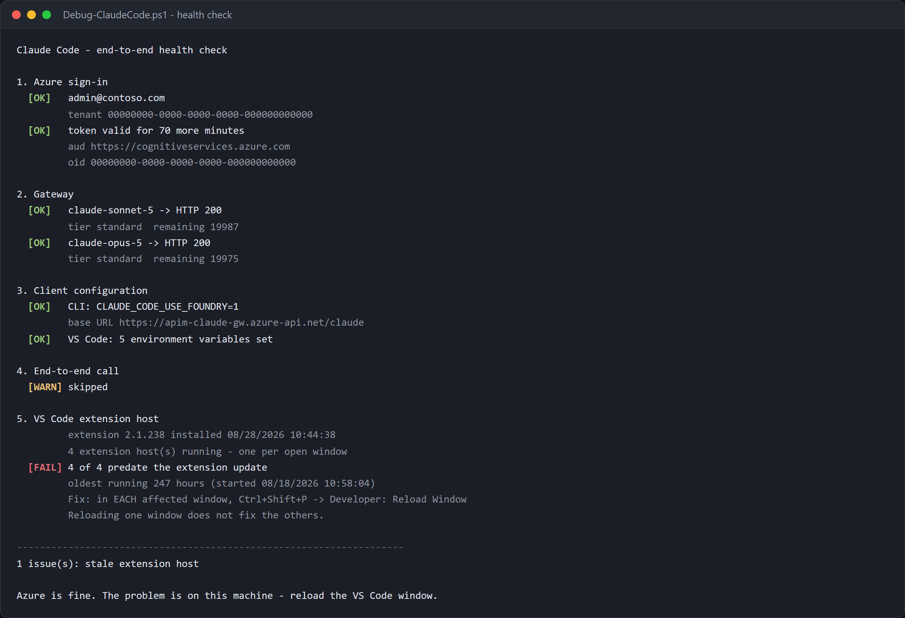

# Debug guide — isolating a failure

[TROUBLESHOOTING.md](TROUBLESHOOTING.md) is a symptom → fix lookup table. Use it
when you already know what broke.

This guide is for when you do **not** — a request fails and you need to find out
where. It bisects the path layer by layer, so each step eliminates everything
below it.

## Prerequisites

Developers need their supplied gateway URL, permitted model names and an Entra
sign-in. Platform checks also need Reader access to APIM/Foundry and telemetry
query access; writes need the roles in [Setup](SETUP.md#2-permissions-and-roles).
Use [Operations](OPERATIONS.md#1-select-the-gateway-and-workspace) to find the
gateway group, Foundry group and correct workspace. Do not grant a developer
direct Foundry access to make a gateway diagnostic pass.

Run script examples from the repository root. The manual HTTP example below
uses PowerShell 7; script-supported hosts are listed in each script's help.
Retain UTC time, status, error body and client version, but redact identities
and never include bearer tokens in a public report.

---

## Step 0 — Run the health check

Before reading any of this, run the whole bisection in one command:

```powershell
./scripts/Debug-ClaudeCode.ps1 `
    -GatewayBaseUrl https://<apim>.azure-api.net/claude `
    -AppInsightsId <app-insights-app-id>
```

It checks sign-in and token expiry, the gateway per model, CLI and VS Code
configuration, a real end-to-end call, and whether the VS Code extension host is
stale — then names the layer at fault.



`-AppInsightsId` is the Application Insights **AppId**, not the resource id:

```bash
az resource show -g <rg> -n appi-claude-gateway \
  --resource-type Microsoft.Insights/components --query properties.AppId -o tsv
```

Supplying it enables the check that matters most: whether the call **arrived**.
A successful `claude -p` that produces no gateway traffic means Claude Code is
answering from somewhere other than your gateway, which no other check catches.

> Telemetry ingestion lags by a couple of minutes, so the script waits 90
> seconds before querying. Do not shorten that — a query run immediately after
> the call returns nothing and looks exactly like a bypass. That misdiagnosis is
> why the wait is there.

---

## The request path

Every failure lives at exactly one of these hops.

```
  developer machine
        │  0. VS Code extension host is current?
        │  1. az login → Entra token (oid, upn)
        ▼
  APIM gateway
        │  2. validate-azure-ad-token      → 401
        │  3. tier lookup, allowlist       → 403
        │  4. llm-token-limit per minute   → 429
        │  5. llm-token-limit daily quota  → 403
        │  6. swap in gateway managed identity
        ▼
  Microsoft Foundry
        │  7. RBAC on the account          → 401
        │  8. deployment exists            → 404
        ▼
  claude-sonnet-5 / claude-opus-5
```

---

## Everything checks out but the panel is still broken

Worth its own section because it is common, it looks nothing like a
configuration fault, and every other check passes.

**The VS Code extension host holds the build that was current when the window
opened.** The extension auto-updates on disk; the running host does not pick
that up. A window left open for days can be several versions behind, and the
symptom is a Claude Code panel that fails while the CLI works perfectly.

Observed case: a window running for **171 hours** across **7 extension
updates**, with a healthy tenant, a healthy gateway, valid tokens, correct
settings on both the CLI and VS Code side, and a `claude -p` that returned
normally and reached the gateway.

**Each open window has its own extension host.** Reloading one does not fix the
others — in the case above there were four, all stale.

```powershell
# is any extension host older than the installed extension?
./scripts/Debug-ClaudeCode.ps1 -GatewayBaseUrl <url> -SkipLiveCall   # section 5
```

**Fix:** in **each** affected window, `Ctrl+Shift+P` → **Developer: Reload
Window**. If it persists, quit VS Code entirely — a stale helper process can
survive a reload.

> **Do not check this by looking at the Code.exe start time.** Reload Window
> restarts the renderer and the extension host but leaves the main process
> running, so that timestamp never changes and the check reports "stale"
> forever, including after a successful reload. The first version of
> `Debug-ClaudeCode.ps1` had exactly this bug.
>
> The host is also not `--type=extensionHost` on current builds — on Windows it
> is a utility process with a `node.mojom.NodeService` sub-type. Searching for
> `extensionHost` finds nothing and looks like the host is missing.

> Suspect this first whenever the **CLI works and the panel does not**. That
> asymmetry almost always means the two are running different builds, or reading
> different configuration — shell exports never reach the extension host, so
> VS Code needs `claudeCode.environmentVariables` or `.claude/settings.json`.

---

## Step 1 — Read the response headers first

Read the status, body and available headers together. Not every refusal passes
through the same outbound/error policies, so not every header is present.

```powershell
$tok = az account get-access-token --resource https://cognitiveservices.azure.com --query accessToken -o tsv
$r = Invoke-WebRequest -Method Post -Uri "https://<apim>.azure-api.net/claude/v1/messages" `
  -Headers @{
    Authorization      = "Bearer $tok"
    'anthropic-version'= '2023-06-01'
    'Content-Type'     = 'application/json'
  } `
  -Body '{"model":"claude-sonnet-5","max_tokens":16,"messages":[{"role":"user","content":"say OK"}]}' `
  -SkipHttpErrorCheck
$r.StatusCode
$r.Headers | Format-Table -AutoSize
```

> Windows PowerShell 5.1 has no `-SkipHttpErrorCheck`. Use PowerShell 7, or wrap
> the call in `try/catch` and read `$_.Exception.Response`.

**Portal/manual:** a platform operator can inspect APIM > APIs > Claude API >
Test, using an approved test identity, and correlate its request with the
workspace logs. A developer can run the HTTP example without portal access.
The test console's own authentication is not proof of the developer's sign-in.

What the headers tell you:

| Header | Present when | Means |
|--------|--------------|-------|
| `x-governed-by` | request reached the policy | the gateway is in the path at all |
| `x-claude-tier` | tier resolved | `standard` / `premium` — confirms which allowlist matched |
| `x-ratelimit-remaining-tokens` | per-minute limit applied | your remaining minute budget |
| `x-quota-remaining-today` | daily quota applied | remaining daily budget |
| `x-tokens-consumed` | backend responded | quota scalar for the call, not complete billable usage or dollars |
| `Retry-After` | `429` | seconds until the minute budget resets |
| `x-gateway-error` | policy raised the error | **the gateway rejected you, not Foundry** |

**`x-gateway-error` means the gateway's error handler ran.** It can also report
backend connection failures, so it does not prove Foundry was never attempted.
An absent header does not prove the gateway was bypassed: explicit
`return-response` branches need not run that handler.

---

## Step 2 — Narrow by status code

| Code | Layer | Go to |
|------|-------|-------|
| `401` with `x-gateway-error` | identity | [Step 3](#step-3--identity) |
| `403` | read the body: entitlement, model, unit assignment or quota | [Step 4](#step-4--entitlement-and-budget) |
| `429` | token/request limit, miss admission or Foundry capacity | [Step 4](#step-4--entitlement-and-budget) |
| `503` naming entitlement/projection | unavailable resolver or expired projection lease | [Private projection troubleshooting](SECURE-PROJECTION.md#troubleshooting) |
| `401` **without** `x-gateway-error` | gateway → Foundry RBAC | [Step 5](#step-5--gateway--foundry) |
| `404` | wrong path or missing deployment | [Step 6](#step-6--foundry-itself) |
| `500` | usually a missing named value | [Step 7](#step-7--policy-and-configuration) |
| timeout / no response | network or a very long agent turn | [Step 8](#step-8--client-configuration) |

---

## Step 3 — Identity

```powershell
az account show --query "{tenant:tenantId, user:user.name, type:user.type}" -o table
```

Then decode what you are actually sending. The `oid` is what the gateway
compares against the allowlists:

```powershell
$t = az account get-access-token --resource https://cognitiveservices.azure.com --query accessToken -o tsv
$p = $t.Split('.')[1].Replace('-','+').Replace('_','/')
while ($p.Length % 4) { $p += '=' }
[Text.Encoding]::UTF8.GetString([Convert]::FromBase64String($p)) | ConvertFrom-Json |
  Select-Object oid, upn, unique_name, tid, aud, appid
```

Check, in order:

| Claim | Must be | If wrong |
|-------|---------|----------|
| `tid` | the tenant hosting the gateway | `az login --tenant <tenant-id>` — **the usual cause for guests** |
| `aud` | `https://cognitiveservices.azure.com` or `https://ai.azure.com` | you requested the wrong resource scope |
| `oid` | present | service principals differ from users; use the SP object id, not the app id |
| `exp` | in the future | token expired — re-run `az login` |

**Portal:** Entra ID > Sign-in logs helps the identity administrator diagnose
issuance/Conditional Access. Decode claims locally; the portal does not show
the access token the affected process actually selected.

> A guest account's `upn` often looks like
> `user_home.com#EXT#@hosting-tenant.onmicrosoft.com`. That is normal. The
> allowlists key on `oid`, so the odd-looking UPN is not the problem.

---

## Step 4 — Entitlement and budget

### Is the object id entitled?

```bash
az apim nv show -g <rg> --service-name <apim> --named-value-id allow-standard --query value -o tsv
az apim nv show -g <rg> --service-name <apim> --named-value-id allow-premium  --query value -o tsv
```

Not there → they are in the Entra group but the sync has not run:

```powershell
./scripts/Sync-ClaudeAccess.ps1 -ApimName <apim> -ResourceGroup <rg>
```

This checks the **named-value** path only. On a projection gateway, inspect the
record and lease and run the [projection comparison](SCALE.md#4-run-the-comparison-until-it-reports-nothing).
Absence from an old named-value list is not proof of a missing projection record.
**Portal:** Entra > Groups > All members, then APIM > Named values or Cosmos >
Data Explorer from an authorised private-network client. Publication is required
after a group edit.

### Is it a budget rejection instead?

`429` and quota-`403` are working-as-intended, not faults.

| Code | Meaning | Resolution |
|------|---------|-----------|
| `429` + `Retry-After` | token/request rate, resolver admission or Foundry capacity | read the body and honour the delay; inspect the corresponding limit |
| `403`, `rate_limit_error` | budget spent | `budget` names personal/organisation/business unit; raise only an approved limit or wait for its period |
| `403`, `permission_error` / `model_not_allowed` | entitlement, unit assignment or model policy | correct the published mapping or permitted deployment, not the quota |

Raising a quota does not reset consumption, but can unblock a caller if the new
quota exceeds the consumed amount. Moving to premium cannot bypass an
organisation or unit ceiling. See [Budgets](BUDGETS.md).

**Portal:** APIM > Named values shows configured limits; a new caller request
proves the applied limit after propagation. Do not diagnose every `403` as an
empty entitlement list or rely on an absent message.

---

## Step 5 — Gateway → Foundry

A `401` with **no** `x-gateway-error` means the policy accepted you and Foundry
rejected the gateway.

```bash
# 1. does the gateway have an identity at all?
az apim show -g <rg> -n <apim> --query "identity.principalId" -o tsv

# 2. does that identity hold the data-plane role?
az role assignment list \
  --assignee <principal-id> \
  --scope $(az cognitiveservices account show -g <rg> -n <foundry> --query id -o tsv) \
  --query "[].roleDefinitionName" -o tsv
```

Expect `Cognitive Services User`.
**Portal:** APIM > Identity > System assigned; Foundry account > Access control
(IAM) > Role assignments, including inherited assignments. Use the Foundry
account's resource group, not automatically the gateway's.

| Finding | Fix |
|---------|-----|
| No principal id | System-assigned identity is off. Turn it on, then re-create the role assignment |
| Role is `Owner` or `Contributor` only | Those are control-plane roles and grant **no** data-plane access. Add `Cognitive Services User` |
| Role is correct, still `401` | Propagation. Wait 2–5 minutes |
| Assignment vanished | It is scoped to the Foundry account; recreating that resource drops it |

---

## Step 6 — Foundry itself

Take the gateway out of the picture entirely:

```powershell
./scripts/Test-FoundryDirect.ps1 -Resource <foundry-account>
```

Seven checks: CLI sign-in, token acquisition, deployment discovery, the Messages
API, the Claude Code install, provider resolution, and an end-to-end call.

- **All pass** → Foundry is healthy; the fault is in the gateway or the policy.
  Go back to Step 5, then Step 7.
- **Any fail** → fix Foundry first. The gateway cannot be healthier than its
  backend.

> This needs you to hold `Cognitive Services User` directly, which by design you
> normally should not. Grant it temporarily and remove it afterwards — see
> [Setup §4.2](SETUP.md#42-close-the-bypass).

Two `404`s that look alike and are not:

| Body | Cause |
|------|-------|
| `api_not_supported` | an OpenAI-shaped path. Claude deployments expose only `/anthropic/*` |
| `DeploymentNotFound` | a model alias pointing at something you do not host. Foundry mode does no start-up model check, so this surfaces mid-task |

---

## Step 7 — Policy and configuration

```bash
# do all referenced named values exist?
az apim nv list -g <rg> --service-name <apim> --query "[].name" -o tsv
```

**Portal:** APIM > APIs > Claude API > All operations > Inbound processing >
Policy code editor. Read the API policy, including inherited/global policies.
For a scripted policy read, use the ARM example in
[Governance checks](GOVERNANCE-CHECKS.md#configuration-audits);
`az apim api policy show` is not an Azure CLI command.

A `{{name}}` in the policy with no matching named value returns `500`.

| Symptom | Cause |
|---------|-------|
| `500` on every request | missing named value |
| Policy edit appears not to apply | `az rest` on Windows throws `charmap codec can't encode '\ufeff'` **after a successful PUT**. Verify with a GET before retrying |
| `An XML comment cannot contain '--'` | a `--` inside an XML comment. The error does not mention comments |
| Limits never trigger | classic APIM tier — Anthropic token parsing needs **v2**. Check `az apim show --query "sku.name"` |

---

## Step 8 — Client configuration

If there is no evidence the request reached the gateway, check the configured
provider and URL, then the correct diagnostic destination. Missing headers or
temporarily empty Live metrics alone do not prove the request went elsewhere.

```powershell
claude auth status
```

```json
{ "loggedIn": true, "authMethod": "third_party", "apiProvider": "foundry" }
```

| Symptom | Cause |
|---------|-------|
| `apiProvider` is not `foundry` | `CLAUDE_CODE_USE_FOUNDRY=1` not set |
| `baseURL and resource are mutually exclusive` | both `ANTHROPIC_FOUNDRY_BASE_URL` and `ANTHROPIC_FOUNDRY_RESOURCE` set — keep only the base URL for gateway mode |
| `CLAUDE_CODE_USE_AZURE` has no effect | it does not exist; the variable is `CLAUDE_CODE_USE_FOUNDRY` |
| Extension prompts for Anthropic sign-in | settings not picked up. **Developer: Reload Window**; shell exports do **not** reach the extension host — use `.claude/settings.json` or `claudeCode.environmentVariables` |
| Panel fails while the CLI works | the extension host is running an older build than the one on disk. Reload the window — see [above](#everything-checks-out-but-the-panel-is-still-broken) |
| `/status` unavailable | terminal-only; use `claude auth status` in the panel |

### See exactly what is on the wire

The historical `scripts/inspect-proxy.mjs` helped establish the token/claim
shape. **Do not run it unchanged against a customer session:** it has a
hard-coded upstream and does not explicitly bind only to loopback. It can bypass
the selected gateway and prints other request headers and personal claims.

Use the supported diagnostic script, approved network tracing or the
[non-intercepting observer](NETWORK.md#5-how-this-was-measured). Any adapted
inspector needs an approved target, local-only binding and redaction review
before it handles credentials. There is no Azure portal substitute for seeing
which token a local client chose.

---

## Step 9 — Is it just this person?

```powershell
./scripts/Show-Governance.ps1 -ApimName <apim> -ResourceGroup <rg>
```

If all four controls pass for the test identities, the gateway is healthy and the
problem is specific to the affected user — go back to Step 3.

If they fail, it is platform-wide. Start at Step 5.

---

## Quick reference

| Signal | Layer | Section |
|--------|-------|---------|
| Everything passes but the panel fails | stale extension host | [above](#everything-checks-out-but-the-panel-is-still-broken) |
| CLI works, VS Code does not | different build or different config | [above](#everything-checks-out-but-the-panel-is-still-broken) |
| `x-gateway-error` present | gateway error handler ran; inspect the reason | Steps 3–5 |
| `x-gateway-error` absent, `401` | Foundry rejected the gateway | Step 5 |
| No `x-governed-by`, no Live metrics traffic | verify route, diagnostic destination and ingestion before concluding bypass | Step 8 |
| `429` + `Retry-After` | working as designed | Step 4 |
| Metrics all zero | classic APIM tier | [Monitoring §8](MONITORING.md#8-when-the-charts-are-empty) |
| Metrics exist, no per-user split | `CustomMetricsOptedInType` | [Monitoring §8](MONITORING.md#8-when-the-charts-are-empty) |
