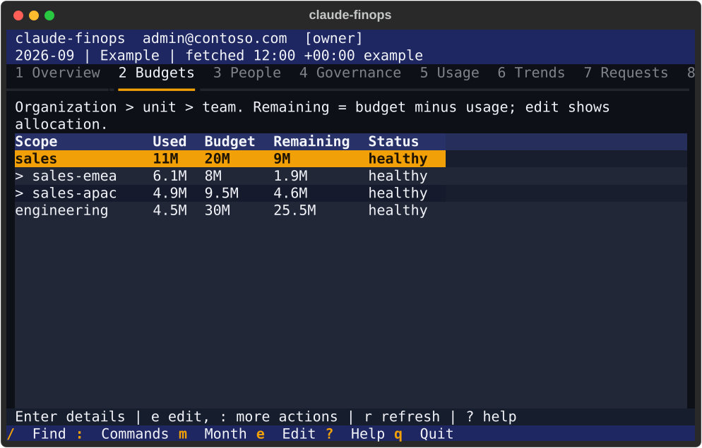
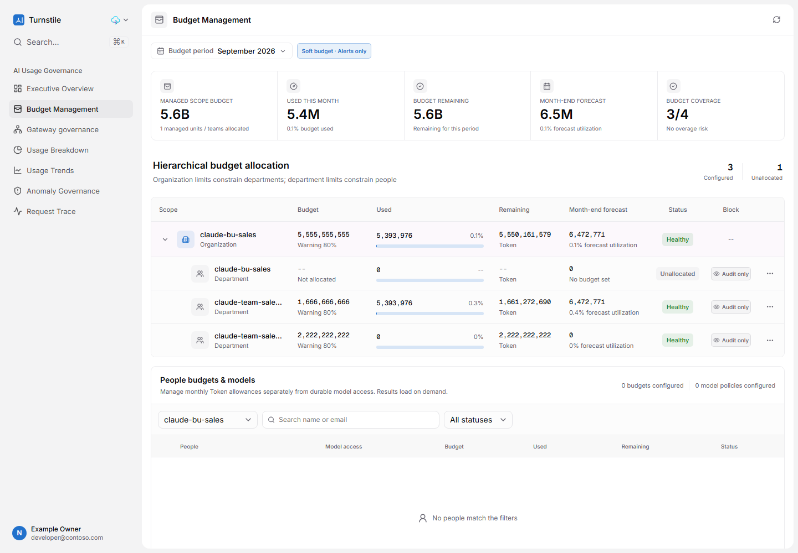
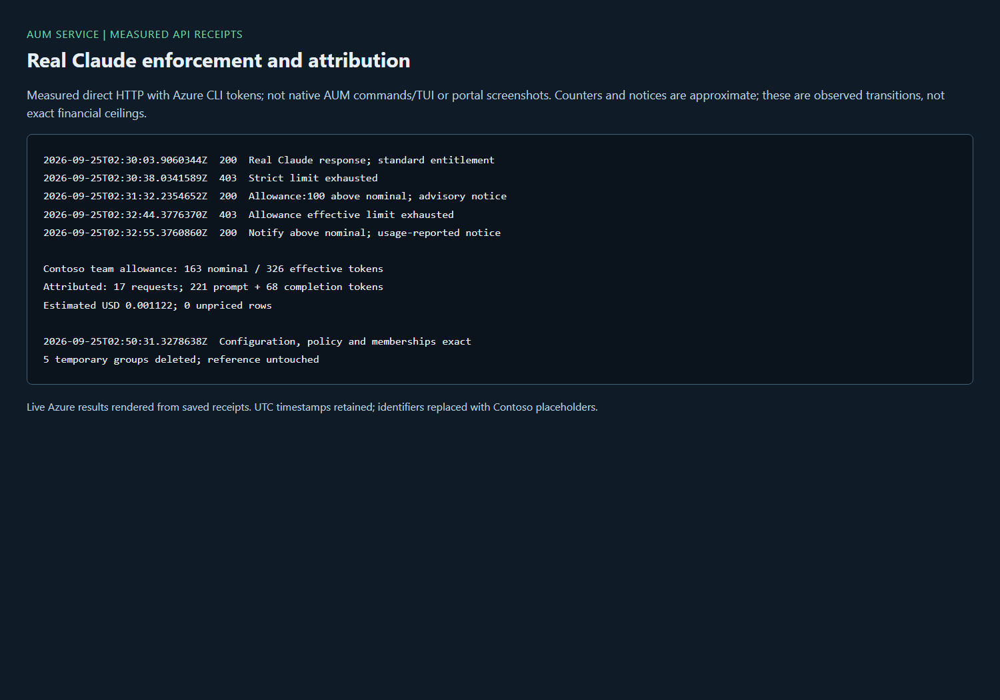
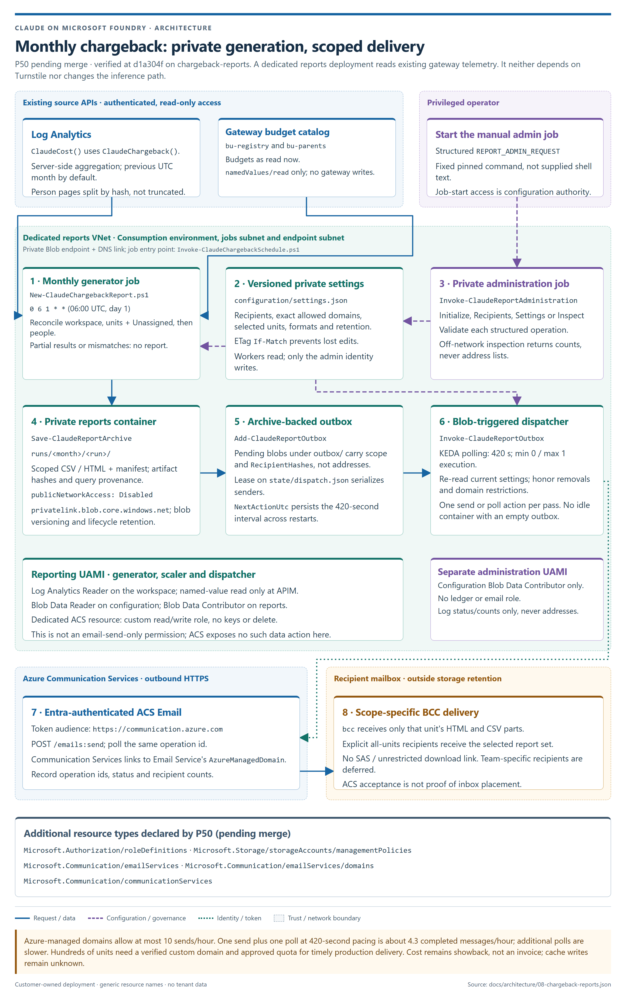

# FinOps tools: choose one, sign in, run it end to end, and what it costs

The gateway enforces every limit. The FinOps tools only author budgets and report on usage,
and each of them works by writing the gateway's named values or reading its ledger in Log
Analytics. This guide puts them side by side. It covers what each tool is for, how each person
signs in, the end-to-end steps for each, and the bill of materials with list prices. The detail
for each tool is in its own guide, linked from every section.

Prices below are Azure list prices read from [prices.azure.com](https://prices.azure.com) on
**2026-09-25** for **East US 2**, at 730 hours a month, unless a line says otherwise. No
agreement, reservation or private-offer discount is applied, and Claude tokens are billed on
your Foundry agreement, not in these totals. Every figure has a command that recalculates it
for your own region and deployment; run it rather than reusing these numbers.

> [!IMPORTANT]
> **One write authority per gateway.** Budgets and governance can be authored by the gateway's
> own scripts, by the AUM service, or by Turnstile, but by only one of them at a time. The
> gateway's `turnstile-integration` named value records whether Turnstile owns them. The AUM
> service answers `other_authority`, and the terminal's Direct mode refuses to write, while
> Turnstile owns a gateway. That way two tools never overwrite each other.

## The tools at a glance

| Tool | What it is for | Who uses it | Writes budgets? | Added Azure resources | Standing cost, list |
|---|---|---|---|---|---|
| Saved queries and workbooks | Usage, chargeback and money views in the Azure portal; KQL functions any tool can call | Anyone with read access to the workspace | No | None: a saved function and a workbook are definitions | **$0**; query charges depend on the table plan |
| PowerShell scripts | Every read and write, scriptable; the reference implementation the other tools reuse | Azure administrators | Yes, when the gateway owns governance | None | **$0** |
| Terminal FinOps (`claude-finops`) | Keyboard-first dashboard and commands over one engine: budgets, people, governance, usage, trends, requests, reports | Administrators (Direct); administrators, viewers and scoped managers (through Turnstile) | Direct: yes, through the scripts. Through Turnstile: Turnstile's own rules | None: runs on the operator's machine | **$0** |
| AUM service | An independent authority without Turnstile: its own roles, scoped managers, audited conditional writes, budget requests and expiring boosts | Assigned admins, viewers and scoped managers | Yes, with read-back and revisions | Azure Functions, Storage; optional Application Insights and private networking | **About $0 fixed** plus execution; **$15.60+/month** when storage must be private |
| Turnstile | Web console: charts, people, requests, governance authoring, manager scope, budget modes | Assigned admins, viewers and scoped managers | Yes, through its apply job | App Service, PostgreSQL, Event Hubs, Functions, registry | **$55.47/month** lean, **$150.54/month** dedicated and private |
| Chargeback reports | Each business unit's monthly CSV and summary, reconciled, archived and emailed | Admins set it up; units receive email | No | A scheduled Container Apps job, Storage, Communication Services | **About $29.70/month** standing networking, plus cents of usage |
| Grafana (optional) | The same saved functions on a Grafana wall | Teams that already run Grafana | No | An Azure Managed Grafana instance you provide | Essential **$6 per user-month**; Standard **$0.03 per node-hour** plus users |

Terminal FinOps is being renamed **AUM (Azure Usage Management)**. Direct is becoming the
default and it gains an AUM service backend (packet P52, in progress). This guide describes the
merged `claude-finops` command; [AUM](CLI-FINOPS.md) is updated when P52 lands.


## Which one to choose

- **Nobody needs a console:** publish the saved queries and workbooks ([flow 1](#flow-1-reports-with-no-console-and-no-added-cost))
  and run the scripts ([flow 2](#flow-2-budgets-from-scripts)). This adds no cost.
- **Only Azure administrators manage budgets:** add Terminal FinOps in Direct mode
  ([flow 3](#flow-3-terminal-finops-direct)). No server, still $0. Azure RBAC cannot restrict a
  person to some business units inside one gateway, so Direct is for administrators only.
- **Managers must see and change only their own units and teams:** choose an authority with
  server-enforced scope. That is either the **AUM service** ([flow 5](#flow-5-the-aum-service))
  or **Turnstile** ([flow 4](#flow-4-turnstile-and-the-terminal-on-it)). Choose the AUM service
  for the smallest footprint, with budget requests and expiring boosts. Choose Turnstile for a
  web console with charts, an assistant and model pages.
- **Every business unit needs its bill every month:** add chargeback reports
  ([flow 6](#flow-6-monthly-chargeback-reports-by-email)) alongside any of the above.

The selector prints the same choices with live prices, sign-in roles and prerequisites, and
creates nothing until you confirm:

```powershell
./scripts/Select-ClaudeFinOpsTooling.ps1 -Region eastus2
```

For a new gateway, `Install-ClaudeGateway.ps1 -ChooseFinOps` opens the same selector after the
install. [AUM service: choose a FinOps tool](AUM-SERVICE.md#choose-a-finops-tool) has the full
comparison.

## Sign-in

### Who signs in to what

| Person | Saved queries and workbooks | PowerShell scripts | Terminal FinOps | AUM service | Turnstile |
|---|---|---|---|---|---|
| **Administrator** | Azure portal sign-in; Log Analytics Reader on the workspace | `az login`; Azure RBAC on the gateway and workspace | Direct: `az login` and Azure RBAC. Turnstile backend: a Turnstile token from the Azure CLI | `AUM.Admin` app role; token from the Azure CLI | `Turnstile.Admin` app role; web sign-in, or the one-use code |
| **Unit or team manager** | Only if also given workspace read access, which shows everything | Not applicable | Turnstile backend only, read-only; scope comes from Turnstile | `AUM.Manager` plus membership of the unit's or team's manager group | `Turnstile.Manager` plus membership of the manager group |
| **Viewer or finance** | Log Analytics Reader | Not applicable | Turnstile backend, read-only | `AUM.Viewer` | `Turnstile.Viewer` |
| **Developer** | No | No | No | **No role**: developers never use the administrative API | **No role**: refused; no account is created |
| **Scheduled jobs and services** | The reports job reads the workspace | The Turnstile apply job runs the scripts | No | The Function's managed identity | Its apply and usage jobs' managed identities |

A manager sees only the scopes whose manager group is in their own token. The unit budget, the
catalog, tiers, budget modes and **Apply now** stay the administrator's. Details:
[Turnstile managers](TURNSTILE.md#managers) and
[AUM service roles](AUM-SERVICE.md#prerequisites-and-roles).

### The sign-in methods

| Method | How | Used by | Needs from a tenant administrator | Verified |
|---|---|---|---|---|
| **Azure CLI, interactive** | `az login --tenant <tenant-id>` opens the browser (the account broker on Windows) | Scripts, Direct mode, and the source of every API token below | Nothing beyond the person's Azure roles | Daily, on the reference gateway |
| **Azure CLI, device code** | `az login --tenant <tenant-id> --use-device-code`, then enter the code on another device | Headless or remote machines | Nothing; Conditional Access may block device code in your tenant | Not measured here; it needs a person to enter the code |
| **Consent-free API token** | The Turnstile and AUM applications pre-authorize the Azure CLI, so `az account get-access-token --scope <the app's scope>` needs no consent | Terminal FinOps on Turnstile, the AUM service API, `Open-ClaudeTurnstile.ps1` | Only the app-role assignment, which the application's owner makes | Live: Turnstile 2026-09-24, AUM service 2026-09-24 and 25 |
| **Turnstile, Sign in with Microsoft** | The console's button, an ordinary Entra web sign-in | People in a browser | **One-time tenant-wide consent** for `openid`, `profile`, `email`, `User.Read`, by a Cloud Application Administrator or Application Administrator. Until then everyone sees *Need admin approval* (**U19**) | The redirect and the refusal |
| **Turnstile, one-use code** | `az login`, then `./scripts/Open-ClaudeTurnstile.ps1` exchanges the CLI token for a code valid once, for a minute, and opens the browser with it | People in a browser before consent exists, or instead of it | None | Live 2026-09-24: signed in 13.4 s after the link was issued; the replay returned 401 |
| **Turnstile break-glass Owner** | Password sign-in on the console | Emergencies | None; keep the credential in a secret store | Not measured here |
| **Managed identities** | No person: Azure issues the token to the resource | The gateway calling Foundry, the Turnstile apply and usage jobs, the reports job, the AUM service Function | For Turnstile's job to create groups and refresh membership: Graph `GroupMember.Read.All`, granted by a Privileged Role Administrator (**U17**). Budgets and tiers apply without it | Live on every packet |
| **Developers in Claude Code** | Chosen once at install: `interactive`, `device` or `helper`, written into the onboarding file | Claude Code, the VS Code extension, Claude Desktop | Nothing beyond the tier-group membership that entitles them | [The matrix](AUTHENTICATION.md#the-matrix) |


### After someone's role changes

A token carries the roles and groups that were true when it was issued, so a person signs in
again after a change. On Windows the account broker can keep serving the old token.
`--renew-broker-token` in the capture tooling, which uses MSAL's `set_access_token_to_renew`,
renews it without deleting any cache. How long Entra, Turnstile and the AUM service take to
reflect a change on their own is still open (**U21**, [Unknowns](UNKNOWNS.md)).

## End-to-end flows

Every flow starts from a deployed gateway (`Install-ClaudeGateway.ps1`) and `az login`. Scripts
that are not given a value ask for it: they list what they found in Azure, the recommended one
first, and say where to look it up.

### Flow 1: reports with no console, and no added cost

1. Publish the KQL functions to the workspace behind the gateway's Application Insights:

   ```powershell
   ./scripts/Get-ClaudeTelemetry.ps1          # shows that workspace as Workspace
   ./scripts/Publish-ClaudeQueries.ps1        # ClaudeChargeback, ClaudeCost, ClaudeCodeDaily
   ```

2. Publish the usage workbook and the money workbook:

   ```powershell
   ./scripts/Publish-ClaudeWorkbook.ps1 -Name "Claude gateway - platform"
   ./scripts/Publish-ClaudeWorkbook.ps1 -WorkbookFile infra/workbook-chargeback.json -Name "Claude gateway - chargeback"
   ```

3. Open the link each command prints (Azure portal > Monitor > Workbooks), or query from a
   terminal: `./scripts/Get-ClaudeAnalytics.ps1 -Days 30` and `./scripts/Get-ClaudeBusinessUnit.ps1`.


Details: [Monitoring: dashboard](MONITORING.md#7-dashboard) and [FinOps reporting](FINOPS.md).

### Flow 2: budgets from scripts

1. Read what is enforced now: `./scripts/Get-ClaudeBudget.ps1` and `./scripts/Get-ClaudeBusinessUnit.ps1`.
2. Create or change a business unit, team, budget or enforcement mode:

   ```powershell
   ./scripts/Set-ClaudeBusinessUnit.ps1 -Id sales-emea -Group <entra-group-object-id> -MonthlyBudgetUsd 500
   ./scripts/Set-ClaudeBusinessUnit.ps1 -Id sales-emea -Mode allowance -AllowancePercent 10
   ./scripts/Set-ClaudeBudget.ps1 -User <upn> -DailyUsd 20      # one person's daily override
   ./scripts/Set-ClaudeTier.ps1 -Tier premium -TokensPerMinute 80000
   ```

3. Read the values back, then verify a request. Above the limit it is refused with 403, or in
   allowance and notify modes served with a notice
   ([budget modes](BUDGETS.md#business-unit-and-team-enforcement-modes)).

`Set-ClaudeBusinessUnit.ps1` and `Set-ClaudeTier.ps1` refuse writes that Turnstile's next apply
would overwrite. The refusal names the connected Turnstile URL and its **Gateway governance**
or **Budgets** page. With only `budgetAuthority=Turnstile`, `-MonthlyBudgetUsd` is refused, but
group, parent, mode, removal and tier edits remain available. `-List` stays read-only; a failed
authority read stops a mutation rather than assuming the gateway owns it.

Personal daily overrides (`Set-ClaudeBudget.ps1`) and Entra membership
(`Set-ClaudeDeveloper.ps1`) stay gateway/directory-owned: neither Turnstile apply path replaces
them, even with `personBudgets` enabled. That option mirrors tier ceilings **to** Turnstile,
not person limits back to the gateway.

There is no force bypass. To deliberately return both governance and monthly budgets to scripts,
record that choice on the same gateway:

```powershell
./scripts/Connect-ClaudeTurnstile.ps1 -ResourceGroup '<gateway-resource-group>' -ApimName '<gateway-name>' `
    -GovernanceAuthority Gateway -BudgetAuthority Gateway
```

Both switches matter: changing governance alone preserves the recorded budget authority.
Details: [Budgets](BUDGETS.md), [Business units](BUSINESS-UNITS.md) and
[moving authority back](TURNSTILE.md#move-governance-back-to-the-gateway).

### Flow 3: Terminal FinOps, Direct

1. Install it from the repository root:

   ```powershell
   python -m venv .venv-finops
   .\.venv-finops\Scripts\python.exe -m pip install -e cli/finops
   ```
2. `az login --tenant <tenant-id>`, then point it at the gateway. `workspace` is the Log Analytics
   Workspace ID, not the ARM id. `az monitor log-analytics workspace show -g <group> -n <workspace> --query customerId`
   prints it.

   ```json
   { "backend": "direct", "resource_group": "<gateway-resource-group>", "apim_name": "<gateway>",
     "repository": "<path-to-this-clone>", "workspace": "<workspace-id>" }
   ```

3. `claude-finops whoami` shows the identity and `method: azure-rbac`; `claude-finops status` shows
   the month. Run `claude-finops` with no command for the terminal app.
4. Changes preview first and are written only with `--apply`, through the same PowerShell
   serializers as flow 2, and read back.

Measured on the reference gateway on 2026-09-25, read-only: `whoami` returned role `owner`,
method `azure-rbac`. `status` returned the month's 911 requests and 181,158 tokens, with each
unit's budget and headroom. Estimated cost showed **unknown** because 10 usage rows had no
price. Cost is known only when every model used is in the price book
([Claude tokens](#claude-tokens-the-largest-line)).



Details: [Terminal FinOps](CLI-FINOPS.md#connect-directly-to-the-gateway).

### Flow 4: Turnstile, and the terminal on it

1. Create the Entra application with its roles, API scope and pre-authorized Azure CLI:
   `./scripts/New-ClaudeTurnstileEntraApp.ps1`.
2. Deploy Turnstile and add its sign-in redirect ([Turnstile steps 2 and 3](TURNSTILE.md#2-deploy-turnstile)).
   Its standard deployer can also create another API Management instance, about **$700/month**
   for Standard v2. Don't let it, and never repurpose the governed gateway for its integration.
3. Connect the gateway and hand governance to Turnstile:

   ```powershell
   ./scripts/Connect-ClaudeTurnstile.ps1 -TurnstileResourceGroup <turnstile-group> -GovernanceAuthority Turnstile
   ./scripts/Register-ClaudeTurnstileSchedule.ps1 -RunNow
   ```

4. Assign `Turnstile.Admin`, `Turnstile.Viewer` and `Turnstile.Manager` on the enterprise
   application's **Users and groups** page, and give each unit or team its **Manager group** on
   **Gateway governance**.
5. Sign in: **Sign in with Microsoft** once your tenant has consented, or
   `./scripts/Open-ClaudeTurnstile.ps1` before then.
6. Edit budgets, tiers and modes. Each save starts the apply job. Measured: a tier limit reached
   the gateway 112 s after the save, a budget refused the next request 123 s after it, and a mode
   change reached `bu-modes` in 113 s.
7. Optionally, point the terminal at Turnstile (`"backend": "turnstile"` with its URL and scope).
   Managers use it read-only within their scope.




Details: [Turnstile](TURNSTILE.md), [managers](TURNSTILE.md#managers) and
[delegated management](ARCHITECTURE.md#delegated-management-and-console-sign-in).

### Flow 5: the AUM service

1. Create its Entra application with `AUM.Admin`, `AUM.Viewer` and `AUM.Manager`, as its owner:
   `./scripts/New-ClaudeAumEntraApp.ps1`.
2. Discover targets, then preview every cost choice before anything is created:

   ```powershell
   ./scripts/Deploy-ClaudeAumService.ps1 -GatewayResourceGroup <gateway-resource-group> -DiscoveryOnly
   ./scripts/Deploy-ClaudeAumService.ps1 -GatewayResourceGroup <gateway-resource-group>
   ```

   The second run shows each choice with its cost: always-ready instances, redundancy,
   Application Insights, network and storage network. It deploys only after one explicit
   confirmation.
3. Assign the app roles, and map each unit or team to its manager group
   ([roles and manager groups](AUM-SERVICE.md#assign-roles-and-manager-groups)).
4. Call it with a consent-free Azure CLI token. Its Function writes the gateway's named values
   with its managed identity, conditionally and with read-back.

Measured on an isolated Basic v2 gateway on 2026-09-25, then retired:

- Real Claude requests were refused at a strict limit, served above nominal with a notice in
  allowance and notify modes, and attributed in the ledger.
- A fresh manager-only token changed one person's and one team's budget, and four protected
  operations returned 403.
- Everything was restored exactly.



Details: [AUM service](AUM-SERVICE.md), and its [architecture](ARCHITECTURE.md#optional-independent-aum-service-p55).
The terminal's AUM service backend arrives with P52.

### Flow 6: monthly chargeback reports by email

1. Generate one month by hand and check it reconciles:
   `./scripts/New-ClaudeChargebackReport.ps1 -Month 2026-08`. Each unit gets a CSV of its people
   and an HTML summary, and an explicit Unassigned line makes the units add up to the month.
2. Set who receives each unit's report, limited to allowed domains:
   `./scripts/Set-ClaudeChargebackRecipients.ps1 -BusinessUnit sales-emea -Add finance@contoso.com`.
3. Schedule it: `./scripts/Register-ClaudeChargebackSchedule.ps1 -AllowedDomains contoso.com -RunNow`.
   A private Container Apps job archives every run and emails each unit only its own report
   through Azure Communication Services, signed in with its managed identity.



An Azure-managed sender domain sends 10 emails an hour per subscription. Verify a custom
domain for broad delivery. Details: [Chargeback reports](CHARGEBACK-REPORTS.md).

### What happens after a budget changes

| Step | Where | What proves it |
|---|---|---|
| 1. The authority writes | Scripts, the AUM service or Turnstile's apply job writes the gateway's named values (`bu-registry`, `bu-members`, `bu-parents`, `bu-modes`, `quota-overrides`, tiers) | Every writer reads the value back; the AUM service uses conditional revisions |
| 2. The gateway enforces | APIM `llm-token-limit` per unit, team, person and tier, in strict, allowance or notify mode | A request above the limit gets 403, or is served with a notice |
| 3. The ledger records | Each request's trace lands in Log Analytics with its person, tier, unit, model and tokens | `ClaudeChargeback()` and `ClaudeCost()` |
| 4. The tools report | Workbooks, the terminal, Turnstile's usage export, the reports job | The same functions, so every tool shows the same totals |


## Bill of materials and pricing

### How the numbers are worked out

The BOM scripts list what is actually deployed and price each resource from
[prices.azure.com](https://prices.azure.com), for the region it is in:

```powershell
./scripts/Get-ClaudeBom.ps1 -WithPrices           # the gateway
./scripts/Get-ClaudeTurnstileBom.ps1              # the Turnstile deployment the gateway is connected to
./scripts/Select-ClaudeFinOpsTooling.ps1 -Region <region>   # the FinOps options, before you build one
./scripts/Measure-ClaudeProjectionCost.ps1        # the projection for large directories
./scripts/Get-ClaudeNetworkCost.ps1 -Region <region>        # the enterprise network edge
```

A meter the price list lacks is reported as unknown, never as zero. Azure Cost Management >
Cost analysis shows what you are actually billed.

### The gateway itself

| Component | Price | Notes |
|---|---|---|
| API Management Basic v2 | $0.20548/hour, **$150.00/month** | The reference gateway's tier, and the whole fixed cost of the accelerator |
| API Management Standard v2 | about **$700/month** | Needed for VNet integration; also what Turnstile's deployer would add |
| API Management Premium v2 | about **$2,800/month** per unit | VNet injection and a private gateway ([finding its private IP](NETWORK-ENTERPRISE.md#find-a-premium-v2-injected-gateways-private-ip)) |
| Log Analytics and Application Insights | **$2.76/GB** ingested after the first 5 GB a month | The ledger's traces; the workbook and queries read it |
| Saved functions, workbooks, named values, policy, Entra groups | $0 | Configuration, not infrastructure |

### Each FinOps option

| Option | Fixed monthly, list | What adds to it | Command |
|---|---|---|---|
| None, or scripts only | $0 | Log queries | Not applicable |
| Terminal FinOps, Direct | $0 | Log queries | `claude-finops status` |
| AUM service | $0 compute with no always-ready instance; Tables $0.05/GB-month | $6.57/month for a 512-MiB always-ready instance. Private storage: **$15.60/month** (two endpoints, two new DNS zones). Three private endpoints: $21.90/month. Execution at $0.000037/GB-second | `./scripts/Deploy-ClaudeAumService.ps1 -DiscoveryOnly` |
| Turnstile, lean | **$55.47/month**: B1 API plan, B1ms PostgreSQL with 32 GB, Event Hubs 1 TU, Basic registry, on-demand observer | Ingestion, operations; any extra APIM | `./scripts/Select-ClaudeFinOpsTooling.ps1` |
| Turnstile, dedicated and private | **$150.54/month**: P0v3 observer, five private endpoints, four DNS zones | The same | `./scripts/Get-ClaudeTurnstileBom.ps1` |
| Chargeback reports | **About $29.70/month**: blob private endpoint $7.30, DNS zone $0.50, the environment's load balancer $18.25 and public IP $3.65 | Job seconds ($0.000030 per active second at 1 vCPU and 2 GiB), email ($0.00025 per recipient message), storage | [Costs](CHARGEBACK-REPORTS.md#costs) |
| Grafana, optional | Essential: $6 per user-month. Standard: $0.03 per node-hour (about $21.90/month) plus $6 per user-month | Zone redundancy $0.04/hour | [Grafana](MONITORING.md#if-you-would-rather-use-grafana) |

In the reference subscription, Azure Policy forced new storage accounts and key vaults to be
private. There, the AUM service's cheapest real shape includes private storage, not the public $0
one. Check the effective policy in yours.

### Add-ons for scale and network

| Add-on | Price, list | Guide |
|---|---|---|
| Projection for large directories (Cosmos DB and a resolver) | $69.09/month for the read path with one warm instance; **$91.56/month** at rest with two. Hourly lease renewals at 500,000 records add about $538/month in writes (inferred) | [Scale](SCALE.md#order-of-work) |
| Regional WAF edge (Application Gateway WAF_v2) | $0.36/hour plus $0.0144 per capacity-unit hour; a 20-unit core is **$473.04/month**. A production shape with Standard v2 APIM is about **$1,201.59/month** | [Enterprise network](NETWORK-ENTERPRISE.md#cost) |
| Front Door Premium | $330/month plus requests and transfer | [Enterprise network](NETWORK-ENTERPRISE.md#front-door-premium-alternative) |
| Azure Firewall Standard | $912.50/month | [Enterprise network](NETWORK-ENTERPRISE.md#cost) |

### Claude tokens: the largest line

Token usage is billed on your Foundry agreement and dominates a busy deployment's bill. The
tools estimate it from a **price book**: `config/price-book.json` if you create one, otherwise
the built-in rates. The shipped example is dated 2026-09-16 and lists per million tokens:

| Model | Input | Output |
|---|---|---|
| claude-haiku-4.5 | $1 | $5 |
| claude-sonnet-5 | $2 | $10 |
| claude-opus-4.8, claude-opus-5 | $5 | $25 |

Three limits hold for every figure:

- **List price, not the invoice.** Azure bills Claude as one aggregated Claude Consumption Unit
  meter, and private-offer discounts apply before that conversion (**U2**).
- **The limiter does not see cached tokens.** `llm-token-limit` counts prompt and completion
  tokens only. On thirty days of live usage, cache reads were 38.7% of the real cost weight, so
  budgets bound less spend than they appear to (**U13**).
- **Unpriced models make the total unknown.** A model missing from the price book leaves its
  rows unpriced, and the total then shows as unknown rather than a false lower figure. Add
  prices with `./scripts/Add-ClaudeModel.ps1` and republish with `./scripts/Publish-ClaudeQueries.ps1`.

### The reference deployment today

Read with the commands above on 2026-09-25:

- The gateway: Basic v2, $150.00/month, plus Log Analytics ingestion and the Foundry account it
  reuses. The Cosmos DB account bills per request unit, $0.25 per million.
- Turnstile, connected, in Central US: **$158.84/month** at rest, plus $0.52 of measured usage
  over the last 30 days. The largest lines are the observer plan (P0v3) $62.05, Event Hubs
  $21.90, PostgreSQL $18.18 with storage, the API plan $13.14 and five private endpoints $36.50.
- The chargeback reports deployment: about $29.70/month standing.

## Limits worth knowing

- Direct mode is an administrative connection. Anyone who can write the gateway's named values
  can write any unit's budget.
- A saved value is not proof of enforcement. Check it with a real request, or read the next
  request's 403 or notice.
- Budgets reach the gateway on the next apply for Turnstile (about two minutes). The scripts and
  the AUM service write the named values directly, so theirs take effect once APIM applies the
  new value. `llm-token-limit`'s remaining count is an estimate across gateway instances, so the
  exact request that crosses a limit is not guaranteed
  ([the budget is a delayed kill switch](SCALE.md#the-budget-is-a-delayed-kill-switch-not-a-hard-cap)).
- The PowerShell writers refuse the values Turnstile owns, not every admin operation. Lists,
  personal daily overrides and Entra membership remain available. Use the explicit authority
  switch, not a competing portal or raw named-value edit ([flow 2](#flow-2-budgets-from-scripts)).
- Still open: Turnstile's budget requests and boosts (P47 is delivered for the AUM service
  only), P48's single queue-driven writer at 500,000 people, the viewer-only evidence, and the
  portal pictures, which need one owner sign-in.

## Related guides

- [FinOps reporting](FINOPS.md): the monthly close, step by step.
- [Budgets](BUDGETS.md) and [Business units](BUSINESS-UNITS.md): limits, modes and their guarantees.
- [Terminal FinOps](CLI-FINOPS.md), [AUM service](AUM-SERVICE.md), [Turnstile](TURNSTILE.md) and
  [Chargeback reports](CHARGEBACK-REPORTS.md): each tool in full.
- [Authentication](AUTHENTICATION.md): every caller and token the gateway accepts.
- [Monitoring](MONITORING.md): metrics, logs, alerts and the workbooks.
