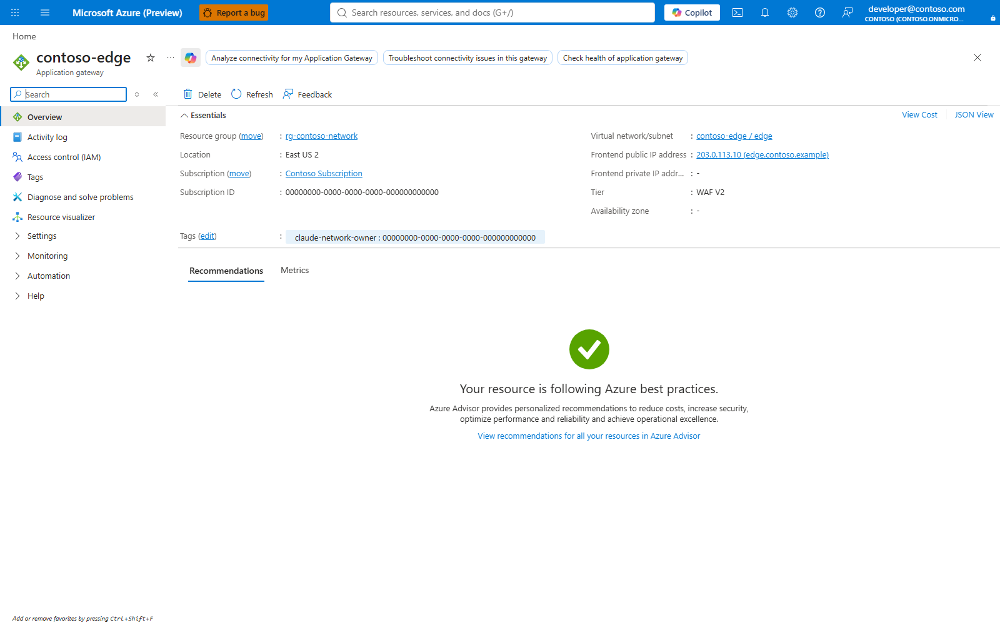

# Get started with the governed Claude gateway

This page is the short operator path for the first rollout. It links to the
deep guides for details and does not replace them.

| Person | Owns | Typical time | Added standing cost |
|---|---|---:|---:|
| Administrator | Gateway deployment, Entra groups, budgets, optional network edge and optional FinOps tool | 60-120 minutes for the first gateway, longer when network review or tenant approval is needed | API Management v2 starts around $150/month at list price; Log Analytics and Foundry usage are usage-based |
| Developer | VS Code extension first, then Claude Code CLI, then Claude Desktop | 10-20 minutes after the handover file exists | No Azure infrastructure cost |
| FinOps owner | Usage views, budget modes, monthly exports and optional Turnstile or AUM | 30-90 minutes depending on tool choice | Workbooks/scripts/AUM Direct add no server; Turnstile, AUM service and chargeback email add their own resources |

Costs are list-price examples from the repository guides, not an invoice. Run
`scripts/Get-ClaudeBom.ps1 -WithPrices` and the relevant selector before quoting
numbers. Azure CLI sign-in follows Microsoft's
[Azure CLI authentication guidance](https://learn.microsoft.com/cli/azure/authenticate-azure-cli-interactively);
gateway token ceilings use Azure API Management's
[`llm-token-limit` policy](https://learn.microsoft.com/azure/api-management/llm-token-limit-policy).
USD budgets are a separate delayed reconciliation over categorized telemetry,
not a hard invoice cap.
Claude client behavior is configured through the repository's developer setup
and the Anthropic Claude Code/Claude Desktop clients.

## Track 1 - Administrator, 10 steps

### 1. Confirm prerequisites and sign in

**Command**

```powershell
az login
az account show --query "{subscription:id,tenant:tenantId,user:user.name}" -o table
```

**Azure portal/manual path:** Azure portal > top-right account menu, verify the
directory; Subscriptions > select the target subscription. Confirm the Foundry
account already has a Claude deployment and the intended API Management SKU is
Basic v2, Standard v2 or Premium v2.

**Success:** the command shows the intended tenant and subscription; the portal
shows a Foundry account and an APIM v2 target or an approved plan to create one.
**Screenshot:** no approved live capture in the manifests shows this preflight
screen. **If it fails:** use [Setup prerequisites](SETUP.md#1-prerequisites) and
[Troubleshooting: environment](TROUBLESHOOTING.md#environment).

### 2. Run the installer and review discovered choices

**Command**

```powershell
git clone https://github.com/naveenneog/claude-code-foundry-gateway
cd claude-code-foundry-gateway
az login
.\Install-ClaudeGateway.ps1
```

The installer discovers real Foundry accounts with Claude deployments, offers
existing v2 API Management instances, asks for tier budgets, Entra group names,
developer sign-in mode, `desktopSignIn` and gateway address choice, and prints
the cost and implication of choices before writing. `helper-script` is the
Desktop default and needs no new app registration. `external-idp-browser` and
`external-idp-broker` need a Desktop public-client Entra app, tenant consent
review, and a gateway audience recorded in `external-idp-extra-audience`; review
that app first:

```powershell
.\scripts\New-ClaudeDesktopEntraApp.ps1 -DisplayName 'Claude Desktop gateway' -WhatIf
.\scripts\New-ClaudeDesktopEntraApp.ps1 -DisplayName 'Claude Desktop gateway' -Broker -WhatIf
```

**Azure portal/manual path:** README > **Deploy to Azure** deploys the template,
then Entra ID > Groups creates tier groups, APIM > Named values publishes
membership and budgets, and the wizard is still needed to write the developer
handover file. For external-idp Desktop sign-in, use Microsoft Entra admin
center > App registrations > New registration > Mobile and desktop applications;
add `http://127.0.0.1/callback`, and add broker redirect URIs only for the
broker flow. The full manual path is [Setup option C](SETUP.md#option-c--portal).

**Success:** the script writes `onboarding/claude-gateway.json` and reports a
verified deployment. The handover file includes the selected Desktop sign-in
shape; with external-idp, the gateway named value accepts only the recorded
Desktop audience. **Screenshot:** no approved live capture in the allowed
manifests shows the installer transcript or P60 Desktop app blades. **If it
fails:** use [Setup deploy](SETUP.md#3-deploy),
[Desktop sign-in](../DEVELOPER.md#letting-desktop-do-the-sign-in-itself),
[ADR-0027](adr/0027-claude-desktop-sign-in-choice.md) and
[Troubleshooting: deployment](TROUBLESHOOTING.md#deployment). U23 tracks tenant
consent behavior for external-idp.

### 3. Verify the gateway resource, tier and address

**Command**

```powershell
.\scripts\Test-ClaudeHealth.ps1 -ResourceGroup $rg -ApimName $apim
```

**Azure portal/manual path:** API Management > your gateway > Overview. Check
Status, Gateway URL, resource group, location and Tier.

**Success:** health exits zero and the portal shows an online v2 gateway.


**If it fails:** use [Operations health](OPERATIONS.md#2-check-health-and-headroom)
and [Troubleshooting: runtime](TROUBLESHOOTING.md#runtime).

### 4. Verify the managed identity boundary

**Command**

```powershell
az apim show -g $rg -n $apim --query "{name:name,identity:identity.type,principal:identity.principalId}" -o json
```

**Azure portal/manual path:** API Management > Security > Managed identities,
then Foundry > Access control (IAM). Keep the gateway managed identity grant to
Foundry and remove unintended direct data-plane grants only after owner review.

**Success:** the APIM system-assigned identity is on, and Foundry IAM grants the
gateway identity the required access.


**If it fails:** use [Setup permissions](SETUP.md#2-permissions-and-roles) and
[Architecture: identity boundaries](ARCHITECTURE.md#identity-and-streaming-boundaries).

### 5. Create or reuse Entra groups and publish entitlement

**Command**

```powershell
.\scripts\Set-ClaudeDeveloper.ps1 -User alice@contoso.com -Tier standard -Sync
.\.venv-finops\Scripts\aum.exe developer find alice --limit 50
.\.venv-finops\Scripts\aum.exe developer add alice@contoso.com --tier standard --unit platform --what-if
.\.venv-finops\Scripts\aum.exe developer remove alice@contoso.com --what-if
.\scripts\Sync-ClaudeAccess.ps1 -ApimName $apim -ResourceGroup $rg
```

**Azure portal/manual path:** Microsoft Entra admin center > Groups > create or
reuse assigned security groups for tiers, units and teams; APIM > Named values >
`allow-standard`, `allow-premium` and `bu-members` shows what the gateway reads.
AUM uses the signed-in administrator's delegated Graph rights to add or remove
developers by email/UPN and then publishes the gateway. Turnstile remains a web
FinOps authority and observer; it does not change Entra group membership.

**Success:** the sync reports the resolved members and APIM named values contain
the expected object IDs with premium precedence. AUM preview lists the exact tier
and unit/team group writes before apply.


**If it fails:** use [Onboarding](ONBOARDING.md), especially
[adding by hand](ONBOARDING.md#1a-add-a-developer-by-hand),
[AUM developer add/remove](AUM.md#add-and-remove-developers),
[ADR-0029](adr/0029-aum-developer-membership.md) and [Business units](BUSINESS-UNITS.md).

### 6. Set tiers, business units and budget modes

**Command**

```powershell
.\scripts\Set-ClaudeTier.ps1 -ResourceGroup $rg -ApimName $apim -List
.\scripts\Set-ClaudeBusinessUnit.ps1 -ResourceGroup $rg -ApimName $apim -List
.\scripts\Set-ClaudeBusinessUnit.ps1 -ResourceGroup $rg -ApimName $apim `
  -Id platform -Group "claude-code-standard" -MonthlyBudgetUsd 5000
.\scripts\Set-ClaudeBusinessUnit.ps1 -ResourceGroup $rg -ApimName $apim `
  -Id platform -Mode Allowance -AllowancePercent 10
.\scripts\Sync-ClaudeUsdBudgets.ps1 -ResourceGroup $rg -ApimName $apim
```

**Azure portal/manual path:** APIM > Named values > `tpm-*`, `quota-*`,
`quota-org`, `bu-registry`, `bu-members`, `bu-parents`, `bu-modes`,
`usd-budgets` and `usd-budget-state`. Preserve sentinel commas and unrelated
entries when editing by hand. If Turnstile owns governance or budgets, use
Turnstile instead of APIM named values for the owned surface.

**Success:** the list commands read back the tier, unit and mode. A dollar input
also persists its USD amount and tariff date; the token conversion remains the
real-time guard until `Sync-ClaudeUsdBudgets.ps1` or the AUM service reconciler
publishes a fresh `usd-budget-state`. A mode or budget save is not proof of
enforcement until a real request returns the expected response or notice.
**Screenshot:** use the Named values live capture in step 5 for this blade.
**If it fails:** use [Budgets](BUDGETS.md),
[USD budgets](BUDGETS.md#dollar-budgets-what-is-enforced),
[Business-unit budget modes](BUSINESS-UNITS.md#budget-modes) and
[Turnstile authority](TURNSTILE.md#one-enforcer).

### 7. Publish monitoring and chargeback views

**Command**

```powershell
.\scripts\Publish-ClaudeQueries.ps1 -ResourceGroup $rg -ApimName $apim
.\scripts\Publish-ClaudeWorkbook.ps1 -ResourceGroup $rg `
  -WorkbookFile infra/workbook-chargeback.json -Name "Claude gateway - chargeback"
```

**Azure portal/manual path:** Log Analytics workspace > Logs > Functions for
`ClaudeChargeback` and `ClaudeCost`; Azure Monitor > Workbooks > saved workbook.
Microsoft's Log Analytics query mode is described in
[Microsoft Learn](https://learn.microsoft.com/azure/azure-monitor/logs/log-analytics-simple-mode).

**Success:** the functions return recent known requests and the workbook opens
against the workspace linked to the gateway logger.


**If it fails:** use [Monitoring dashboard](MONITORING.md#7-dashboard) and
[FinOps month close](FINOPS.md).

### 8. Decide whether to add an enterprise network edge

**Command**

```powershell
.\scripts\New-ClaudeNetworkEdge.ps1 -DiscoverOnly
.\scripts\Get-ClaudeNetworkImpact.ps1 -WhatIf
.\scripts\Get-ClaudeNetworkPlan.ps1 -SubscriptionId $subscriptionId `
  -ApimId $apimId -ApiId $apiId -DeploymentParameters $deployment -AsJson
.\scripts\New-ClaudeNetworkEdge.ps1 -ReviewPath .\.network-state\review.json -WhatIf
```

**Azure portal/manual path:** follow [Network Enterprise: portal configuration](NETWORK-ENTERPRISE.md#configure-the-same-design-in-the-azure-portal)
for Application Gateway, WAF, listeners, private endpoints, DNS, Key Vault and
origin restrictions. No topology is selected without a priced review.

**Success:** the review states current cost, proposed cost, access impact and
rollback. Apply only after the owner-approved `APPLY <fingerprint>` prompt.



**If it fails:** use [Network troubleshooting](NETWORK-ENTERPRISE.md#troubleshoot).

### 9. Prepare fleet deployment for managed devices

**Command**

```powershell
.\scripts\New-ClaudeCodePolicy.ps1 -ConfigPath .\onboarding\claude-gateway.json `
  -Tier standard -OutputPath .\policy-claude-code-standard
.\scripts\New-ClaudeCodePolicy.ps1 -ConfigPath .\onboarding\claude-gateway.json `
  -Tier premium -OutputPath .\policy-claude-code-premium
```

**Azure portal/manual path:** use [Fleet deployment with Intune, Jamf or Group
Policy](MDM.md). Intune paths are Devices > Manage devices > Configuration for
profiles and Apps > Windows/macOS for client packages. Jamf and Group Policy use
the generated macOS profiles, registry payloads and scripts from the policy
output folders.

**Success:** each tier has generated Claude Code and Claude Desktop managed
settings, including the P60 Desktop sign-in choice from `desktopSignIn`.
Assignment is to the intended user or device groups; the user still completes
their own Entra sign-in.

**Screenshot:** no approved live Intune, Jamf or Group Policy capture exists in
the allowed manifests; `docs/MDM.md` states Intune screenshots were not captured
because this account has no Intune administrator role.

**If it fails:** use [MDM troubleshooting](MDM.md#8-troubleshooting) and
[Desktop sign-in](../DEVELOPER.md#letting-desktop-do-the-sign-in-itself).

### 10. Verify with a real request

**Command**

```powershell
.\scripts\Show-Governance.ps1 -ApimName $apim -ResourceGroup $rg
```

**Azure portal/manual path:** APIM > APIs > Claude API > Test can inspect the
API shape, but it is not a substitute for a bearer-token request from an
entitled test identity. Check the response headers and body, then confirm the
request appears in the workspace.

**Success:** entitled callers receive a model response; non-entitled callers get
`403`; rate exhaustion returns `429` with `Retry-After`; budget exhaustion
returns `403` naming the exhausted budget. **Screenshot:** API Management APIs
live capture below shows the governed API entry point, not the data-plane
response.


**If it fails:** use [Setup verification](SETUP.md#4-verify-before-announcing),
[Governance checks](GOVERNANCE-CHECKS.md) and [Troubleshooting](TROUBLESHOOTING.md).

## Track 2 - Developer, 8 steps

### 1. Get the handover file and sign in to Azure

**Command**

```powershell
az login --tenant <tenant-id> --allow-no-subscriptions
az account show --query "{tenant:tenantId,user:user.name}" -o table
```

**Portal/manual path:** there is no Azure portal workstation setup. The platform
team supplies `claude-gateway.json`, the complete `scripts` folder and your
approved client distribution path. On a managed device, Intune, Jamf or Group
Policy may already have installed the clients and managed settings from
[MDM](MDM.md); still complete the tenant sign-in required by the handover.

**Success:** the CLI is signed in to the tenant in the handover file.
**Screenshot:** no approved live client or workstation screenshot exists in the
allowed manifests. **If it fails:** use [Developer prerequisites](../DEVELOPER.md#prerequisites).

### 2. Install or verify the VS Code extension first

**Command**

```powershell
code --install-extension anthropic.claude-code
```

**Manual path:** VS Code > Extensions > search `anthropic.claude-code` > Install.
The workstation setup script can install or configure it, but this track checks
the VS Code surface first as requested.

**Success:** VS Code lists the Claude Code extension. **Screenshot:** no
approved live VS Code image exists in the allowed manifests. **If it fails:** use
[Developer manual install](../DEVELOPER.md#appendix--configuring-it-by-hand).

### 3. Install or verify the Claude Code CLI

**Command**

```powershell
npm install -g @anthropic-ai/claude-code
claude --version
```

**Manual path:** use the organisation's approved software portal if global npm
installs are blocked. VS Code uses the same Claude Code settings file as the CLI.

**Success:** `claude --version` returns a version. **Screenshot:** no approved
live CLI client screenshot exists in the allowed manifests. **If it fails:** use
[Developer setup](../DEVELOPER.md#one-command) and the npm-prefix note in that section.

### 4. Run the workstation setup script

**Command**

```powershell
.\scripts\Setup-ClaudeWorkstation.ps1 -ConfigPath .\claude-gateway.json
```

**Manual path:** edit `%USERPROFILE%\.claude\settings.json` for Claude Code and
VS Code, and configure Desktop separately as shown in the
[developer appendix](../DEVELOPER.md#appendix--configuring-it-by-hand). The Azure
portal does not configure local clients.

**Success:** the script configures the VS Code extension, the Claude Code CLI
and Claude Desktop, then proves a gateway call when the client is installed. On
managed devices it reconciles the same settings rather than duplicating them.
**Screenshot:** no approved live workstation transcript exists in the allowed
manifests. **If it fails:** run
`.\scripts\Onboard-ClaudeDeveloper.ps1 -ConfigPath .\claude-gateway.json -PreflightOnly`
and use [Developer troubleshooting](../DEVELOPER.md#if-something-is-wrong) or
[MDM troubleshooting](MDM.md#8-troubleshooting) for fleet-delivered settings.

### 5. Verify VS Code

**Command**

```powershell
claude auth status
```

**Manual path:** VS Code > Command Palette > **Developer: Reload Window**, then
**Claude Code: Open in Side Bar**. If the extension asks for Anthropic sign-in,
set `claudeCode.disableLoginPrompt` as shown in the developer appendix.

**Success:** the status shows Foundry/gateway configuration and the extension
opens without a separate Anthropic sign-in. **Screenshot:** no approved live VS
Code capture exists in the allowed manifests. **If it fails:** use the
[Developer symptom table](../DEVELOPER.md#if-something-is-wrong).

### 6. Verify the Claude Code CLI

**Command**

```powershell
claude -p "Reply with exactly: OK"
```

**Manual path:** run `claude`, then `/status`. The backend should be the
Microsoft Foundry gateway, not a personal Anthropic account.

**Success:** the CLI returns `OK` through the gateway. **Screenshot:** no
approved live CLI client screenshot exists in the allowed manifests. **If it
fails:** record the status code, UTC time, gateway host and redacted error; use
[Troubleshooting: Claude Code client](TROUBLESHOOTING.md#claude-code-client).

### 7. Verify Claude Desktop

**Command**

```powershell
Get-Process -Name 'Claude' -ErrorAction SilentlyContinue
```

Quit Desktop completely, including the tray icon, then reopen it.

**Manual path:** for `desktopSignIn.kind: helper-script` (the default), Claude
Desktop sign-in screen > **Or sign in with Gateway** and the helper obtains the
Entra token from Azure CLI. For `external-idp-browser`, Desktop opens an Entra
browser sign-in using the public-client app recorded by the administrator. For
`external-idp-broker`, Desktop uses the Entra broker on supported managed
devices. Do not use Google or email for the governed Azure path. Then Settings >
Connection should name the gateway URL.

**Success:** Desktop signs in through the selected admin-approved method and
Settings > Connection names the gateway. External-idp failures that show
`AADSTS65001` or **Need admin approval** mean tenant consent is missing, not that
the developer needs a model key. **Screenshot:** no approved live Desktop
screenshot exists in the allowed manifests. **If it fails:** use
[Developer Desktop guidance](../DEVELOPER.md#using-it),
[Desktop sign-in choices](../DEVELOPER.md#letting-desktop-do-the-sign-in-itself)
and [Troubleshooting: Claude Desktop](TROUBLESHOOTING.md#claude-desktop).

### 8. Send one verified request and hand over evidence

**Command**

```powershell
claude -p "Reply with exactly: OK"
```

**Manual path:** VS Code panel, CLI and Desktop can each send a short request.
The platform team verifies the request in Log Analytics if needed.

**Success:** at least one client returns `OK`; budget headers are present on
gateway responses; the developer knows their tier and who owns unit budget
changes. **Screenshot:** no approved live client screenshot exists in the allowed
manifests. **If it fails:** use [Developer troubleshooting](../DEVELOPER.md#if-something-is-wrong)
and never send tokens or prompt content in a public issue.

## Track 3 - FinOps, 9 steps

### 1. Choose no console, Turnstile, AUM or both

**Command**

```powershell
.\scripts\Select-ClaudeFinOpsTooling.ps1 -Region eastus2
```

**Azure portal/manual path:** review the options in [FinOps tools](FINOPS-TOOLS.md):
workbooks/scripts only, AUM Direct, AUM service, Turnstile or Turnstile plus
AUM as another client. The choices are independent.

**Success:** the governance and budget write authority is recorded, and no tool
is expected to overwrite another. **Screenshot:** no approved selector transcript
exists in the allowed manifests; the live Turnstile budget screenshot below
shows a selected web-console budget surface after tooling exists.


**If it fails:** use
[FinOps tools: which one to choose](FINOPS-TOOLS.md#which-one-to-choose).

### 2. Publish the reporting definitions and workbook

**Command**

```powershell
.\scripts\Publish-ClaudeQueries.ps1 -ResourceGroup $rg -ApimName $apim
.\scripts\Publish-ClaudeWorkbook.ps1 -ResourceGroup $rg `
  -WorkbookFile infra/workbook-chargeback.json -Name "Claude gateway - chargeback"
```

**Azure portal/manual path:** Log Analytics workspace > Logs > Functions;
Azure Monitor > Workbooks > Advanced editor. Use the workspace actually linked
to the gateway logger.

**Success:** `ClaudeChargeback()` and `ClaudeCost()` return recent rows and the
workbook opens against the correct workspace. **Screenshot:** use the Log
Analytics workspace live capture in Administrator step 7. **If it fails:** use
[Monitoring dashboard](MONITORING.md#7-dashboard).

### 3. View usage without an optional console

**Command**

```powershell
.\scripts\Get-ClaudeBusinessUnit.ps1 -ResourceGroup $rg -ApimName $apim
.\scripts\Get-ClaudeAnalytics.ps1 -Days 30
```

**Azure portal/manual path:** Log Analytics workspace > Logs; run the KQL in
[FinOps month close](FINOPS.md#2-select-and-export-the-closed-month), then export
CSV if needed.

**Success:** usage is grouped by business unit, model, client surface and
pricing status. **Screenshot:** use the Log Analytics workspace live capture in
Administrator step 7. **If it fails:** use [FinOps caveats](FINOPS.md#3-review-caveats-before-approving-allocations).

### 4. Set strict, allowance or notify budgets

**Command**

```powershell
.\scripts\Set-ClaudeBusinessUnit.ps1 -ResourceGroup $rg -ApimName $apim `
  -Id '<unit-id>' -Mode Strict
.\scripts\Set-ClaudeBusinessUnit.ps1 -ResourceGroup $rg -ApimName $apim `
  -Id '<unit-id>' -Mode Allowance -AllowancePercent 10
.\scripts\Set-ClaudeBusinessUnit.ps1 -ResourceGroup $rg -ApimName $apim `
  -Id '<unit-id>' -Mode Notify
.\scripts\Set-ClaudeBusinessUnit.ps1 -ResourceGroup $rg -ApimName $apim `
  -Id '<unit-id>' -MonthlyBudgetUsd 500
.\scripts\Sync-ClaudeUsdBudgets.ps1 -ResourceGroup $rg -ApimName $apim
```

**Azure portal/manual path:** APIM > Named values > `bu-modes`, `usd-budgets`
and `usd-budget-state`, or Turnstile > Gateway governance/Budgets when Turnstile
owns governance or budget writes. Preserve the complete map when editing APIM by
hand.

**Success:** a real request shows a strict refusal, an allowance notice or a
notify notice as applicable. For USD, strict refusal is
`usd_budget_exceeded`, unpriced usage is `usd_budget_unpriced`, and stale
reconciled state is `usd_budget_state_stale`. **Screenshot:** use the Named
values capture in Administrator step 5 for gateway-owned mode and USD state
storage, or the Turnstile capture in Administrator step 9 for Turnstile-owned
budgets. **If it fails:** use
[Budgets: modes](BUDGETS.md#business-unit-and-team-enforcement-modes) and
[USD budgets](BUDGETS.md#dollar-budgets-what-is-enforced).

### 5. Use Turnstile when a web console is chosen

**Command**

```powershell
.\scripts\Open-ClaudeTurnstile.ps1 -TurnstileUrl 'https://<console-api>.azurewebsites.net' `
  -Scope 'api://<turnstile-application-id>/Turnstile.Manage'
```

**Azure portal/manual path:** Enterprise applications > the Turnstile app >
Users and groups assigns `Turnstile.Admin`, `Turnstile.Viewer` or
`Turnstile.Manager`. Turnstile > Budget Management and Gateway governance show
the operating pages.

**Success:** the session shows the expected role and manager scope; saves start
an apply job and the gateway readback confirms the change.


**If it fails:** use [Turnstile troubleshooting](TURNSTILE.md#troubleshooting).

### 6. Use AUM when a terminal console is chosen

**Command**

```powershell
python -m venv .venv-finops
.\.venv-finops\Scripts\python.exe -m pip install -e 'cli/finops[test]'
.\.venv-finops\Scripts\aum.exe configure --backend direct --save
.\.venv-finops\Scripts\aum.exe
```

**Azure portal/manual path:** AUM Direct follows the APIM gateway, named values
and Log Analytics workspace you discover in Azure. AUM does not create gateway
infrastructure. For the optional AUM service, use Function App, Storage and app
role assignments described in [AUM service](AUM-SERVICE.md).

**Success:** AUM Overview shows identity, backend, usage, latency and budget
metrics.


**If it fails:** use [AUM](AUM.md) and [AUM service](AUM-SERVICE.md).

### 7. Inspect AUM budgets

**Command**

```powershell
.\.venv-finops\Scripts\aum.exe budget list
.\.venv-finops\Scripts\aum.exe usd list
.\.venv-finops\Scripts\aum.exe usd set unit <unit-id> 250.00 --period month --what-if
.\.venv-finops\Scripts\aum.exe usd status
```

**Azure portal/manual path:** APIM > Named values for Direct (`usd-budgets` and
`usd-budget-state` hold the dollar definitions and the reconciled state), or
Turnstile > Budget Management when AUM uses Turnstile. Managers are scoped only
when the selected backend enforces scope.

**Success:** token budgets show used, budget, remaining, unallocated and status
columns. `aum budget` takes token amounts with `k`, `M` and `B` suffixes; dollar
budgets are managed with `aum usd`, which takes decimal dollar strings, shows
**Saved; awaiting reconciliation** after a write, and reports priced spend with
its completeness flags after `aum usd reconcile`. Dollar writes are refused while
Turnstile owns budgets ([AUM dollar budgets](AUM.md), [BUDGETS.md](BUDGETS.md)).


**If it fails:** use [AUM service roles](AUM-SERVICE.md#prerequisites-and-roles)
and [FinOps tools sign-in](FINOPS-TOOLS.md#sign-in).

### 8. Generate monthly chargeback reports

**Command**

```powershell
.\scripts\New-ClaudeChargebackReport.ps1 -WhatIf
.\scripts\New-ClaudeChargebackReport.ps1 -Month 2026-08 -OutputPath .\chargeback-reports
```

**Azure portal/manual path:** Log Analytics workspace > Logs > run
`ClaudeCost(from, to)` and export CSV. The portal export does not create the
per-unit HTML, provenance or reconciliation manifest.

**Success:** the month folder contains `summary.csv`, one CSV and HTML file per
unit, `unassigned.*`, `index.html` and `manifest.json`.


**If it fails:** use [Chargeback reports](CHARGEBACK-REPORTS.md).

### 9. Monitor workbooks and reconcile before approving allocations

**Command**

```powershell
.\scripts\Publish-ClaudeWorkbook.ps1 -ResourceGroup $rg -List
```

**Azure portal/manual path:** Azure Monitor > Workbooks; Cost Management > Cost
analysis for the same closed month and billing scope. Record unresolved pricing
or attribution gaps rather than marking the export invoice-reconciled.

**Success:** the workbook period, workspace, price book date, membership date
and unresolved gaps are recorded with the allocation decision. **Screenshot:**
use the Log Analytics workspace live capture in Administrator step 7 and the
Turnstile/AUM captures above for optional consoles. **If it fails:** use
[FinOps reconcile](FINOPS.md#4-compare-to-billed-cost-and-set-the-next-budget)
and [Monitoring](MONITORING.md).

## Approved screenshots used on this page

The images above are live captures already committed in this repository. Their
provenance records are:

| Image | Manifest record |
|---|---|
| `images/architecture-live/gateway-overview.png` | `docs/images/architecture-live/captures.json`, id `gateway-overview`; also in `docs/guide/portal-captures.json`, id `architecture-gateway-overview` |
| `images/architecture-live/gateway-identity.png` | `docs/images/architecture-live/captures.json`, id `gateway-identity`; also in `docs/guide/portal-captures.json`, id `architecture-gateway-identity` |
| `images/architecture-live/gateway-named-values.png` | `docs/images/architecture-live/captures.json`, id `gateway-named-values`; also in `docs/guide/portal-captures.json`, id `architecture-gateway-named-values` |
| `images/architecture-live/telemetry-workspace.png` | `docs/images/architecture-live/captures.json`, id `telemetry-workspace` |
| `guide/network-final-edge.png` | `docs/guide/portal-captures.json`, id `network-final-edge` |
| `images/architecture-live/console-budgets.png` | `docs/images/architecture-live/captures.json`, id `console-budgets` |
| `images/architecture-live/gateway-apis.png` | `docs/images/architecture-live/captures.json`, id `gateway-apis`; also in `docs/guide/portal-captures.json`, id `architecture-gateway-apis` |
| `guide/turnstile-16-cli-signin.png` | `docs/guide/turnstile-captures.json`, image `turnstile-16-cli-signin.png` |
| `images/architecture-live/terminal-overview.png` | `docs/images/architecture-live/captures.json`, id `terminal-overview` |
| `images/architecture-live/terminal-budgets.png` | `docs/images/architecture-live/captures.json`, id `terminal-budgets` |
| `images/architecture-live/reports-generator-job.png` | `docs/images/architecture-live/captures.json`, id `reports-generator-job` |
