# Guided flow

`Start-ClaudeGateway.ps1` is the product path for setup, later changes, status
and the generated handover guide. It keeps the existing implementation scripts:
each `scripts/flow/<Step>.ps1` module plans without writing, applies
non-interactively and verifies its own work.

## Run it

```powershell
.\Start-ClaudeGateway.ps1 -Action Setup
```

Without `-Action`, an interactive console shows a menu. Without a console, pass
one of `Setup`, `Update`, `Change`, `Diagnose`, `Guide` or `Status`.

The first line appears at once. With no gateway in the record it says that
nothing is read from Azure; with a recorded gateway it names the one read, with
an estimate before it starts and the time it took after. Measured on
2026-09-27 against the reference subscription: with an empty record the first
line appeared after 0.76 s and the review after 2.3 s, against 66 s before
[ADR-0032](adr/0032-guided-flow-starts-at-once.md).

The default record is `onboarding/claude-gateway.json`. It is environment
specific and git-ignored. Use `-RecordPath` to use a different record.

## What the flow asks and why

Discovery reads only the gateway the record names (`az apim show`), and nothing
when the record names none. The flow then asks the questions exposed by the step
modules present on the branch. It never invents resource names.

| Area | Asked by | Why |
|---|---|---|
| Gateway foundation | `Install-ClaudeGateway.ps1` in a console; `Foundation.ps1` without one | In a console the installer asks its own questions ([Attended setup](#attended-setup)). Without a console the flow asks the API Management v2 SKU, entitlement store, developer sign-in and Desktop sign-in and passes them to the installer with `-Yes`. Manual equivalent: [Setup](SETUP.md). |
| Tier, entitlement store, network edge and Desktop sign-in | `Tier.ps1`, `Entitlement.ps1`, `Network.ps1`, `DesktopSignIn.ps1` | These run under `-Action Change`. Setup lists each one with the command that changes it. Manual equivalents: [Update and change](UPDATE-AND-CHANGE.md), [Scale](SCALE.md), [Network](NETWORK.md). |
| FinOps, budgets, monitoring and reports | `FinOps.ps1`, `Budgets.ps1`, `Monitoring.ps1`, `Reports.ps1` | FinOps tool (none, AUM Direct, AUM service, Turnstile, or Turnstile plus AUM), token or dollar budgets (without the AUM service, a scheduled reconciler job), the workbook collection and chargeback reports. Manual equivalents: [FinOps](FINOPS.md), [Budgets](BUDGETS.md), [Monitoring](MONITORING.md), [Chargeback reports](CHARGEBACK-REPORTS.md). |
| Device profiles | `DeviceProfiles.ps1` | Per-tier MDM payloads must mirror the recorded gateway, model and Desktop sign-in choices. Manual equivalent: [MDM](MDM.md). |
| Verification | `Verify.ps1` | Runs the gateway health checks after setup or change. Manual equivalent: [Operations health](OPERATIONS.md#2-check-health-and-headroom). |
| Guide | `Guide.ps1` | Writes `onboarding/HOW-TO-USE.md` with this tenant's names and the operator/developer/FinOps instructions. |

## Attended setup

An attended run is `-Action Setup` in a console, without `-PlanOnly`,
`-ApprovedPlanFingerprint` or `-WhatIf`. With no gateway in the record it has
two phases ([ADR-0032](adr/0032-guided-flow-starts-at-once.md)).

**1. The installer asks its own questions.** The flow prints the Foundation
review, which names the installer's questions, and runs
`Install-ClaudeGateway.ps1` without `-Yes`. It passes only the values the
record's foundation decision holds, and the record's subscription id when it has
one; the installer asks the rest with its own defaults. The flow asks for no
fingerprint in this phase: the installer creates nothing until its summary is
confirmed, and the summary states the monthly price. That includes the Claude
deployment it creates when the subscription has none: the summary lists it, and
it is created first, after the confirmation.

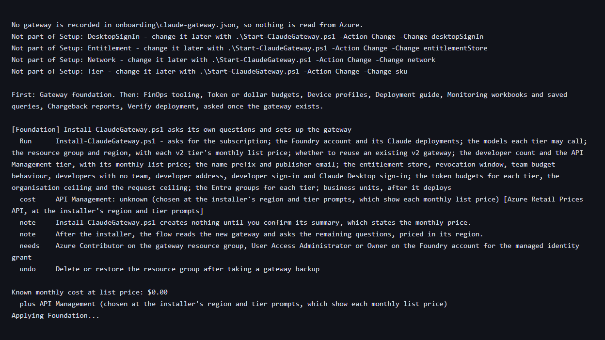

The installer's region prompt lists the Foundry account's region and the other
regions in its geography, each with the monthly list price of the three API
Management v2 tiers, and its tier prompt lists each tier's price in the chosen
region ([Setup](SETUP.md#region)).


Declining at the summary stops the flow before any other step, and the installer
has created nothing.

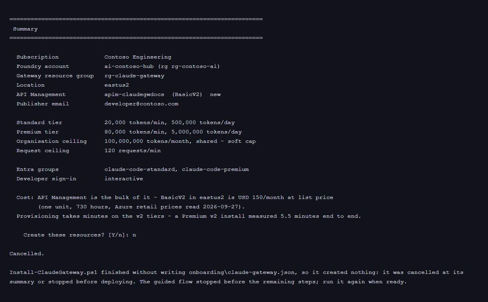

**2. The flow continues once the gateway exists.** It reads the new gateway,
asks the FinOps question with each tool priced in the gateway's region, then the
remaining steps' questions, prints their review and asks for the first eight
characters of its fingerprint. A mistyped fingerprint here applies none of those
steps and says that the gateway foundation is set up and recorded.

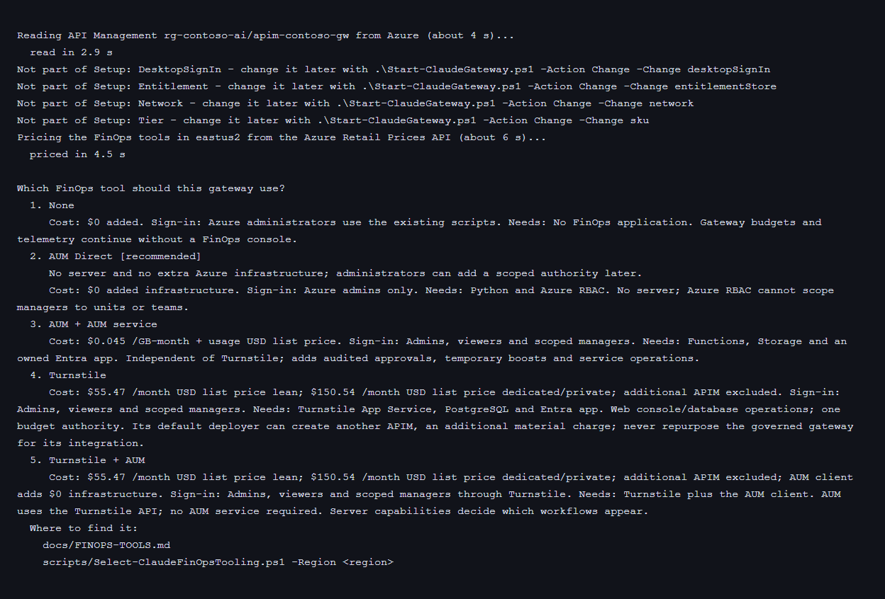

When the record already names a gateway, Setup and Guide check that gateway and
do not run the installer again. `-Action Change -Change foundation` runs the
installer with `-ExistingApimName` and `-ResourceGroup` set to the recorded
gateway, so it updates that gateway and keeps its region, tier, name and
publisher. In a console the flow passes nothing else, and the installer asks its
other questions; the tier changes through `-Change sku`. With no gateway
recorded, `-Change foundation` runs the installer as Setup does, to create one.

Without a console, the flow plans every step in one review and runs the
installer with `-Yes` and the recorded values, adding `-DeployProjection` when
the entitlement store is the Cosmos projection. An external IdP Desktop sign-in
needs `foundation.desktopEntraClientId`, the id of the Desktop public-client
app, and with `access_token` also `foundation.desktopEntraScopes` and
`foundation.desktopEntraAudience`: the installer cannot ask for them without a
console, so the plan refuses without them, before it is approved.

After the installer, the foundation decision holds what it created, in the
installer's own parameter values: tier, region, Foundry account, entitlement
store and resolver access, developer sign-in, Claude Desktop sign-in with its
app, issuer, token type, scopes and audience, the tier groups, the token budgets
and the request ceiling. An unattended `-Change foundation` gives them back to
the installer, so it keeps them.

Values the flow passes to the installer can reach the Azure CLI, which on
Windows is `az.cmd`: `cmd.exe` re-reads `& | < > ^ ( ) " %` in an argument. The
flow refuses a list or an object where the installer takes one value, and a
recorded value that reaches `az` (the subscription, Foundry account and group,
gateway group, region, name, publisher email, tier groups, and the Desktop
client id and audience) when it holds one of those characters. The
organisation details pass: they go to Azure in a JSON body, not to `az`. The
installer checks its parameters again at startup, before its first `az` call
that uses one, and checks the values it adopted or derived before its summary.
A recorded subscription that is not a subscription id is refused, so discovery
and the installer use the same subscription.

`CLAUDE_INTERACTIVE=1` treats a process whose input is redirected as a console,
so a test can drive an attended run through standard input
(`tests/Test-FlowStart.ps1`). `CLAUDE_NONINTERACTIVE=1` and `-NonInteractive`
take precedence over it.

## Review and fingerprint

After questions, every present module returns a plan. The flow prints one review
with actions, list-price cost where known, unknown-cost reasons, implications,
required roles and rollback notes, then prints a SHA-256 fingerprint.

In an attended run the review and fingerprint cover the steps after the
installer, because their plans depend on what the installer created.
`-PlanOnly`, `-ApprovedPlanFingerprint` and `-WhatIf` show and apply the
unattended plan, in which the installer runs with `-Yes`.

The Foundation line names the resource group, gateway, region, Foundry account
and subscription, and the plan carries every installer input and the exact
installer arguments. A fingerprint
approved for one estate is therefore refused for another. The API Management
line is priced from the
[Azure Retail Prices API](https://learn.microsoft.com/rest/api/cost-management/retail-prices/azure-retail-prices)
at plan time. When that API cannot be reached, the price shows as unknown with
that reason, the fingerprint differs from a priced plan, and a new `-PlanOnly`
run is needed.

Preview only:

```powershell
.\Start-ClaudeGateway.ps1 -Action Setup -PlanOnly
```

Apply without an interactive prompt:

```powershell
.\Start-ClaudeGateway.ps1 -Action Setup -ApprovedPlanFingerprint <fingerprint>
```

For scripted runs, put the answers in a JSON object whose keys are the question
keys, then pass `-AnswersPath`. Explicit `-NonInteractiveAnswers` values, when
used from another PowerShell script, override the file.

```json
{
  "foundation.sku": "BasicV2",
  "foundation.entitlementStore": "named-value",
  "foundation.authMode": "interactive",
  "foundation.desktopSignInKind": "helper-script",
  "deviceProfiles.conversationStorage": "local"
}
```

```powershell
.\Start-ClaudeGateway.ps1 -Action Setup -PlanOnly -AnswersPath .\answers.json
.\Start-ClaudeGateway.ps1 -Action Setup -AnswersPath .\answers.json `
  -ApprovedPlanFingerprint <fingerprint>
```

The supplied value must match the printed fingerprint, or at least its first
eight characters. `-WhatIf` prints the same review and writes nothing.

The fingerprint is the same on PowerShell 7 and Windows PowerShell 5.1, so a
plan reviewed on one can be applied on the other. The flow writes the plan's
canonical text itself: `ConvertTo-Json` escapes `'`, `<`, `>` and `&` on
Windows PowerShell 5.1 only, and until P72 the same plan had a different
fingerprint on each shell. The canonical text changed with P72, so a fingerprint
printed by an earlier release may no longer match its plan, depending on the
shell that printed it and the plan's text; when one is refused, run `-PlanOnly`
again.

A refusal (drift, a fingerprint that does not match, a missing answer) and a
cancel (the installer cancelled at its summary, a mistyped confirmation) print
the reason and exit 1. An error the flow does not expect says so, and
`$env:CLAUDE_FLOW_DEBUG = '1'` makes the next run print where in the scripts it
stopped. Called from another PowerShell script, or dot-sourced, the flow raises
the refusal or the cancel (`System.OperationCanceledException`) as an exception
and does not exit its caller
([U36](UNKNOWNS.md#u36--a-top-level-run-and-an-in-process-call--closed-2026-09-28)).

## Resume after failure

When an apply starts, the orchestrator writes `activeRun` with the run id,
action, selected change, fingerprint and UTC start time. After each step applies,
it writes the decision record and appends one history entry with that `runId`,
UTC time, action, decision key, principal and commit. A rerun resumes only when
the record still has an `activeRun` for the same action/change/fingerprint, and
then skips only history entries with that `runId`. A different fingerprint starts
a new run, and a successful verification clears `activeRun`. If a step throws
before returning its changes, no success-shaped history is written for that step.

An attended run records its two phases in `activeRun.phase` (`lead` for the
installer, `after-lead` for the steps after it) with the names of the steps in
`activeRun.steps`. When a step after the installer fails, the next run of the
same action plans the same steps, without the foundation check the recorded
gateway would otherwise add, so its fingerprint can match: it prints
`Resuming the Setup run started <time>`, and the steps that run completed are
skipped. This happens only when the steps present are the recorded ones. When a
step was added or removed since, for example a new prerequisite of a recorded
step, the run prints that the steps differ and plans every step again.

## Update

```powershell
.\Start-ClaudeGateway.ps1 -Action Update
.\Start-ClaudeGateway.ps1 -Action Update -ApprovedPlanFingerprint <fingerprint>
```

The first command runs `scripts\Update-ClaudeGateway.ps1` with the record path
and only plans. It compares the record schema, the deployed policy and the named
values the current policy references, and pinned job definitions, with the
current repository, then prints the migrations and a fingerprint. The second
command passes `-Apply` and that fingerprint; the updater takes a named-value
snapshot before its first write. `-PlanOnly` never applies. See
[Update and change](UPDATE-AND-CHANGE.md#1-update-an-older-deployment).

## Change one decision

```powershell
.\Start-ClaudeGateway.ps1 -Action Change -Change sku
```

`-Change` narrows planning to the module that owns the decision key. Change
re-asks that module's questions even when the record already has a value; the
current value is shown as the default/recommended option. The review still shows
cost and caller impact before applying.

| `-Change` | Module | What changes | Runbook |
|---|---|---|---|
| `foundation` | `Foundation.ps1` | Runs `Install-ClaudeGateway.ps1 -ExistingApimName <recorded gateway>`, which updates that gateway and keeps its region, tier, name and publisher. In a console the installer asks its other questions; without a console it runs with `-Yes` and the recorded choices. The review prices the live gateway, as already running | [Setup](SETUP.md) |
| `sku` | `Tier.ps1` | API Management tier; Basic v2 and Standard v2 change in place | [Tier](UPDATE-AND-CHANGE.md#2-change-the-api-management-tier) |
| `entitlementStore` | `Entitlement.ps1` | Named values to the Cosmos projection and back, after a clean comparison | [Entitlement](UPDATE-AND-CHANGE.md#3-move-entitlement-between-named-values-and-the-projection) |
| `network` | `Network.ps1` | Enterprise network edge, through its own fingerprinted review | [Network](UPDATE-AND-CHANGE.md#4-change-the-enterprise-network-edge) |
| `desktopSignIn` | `DesktopSignIn.ps1` | Claude Desktop sign-in kind and gateway audience | [Desktop sign-in](UPDATE-AND-CHANGE.md#5-change-claude-desktop-sign-in) |
| `models` | `Models.ps1` | Existing Foundry deployments, per-tier allowlists, dated price mappings, deployment records and tier-specific MDM/workstation profiles; snapshot and drift check before any write | [Models](MODELS.md) |
| `deviceProfiles` | `DeviceProfiles.ps1` | Per-tier MDM payloads | [MDM](MDM.md) |

The model change is Change-only. It asks `models.tiers.<deployment>` with
`standard`, `premium`, `both` or `none` for a live deployment and `keep` or
`drop` for a missing one. Periods in a deployment name use `~` in the answer
key. The questions show model/version, SKU/capacity and price status.
`models.priceBookPath` selects a dated private book when needed.

```powershell
.\Start-ClaudeGateway.ps1 -Action Change -Change models `
    -AnswersPath .\model-answers.json -PlanOnly
```

The model step prepares its non-secret gateway snapshot after fingerprint
approval and before the flow writes `activeRun`. Apply changes only the two
model named values in Azure and generates both tiers' client files locally.
Turnstile-owned tiers are visible in the preview but cannot be changed by this
step. The detailed [model handover](MODELS.md#what-developers-change) distinguishes
local generation from MDM distribution and a developer rerunning setup.

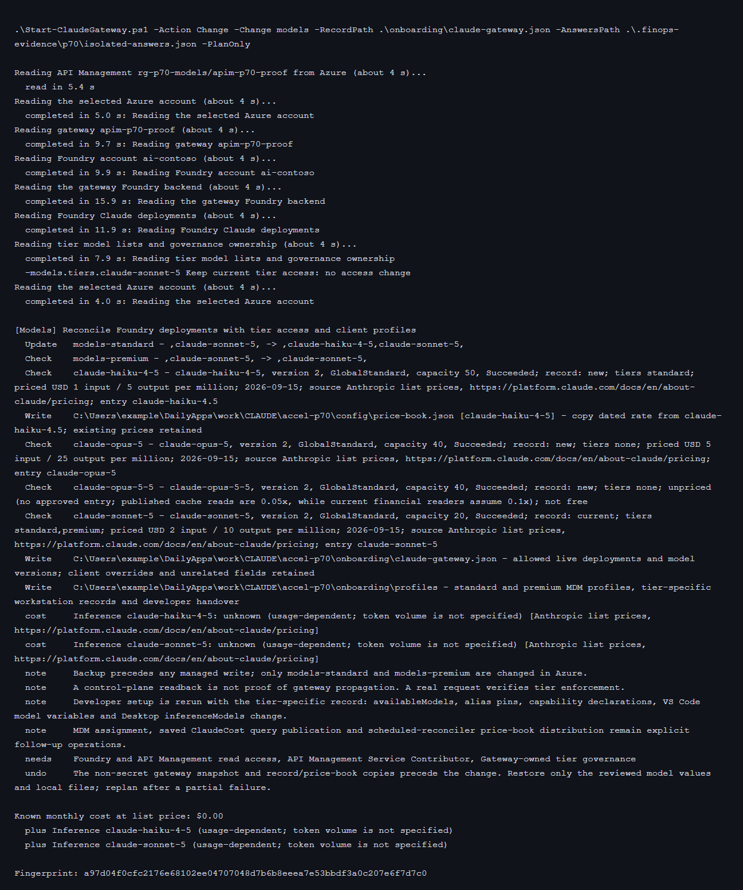

## Diagnose

```powershell
.\Start-ClaudeGateway.ps1 -Action Diagnose
```

The flow runs `scripts\Debug-ClaudeSetup.ps1` for the administrator deployment
and `scripts\Debug-ClaudeWorkstation.ps1` for the developer machine, passing
`-RecordPath`. Both are read-only. With `-SupportBundle`, each script writes a
redacted zip under `onboarding\support\`
(`claude-setup-support-<utc>.zip` and `claude-workstation-support-<utc>.zip`);
the folder is git-ignored. See [Diagnostics](DIAGNOSE.md) and
[Troubleshooting](TROUBLESHOOTING.md).

## Status and drift

```powershell
.\Start-ClaudeGateway.ps1 -Action Status
```

Status prints the recorded decisions, release metadata, recent history and any
record-versus-live drift discovered by `scripts/flow/Discovery.ps1`. A recorded
gateway that Azure reports missing, or whose gateway URL differs from the record,
is drift, and apply actions refuse to continue over it, naming the differing
field. A read that fails for another reason (no sign-in, no network, no Azure
CLI) is reported with its reason and is not drift; Status then says drift was not
checked. With no decision record, Status says that nothing is recorded, and
nothing is compared with Azure.

Guide changes nothing in Azure, so it goes on over drift: it names each
difference and says that the guide names the recorded values.

## Generated guide

```powershell
.\Start-ClaudeGateway.ps1 -Action Guide
```

The guide contains tenant-specific names, gateway URL, cost instructions,
administrator daily tasks, developer setup steps in the requested order (VS Code,
CLI, Desktop, then MDM), FinOps tool usage, workbooks/reports, and the commands
to update, change and diagnose. It is written to `onboarding/HOW-TO-USE.md` and
is git-ignored. Guide needs a recorded gateway: with none, it stops before
planning and names `-Action Setup`.

## What the tests hold

| Suite | What it runs | What it holds |
|---|---|---|
| `tests/Test-FlowStart.ps1` | The orchestrator, discovery and Foundation step in a copy of the repository, with a stub installer, Azure CLI and prices; attended runs through standard input | The first line and the recorded gateway's read are timed; the installer asks its own questions in a console; the FinOps question follows the installer; a failed second phase resumes |
| `tests/Test-FlowPermutations.ps1` | The same copy over Setup, Change foundation, Guide and Status × no record, a matching gateway, another gateway URL, a missing gateway, signed out and no Azure CLI × attended, `-PlanOnly` and unattended apply, then `-WhatIf`, Update with no record, and cancels through callers that use `&` or dot-source it, on both shells; the stub installer takes the real installer's parameter block; Foundation's installer arguments over 432 combinations in process | The installer runs only for Change foundation or a Setup with no gateway recorded; `-Yes` exactly when unattended; `-DeployProjection` exactly when unattended with the projection store; drift stops Setup and Change; a failed read is not drift; `-PlanOnly` and Status write nothing; a refusal has no code excerpt, and a caller receives it as an exception; each argument is valid for its installer parameter; a recorded foundation comes back unchanged through an unattended Change; one plan has one fingerprint on both shells |
| `tests/Test-InstallerPermutations.ps1` | The real installer under `-WhatIf -Yes`, in process, with the Azure CLI and the Retail Prices API stubbed, on PowerShell 7 and Windows PowerShell 5.1: every combination of tier × entitlement store × developer sign-in × Desktop sign-in (96 cases), six refusals and a reused gateway; `-Live` and `-Pairs` run 16 cases that cover every pair of levels | The summary names each choice; an external IdP Desktop sign-in derives its gateway audience with or without `-AuthMode`; each refusal comes before the summary, names what to pass and says that nothing was created; both shells print the same summary |

`tests/Test-InstallerPermutations.ps1 -Live -FoundryAccount <account>
-FoundryResourceGroup <group> -ReuseGateway <gateway> -ReuseResourceGroup <group>`
runs the same installer cases read-only against the signed-in subscription (each
case about 20 s, mostly Azure CLI start-up); the reuse case reads the named
gateway.

## Manual equivalents

| Guided step | Manual script or guide |
|---|---|
| Foundation | `Install-ClaudeGateway.ps1`, [Setup](SETUP.md) |
| Device profiles | `scripts\New-ClaudeCodePolicy.ps1`, [MDM](MDM.md) |
| Verify | `scripts\Test-ClaudeHealth.ps1`, [Governance checks](GOVERNANCE-CHECKS.md) |
| Guide | [Get started](GET-STARTED.md), [Operations](OPERATIONS.md), [Developer setup](../DEVELOPER.md), [FinOps](FINOPS.md) |
| Status | `scripts\Get-ClaudeGatewayTarget.ps1`, `scripts\Test-ClaudeHealth.ps1`, Azure portal checks in [Operations](OPERATIONS.md) |

## Live proof transcript excerpts

The P66 core was exercised against an isolated Basic v2 gateway in eastus2,
using the shared Foundry account only for the gateway managed identity's
temporary data-plane role. The resource group was deleted afterwards and the
soft-deleted APIM instance was purged. The screenshots below are rendered from
redacted terminal transcripts; raw transcripts stay under private evidence.

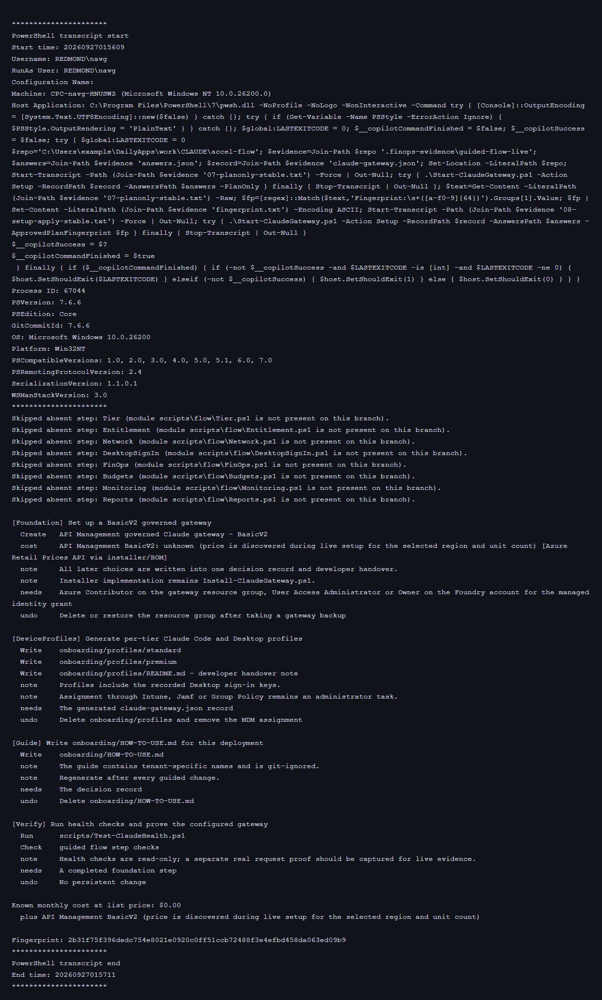

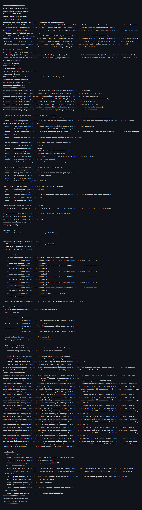

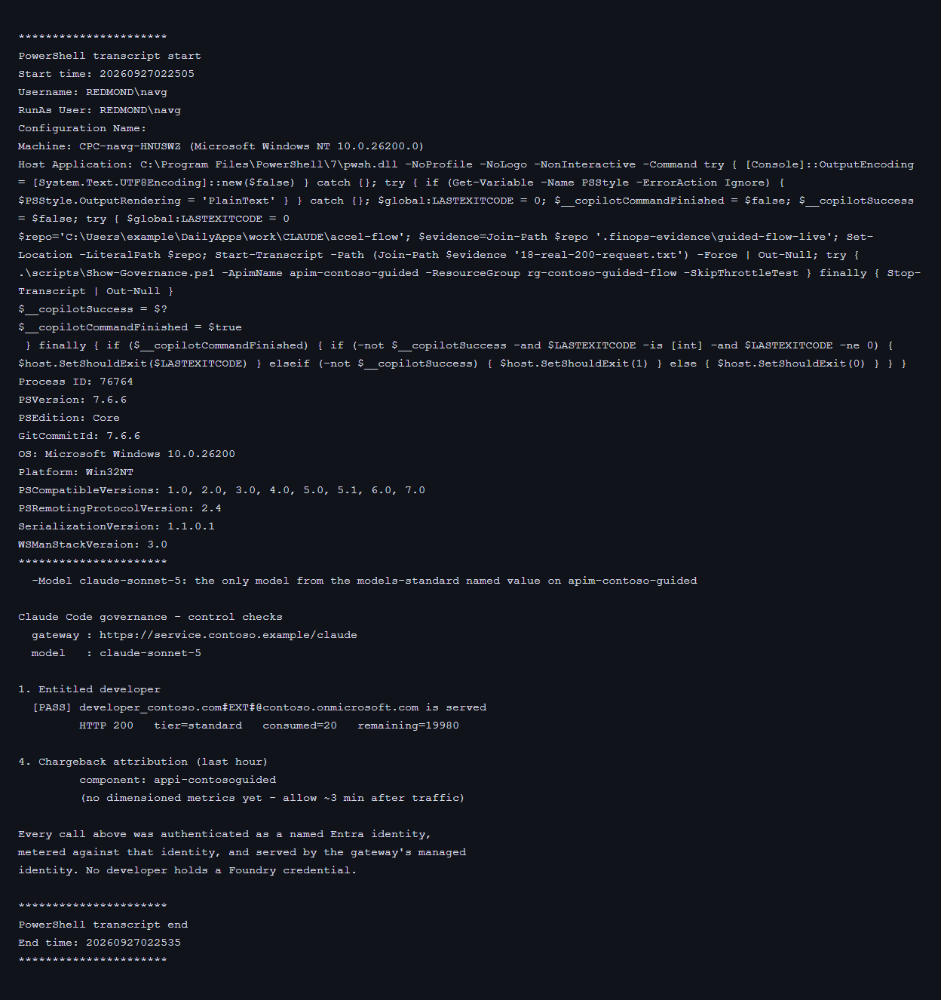

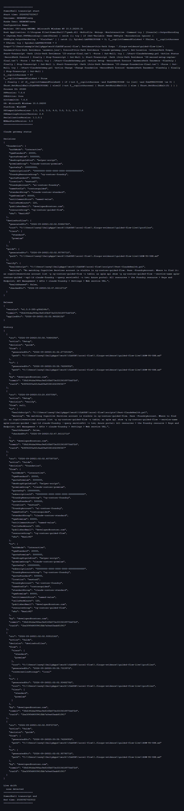

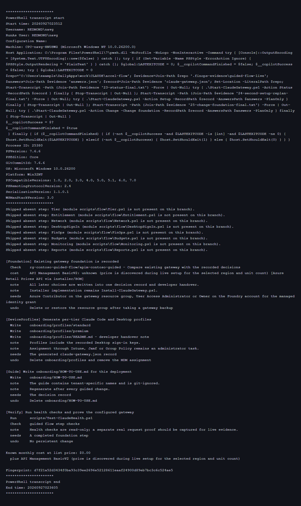

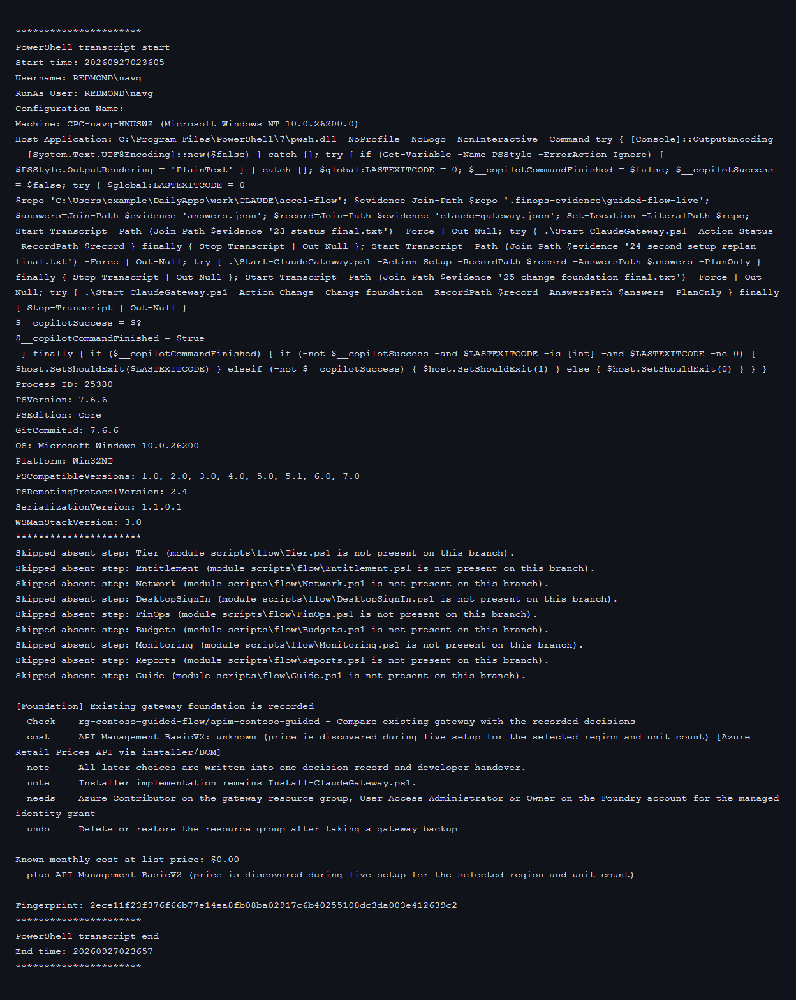

### Integrated run, 2026-09-27

One isolated Basic v2 estate, set up and then updated, checked and diagnosed with
the flow, then torn down. Names are redacted. The review was captured before the
FinOps modules merged, so it lists them as absent.

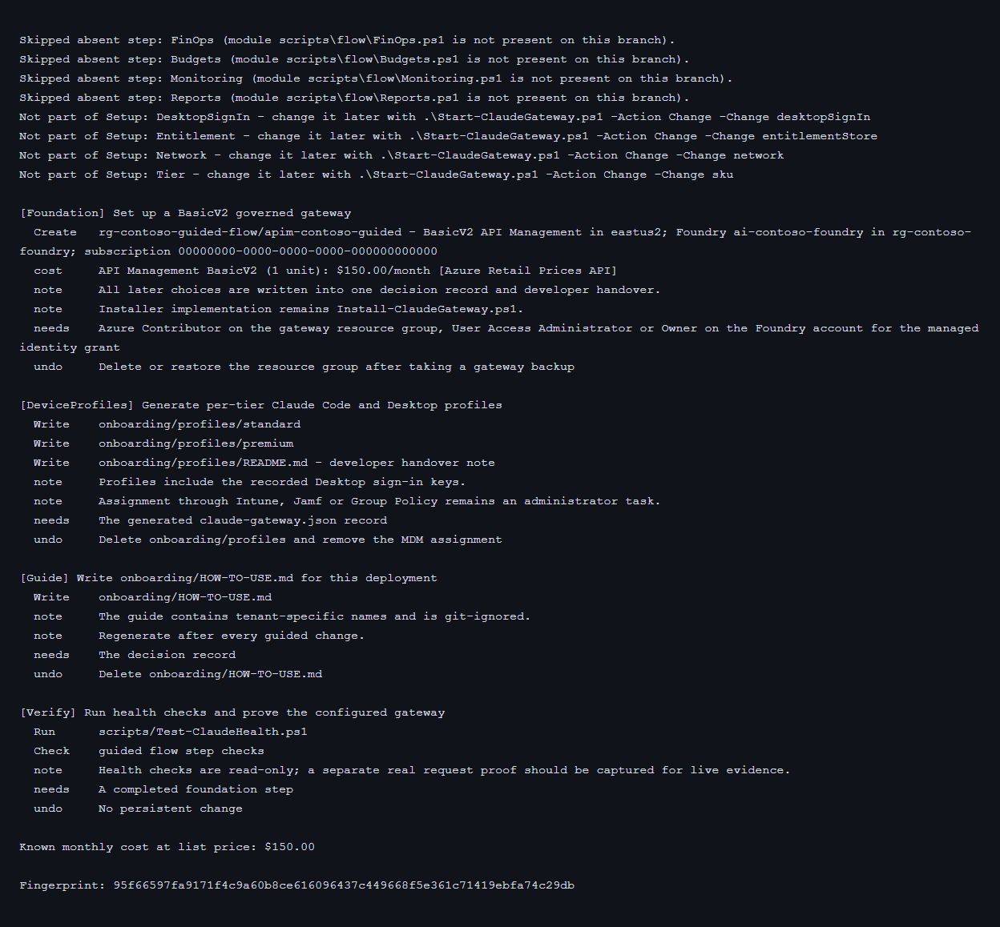

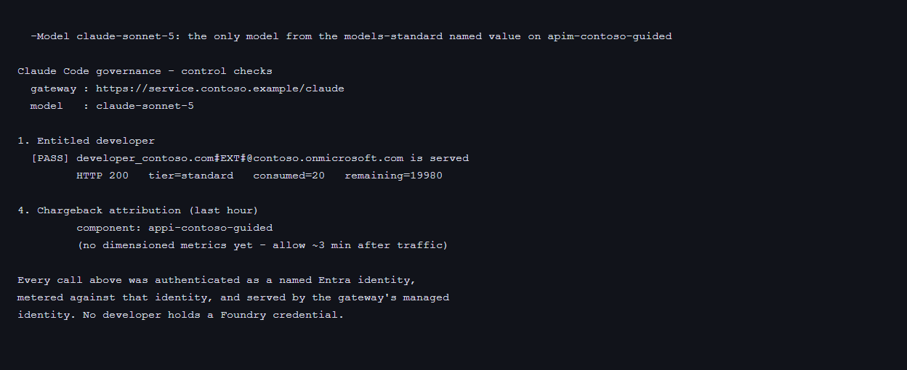

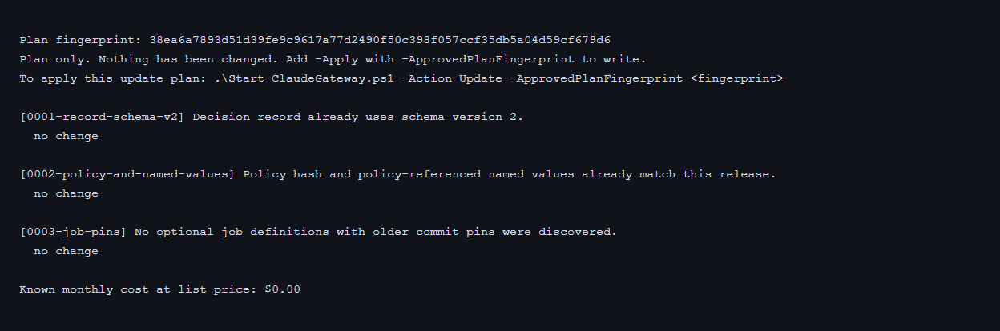

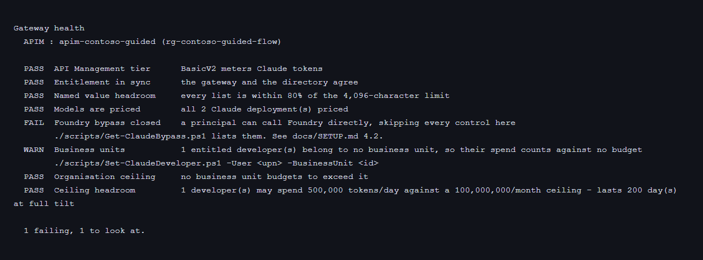

### Attended setup, 2026-09-27

Images 30 to 34 are excerpts of two attended runs against the reference subscription on
2026-09-27, driven through standard input with `CLAUDE_INTERACTIVE=1`. The first had an empty
record and was declined at the installer's summary, so nothing was created. The second had a
record naming the reference gateway and stopped at the fingerprint prompt with a wrong entry, so
nothing was written. Names are redacted by `guide/render-terminal.mjs`; the raw transcripts stay
under private evidence.
