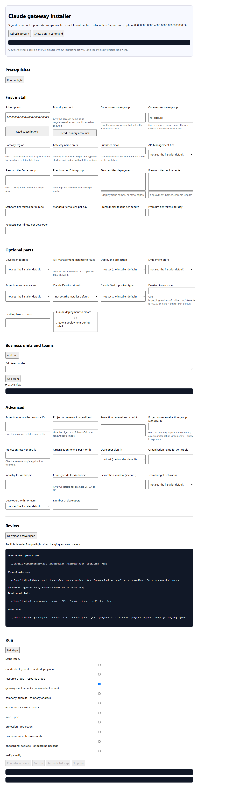
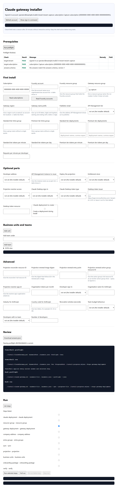
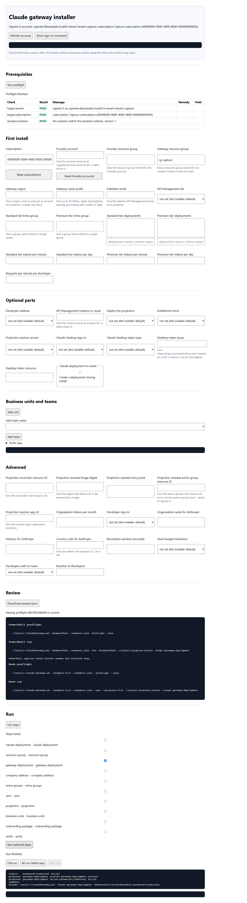

# Installer UI

The installer UI is a local form over the same answers schema, preflight result, step list and
progress stream that the installers expose. It adds no Azure service or hosted control plane
(`docs/architecture/18-installer-ui.json:1-17`; `tools/installer-ui/server.mjs:1-15`).

## Start command

The portable start command is:

```powershell
node ./tools/installer-ui/server.mjs
```

The command prints a URL of the form `http://127.0.0.1:<port>/?token=<token>`. The token is random
and at least 32 bytes before encoding, and the default bind address is `127.0.0.1`
(`tools/installer-ui/server.mjs:228`; `tools/installer-ui/server.mjs:636`; `tools/installer-ui/server.mjs:651-654`). A non-loopback
bind requires `--allow-host <host[:port]>` and prints a risk line (`tools/installer-ui/server.mjs:638-641`; `tools/installer-ui/server.mjs:655`).
The first top-level page request consumes the URL token and sets an `HttpOnly; SameSite=Strict`
cookie whose value is a new session secret, not the bootstrap URL token; `GET /api/session` returns
the CSRF token and `live` or `static` mode (`tools/installer-ui/session-auth.mjs:4-13`;
`tools/installer-ui/server.mjs:390-408`; `tools/installer-ui/http-helpers.mjs:13-30`).

Live mode requires PowerShell 7 or newer from the configured `pwsh` command. If the command is absent
or reports an older major version, `/api/session` reports static mode and live child-spawning routes
return `503` (`tools/installer-ui/server.mjs:101-122`; `tools/installer-ui/server.mjs:331-337`; `tools/installer-ui/server.mjs:408`).

Microsoft Learn states that Azure Cloud Shell's Web preview menu can open a port and browse it in a
new tab, and the same article describes **Manage files > Upload** for file uploads
([Cloud Shell window](https://learn.microsoft.com/en-us/azure/cloud-shell/use-the-shell-window),
fetched 2026-10-05; ms.date 2026-08-07). It does not state whether Web preview reaches a process
bound to loopback, which Host header it forwards, whether it adds a URL prefix or how a cookie with
`Path=/` behaves. Those facts remain unverified until the owner-attended Web preview check (U100,
U101). The server has `--allow-host <host[:port]>` for that check, and refused Host requests log the
Host and `X-Forwarded-*` shape to the terminal only (`tools/installer-ui/server.mjs:382-383`;
`tools/installer-ui/server.mjs:635-646`). Microsoft Learn states that Cloud Shell sessions time out
after 20 minutes without interactive activity
([Cloud Shell FAQ](https://learn.microsoft.com/en-us/azure/cloud-shell/faq-troubleshooting), fetched
2026-10-05; ms.date 2026-02-09); whether a Web preview tab counts as activity is unverified (U102).

## Static fallback

`tools/installer-ui/index.html` opens from disk. It carries a copy of
`schemas/claude-gateway.answers.schema.json` in `#schema-json` and uses classic deferred scripts so
Chromium can run it from `file://` (`tools/installer-ui/index.html:8-15`). The static schema copy is
compared with the canonical schema in a browser-oriented test (`tests/installer-ui.test.mjs:221-229`).
The local server serves the same `index.html` bytes for `/` and `/index.html`, so static and live
mode share one page source (`tools/installer-ui/server.mjs:414`;
`tests/installer-ui-structure.test.mjs:52-59`).

Static mode validates answers, writes `answers.json` and shows generated command blocks. Bash command
blocks appear only when every current answer has an `x-appliedBy` entry for
`install-claude-gateway.sh` and every selected step is one of the bash installer's `CKPT_ORDER` steps;
the model owns that list and a test keeps it equal to `scripts/install-checkpoint.sh`
(`tools/installer-ui/ui-model.js:578-579`; `tools/installer-ui/ui-model.js:610-647`; `tests/installer-ui-g2.test.mjs:350-356`). Static mode
does not read Azure and does not start the installer. The page hides live action and prefill controls
in static mode (`tools/installer-ui/installer-ui.js:714-715`). The Cloud Shell handoff displayed by
the page is download, **Manage files > Upload**, then the generated command
(`tools/installer-ui/installer-ui.js:443-444`; `tools/installer-ui/ui-model.js:644`).

The browser validator uses the same answer names, schema subset and cross-field rules as the
PowerShell validator for `Install-ClaudeGateway.ps1`; the P92 corpus parity test compares check ids
and paths (`tools/installer-ui/ui-model.js:288-401`; `tools/installer-ui/ui-model.js:447-514`; `tests/installer-ui-g3.test.mjs:282-309`). It
marks invalid fields and withholds download, preflight, run and command text while a problem remains
(`tools/installer-ui/installer-ui.js:254-292`; `tools/installer-ui/installer-ui.js:395-433`).
Action buttons show a busy label while a request is in flight, restore their controls afterward and
place failures next to the action as an alert with a recovery sentence
(`tools/installer-ui/installer-ui-actions.js:32-94`). When a focused busy button is disabled, the page
moves keyboard focus to the action status line and then back to the button; during a run one Tab
reaches Stop run (`tools/installer-ui/installer-ui-actions.js:58-102`;
`docs/status/P93.md:1604-1611`). The page has no keyboard shortcuts of its own
(`docs/status/P93.md:1604-1611`).
Account refresh, prefill, preflight and run actions share a page-level Azure-busy state. A 409
`azure-busy` response is shown beside the used control with the operation that holds Azure CLI
(`tools/installer-ui/installer-ui-actions.js:32-56`; `tools/installer-ui/installer-ui.js:365-393`).

## Security model

The server uses Node's built-in `http` module and no npm package (`tools/installer-ui/server.mjs:1`).
It serves fixed routes only, refuses `OPTIONS`, sends no CORS header and sends a Content-Security-Policy
without inline script (`tools/installer-ui/server.mjs:385`; `tools/installer-ui/server.mjs:414-423`; `tools/installer-ui/server.mjs:585`; `tools/installer-ui/http-helpers.mjs:32-59`).
The Host allowlist accepts loopback names for the selected port
(`tools/installer-ui/http-helpers.mjs:61-74`). The server passes any explicit `--allow-host` value
into that allowlist (`tools/installer-ui/server.mjs:646`).

The bootstrap token is one-use and the session cookie is a separate random secret stored only as a
hash in the server process (`tools/installer-ui/session-auth.mjs:4-13`;
`tools/installer-ui/server.mjs:390-406`). The session cookie and `x-csrf-token` header protect JSON `POST` routes. JSON POST routes require
`Content-Type: application/json`; child-spawning POST routes also check Origin and Fetch Metadata,
and child-spawning GET routes refuse cross-site Fetch Metadata (`tools/installer-ui/server.mjs:410-411`;
`tools/installer-ui/server.mjs:321-329`; `tools/installer-ui/http-helpers.mjs:80-96`). Prefill accepts
only the three known read kinds and text parameters (`tools/installer-ui/server-model.mjs:62-75`;
`tools/installer-ui/server.mjs:441-454`). When Azure CLI resolves to a Windows `.cmd` or `.bat` shim,
the prefill seam refuses parentheses in the Foundry resource group before any `az` call
(`scripts/Get-ClaudeInstallerUiPrefill.ps1:28-32`).

Node never spawns `az`. Azure identity and prefill reads go through
`scripts/Get-ClaudeInstallerUiIdentity.ps1` and `scripts/Get-ClaudeInstallerUiPrefill.ps1`; installer
work goes through `Install-ClaudeGateway.ps1` (`shell: false`)
(`tools/installer-ui/server.mjs:52-57`; `tools/installer-ui/server.mjs:75-88`; `tools/installer-ui/server.mjs:96-99`;
`tools/installer-ui/server.mjs:441-454`; `tools/installer-ui/server.mjs:455-487`; `tests/installer-ui-structure.test.mjs:67-93`). Output from
children is redacted with the installer's rule table and local paths are scrubbed before HTTP details
or stream events leave the server (`tools/installer-ui/server-model.mjs:17-48`;
`tools/installer-ui/server.mjs:137-150`; `tools/installer-ui/server.mjs:469`).
Origin and Fetch Metadata refusals write one terminal diagnostic containing Origin, Host,
`Sec-Fetch-Site` and forwarded headers while the HTTP response stays generic
(`tools/installer-ui/server.mjs:250-252`; `tools/installer-ui/http-helpers.mjs:80-96`).

The UI does not collect the PFX password because the schema marks `AddressCertificatePassword` as a
secret and the page renders non-secret installer answers only
(`schemas/claude-gateway.answers.schema.json:26-27`; `tools/installer-ui/ui-model.js:92-96`;
`tools/installer-ui/ui-model.js:180`). With `-Yes -NonInteractive` and
`AddressCertificateSource = Pfx`, `Install-ClaudeGateway.ps1` does not prompt and passes no
certificate password unless it is supplied on the command line
(`Install-ClaudeGateway.ps1:1164-1166`; `Install-ClaudeGateway.ps1:1178-1179`).
The live server refuses that run shape with `409` and `reason: pfx-needs-terminal` before creating a
run (`tools/installer-ui/server.mjs:494-496`).
The page also disables run buttons for a PFX custom address, keeps preflight available and renders
the PowerShell run command without `-Yes`, so the installer asks for the PFX password in the terminal
(`tools/installer-ui/installer-ui.js:306-313`; `tools/installer-ui/installer-ui.js:395-433`; `tools/installer-ui/ui-model.js:581-601`; `tools/installer-ui/ui-model.js:610-647`).

## Run lifecycle and limits

Preflight produces a canonical SHA-256 fingerprint over schema version, engine, answers, requested
step scope and the Azure identity snapshot read after a PASS. A new preflight attempt clears any
stored pass for the same answers and engine before the child starts, so a later malformed output,
timeout or identity-read failure leaves no reusable old pass
(`tools/installer-ui/preflight-record.mjs:28-30`; `tools/installer-ui/server.mjs:461-487`).
The passing preflight also stores the signed-in state, user, tenant and subscription snapshot; run
admission reads identity again under the Azure lease and refuses changed identity with `409`
(`tools/installer-ui/server.mjs:301-319`; `tools/installer-ui/server.mjs:478-481`;
`tools/installer-ui/server.mjs:506-513`).

One Azure CLI lease covers identity, prefill, preflight and a run from admission through its summary.
Reads queue behind reads, reads and runs are refused while a run holds the lease, and runs are
refused while a read holds it (`tools/installer-ui/azure-lease.mjs:1-70`;
`tools/installer-ui/server.mjs:287-291`; `tools/installer-ui/server.mjs:499-517`). One installer run can be active. A second run receives `409`, and `POST /api/run` is not a route, so
it returns `404` through the fixed-route fallback (`tools/installer-ui/server.mjs:585`). A run writes its answers and progress file to a per-run
temporary directory and removes that directory after the child exits (`tools/installer-ui/server.mjs:354-358`;
`tools/installer-ui/server.mjs:553-564`). A disconnected browser does not kill the child. `GET
/api/run/status` reports the active or last run without the tail, and `GET /api/run/attach?after=<seq>`
streams prior and live events from the bounded tail (`tools/installer-ui/server.mjs:434-440`;
`tools/installer-ui/run-record.mjs:10-126`).

The run tail keeps the latest 8 MiB or 50,000 events, and each client reads at its own pace. A stream
whose position leaves the tail receives one notice with the number of events it missed
(`tools/installer-ui/run-record.mjs:5-8`; `tools/installer-ui/run-record.mjs:78-126`). Console and
progress lines are redacted before they leave the server (`tools/installer-ui/server.mjs:137-150`;
`tools/installer-ui/server.mjs:176-181`). Console output above 4 MiB per run is replaced by one
notice, a console line above 64 KiB is truncated with ` [line truncated]`, and the browser keeps
2,000 visible output lines with one line naming the number removed (`tools/installer-ui/server.mjs:37-38`;
`tools/installer-ui/server.mjs:141-152`; `tools/installer-ui/run-transport.mjs:28-67`;
`tools/installer-ui/installer-ui-run.js:6`; `tools/installer-ui/installer-ui-run.js:31-41`).

The run output is a labelled log region (`tools/installer-ui/index.html:33`). The Stop run button is
enabled only while a run is active, confirms the running step name and then stops the process tree
(`tools/installer-ui/installer-ui.js:420-421`; `tools/installer-ui/installer-ui.js:688-690`; `tools/installer-ui/installer-ui-run.js:211-220`). Windows
uses `taskkill.exe /PID <pid> /T /F`; POSIX children run in a detached process group so the group can
be signalled (`tools/installer-ui/server.mjs:61-64`; `tools/installer-ui/server.mjs:80`; `tools/installer-ui/server.mjs:66-68`). The stop
response and stream say that the install checkpoint resumes when the same steps run again
(`tools/installer-ui/server.mjs:580-583`).
If Stop run arrives after a run record exists but before the installer child is spawned, the server
records the stop request and skips the spawn; if the child appears after the request, it is killed
immediately (`tools/installer-ui/server.mjs:534-541`; `tools/installer-ui/server.mjs:577-578`).
The browser run script reports non-zero summaries as alerts with the exit code, failed step and
resume command, reports stopped summaries as status, and bounds reattaches for streams that end
without a summary (`tools/installer-ui/installer-ui-run.js:50-136`). A run request that fails before
the server answers is followed by a status read: a run that started is reattached, otherwise the page
clears its run state and reports that the server has no active run. Each new run reattaches from its
own first event (`tools/installer-ui/installer-ui-run.js:151-181`).

Read-only child routes use per-route timeouts: step list 60 seconds, identity 120 seconds, prefill
120 seconds and preflight 600 seconds, with the test override `readOnlyTimeoutMs`
(`tools/installer-ui/server.mjs:246`). Idle shutdown is armed only when no tracked read-only job or
run is active (`tools/installer-ui/server.mjs:261-285`).
Read-only output is decoded with UTF-8 decoders and capped at 1 MiB across stdout and stderr by
default. Progress file reads use 64 KiB chunks, and a progress line over 64 KiB becomes one stream
error while later valid progress lines still arrive (`tools/installer-ui/child-output.mjs:3-60`;
`tools/installer-ui/server.mjs:157-190`; `tools/installer-ui/run-transport.mjs:69-89`).

## Sections

| Section | Source and behaviour |
|---|---|
| Account | Shows user, tenant id, subscription name and subscription id from the Azure CLI account through repository PowerShell. A button shows `az login --use-device-code` when sign-in is needed (`scripts/Get-ClaudeInstallerUiIdentity.ps1:1-29`; `tools/installer-ui/installer-ui.js:563-577`; `tools/installer-ui/installer-ui.js:622-624`). |
| First install | Renders the subscription, Foundry account, gateway resource group, region, publisher, tier, initial groups, quotas and model deployment fields (`tools/installer-ui/ui-model.js:7-32`; `tools/installer-ui/installer-ui.js:115-145`). Server mode can read subscriptions, Foundry accounts and deployment names through `POST /api/prefill`; static mode hides those read actions (`tools/installer-ui/installer-ui-prefill.js:16-70`; `tools/installer-ui/installer-ui.js:714-715`). |
| Optional parts | Renders company-address, existing-APIM reuse, Desktop sign-in, projection toggle, entitlement-store and business-unit answers that `Install-ClaudeGateway.ps1` applies. Fields with declarative conditions are hidden until their condition holds and hidden fields are not written to `answers.json`. The PFX password is not an answer, and the installer prompt behaviour is the one stated above (`tools/installer-ui/ui-model.js:33-58`; `tools/installer-ui/ui-model.js:147-198`; `tools/installer-ui/installer-ui.js:223-252`; `Install-ClaudeGateway.ps1:1164-1179`). |
| Advanced | Renders projection renewal, resolver app, organisation quota, developer estimate, revocation window, model-organisation metadata, team-budget behaviour, unassigned-developer behaviour and the optional pending Claude deployment object (`tools/installer-ui/ui-model.js:59-76`; `tools/installer-ui/installer-ui.js:173-207`). |
| Business units | Provides a two-level editor: add a unit, add a team under a unit, remove either, then serialize units before teams. Add unit and Add team focus the new row's first field. Remove focuses the row that takes the removed row's place, else the previous row, else Add unit. Fields are id, Entra group, monthly USD budget, mode and percent only for `Allowance`. Ids are lower-case letters, digits and hyphens, max 64; ids are unique; group names exclude `'`, `,` and `:`; `Allowance` requires percent 1-100; teams name one parent unit. The JSON view round-trips through the same validation (`tools/installer-ui/installer-ui-business-units.js:9-37`; `tools/installer-ui/installer-ui-business-units.js:66-177`; `tools/installer-ui/ui-model.js:222-250`; `tools/installer-ui/ui-model.js:525-569`). |
| Review | Runs installer preflight and shows check, result, message, remedy and field links when a problem names or maps to an answer path. A passing preflight returns a 64-character SHA-256 fingerprint over canonical answers, engine and step scope. Failing checks mark fields through a problem path when present, otherwise through the schema's `x-checkId` mapping. Non-JSON preflight output returns a visible error with the exit code and a short redacted, path-scrubbed output tail (`tools/installer-ui/installer-ui.js:497-532`; `tools/installer-ui/installer-ui-problems.js:49-66`; `tools/installer-ui/preflight-record.mjs:28-30`; `tools/installer-ui/server.mjs:467-485`). |
| Run | Lists installer step ids, streams selected-step output as it arrives, shows a failed step with a rerun action and resume command, reattaches to an active run after reload and keeps a full run as a separate confirmed action (`tools/installer-ui/installer-ui.js:540-557`; `tools/installer-ui/installer-ui-run.js:50-209`; `tools/installer-ui/installer-ui.js:655-678`). A run starts only when its fingerprint matches a stored passing preflight for the same answers and a covering scope. Displayed commands use `./Install-ClaudeGateway.ps1` and `./install-claude-gateway.sh` (`tools/installer-ui/ui-model.js:603-647`). |

Invalid business-unit JSON stays in the textarea as a blocking validation problem until it becomes a
JSON array of objects again, and monthly USD budgets accept finite decimals in the schema range
(`tools/installer-ui/installer-ui-business-units.js:17-51`; `tools/installer-ui/installer-ui-business-units.js:179-199`;
`tools/installer-ui/ui-model.js:222-250`).
The First install prefill choices are scoped to the current account's read and preserve typed
deployment names in the answer inputs (`tools/installer-ui/installer-ui-prefill.js:72-141`). Review
uses the passing preflight's scope and identity to decide which run buttons are admitted
(`tools/installer-ui/installer-ui.js:395-433`). Run summaries are interpreted by
`installer-ui-run.js`: non-zero summaries are alerts, stopped summaries are status text and
reattach failures use the run alert region (`tools/installer-ui/installer-ui-run.js:50-136`;
`tools/installer-ui/installer-ui-run.js:222-224`).

## Installer interface checks

The server validates the P92 step list, preflight result and progress event interfaces before using
them. Each must use `schemaVersion: 1`, required fields and accepted vocabularies; malformed step
lists and preflight results return `502`, and malformed progress events become stream error events
(`tools/installer-ui/installer-contract.mjs:29-92`; `tools/installer-ui/server.mjs:175-182`;
`tools/installer-ui/server.mjs:467-475`; `tools/installer-ui/server.mjs:592-596`).
The preflight adapter also requires every schema-declared preflight check exactly once, recomputes
the top-level PASS or FAIL from the producer blocking rule, and accepts empty progress `stepId`
values only on whole-run `failed` and `refused` events
(`tools/installer-ui/installer-contract.mjs:57-103`; `tools/installer-ui/installer-contract.mjs:106-116`;
`tools/installer-ui/server.mjs:466-470`).

## Screenshots






