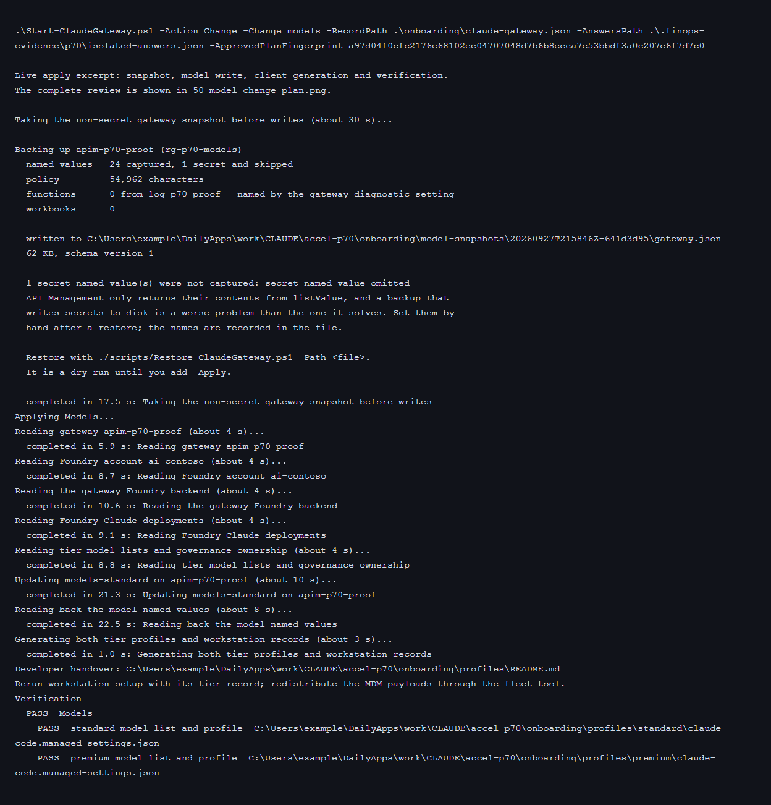
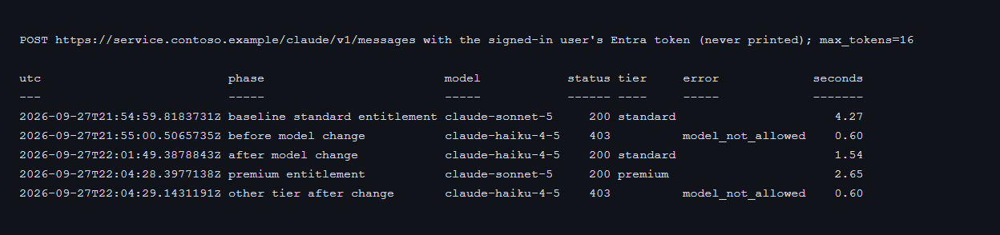
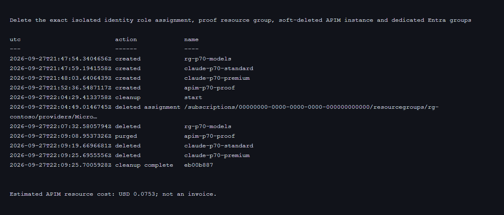
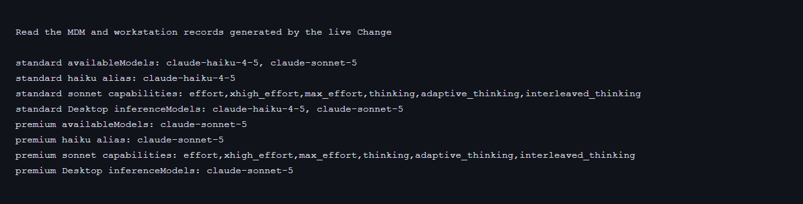
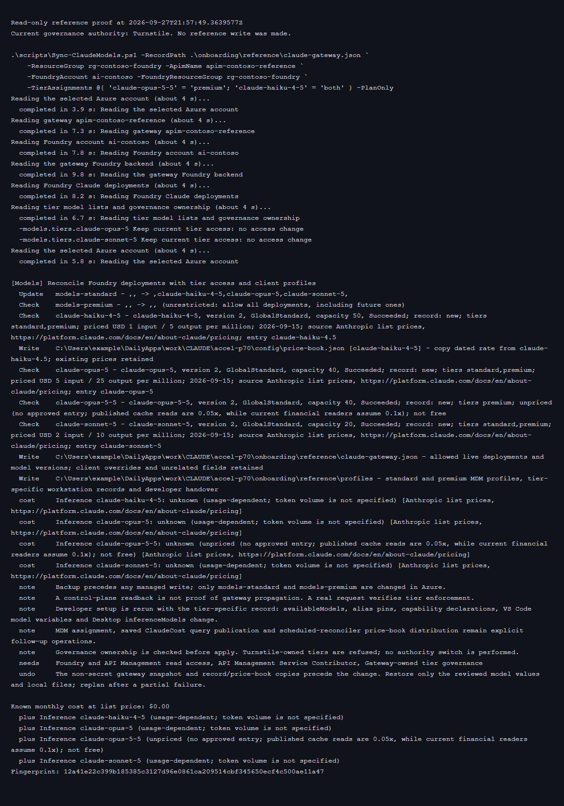

# Adding a model

`Start-ClaudeGateway.ps1 -Action Change -Change models` reconciles existing
Foundry Claude deployments with gateway model lists, the deployment record,
the local price book and both tiers' client profiles. The same operation is
available as `scripts/Sync-ClaudeModels.ps1`.

The operation does not deploy or delete a Foundry model, change Entra
membership, assign MDM policy or run software on another workstation.
[ADR-0034](adr/0034-model-lifecycle.md) defines these boundaries.
## Quickstart

The model plan runs from the repository root in PowerShell 7. The gateway record supplies the target, and the selected deployment name comes from Foundry Models + endpoints.

```powershell
$gateway = Get-Content .\onboarding\claude-gateway.json -Raw | ConvertFrom-Json
.\scripts\Add-ClaudeModel.ps1 -ResourceGroup $gateway.resourceGroup -ApimName $gateway.apimName -List
```

**Expected result:** the command lists the current deployed and allowed models without writing. The write path below verifies the deployment, gateway allowlist, price book and developer configuration together.

## Prerequisites

<details>

<summary>Prerequisites reference</summary>

Discovery needs read access to the selected Foundry account and API Management
instance. Apply needs API Management Service Contributor, writable local
record/profile paths and permission to read a non-secret gateway backup.
The gateway must own tier governance. When Turnstile owns it, the plan is
available but apply refuses; its next governance publication would otherwise
overwrite the model lists.

The default record is `onboarding\claude-gateway.json`, written by the
installer. `-RecordPath` selects another record. Separate `-FoundryResourceGroup`
and `-ResourceGroup` arguments on the standalone command support a gateway
and model account in different groups.

### Find the target and model values

| Input | Source | Read-only command |
|---|---|---|
| Gateway name and group | API Management Overview; deployment record | `az apim list -o table` |
| Foundry account | The gateway API backend | `az apim api show -g <gateway-rg> --service-name <apim> --api-id claude-foundry --query serviceUrl -o tsv` |
| Deployment name, model, version, SKU and capacity | Foundry > Build > Models, or Models + endpoints in the classic portal | `az cognitiveservices account deployment list -g <foundry-rg> -n <account> -o json` |
| Permitted models | API Management > Named values | `az apim nv list -g <gateway-rg> --service-name <apim> -o json` |
| Approved rates | The dated private price book and provider agreement | `Get-Content .\config\price-book.json` |

The deployment name is the value in requests and allowlists; it can differ
from the catalogue model name. The sync checks that the selected account is
the gateway's backend. Failed discovery is an error, not an empty account.
Every raw deployment identity is validated before Claude filtering, including
rows from other publishers. A malformed row cannot appear as a retired model.

The Azure portal account view links to the Foundry portal for deployments.
The model view exposes the actual deployment name, model, version, SKU/capacity
and provisioning state
([Microsoft Learn](https://learn.microsoft.com/azure/foundry/foundry-models/how-to/deploy-foundry-models)).

</details>
## 1. Inspect, deploy and allow

<details>

<summary>1. Inspect, deploy and allow reference</summary>

An administrator deploys the model through Foundry's approved deployment
process. The model change then discovers it:

```powershell
.\Start-ClaudeGateway.ps1 -Action Change -Change models
```

Each deployment shows its model, version, SKU/capacity, state and price status
before the tier question. A new one offers `standard`, `premium`, `both` or
`none`; an existing one also offers `keep`. Only a `Succeeded` deployment can
be newly allowed. Missing deployments offer `keep` or `drop`.

Without a console, an answers file supplies the choices:

```json
{
  "models.tiers.claude-opus-5-5": "premium",
  "models.tiers.claude-haiku-4-5": "both"
}
```

```powershell
.\Start-ClaudeGateway.ps1 -Action Change -Change models `
    -AnswersPath .\model-answers.json -PlanOnly

.\Start-ClaudeGateway.ps1 -Action Change -Change models `
    -AnswersPath .\model-answers.json -ApprovedPlanFingerprint <fingerprint>
```

`-PlanOnly` and `-WhatIf` write nothing, including no snapshot or record.
A period in a deployment name becomes `~` in its answer key:
deployment `prod.opus` uses `models.tiers.prod~opus`. The actual model name
in Azure, the price book and clients does not change.

The standalone equivalent accepts a hashtable as well:

```powershell
.\scripts\Sync-ClaudeModels.ps1 `
    -RecordPath .\onboarding\claude-gateway.json `
    -TierAssignments @{
        'claude-opus-5-5' = 'premium'
        'claude-haiku-4-5' = 'both'
    } -PlanOnly
```

Its apply uses the same arguments with `-ApprovedPlanFingerprint` instead of
`-PlanOnly`. Unknown deployment names and malformed choices are refused.
Completed retirement choices stay recorded, so the same answers file remains
usable after the retired name has disappeared.

### Review and write boundary

The fingerprint covers the target, live deployments/lists, selections,
record inputs, price book, output locations and the renderers' dependencies.
Changes to a Claude Code or Desktop helper invalidate approval even when
`New-ClaudeCodePolicy.ps1` itself is unchanged. File additions/removals
participate in that comparison. Apply rechecks the live state,
takes `Backup-ClaudeGateway.ps1`'s non-secret snapshot, then writes only
`models-standard` and `models-premium` in Azure and reads them back.
Backups and the prior record/book are under the record's
`model-snapshots` directory. The shared flow takes this snapshot before even
writing its local run journal.

The API Management writes and local files are not one atomic transaction.
A failure stops with the snapshot path and identifies the need for a new
plan. A new plan reads any writes that already landed; no automatic rollback
overwrites another administrator's work. A management readback is not a
guarantee that every gateway has consumed the value. The real-request
procedure is in [Governance checks](GOVERNANCE-CHECKS.md).
Standalone history records both the preceding model decision and the signed-in
principal. Generated reference records, profiles and snapshots stay git-ignored
under nested `onboarding` folders as well as at the top level.

Every discovery, backup, write, readback and profile-generation wait gives
its purpose and an estimate, followed by the elapsed time.


The isolated apply captured 24 non-secret named values, skipped one secret
value, updated `models-standard` and regenerated both tier profiles. It did
not change the premium model list.



Real non-streaming requests on 2026-09-27 used the signed-in account, moved
between the two dedicated proof groups. Haiku returned 403 before the change,
200 in standard after the change, and 403 after the account moved to premium.
Sonnet returned 200 in each tier, establishing that the denied Haiku request
was a model decision, not missing entitlement.



The proof resource group, soft-deleted gateway, dedicated tier groups and
the gateway identity's exact shared-Foundry role assignment were removed.
An independent read at 22:13Z found none remaining. The three attempts
consumed an estimated USD 0.2136 of API Management time; invoice
reconciliation remains U2.



</details>
## The four things that have to agree

<details>

<summary>The four things that have to agree reference</summary>

| State | Location | Consequence of a mismatch |
|---|---|---|
| Deployed | Selected Foundry account | Foundry refuses a missing or unavailable deployment |
| Allowed | `models-standard` / `models-premium` | The gateway returns `403 model_not_allowed` before Foundry |
| Priced | Dated price book and published reporting/reconciler copy | Missing price is **unpriced**, not free; enforced dollar scopes can refuse incomplete pricing |
| Selectable | Tier records, Claude Code settings and Desktop profiles | The model picker or alias can lag behind the gateway |

Client-side selection is a management control, not the security boundary.
API Management enforces the tier allowlist even for a modified client.
The third is the one that fails quietly when a reporting copy of the price
book is left stale; the sync explicitly labels missing prices rather than
describing them as zero usage.

</details>
## The price book

<details>

<summary>The price book reference</summary>

`config/price-book.json` may hold your negotiated rates. It is private and
git-ignored; negotiated rates can be
commercially sensitive. `config/price-book.example.json` is the shipped
example. When no private file exists, the existing built-in dated rates are
the starting book. `models.priceBookPath` in the answers file, or
`-PriceBookPath` on the standalone command, selects another dated book.

```json
{
  "date": "2026-09-15",
  "source": "organisation-approved tariff and source reference",
  "models": {
    "claude-sonnet-5": { "inputPerM": 2.0, "outputPerM": 10.0 }
  }
}
```

Rates are USD per million input/output tokens. Monthly inference cost is
unknown without token volume; the plan does not display a missing price as
zero monthly cost.

An exact deployment entry wins. For GlobalStandard deployments, an exact
model entry or an unambiguous dotted/hyphenated numeric spelling can be
copied to the deployment name. Thus a dated `claude-haiku-4.5` entry can
produce `claude-haiku-4-5` at the same approved rate. Conflicting equivalent
entries are refused. Other SKUs need a deployment-specific entry. Historical
entries and unrelated metadata remain in the book.

**Opus 5.5 remains unpriced in the defaults.** The
[Anthropic pricing page](https://platform.claude.com/docs/en/about-claude/pricing),
retrieved 2026-09-28, publishes USD 4 input and USD 20 output per million,
with cache reads at **0.05x** input. The accelerator's current financial
readers assume 0.1x; copying base rates alone would misprice cached usage.
The same page lists Haiku 4.5 at USD 1/5 and describes Foundry CCU billing
at per-feature rates, subject to agreement discounts. U34 records the
decision not to guess a compatible Opus 5.5 rate.

A local price-book write is not a reporting publication. Saved `ClaudeCost`
queries embed the book when `scripts/Publish-ClaudeQueries.ps1` publishes
them. Scheduled dollar reconcilers carry their own deployed copy. Those
publication/distribution operations remain explicit, with each closed month's
exports and price snapshot retained ([FinOps](FINOPS.md),
[ADR-0010](adr/0010-financial-semantics.md)).

</details>
## What developers change

<details>

<summary>What developers change reference</summary>

The administrator record contains the allowed live union in `models`, and
`deployments` includes each deployment's model/version and existing client
overrides. The installer and later model changes both record each tier's
normalized `models` and `modelAllowList`, so initial profiles have the same
restrictions before any model sync. An installer selection that normalizes to
empty is refused rather than converted to an unrestricted list. The sync generates:

```text
onboarding\profiles\standard\claude-gateway.json
onboarding\profiles\premium\claude-gateway.json
onboarding\profiles\<tier>\claude-code.*
onboarding\profiles\<tier>\claude-desktop.*
onboarding\profiles\README.md
```

The selected tier's record accompanies the existing setup bundle. Windows:

```powershell
.\scripts\Setup-ClaudeWorkstation.ps1 `
    -ConfigPath .\onboarding\profiles\standard\claude-gateway.json
```

macOS/Linux, after the selected record is distributed as `claude-gateway.json`:

```bash
./scripts/setup-claude-workstation.sh --config ./claude-gateway.json
```

Rerunning setup updates `availableModels`, the newest recorded model in each
alias family, the model's capability declarations, VS Code's model
environment and Desktop `inferenceModels`. The gateway URL, sign-in choice
and entitlement stay unchanged; unrelated user settings remain. An installed
older Claude Code may be updated by setup unless `-SkipInstall` or
`--skip-install` is set
([developer setup](../DEVELOPER.md#after-a-model-change),
[ADR-0031](adr/0031-client-keys-every-release-reads.md)).
An alias and its capability declaration are removed when the selected models
no longer contain its family, on both Windows and macOS/Linux. Haiku still
falls back to Sonnet when Sonnet remains selected.

The MDM files use the tier's deployments and safe alias fallbacks. A later
DeviceProfiles/Guide run preserves that selection. Assignment through Intune,
Jamf or Group Policy remains a fleet action; a local sync does not silently
update devices ([MDM](MDM.md)).



</details>
## Retiring one

<details>

<summary>Retiring one reference</summary>

When Foundry no longer lists a deployment, the model question offers `drop`.
For example:

```json
{ "models.tiers.retired-deployment": "drop" }
```

`keep` preserves the gateway's list entry but reports that the deployment is
unavailable and excludes it from client selection. `none` removes access to a
deployment that still exists. Neither choice deletes the Foundry deployment.
The price-book entry stays for reports over earlier usage.

**An empty gateway model list means allow all, not deny all.** Removal of the
last restricted entry is refused. Entitlement revocation is a different
operation. A previously unrestricted `,,` tier is shown explicitly; choosing
a restricted set is a reviewed change rather than an assumed denial.

`Add-ClaudeModel.ps1` remains the older single-model deployment/price command.
It does not reconcile records/profiles, uses one resource group for both
services, and can write an empty allow-all list on last-entry removal.
The reviewed sync is the lifecycle path described here.

</details>
## Troubleshoot and next steps

<details>

<summary>Troubleshoot and next steps reference</summary>

### Reference-gateway preview

A read-only preview on 2026-09-27 at 21:57Z found both reference model lists
at `,,` and tier governance owned by Turnstile. The gateway therefore already
allowed every model, unlike the earlier inventory. Choosing Opus 5.5 for
premium and Haiku for both would restrict standard to its three other
existing deployments, leave premium unrestricted, and generate a separate
record and profiles. Apply remains blocked by Turnstile ownership; it does
not silently switch authority. The operator decides that ownership and
access change separately.



| Symptom | Meaning or next check |
|---|---|
| `DeploymentNotFound` | Deployment name, selected account and `Succeeded` state |
| `model_not_allowed` | The caller's effective tier and its complete sentinel list |
| Unpriced model | Exact deployment price, model mapping and published book |
| Turnstile ownership refusal | Tier model changes belong to Turnstile's Gateway governance page; ownership is not changed by this command |
| Fingerprint mismatch | Live state, decisions, price book, record or renderer differs; a new preview describes it |
| Model present in gateway but absent on a workstation | Distributed tier record, setup rerun and any higher-precedence MDM policy |
| Retired model still allowed | Unrestricted lists, another tier, propagation, or a direct Foundry bypass |

[Budgets](BUDGETS.md) covers limits; [Plugins](PLUGINS.md) covers non-model
client capabilities.

</details>
## Next

- [Developer setup](../DEVELOPER.md) covers client refresh after a model change.
- [Budgets](BUDGETS.md) covers model restrictions as a spend control.
- [Plugins](PLUGINS.md) covers marketplace and extension policy.
