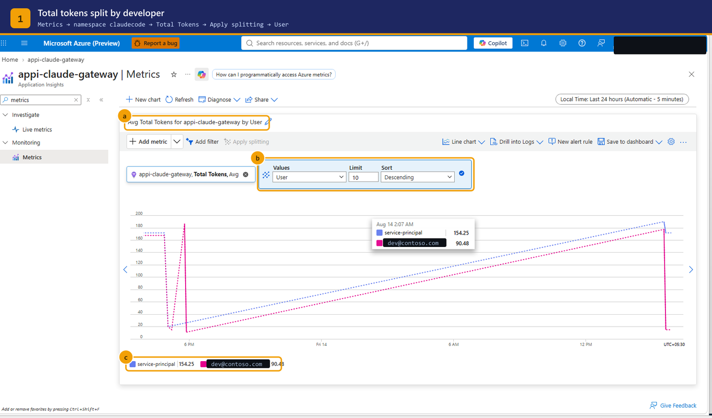

# Monitoring guide — usage, cost attribution, and alerts

Who this is for: whoever owns the AI spend and has to answer "who used what".

Everything here comes from one custom metric namespace, `claudecode`, emitted by
the `llm-emit-token-metric` policy on every request that reaches the gateway.

---

## 1. What is emitted

### Metrics

| Metric | Meaning |
|--------|---------|
| `Prompt Tokens` | input tokens |
| `Completion Tokens` | output tokens |
| `Total Tokens` | both — use this for cost |

### Dimensions

Five, which is the APIM maximum:

| Dimension | Value | Answers |
|-----------|-------|---------|
| `User` | UPN from the caller's token | who spent it — **chargeback** |
| `UserId` | Entra object id | same, but stable across renames |
| `Tier` | `standard` / `premium` | is the tiering doing anything |
| `Model` | `claude-sonnet-5` / `claude-opus-5` | where the cost concentrates |
| `SessionId` | Claude Code session | which task was expensive |

`User` is taken from the token the developer's own machine presented. It is not
a client-supplied header and cannot be spoofed by editing a config file.

---

## 2. The chart — step by step



1. **Application Insights → Monitoring → Metrics**
2. **Metric namespace** → `claudecode`
3. **Metric** → `Total Tokens`
4. **Aggregation** → `Sum` — see the warning below, this is ringed **a**
5. **Apply splitting** → **User**, ringed **b**. Set **Limit** to cover your team
   size; the default 10 silently truncates a larger team
6. Each series in the legend, ringed **c**, is one developer

### The aggregation trap

> The screenshot above is on **Avg**, which is what the portal defaults to, and
> it is the wrong number for cost.

Measured on this deployment over one day:

| Aggregation | Value | What it actually is |
|-------------|------:|---------------------|
| Sum | 515,212 | tokens consumed — **this is your bill** |
| Avg | 879.20 | average tokens per request |
| Count | 586 | number of requests |

Avg is useful for spotting a developer whose prompts are unusually large. It is
never the basis for chargeback. Set the aggregation to **Sum** before you export
anything to a finance conversation.

---

## 3. Filtering

**Add filter** narrows the chart; **Apply splitting** breaks it apart. You will
usually want both.

| Question | Filter | Split by |
|----------|--------|----------|
| What did one person spend? | `User = <upn>` | — |
| Is anyone approaching their daily quota? | — | `User` |
| Is Opus driving the cost? | — | `Model` |
| Is the premium tier being used at all? | — | `Tier` |
| Which model does one team prefer? | `Tier = premium` | `Model` |
| What did one expensive session cost? | `SessionId = <id>` | `Model` |

Real numbers from this deployment, last 7 days:

```
split by User      dev-a@contoso.com    518,372
                   service-principal      1,931

split by Tier      standard             518,372
                   premium                1,931

split by Model     claude-opus-5        466,400
                   claude-sonnet-5       53,903
```

That Model split is the single most actionable view here: Opus was 90% of
consumption. Changing the default model alias is usually a larger saving than
tightening anyone's budget.

---

## 4. Same data, from the CLI

Useful for scheduled reporting, and it is the only reliable path because
`az monitor metrics list` **drops `--namespace` for custom namespaces** and will
tell you the metric does not exist.

```powershell
$sub = '<subscription-id>'; $rg = '<rg>'; $ai = 'appi-claude-gateway'
$tok = az account get-access-token --resource https://management.azure.com --query accessToken -o tsv
$end   = (Get-Date).ToUniversalTime().ToString('yyyy-MM-ddTHH:mm:ssZ')
$start = (Get-Date).ToUniversalTime().AddDays(-7).ToString('yyyy-MM-ddTHH:mm:ssZ')

function Split-By($dim) {
  $f = [uri]::EscapeDataString("$dim eq '*'")
  $uri = "https://management.azure.com/subscriptions/$sub/resourceGroups/$rg" +
         "/providers/Microsoft.Insights/components/$ai/providers/Microsoft.Insights/metrics" +
         "?api-version=2019-07-01&metricnames=Total%20Tokens&metricnamespace=claudecode" +
         "&aggregation=Total&timespan=$start/$end&interval=P1D&`$filter=$f"
  $r = Invoke-RestMethod -Uri $uri -Headers @{ Authorization = "Bearer $tok" }
  "--- by $dim ---"
  $r.value[0].timeseries | ForEach-Object {
    '{0,-45} {1}' -f $_.metadatavalues[0].value, ($_.data | Measure-Object total -Sum).Sum
  }
}

Split-By User; Split-By Tier; Split-By Model
```

Two syntax traps:

- `aggregation=Total` is the API's name for Sum. There is no `aggregation=Sum`.
- `interval` accepts only `PT1M, PT5M, PT15M, PT30M, PT1H, PT6H, PT12H, P1D`.
  `P7D` returns `BadRequest: Invalid time grain duration`.

---

## 5. Drill into logs

Metrics are pre-aggregated. For anything per-request — latency, status codes,
which prompt burned the quota — use **Drill into Logs**, or the Logs blade
directly:

```kusto
// tokens per developer, last 7 days, highest first
customMetrics
| where name == "Total Tokens"
| where timestamp > ago(7d)
| extend User = tostring(customDimensions.User),
         Tier = tostring(customDimensions.Tier),
         Model = tostring(customDimensions.Model)
| summarize Tokens = sum(value), Requests = count() by User, Tier
| order by Tokens desc
```

Verified output on this deployment:

```
User                Tier        Tokens   Requests
dev-a@contoso.com   standard    518782         93
service-principal   premium       2352         10
```

```kusto
// the most expensive sessions
customMetrics
| where name == "Total Tokens" and timestamp > ago(7d)
| extend User = tostring(customDimensions.User),
         SessionId = tostring(customDimensions.SessionId)
| summarize Tokens = sum(value) by SessionId, User
| top 20 by Tokens desc
```

One session accounted for 515,212 of the 518,782 tokens above — a single long
agent run. This is the query that explains a spike, and it is why `SessionId` is
worth one of the five dimension slots.

> `SessionId` reads `none` for callers that do not send
> `x-claude-code-session-id` — service principals and raw `curl` tests, not the
> Claude Code client.

### Throttling — and an honest limit

```kusto
// throttle and quota pressure, last 24h
requests
| where timestamp > ago(24h)
| where resultCode in ("429", "403")
| summarize Blocked = count() by resultCode, name
| order by Blocked desc
```

> **This cannot be split by user, and it is worth knowing why.**
> APIM's `requests` telemetry carries only APIM's own dimensions — Service ID,
> API Name, Operation Name, Region. The `User` dimension lives on
> `customMetrics`, which is written by `llm-emit-token-metric`, and that policy
> runs only *after* a successful backend response. A 429 or 403 short-circuits
> the pipeline before it, so the throttled request never gets a user attached.
>
> Querying `customDimensions.User` on `requests` returns blank rather than an
> error, which makes this easy to miss.

If you need per-user throttle attribution, emit a counter on the rejection path
by adding this to the `<on-error>` section of the policy:

```xml
<emit-metric name="Throttled" namespace="claudecode" value="1">
    <dimension name="User" value="@((string)context.Variables["userUpn"])" />
    <dimension name="Reason" value="@(context.Response.StatusCode.ToString())" />
</emit-metric>
```

Then split the `Throttled` metric by `User` exactly as in section 3. It costs
one extra custom metric; the five-dimension cap applies per metric, not per
namespace, so the existing token metric is unaffected.

> Log ingestion lags metrics by a few minutes. If a query returns nothing right
> after a test call, wait before concluding it is broken.

---

## 6. Alerts

Budgets throttle individuals. Alerts tell **you** before the monthly invoice
does.

**Metrics blade → New alert rule**, or:

```bash
AI_ID=$(az resource show -g <rg> -n appi-claude-gateway \
  --resource-type Microsoft.Insights/components --query id -o tsv)

az monitor metrics alert create \
  --name claude-hourly-burn \
  --resource-group <rg> \
  --scopes "$AI_ID" \
  --condition "total 'Total Tokens' > 2000000" \
  --window-size 1h --evaluation-frequency 15m \
  --description "Claude Code consumption above the expected hourly rate"
```

> Use `az resource show`, not `az monitor app-insights component show` — the
> latter needs the `application-insights` CLI extension, which is not installed
> by default and will prompt interactively in a pipeline.

Worth having:

| Alert | Condition | Why |
|-------|-----------|-----|
| Aggregate burn | `Sum(Total Tokens) > <hourly budget>` over 1h | catches a runaway agent loop |
| Throttle storm | `Count(requests where resultCode == 429) > N` | budgets set too tight, or genuine overuse |
| Gateway unreachable | a standard availability test against `/claude/v1/messages` | developers blocked; must be configured separately, it is not deployed by the template |
| No traffic | `Sum(Total Tokens) == 0` over 24h | the metric pipeline broke silently |

That last one matters more than it looks. Every failure mode in section 8 shows
up as *zero metrics*, which is indistinguishable from nobody working — unless
you alert on it.

---

## 7. Dashboard

**Save to dashboard** on each chart. A useful board is four tiles:

1. Total Tokens, Sum, split by **User** — chargeback
2. Total Tokens, Sum, split by **Model** — where cost concentrates
3. Request count split by **resultCode** — 429/403 pressure
4. Total Tokens, Sum, no split, 30-day window — the trend

Share it to a resource group the finance or leadership stakeholders can read;
they need no access to APIM or Foundry to see it.

---

## 8. When the charts are empty

Diagnose in this order — each check is cheap and rules out everything below it.

| # | Check | Command | If wrong |
|---|-------|---------|----------|
| 1 | Is traffic reaching the gateway? | Application Insights → **Live metrics** | client config, see [Debug guide](DEBUGGING.md) |
| 2 | Is the APIM diagnostic emitting metrics? | `az apim diagnostic show -g <rg> --service-name <apim> --diagnostic-id applicationinsights --query metrics` | must be `true`, else `llm-emit-token-metric` emits nothing |
| 3 | Does App Insights accept dimensions? | `az resource show -g <rg> -n appi-claude-gateway --resource-type Microsoft.Insights/components --query "properties.CustomMetricsOptedInType"` | must be `WithDimensions`, else totals appear but the per-user split is dropped at ingestion |
| 4 | Is the SKU v2? | `az apim show -g <rg> -n <apim> --query "sku.name"` | classic tiers parse **zero** Anthropic tokens — metrics exist and read 0 |
| 5 | Has ingestion caught up? | wait 5 minutes | custom metrics are not real-time |

Check 4 is the cruel one: everything looks healthy, the API returns 200, the
metric exists, and every value is zero.

---

## 9. Next

| Task | Guide |
|------|-------|
| Change someone's budget | [Onboarding guide](ONBOARDING.md#4-change-a-developers-tier) |
| A request is failing | [Debug guide](DEBUGGING.md) |
| Full command reference | [GOVERNANCE-CHECKS.md](GOVERNANCE-CHECKS.md) |
