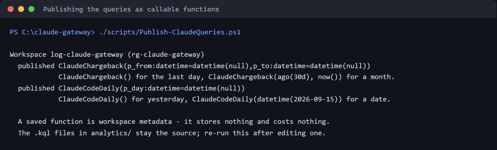
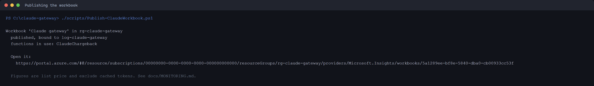
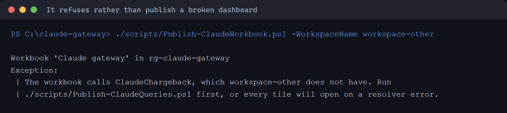
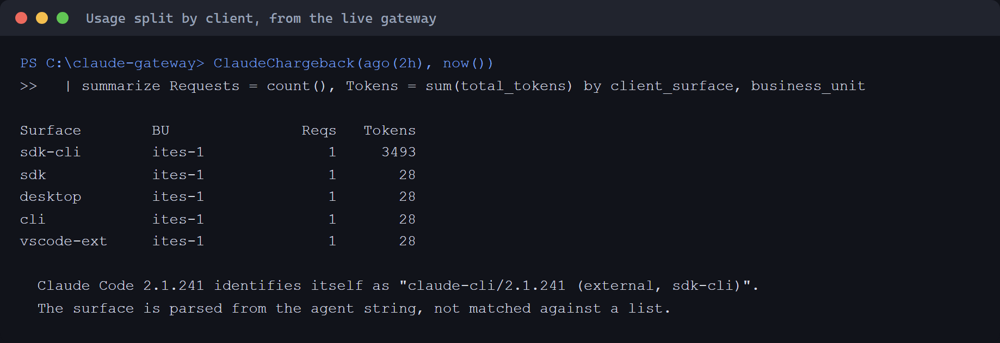
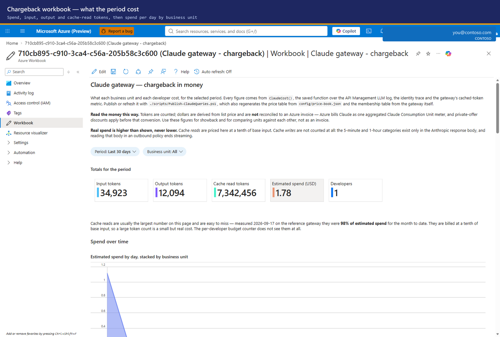
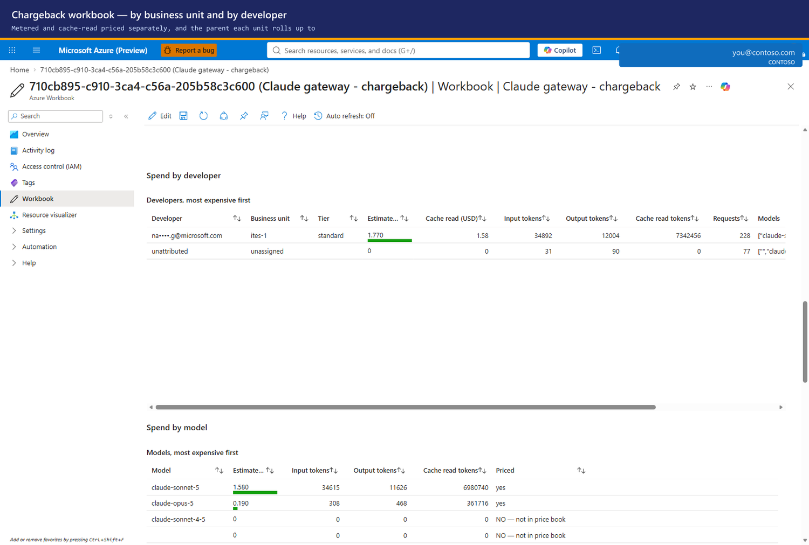
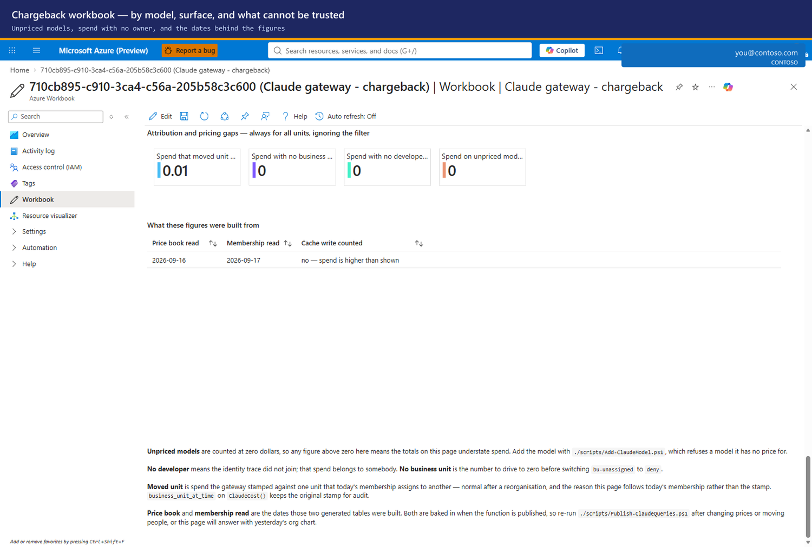

# Monitoring guide — usage, cost attribution, and alerts

Who this is for: whoever owns the AI spend and has to answer "who used what".

For a monthly financial task, start with [FinOps](FINOPS.md). For the big
picture, see [Architecture](ARCHITECTURE.md). **Custom token metrics are not
the chargeback ledger and are not the Azure bill.**

## Prerequisites and data sources

- Select the gateway, Application Insights and Log Analytics workspace with
  [Operations](OPERATIONS.md#1-select-the-gateway-and-workspace). Never choose the
  first workspace in the resource group.
- Readers need telemetry/workbook read access. Publishing needs workspace
  saved-search and workbook write access. Alert creation also needs monitoring
  write access; see [Operations roles](OPERATIONS.md#prerequisites-and-roles).
- Use Azure CLI and PowerShell from the repository root for script examples.
  A workbook viewer does not need Foundry data-plane access.

| Source | Use it for | Limit |
|---|---|---|
| `ClaudeChargeback` | Request attribution, input/output tokens and client surface | Joins `ApiManagementGatewayLlmLog` with identity traces; cache categories remain unknown |
| `ClaudeCost` | Priced daily aggregates and the chargeback workbook | Generated rates/membership; cache reads still depend on metrics; no cache-write cost |
| `claudecode` custom metrics | Pilot diagnostics, rate trends and session investigations | 100 distinct values per dimension / 1,000 active series per namespace; new values can be silently discarded ([ADR-0006](adr/0006-ledger-is-the-llm-log.md)) |
| Azure Cost Management | Billed cost | Claude's aggregate meter does not directly attribute the invoice to people |

Sections 1–6 explain operational metrics. [Section 7](#7-dashboard) publishes
the reporting functions and workbooks.

### Find the gateway, logger and workspace values

1. List the gateway candidates in the selected subscription:

   ```powershell
   az apim list --query "[].{name:name,rg:resourceGroup}" -o table
   ```

   **Portal:** API Management services > select the intended gateway >
   Overview > Essentials. Copy its name and Resource group, not values from
   a screenshot. The [live Overview example](OPERATIONS.md#1-select-the-gateway-and-workspace)
   identifies these fields.
2. Use those selected values, not a guessed Application Insights name:

   ```powershell
   ./scripts/Get-ClaudeTelemetry.ps1 -ResourceGroup '<gateway-rg>' -ApimName '<apim>'
   $apimId = az apim show -g '<gateway-rg>' -n '<apim>' --query id -o tsv
   az monitor diagnostic-settings list --resource $apimId -o json
   ```

   To read the component resource ID from the API's diagnostic with Azure CLI:

   ```powershell
   $loggerId = az rest --method get `
       --url "https://management.azure.com${apimId}/apis/claude-foundry/diagnostics/applicationinsights?api-version=2024-05-01" `
       --query properties.loggerId -o tsv
   if ($LASTEXITCODE -ne 0 -or -not $loggerId) { throw 'Inspect the service-level diagnostic fallback before choosing a component' }
   $appInsightsResourceId = az rest --method get `
       --url "https://management.azure.com${loggerId}?api-version=2024-05-01" `
       --query properties.resourceId -o tsv
   if ($LASTEXITCODE -ne 0 -or -not $appInsightsResourceId) { throw 'The logger did not identify an Application Insights resource' }
   az resource show --ids $appInsightsResourceId `
       --query "{name:name,rg:resourceGroup,appId:properties.AppId,workspace:properties.WorkspaceResourceId}" -o json
   ```

   If the API-level diagnostic is absent, inspect
   `${apimId}/diagnostics/applicationinsights` instead, as the helper does.
   An explicitly configured component can live in another group; the ARM
   `resourceId` is authoritative. The current helper expects its resolved
   component in the supplied group, so use the ID-based reads for that layout
   rather than inventing a component name or treating a failed read as zero usage.

   **Portal:** APIM > APIs > Claude API > Settings > Diagnostics identifies
   its logger. APIM > Monitoring > Diagnostic settings identifies the destination
   for GatewayLlmLogs. Open the linked Application Insights resource and its
   workspace; do not select the first resource with a similar name.

   **Pending batch capture (`docs-review-api-settings`).**

   Planned image: `docs/guide/docs-review-api-settings.png` — API backend and
   diagnostics settings.

   In the resource's **Diagnostic settings**, select the setting that sends
   **GatewayLlmLogs** and verify its **Send to Log Analytics workspace**
   destination. Do not create a second route just because another workspace is
   easier to find.

   **Pending batch capture (`docs-review-gateway-diagnostics`).**

   Planned image: `docs/guide/docs-review-gateway-diagnostics.png` — the actual
   LLM-log destination in Diagnostic settings.
3. Resolve each remaining placeholder from that linked resource:

   | Value | Portal field | CLI read |
   |---|---|---|
   | `<app-insights-name>` / its `<rg>` | Linked Application Insights > Overview > JSON View > `name`, `resourceGroup` | `az resource show --ids <app-insights-resource-id> --query "{name:name,rg:resourceGroup}" -o table` |
   | Application Insights AppId | Application Insights > API Access > Application ID, or JSON View > `properties.AppId` | `scripts/Get-ClaudeTelemetry.ps1 -ResourceGroup <gateway-rg> -ApimName <apim> -Quiet` |
   | `<ledger-workspace>` and its group | Linked Log Analytics workspace > Overview / Properties | `az resource show --ids <workspace-resource-id> --query "{name:name,rg:resourceGroup}" -o table` |
   | Workspace ARM resource ID | Application Insights > JSON View > `properties.WorkspaceResourceId`; compare the APIM diagnostic destination | `az resource show --ids <app-insights-resource-id> --query properties.WorkspaceResourceId -o tsv` |
   | Workspace ID for a query client | Log Analytics workspace > Properties > Workspace ID | `az monitor log-analytics workspace show -g <workspace-rg> -n <ledger-workspace> --query customerId -o tsv` |

The AppId, Workspace ID and ARM resource ID are different identifiers.
Publishers need the workspace **name**, in the selected resource group; the
Log Analytics query client uses `customerId`. Preserve separate gateway,
Application Insights and workspace groups when they differ.

**Portal:** workspace > **Properties** > **Workspace ID**. Copy that field only
when a command asks for the query client's workspace GUID, not the resource
name or ARM resource ID.

**Pending batch capture (`docs-review-workspace-properties`).**

Planned image: `docs/guide/docs-review-workspace-properties.png` — the
workspace Properties and Workspace ID field.

---

## 1. What is emitted

### Metrics

| Metric | Meaning |
|--------|---------|
| `Prompt Tokens` | input tokens |
| `Completion Tokens` | output tokens |
| `Total Tokens` | reported token total, not complete billable categories or dollars |

### Dimensions

Five, which is the APIM maximum:

| Dimension | Value | Answers |
|-----------|-------|---------|
| `User` | UPN from the caller's token | pilot per-person diagnostics |
| `UserId` | Entra object id | same, but stable across renames |
| `Tier` | `standard` / `premium` | is the tiering doing anything |
| `Model` | `claude-sonnet-5` / `claude-opus-5` | where the cost concentrates |
| `SessionId` | Claude Code session | which task was expensive |

`User` is taken from the token the developer's own machine presented. It is not
a client-supplied header and cannot be spoofed by editing a config file.

---

## 2. The chart — step by step


1. **Application Insights → Monitoring → Metrics**
2. **Metric namespace** → `claudecode`
3. **Metric** → `Total Tokens`
4. **Aggregation** → `Sum` — see the warning below, this is ringed **a**
5. **Apply splitting** → **User**, ringed **b**. Set **Limit** to cover your team
   size; the default 10 silently truncates a larger team
6. Each series in the legend, ringed **c**, is one developer

### The aggregation trap

> The screenshot above is on **Avg**, which is what the portal defaults to, and
> it is the wrong number for cost.

| Aggregation | Meaning |
|---|---|
| Sum | Sum of reported token observations; neither dollars nor complete billable usage |
| Avg | Average reported metric value, not a spend total |
| Count | Metric observations; do not equate aggregate samples with request count |

Avg is useful for spotting a developer whose prompts are unusually large. It is
never the basis for chargeback. Set **Sum** for operational token charts and use
the priced ledger for finance, with its caveats.

---

## 3. Filtering

**Add filter** narrows the chart; **Apply splitting** breaks it apart. You will
usually want both.

| Question | Filter | Split by |
|----------|--------|----------|
| What did one person spend? | `User = <upn>` | — |
| Is anyone approaching their daily quota? | — | `User` |
| Is Opus driving the cost? | — | `Model` |
| Is the premium tier being used at all? | — | `Tier` |
| Which model does one tier prefer? | `Tier = premium` | `Model` |
| What did one expensive session cost? | `SessionId = <id>` | `Model` |

These splits count reported tokens, not cost. A tier is not a team; use
`business_unit` in the ledger/workbook for team questions. Compare priced model
usage before deciding whether to change default aliases or budgets.

---

## 4. Same data, from the CLI

Useful for scheduled reporting, and it is the only reliable path because
`az monitor metrics list` **drops `--namespace` for custom namespaces** and will
tell you the metric does not exist.

```powershell
$sub = '<subscription-id>'; $rg = '<app-insights-resource-group>'; $ai = '<app-insights-name>'
$tok = az account get-access-token --resource https://management.azure.com --query accessToken -o tsv
$end   = (Get-Date).ToUniversalTime().ToString('yyyy-MM-ddTHH:mm:ssZ')
$start = (Get-Date).ToUniversalTime().AddDays(-7).ToString('yyyy-MM-ddTHH:mm:ssZ')

function Split-By($dim) {
  $f = [uri]::EscapeDataString("$dim eq '*'")
  $uri = "https://management.azure.com/subscriptions/$sub/resourceGroups/$rg" +
         "/providers/Microsoft.Insights/components/$ai/providers/Microsoft.Insights/metrics" +
         "?api-version=2019-07-01&metricnames=Total%20Tokens&metricnamespace=claudecode" +
         "&aggregation=Total&timespan=$start/$end&interval=P1D&`$filter=$f"
  $r = Invoke-RestMethod -Uri $uri -Headers @{ Authorization = "Bearer $tok" }
  "--- by $dim ---"
  $r.value[0].timeseries | ForEach-Object {
    '{0,-45} {1}' -f $_.metadatavalues[0].value, ($_.data | Measure-Object total -Sum).Sum
  }
}

Split-By User; Split-By Tier; Split-By Model
```

**Portal:** Application Insights > Metrics > `claudecode` > Total Tokens > Sum,
then Apply splitting. Both routes have the same metric cardinality limitations.
Never print or share the `$tok` value.

Two syntax traps:

- `aggregation=Total` is the API's name for Sum. There is no `aggregation=Sum`.
- `interval` accepts only `PT1M, PT5M, PT15M, PT30M, PT1H, PT6H, PT12H, P1D`.
  `P7D` returns `BadRequest: Invalid time grain duration`.

---

## 5. Drill into logs

Metrics can be pre-aggregated. For request attribution, use **Log Analytics >
Logs** in the ledger workspace after publishing the functions in section 7:

```kusto
// Prompt/completion tokens and requests, not a dollar bill.
ClaudeChargeback(ago(7d), now())
| summarize Prompt = sum(prompt_tokens), Output = sum(completion_tokens),
            Requests = count() by user_id, actor, tier
| order by Prompt desc
```

For a pilot session investigation in the same workspace:

```kusto
// Highest reported token usage per session; metric limits still apply.
AppMetrics
| where Name == "Total Tokens" and TimeGenerated > ago(7d)
| extend User = tostring(Properties.User),
         SessionId = tostring(Properties.SessionId)
| summarize Tokens = sum(Sum) by SessionId, User
| top 20 by Tokens desc
```

Session IDs help explain spikes. They do not expose the prompt, and a missing
session value must not be treated as proof the request was not served.

> `SessionId` reads `none` for callers that do not send
> `x-claude-code-session-id` — service principals and raw `curl` tests, not the
> Claude Code client.

### Throttling — and an honest limit

```kusto
// throttle and quota pressure, last 24h
AppRequests
| where TimeGenerated > ago(24h)
| where ResultCode in ("429", "403")
| summarize Blocked = count() by ResultCode, Name
| order by Blocked desc
```

> **This cannot be split by user.**
> APIM's `requests` telemetry carries only APIM's own dimensions — Service ID,
> API Name, Operation Name, Region. The `User` dimension lives on
> `customMetrics`, which is written by `llm-emit-token-metric`, and that policy
> runs only *after* a successful backend response. A 429 or 403 short-circuits
> the pipeline before it, so the throttled request never gets a user attached.
>
> Querying `customDimensions.User` on `requests` returns blank rather than an
> error, which makes this easy to miss.

Do not infer per-person rejection counts from missing user dimensions. Adding
rejection telemetry is a reviewed policy change, not a dashboard setting;
custom metrics also remain subject to the namespace's series limit.

> Log ingestion lags metrics by a few minutes. If a query returns nothing right
> after a test call, wait before concluding it is broken.

---

## 6. Alerts

Budgets throttle individuals. Alerts tell **you** before the monthly invoice
does.

**Portal procedure:**

1. Application Insights > Metrics > `claudecode` > Total Tokens > Sum >
   New alert rule.
2. Confirm the resource scope; set an operational threshold, lookback and
   evaluation frequency based on observed traffic, not a copied sample.
3. Select/create an action group, with an approved contact such as
   `finops@contoso.com`, and test its notification route.
4. Create the rule. In Azure Monitor > Alerts > Alert rules, verify it is
   enabled and evaluated; use the action group's Test action to check delivery.

For rejected requests use a scheduled log-query alert over `AppRequests` instead
of pretending request status is a token metric dimension.

Worth having:

| Alert | Condition | Why |
|-------|-----------|-----|
| Aggregate burn | `Sum(Total Tokens) > <hourly budget>` over 1h | catches a runaway agent loop |
| Throttle storm | `Count(requests where resultCode == 429) > N` | budgets set too tight, or genuine overuse |
| Gateway unreachable | an authenticated synthetic Messages POST, with an entitled test identity | a plain availability GET to `/claude/v1/messages` is not a valid inference test; not deployed by the template |
| No traffic | `Sum(Total Tokens) == 0` over 24h | the metric pipeline broke silently |

That last one matters more than it looks. Every failure mode in section 8 shows
up as *zero metrics*, which is indistinguishable from nobody working — unless
you alert on it.

---

## 7. Dashboard

Two things ship: **saved KQL functions** and an **Azure Workbook**. Both are
metadata — a saved search stores nothing and a workbook runs nothing, so each
costs nothing to have as a definition. Logs still have ingestion/retention costs;
query charges depend on the selected table plan. A saved function is not an
archive of its results.

### Publish the functions first

The queries in `analytics/` are files you paste into the Logs blade. Published
as functions they are callable by name, which is what the workbook, a Grafana
panel or a colleague at a query prompt can reach without knowing this repository
exists.

```powershell
./scripts/Publish-ClaudeQueries.ps1 -List     # what is published now
./scripts/Publish-ClaudeQueries.ps1           # publish or refresh all
./scripts/Publish-ClaudeQueries.ps1 -Query ClaudeChargeback
./scripts/Publish-ClaudeQueries.ps1 -Remove   # take them away again
```

**Which workspace.** Both publishers write to the Log Analytics workspace that holds
the gateway's telemetry: the one its Application Insights is linked to. Find it with
`./scripts/Get-ClaudeTelemetry.ps1` (the `Workspace` line), or in the portal: API
Management > **Monitoring** > **Application Insights** names the resource; open it >
**Overview** > **Workspace**. When you omit `-WorkspaceName`, the publishers do this
themselves: in a console they list the linked workspace first, marked recommended,
beside the other workspaces in the resource group, and ask (Enter takes the
recommended one). Without a console they use the linked workspace and print where it
came from, and stop, naming the candidates, when there is no link to follow. A
missing resource group or an ambiguous gateway is asked for the same way; a value the
installer recorded in `onboarding/claude-gateway.json` is used without asking.



| Function | Call it | Returns |
|---|---|---|
| `ClaudeChargeback(from, to)` | `ClaudeChargeback()` = last day; `ago(30d), now()` = rolling 30 days, not a calendar month | One row per request: caller, business unit, client, model, tokens |
| `ClaudeCodeDaily(day)` | `ClaudeCodeDaily()` = yesterday | The Claude Code analytics shape, one row per developer per day |
| `ClaudeCost(from, to)` | `ClaudeCost()` = last day | Daily priced rows by person, unit, model and client, plus observed cache reads |

**Portal/manual:** workspace > Logs > save as Function, using the alias and
datetime parameters from the publisher. `ClaudeChargeback`/`ClaudeCost` use
`p_from` and `p_to`; `ClaudeCodeDaily` uses `p_day`, with null datetime defaults.
Replace only the source query's window declarations with those parameters and
the same default-window logic. `ClaudeCost` additionally needs populated
PRICE-BOOK and MEMBERSHIP blocks; [FinOps](FINOPS.md#1-publish-or-refresh-the-reporting-definitions)
explains why the unpopulated file is not a working manual publication.

To inspect an existing function, open **Logs** > **Functions**, locate its
published alias and inspect the definition/parameters before invoking it.
`ClaudeCost` must contain populated generated tables, not the repository's
unpublished placeholders.

**Pending batch capture (`docs-review-workspace-functions`).**

Planned image: `docs/guide/docs-review-workspace-functions.png` — the
published Claude cost function in Logs.

The `.kql` files stay the source. The publisher rewrites only the window lines
at the top of each file into function parameters, and **refuses to publish if it
cannot find them** — a function silently pinned to "yesterday" would answer
every question wrongly and look right doing it. Re-run after editing a query.

### Publish the workbook

```powershell
./scripts/Publish-ClaudeWorkbook.ps1 -List    # what is published now
./scripts/Publish-ClaudeWorkbook.ps1          # publish or update
./scripts/Publish-ClaudeWorkbook.ps1 -Name "Claude gateway - platform"
./scripts/Publish-ClaudeWorkbook.ps1 -Remove
```



The identifier is derived from the resource group and the display name, so
re-running updates the workbook in place rather than leaving a second copy
beside the first. Give it a different `-Name` to keep two — one for finance, one
for the platform team.

It refuses in two situations rather than publishing something broken: if the
definition is not valid JSON, and if the workspace does not have the functions
the workbook calls, which would open every tile on a resolver error.



Omit `-WorkspaceName` to choose from the discovered workspaces. The publisher
marks the one linked to the gateway's Application Insights as recommended,
explains where it came from, and shows the lookup command and portal path;
Enter accepts it. Without a console it uses that link, or a sole workspace,
and otherwise refuses with candidate names and `Pass -WorkspaceName`. It will
not guess: a workbook bound to the wrong workspace renders empty and reads as
no usage.

**Portal:** Azure Monitor > Workbooks > New > Edit > Advanced editor. Paste the
appropriate `infra/workbook*.json`, bind the workspace, Apply and Save.
Verify a known recent request in a tile, not just that the workbook opens.

For an existing workbook, use the discovered workspace > **Workbooks**, choose
the saved workbook and verify its workspace/time-range parameters. The gallery
is an entry point, not evidence that a query completed or a period reconciled.

**Pending batch capture (`docs-review-workspace-workbooks`).**

Planned image: `docs/guide/docs-review-workspace-workbooks.png` — the
workspace Workbooks gallery.

### What it shows

| Tile | Answers |
|---|---|
| By business unit | Whose budget did this spend |
| By client | Claude Code CLI, VS Code extension, Claude Desktop or SDK |
| Developers by consumption | Who is using it, with their unit and tier |
| Consumption over time | Trend per business unit |
| Model mix | Where cost concentrates, and how much is streamed |
| Attribution gaps | Requests with no caller, no business unit or no client |

The client breakdown comes from the `User-Agent` the caller sends, captured on
every request by the gateway policy. The surface is parsed out of the agent
string rather than matched against a list: measured 2026-09-16, Claude Code
2.1.241 identifies itself as `claude-cli/2.1.241 (external, sdk-cli)` — `sdk-cli`,
not `cli` — so a hard-coded list of expected values mis-buckets the real CLI.



The same query works at a Logs prompt, which is the point of publishing the
function: no file to find, no repository to clone.

The token workbook is not a financial close. The priced workbook below uses
the published price book (built-in list rates unless replaced). The quota
counter excludes cache; the recorded U12 sample attributed **38.7%** of cost
weight to cache reads ([Unknowns](UNKNOWNS.md)). That sample is not your ratio.

### The chargeback workbook — the same question in money

The workbook above counts tokens. A business unit owner asks what it cost, so a
second workbook answers in dollars:

```powershell
# The function first. This one also bakes in the price book and the current
# business unit membership, so it needs the gateway as well as the workspace.
./scripts/Publish-ClaudeQueries.ps1 -ResourceGroup '<resource-group>' `
    -ApimName '<apim-name>' -WorkspaceName '<ledger-workspace>'

./scripts/Publish-ClaudeWorkbook.ps1 -ResourceGroup '<resource-group>' `
    -WorkspaceName '<ledger-workspace>' `
    -WorkbookFile infra/workbook-chargeback.json `
    -Name 'Claude gateway - chargeback'
```

| Tile | Answers |
|---|---|
| Totals for the period | Spend, input, output and cache-read tokens, and how many developers |
| Spend over time | Daily spend stacked by business unit |
| Spend by business unit | What each unit and team cost, metered and cache priced apart |
| Spend by developer | Who inside a unit drove it, most expensive first |
| Spend by model | Where cost concentrates, and whether the model is in the price book |
| Spend by client surface | CLI, Desktop, SDK — and cache, which has no surface |
| Attribution and pricing gaps | Spend with no owner, no unit, an unknown price, or that moved unit |

Pick a unit from the **Business unit** pill to filter every tile to it. The gaps
tile deliberately ignores that filter, because a gap you have filtered out of
view is a gap you will not fix.



The screenshots are historical examples, not a current usage statement. Read
the selected period and source workspace before interpreting their totals.



The **Priced** column is the one to watch. `claude-sonnet-4-5` appears there with
no price, which means any spend on it is counted at zero and the totals above
understate the bill.



**Keep cache separate.** The price code applies 0.1 times the base input rate to
cache reads; a cached token and an output token do not have the same price.
The per-developer quota counter cannot see cache. `ClaudeCost` obtains cache
reads from `AppMetrics`, whose cardinality limitations still matter at scale.

#### Which business unit a request counts against

The gateway stamps a business unit on every request, and that stamp is kept.
But the workbook totals by the unit a developer belongs to **today**, because
"what does this unit owe" must not change answer depending on when somebody was
moved between teams.

Those are different allocation policies. A developer transferred from Contoso
Sales to Engineering can move prior usage in a current-membership report.
The **Spend that moved unit** tile exposes that difference;
`business_unit_at_time` on `ClaudeCost()` keeps the original stamp. Preserve
dated exports for a financial close instead of assuming today's report is an
immutable historical invoice.

Because membership is baked in when the function is published, **re-run
`Publish-ClaudeQueries.ps1` after moving people between units**, or the workbook
answers with yesterday's org chart. The **Membership read** tile shows the date
it is working from.

#### What it still cannot tell you

Cache *writes* are not counted at all. The 5-minute and 1-hour categories exist
only in the Anthropic response body, and reading that body in an outbound policy
buffers the response and ends streaming. At the same tariff, missing categories
understate complete usage cost. This is not a lower bound on the Azure invoice:
commercial discounts and billing terms can change that comparison.

Unpriced models contribute **zero dollars** to totals and are flagged by
`priced_ok=false`; zero does not mean free. Check unpriced rows/tokens, not a
nonzero dollar total for those rows. Add approved rates using
[Models](MODELS.md), then republish. Publication also replaces the embedded
price book for historical queries; save the month's rates with its exported rows.

#### The ceiling above the unit budgets

`quota-org` is checked **before** the per-unit quota and renews on the same
monthly period, so whichever is smaller is the one that actually binds. A
ceiling below the sum of the unit budgets makes every one of those budgets
unreachable: the gateway denies the whole organisation first, and each unit
still reports plenty of headroom.

For a unit in notify mode, there is no limiter at that unit's scope; the
organisation and any enforcing parent/personal limits still apply. Allowance
uses an effective quota above the base allocation. Interpret headroom alongside
the stored `bu-modes`, not as proof every base budget is a blocking counter.

`./scripts/Set-ClaudeBusinessUnit.ps1` now says so when it writes a budget, and
`./scripts/Test-ClaudeHealth.ps1` fails the run on it. Only top-level units are
summed, because a team is charged to its parent as well as to itself and
counting both would double count.

Change the organisation ceiling through [Budgets](BUDGETS.md#2-change-a-tier-or-the-organisation-ceiling).
**Portal:** APIM > Named values > `quota-org` > Edit. Use your approved allocation,
not a value copied from another deployment.

#### What a dollar budget does and does not stop

A strict/allowance budget is set in dollars and enforced in tokens: `-MonthlyBudgetUsd 2000`
becomes 555,555,555 tokens at a blended $3.60/M for Sonnet assuming 20% output.
Pass `-Model claude-opus-5` if the unit mostly uses Opus, or the conversion
under-charges them by about two and a half times.

The counter is **blind to cached tokens**. A nominal $2,000 allocation can
therefore allow more than $2,000 of categorized usage. Two ways to handle that:

- treat the dollar budget as **showback**, with personal and shared token limits
  as operational safeguards rather than dollar guarantees; or
- divide the token figure by **your own** measured ratio — read it from the
  chargeback workbook, subject to its missing categories and metric limits.
  A ratio is a planning assumption, not a hard cap.

  With notify, use the ledger rather than counting notice headers: the notice is
  unconditional for applicable nonzero notify budgets, not an over-budget event.
  The `claude-budget` trace uses `BudgetRequestId` to join to the request ledger.
  Mode changes keep counter keys, but time spent in notify is not backfilled into
  the blocking counter when enforcement resumes. See
  [Budget modes](BUSINESS-UNITS.md#budget-modes).

The largest lever that caching cannot defeat is the **model allow list**: Opus
is two and a half times Sonnet on both input and output, and
`./scripts/Set-ClaudeTier.ps1 -Tier standard -Models claude-sonnet-5` keeps it
for the premium tier only.

#### How long the ceiling lasts

The per-developer limit is **daily** and the organisation ceiling is **monthly**,
so the two only become comparable once multiplied out. Some over-subscription is
normal — nobody expects every developer to spend their whole allowance every day
— but when the daily allowances together outrun the monthly ceiling, the
per-developer quota can never be the binding control. The organisation is denied
first, and moving somebody to a higher tier changes nothing except how fast.

Illustration using shipped tier defaults: three premium developers at
5,000,000 tokens a day and five standard at 500,000 come to **17,500,000 a day**
against a 100,000,000 month — the whole ceiling in **5.7 days**.

`./scripts/Test-ClaudeHealth.ps1` reports this as **Ceiling headroom**. It warns
rather than fails, because deliberately over-subscribing is a legitimate way to
run this — but it says so rather than leaving you to multiply it out yourself.

### If you would rather use Grafana

`./scripts/Publish-ClaudeGrafana.ps1` publishes the same panels to an existing
Azure Managed Grafana instance, reading the same saved functions.

```powershell
./scripts/Publish-ClaudeGrafana.ps1 -List
./scripts/Publish-ClaudeGrafana.ps1 -GrafanaName graf-platform
```

It is **optional and has a standing bill**; the optional Turnstile deployment
also has standing costs.
Azure Managed Grafana is charged per instance per hour whether or not anyone
opens it, where the workbook is a definition that bills only for the queries it
runs. This exists for organisations that already run Grafana and want Claude
spend on the same wall as everything else — not as the default.

**Portal/manual:** open the existing Azure Managed Grafana resource > Endpoint;
add an Azure Monitor data source with workspace query access, and create panels
using the published functions. Verify a known request. There is no Azure portal
button that runs this repository's panel generator.

It will not create the instance. Standing one up is a decision with a cost
attached and belongs wherever your other shared infrastructure is provisioned,
not in a script run to publish a dashboard.

`az grafana` needs the Managed Grafana extension (`az extension add --name
amg`); `-List` says so and carries on rather than failing, because an optional
thing being absent is not an error.

### If you would rather use the metrics explorer

**Save to dashboard** on each chart. A useful board is four tiles:

1. Total Tokens, Sum, split by **User** — pilot usage diagnostics
2. Total Tokens, Sum, split by **Model** — where cost concentrates
3. Request count split by **resultCode** — 429/403 pressure
4. Total Tokens, Sum, no split, 30-day window — the trend

Share it to a resource group the finance or leadership stakeholders can read;
they need no access to APIM or Foundry to see it.

Note the ceiling: metric dimensions cap at 100 unique values, after which
Microsoft "silently discard[s]" the rest. That is why per-developer chargeback
uses the log rather than metrics — see [ADR-0006](adr/0006-ledger-is-the-llm-log.md).

---

## 8. When the charts are empty

Diagnose in this order — each check is cheap and rules out everything below it.

| # | Check | Command | If wrong |
|---|-------|---------|----------|
| 1 | Is traffic reaching the gateway? | Application Insights → **Live metrics** | client config, see [Debug guide](DEBUGGING.md) |
| 2 | Is the APIM diagnostic emitting metrics? | `scripts/Get-ClaudeTelemetry.ps1` with the explicit gateway target; portal: APIM > APIs > Claude API > Settings > Diagnostics | `MetricsEnabled` must be `true`; `az apim diagnostic show` is not a CLI command |
| 3 | Does App Insights accept dimensions? | `az resource show -g <rg> -n appi-claude-gateway --resource-type Microsoft.Insights/components --query "properties.CustomMetricsOptedInType"` | must be `WithDimensions`, else totals appear but the per-user split is dropped at ingestion |
| 4 | Is the SKU v2? | `az apim show -g <rg> -n <apim> --query "sku.name"` | classic tiers parse **zero** Anthropic tokens — metrics exist and read 0 |
| 5 | Has ingestion caught up? | wait 5 minutes | custom metrics are not real-time |

Check 4 is the cruel one: everything looks healthy, the API returns 200, the
metric exists, and every value is zero.

---

## 9. Next

| Task | Guide |
|------|-------|
| Change someone's budget | [Onboarding guide](ONBOARDING.md#4-change-a-developers-tier) |
| A request is failing | [Debug guide](DEBUGGING.md) |
| Full command reference | [GOVERNANCE-CHECKS.md](GOVERNANCE-CHECKS.md) |
