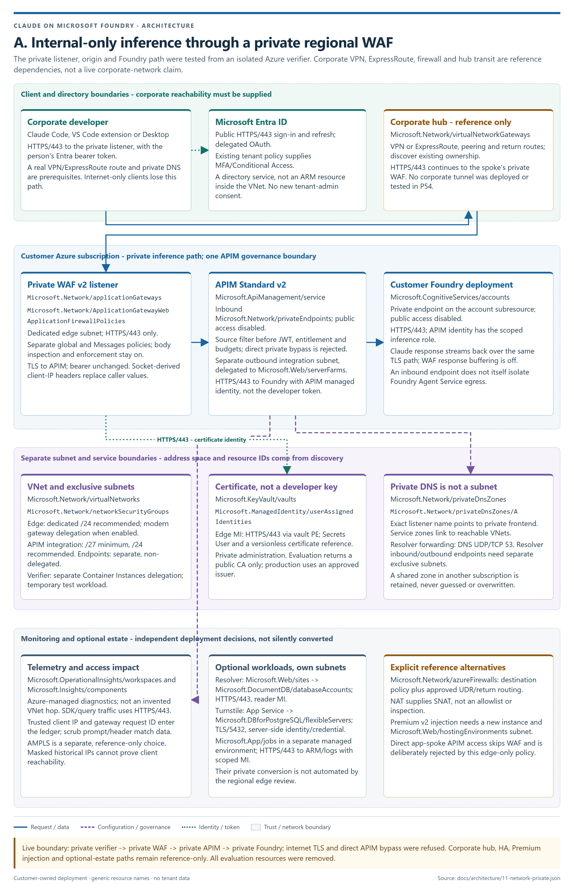
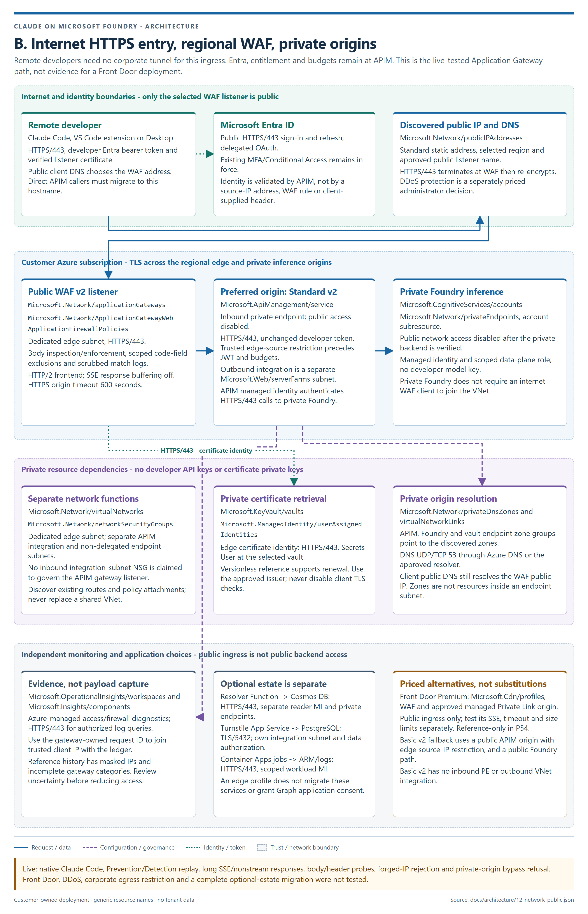
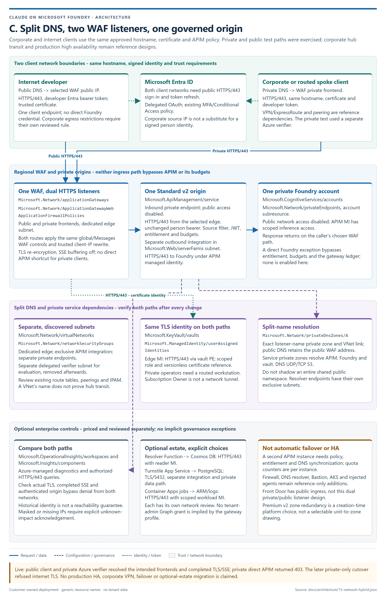
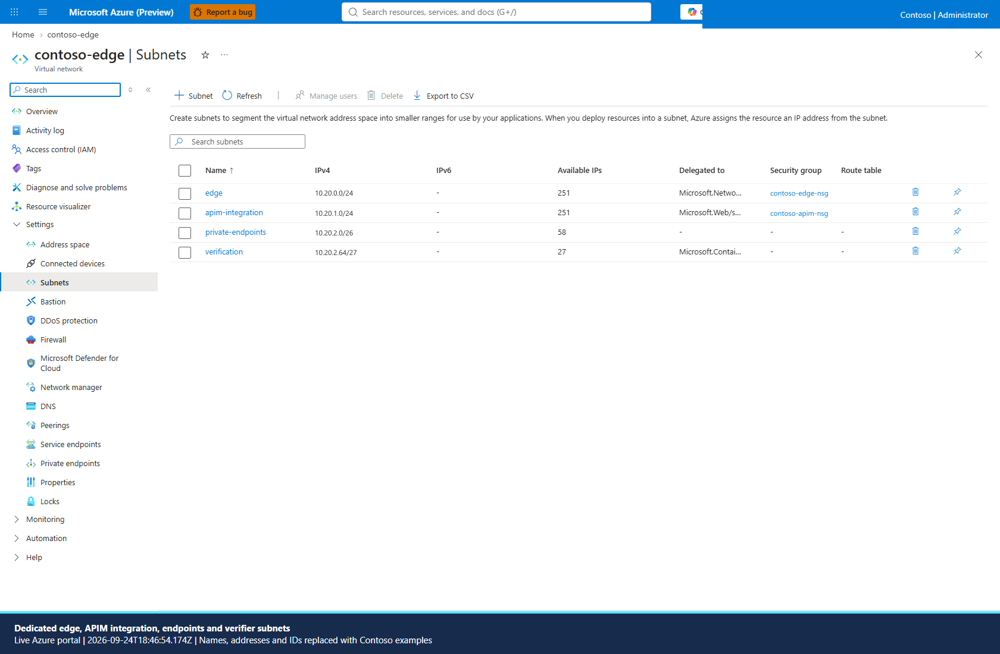
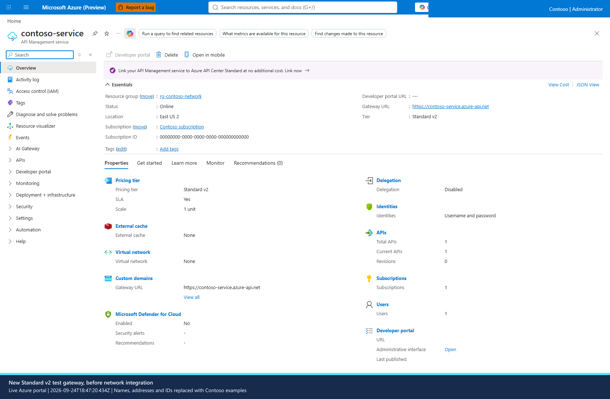
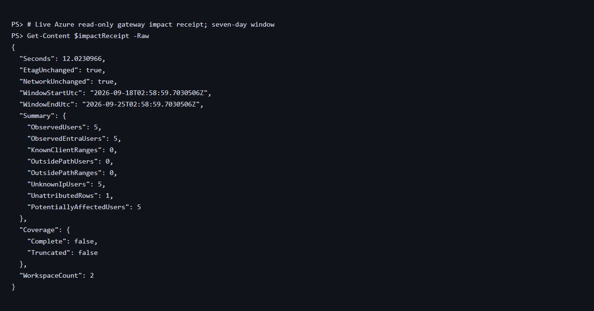
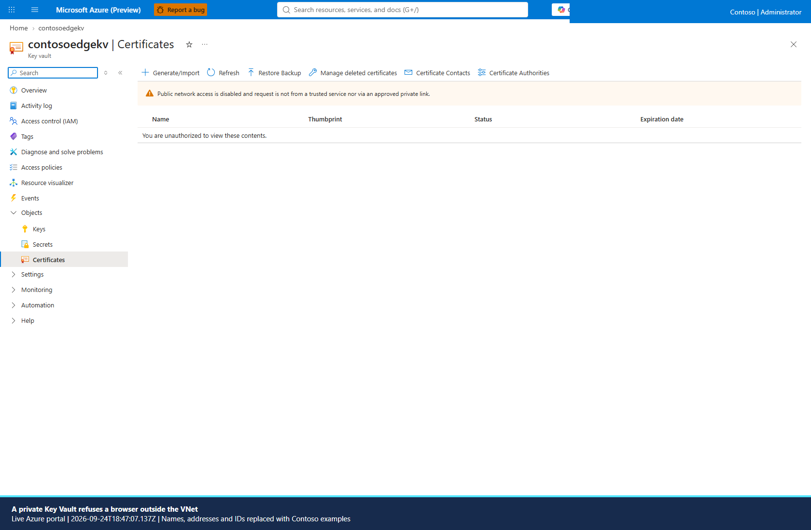

# Design an enterprise network for the Claude gateway

Add a web application firewall without replacing the gateway's identity,
entitlement, budgets or chargeback. Developers still send their own Entra
token. Application Gateway passes it to API Management (APIM); APIM validates
it and calls Foundry with APIM's managed identity. No developer API key is
introduced.

This article separates **reference designs**, **automation**, and **live
evidence**. The regional Application Gateway implementation is supplied here.
Front Door, a corporate hub, ExpressRoute/VPN, Firewall and Azure Monitor
Private Link Scope (AMPLS) are reference options, not infrastructure silently
created by the edge installer.

The SharePoint link required Microsoft sign-in. The owner subsequently
provided an authorized, one-slide export of the owner's network architecture
deck; it was reviewed on 2026-09-25. The protected deck and export are not
distributed here. The enterprise designs use Microsoft Learn's
[APIM landing zone architecture][landing-zone] and
[network capability documentation][apim-network], checked 2026-09-24, with the
deck comparison below checked on 2026-09-25.

## Choose a topology

| Choice | Entry and origin | Use when | Cost and operating consequences |
|---|---|---|---|
| **A. Internal only** | Corporate clients through ExpressRoute or VPN to a hub; a private Application Gateway WAF v2 listener; private APIM and Foundry | Clients must be on a routed corporate network | Private DNS, a routed administrator and controlled egress are required. Reuse the enterprise firewall and DNS resolver where possible |
| **B. Internet with regional WAF** | Public HTTPS Application Gateway listener; preferably private APIM origin; private Foundry | Developers work remotely without a corporate tunnel | Public IP and WAF capacity are billed. Restrict direct APIM calls, not just anonymous calls |
| **B alternative. Global edge** | Front Door **Premium** + WAF; approved Private Link APIM origin | Global ingress and regional failover justify another service | Premium base fee, requests and transfer. Validate streaming separately; the Application Gateway buffering setting does not configure Front Door |
| **C. Hybrid** | Public and private Application Gateway listeners using one hostname with split DNS; one private APIM origin | Corporate and internet developers need the same governed endpoint | Two client paths to verify. Neither path bypasses WAF or APIM |
| **Public-origin fallback** | Public WAF listener to Basic v2's public endpoint, with an edge source-IP allowlist | Retaining Basic v2 matters more than private backends | Basic v2 cannot reach a private Foundry account or private resolver. This is not an internal-only design |

The edge script's `-NetworkProfile private|public|hybrid` chooses listeners and
the gateway/Foundry network requirements. It does **not** move an existing
Turnstile database, projection, job environment or corporate hub. That wider
one-switch migration is the remaining orchestration work in P49. Do not label
an entire estate private merely because its inference edge is private.

### Source-backed topology diagrams

These are designs, not portal screenshots. Each diagram distinguishes the
live-tested regional path from reference-only enterprise dependencies. Sources
are under `docs/architecture/`; the repository architecture renderer verifies
resource declarations, source hashes and image references.







### Review against the owner's network architecture deck

The deck combines a WAF/APIM hub, private Foundry and application spokes,
corporate egress filtering, private administration and optional resilience.
Those goals fit the three designs above, with these important qualifications:

| Deck decision | Implementable interpretation and packet boundary |
|---|---|
| Premium v2, zones and private APIM | [Premium v2 injection][apim-injection] is a creation-time private gateway option, with an exclusive `Microsoft.Web/hostingEnvironments` subnet. It is not the `Microsoft.Web/serverFarms` outbound integration tested here. Standard v2 with inbound PE plus outbound integration is the lower-cost measured option |
| Two units across zones | [Standard/Premium v2 zone redundancy][apim-zones] is enabled at creation. [The platform distributes units on a best-effort basis][apim-reliability]; a single unit's two underlying compute resources can span two zones. Administrators cannot select the deck's particular unit-to-zone placement. This evaluation did not test an outage or zone redundancy |
| Hub DNS and private endpoints | Private DNS zones are linked resources, not objects placed in a subnet. [Resolver inbound and outbound endpoints each need an exclusive subnet][dns-resolver], separate from the non-delegated PE subnet. Forward DNS over UDP/TCP 53 and verify both on-premises and Azure answers |
| NAT or Firewall | NAT supplies outbound source translation, not destination inspection or an allowlist. A firewall requires its real private next hop, policy, UDRs and return routing. Neither is automatically installed by the regional executor |
| Injected agents and app-spoke callers | [Foundry Agent Service's BYO network][agents-network] requires a dedicated `Microsoft.App/environments` subnet and a creation-time account design. An inbound Foundry PE alone does not isolate agent egress. Configure and verify model/tool endpoints individually; subnet injection does not redirect every call through this Claude gateway |
| Direct app-spoke to APIM | This can retain APIM governance but skips WAF. The shipped edge-only source policy deliberately rejects it. Adding an application identity/path requires a separate authorization and source review, not an exception silently introduced by a VNet peering |
| Corporate/Zscaler egress addresses | Discover the organization's actual stable egress CIDRs from its network owner. A negated `RemoteAddr`/`IPMatch` custom **Block** rule can restrict a public listener without a custom Allow that skips managed rules. Apply consistent restrictions to global and path policies; explicitly account for private clients. This additional rule is a manual design, not a live-tested script option |
| MFA/Conditional Access | Retain the organization's existing Entra policy. Subscription Owner or ownership of an app registration does not authorize changing tenant Conditional Access. No new tenant-admin grant is assumed |
| Second APIM and global routing | Independent APIM instances need policy/configuration, entitlement and DNS synchronization, failover testing and consideration of **per-instance quota counters**. Front Door/Traffic Manager does not create one shared hard budget or make a single Foundry deployment multi-region |
| Exceptional direct Foundry access | This bypasses APIM entitlement, budgets and the gateway ledger. It is not enabled here. Any separately approved exception needs a narrowly scoped principal, owner, expiry, separate attribution and revocation test |
| Bastion, AKS, data stores and Grafana | Reference-only workload additions. Choose real SKUs, worker counts, retention and data volumes before pricing. Unknown meters are not zero; none was deployed as part of this packet |

For the manual corporate-egress rule: **Web Application Firewall policies
(WAF)** > selected policy > **Custom rules** > **Add custom rule**. Use a
unique name and priority, **Match rule**, **RemoteAddr**, **IPMatch**, the
administrator-approved CIDRs, **Negate condition**, and action **Block**.
Review both the global and Messages-path policy before saving; a hybrid path
needs its private source ranges or a separately scoped listener policy.
`infra/network-edge-waf.bicep` accepts an explicit `customRules` parameter for
this manual module workflow. The reviewed edge executor does not construct
or apply that rule; do not infer it from the topology name.

Regional commercial USD rates retrieved 2026-09-25, at 730 hours/month:
Basic v2 one unit is about **$150/month** ($0.20548/hour), Standard v2 one
unit **$700/month** ($0.95890/hour), Premium v2 one unit **$2,800/month**
($3.83562/hour), and two Premium v2 units **$5,600/month** ($7.67124/hour).
These are APIM allocations only, excluding edge, data, networking and usage.
The live regional plan used Standard v2; the deck's Premium/HA option was not
deployed. NAT's published gateway fee was $0.045/hour plus $0.045/GB processed;
AKS Standard's control-plane fee was $0.10/hour, excluding all worker VMs.
The deck does not specify enough SKU/quantity data to price Bastion, Search,
Redis, Grafana, storage or agent compute as an honest complete total.

### Front Door Premium alternative

Follow [Front Door's APIM Private Link procedure][frontdoor] rather than
copying Application Gateway settings into a different service:

1. In **Front Door and CDN profiles**, select/create a **Premium** profile.
   In **Origin groups**, add an **API Management** origin with its discovered
   gateway hostname and matching **Origin host header**.
2. Enable **Private Link**, select a supported origin region and target
   subresource **Gateway**. In APIM's **Network** > **Inbound private endpoint
   connections**, approve that profile's pending request.
3. Use HTTPS to the origin and a health probe on APIM's status path. Disable
   route caching for inference. Review Front Door's origin response timeout;
   Application Gateway's 600-second setting does not carry over.
4. Associate a Front Door WAF policy and repeat the real-client, body/header
   and SSE tests. Its rule/exclusion schema and inspection limits are a
   separate decision, not this module's DRS configuration.
5. Disable APIM public access and restrict any other private route to the
   origin. Validate the intended `X-Azure-FDID` only behind a trusted
   Private Link/source boundary; a forwarding header alone is forgeable.

This alternative has no live receipt in this packet. A global entry point
does not make a single-region APIM or Foundry deployment multi-region.

### APIM capability matrix

These are network capabilities, not a recommendation to replace the
repository's v2 gateway with a classic tier.

| APIM tier | Inbound Private Link | Outbound VNet integration | VNet injection | Suitable for this repository's Claude token governance |
|---|---|---|---|---|
| Consumption | No | No | No | No |
| Developer, classic | Yes, when not injected | No | Internal or external | No; no production SLA and no Anthropic token parsing here |
| Basic / Standard, classic | Yes | No | No | No; the repository requires v2 Anthropic token parsing |
| Premium, classic | Yes, when not injected | No | Internal or external | No; classic networking and multi-region do not make Claude metering work |
| **Basic v2** | **No** | **No** | No | Yes for a public backend |
| **Standard v2** | **Yes** | **Yes**, `Microsoft.Web/serverFarms` subnet | No | Recommended private-origin starting point |
| **Premium v2** | Yes; check the supported combination | Yes | **Private gateway**, creation-time only; `Microsoft.Web/hostingEnvironments` subnet | For the required scale/isolation features; not an in-place network-mode conversion |

Sources: [network overview][apim-network], [private endpoints][apim-pe],
[outbound integration][apim-outbound], [Premium v2 injection][apim-injection].
Private Link covers the **gateway**, not the management plane or developer
portal. Inbound NSG rules on a v2 **integration** subnet do not restrict gateway
ingress. Premium v2 injection is not classic Premium's external/internal toggle:
an existing integrated instance cannot be switched to injection.

The script reads the subscription's [SKU availability API][sku-api], including
location restrictions, and the instance's real SKU and network mode. Region
advertisement is not a promise of instantaneous capacity; deployment remains
the final availability check.

## Place the rest of the system

Keep the optional management services out of the inference request path.

| Component and resource type | Network placement | Identity at the boundary |
|---|---|---|
| Application Gateway, `Microsoft.Network/applicationGateways` | Dedicated edge subnet; HTTPS listener; WAF policy | Developer bearer token is passed unchanged. A user-assigned identity reads only the listener certificate from Key Vault |
| APIM, `Microsoft.ApiManagement/service` | Standard v2 private endpoint plus a dedicated outbound integration subnet, or a new Premium v2 injected subnet | Developer Entra `oid` remains the budget key. APIM's identity authenticates to Foundry and the resolver |
| Foundry, `Microsoft.CognitiveServices/accounts` | Private endpoint; public access disabled after connectivity is verified | APIM identity has the account's data-plane role. Audit other principals with `Get-ClaudeBypass.ps1` |
| Resolver, `Microsoft.Web/sites`, Flex Consumption | Site private endpoint; separate `Microsoft.App/environments` delegated integration subnet | Only the configured gateway application/object IDs may call it; resolver identity reads the Cosmos container |
| Projection, `Microsoft.DocumentDB/databaseAccounts` | Private endpoint; local authentication disabled | Resolver reads; a different sync identity writes. Networking does not renew an expired entitlement lease |
| Resolver storage, `Microsoft.Storage/storageAccounts` | Blob, queue and table private endpoints | Host and deployment package access use managed identity. Add Files only if the selected hosting model actually needs it |
| Turnstile, `Microsoft.Web/sites` | Private site endpoint for corporate-only administration, or its own HTTPS/WAF listener; dedicated outbound integration | Existing Entra application roles and delegated sign-in rules still apply. Never expose its admin routes as inference API paths |
| PostgreSQL Flexible Server, `Microsoft.DBforPostgreSQL/flexibleServers` | Retain the server's chosen private network model; private access/delegated subnet and Private Link are different deployment models | Turnstile's database credential/identity stays server-side. An APIM subnet is not a database subnet |
| Scheduled jobs, `Microsoft.App/jobs` and `Microsoft.App/managedEnvironments` | VNet-connected workload-profiles environment; no inbound endpoint is needed merely to run a scheduled job | Separate job identities for read/export and apply. Graph application consent is still a tenant-admin operation |
| Event Hubs, `Microsoft.EventHub/namespaces` | Private endpoint where the selected tier supports it | Producer and consumer roles are separate. AMQP uses TLS/5671 or WebSockets/443 according to the client configuration |
| Log Analytics and Application Insights | Existing monitoring boundary; optionally an existing or explicitly approved AMPLS | Azure diagnostics and application ingestion are different paths. Prove both ingestion and query after changing access controls |

The owner can create this edge with subscription Owner and no directory role.
Network isolation does **not** remove Turnstile's consent constraint (U19) or
give a scheduled sync `GroupMember.Read.All` (U17).
[AUTHENTICATION](AUTHENTICATION.md) explains the distinction.

### Subnets and routing

| Subnet | Requirement |
|---|---|
| Edge | Dedicated to Application Gateway. /24 recommended. For network-isolated Application Gateway, delegate to `Microsoft.Network/applicationGateways` |
| APIM outbound integration | Exclusive to one instance; /27 minimum, /24 recommended; `Microsoft.Web/serverFarms`; NSG required |
| Premium v2 injection alternative | Exclusive /27 minimum, /24 recommended; **`Microsoft.Web/hostingEnvironments`**, not the integration delegation |
| Private endpoints | Not delegated to another service. Size for gateway, Foundry, vault and optional components, including growth |
| Resolver integration | Separate Flex Consumption delegation, `Microsoft.App/environments` |
| Turnstile integration | Separate App Service integration subnet, `Microsoft.Web/serverFarms` |
| Container Apps environment | Use the requirements for the chosen environment type; do not reuse the resolver or App Service subnet |
| Temporary verifier | `Microsoft.ContainerInstance/containerGroups`; only for setup and testing; remove afterwards |
| Hub firewall and DNS resolver | Their own service-required subnets. Do not put an application gateway or private endpoint in them |

The wizard offers address ranges that do not overlap the **discovered** VNets.
It cannot discover every on-premises route, disconnected subscription or future
IPAM reservation. `-IpamConfirmed` is a deliberate approval, not a claim that
Azure discovered the corporate address plan.



For A and C, connect the spoke to the existing hub with reviewed peerings and
gateway transit. Configure explicit next hops and return paths. An existing
route table is offered for a new spoke; the script does not rewrite shared
subnets or create a firewall without an administrator's decision.

Use [network-isolated Application Gateway][private-appgw] before forcing a
default route through a firewall. Legacy v2 gateways require GatewayManager
inbound and internet egress; blindly putting `0.0.0.0/0` on them can break
health, monitoring and updates. The feature is generally available even though
the portal places its registration under **Preview features**.

[Azure Firewall forced tunneling][firewall] has its own management-interface
and asymmetric-routing constraints. Firewall policy must allow the actual
service dependencies: Entra, Key Vault, required Azure management and
monitoring endpoints, and approved job image/package sources. Prefer a
prebuilt, pinned job image in a private registry over installing tools from the
internet each time a job starts. Do not TLS-inspect inference merely because
a route crosses a firewall; evaluate privacy, latency and certificate trust.

### Private DNS

| Service | Zone or record |
|---|---|
| APIM private endpoint | `privatelink.azure-api.net` |
| Premium v2 injected gateway | An A record for its gateway hostname to the discovered private VIP; injection does not manufacture your DNS record |
| Foundry account | Discover its `privateLinkResources.requiredZoneNames`; measured account advertises `privatelink.cognitiveservices.azure.com`, `privatelink.openai.azure.com`, `privatelink.services.ai.azure.com` |
| Key Vault | `privatelink.vaultcore.azure.net` |
| App Service / resolver | `privatelink.azurewebsites.net`, including the SCM record when required |
| Cosmos NoSQL | `privatelink.documents.azure.com` |
| Storage | `privatelink.blob.core.windows.net`, `privatelink.queue.core.windows.net`, `privatelink.table.core.windows.net`; Files only if required |
| PostgreSQL | Private Link: `privatelink.postgres.database.azure.com`; delegated private-access servers use their configured zone ending in `.postgres.database.azure.com` |
| Event Hubs | `privatelink.servicebus.windows.net` |
| Registry | `privatelink.azurecr.io`; use the endpoint's advertised DNS configuration for regional data endpoints |
| Private listener | Corporate split DNS, or the supplied **exact-hostname** private zone with an apex A record. Do not shadow an entire public Azure DNS suffix |
| AMPLS | `privatelink.monitor.azure.com`, `privatelink.oms.opinsights.azure.com`, `privatelink.ods.opinsights.azure.com`, `privatelink.agentsvc.azure-automation.net`, and the required Blob zone |

Reuse enterprise DNS zones, including zones in another subscription, only when
their linked networks can reach the selected endpoint addresses. Two isolated
endpoints for the same account must not overwrite a shared DNS answer with an
unreachable address. Do not link duplicate namespaces to one VNet.

For on-premises resolution, use [Azure DNS Private Resolver][dns-resolver] in
the hub or the enterprise DNS forwarder. Permit UDP and TCP/53. Forward the
relevant service namespaces to the resolver's inbound endpoint across the
VPN/ExpressRoute path; do not point an on-premises client directly at Azure's
platform resolver. Link the private zones to the resolver VNet and test from an
actual on-premises client. Peering alone does not create DNS forwarding.

AMPLS is shared infrastructure, not a private endpoint added blindly to each
workspace. Its DNS names affect other monitoring clients in the same DNS
boundary. Read [AMPLS configuration and access modes][ampls], add all required
resources, then test ingestion and query before disabling public access.
Azure resource diagnostic settings do not all use the same path as an SDK
sending Application Insights telemetry.

## Prerequisites

- Azure CLI signed in to the correct subscription and tenant; PowerShell 5.1
  or 7; Bicep available through Azure CLI; Node for streaming verification.
- A governed **v2** APIM deployment and a discovered Claude model deployment.
  The network script does not change budgets or add group members.
- Subscription Owner, or the corresponding resource/network permissions plus
  permission to assign the required managed-identity roles. Include the
  external DNS/vault subscription in the authorized discovery scope.
- A valid listener hostname and an enabled, exportable PFX certificate in an
  RBAC Key Vault. App Gateway's identity needs **Key Vault Secrets User**.
  Cross-subscription vault references work in Bicep/CLI, not the portal picker.
- For production, run certificate discovery from a routed administrative
  workstation if the vault is private. For an isolated evaluation,
  `-TestCertificate` creates a private vault and an in-VNet verifier that
  creates a two-day private CA and server certificate, imports the server PFX
  through Private Link with its managed identity, then deletes the working
  private keys. Only public trust material returns to the workstation.
- Approved IPAM space, DNS ownership and a change window for restricting an
  existing APIM. Do not select a production gateway for an experiment.



## Deploy with the script

> The administrator-review requirement below was added on 2026-09-25. The
> earlier direct deployment examples are configuration references, not an
> approval bypass: `New-ClaudeNetworkEdge.ps1` now requires a reviewed plan.

### Administrator choices, prices and consequences

`Get-ClaudeNetworkPlan.ps1` reads the selected deployment, current prices and
actual telemetry. It prints numbered options with **current cost, proposed
cost and delta**, USD/hour and USD/730-hour month, the selected and published
price region, retrieval UTC, and seven implications: security, capability,
availability, operations, what can break, rollback and dependencies.
Non-interactive runs must supply every decision explicitly; even a
recommended or single available choice is not assumed to be approved.

Prices in this reference table are the measured East US 2 commercial list
tariffs from 2026-09-24/25. The script refreshes them. Shared resources remain
billed; reuse has zero *incremental* cost, not zero allocated cost. An
unavailable tariff remains **UNKNOWN**. Configuration-only decisions carry
no separate meter; their required resources are listed and priced separately.

| Choice | Fixed price / delta basis | Implications to review in the portal too |
|---|---|---|
| Internal only | No topology-label charge; regional edge/PE/DNS/connectivity costs below | Removes internet ingress; requires routed corporate clients and private DNS. VPN/DNS failures can cut everyone off. Roll back listener/access/DNS under a change window |
| Internet-facing | No label charge; add public IP where applicable | Remote clients need no tunnel, but keep TLS, Entra, budgets and origin restrictions. A new hostname still needs client rollout. Public exposure is a deliberate choice |
| Hybrid | Same gateway, plus public IP and split DNS | Two paths must share policy; test both. Wrong DNS can break corporate clients alone. Restore the previous records/listeners to reverse |
| Application Gateway WAF_v2 | $0.36/h fixed + $0.0144/CU-h; 20 CU core is $0.648/h / $473.04/month | Regional public/private listeners, measured SSE controls. Requires a dedicated subnet, certificate identity, WAF tuning and capacity. Another region needs a new deployment/cutover, not relocation |
| Front Door Premium | $330/month / $0.45205 hourly equivalent, plus requests/transfer | Global **public** ingress and managed Private Link origin; not a private frontend or automatic origin HA. Requires approval, correct origin hostname, no inference caching and separate SSE/WAF tests. A **priced manual workflow** here; the regional executor refuses partial application |
| No edge | $0 new edge charge; existing edges are not automatically retired or credited | APIM controls remain but there is no new WAF. A retain-only plan makes no changes. Migrating/removing an existing edge requires its own review and client endpoint change |
| Region | The actual region's published meter, not another region's price | Select only discovered locations/SKUs. Private integration must match the existing APIM region/subscription. Account for residency, capacity, latency, transfer and non-in-place migration |
| Gateway public / private / preserve | Flag change $0; new PE $0.01/h plus DNS; retained connections stay billed | Basic v2 cannot take the private option. Closing public access or adding edge-only filtering needs the caller report below. Restore recorded access only after checking clients and private backends |
| Foundry public / private / preserve | Flag $0; a new PE + three zones is about $8.80/month | APIM needs a tested private backend path; public gateway clients need not themselves use VPN. Direct Foundry consumers are absent from gateway logs. Policy can reject a public setting; verify effective state |
| Log Analytics public / private / preserve | Flag $0; an AMPLS PE + five new zones is about $9.80/month, excluding logs | Private queries/ingestion can break outside admins and workloads; shared monitor DNS affects other resources. Verify scope membership and both data paths before toggling. Service-specific conversion is manual, not silently applied by the edge command |
| Turnstile public / private / preserve | UI flag $0; site PE + one new zone about $7.80/month, plus unchanged application/database costs | Private UI requires connected administrators; outbound database connectivity is separate. Entra consent/roles remain required. Database network-model migration is not an app flag. Optional-estate conversion is reviewed/manual here |
| Projection public / private / preserve | Cosmos PE + zone about $7.80/month; full resolver/storage private network can need five PEs + five zones, about $39/month | A private resolver needs gateway outbound integration, private storage and a valid sync/lease path. Public endpoints still need Entra/RBAC and may be prohibited by policy. Do not call a Cosmos-only change a whole-projection migration |
| Reuse VNet/subnets | $0 new VNet/subnet meter; current network allocation remains | Validate dedicated subnet purpose, delegation, NSG, routes and capacity. Shared networks are not overwritten. Remove only new owned associations to reverse |
| Create VNet/subnets | VNet/subnets/NSGs have no fixed service charge; peering/traffic is separate | Explicit IPAM approval is required; discovered non-overlap is not corporate IPAM. New spokes are not automatically connected. Renumbering later requires migration |
| Reuse private DNS | Existing zone allocation remains; no new zone charge | Every linked network must reach its answers. Do not replace a shared answer with an isolated endpoint IP. Cross-subscription IDs/permissions are explicit |
| Create private DNS | First-tier $0.50/zone-month / $0.000685 hourly equivalent | Avoid duplicate namespace links and broad public-suffix shadowing. Operate forwarding and link lifecycle. Exact-hostname split DNS affects only the intended listener |
| No new firewall | $0 new firewall charge; no unapproved savings from deleting an existing one | No new centralized egress inspection. Do not silently withdraw a forced route. Existing routing/security posture remains the administrator's responsibility |
| Reuse firewall | Shared allocation, Standard $1.25/h / $912.50/month at this tariff; no automatic new fixed charge | Requires reviewed UDR, policy, DNS, SNAT and return paths. Missing Entra/vault/monitoring/image rules can stop clients/jobs. Network-owner workflow, not blind route injection |
| New Standard / Premium firewall | $1.25 / $1.75 per hour plus IPs/processing | Adds an always-on dependency and policy operations. Modern network isolation and dedicated subnets are prerequisites. Restore routes before removing an owned firewall. Creation/routing is a priced manual workflow in this regional packet |
| Existing / imported Key Vault certificate | No new fixed certificate meter; Standard operations $0.03/10K; external CA fees separate | Correct SAN, enabled exportable PFX, routed admin and edge secret-read identity. Preserve the old version until TLS is proved; import private keys only through the trusted vault workflow |
| Evaluation CA | Temporary verifier $0.0494/h for 1 CPU/2 GiB, plus private vault PE/DNS/operations | Test-only two-day chain; distribute only the public CA, never disable TLS verification. Remove verifier/vault after testing. It is not production PKI |
| Front Door managed TLS | Included managed-domain path; no App Gateway vault certificate | Available only with Front Door. Custom-domain validation/DNS and renewal remain operational dependencies |
| Detection / Prevention | Same selected WAF SKU charge; logging volume varies | Detection observes, not blocks. Prevention can reject code/tool schemas. Use scrubbed logs, narrow measured exclusions and positive/negative replay; rollback mode/version deliberately |
| DRS/CRS version | No independent rule-set fee | Choose from the discovered catalog. Exclusions are version-specific; old versions lack selected large-body controls. Keep the previous reviewed version for rollback |

The final manifest deduplicates shared endpoints/zones, retains old edge
costs until a separate retirement is approved, and shows every known
create/change/remove/retain action. Policy-driven additions and variable
consumption are called out rather than invented as free. Unsupported/manual
combinations are **blocked before any partial Azure change**.

### Historical access impact and acknowledgement

Before gateway private access, edge-only source restrictions, Foundry private
access or edge removal, run:

```powershell
.\scripts\Get-ClaudeNetworkImpact.ps1 -ApimId $apimId -LookbackDays 7 `
    -PrivateClientCidrs $approvedClientPrefixes `
    -Actions GatewayPrivate,EdgeOnly,FoundryPrivate -WhatIf
```

This is read-only, including under WhatIf. It follows the gateway's resource,
service and API diagnostics to their real logger/workspace IDs, including
other resource groups/subscriptions. It scopes modern/legacy gateway logs and
Insights/ledger records to that gateway. It lists identity kind, caller range,
outside/inside/unknown classification, most recent **UTC** and the potential
effect for every grouped caller. APIM portal user IDs are not presented as
Entra identities, and an original-client forwarding value is not proof of a
trusted gateway peer.

**Measured read-only on the reference, 2026-09-25 at 02:59 UTC:** two actual workspaces, five
historical Entra identities in seven days, six grouped report rows including
unattributed traffic, and **no reliable client-IP ranges**. **GatewayLlmLogs
was enabled; GatewayLogs was not**. Insights IP masking was not disabled.
The retained ledger/trace identity fields establish the five Entra identities;
they do not establish their original source addresses or trusted gateway peer
addresses. Thus five known identities
were potentially affected and their IP-path status was **unknown**, not safe.
The query and unchanged-state verification took 12.0 seconds. The reference
resource ETag and network state were unchanged. No logging, policy, permission
or network setting was changed to manufacture better evidence.



This is a rendered terminal receipt from the real query, not a portal capture.
It intentionally shows counts and coverage rather than exporting personal
identifiers. The administrator's local report retains per-identity last-seen
UTC and the exact acknowledgement; it is not committed.

[Insights discards IPs by default][ip-masking]; turning logging on today cannot
reconstruct older addresses. Missing tables, sampling, retention, truncation
and failed destinations remain coverage warnings. Gateway history cannot
enumerate clients that call Foundry directly. A CIDR match is also not proof
that the proposed VPN, DNS or route works.

### One review before any write

Prepare a private, uncommitted choices/parameter file from discovery. The
review contains personal/deployment data and belongs under `.network-state`
or another controlled administrator location, never in source.

```powershell
$reviewJson = .\scripts\Get-ClaudeNetworkPlan.ps1 `
    -SubscriptionId $subscriptionId -ApimId $apimId -ApiId $apiId `
    -ChoicesPath .\.network-state\choices.json `
    -DeploymentParameters $selectedParameters -LookbackDays 7 `
    -PrivateClientCidrs $approvedClientPrefixes -NonInteractive -WhatIf -AsJson
$reviewJson | Set-Content .\.network-state\review.json
$review = $reviewJson | ConvertFrom-Json

.\scripts\New-ClaudeNetworkEdge.ps1 -ReviewPath .\.network-state\review.json -WhatIf
```

The second command prints the **same frozen cost/action/impact summary** and
authorizes nothing. Reviews expire after 30 minutes and fail if their
fingerprint or reviewed resource state changes. The executor does not accept
a legacy `-ConfirmApimChange` flag as a substitute for this review.

For an unattended approved plan:

```powershell
.\scripts\New-ClaudeNetworkEdge.ps1 -ReviewPath .\.network-state\review.json `
    -NonInteractive -Confirm:$false `
    -ImpactAcknowledgement $review.Plan.Impact.Acknowledgement
```

If history is incomplete, add `-AcceptUnknownImpact` **only after reviewing
the listed blind spots**. If prices are incomplete, `-AcceptUnknownCosts` is
another deliberate acknowledgement, not a zero-cost assumption. Alternatively
approve the exact plan fingerprint. Interactive execution requires typing
`APPLY <fingerprint>` once, explicitly approving the full change/cost plan
**and** its affected-user list and warnings. No Azure write precedes it.

Removal uses the same review contract:

```powershell
$removalJson = .\scripts\Get-ClaudeNetworkRemovalPlan.ps1 `
    -StatePath .\.network-state\edge.json -LookbackDays 7 -AsJson
$removalJson | Set-Content .\.network-state\remove-review.json
$removal = $removalJson | ConvertFrom-Json
.\scripts\Remove-ClaudeNetworkEdge.ps1 -StatePath .\.network-state\edge.json `
    -ReviewPath .\.network-state\remove-review.json -RestoreApim -WhatIf
```

Approve its exact impact token and cost/coverage warnings before omitting
WhatIf. The remaining endpoint must actually serve clients; restoring a
recorded VNet state can disconnect a private backend. Already-removed state
remains a no-op.

### 1. Discover before choosing

```powershell
$inventory = .\scripts\New-ClaudeNetworkEdge.ps1 -DiscoverOnly
$inventory | ConvertTo-Json -Depth 100 |
    Set-Content .\shots\network-inventory.json
```

The inventory contains real subscriptions, supported regions/SKUs, resource
groups, networks and peerings, subnets, firewalls, route tables, public IPs,
existing gateways/WAF policies, vaults, Foundry network state and workspaces.
Pass `-DiscoverySubscriptionId` for DNS or shared services in other
subscriptions. Failed or incomplete discovery is not treated as an empty
subscription. Cached inventories expire after 30 minutes.

Interactive deployment gives numbered choices and explains the consequences:

```powershell
.\scripts\New-ClaudeNetworkEdge.ps1 -WhatIf
```

Run from a connected administrative host for private certificate discovery.
For non-interactive runs, supply the selected IDs and names:

```powershell
.\scripts\New-ClaudeNetworkEdge.ps1 `
    -SubscriptionId $subscriptionId -ApimId $apimId -ApiId $apiId `
    -NetworkProfile hybrid -BackendAccess private `
    -EdgeResourceGroup $edgeResourceGroup -Name $edgeName `
    -Location $region -WorkspaceId $workspaceId `
    -VnetId new -AddressPrefix $approvedCidr -IpamConfirmed `
    -PublicIpId new -KeyVaultId $vaultId -CertificateName $certificateName `
    -ListenerHostName $hostname -ManagedRuleSet Microsoft_DefaultRuleSet/2.1 `
    -WafMode Detection -StatePath .\.network-state\edge.json `
    -ConfirmApimChange -NonInteractive -WhatIf
```

Remove `-WhatIf` only after reviewing the plan. Choose `-TestCertificate`
**instead of** `-KeyVaultId` and `-CertificateName` for the evaluation path.
Use `-EnableNetworkIsolation` only after reviewing its subscription-level
effect on newly provisioned application gateways. Existing gateways keep the
capabilities with which they were provisioned.

### 2. Inspect cost

```powershell
.\scripts\Get-ClaudeNetworkCost.ps1 -Region $region -ApimSku StandardV2 `
    -CapacityUnits $plannedCapacityUnits -PrivateEndpoints $endpointCount `
    -PrivateDnsZones $zoneCount -IncludeFirewall -IncludeDnsResolver
```

The tool reads current list prices and marks a missing meter unknown, never
zero. APIM is shown separately from the incremental edge cost. Use at least
two gateway instances for the production availability design; the evaluation
uses one minimum instance and is not an HA test.

### 3. Preserve the state and re-run safely

The state file is deployment-specific and must not be committed. It records
ownership, the original APIM network/policy and created resource IDs before
writes. Re-run with the same state, name and targets. A different owner tag
stops an overwrite. An APIM already integrated with a different subnet is not
moved.

The script creates a dedicated edge; it does not overwrite a shared existing
Application Gateway. Reuse shared subnets, IPs, certificates, workspaces and
policies through their selected IDs. For an existing shared gateway, use the
manual configuration below and the same verification contract.

## Configure the same design in the Azure portal

The following fields are the manual equivalent of the supplied modules, not
instructions to paste unknown deployment IDs into a template.

> **Portal evidence coverage:** the three images in this article are live
> captures with deployment values redacted. The dedicated capture session
> expired on 2026-09-24 at 18:47 UTC and capture stopped. They do not prove
> every final edge/WAF blade. The terminal impact receipt above is separate
> evidence, not a portal screenshot. Final portal captures are pending the
> lead's central batch and an explicitly selected evaluation redeployment:
> the original evaluation resources were removed. Do not capture the reference
> gateway as a substitute or retry authentication from an expired profile.

| Step | Exact portal navigation and fields | CLI/module equivalent |
|---|---|---|
| Select scope | **Subscriptions** > selected subscription; **Resource groups** > **Create** or the deliberately selected existing group. Check **Access control (IAM)** | `az account list`; `az group list`; `az group create --subscription $sub --name $rg --location $region` |
| Enable private edge controls | **Subscriptions** > selected subscription > **Settings** > **Preview features** > search **EnableApplicationGatewayNetworkIsolation** > **Register**. Wait for Registered | `az feature register --subscription $sub --namespace Microsoft.Network --name EnableApplicationGatewayNetworkIsolation` |
| Create/choose network | **Virtual networks** > selected VNet > **Address space**, **Subnets**, **Peerings**, **DNS servers**. Use the approved prefixes and exact delegations above; associate reviewed NSGs and routes | `infra\network-edge-vnet.bicep`; an existing VNet is not rewritten by the script |
| Configure routing | **Route tables** > selected table > **Routes** and **Subnets**. Confirm the actual firewall private IP/next hop, both peering directions and return route; do not infer hub transit from a VNet's name | `az network route-table list`; `az network vnet peering list`; pass selected route-table IDs only after review |
| Choose public IP | **Public IP addresses** > **Create** > **Standard**, **Static**, correct region; select zone design; choose an available DNS label if using an evaluation hostname | `az network public-ip create`; the supplied flow sets a 30-minute public-IP idle timeout |
| Create identity | **Managed identities** > **Create** > selected region/group | `az identity create`; the edge identity is separate from the verifier and APIM identities |
| Choose certificate | **Key vaults** > selected vault > **Objects** > **Certificates** > **Generate/Import**. Use the listener FQDN as subject/SAN, PFX, exportable key, enabled state. Use a CA-issued certificate for production | Existing certificate: `az keyvault certificate list`; the evaluation issuer is `scripts\network-certificate.mjs` inside the private verifier |
| Grant certificate access | Vault > **Access control (IAM)** > **Add role assignment** > **Key Vault Secrets User** > **Managed identity** > select the edge identity. Do not grant this to every developer | The edge script grants at the selected vault scope |
| Connect private services | **Private endpoints** > **Create** > select subscription, resource and advertised target subresource; choose the endpoint subnet. **DNS** > integrate with the selected existing zone or create the isolated zone | `infra\network-private-endpoint.bicep`; APIM group **Gateway**, Foundry **account**, vault **vault** |
| Check DNS links | **Private DNS zones** > selected zone > **Recordsets** and **Virtual network links**. Confirm A records and all required links, with auto-registration disabled for endpoint zones | `infra\network-private-dns.bicep`; `infra\network-edge-private-name.bicep` for an exact private listener name |
| Integrate APIM outbound | APIM > **Deployment + infrastructure** > **Network** > **Edit** > outbound VNet integration > select its exclusive `Microsoft.Web/serverFarms` subnet | PATCH the selected service's `virtualNetworkType=External` and `virtualNetworkConfiguration.subnetResourceId`; do not change Premium v2 injection |
| Close APIM public access | APIM > **Network** > **Inbound private endpoint connections**; confirm **Approved**. Set public network access **Disabled** only after the endpoint works | PATCH `publicNetworkAccess=Disabled`; public-origin Basic v2 instead needs the edge IP restriction |
| Close Foundry public access | Foundry resource > **Resource Management** > **Networking** > private endpoint connections; verify Approved, then public network access **Disabled** | PATCH the account only after every affected consumer is reviewed and tested |
| Create WAF policies | **Web Application Firewall policies (WAF)** > **Create** > **Regional WAF (Application Gateway)**. Choose the discovered DRS/CRS version. Start in **Detection**, request body inspection on, enforcement on, 2,000 KB limits | `infra\network-edge-waf.bicep`; keep global and Messages-path policies separate |
| Create gateway | **Application gateways** > **Create** > **WAF V2**, selected VNet and exclusive edge subnet; set capacity and zone design. Choose public/private frontends for the topology | `infra\network-edge.bicep` |
| Configure listener | Gateway > **Listeners** > **Add listener** > **HTTPS**, **443**, selected frontend, hostname and certificate from Key Vault; select the edge identity | Same module; a certificate secret reference is versionless for renewal |
| Configure backend pool | Gateway > **Backend pools** > add the APIM **hostname**, not a remembered IP address | APIM's actual `gatewayUrl` supplies the host |
| Configure backend settings | Gateway > **Backend settings** > **HTTPS**, **443**, timeout **600**, hostname from backend target, cookie affinity disabled, connection draining **600** | `backendHttpSettingsCollection` in the module |
| Configure probe | Gateway > **Health probes** > **HTTPS**, hostname from backend settings, path `/status-0123456789abcdef`, expected status **200**; associate it with the backend setting | Same module |
| Associate path policy | Gateway > **Rules** > path-based rule; Messages and count-tokens paths use the dedicated policy; other paths keep the global policy | The module derives paths from the selected API path |
| Preserve client address | Gateway > **Rewrites** > request header action: replace `X-Claude-Client-IP` and `X-Forwarded-For` with server variable `{var_client_ip}`; associate with both default and Messages routes | APIM trusts the first header only after its edge-source restriction, then deletes it before forwarding |
| Inspect buffering | Gateway > **JSON View** > check `properties.globalConfiguration.enableResponseBuffering=false`. If the portal does not expose an editor for this setting, use **Deploy a custom template** > **Build your own template in the editor** with the supplied module's compiled template | Do not claim a nonexistent portal checkbox; `az network application-gateway update --set globalConfiguration.enableResponseBuffering=false` |
| Restrict origin | APIM > **APIs** > **All APIs** > inbound policy code editor; insert the edge source filter before other inbound rules and preserve existing policy. Ensure every API inherits service inbound first | `scripts\ClaudeNetworkPolicy.ps1`; no caller-provided forwarding header is an origin authenticator |
| Enable diagnostics | Gateway > **Monitoring** > **Diagnostic settings** > **Add diagnostic setting** > access and firewall logs > chosen Log Analytics workspace | The module uses resource-specific tables `AGWAccessLogs` and `AGWFirewallLogs` |
| Verify backend | Gateway > **Backend health**; require healthy APIM. Then run real client requests and inspect firewall logs, not just the health probe | `Test-ClaudeNetworkEdge.ps1` |

### Pending central-batch portal images

`guide/captures/p54.json` follows the version-1 shared capture protocol.
Every target uses a discovered resource type and an operator-provided
`P54_*_NAME_FILTER` environment value, never an embedded resource name.
Confirm its `selectionKey` points to the approved evaluation resource.
Supply the private `PORTAL_REDACTIONS_FILE`, including names, hostnames and
address ranges. These inline paths deliberately do not masquerade as images.
All rows are **pending batch capture**; blade navigation is not claimed live
verified until the runner satisfies the text checks and the images are reviewed.

| Spec id | Manual blade to verify | Final output, capture pending |
|---|---|---|
| `p54-vnet-subnets` | VNet > Subnets; prefixes, delegations and NSGs | `docs/guide/network-final-subnets.png` |
| `p54-vnet-peerings` | VNet > Peerings; both directions and forwarded traffic | `docs/guide/network-final-peerings.png` |
| `p54-vnet-dns` | VNet > DNS servers; actual resolver configuration | `docs/guide/network-final-vnet-dns.png` |
| `p54-route-table` | Route table > Routes; next hop and prefixes | `docs/guide/network-final-routes.png` |
| `p54-public-ip` | Public IP > Configuration; SKU, assignment, timeout | `docs/guide/network-final-public-ip.png` |
| `p54-edge-identity` | User-assigned identity > Overview; selected certificate identity | `docs/guide/network-final-identity.png` |
| `p54-vault-certificate` | Vault > Certificates; enabled listener certificate, from a routed browser | `docs/guide/network-final-certificate.png` |
| `p54-vault-role` | Vault > Access control (IAM) > Role assignments; edge Secrets User | `docs/guide/network-final-vault-role.png` |
| `p54-private-endpoint` | Private endpoint > DNS configuration; approved origin address | `docs/guide/network-final-endpoint.png` |
| `p54-private-dns` | Private DNS zone > Virtual network links; selected VNet | `docs/guide/network-final-dns-links.png` |
| `p54-apim-network` | APIM > Network; inbound approval, public state and outbound integration | `docs/guide/network-final-apim-network.png` |
| `p54-foundry-network` | Foundry > Networking; private approval and public state | `docs/guide/network-final-foundry-network.png` |
| `p54-waf-settings` | WAF > Policy settings; Prevention, body limits, log scrubbing | `docs/guide/network-final-waf-settings.png` |
| `p54-waf-managed` | WAF > Managed rules; selected version and exclusions | `docs/guide/network-final-waf-managed.png` |
| `p54-edge-overview` | Gateway > Overview; running WAF v2 and frontend addresses | `docs/guide/network-final-edge.png` |
| `p54-edge-listeners` | Gateway > Listeners; HTTPS/443, host and certificate | `docs/guide/network-final-listeners.png` |
| `p54-edge-pools` | Gateway > Backend pools; actual APIM hostname | `docs/guide/network-final-pools.png` |
| `p54-edge-settings` | Gateway > Backend settings; HTTPS, hostname, timeout and draining | `docs/guide/network-final-settings.png` |
| `p54-edge-probes` | Gateway > Health probes; HTTPS status path | `docs/guide/network-final-probes.png` |
| `p54-edge-rules` | Gateway > Rules; global and Messages-path policy association | `docs/guide/network-final-rules.png` |
| `p54-edge-rewrites` | Gateway > Rewrites; socket-derived client-IP replacement | `docs/guide/network-final-rewrites.png` |
| `p54-apim-policy` | APIM > APIs > All APIs; source restriction before inherited inbound policy | `docs/guide/network-final-apim-policy.png` |
| `p54-edge-diagnostics` | Gateway > Diagnostic settings; access/firewall log destination | `docs/guide/network-final-diagnostics.png` |
| `p54-edge-health` | Gateway > Backend health; APIM healthy, then real client test | `docs/guide/network-final-health.png` |

The optional hub route/peering rows also require an existing explicitly
selected hub or a separately approved reference deployment. They are not
implicitly provisioned by the regional edge test.

### A private vault also blocks the portal's data-plane views

Subscription Owner is not a network tunnel. The test subscription forced the
new vault private; its Certificates blade and an authenticated data-plane
request were both refused from the external workstation.



Run the portal from a routed administrative workstation for certificate
creation/import. The evaluation script uses a separate private container
identity with **Key Vault Certificates Officer** instead. Only the public CA
returns to the workstation. Never fix this by exporting the PFX
into source, enabling public access against policy, or disabling TLS validation.

## Configure with Azure CLI

The modules can deploy without PowerShell. Supply parameter files populated
from discovery; do not copy the Contoso values in screenshots into a real
network.

```powershell
az deployment group create --subscription $subscriptionId `
    --resource-group $edgeResourceGroup `
    --template-file infra\network-edge-vnet.bicep --parameters '@network.parameters.json'
az deployment group create --subscription $subscriptionId `
    --resource-group $edgeResourceGroup `
    --template-file infra\network-private-endpoint.bicep --parameters '@endpoint.parameters.json'
az deployment group create --subscription $subscriptionId `
    --resource-group $edgeResourceGroup `
    --template-file infra\network-edge-waf.bicep --parameters '@waf.parameters.json'
az deployment group create --subscription $subscriptionId `
    --resource-group $edgeResourceGroup `
    --template-file infra\network-edge.bicep --parameters '@edge.parameters.json'
```

Repeat the endpoint module for each selected target and wire its zone group.
Deploy DNS links in the DNS zone's subscription/resource group. ARM bodies
containing policies, JSON or special characters go in files:

```powershell
@{ properties = @{ publicNetworkAccess = 'Disabled' } } |
    ConvertTo-Json | Set-Content .\public-access.json
az rest --method patch --url $selectedApimArmUrl `
    --headers Content-Type=application/json --body '@public-access.json'
```

On Windows, `az.cmd` can reparse `&` and `|`. Do not put policy expressions,
KQL or multi-parameter continuation URLs directly into its arguments. The
network helper uses bounded PowerShell ARM requests and obtains each
subscription's token from Azure CLI.

## Claude-specific edge settings

| Setting | Value / consequence |
|---|---|
| Response buffering | **Off**, as required by the [Application Gateway SSE guidance][sse]. Request-body inspection is a separate setting |
| Backend request timeout | **600 seconds** in the module. This bounds waits between backend events; it is not a promise of a 600-second total completion. [Published limits][limits] distinguish a private backend's configurable timeout from the external backend's four-minute limit |
| APIM forwarding | Preserve the repository's streaming policy; never read the response body in outbound to calculate cost |
| WAF inspection and body enforcement | Both enabled. DRS 2.1 / CRS 3.2 or later allows up to 2 MB inspection and an independent enforcement limit. This implementation uses **2,000 KB** and rejects larger requests rather than silently passing an uninspected tail |
| JWT and HTTP/2 | [Published limits][limits]: 32 KB total HTTP request headers; HTTP/2 has an 8 KB field limit and 16 KB total header limit. A normal observed JWT is not evidence that every group-heavy token fits |
| HTTP/2 | Enabled on the frontend; Application Gateway uses HTTP/1.1 to the backend. Verify actual ALPN, not only the configuration checkbox |
| Public-IP idle timeout | 30 minutes for the created public IP. This does not change every private-client timeout or the backend request timeout. Private clients needing more than four minutes without keepalives have a documented support-ticket caveat |
| Client IP | Edge replaces the header from its socket peer; APIM source restriction runs first. `ClientIp` is added to the trace and `client_ip` to the chargeback ledger. It is personal data: review access and retention |
| Health | Probe APIM's status endpoint over HTTPS with correct SNI. A 200 probe does not prove Entra sign-in, entitlement, budgets or Foundry access |
| Evaluation certificate | Set `NODE_EXTRA_CA_CERTS` before launch, or in the isolated profile's `env`, to the **public CA** PEM returned by setup. A Key Vault self-signed end-entity certificate was accepted by Node but rejected by the tested native client as CA material. The supplied evaluation issuer now creates a proper CA/server chain |

## Tune WAF for code, without turning it off

1. Start with Detection on the two dedicated policies. It logs matches but
   does not provide Prevention's blocking control.
2. Run a real Claude Code session plus representative SQL, shell, HTML,
   JavaScript, Python and JSON code-review prompts. Record the actual UTF-8
   request sizes; a short hand-written REST prompt is not a Claude Code body.
3. Read `AGWFirewallLogs` for resource-specific diagnostics, or
   `AzureDiagnostics` with `Category == "ApplicationGatewayFirewallLog"` for
   an existing legacy diagnostic setting. Correlate UTC, transaction, URI,
   rule ID, action and matched field.
4. Add only the measured field/rule exclusions to the **Messages-path**
   policy. Use `RequestArgValues`, an exact/prefix selector and
   `exclusionManagedRuleSets` naming the affected rules. Do not use
   `EqualsAny`, a global custom **Allow**, or body inspection off.
5. Re-run in Prevention. Legitimate code must pass; an attack-pattern query
   outside the excluded prompt field must be blocked and appear as Blocked in
   the firewall log. A generic 403 alone does not prove WAF blocked it.
6. Keep an oversized-body negative test. Monitor new false positives when
   clients, models or managed rule versions change.

**Protect the logs too.** The live default WAF log contained prompt, system and
tool-result text in `DetailedData`, sometimes truncated at 8,000 characters.
The supplied policy now enables [log scrubbing][scrubbing] for JSON, query/form
arguments, cookies and Authorization. This does not turn inspection off.
In the verification logs, matched argument values became `******` while rule
IDs, fields and blocking actions remained available. Correct Content-Type
still matters; this is not a promise to scrub arbitrary malformed payloads.

The measured example is
[`config/network-waf-exclusions.example.json`](../config/network-waf-exclusions.example.json):
six selectors and 71 individual rule/field pairs for DRS 2.1. The selectors
cover `messages.content` and its descendants, `system.text`, opaque SDK
`metadata.user_id`, and three tool-schema/description fields. SQLI, XSS, RCE,
LFI, PHP, RFI and Microsoft threat-intelligence matches were observed.
Nothing excludes the Authorization header or all arguments from inspection.
APIM identity comes from the signed token, never `metadata.user_id`.

Copy and review the example, then pass `-ExclusionsPath` and explicitly choose
Prevention. The script validates each rule against the discovered rule
catalog. Do not treat this one client/version and Read-tool session as a
universal exclusion list for every future Claude feature.

WAF is not a prompt-injection defense and does not decide whether generated
code is safe. A code prompt containing SQL or HTML is not a SQL query executed
by APIM. Conversely, an exclusion for prompt data must not exempt arbitrary
query strings, authentication headers or other applications on the gateway.

## Verify from each real boundary

```powershell
.\scripts\Test-ClaudeNetworkEdge.ps1 -StatePath .\.network-state\edge.json `
    -NetworkLocation Internet -ExpectedWafMode Prevention `
    -RequirePrivateFoundry -CaCertificatePath $publicTestCertificate
```

Repeat from a **Corporate** client and a **Spoke** verifier when those paths
are part of the topology. Writing `-NetworkLocation Spoke` does not connect a
workstation to that VNet. The verifier checks DNS, TLS validation, actual
HTTP/2, a completed SSE response, WAF configuration, Foundry public state, and
an **authenticated** direct APIM request that must be refused.

Also test:

- the same caller with forged `X-Forwarded-For` and `X-Claude-Client-IP`;
  compare the ledger with the edge's actual socket client address;
- no token, an unentitled identity, a blocked model and a budget refusal
  according to the existing gateway runbooks;
- long streaming and non-streaming responses, normal and maximum-size bodies,
  and the selected JWT/header envelope;
- optional resolver, database, jobs and telemetry **from their own subnets**;
  a workstation DNS lookup does not prove their egress path.

## Live evidence

The 2026-09-24 evaluation uses a fresh Standard v2 gateway, the existing
private test Foundry account, a private certificate vault and an isolated WAF
edge. The reference gateway is not a target. The first streamed call completed
with HTTP 200 at 19:20 UTC; all six scripted code-review prompts completed in
Detection at 19:25 UTC. These observations alone do not establish a production
performance envelope or Prevention tuning.

### Measurements, UTC on 2026-09-24

These are individual evaluation samples, not a capacity or availability SLA.
The model was the discovered Haiku 4.5 deployment. The evaluated gateway had
one minimum WAF instance, maximum two, and one Standard v2 APIM unit.

| Flow | Observation |
|---|---|
| Basic v2 capability, 21:24 UTC | A private endpoint request against a separate SKU-test instance was rejected with `PrivateEndpointNotSupportedInServiceSku`. The reference gateway was not touched |
| Buffering off, 21:07:02-21:07:40 | Three real 1,024-output-token-limit SSE calls: first text 1,750.3 / 1,318.4 / 1,294.8 ms; median **1,318.4 ms** |
| Buffering on, 21:16:11-21:16:50 | Same request shape, three calls: first text 1,637.1 / 1,332.2 / 1,452.5 ms; median **1,452.5 ms** |
| What that comparison proves | All six streamed to completion. The median difference was 134.1 ms, with overlapping samples and model/network variance. It did **not** show buffering on holding every response until completion. Buffering stays off following the SSE service guidance |
| Long streaming generation, 21:01:20 | HTTP 200; first text **2,072.3 ms**, completed in **95,633.1 ms** |
| Non-streaming generation, timeout 20, 21:19:45 | **504** after **20,616.8 ms** |
| Same shape, timeout 600, 21:20:45 | **200**, complete HTTP response in **46,966.8 ms** |
| Scripted code corpus in Prevention, 20:45:47-20:45:59 | SQL, HTML, shell, Python, JSON and JavaScript review prompts: **6/6 HTTP 200**, completed SSE |
| Real native Claude Code 2.1.272, 21:07:44 | Direct HTTPS through Prevention, reading the synthetic file and returning two code-review recommendations: exit **0**, two turns, **51,055.6 ms** |
| Same native client without its test CA, 21:08:35 | Exit **1**, `Self-signed certificate detected. Check your proxy or corporate SSL certificates` |
| Actual CLI body sizes, loopback observation forwarded over verified edge TLS, 19:49 UTC | Observed Messages bodies up to **134,434 bytes** and a count-tokens body **226,701 bytes**. Both exceed the old 128 KiB default; the bearer header was **3,293 bytes**. Bodies/tokens were not recorded by the observer |
| Body enforcement, 21:12:21 | A **2,150,500-byte** JSON body was **403**. WAF log: `Request body length exceeded the limit (2048000 bytes)` |
| Attack outside the exclusions, 21:12:13 | An SQL-injection pattern in a query argument on the same Messages URI was **403**; WAF `949110`, **Blocked**, score **57**. The scrubbed log retained the blocking evidence |
| HTTP/2 and headers | Actual `h2` was negotiated with verified TLS. A 9,000-byte padding field and later 36,523 uncompressed header bytes were accepted with the real bearer token. HPACK and service implementation matter: this is not a new supported ceiling, and no maximum JWT size was established |
| Client-IP forgery, 21:29:34 | A valid request with both forwarding headers forged returned 200. Its exact ledger trace recorded the edge's real socket peer, **not** the forged address |
| Full supplied verifier, 21:29:42 | All **16 checks passed**, including authenticated public APIM bypass **403**, private Foundry state, TLS, HTTP/2 and real SSE |
| Hybrid private client, 20:40 UTC | From the VNet: private listener DNS, TLS and SSE **200**; direct private APIM request **403** |
| Private-only frontend, 21:37:01 | Only the private listener remained. VNet inference **200** and direct APIM bypass **403**; the external request failed its TLS handshake deadline |
| Re-run | The complete deployed-edge re-run succeeded in **1,045.1 seconds** without a second edge or a change to budgets |

For client-to-ledger correlation use `x-claude-gateway-request-id`. The
upstream Foundry path can also return `apim-request-id`; treating that as this
gateway's trace ID produced no matching row. The new header is overwritten
from `context.RequestId`, the same value the ledger trace carries.

**Not measured:** a real corporate ExpressRoute/VPN path, an Azure Firewall
forced-tunnel deployment, AMPLS, Front Door, DDoS mitigation, high availability,
load/scale, or the VS Code/Desktop clients through this edge. Their placement
above is a cited design, not evidence from the CLI evaluation.

## Troubleshoot

| Error or symptom | Cause and action |
|---|---|
| `Public network access is disabled and request is not from a trusted service nor via an approved private link.` / `ForbiddenByConnection` | Vault is private, even if a create request asked for public access. Use a routed administrator or the private certificate runner; Owner does not bypass the network |
| `An XML comment cannot contain '--', and '-' cannot be the last character.` | APIM's default service-policy comment mentions `<inbound>`. A naive text replacement inserted a comment inside that comment. The policy writer now ignores comments while locating the real element |
| A just-created inventory is reported stale on PS 7 | Reparsing a deserialized `DateTime` lost UTC. The helper preserves its kind and tests both PS 5.1 strings and PS 7 date objects |
| Azure CLI waits with `connect timeout=None` | `az rest` can wait far longer than the operator expects. The helper uses 45-second ARM request limits and bounded retries; no retry treats missing data as success |
| `Succeeded` provisioning and TCP/443 succeed, but TLS stalls | Check **operationalState**. Subscription automation stopped the evaluation gateway at 19:50 UTC; the stop completed at 19:52. A stopped gateway still accepted TCP. The verifier now checks Running and the probe has a 20-second TLS deadline. No shutdown automation was disabled |
| 502 from the edge | Check **Backend health**, APIM hostname/SNI, the status probe, private DNS links, NSGs/routes and backend certificate trust. Do not turn off TLS validation |
| Direct APIM still returns 200 with a valid token | Public access/source restriction or API inheritance is incomplete. Do not call the deployment edge-only |
| Private listener resolves publicly | Split DNS is missing, the client uses another resolver, or on-premises forwarding is wrong. Check from the failing client's network |
| 403 only in Prevention on legitimate code | Correlate the WAF log. Tune the precise rule/field on the Messages URI; do not exclude the whole site |
| Claude says `Failed to authenticate. API Error: 403 Forbidden` | A WAF denial produced this text even with a valid Entra token. Check the WAF action and rule before asking for new directory permissions |
| `Selector value '*' is not empty for the SelectorMatchOperator 'EqualsAny'` | Log-scrubbing rules require an **empty** selector for EqualsAny, unlike inspection exclusions |
| `ENOENT` for a CA file after `Set-Location` | A .NET relative path can resolve from the process startup directory instead of PowerShell's location. The scripts now resolve paths through PowerShell and reject a missing CA before probing |
| `Cannot delete resource while nested resources exist` after a DNS link returned 404 | Azure's parent constraint can lag the child deletion. Removal retries the owned parent, not unowned children |
| `ServiceLocked` / `The API Service ... is transitioning at this time` | Wait for APIM's network operation. Removal now waits before dependent writes/deletions and skips a network PATCH already at the original values |
| 413 or oversized-body refusal | Check both inspection and enforcement sizes. The repository deliberately does not disable size enforcement to pass arbitrarily large prompts |
| Header failure with a group-heavy token | Check actual HTTP version and encoded header size against the published per-field/total limits; private networking does not shrink a JWT |
| Resolver returns 503 after a successful network check | Check projection lease freshness and the sync's permissions. DNS/TLS success cannot renew an expired entitlement |
| Portal redirects to sign-in during evidence capture | Stop. Refresh the dedicated capture profile, copy it again to the worktree, and resume; do not publish the sign-in page as configuration evidence |

## Cost

`Get-ClaudeNetworkCost.ps1` returns the retrieval UTC, published meter scope,
unit, quantity and 730-hour monthly equivalent. It excludes unknown/variable
items explicitly. Private Link's retail meter is under **Virtual Network**,
product **Virtual Network Private Link**, region **Global**; querying a service
called "Private Link" or the regional row returns no tariff, not free endpoints.

### Retail prices retrieved for this evaluation

Commercial USD, **East US 2**, retrieved 2026-09-24. Global/zone prices are
identified rather than passed off as regional. Monthly equivalents below use
730 hours; they are not an invoice or a quote.

| Meter | USD/hour or stated unit | USD/month at the stated quantity |
|---|---|---|
| APIM Standard v2 Unit | 0.95890/hour | 700.00 |
| Application Gateway WAF v2, Standard Fixed Cost | 0.36000/hour | 262.80 |
| WAF v2 Standard Capacity Units | 0.01440/CU-hour | 105.12 for 10 CU; 210.24 for 20 CU |
| Standard IPv4 Static Public IP | 0.00500/hour | 3.65 each |
| Standard Private Endpoint, **Global** | 0.01000/hour | 7.30 each |
| Private DNS, first-25-zone tariff | 0.50/zone-month | 3.00 for the six evaluation zones |
| Temporary ACI verifier, one CPU + 2 GiB | 0.04050/CPU-hour + 0.00445/GiB-hour | 36.06 if left running all month; it is temporary |
| Azure Firewall Standard Deployment | 1.25000/hour | 912.50, plus its IPs and processing |
| DNS Private Resolver inbound + outbound + ruleset | 180 + 180 + 2.50/month | 362.50 |
| DDoS Network Protection plan | 4.032258/hour | 2,943.55, before any additional meters or eligible WAF discount |
| Front Door Premium Base Fees, commercial zones | 330/month | 330, plus requests and transfer; an alternative to the regional edge |

The evaluation shape (10 CU, one public IP, three service endpoints, six DNS
zones, one Standard v2 unit and its temporary verifier) is about **1.55141/hour**
or **37.23/day** before variable services. A two-minimum-instance regional
production shape, modeled as 20 CU without the verifier, is about
**1,201.59/month including APIM**, before the corporate hub and variable meters.
Reuse does not mean a firewall or resolver is free; allocate its shared cost.

The gateway's **EstimatedBilledCapacityUnits** metric was also read, rather
than assuming every minute billed at the maximum: over 19:00-22:00 UTC it
averaged 6.2229 CU including stopped/zero periods and peaked at 10.125 CU.
The fixed-capacity metric peaked at 10. These are telemetry estimates, not
Cost Management/invoice data.

For a complete topology bill, include:

| Topology | Fixed additions to APIM | Variable/shared costs |
|---|---|---|
| A | WAF v2 base and provisioned/used capacity, private endpoints/DNS, optional private DNS resolver | Corporate VPN/ExpressRoute, firewall, inspected/processed bytes, diagnostics, certificate operations |
| B, Application Gateway | The above regional edge, plus public IP | Egress and WAF capacity at load; corporate hub may not be required for internet clients |
| B, Front Door | Premium base fee and selected origins | Requests, transfer, managed Private Link terms and WAF; do not add Application Gateway unless the architecture needs both |
| C | Public and private listeners on the same WAF gateway, private origin, split DNS | Corporate connectivity plus internet transfer; two listeners are not two APIM instances |
| Optional management plane | App Service plan, PostgreSQL compute/storage, projection/resolver/storage endpoints, job environment and Event Hubs where used | Executions/RUs, database/storage I/O, logs, image pulls, reconciliation traffic |

Claude model inference is not a model-specific tariff in the retail price API.
Use the customer's agreement and categorized token ledger, not a fabricated
zero or a claim that list-price infrastructure is the invoice.

## Security checklist

- [ ] Selected targets, resource owners, address plan, region/SKU restrictions
  and changes to shared resources are reviewed.
- [ ] Client and backend TLS are verified; the listener certificate is in Key
  Vault and its identity has the minimum certificate-read role.
- [ ] Private endpoint connections are Approved and resolve privately from
  each real workload boundary.
- [ ] A valid token cannot bypass the edge; every API inherits the source
  restriction before its own inbound policy.
- [ ] Foundry has the intended public-access state and its data-plane role
  assignments are audited.
- [ ] Prevention passes actual clients and still blocks a corroborated attack
  pattern; request inspection and size enforcement remain on.
- [ ] Header/body/streaming limits and upgrade regressions are tested.
- [ ] Trusted client-IP handling is verified; prompts, tokens and PFX files are
  absent from committed evidence.
- [ ] Hub routes, platform dependencies, monitoring ingestion/query and private
  administrator access are tested before an internet egress deny is applied.
- [ ] DDoS Network Protection or per-IP protection is a deliberate decision,
  not confused with layer-7 WAF. See [DDoS protection][ddos].

## Remove the evaluation

```powershell
.\scripts\Remove-ClaudeNetworkEdge.ps1 -StatePath .\.network-state\edge.json `
    -RestoreApim -WhatIf
.\scripts\Remove-ClaudeNetworkEdge.ps1 -StatePath .\.network-state\edge.json `
    -RestoreApim -Confirm:$false
```

Removal restores the selected APIM's prior network and removes only
manifest-owned resources after checking live ownership. It does not delete a
resource group, purge a vault, or reopen a shared Foundry account unless
`-RestoreFoundryPublicAccess` is explicitly requested. Keep the state if a
deletion is still pending and re-run. Remove a separately created evaluation
APIM and its Foundry role only after checking that they were created for that
evaluation.

## Next steps

- [Client egress requirements](NETWORK.md).
- [Private projection deployment and operating constraints](SECURE-PROJECTION.md).
- [Authentication and permission boundaries](AUTHENTICATION.md).
- [Scale and migration](SCALE.md).
- [ADR-0022](adr/0022-enterprise-network-edge.md).

[landing-zone]: https://learn.microsoft.com/azure/architecture/example-scenario/integration/app-gateway-internal-api-management-function
[apim-network]: https://learn.microsoft.com/azure/api-management/virtual-network-concepts
[apim-pe]: https://learn.microsoft.com/azure/api-management/private-endpoint
[apim-outbound]: https://learn.microsoft.com/azure/api-management/integrate-vnet-outbound
[apim-injection]: https://learn.microsoft.com/azure/api-management/inject-vnet-v2
[apim-zones]: https://learn.microsoft.com/azure/api-management/enable-availability-zone-support
[apim-reliability]: https://learn.microsoft.com/azure/reliability/reliability-api-management
[agents-network]: https://learn.microsoft.com/azure/foundry/agents/concepts/networking-options
[sku-api]: https://learn.microsoft.com/rest/api/apimanagement/api-management-skus/list
[private-appgw]: https://learn.microsoft.com/azure/application-gateway/application-gateway-private-deployment
[firewall]: https://learn.microsoft.com/azure/firewall/forced-tunneling
[dns-resolver]: https://learn.microsoft.com/azure/dns/private-resolver-hybrid-dns
[ampls]: https://learn.microsoft.com/azure/azure-monitor/fundamentals/private-link-configure
[sse]: https://learn.microsoft.com/azure/application-gateway/use-server-sent-events
[limits]: https://learn.microsoft.com/azure/azure-resource-manager/management/azure-subscription-service-limits#azure-application-gateway-limits
[ddos]: https://learn.microsoft.com/azure/ddos-protection/ddos-protection-overview
[scrubbing]: https://learn.microsoft.com/azure/web-application-firewall/ag/waf-sensitive-data-protection
[frontdoor]: https://learn.microsoft.com/azure/frontdoor/standard-premium/how-to-enable-private-link-apim
[ip-masking]: https://learn.microsoft.com/azure/azure-monitor/app/ip-collection
