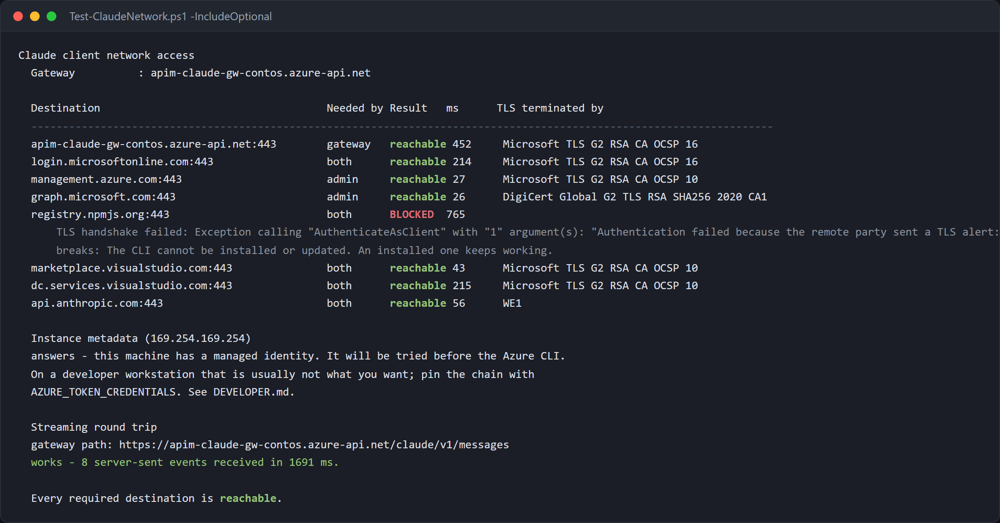
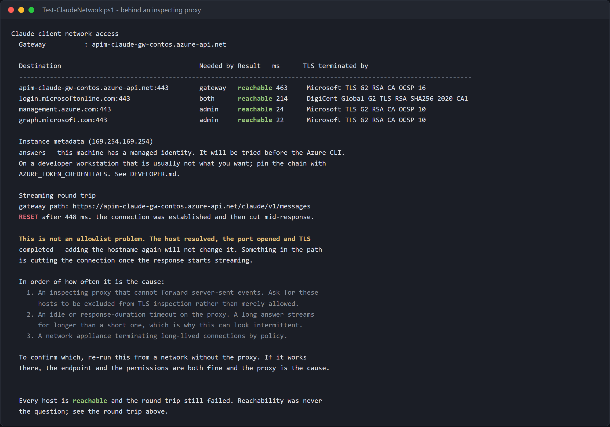

# Network access

What to allow on a firewall or proxy so that Claude Code, the VS Code extension
and Claude Desktop work against Microsoft Foundry.

For the Azure-side design, private origins, WAF, hub routing and the live edge
tests, see [Enterprise network design](NETWORK-ENTERPRISE.md). This article
remains the client egress allowlist.

This is the observed CLI/extension inference path plus Desktop endpoints
derived from its installed package; **Desktop runtime was not captured**.
The method and limits are in [§5](#5-how-this-was-measured).

It is not a universal egress allowlist. Browser sign-in/MFA, operating-system
updates, MCP servers, plugins and tools invoked by a user can need additional
destinations. Review those separately. The first three rows below cover the
default inference hosts and Entra token endpoint, not every feature of a client.

**In this article**

1. [The complete list](#1-the-complete-list)
2. [What differs between the clients](#2-what-differs-between-the-clients)
3. [Administration, and what developers do not need](#3-administration-and-what-developers-do-not-need)
4. [The instance metadata service](#4-the-instance-metadata-service)
5. [How this was measured](#5-how-this-was-measured)
6. [ECONNRESET is not an allowlist problem](#6-econnreset-is-not-an-allowlist-problem)

## Prerequisites

| | |
|---|---|
| **Azure CLI** | signed in with `az login`, in the tenant that owns the Foundry resource |
| **A Foundry resource or a gateway** | whichever path you deploy — you need one, not both |
| **PowerShell** | 5.1 or 7. Every script here runs on both |
| **Access for the selected path** | Gateway: published Entra entitlement, no Foundry role. Direct evaluation only: a role in [FOUNDRY-DIRECT.md §4](FOUNDRY-DIRECT.md#4-diagnostics). Network access is necessary and not sufficient |

To check a machine before changing anything:

```powershell
./scripts/Test-ClaudeNetwork.ps1 -IncludeOptional
```

Supply `-GatewayUrl` for your gateway if it is not already in local settings.
**Portal/manual:** the platform owner copies the Gateway URL from APIM >
Overview (or Custom domains) and checks its network configuration; the client
operator performs the DNS/TLS and streaming checks below. A portal resource
showing Healthy does not test the developer's proxy.



> [!NOTE]
> The run above is from a real machine. `registry.npmjs.org` is genuinely
> blocked on it, which is why that row is red — the CLI still works, because
> the npm registry is needed to *install* and not to *run*.

---

## 1. The complete list

One row per destination, marked with which client needs it. **CLI** is Claude
Code on the command line, **VS Code** is the `anthropic.claude-code`
extension, **Desktop** is the Claude Desktop app.

### Needed on a developer's machine

| # | Destination | Port | CLI | VS Code | Desktop | Needed for |
|---|---|---|:--:|:--:|:--:|---|
| 1 | `<resource>.services.ai.azure.com` | 443 | ✅ | ✅ | ✅ | inference — **direct path** |
| 2 | `<apim-name>.azure-api.net` | 443 | ✅ | ✅ | ✅ | inference — **gateway path** |
| 3 | `login.microsoftonline.com` | 443 | ✅ | ✅ | ✅ | Entra sign-in and token refresh |
| 4 | `registry.npmjs.org` | 443 | ✅ | — | — | installing and updating the CLI |
| 5 | `marketplace.visualstudio.com` | 443 | — | ✅ | — | installing and updating the extension |
| 6 | `*.vsassets.io` | 443 | — | ✅ | — | downloading the extension package |
| 7 | `main.vscode-cdn.net` | 443 | — | ✅ | — | VS Code's own CDN |
| 8 | Microsoft Store endpoints | 443 | — | — | ✅ | installing and updating Desktop (MSIX) |

Rows 1 and 2 are alternatives: allow the one matching the path you deploy. Row
3 is needed in both. **Rows 1–3 are the only ones needed to *run*** — 4 to 8
are install/update rows, not requirements for the observed inference calls.
This statement does not cover interactive sign-in web dependencies or
client-invoked tools. Use your organisation's approved installer distribution.

For a custom gateway hostname, allow that exact hostname instead of only
`<apim-name>.azure-api.net`. For a private gateway endpoint, developers need the
approved private-network path and DNS resolution (for example VPN); a firewall
allow rule alone cannot supply that route.

`*.vsassets.io` covers the publisher-scoped gallery hosts observed during a
real install: `anthropic.gallery.vsassets.io` and
`anthropic.gallerycdn.vsassets.io`.

### Needed only on an administrator's machine

Not required by any developer, on any client.

| # | Destination | Port | Needed for |
|---|---|---|---|
| 9 | `management.azure.com` | 443 | resource and deployment discovery, deployment, diagnostics |
| 10 | `graph.microsoft.com` | 443 | resolving Entra group membership during entitlement sync |

### Observed, not required

| # | Destination | Port | CLI | VS Code | Desktop | What it is |
|---|---|---|:--:|:--:|:--:|---|
| 11 | `dc.services.visualstudio.com` | 443 | ○ | ○ | ○ | Azure CLI telemetry — `az config set core.collect_telemetry=false` |
| 12 | `mobile.events.data.microsoft.com` | 443 | — | ○ | — | VS Code telemetry |
| 13 | `169.254.169.254` | 80 | ○ | ○ | ○ | instance metadata — link-local, see [§4](#4-the-instance-metadata-service) |

○ = seen on the wire, safe to block.

### Deliberately left blocked

`api.anthropic.com`, `code.claude.com`, `*.datadoghq.com`, `claude.ai` were not
needed by the measured inference path. Your network can block unapproved direct
client connections; an installation/update or explicitly enabled integration
may have different requirements.

This does **not** prove Anthropic is absent from processing behind Foundry, or
that a tool cannot send content elsewhere. Check the selected hosting terms in
[Comparison](COMPARISON.md#4-data-handling--the-nuance-most-people-get-wrong)
and all enabled connectors. Do not infer provider residency from a hostname.

### Two entries that look sufficient and are not

> [!IMPORTANT]
> These are the two most common reasons an allowlist looks complete and is not.
> Both were measured, and both produce failures that name neither the host nor
> the rule.

**`cognitiveservices.azure.com` is a token audience, not an endpoint.** It is
the string in the OAuth scope — measured, from Claude Desktop:

```js
["https://cognitiveservices.azure.com/.default", "offline_access"]
```

No client opens a connection to it. An allowlist containing it without a
wildcard appears to cover Foundry and covers nothing. The host all three
clients dial is row 1, built in each from the same shape:

```js
function (e) { return `${e}.services.ai.azure.com` }
```

**`*.azure-api.net` is not matched by any `*.azure.com` rule.** Different
suffix. On the gateway path row 2 is the single most important entry, and the
one most often missing, because every other host in the deployment is under
`azure.com` and this one is not.


---

## 2. What differs between the clients

All three build the same request. The VS Code extension ships its own copy of
the Claude Code binary rather than calling the one on `PATH`, and Desktop
reimplements the same endpoint construction — so their **runtime** requirements
are identical, and they differ only in how they are installed and signed in.

### Claude Code — CLI

Rows 1–3 to run, row 4 to install. Measured: one prompt in gateway mode opened
**exactly one** outbound connection, to the gateway. No telemetry, no call to
`api.anthropic.com`, no call to `code.claude.com`.

### Claude Code — VS Code extension

Rows 1–3 to run, rows 5–7 to install.

The extension carries a 208 MB `claude.exe` under `resources/native-binary/`.
It does **not** use the CLI on `PATH`, so the two versions drift: measured on
one machine, extension 2.1.263 alongside CLI 2.1.272. Configuration that works
in one can fail in the other, and updating one does not update the other.

Its bundled binary was run through the observer and produced the same egress as
the CLI.

### Claude Desktop

Rows 1–3 to run, row 8 to install. Desktop signs in with the OAuth **device
code** flow, against endpoints it builds as:

```js
`${base}/${tenant}/oauth2/v2.0/devicecode`
`${base}/${tenant}/oauth2/v2.0/authorize`
```

where `base` defaults to `https://login.microsoftonline.com`. That is row 3, so
no additional host is involved — but the device-code endpoint is reached
**before any token exists**, which is why a failure there is not an RBAC
problem. See [FOUNDRY-DIRECT.md §4](FOUNDRY-DIRECT.md#4-diagnostics).

> Desktop's runtime egress was **not** captured live for this document. The
> installed package would not launch on the measurement machine — an AppX
> container fault, `0x80070020`, unrelated to networking. Its endpoints are
> read out of the shipped `app.asar` rather than observed, and match the other
> two clients exactly. Treat them as high-confidence but not measured.
>
> Desktop also runs inside an AppX container, which blocks loopback by default.
> A proxy on `127.0.0.1` will not see its traffic without
> `CheckNetIsolation LoopbackExempt -a -n=Claude_pzs8sxrjxfjjc`.

---

## 3. Administration, and what developers do not need

Rows 9 and 10 are needed on the machine that runs setup, the entitlement sync
or the health checks. They are **not** needed on a developer's machine to use
any of the three clients.

## 4. The instance metadata service

Row 13, `169.254.169.254:80`, is link-local and not a firewall rule, but it
decides which identity the clients use. The Azure identity chain probes it
**before** falling back to your `az login`. On an Azure-hosted machine with an
available managed identity, that identity can be selected instead of the person.
A metadata response alone does not prove a managed-identity token was issued.

Measured on a Windows 365 Cloud PC: it answers with instance metadata in 10 ms.

Three behaviours, all different:

| Behaviour | Consequence |
|---|---|
| refused | healthy — the chain falls through to the CLI immediately |
| answers | the host has IMDS; an available managed identity may be selected ahead of the user's sign-in. Inspect the actual identity; pin with `AZURE_TOKEN_CREDENTIALS=dev` for the measured client |
| silently dropped | every token acquisition waits for a timeout first; ask for it to be refused rather than dropped |

`AZURE_TOKEN_CREDENTIALS` takes **`dev`**, not a credential name. Measured on
CLI 2.1.272: `AzureCliCredential` is rejected with
`Valid values are 'prod' or 'dev'`.


## 5. How this was measured

```powershell
./scripts/Test-ClaudeNetwork.ps1                  # required destinations
./scripts/Test-ClaudeNetwork.ps1 -IncludeOptional # plus install and telemetry
```

The check resolves each host, opens the port, completes a TLS handshake,
reports who issued the certificate, and then makes a **real streaming Messages
call**. That last step is the point: see [§6](#6-econnreset-is-not-an-allowlist-problem).

Two tools built for this, kept because the question recurs:

| Tool | What it does |
|---|---|
| `scripts/observe-egress.mjs` | An HTTP proxy that records every host a client attempts and forwards it. Tunnels rather than intercepts — it never terminates TLS, so it can see hostnames and nothing else. |
| `scripts/extract-hosts.mjs` | Pulls every hostname out of a large binary, for the candidate list that the proxy then narrows. |

Run a client through the observer to reproduce any of this:

```powershell
# Terminal 1: leave this running in the foreground.
node scripts/observe-egress.mjs --port 8888 --out egress.json
```

```powershell
# Terminal 2: restore this terminal's proxy after the test.
$previousProxy = $env:HTTPS_PROXY
try {
    $env:HTTPS_PROXY = 'http://127.0.0.1:8888'
    claude -p "hello"
}
finally { $env:HTTPS_PROXY = $previousProxy }
```

Stop terminal 1 with Ctrl+C after the test. **Manual alternative:** use your
approved network/proxy logs for the same time window; Azure portal cannot
capture a local client's egress. Treat the hostname report as internal data.

> [!NOTE]
> The observer forwards CONNECT to the real host and pipes the bytes untouched.
> It never terminates TLS, so it can record the hostname and nothing else —
> which is all a firewall rule needs, and the reason it is safe to run against
> a production endpoint.

## 6. ECONNRESET is not an allowlist problem

```text
✳ Connection dropped (ECONNRESET) · Retrying in 22s · attempt 8/10
```

The host resolved, the port opened, TLS completed, and the connection was cut
**after the response started streaming**. The host was never blocked, so adding
it again changes nothing.



> [!WARNING]
> Every destination in that run is reachable and the call still fails. This is
> the state that sends people back to a firewall list that was never wrong.
> The capture is reproduced, not staged — `scripts/hostile-proxy.mjs`
> establishes the connection and then resets it, which is what an inspecting
> proxy does to server-sent events.

Claude Code streams answers as server-sent events. A proxy that buffers a
response in order to inspect it cannot forward them, and many resolve that by
cutting the connection rather than returning an error that names a cause.

The test that separates a blocked host from a broken stream is a non-streaming
call against a streaming one:

```powershell
$baseUrl = 'https://<apim-name>.azure-api.net/claude'
$id = [guid]::NewGuid().ToString('N')
$nonStreamingBody = Join-Path (Get-Location) "network-$id-a.json"
$streamingBody = Join-Path (Get-Location) "network-$id-b.json"
$tok = az account get-access-token --resource https://cognitiveservices.azure.com --query accessToken -o tsv

try {
# Non-streaming
'{"model":"<deployment>","max_tokens":16,"messages":[{"role":"user","content":"hi"}]}' |
  Set-Content $nonStreamingBody -Encoding ascii
curl.exe -sS -w "`n[http=%{http_code}]" -X POST `
  "$baseUrl/v1/messages" `
  -H "Authorization: Bearer $tok" -H "content-type: application/json" `
  -H "anthropic-version: 2023-06-01" -d "@$nonStreamingBody"

# Streaming - what the clients actually do
'{"model":"<deployment>","max_tokens":32,"stream":true,"messages":[{"role":"user","content":"count to five"}]}' |
  Set-Content $streamingBody -Encoding ascii
curl.exe -sS -N --no-buffer -w "`n[http=%{http_code}]" -X POST `
  "$baseUrl/v1/messages" `
  -H "Authorization: Bearer $tok" -H "content-type: application/json" `
  -H "anthropic-version: 2023-06-01" -d "@$streamingBody"
}
finally { Remove-Item $nonStreamingBody, $streamingBody -Force -ErrorAction SilentlyContinue }
```

These are Windows PowerShell examples (`curl.exe` avoids the 5.1 `curl`
alias). Use your actual gateway URL and permitted deployment name. For an
approved direct test, change the base URL to the Foundry account's
`https://<resource>.services.ai.azure.com/anthropic` and use its authorised
identity; do not grant a gateway developer a bypass role merely to test networking.

Write the body to a file and pass `-d "@file"`. Inlining JSON through
PowerShell into `curl.exe` mangles the quoting and returns
`Request body could not be parsed as JSON`, which reads like a server fault and
is not one.

| What you see | What it is | Who fixes it |
|---|---|---|
| both fail, `Could not resolve host` | DNS or the allowlist | network — add the host |
| both fail, timeout | traffic dropped rather than refused | network — add the host |
| non-streaming works, streaming resets | TLS inspection breaking server-sent events | network — **exclude** these hosts from inspection; they are already allowed |
| non-streaming works, streaming returns 200 with no events | a proxy buffering the whole response | same exclusion |
| `certificate verify failed` | inspecting proxy whose CA is not trusted here | install the corporate root, or set `NODE_EXTRA_CA_CERTS` |
| `401` / `403` | network is fine | see [FOUNDRY-DIRECT.md §4](FOUNDRY-DIRECT.md#4-diagnostics) |
| `404` | network is fine; the model is not a deployment | see [FOUNDRY-DIRECT.md §3](FOUNDRY-DIRECT.md#3-the-model-list) |

`Test-ClaudeNetwork.ps1` makes this call and reports which row applies, instead
of reporting that every host is reachable — which, in the reset case, is both
true and useless.

> [!TIP]
> The ask to a network team is different for each row. A blocked host needs to
> be **allowed**. A reset stream needs those hosts **excluded from TLS
> inspection** — they are already allowed, and asking for them to be allowed
> again gets the ticket closed as "already done".

## Next steps

For backend private endpoints, VNet/subnet ownership, DNS zones, and tests from
inside versus outside the network, follow [Private projection](SECURE-PROJECTION.md).
The gateway can have a public authenticated ingress while its resolver,
Cosmos and Foundry paths are private; these are separate network decisions.

| Goal | Where |
|---|---|
| Configure a developer machine on the direct path | [FOUNDRY-DIRECT.md §2](FOUNDRY-DIRECT.md#2-running-it) |
| Diagnose a 401, a device-code 400, or a missing model | [FOUNDRY-DIRECT.md §4](FOUNDRY-DIRECT.md#4-diagnostics) |
| Look up a gateway status code | [TROUBLESHOOTING.md](TROUBLESHOOTING.md) |
| Work out why Claude Desktop will not open | [TROUBLESHOOTING.md](TROUBLESHOOTING.md#desktop-does-not-open-at-all) |
| See what the deployment costs | `./scripts/Get-ClaudeBom.ps1 -WithPrices` |

## See also

- [FOUNDRY-DIRECT.md](FOUNDRY-DIRECT.md) — the direct path, and its diagnostics
- [TROUBLESHOOTING.md](TROUBLESHOOTING.md) — gateway status codes
- [DEVELOPER.md](../DEVELOPER.md) — developer setup and FAQ
