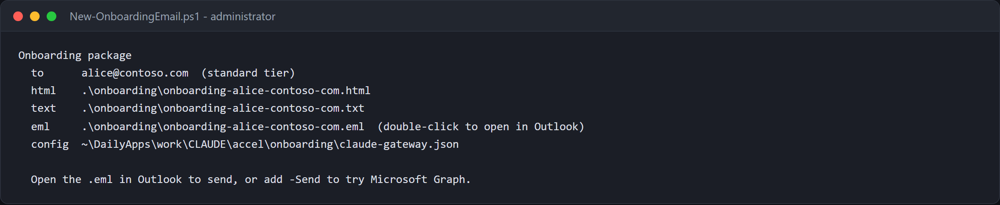
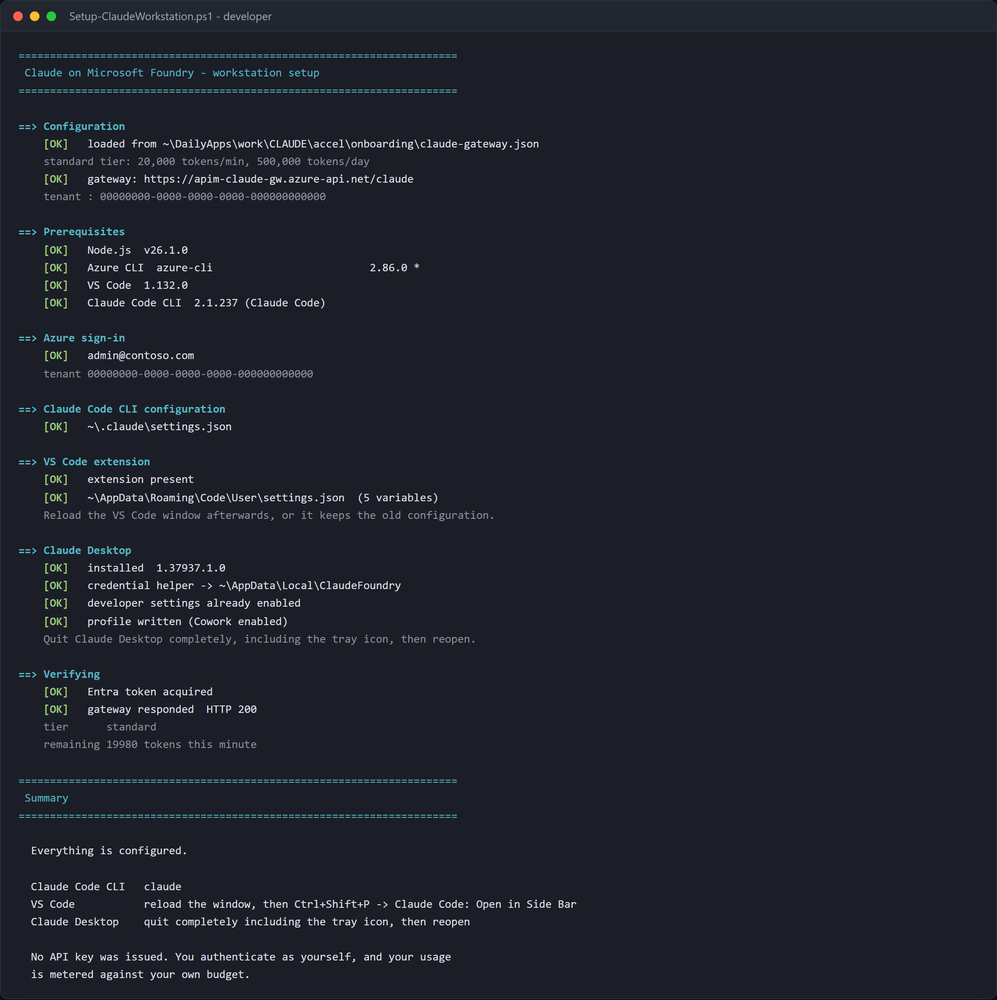
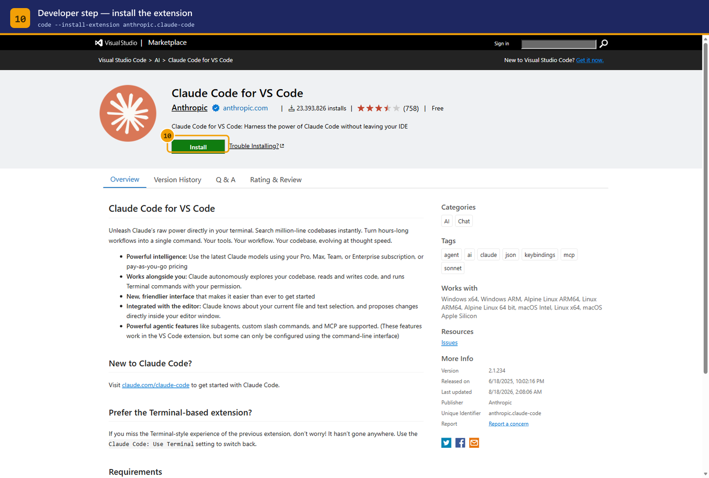

# Onboarding guide — granting, changing, and revoking access

Two audiences, two halves.

| Part | Who | Task |
|------|-----|------|
| **A** | Platform team | add a developer, change their tier, revoke access |
| **B** | The developer | install and configure — hand this half over as-is |

Prerequisites and roles are in the [Setup guide](SETUP.md#2-permissions-and-roles).

---

# Part A — Platform team

## How entitlement actually works

Understanding this makes every operation below obvious.

```
Entra group  ──(Sync-ClaudeAccess.ps1)──▶  APIM named value  ──▶  policy check
claude-code-standard                        allow-standard         oid in list?
claude-code-premium                         allow-premium
```

The policy compares the `oid` claim in the caller's token against the
`allow-standard` and `allow-premium` named values. Those are **flat lists of
object ids**, not group references — the gateway never calls Graph at request
time.

Three consequences:

1. Group membership is not live. **A change takes effect when the sync runs**, not
   when you click Add member.
2. `allow-premium` is evaluated first. Someone in both groups gets premium.
3. Object ids, not UPNs. Renaming a user changes nothing; deleting and recreating
   the account breaks their access.

---

## 1. Add a developer

### Step 1 — find their object id

```bash
az ad user show --id developer@contoso.com --query "{name:displayName, oid:id}" -o table
```

Guests are listed under their **home** address in some tenants and their invited
address in others. If the lookup fails:

```bash
az ad user list --filter "startswith(mail,'developer')" \
  --query "[].{name:displayName, upn:userPrincipalName, mail:mail, oid:id}" -o table
```

For a service principal or CI identity:

```bash
az ad sp show --id <app-id> --query "{name:displayName, oid:id}" -o table
```

### Step 2 — add them to the tier group

Portal: **Entra ID → Groups → `claude-code-standard` → Members → Add members**

CLI:

```bash
az ad group member add --group claude-code-standard --member-id <object-id>
```

### Step 3 — push the change to the gateway

**This is the step people forget.** Until it runs, the developer gets `403`.

```powershell
./scripts/Sync-ClaudeAccess.ps1 -ApimName <apim> -ResourceGroup <rg>
```

Preview first if you want:

```powershell
./scripts/Sync-ClaudeAccess.ps1 -ApimName <apim> -ResourceGroup <rg> -WhatIf
```

The script prints each resolved identity and flags anyone in both groups.

> **Service principals** are not returned by a delegated token without
> `Application.Read.All`. Pass CI identities explicitly:
> `-AdditionalPremiumOids <oid>` or `-AdditionalStandardOids <oid>`.

> **Schedule it** if you want membership changes to apply without a person in the
> loop. A daily Azure Automation runbook or a scheduled pipeline is enough; the
> script is idempotent.

### Step 4 — verify

```bash
az apim nv show -g <rg> --service-name <apim> --named-value-id allow-standard --query value -o tsv
```

Their object id must appear. Then confirm end to end:

```powershell
./scripts/Show-Governance.ps1 -ApimName <apim> -ResourceGroup <rg>
```

### Step 5 — hand over Part B

Send the developer [Part B](#part-b--developer), plus
**`onboarding/claude-gateway.json`** — the file the wizard wrote when you
deployed. Their setup script reads the gateway URL, tenant and tier limits from
it, so they type none of them.

Or generate the whole handover — a formatted email with the config alongside it:

```powershell
./scripts/New-OnboardingEmail.ps1 `
    -ConfigPath ./onboarding/claude-gateway.json `
    -To developer@contoso.com -DisplayName 'Sam'
```

Writes HTML, plain text and an `.eml` you can open in Outlook and send. Add
`-Send` to try Microsoft Graph directly — that needs the `Mail.Send` delegated
permission, and falls back to the `.eml` cleanly when it is not granted.



The config file carries **no secret**: the gateway URL, the tenant id and the
tier limits. All of it is information the developer needs, none of it grants
access. Access is group membership.

> Put `Setup-ClaudeWorkstation.ps1` and `claude-gateway.json` on a share or
> internal site and pass `-DistributionUrl`; the email then contains a
> two-line command that fetches and runs them.

---

## 2. UI walkthrough — adding a member in the portal

Two portals work. **Microsoft Entra admin center** (`entra.microsoft.com`) is
the current home for identity; the Azure portal blade is identical underneath.

### Get a direct link to the group

Skip the navigation entirely — generate the deep link once and bookmark it:

```powershell
$gid = az ad group show --group claude-code-standard --query id -o tsv
"https://entra.microsoft.com/#view/Microsoft_AAD_IAM/GroupDetailsMenuBlade/~/Members/groupId/$gid"
```

### Or navigate

1. **entra.microsoft.com** → **Groups** → **All groups**
2. Search `claude-code-` — both tier groups appear
3. Open **claude-code-standard**
4. Left nav → **Members** → **+ Add members**
5. Search by name or email, tick the person, **Select**
6. Confirm they now appear in the list

### Then run the sync — this is the step people miss

The portal grants *group membership*. The gateway reads an **allowlist of
object ids** that is refreshed by the sync, so until it runs the developer still
gets `403`:

```powershell
./scripts/Sync-ClaudeAccess.ps1 -ApimName <apim> -ResourceGroup <rg>
```

> **Why there is no live lookup.** Resolving group membership at request time
> would need the gateway to hold the Graph `GroupMember.Read.All` application
> permission, which requires tenant admin consent. The sync approach needs no
> admin consent at all — the trade-off is that changes apply when it runs.
> Schedule it (Azure Automation, or a pipeline on a timer) if you want the
> portal to be the only step.

### Copying someone's object id from the portal

The allowlists key on **object id**, not UPN. If you want to verify a specific
person landed:

**Entra admin center → Users →** search them **→ Overview → Object ID** (there
is a copy button next to it). Then:

```powershell
az apim nv show -g <rg> --service-name <apim> --named-value-id allow-standard --query value -o tsv
```

Their id should be in that list.

### Delegating this without handing over Azure rights

Adding members needs group **Owner** or Groups Administrator — not any Azure
RBAC role. Make a team lead the **owner of the group** and they can entitle
people from the portal without any access to the gateway, the Foundry account,
or the subscription. Pair that with a scheduled sync and the platform team is
out of the loop entirely.

> Screenshots of these two blades are not shipped, because they show real
> directory membership. Capture them against your own tenant:
>
> ```powershell
> node guide/auth.mjs
> $env:STANDARD_GROUP_ID = (az ad group show --group claude-code-standard --query id -o tsv)
> node guide/capture.mjs c2-entra-groups c3-group-members
> ```
>
> See [guide/README.md](../guide/README.md).

---

## 3. Common variations

| Situation | What to do |
|-----------|-----------|
| Whole team at once | Loop `az ad group member add`, then sync once |
| Nested group | **Not supported.** The sync reads direct members only. Flatten it, or add each person |
| Contractor, time-boxed | Use an Entra **access package** or PIM-eligible membership so it expires on its own, then schedule the sync |
| CI/CD identity | Service principal in `claude-code-premium`, passed with `-AdditionalPremiumOids` |
| Someone needs it *now* | Add to group, run the sync immediately — the whole path is under a minute |

---

## 4. Change a developer's tier

Two different things get called "changing the tier". Be clear which one you mean.

### 4a. Move one person to a different tier

```bash
az ad group member remove --group claude-code-standard --member-id <oid>
az ad group member add    --group claude-code-premium  --member-id <oid>
```

```powershell
./scripts/Sync-ClaudeAccess.ps1 -ApimName <apim> -ResourceGroup <rg>
```

Verify from the developer's own response headers — the gateway reports the tier
it applied:

```
x-claude-tier: premium
x-ratelimit-remaining-tokens: 79980
```

> Leaving them in **both** groups is not an error and does not double their
> budget. `allow-premium` is checked first, so they get premium. Remove them from
> the standard group anyway, so the lists stay readable.

### 4b. Change what a tier *means*

This changes the budget for everyone in that tier. **No sync needed** — named
values are read on the next request.

| Named value | Meaning | Shipped default |
|-------------|---------|----------------:|
| `tpm-standard` | tokens/minute, standard | 20,000 |
| `tpm-premium` | tokens/minute, premium | 80,000 |
| `quota-standard` | tokens/day, standard | 500,000 |
| `quota-premium` | tokens/day, premium | 5,000,000 |

Portal: **APIM → APIs → Named values → select → edit Value → Save**


CLI:

```bash
az apim nv update -g <rg> --service-name <apim> \
  --named-value-id tpm-standard --value 30000
```

Confirm:

```bash
az apim nv show -g <rg> --service-name <apim> \
  --named-value-id tpm-standard --query value -o tsv
```

> **The daily quota does not reset when you raise it.** `llm-token-limit` tracks
> consumption against the period that is already running. Someone who exhausted
> 500,000 today stays blocked until the period rolls over, even after you set it
> to 5,000,000. Move them to premium instead if they need unblocking now.

### 4c. Add a third tier

Add a named value pair (`tpm-<name>`, `quota-<name>`), an `allow-<name>` list, an
Entra group, and a branch in the policy's tier lookup. The policy structure is in
[ARCHITECTURE.md](ARCHITECTURE.md).

---

## 5. Revoke access

```bash
az ad group member remove --group claude-code-standard --member-id <oid>
```

```powershell
./scripts/Sync-ClaudeAccess.ps1 -ApimName <apim> -ResourceGroup <rg>
```

The next request returns `403`. There is no credential to rotate and nothing to
collect from the developer's machine, because none was ever issued.

**When someone leaves the company** their Entra account is disabled and token
acquisition fails immediately — access is revoked at that moment, ahead of any
sync. Run the sync anyway to keep the allowlists clean.

> **Also check the bypass.** Removing someone from the group does nothing if they
> hold `Cognitive Services User` directly on the Foundry account. See
> [Setup §4.2](SETUP.md#42-close-the-bypass--do-not-skip-this).

---

## 6. Offboarding checklist

- [ ] Removed from both `claude-code-*` groups
- [ ] `Sync-ClaudeAccess.ps1` run, allowlists confirmed clean
- [ ] No direct `Cognitive Services User` on the Foundry account
- [ ] Usage exported from [Monitoring](MONITORING.md) if it is being charged back

---
---

# Part B — Developer

You have been granted access to Claude (Sonnet 5 and Opus 5) running in our own
Microsoft Foundry resource, reached through the gateway.

**There is no API key.** You authenticate as yourself with Microsoft Entra ID,
and your usage is metered against your own budget.

You do **not** need any Azure role on the Foundry resource. The gateway holds
that; you only need to be in the entitlement group, which you already are.

Your gateway URL, tenant, and tier limits are in the `claude-gateway.json` your
platform team sent you. The setup script reads it, so you do not need to type
any of them.

> **Do not have that file?** It is not in the repository — your platform team
> generates it when they deploy the gateway, so ask them for it. It usually
> arrives attached to your onboarding email.
>
> You can also skip it entirely and pass the two values directly:
>
> ```powershell
> .\Setup-ClaudeWorkstation.ps1 -GatewayUrl https://<apim>.azure-api.net/claude -TenantId <tenant-id>
> ```
>
> Neither value is a secret. Your access comes from Entra group membership.

## One command

Put `claude-gateway.json` next to the script, then:

```powershell
# Windows
.\Setup-ClaudeWorkstation.ps1 -ConfigPath .\claude-gateway.json
```

```bash
# macOS and Linux
./setup-claude-workstation.sh --config ./claude-gateway.json
```

No administrator rights needed. It checks what you already have, installs
anything missing, configures **all three clients** — Claude Code CLI, the VS
Code extension, and Claude Desktop including Cowork — and finishes with a real
call through the gateway to prove it works.



Then restart the clients:

| Client | Restart |
|--------|---------|
| Claude Code CLI | nothing to do |
| VS Code | reload the window |
| Claude Desktop | quit completely, **including the tray icon** |

Those restarts matter: all three read their configuration at startup.

Useful switches:

| Windows | macOS / Linux | Effect |
|---------|---------------|--------|
| `-SkipInstall` | `--skip-install` | configure only, install nothing |
| `-SkipDesktop` / `-SkipVSCode` | `--skip-desktop` / `--skip-vscode` | leave that client alone |
| `-NoCowork` | `--no-cowork` | configure Desktop without the Cowork tab |

Re-run it any time — it reconciles rather than duplicating.

> **macOS and Linux** need `jq`, and the script installs it if your package
> manager is one it recognises (Homebrew, apt, dnf, pacman, zypper).
>
> If `npm install -g` fails on Linux, it is almost always a non-writable global
> prefix rather than anything to do with Claude:
> `npm config set prefix ~/.npm-global && export PATH=~/.npm-global/bin:$PATH`

---

## What you get

**Install the VS Code extension** — the setup script does this, but this is what
it installs:



**Claude Code in VS Code** — open a folder, then **Ctrl+Shift+P →
`Claude Code: Open in Side Bar`**. There is no sign-in step; your Entra
credential is already resolved.


**Claude Code in the terminal** — run `claude`. Confirm the backend with
`/status`:


**Your budget on every response.** The headers carry what you have left:

```
x-ratelimit-remaining-tokens: 19980
x-quota-remaining-today: 499980
```

Exceeding the per-minute limit returns `429` with `Retry-After`; Claude Code
backs off and retries on its own, so you may only notice a pause. Exhausting the
daily quota returns `403` until the period rolls over — ask the platform team if
you need the premium tier.

**Your usage is attributed to you** by name in chargeback reporting. Nothing is
anonymous — but nothing is inspected either; only token counts are recorded,
never your prompts.

---

## If something is wrong

| Symptom | Cause → Fix |
|---|---|
| `401` / "Entra ID token required" | Signed into the wrong tenant. Re-run the setup script — it pins the right one. |
| `403` "Not entitled to Claude Code" | Not in the group, or membership not synced yet. Ping the platform team. |
| `429` | Per-minute budget hit. It resets within a minute; Claude Code retries automatically. |
| `DeploymentNotFound` | A model alias points at something we do not host. Use only `claude-sonnet-5` / `claude-opus-5`. |
| Extension prompts for Anthropic sign-in | Settings not picked up — reload the VS Code window. |
| Panel fails but the CLI works | The extension host is running an older build. **Developer: Reload Window** in each open window. |

Anything else → [Debug guide](DEBUGGING.md), or the platform team.

---

## Appendix — configuring it by hand

Only needed if you cannot run the script, or you are diagnosing what it did.

**1. Sign in**, naming the tenant. Guests land in their home directory
otherwise, and the gateway rejects the token:

```powershell
az login --tenant <your-tenant-id>
az account show --query "{tenant:tenantId, user:user.name}" -o table
```

**2. Install** the CLI and extension:

```powershell
npm install -g @anthropic-ai/claude-code
code --install-extension anthropic.claude-code
```

Requires Node.js 18+, VS Code 1.94+, and the Azure CLI.

**3. Write** `~/.claude/settings.json` (`%USERPROFILE%\.claude\settings.json` on
Windows), taking the gateway URL from your `claude-gateway.json`:

```json
{
  "env": {
    "CLAUDE_CODE_USE_FOUNDRY": "1",
    "ANTHROPIC_FOUNDRY_BASE_URL": "https://<your-gateway>.azure-api.net/claude",
    "ANTHROPIC_DEFAULT_OPUS_MODEL": "claude-opus-5",
    "ANTHROPIC_DEFAULT_SONNET_MODEL": "claude-sonnet-5",
    "ANTHROPIC_DEFAULT_HAIKU_MODEL": "claude-sonnet-5"
  },
  "availableModels": ["claude-sonnet-5", "claude-opus-5"],
  "enforceAvailableModels": true
}
```

Two traps the script handles for you:

- Do **not** also set `ANTHROPIC_FOUNDRY_RESOURCE`. It is mutually exclusive with
  the base URL, and the session dies with
  `baseURL and resource are mutually exclusive`.
- Point the **haiku** alias at Sonnet. Most tenants have no Haiku deployment, and
  the failure otherwise surfaces mid-task as `DeploymentNotFound`.

**4. VS Code needs the same values again.** The extension host does not inherit
shell environment, so add `claudeCode.environmentVariables` in **Preferences:
Open User Settings (JSON)** with the same names and values.

**5. Check it**:

```powershell
claude auth status     # expect apiProvider: foundry
claude -p "Reply with exactly: OK"
```
