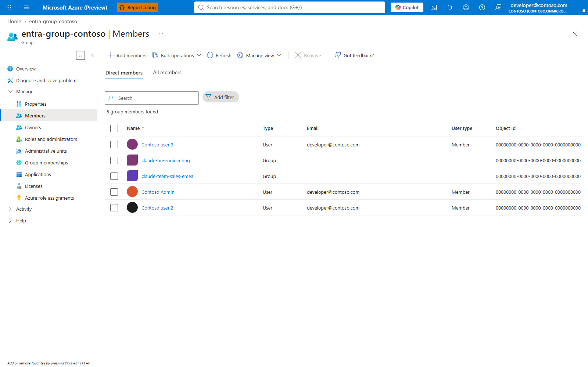
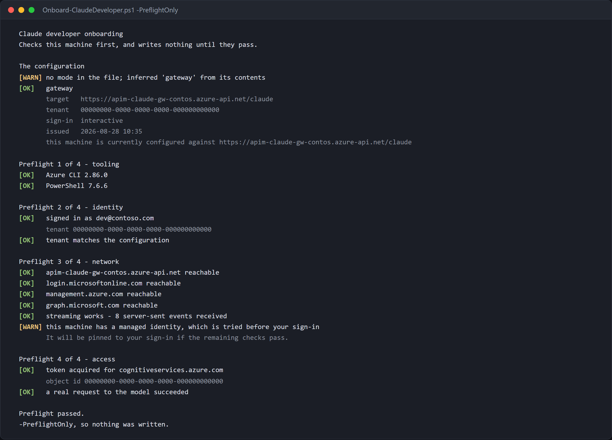

# Onboarding guide — granting, changing, and revoking access

**For the platform team.** Membership changes need group-owner or Groups
Administrator rights. Publishing and budget changes also need gateway write
access; reading reports needs telemetry access. These are not developer tasks.

What the developer does is one command on their own machine, with no Azure
rights at all — that is **[DEVELOPER.md](../DEVELOPER.md)**, and handing them
that link is step 5 below.

Prerequisites and roles are in the [Setup guide](SETUP.md#2-permissions-and-roles).
Select the subscription, gateway and workspace with
[Operations](OPERATIONS.md#1-select-the-gateway-and-workspace). Run from the
repository root. If your tier groups have nondefault names, pass
`-StandardGroup` and `-PremiumGroup` to the membership/sync commands.

## Find the values before changing membership

| Value | Portal source | CLI lookup |
|---|---|---|
| `<apim>` / gateway `<rg>` | API Management services > selected instance > Overview > Essentials | `az apim list --query "[].{name:name,rg:resourceGroup}" -o table` |
| Tier group name or ID | Entra ID > Groups > All groups; select the group your platform owner recorded, then Overview | `scripts/Get-ClaudeGatewayTarget.ps1 StandardGroup` and `scripts/Get-ClaudeGatewayTarget.ps1 PremiumGroup` read the installer record; `az ad group show --group <chosen-group> --query "{name:displayName,id:id}" -o table` verifies it |
| Developer object ID | Entra ID > Users > selected user > Overview > Object ID | `az ad user show --id <upn> --query "{name:displayName,id:id}" -o table` |
| Business-unit identifier | Configured governance authority: Turnstile Gateway governance, or APIM > Named values > `bu-registry` | `scripts/Set-ClaudeBusinessUnit.ps1 -List` with the explicit gateway target |
| Config path | The controlled distribution location containing the generated handover | `Test-Path .\onboarding\claude-gateway.json` checks the local default output; it does not discover another team's deployment |

Group membership changes are Entra operations; publication is a separate APIM
or projection operation. The literal `claude-code-standard` / `claude-code-premium`
examples below apply only if those are your recorded group names. If a lookup
is absent or ambiguous, choose the actual group with its owner; do not create a
new similarly named group as a workaround.

---

## How entitlement actually works

Understanding this makes every operation below obvious.

```text
Entra group  ──(Sync-ClaudeAccess.ps1)──▶  APIM named value  ──▶  policy check
claude-code-standard                        allow-standard         oid in list?
claude-code-premium                         allow-premium
```

The policy compares the `oid` claim in the caller's token against the
`allow-standard` and `allow-premium` named values. Those are **flat lists of
object ids**, not group references — the gateway never calls Graph at request
time.

This section describes `entitlement-source=named-value`, the default.
After a [projection migration](SCALE.md#the-move-itself-step-by-step), group
changes must be published by the projection writer instead. `-Sync` on
`Set-ClaudeDeveloper.ps1` invokes the named-value writer; it does not refresh
Cosmos leases or records.

Three consequences:

1. Group membership is not live. **A change takes effect when the sync runs**, not
   when you click Add member.
2. `allow-premium` is evaluated first. Someone in both groups gets premium.
3. Object ids, not UPNs. Renaming a user changes nothing; deleting and recreating
   the account breaks their access.

---

## 1. Add a developer

One command. It edits the **Entra group**, because that is the durable change —
`Sync-ClaudeAccess.ps1` rebuilds `allow-standard` and `allow-premium` from group
membership every time it runs, so a developer added straight to a named value
works until the next sync and then silently stops.

```powershell
./scripts/Set-ClaudeDeveloper.ps1 -User amara@contoso.com -Tier standard -Sync
./scripts/Set-ClaudeDeveloper.ps1 -User amara@contoso.com -Tier premium -BusinessUnit sales -Sync
./scripts/Set-ClaudeDeveloper.ps1 -User amara@contoso.com -Remove -Sync
```

`-Sync` publishes to the gateway as well. Without it the change is in the
directory but not yet at the gateway, and the script says so rather than
implying it is done.
If it reports **Nothing to change**, run `Sync-ClaudeAccess.ps1` explicitly:
the command exits before syncing when no direct membership edit was made.
Read warnings and run the comparison; process success alone is not proof of
effective access.

Moving someone between tiers removes them from the one they left. Leaving them
in both is not an error — the policy checks premium first — but it makes the
lists unreadable and the applied tier hard to predict from the portal.

`-Remove` attempts to clear direct membership in both tiers and all registered
business-unit groups. It cannot remove an inherited path through an unregistered
nested group. Do not combine `-Remove` with `-BusinessUnit`: use the removal
command shown, then verify every effective membership path.

Guests work by the address you invited them with. A guest's UPN is not their
email — in this tenant `amara@contoso.com` is stored as
`amara_contoso.com#EXT#@contoso.onmicrosoft.com` — and the script tries the
object id, the mail attribute and the UPN in turn.

The sections below cover the same job done by hand, and the portal walkthrough.
**Portal:** Entra ID > Groups > the relevant tier/team/unit > Members. Add or
remove the person, then perform Step 3's publication and Step 4's verification.

## 1a. Add a developer by hand

### Step 1 — find their object id

```bash
az ad user show --id developer@contoso.com --query "{name:displayName, oid:id}" -o table
```

Guests are listed under their **home** address in some tenants and their invited
address in others. If the lookup fails:

```bash
az ad user list --filter "startswith(mail,'developer')" \
  --query "[].{name:displayName, upn:userPrincipalName, mail:mail, oid:id}" -o table
```

For a service principal or CI identity:

```bash
az ad sp show --id <app-id> --query "{name:displayName, oid:id}" -o table
```

**Portal:** Entra ID > Users > person > Overview > Object ID. For a workload,
Enterprise applications > application > Overview > Object ID; the application
(client) ID is not its service-principal object ID.

### Step 2 — add them to the tier group

Portal: **Entra ID → Groups → `claude-code-standard` → Members → Add members**

CLI:

```bash
az ad group member add --group claude-code-standard --member-id <object-id>
```

### Step 3 — push the change to the gateway

**This is the step people forget.** Until it runs, the developer gets `403`.

```powershell
./scripts/Sync-ClaudeAccess.ps1 -ApimName <apim> -ResourceGroup <rg>
```

Preview first if you want:

```powershell
./scripts/Sync-ClaudeAccess.ps1 -ApimName <apim> -ResourceGroup <rg> -WhatIf
```

The script prints each resolved identity and flags anyone in both groups.

**Portal/manual:** Entra > Groups > All members gives the transitive roster.
APIM > APIs > Named values > `allow-premium` / `allow-standard` > Edit accepts
the comma-delimited object IDs. Publish the full roster, not just the changed
person; premium wins over standard. This is a manual publication, not an
automatic link between the portals. The script handles the roster consistently.

**Removing the last member:** the writer protects against unexpectedly empty
groups and may leave the old list in place with a warning. Confirm the directory
really is empty, then intentionally run:

```powershell
./scripts/Sync-ClaudeAccess.ps1 -ApimName <apim> -ResourceGroup <rg> -AllowEmpty
```

In the portal, the equivalent is saving an empty sentinel list only after the
same review. Re-run the comparison and prove the removed identity is refused.

> **Service principals** are not returned by a delegated token without
> `Application.Read.All`. Pass CI identities explicitly:
> `-AdditionalPremiumOids <oid>` or `-AdditionalStandardOids <oid>`.

> **Scheduling is a separate deployment.** A delegated operator token is not a
> durable unattended credential. An Automation/pipeline/Container Apps identity
> needs Graph membership-read permission and gateway write access; application
> permission consent needs a tenant administrator ([U17](UNKNOWNS.md)).
> Entra > Enterprise applications > the job identity shows its granted
> permissions; Azure > the scheduler > execution history shows whether it ran.
> Choose the cadence from the required revocation window, not an arbitrary day.
> For the projection, complete reconciliation must finish within its lease;
> follow [Private projection](SECURE-PROJECTION.md#freshness-and-operating-envelope).

### Step 4 — verify

```bash
az apim nv show -g <rg> --service-name <apim> --named-value-id allow-standard --query value -o tsv
```

Their object id must appear in the effective tier. **Portal:** APIM > Named
values shows the same published list. Then confirm end to end as the developer:

```powershell
./scripts/Show-Governance.ps1 -ApimName <apim> -ResourceGroup <rg>
```

### Step 5 — hand over the developer guide

Send the developer **[DEVELOPER.md](../DEVELOPER.md)**, plus
**`onboarding/claude-gateway.json`** — the file the wizard wrote when you
deployed. Their setup script reads the gateway URL, tenant and tier limits from
it, so they type none of them.

Or generate the whole handover — a formatted email with the config alongside it:

```powershell
./scripts/New-OnboardingEmail.ps1 `
    -ConfigPath ./onboarding/claude-gateway.json `
    -To developer@contoso.com -DisplayName 'Sam'
```

Writes HTML, plain text and an `.eml` you can open in Outlook and send. Attach
the configuration and complete bundle yourself; the generated message does not
attach them. Add
`-Send` to try Microsoft Graph directly — that needs the `Mail.Send` delegated
permission, and falls back to the `.eml` cleanly when it is not granted.


The config file carries **no secret**: the gateway URL, the tenant id and the
tier limits. All of it is information the developer needs, none of it grants
access. Access is group membership.

> Put `Setup-ClaudeWorkstation.ps1` and `claude-gateway.json` on a share or
> internal site and pass `-DistributionUrl`; the email then contains a
> two-line command that fetches and runs them.
> Also distribute the complete scripts folder, including Desktop's token
> helpers. The email generator's two-file download is not a complete Desktop
> installation bundle. **Manual:** attach the config and bundle/link in your
> mail client and include [DEVELOPER.md](../DEVELOPER.md); no Graph mail grant is
> required to send that handover yourself.

---

## 2. UI walkthrough — adding a member in the portal

Two portals work. **Microsoft Entra admin center** (`entra.microsoft.com`) is
the current home for identity; the Azure portal blade is identical underneath.

### Get a direct link to the group

Skip the navigation entirely — generate the deep link once and bookmark it:

```powershell
$gid = az ad group show --group claude-code-standard --query id -o tsv
"https://entra.microsoft.com/#view/Microsoft_AAD_IAM/GroupDetailsMenuBlade/~/Members/groupId/$gid"
```

### Or navigate

1. **entra.microsoft.com** → **Groups** → **All groups**
2. Search `claude-code-` — both tier groups appear
3. Open **claude-code-standard**
4. Left nav → **Members** → **+ Add members**
5. Search by name or email, tick the person, **Select**
6. Confirm they now appear in the list

Use the actual tier group identified in [the value-source table](#find-the-values-before-changing-membership),
not a similarly named group. The batch resolves that group from the operator's
runtime filter and opens its Members blade; publication/verification remain
separate from this directory view.



People on a directory page are pseudonymised from the group's own member list read at
capture time (`redaction.people` in the capture spec); their initials are hidden.

### Then run the sync — this is the step people miss

The portal grants *group membership*. The gateway reads an **allowlist of
object ids** that is refreshed by the sync, so until it runs the developer still
gets `403`:

```powershell
./scripts/Sync-ClaudeAccess.ps1 -ApimName <apim> -ResourceGroup <rg>
```

To check whether the gateway is already current, without reading two lists by
eye:

```powershell
./scripts/Compare-ClaudeEntitlement.ps1 -ApimName <apim> -ResourceGroup <rg>
```

It resolves every identity from both sides and exits non-zero when they
disagree. `missing` is someone added in the portal who will get `403` until the
sync runs; `stale` is someone removed who can still call the gateway.

> **Why there is no live lookup.** Resolving group membership at request time
> would need the gateway to hold the Graph `GroupMember.Read.All` application
> permission, which requires tenant admin consent. The sync approach needs no
> admin consent at all — the trade-off is that changes apply when it runs.
> Schedule it (Azure Automation, or a pipeline on a timer) if you want the
> portal to be the only step.
> The workload identity/grant and failure monitoring in Step 3 are still needed;
> clicking Add member does not create that schedule.

### Copying someone's object id from the portal

The allowlists key on **object id**, not UPN. If you want to verify a specific
person landed:

**Entra admin center → Users →** search them **→ Overview → Object ID** (there
is a copy button next to it). Then:

```powershell
az apim nv show -g <rg> --service-name <apim> --named-value-id allow-standard --query value -o tsv
```

Their id should be in that list.

### Delegating this without handing over Azure rights

Adding members needs group **Owner** or Groups Administrator — not any Azure
RBAC role. Make a team lead the **owner of the group** and they can entitle
people from the portal without any access to the gateway, the Foundry account,
or the subscription. Pair that with a scheduled sync and the platform team is
out of the loop entirely.

> Screenshots of these two blades are not shipped, because they show real
> directory membership. Capture them against your own tenant:
>
> ```powershell
> node guide/auth.mjs
> $env:STANDARD_GROUP_ID = (az ad group show --group claude-code-standard --query id -o tsv)
> node guide/capture.mjs c2-entra-groups c3-group-members
> ```
>
> See [guide/README.md](../guide/README.md).

---

## 3. Common variations

| Situation | What to do |
|-----------|-----------|
| Whole team at once | Loop `az ad group member add`, then sync once |
| Nested group | Supported: the shared Graph reader resolves transitive membership and follows paging. Inspect All members, not only direct members |
| Contractor, time-boxed | Use an Entra **access package** or PIM-eligible membership so it expires on its own, then schedule the sync |
| CI/CD identity | Service principal in `claude-code-premium`, passed with `-AdditionalPremiumOids` |
| Someone needs it *now* | Add to group, publish, wait for propagation and prove a request; no fixed completion time is guaranteed |

---

## 4. Change a developer's tier

Two different things get called "changing the tier". Be clear which one you mean.

### 4a. Move one person to a different tier

```bash
az ad group member remove --group claude-code-standard --member-id <oid>
az ad group member add    --group claude-code-premium  --member-id <oid>
```

```powershell
./scripts/Sync-ClaudeAccess.ps1 -ApimName <apim> -ResourceGroup <rg>
```

Verify from the developer's own response headers — the gateway reports the tier
it applied:

```text
x-claude-tier: premium
x-ratelimit-remaining-tokens: 79980
```

> Leaving them in **both** groups is not an error and does not double their
> budget. `allow-premium` is checked first, so they get premium. Remove them from
> the standard group anyway, so the lists stay readable.

### 4b. Change what a tier *means*

This changes the budget for everyone in that tier. **No membership sync needed** —
verify requests after configuration propagation. If Turnstile owns governance,
edit the tier there so its apply job does not overwrite your change.

`./scripts/Set-ClaudeTier.ps1` is the way to do it. It shows what is set now,
prints before-and-after for anything it changes, and checks a model allowlist
against what the Foundry account actually serves:

```powershell
./scripts/Set-ClaudeTier.ps1 -List
./scripts/Set-ClaudeTier.ps1 -Tier standard -DailyQuota 750000
./scripts/Set-ClaudeTier.ps1 -Tier premium -Models claude-opus-5,claude-sonnet-5
./scripts/Set-ClaudeTier.ps1 -Tier standard -Models ''        # back to all models
```

The model check matters because the failure it prevents is confusing: a tier
that allows a model the account does not serve refuses the caller with a model
name that looks correct. `-SkipModelCheck` overrides it for a deployment you are
about to create.

**There are two tiers, and no script can make a third.** The gateway policy
names `standard` and `premium` directly — resolving the tier from the allow
lists, checking the model, the per-minute limit, the daily quota and the refusal
message. A third tier is a policy change plus the named values to go with it,
not a configuration change.

These are the values behind it:

| Named value | Meaning | Shipped default |
|-------------|---------|----------------:|
| `tpm-standard` | tokens/minute, standard | 20,000 |
| `tpm-premium` | tokens/minute, premium | 80,000 |
| `quota-standard` | tokens/day, standard | 500,000 |
| `quota-premium` | tokens/day, premium | 5,000,000 |
| `quota-org` | tokens/month, everyone combined | 100,000,000 |
| `quota-overrides` | per-developer daily budgets, `,oid=tokens,` | empty |
| `models-standard` | models the standard tier may call, `,model,model,` | empty — all |
| `models-premium` | as above, for premium | empty — all |

The model allowlist is enforced **at the gateway**, before the request reaches
Foundry, so it holds regardless of what a client is configured to send. Every
other capability control — permission rules, hooks, Desktop tabs, MCP servers —
is delivered to clients and is a management control rather than a security
boundary: "a user who can run a modified Claude Code binary can bypass any
client-side control"
([reference](https://code.claude.com/docs/en/server-managed-settings), retrieved
2026-09-03). `docs/adr/0004-policy-out-of-band.md` records why the split falls
where it does.

`quota-overrides` is written by `./scripts/Set-ClaudeBudget.ps1`, not by hand.
It gives one person a different daily budget without moving them between tiers,
and applies on their next request. `./scripts/Get-ClaudeBudget.ps1` shows what
the gateway would actually apply to each developer, and what they have spent
this month.

`quota-org` is a single shared counter, so tier budgets sit underneath it. A
developer inside their own budget is still refused once the organisation's is
spent, and the reply says so — `"budget": "organisation"` rather than
`"personal"`. It is a soft cap: high-concurrency requests can temporarily exceed
it.

Portal: **APIM → APIs → Named values → select → edit Value → Save**


CLI:

```bash
az apim nv update -g <rg> --service-name <apim> \
  --named-value-id tpm-standard --value 30000
```

Confirm:

```bash
az apim nv show -g <rg> --service-name <apim> \
  --named-value-id tpm-standard --query value -o tsv
```

> **The daily quota does not reset when you raise it.** Consumption remains.
> A higher quota can admit requests once it exceeds the consumed amount and
> propagates. Moving a developer to premium is not a consumed-quota reset and
> cannot bypass a spent organisation or unit budget. See [Budgets](BUDGETS.md).

### 4c. Add a third tier

Add a named value pair (`tpm-<name>`, `quota-<name>`), an `allow-<name>` list, an
Entra group, and a branch in the policy's tier lookup. The policy structure is in
[ARCHITECTURE.md](ARCHITECTURE.md).

---

## 5. Revoke access

```powershell
./scripts/Set-ClaudeDeveloper.ps1 -User developer@contoso.com -Remove -Sync `
    -ApimName <apim> -ResourceGroup <rg>
```

`-Remove` handles direct membership in both tiers and registered units. Review
warnings, remove any remaining nested-group path in Entra > Groups > Members,
and publish explicitly if the command said Nothing to change. Confirm the
object id appears in neither `allow-standard` nor `allow-premium` afterwards;
when the last member leaves, Step 3's `-AllowEmpty` review applies.

After publication and propagation, a new request is refused. For projection
gateways reconcile the store and allow at most the remaining cache/lease window.
There is no model key to rotate, but Entra tokens and local conversation history
still exist on the machine and remain subject to normal offboarding policy.

**When someone leaves the company**, disable the Entra account as part of normal
offboarding — but do not treat that as the revocation. Disabling the account
stops them acquiring a *new* token; it does not invalidate one already issued.
The gateway checks the token's signature and claims with `validate-azure-ad-token`, which
does not call Entra per request, so an access token obtained shortly before the
account was disabled keeps working until it expires. Remove the group membership
and run the sync as well.

> **Also check the bypass.** Removing someone from the group does nothing if they
> hold `Cognitive Services User` directly on the Foundry account. See
> [Setup §4.2](SETUP.md#42-close-the-bypass).

---

## 6. Offboarding checklist

- [ ] Removed from both `claude-code-*` tier groups
- [ ] Removed from every business-unit and team group
- [ ] No nested-group path still grants a tier or business unit
- [ ] Active entitlement store published: named-value sync or projection reconciliation
- [ ] Allowlists confirmed clean, or projection removal/lease checked
- [ ] Removed developer's next request verified refused after propagation/cache
- [ ] No direct `Cognitive Services User` on the Foundry account
- [ ] Usage exported from [FinOps](FINOPS.md) if it is being charged back

---
---

# Part B — Developer

Moved to **[DEVELOPER.md](../DEVELOPER.md)**, at the root of the repository.

The developer setup is one command and needs no Azure rights, so it is a
separate page rather than the second half of this one.

Send them that link. Nothing else on this page applies to them.

## 7. Checking a machine before you promise a date

A developer who is in the right group, on the right tenant, with the right
role can still fail — because their machine sits behind a proxy that breaks
streaming, or carries a managed identity that Azure prefers to their sign-in.
Neither is visible from the portal, and both produce errors that name
something else.

`Onboard-ClaudeDeveloper.ps1` reads the file you hand out and checks the
machine against it. With `-PreflightOnly` it writes nothing, so it is safe to
run across a fleet before committing to a rollout.

```powershell
./scripts/Onboard-ClaudeDeveloper.ps1 -ConfigPath .\claude-gateway.json -PreflightOnly
```



Four checks, cheapest question first:

| # | Check | Catches |
|---|---|---|
| 1 | tooling | no Azure CLI, or a PowerShell that cannot run the rest |
| 2 | identity | not signed in, or signed in to a different tenant than the file names |
| 3 | network | a blocked host, and separately a proxy that cuts the response once it streams |
| 4 | access | a token that the model refuses, or a model name that is not a deployment |

> [!IMPORTANT]
> Nothing is written unless all four pass. That ordering is the whole point:
> the setup scripts configure correctly, and a correct configuration on a
> machine that cannot reach the endpoint still fails — at which point the
> evidence is a 401 or a hang, and the reconfiguration you try next is not the
> problem.

Without `-PreflightOnly` it checks, configures by delegating to the right
setup script for the file's mode, pins the credential chain if this machine
has a managed identity, and then verifies with the health check.

```powershell
./scripts/Onboard-ClaudeDeveloper.ps1 -ConfigPath .\claude-gateway.json
```

> [!TIP]
> It is safe to re-run. That is how a machine moves between the gateway and
> the direct path, and how a reissued file — a new gateway address, a
> different sign-in mode — gets picked up. Re-running with the same file
> changes nothing.

### What the file decides

Both paths use the same shape, distinguished by `mode`:

| Field | `gateway` | `foundry-direct` |
|---|---|---|
| `mode` | `gateway` | `foundry-direct` |
| target | `gatewayUrl` | `foundryResource` |
| `tenantId` | checked against the signed-in session | same |
| `authMode` / `auth` | `interactive`, `device` or `helper` | `interactive`, `device` or `current` |

> [!NOTE]
> A file written before `mode` existed still works — the mode is inferred from
> whether it carries `gatewayUrl` or `foundryResource`, and the inference is
> printed. Reissue the file to remove the warning.
