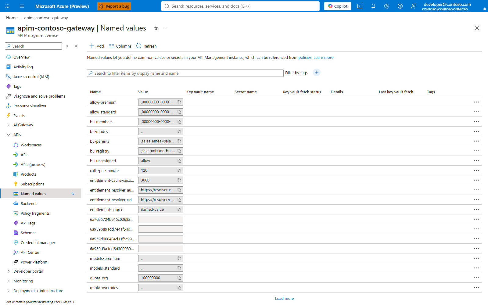
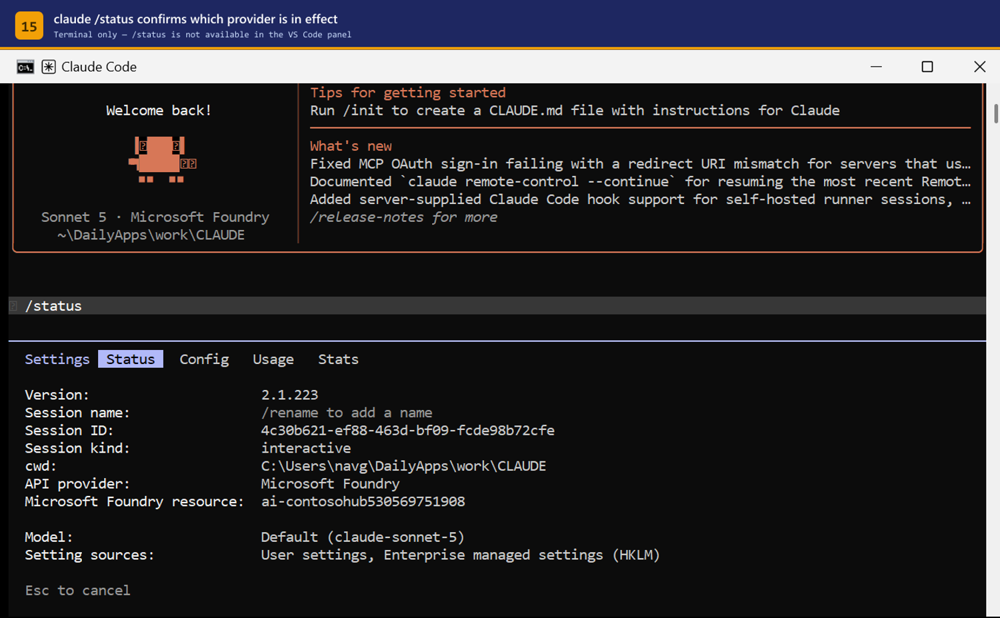
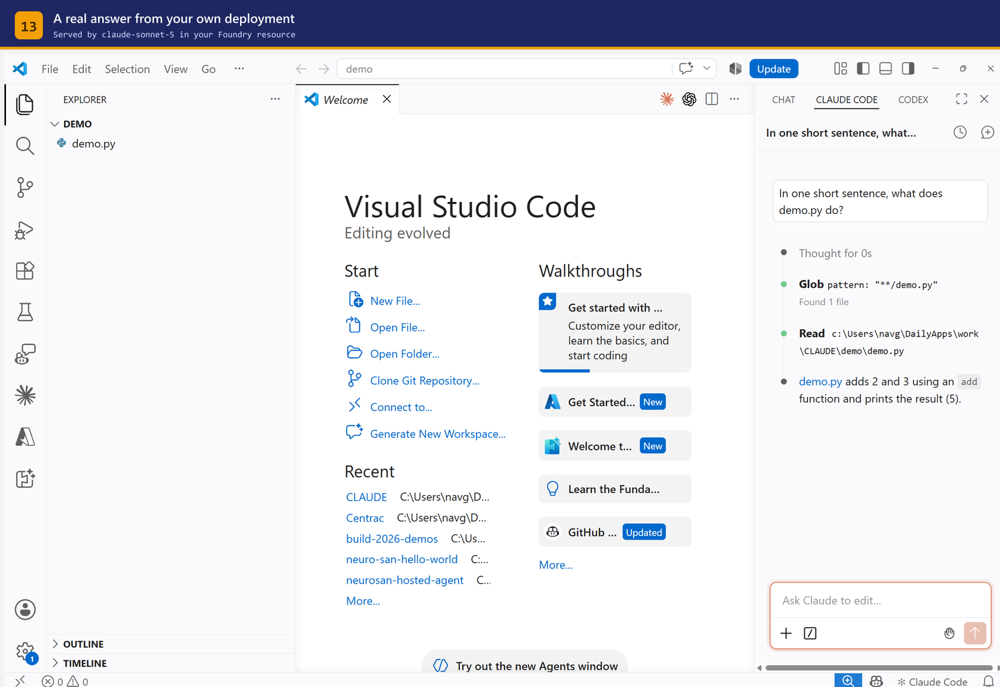

# Onboarding guide — granting, changing, and revoking access

Two audiences, two halves.

| Part | Who | Task |
|------|-----|------|
| **A** | Platform team | add a developer, change their tier, revoke access |
| **B** | The developer | install and configure — hand this half over as-is |

Prerequisites and roles are in the [Setup guide](SETUP.md#2-permissions-and-roles).

---

# Part A — Platform team

## How entitlement actually works

Understanding this makes every operation below obvious.

```
Entra group  ──(Sync-ClaudeAccess.ps1)──▶  APIM named value  ──▶  policy check
claude-code-standard                        allow-standard         oid in list?
claude-code-premium                         allow-premium
```

The policy compares the `oid` claim in the caller's token against the
`allow-standard` and `allow-premium` named values. Those are **flat lists of
object ids**, not group references — the gateway never calls Graph at request
time.

Three consequences:

1. Group membership is not live. **A change takes effect when the sync runs**, not
   when you click Add member.
2. `allow-premium` is evaluated first. Someone in both groups gets premium.
3. Object ids, not UPNs. Renaming a user changes nothing; deleting and recreating
   the account breaks their access.

---

## 1. Add a developer

### Step 1 — find their object id

```bash
az ad user show --id developer@contoso.com --query "{name:displayName, oid:id}" -o table
```

Guests are listed under their **home** address in some tenants and their invited
address in others. If the lookup fails:

```bash
az ad user list --filter "startswith(mail,'developer')" \
  --query "[].{name:displayName, upn:userPrincipalName, mail:mail, oid:id}" -o table
```

For a service principal or CI identity:

```bash
az ad sp show --id <app-id> --query "{name:displayName, oid:id}" -o table
```

### Step 2 — add them to the tier group

Portal: **Entra ID → Groups → `claude-code-standard` → Members → Add members**

CLI:

```bash
az ad group member add --group claude-code-standard --member-id <object-id>
```

### Step 3 — push the change to the gateway

**This is the step people forget.** Until it runs, the developer gets `403`.

```powershell
./scripts/Sync-ClaudeAccess.ps1 -ApimName <apim> -ResourceGroup <rg>
```

Preview first if you want:

```powershell
./scripts/Sync-ClaudeAccess.ps1 -ApimName <apim> -ResourceGroup <rg> -WhatIf
```

The script prints each resolved identity and flags anyone in both groups.

> **Service principals** are not returned by a delegated token without
> `Application.Read.All`. Pass CI identities explicitly:
> `-AdditionalPremiumOids <oid>` or `-AdditionalStandardOids <oid>`.

> **Schedule it** if you want membership changes to apply without a person in the
> loop. A daily Azure Automation runbook or a scheduled pipeline is enough; the
> script is idempotent.

### Step 4 — verify

```bash
az apim nv show -g <rg> --service-name <apim> --named-value-id allow-standard --query value -o tsv
```

Their object id must appear. Then confirm end to end:

```powershell
./scripts/Show-Governance.ps1 -ApimName <apim> -ResourceGroup <rg>
```

### Step 5 — hand over Part B

Send the developer [Part B](#part-b--developer). They need the gateway URL and
the tenant id; nothing else, and no credential.

---

## 2. UI walkthrough — adding a member in the portal

1. **portal.azure.com → Microsoft Entra ID → Groups**
2. Search `claude-code-` — both tier groups appear
3. Open **claude-code-standard**
4. Left nav → **Members** → **+ Add members**
5. Search by name or email, tick the person, **Select**
6. Back on **Members**, confirm they are listed
7. Copy their **Object ID** from **Overview** if you want to verify the sync
8. Run the sync (Step 3 above) — **the portal alone does not grant access**

---

## 3. Common variations

| Situation | What to do |
|-----------|-----------|
| Whole team at once | Loop `az ad group member add`, then sync once |
| Nested group | **Not supported.** The sync reads direct members only. Flatten it, or add each person |
| Contractor, time-boxed | Use an Entra **access package** or PIM-eligible membership so it expires on its own, then schedule the sync |
| CI/CD identity | Service principal in `claude-code-premium`, passed with `-AdditionalPremiumOids` |
| Someone needs it *now* | Add to group, run the sync immediately — the whole path is under a minute |

---

## 4. Change a developer's tier

Two different things get called "changing the tier". Be clear which one you mean.

### 4a. Move one person to a different tier

```bash
az ad group member remove --group claude-code-standard --member-id <oid>
az ad group member add    --group claude-code-premium  --member-id <oid>
```

```powershell
./scripts/Sync-ClaudeAccess.ps1 -ApimName <apim> -ResourceGroup <rg>
```

Verify from the developer's own response headers — the gateway reports the tier
it applied:

```
x-claude-tier: premium
x-ratelimit-remaining-tokens: 79980
```

> Leaving them in **both** groups is not an error and does not double their
> budget. `allow-premium` is checked first, so they get premium. Remove them from
> the standard group anyway, so the lists stay readable.

### 4b. Change what a tier *means*

This changes the budget for everyone in that tier. **No sync needed** — named
values are read on the next request.

| Named value | Meaning | Shipped default |
|-------------|---------|----------------:|
| `tpm-standard` | tokens/minute, standard | 20,000 |
| `tpm-premium` | tokens/minute, premium | 80,000 |
| `quota-standard` | tokens/day, standard | 500,000 |
| `quota-premium` | tokens/day, premium | 5,000,000 |

Portal: **APIM → APIs → Named values → select → edit Value → Save**



CLI:

```bash
az apim nv update -g <rg> --service-name <apim> \
  --named-value-id tpm-standard --value 30000
```

Confirm:

```bash
az apim nv show -g <rg> --service-name <apim> \
  --named-value-id tpm-standard --query value -o tsv
```

> **The daily quota does not reset when you raise it.** `llm-token-limit` tracks
> consumption against the period that is already running. Someone who exhausted
> 500,000 today stays blocked until the period rolls over, even after you set it
> to 5,000,000. Move them to premium instead if they need unblocking now.

### 4c. Add a third tier

Add a named value pair (`tpm-<name>`, `quota-<name>`), an `allow-<name>` list, an
Entra group, and a branch in the policy's tier lookup. The policy structure is in
[ARCHITECTURE.md](ARCHITECTURE.md).

---

## 5. Revoke access

```bash
az ad group member remove --group claude-code-standard --member-id <oid>
```

```powershell
./scripts/Sync-ClaudeAccess.ps1 -ApimName <apim> -ResourceGroup <rg>
```

The next request returns `403`. There is no credential to rotate and nothing to
collect from the developer's machine, because none was ever issued.

**When someone leaves the company** their Entra account is disabled and token
acquisition fails immediately — access is revoked at that moment, ahead of any
sync. Run the sync anyway to keep the allowlists clean.

> **Also check the bypass.** Removing someone from the group does nothing if they
> hold `Cognitive Services User` directly on the Foundry account. See
> [Setup §4.1](SETUP.md#41-close-the-bypass--do-not-skip-this).

---

## 6. Offboarding checklist

- [ ] Removed from both `claude-code-*` groups
- [ ] `Sync-ClaudeAccess.ps1` run, allowlists confirmed clean
- [ ] No direct `Cognitive Services User` on the Foundry account
- [ ] Usage exported from [Monitoring](MONITORING.md) if it is being charged back

---
---

# Part B — Developer

You have been granted access to Claude (Sonnet 5 and Opus 5) running in our own
Microsoft Foundry resource, reached through the gateway.

**There is no API key.** You authenticate as yourself with Microsoft Entra ID,
and your usage is metered against your own budget.

## Your access

| | |
|---|---|
| Tier | **Standard** — 20,000 tokens/minute, 500,000 tokens/day |
| Models | `claude-sonnet-5`, `claude-opus-5` |
| Gateway | `https://<your-gateway>.azure-api.net/claude` |
| Tenant | `<your-tenant-id>` |
| Entitlement | Entra group `claude-code-standard` |

You do **not** need any Azure role on the Foundry resource. The gateway holds
that; you only need to be in the group, which you already are.

## Step 1 — Install the tools

```powershell
# Claude Code CLI
npm install -g @anthropic-ai/claude-code

# VS Code extension
code --install-extension anthropic.claude-code
```

Requires Node.js 18+, VS Code 1.94+, and the Azure CLI.

## Step 2 — Sign in to the right tenant

This matters. If your account is a **guest** in the tenant that hosts the
gateway, a plain `az login` signs you into the wrong directory and the gateway
rejects the token.

```powershell
az login --tenant <your-tenant-id>
```

Confirm you landed in the right place:

```powershell
az account show --query "{tenant:tenantId, user:user.name}" -o table
```

`tenant` must read `<your-tenant-id>`.

## Step 3 — Configure Claude Code

Create `%USERPROFILE%\.claude\settings.json` (macOS/Linux: `~/.claude/settings.json`):

```json
{
  "$schema": "https://json.schemastore.org/claude-code-settings.json",
  "env": {
    "CLAUDE_CODE_USE_FOUNDRY": "1",
    "ANTHROPIC_FOUNDRY_BASE_URL": "https://<your-gateway>.azure-api.net/claude",
    "ANTHROPIC_DEFAULT_OPUS_MODEL": "claude-opus-5",
    "ANTHROPIC_DEFAULT_SONNET_MODEL": "claude-sonnet-5",
    "ANTHROPIC_DEFAULT_HAIKU_MODEL": "claude-sonnet-5"
  },
  "availableModels": ["claude-sonnet-5", "claude-opus-5"],
  "enforceAvailableModels": true
}
```

> Do **not** also set `ANTHROPIC_FOUNDRY_RESOURCE`. It is mutually exclusive with
> `ANTHROPIC_FOUNDRY_BASE_URL` and the session fails with
> `baseURL and resource are mutually exclusive`.

That one file covers both the CLI and the VS Code extension.

## Step 4 — Check it works

```powershell
claude auth status
```

```json
{ "loggedIn": true, "authMethod": "third_party", "apiProvider": "foundry" }
```

Then a real call:

```powershell
claude -p "Reply with exactly: OK"
```

Start an interactive session and run `/status` — it should report **API
provider: Microsoft Foundry**.



## Step 5 — Use it in VS Code

Open a folder, then **Ctrl+Shift+P → `Claude Code: Open in Side Bar`**.

The panel opens straight into a usable prompt. **There is no sign-in step** —
your Entra credential is already resolved.



If the extension asks you to sign in to Anthropic, it has not picked up the
settings file. Run **Developer: Reload Window**, and if it persists add the same
variables under `claudeCode.environmentVariables` in **Preferences: Open User
Settings (JSON)**.

## What to expect

**Your token budget.** Every response carries your remaining budget:

```
x-ratelimit-remaining-tokens: 19980
x-quota-remaining-today: 499980
```

**If you exceed the per-minute limit** you get `HTTP 429` with a `Retry-After`
header. Claude Code backs off and retries on its own — you may just notice a
pause.

**If you exhaust the daily quota** you get `HTTP 403` until the next period. Ask
the platform team if you need the premium tier (80,000 tokens/minute,
5,000,000/day).

**Your usage is attributed to you** by name in the platform team's chargeback
reporting. Nothing is anonymous — but nothing is inspected either; only token
counts are recorded, not prompts.

## Troubleshooting

| Symptom | Cause → Fix |
|---|---|
| `401` / "Entra ID token required" | Signed into the wrong tenant. Re-run `az login --tenant <your-tenant-id>`. |
| `403` "Not entitled to Claude Code" | Not in the group, or membership not synced yet. Ping the platform team. |
| `429` | Per-minute budget hit. It resets within a minute; Claude Code retries automatically. |
| `baseURL and resource are mutually exclusive` | Remove `ANTHROPIC_FOUNDRY_RESOURCE` from your settings. |
| `DeploymentNotFound` | A model alias points at something we do not host. Use only `claude-sonnet-5` / `claude-opus-5`. |
| Extension prompts for Anthropic sign-in | Settings not picked up — reload the window. |
| Windows: a script returns a WSL error instead of a token | Inside Git Bash use `az.cmd`, not `az`. |

Anything else → [Debug guide](DEBUGGING.md), or the platform team.
