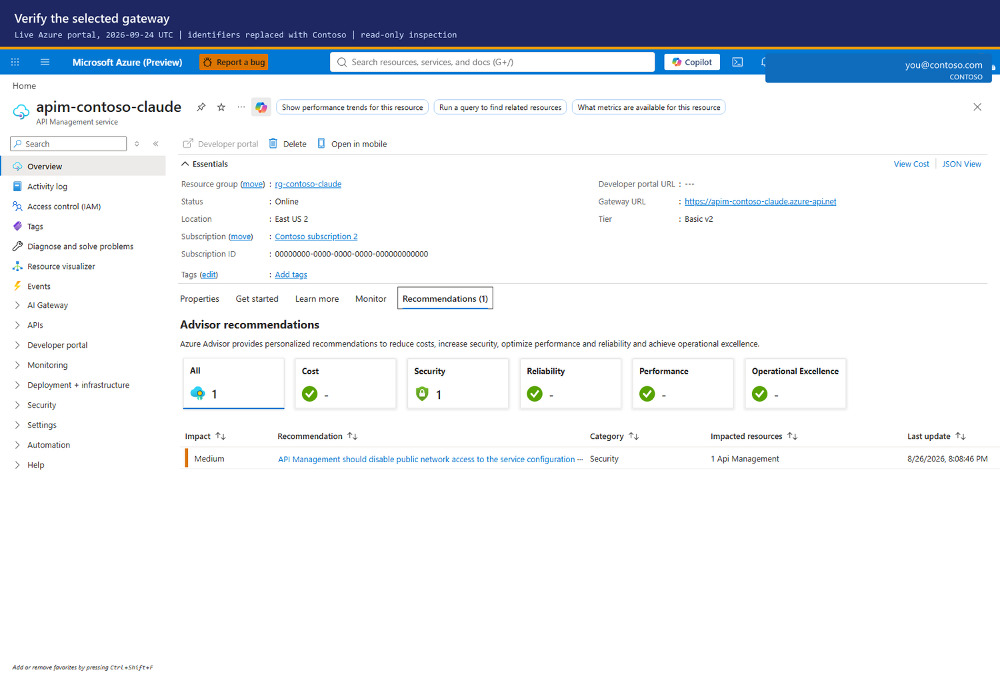

# Operate the gateway

For platform administrators after [Setup](SETUP.md). Start with
[Architecture](ARCHITECTURE.md) if you need the request path and component map.
This guide separates resource configuration, directory membership and consumed
allowances: backing up one does not back up all three.

## Prerequisites and roles

| Task | Required access |
|---|---|
| Read configuration and health | Reader on the gateway and its supporting resources; telemetry query access |
| Write limits or policy | API Management Service Contributor on the gateway |
| Add/remove people | Owner of the relevant Entra groups or Groups Administrator; gateway write access to publish |
| Publish queries or workbooks | Write access to workspace saved searches and workbooks, normally Log Analytics Contributor and Workbook Contributor |
| Remove a direct Foundry role | Role-assignment delete rights at the scope where it was granted |
| Delete resources | Delete rights on each target; group ownership for directory groups |

Use Azure CLI and PowerShell 5.1 or 7. Run examples from the repository root.
Use PowerShell syntax in `powershell` blocks and a POSIX shell in `bash` blocks;
the continuation characters are not interchangeable. Examples use Contoso
values: replace them rather than sending requests to an example deployment.

## 1. Select the gateway and workspace

Do not copy another deployment's resource names or choose the first search
result. The examples use placeholders; the live objects come from discovery.
For an interactive deployment, use the installer's numbered discovery lists.
For an existing gateway, enumerate the choices before setting the variables:

```powershell
az account list --query "[].{subscription:name, id:id, tenant:tenantId, current:isDefault}" -o table
az account show --query "{subscription:id, tenant:tenantId}" -o table
az group list --query "[].{name:name, location:location}" -o table
az apim list --query "[].{name:name, group:resourceGroup, region:location, tier:sku.name}" -o table
```

Prefer the target returned by `scripts/Get-ClaudeGatewayTarget.ps1` when it
matches the intended deployment. Otherwise choose from the actual list and
pass explicit `-ResourceGroup` / `-ApimName`; never replace a missing recorded
target with a deployment-specific default. Subscription-wide Reader visibility
can differ from access to one known resource.

1. Read `onboarding/claude-gateway.json` from your deployment, not another team's
   copy. If it is missing, get the values from the resource owner.
2. Sign in and explicitly select the subscription before any write:

   ```powershell
   az login --tenant '<tenant-id>'
   az account set --subscription '<subscription-id>'
   $rg = 'rg-contoso-claude'
   $apim = 'apim-contoso-claude'
   $apimId = az apim show -g $rg -n $apim --query id -o tsv
   az account show --query "{subscription:id, tenant:tenantId}" -o table
   ```

   **Portal:** Directories + subscriptions > select the directory/subscription;
   Resource groups > your gateway group > API Management > Overview. Copy
   the resource group, name and resource ID. Foundry may be in a different group.

   On the live **Overview > Essentials** panel, the fields are **Resource group**,
   **Status**, **Location**, **Subscription**, **Subscription ID**, **Gateway URL**
   and **Tier**. Check the selected resource and tier before continuing; `Online`
   is a resource status, not proof of an inference request.

   

3. Discover the two telemetry routes rather than choosing the first workspace:

   ```powershell
   ./scripts/Get-ClaudeTelemetry.ps1 -ResourceGroup $rg -ApimName $apim
   az monitor diagnostic-settings list --resource $apimId -o json
   ```

   **Portal:** APIM > APIs > Claude API > Settings > Diagnostics identifies the
   Application Insights logger. APIM > Monitoring > Diagnostic settings shows
   the workspace for `GatewayLlmLogs`. Open that Log Analytics workspace >
   Properties for its name and workspace ID. These are different from the
   Application Insights AppId and ARM resource ID.

Commands using `Get-ClaudeGatewayTarget.ps1` use `CLAUDE_RG`/`CLAUDE_APIM`
before the generated onboarding file; a recorded target counts as already given.
The budget, business-unit, model, backup and Turnstile scripts ask for missing
targets with numbered choices, their sources, a recommendation when justified,
and command/portal lookup instructions. Publishers recommend the workspace linked
to the gateway's Application Insights, not the first workspace in its group.
Enter takes the recommendation. In a pipeline, CI or `pwsh -NonInteractive`,
only a certain choice is accepted; ambiguity names the candidates and the
parameter to pass. Supply explicit parameters for scheduled automation.

## 2. Check health and headroom

```powershell
./scripts/Test-ClaudeHealth.ps1 -ResourceGroup $rg -ApimName $apim
./scripts/Measure-ClaudeCeiling.ps1 -ResourceGroup $rg -ApimName $apim
./scripts/Get-ClaudeBypass.ps1 -ResourceGroup $rg -ApimName $apim
```

**Portal:** APIM > Overview (tier), APIs (policy), Named values (limits and
membership), Monitoring > Diagnostic settings; Foundry > Access control (IAM)
(direct and inherited assignments). For telemetry use [Monitoring](MONITORING.md).
There is no single portal health button covering these checks. Test a real
client after inspecting the configuration; a green control-plane blade is not
an inference test.

**Verify:** each script exits zero. A named-value list at 80% fails headroom;
plan the [projection migration](SCALE.md#the-move-itself-step-by-step) before
it fills. Do not silence the failure or truncate a list. For `401`, `403`,
`429` or `503`, start with [Troubleshooting](TROUBLESHOOTING.md), then
[Debugging](DEBUGGING.md) if the failure layer is unknown.

## 3. Choose the day-to-day operation

| Task | Script, after selecting the target | Manual or portal path |
|---|---|---|
| Add Alice | `scripts/Set-ClaudeDeveloper.ps1 -User alice@contoso.com -Tier standard -Sync` | Entra > Groups > tier > Members; then publish membership as in [Onboarding](ONBOARDING.md) |
| Remove Alice | `scripts/Set-ClaudeDeveloper.ps1 -User alice@contoso.com -Remove -Sync` | Remove every direct/nested path through tier, team and unit groups, then sync |
| Inspect personal limits | `scripts/Get-ClaudeBudget.ps1` | APIM > Named values; [Budgets](BUDGETS.md) explains overrides |
| Change a tier | `scripts/Set-ClaudeTier.ps1 -Tier standard -DailyQuota 750000` | APIM > Named values; or the Turnstile authority, if enabled |
| Create a cost centre | `scripts/Set-ClaudeBusinessUnit.ps1 -Id sales -Group claude-bu-sales -MonthlyBudgetUsd 20000` | Entra > Groups, then [Business units](BUSINESS-UNITS.md) or Turnstile > Gateway governance |
| Inspect unit spend | `scripts/Get-ClaudeBusinessUnit.ps1` | Chargeback workbook; [FinOps](FINOPS.md) |
| Manage units interactively | `scripts/Manage-ClaudeBusinessUnits.ps1` | Turnstile > Gateway governance / Budgets if connected |
| Use AUM (Azure Usage Management) | [Terminal console and commands](CLI-FINOPS.md) | Turnstile's web views, or the corresponding Azure blades for direct mode; terminal Members remain read-only |
| Open a workbook | `scripts/Publish-ClaudeWorkbook.ps1 -List` | Azure Monitor > Workbooks > saved workbook |
| Add a model | `scripts/Add-ClaudeModel.ps1 -List` to inspect first | Foundry > Models + endpoints, then APIM > Named values; [Models](MODELS.md) |
| Govern plugins | `scripts/New-ClaudeCodePolicy.ps1` with the selected profile | Intune / Jamf / GPO or local policy files; [Plugins](PLUGINS.md) |

**Terminology:** a *tier* controls models and personal token limits (`standard`
or `premium`). A *business unit* owns a monthly allocation. A *team* is a unit
with a parent. A developer's tier and unit are independent; Entra groups supply
membership. An *allowance* is a token quota, not money already reconciled to an
invoice. See [Budgets](BUDGETS.md) for the enforcement limits.

## 4. Back up, change, restore, verify

1. Capture configuration before a change:

   ```powershell
   ./scripts/Backup-ClaudeGateway.ps1 -ResourceGroup $rg -ApimName $apim -Path .\backups\before-change.json
   ```

   **Portal/manual:** APIM > Named values and the Claude API policy editor;
   Log Analytics > Functions; Azure Monitor > Workbooks > Edit > Advanced editor.
   Save each definition to controlled storage. No Azure portal export is an
   equivalent complete backup of this accelerator.

2. Review a restore without applying it:

   ```powershell
   ./scripts/Restore-ClaudeGateway.ps1 -Path .\backups\before-change.json
   ```

   **Portal/manual:** compare each saved definition with its live blade. Restore
   only after checking the target subscription, gateway, workspace and current
   Entra membership. `-Force` is for an intentional different target, not a
   routine way past a warning.

3. Apply only the approved restore:

   ```powershell
   ./scripts/Restore-ClaudeGateway.ps1 -Path .\backups\before-change.json -Apply
   ```

   **Portal/manual:** replace the reviewed values, policy, functions and workbook
   definitions in their respective editors, then save. Do not overwrite current
   Turnstile-authored governance without coordinating its apply job.

4. Reconcile entitlement from Entra using the active store's writer, check
   `Compare-ClaudeEntitlement.ps1` while still on named values, and repeat step 2's
   health/bypass checks and a developer request.

The backup omits **secrets**, **telemetry**, **Entra groups**, **Cosmos records**
and **consumed quota counters**. It can contain personal object IDs and live
configuration; store it privately. A restore can regrant a leaver through an old
allowlist. Never restore stale membership as proof of authorisation. The
[migration guide](MIGRATION.md#4-backing-the-gateway-up-and-putting-it-back)
also covers client conversation backups and cross-instance limitations.

## 5. Inspect cost and retire only what you own

```powershell
./scripts/Get-ClaudeBom.ps1 -ResourceGroup $rg -ApimName $apim -WithPrices
```

**Portal:** Resource group > Resources, then each resource's Pricing tier;
Cost Management > Cost analysis for the actual billed cost. The script reads
regional list prices from `prices.azure.com`, separates created/reused/configured
resources, and excludes Claude tokens. Add optional projection and Turnstile
resources; do not treat the default footprint as an enterprise total.

Before deleting: export required finance records, retain backups per policy,
stop schedules, record role assignments, and confirm every resource's owner.
If APIM or the resource group was reused, **do not delete the group or service**.
Remove only this API's reviewed configuration and owned resources.

Only for a dedicated, disposable deployment:

```powershell
az group delete -n '<dedicated-gateway-resource-group>' --yes --no-wait
# After deletion finishes, and only if the name must be released:
az apim deletedservice purge --service-name '<deleted-apim-name>' --location '<region>'
# Only groups created for this deployment, with no remaining consumers:
az ad group delete --group '<owned-standard-group-id>'
az ad group delete --group '<owned-premium-group-id>'
```

**Portal:** Resource group > Delete resource group, or select individual owned
resources > Delete; APIM > Deleted services > Purge only after reviewing recovery
requirements; Entra > Groups > each owned group > Delete. A soft-deleted APIM
keeps its globally unique name until purged. Purge is irreversible.

**Verify:** deployment resources and schedules are absent, shared resources
remain, the old gateway address no longer serves, and Cost analysis shows no
unexpected continuing usage after billing data arrives.

## Next steps

- [Reference](REFERENCE.md) — repository map and contributor checks.
- [Releasing](RELEASING.md) — versioning and release validation.
- [Authentication](AUTHENTICATION.md) and [Network](NETWORK.md) — security reviews.

## Live verification record and limits

On **2026-09-24 UTC**, the review discovered available subscriptions and Claude
gateways rather than using a saved deployment name, then selected the default-
install gateway from those options. The actual gateway logger resolved its
Application Insights resource and workspace. The following live **reads**
completed using explicit discovered targets:

| Flow | Operation | Verification |
|---|---|---|
| Tier reference | `Set-ClaudeTier.ps1 -List` | Returned the deployed tier configuration |
| Personal budget inspection | `Get-ClaudeBudget.ps1 -AsJson` | Parsed the organisation/developers shape and returned developer records |
| Unit spend inspection | `Get-ClaudeBusinessUnit.ps1 -AsJson` | Returned unit records with `ledger_read=true` |
| Named-value capacity | `Measure-ClaudeCeiling.ps1` | Completed its live headroom check |
| Saved-function discovery | `Publish-ClaudeQueries.ps1 -List` | Found `ClaudeChargeback`, `ClaudeCodeDaily` and `ClaudeCost` |
| Workbook discovery | `Publish-ClaudeWorkbook.ps1 -List` | Returned the published workbook links |

The Overview image above and the [Foundry IAM image](SETUP.md#21-you--the-person-running-the-deployment)
are live portal captures with identifiers replaced, not fabricated portal pages.
They prove those read-only blades rendered; they do **not** prove a role was
granted, a budget changed, an end-to-end client succeeded or an invoice reconciled.

**Portal verification stopped when an authentication surface was detected while
opening Named values.** No sign-in was attempted. Unpopulated/loading captures
were rejected, and no sign-in image is presented as an operation. A fresh
owner-authorised session is needed before completing the remaining portal
walkthroughs and screenshots.

Write/restore/deletion, role/group lifecycle, full client setup, private
deployment and release procedures were **not rerun by this documentation
review**. Existing dated evidence is linked in their respective guides; this
limited read verification must not be used as a blanket live-acceptance receipt.
