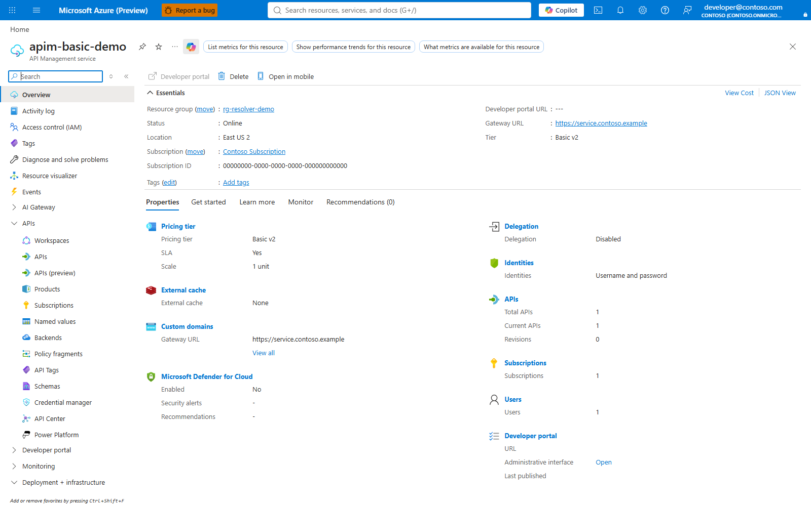
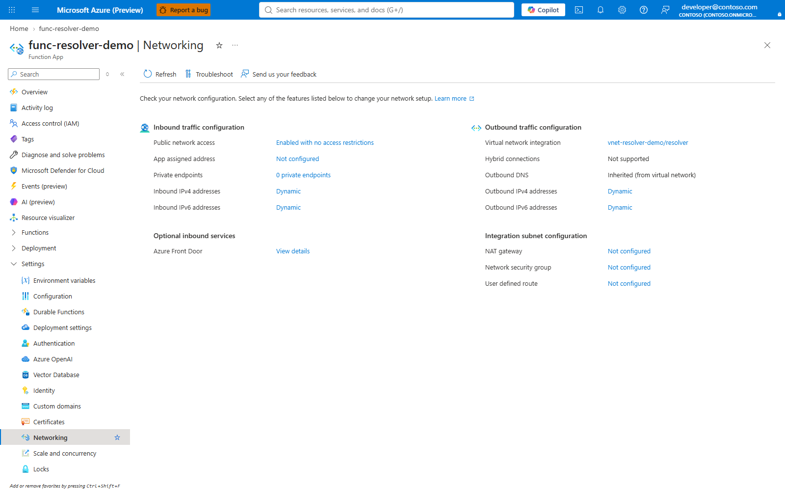
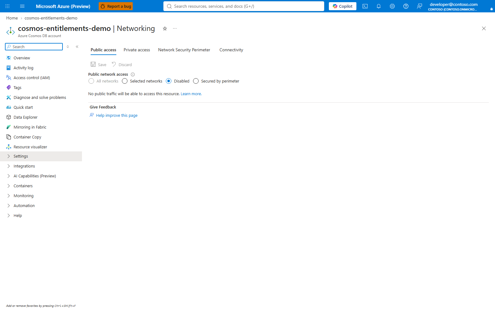
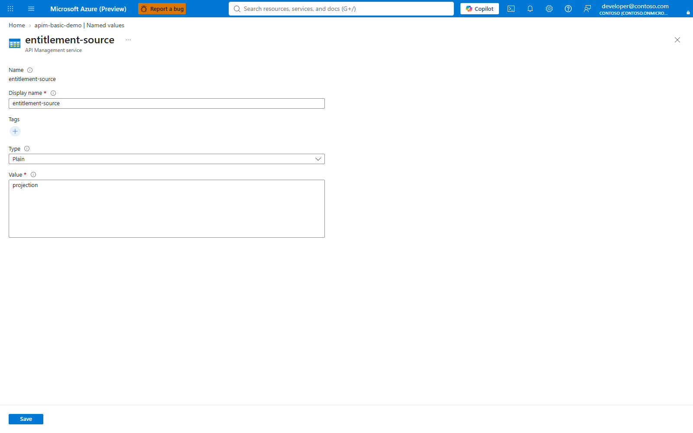
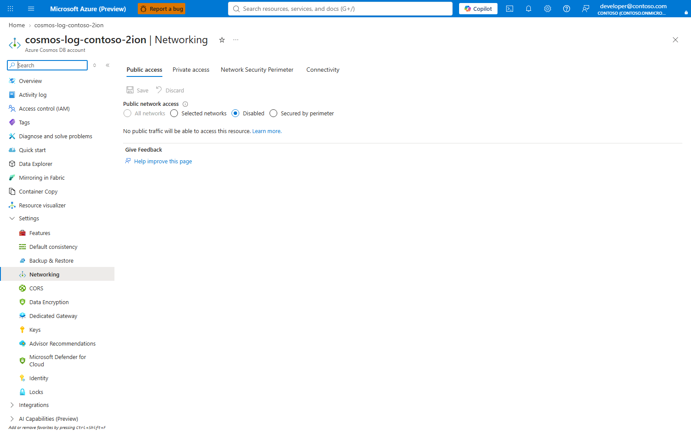
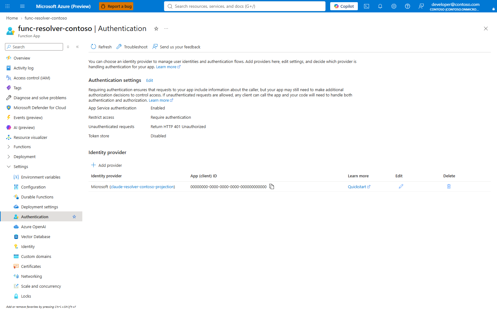
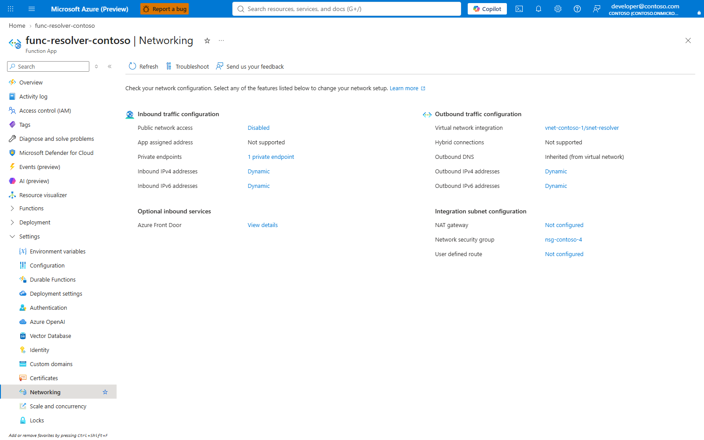
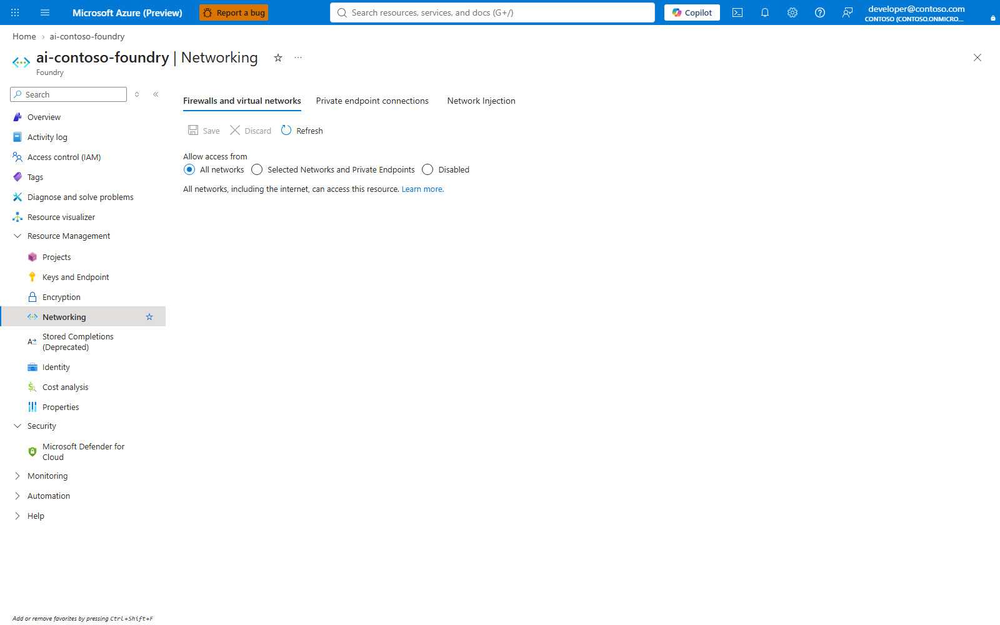

# Deploy the entitlement projection with private networking

The gateway decides each developer's tier from two named values. A named value
holds 4,096 characters, which is about 93 to 110 object ids, so beyond roughly a
hundred developers entitlement has to move to the **projection**: one Cosmos DB
record per developer, read through a small resolver Function when the gateway's
cache misses.

This article deploys private endpoints for Cosmos DB and resolver storage. On
Standard v2 and Premium v2, it also makes the resolver inbound path private. On
Basic v2, the resolver inbound path is public because Basic v2 has no outbound
VNet integration; the resolver is still Microsoft Entra-authenticated and allows
only the gateway managed identity. APIM ingress remains public and authenticated;
resolver telemetry uses public ingestion with Entra authentication. Making the
Foundry account private is a separate step below, not an effect of the
projection templates. It then points the gateway at the resolver
without changing anyone's access, ready for the
[migration runbook](SCALE.md#the-move-itself-step-by-step).

For private gateway ingress, Application Gateway WAF, corporate DNS/routing
and the placement of the other services, see the
[enterprise network design](NETWORK-ENTERPRISE.md). A private resolver alone
does not restrict the gateway's public ingress.

The original steps, results and errors were measured on 2026-09-23 against an
API Management Premium v2 gateway in Canada Central. P19 freshness and admission
changes, and the 500,000-record measurement, are dated 2026-09-24 below. The Cosmos DB account was
in East US 2, reached through a private endpoint in the gateway's VNet.

## Architecture

See [Architecture](ARCHITECTURE.md) for the full gateway; this is the optional
entitlement read/write path, not the inference or reporting topology.

```text
Developer ──Entra token──▶ API Management (public gateway)
                              │  managed identity token, audience api://<resolver-app>
                              ▼
                        Resolver (Flex Consumption)   ◀── private endpoint, or public+Entra on Basic v2
                              │  managed identity, read only, one container
                              ▼
                        Cosmos DB (serverless)        ◀── private endpoint only
                              ▲
Sync job in the VNet ─────────┘  its own identity, write only, one container
```

**Portal:** APIM > Network > Outbound VNet integration > select the approved
integration subnet. Verify the resulting VNet/subnet and routing/DNS with the
network owner. This is outbound integration, not a private client ingress.

| Component | Authenticates with | Reachable from | Key authentication |
|---|---|---|---|
| Cosmos DB account | Entra only | Private endpoint | Off (`disableLocalAuth`) |
| Resolver Function | Built-in authentication: the gateway's identity only | Private endpoint on Standard/Premium v2; public endpoint on Basic v2 | Basic publishing off, FTP off |
| Resolver storage | Entra only | Private endpoints (blob, queue, table) | Off (`allowSharedKeyAccess: false`) |
| Application Insights | Entra only | Public ingestion, identity required | Off (`DisableLocalAuth`) |
| Foundry account | The gateway's identity | Private endpoint | Unchanged by this article |

The resolver only reads, and it can read only the `entitlement` container. The
sync has a different identity that can only write that container. A compromised
resolver therefore cannot change who is entitled.

## Prerequisites

| Requirement | Detail |
|---|---|
| Gateway tier | **Standard v2 or Premium v2** for the private resolver profile. **Basic v2** uses `inboundAccess=public` with App Service Authentication and exact gateway managed-identity allow lists; Cosmos remains private. |
| Roles | Owner, or Contributor plus User Access Administrator, on deployment resources; network join/write rights on the supplied VNet/subnets/DNS; application registration/assignment rights in Entra ID. Azure subscription Owner is not a directory role. |
| Resource providers | Registered: `Microsoft.App`, `Microsoft.DocumentDB`, `Microsoft.Web`, `Microsoft.ContainerInstance`, `Microsoft.Network`, `Microsoft.Storage`, `Microsoft.OperationalInsights`, `Microsoft.Insights` and `Microsoft.Authorization`. These cover the resources and delegations in `infra/projection.bicep:95`, `infra/projection-network.bicep:67` and `infra/resolver.bicep:137`. |
| Region capacity | Cosmos regional capacity cannot be checked in advance or reserved by preflight. Measured: Canada Central and Canada East both refused with `ServiceUnavailable ... high demand ... To request region access for your subscription, please follow this link https://aka.ms/cosmosdbquota`. A private endpoint can point at an account in another region, so a Cosmos DB account elsewhere still stays private in the VNet. |
| Subnets | See the next table. In most enterprises the network team creates them and hands over the resource IDs. |
| Tools | PowerShell **7 or later** for `Deploy-ClaudeProjection.ps1` and `Sync-ClaudeProjection.ps1`; Azure CLI/Bicep, Node/npm and a ZIP-capable `tar`. Bicep `build-params` with `using none` evaluates the existing storage name locally. Shared Graph membership callers that manage named values still support Windows PowerShell 5.1. |
| Rollout approval | P86 admits automated switching only after destination-bound Cosmos evidence from the in-VNet runner and a pinned no-override Container Apps job definition both pass. Owner approval is still required before merge. |

| Subnet | Size | Delegation | Notes |
|---|---|---|---|
| Gateway integration | /27 minimum, /24 recommended | `Microsoft.Web/serverFarms` | Needs a network security group. Only for Standard v2 and Premium v2. |
| Private endpoints | Reserve capacity for five projection endpoints plus any Foundry endpoint | None | Cosmos, resolver and resolver storage ×3; Foundry is separate |
| Resolver integration | /27 minimum (/26 used) | `Microsoft.App/environments` | Flex Consumption's own delegation, not `Microsoft.Web/serverFarms`. No private endpoints in it, and no underscore in its name. [Learn: subnet sizing and requirements](https://learn.microsoft.com/azure/azure-functions/flex-consumption-how-to#subnet-sizing-and-requirements) |
| Runner (optional) | /27 | `Microsoft.ContainerInstance/containerGroups` | The container that writes, compares and runs the read-only admission checker from inside the network. |
| Renewal job | /27 minimum | `Microsoft.App/environments` | Internal workload-profiles Container Apps environment, separate from the resolver subnet. `infra/projection-network.bicep` creates `renewal` at `10.10.3.64/27` in the default `10.10.0.0/16` plan and outputs `renewalSubnetId`; with an existing VNet, pass `renewalSubnetId`. |


### Scheduled renewal job and admission (P86, P94)

The renewal job deploys after the projection, in the same resource group, with one command ([ADR-0049](adr/0049-projection-renewal-deployment.md)):

```powershell
pwsh -NoProfile -File .\scripts\Deploy-ClaudeProjectionRenewal.ps1 `
  -ResourceGroup <rg> -ApimName <apim> -NamePrefix <prefix> -AlertEmail <alert-email>
```

It checks every value that reaches an `az` argument before the first Azure call, reads the projection and network deployment outputs, then runs three phases, each safe to rerun:

1. `infra/projection-registry.bicep`: an ACR registry, the job's user-assigned managed identity and its AcrPull grant. ACR Basic is the default for standing cost and is reached over the public ACR endpoint with Entra authentication; ACR Premium (`-AcrSku Premium`) is required for a private registry endpoint.
2. `az acr build` from the sync package, which holds `sync/` and `resolver/src/entitlement.mjs` at their repository paths, then the image digest read back with `az acr manifest show-metadata`. ACR task runs are paused for subscriptions on Azure free credits ([U114](UNKNOWNS.md#p94-research-before-implementation)); there, `docker build -f sync/Dockerfile` and `docker push` from the package directory replace the build, and `-ImageDigest <sha256 digest>` skips it.
3. `infra/projection-renewal.bicep`: an internal Container Apps workload-profiles environment on the renewal subnet (`10.10.3.64/27` in the default plan, delegated to `Microsoft.App/environments`), a scheduled job every 30 minutes pinned to the digest, Cosmos SQL data-plane write access on `claude/entitlement` only, a custom role on the gateway whose only action is `Microsoft.ApiManagement/service/namedValues/read`, a diagnostic setting that sends the environment's logs to the gateway's Log Analytics workspace, an action group with the email receivers, and three alert rules.

The job runs the image's entry point with `--graph` and no command or args override. Its environment carries `AZURE_CLIENT_ID` (the identity has no system-assigned counterpart, [U112](UNKNOWNS.md#p94-research-before-implementation)), the tier group object ids (`none` for no premium tier) and the gateway id. Every run reads `bu-registry` and `bu-parents` through ARM and orders the units as `Sort-ClaudeBuByDepth` does, so a unit added later reaches the projection on the next run. A unit whose group Graph no longer finds is an empty unit with a warning, as `Get-GroupMemberOids` in `scripts/ClaudeGraphMembership.ps1` treats it; a tier group Graph does not find stops the run. One group for both tiers is refused by the deploy script, the guide and admission, because premium membership takes precedence. Its last console line is `projection-renewal-succeeded` or `projection-renewal-failed` with the failed stage (`config`, `business-units`, `graph`, `cosmos-read`, `cosmos-write`, `status`, `expired`, `plan` or `lease`). The alert rules read `ContainerAppConsoleLogs` for this job only and return rows only when unhealthy ([U107-U110](UNKNOWNS.md#p94-research-before-implementation)): no success in 45 minutes, the newest success leaving less than 60 minutes before the oldest record expires, and any failed run. The job and environment are named `caj-renew-` and `cae-renew-` followed by a hash of the resource group and prefix, because Container Apps names are at most 32 characters ([U118](UNKNOWNS.md#p94-research-before-implementation)); both carry the tag `claude-projection-prefix`.

P94 keeps P86's names for the registry, the identity, the action group and two alert rules, which a rerun updates in place. A resource group that still holds P86's job (`caj-projection-renewal-<prefix>`), environment (`cae-projection-<prefix>`) or `sqr-projection-<prefix>-graph-read-failed` alert, each matched by name and resource type, is refused before any write: the new job would run beside them, P86's job cannot run (its image lacks `resolver/src/entitlement.mjs` and it sets no `AZURE_CLIENT_ID`), and an environment's subnet is given when the environment is created ([custom virtual networks](https://learn.microsoft.com/azure/container-apps/custom-virtual-networks), updated 2026-05-19, read 2026-10-04). The refusal lists the delete commands for the ones present, the job before its environment ([ADR-0049](adr/0049-projection-renewal-deployment.md)):

```bash
az resource delete -g <rg> -n caj-projection-renewal-<prefix> --resource-type Microsoft.App/jobs
az resource delete -g <rg> -n cae-projection-<prefix> --resource-type Microsoft.App/managedEnvironments
az resource delete -g <rg> -n sqr-projection-<prefix>-graph-read-failed --resource-type Microsoft.Insights/scheduledQueryRules
```

The script prints the tenant administrator's Graph grant with the identity's principal id and writes a receipt with no secrets to `onboarding/projection-renewal-<prefix>.json` (ignored by git): the job, image digest, action group, runner, Cosmos account, tenant, gateway, tier group ids and the identity's client and principal ids, with the source commit. P95's switch reads it. Each alert address receives a confirmation email from Azure Monitor and receives no alerts until it confirms ([U116](UNKNOWNS.md#p94-research-before-implementation)). `-WhatIf` reads the deployment outputs and writes nothing. [Azure CLI commands](AZ-COMMANDS.md#10-optional-cosmos-projection) give the same deployment as plain commands.

Standing cost at list price (Azure Retail Prices API, East US 2, read 2026-10-04): ACR Basic $0.1666 a day, about $5.07 a 730-hour month; three log search alert rules at a 5-minute frequency, $1.50 a month each. Each job run bills $0.000024 per vCPU-second and $0.000003 per GiB-second at 1 vCPU and 2 GiB, $0.00003 a second, before the Container Apps monthly free grant; at 1,460 runs a month a 60-second run would cost about $2.63 a month. Run duration depends on the directory and is not measured. Cosmos write cost by member count is in [ADR-0045](adr/0045-scheduled-projection-renewal.md#cost-note).

A tenant administrator grants the job identity Graph membership read once:

```powershell
./scripts/Grant-ClaudeProjectionRenewalGraphAccess.ps1 -PrincipalId <managed-identity-principal-id>
```

Plain `az rest` equivalent:

```powershell
$graphAppId = '00000003-0000-0000-c000-000000000000'
$graph = az ad sp show --id $graphAppId --query "{id:id, role:appRoles[?value=='GroupMember.Read.All'].id | [0]}" -o json | ConvertFrom-Json
$body = @{ principalId = '<managed-identity-principal-id>'; resourceId = $graph.id; appRoleId = $graph.role } | ConvertTo-Json
$file = New-TemporaryFile; Set-Content -Path $file -Value $body -Encoding utf8
az rest --method post --url "https://graph.microsoft.com/v1.0/servicePrincipals/<managed-identity-principal-id>/appRoleAssignments" --headers 'Content-Type=application/json' --body "@$file"
```

Outbound firewall or forced-tunnel rules must allow `login.microsoftonline.com`, `graph.microsoft.com`, `management.azure.com` (the job reads `bu-registry` and `bu-parents`), the ACR login server and data endpoint, and the Cosmos private endpoint through `privatelink.documents.azure.com`. The job writes status records into `claude/entitlement` with partition key `projection-status::<tenantId>`, `type=projection-reconciliation-status` and `ttl=21600`; resolver point reads by developer object id cannot return them.

Deployment order: deploy the projection (`scripts/Deploy-ClaudeProjection.ps1`), then the renewal job (`scripts/Deploy-ClaudeProjectionRenewal.ps1`); the tenant admin grants `GroupMember.Read.All`; runs succeed; evidence accumulates for about 60-90 minutes on the 30-minute schedule (three successful runs); the [switch](#switch-to-the-projection-p95); rollback by refreshing and comparing named values, then setting `entitlement-source` back to `named-value`. Offline tests prove the deployment order, the job's runs against stand-in Graph, ARM and Cosmos, admission over their evidence and the switch ([P94 status](status/P94.md#p94-the-p86-renewal-job-deploys-and-renews-2026-10-04), [P95 status](status/P95.md#p95-the-projection-switch-over-runs-end-to-end-2026-10-05)); no live tenant has run the job, and the live Graph grant is [U17](UNKNOWNS.md).

Admission runs fixed repository code through `scripts/ClaudeRunner.ps1`, reads Cosmos status history and computes the oldest expiry from the live entitlement records the resolver can serve, then separately reads the ARM job definition and the action group. It applies the resolver's own validation to every unexpired entitlement record before counting it. Invalid live records refuse admission with a count and up to three hashed object-id samples. It requires at least 60 minutes of live-record expiry margin, two generation advances within two hours, newest success within 45 minutes, matching status/member counts, no unexpired entitlement records on an older generation, the tested image digest, no command/args override, a client id, tier group object ids (two different groups, or `none` for premium) and an API Management gateway id in the job's settings, and an enabled action group with an email receiver whose status is `Enabled` ([U119](UNKNOWNS.md#p95-research-before-implementation)). Only status records the job wrote under its current settings count, and the switch requires those settings to name the gateway being switched, the compared tier groups and the receipt's identity ([ADR-0050](adr/0050-projection-switch-function.md)). The live-record aggregate is a one-time cross-partition scan during switching, acceptable at 500,000 records; it is not on the request path. Refusals name the reason and remedy.

### Switch to the projection (P95)

`scripts/Deploy-ClaudeProjection.ps1 -FlipAfterCleanCompare` reads the renewal receipt (`onboarding/projection-renewal-<prefix>.json`, or `-RenewalReceiptPath`) and runs `Invoke-ClaudeProjectionSwitch` (`scripts/ClaudeProjectionSwitch.ps1`, [ADR-0050](adr/0050-projection-switch-function.md)). It deploys, publishes and applies nothing:

```powershell
pwsh -NoProfile -File .\scripts\Deploy-ClaudeProjection.ps1 `
  -ResourceGroup <rg> -ApimName <apim> -NamePrefix <prefix> -FlipAfterCleanCompare -WhatIf
```

1. `scripts/Compare-ClaudeEntitlement.ps1 -FailOnDrift` compares the gateway's lists with Entra and exports the gateway's decisions.
2. The runner unpacks the sync package and runs `apply-projection.mjs --compare` against those decisions, read-only.
3. Admission reads the action group, the job definition and its settings, and the Cosmos evidence, as above.
4. The entitlement named values (`entitlement-source`, `allow-standard`, `allow-premium`, `bu-members`) are written to `onboarding/projection-switch-<apim>-<time>.json`.
5. `entitlement-source` is set to `projection`, the one write.

A refusal at any step leaves `entitlement-source` unchanged and writes no backup; `-WhatIf` runs steps 1-3 and stops. The guided Entitlement step runs the same function with the receipt whose `gatewayResourceId` is the gateway, and its own snapshot as the backup (`scripts/flow/Entitlement.ps1`). The output names the backup and the rollback: `entitlement-source` back to `named-value` after `scripts/Sync-ClaudeAccess.ps1` refreshes the lists and `scripts/Compare-ClaudeEntitlement.ps1 -FailOnDrift` checks them.

#### Owner-attended live run

No live tenant has run these steps. Each row states what the step shows.

| Step | Command or place | Shows |
|---|---|---|
| 1. Projection | `scripts/Deploy-ClaudeProjection.ps1` without `-FlipAfterCleanCompare` ([one-command deployment](#one-command-deployment)) | Cosmos, the network with its renewal subnet, the resolver, the population and a clean compare |
| 2. Renewal job | `scripts/Deploy-ClaudeProjectionRenewal.ps1 -AlertEmail <address>` ([renewal job](#scheduled-renewal-job-and-admission-p86-p94)) | The registry, image digest, job and alerts deploy; whether the alert queries pass deployment-time validation ([U109](UNKNOWNS.md#p94-research-before-implementation)) and whether AcrPull was in effect for the job ([U113](UNKNOWNS.md#p94-research-before-implementation)) |
| 3. Graph grant | A tenant administrator runs `scripts/Grant-ClaudeProjectionRenewalGraphAccess.ps1 -PrincipalId <printed id>` | The job's identity reads group membership ([U17](UNKNOWNS.md)) |
| 4. Alert address | The confirmation email from Azure Monitor, then Monitor > Action groups > Test | The address receives alerts, and whether an unconfirmed address reads `Enabled` ([U116](UNKNOWNS.md#p94-research-before-implementation)) |
| 5. Runs | `az containerapp job execution list -g <rg> -n <job> -o table`, and `ContainerAppConsoleLogs` in the workspace | Three successful runs 30 minutes apart, each ending with `projection-renewal-succeeded` |
| 6. Check | Step 1's command with `-FlipAfterCleanCompare -WhatIf` | The drift check, the compare and admission pass |
| 7. Switch | Step 6's command without `-WhatIf` | One write, the backup path and the rollback text |
| 8. Requests | Section 11 of the [Azure CLI guide](AZ-COMMANDS.md#11-verification) | Requests resolve through the projection |
| 9. Rollback, when needed | `scripts/Sync-ClaudeAccess.ps1`, `scripts/Compare-ClaudeEntitlement.ps1 -FailOnDrift`, then `entitlement-source` set to `named-value` | Named values serve again |

### One-command deployment

**Projection switching is evidence-gated in P86.** Records expire at most **two hours after scan
start**; without renewal, **every developer gets 503 after expiry**. A clean comparison,
digest-pinned job or successful ARM execution does not admit a switch by itself. The deployer
reads Cosmos renewal evidence through the runner and validates the ARM job definition before
writing `entitlement-source=projection` ([ADR-0045](adr/0045-scheduled-projection-renewal.md)).

`-PreflightOnly` runs the same checks as a normal deployment, with no Azure writes, and exits
nonzero on any FAIL. The normal estimate is **30-90 seconds**, including **25 seconds**
between two Graph reads. Slow customer networks can extend it. Local temporary files are removed
after Bicep/name evaluation (`scripts/ClaudeProjectionChecks.ps1:27`).

```powershell
pwsh -NoProfile -File .\scripts\Deploy-ClaudeProjection.ps1 `
  -SubscriptionId <subscription-id> `
  -ResourceGroup <rg> -ApimName <apim> -NamePrefix <prefix> `
  -Location eastus2 -Sku BasicV2 -ResolverInboundAccess public `
  -ResolverAppId <resolver-app-id> -PreflightOnly
```

The report contains **check, result, evidence, remedy and who acts**, with stacked records on
narrow consoles, including 100-column terminals. Failed resource/Graph checks remain FAIL.
Unproven app-creation rights are WARN, not invented denial. The checks cover the PowerShell host,
local tools, selected subscription and gateway identity, two Graph probes, the required standard
group and optional premium group (confirmed absence passes with a note),
resolver registration, providers, inherited/group-aware resource-group roles and derived names.
The safe prefix is 1-37 lowercase letters/digits with separated hyphens and alphanumeric ends.
Cosmos, Function and storage names have global availability checks; an existing exact resource
in the target resource group is reusable. The storage hash uses ARM's canonical resource-group
id, not the casing of the typed argument. Regional capacity is a NOTE, not a PASS.

A run without `-PreflightOnly` performs these checks before its first app/resource write.
The following deployment leaves named values authoritative:

```powershell
pwsh -NoProfile -File .\scripts\Deploy-ClaudeProjection.ps1 `
  -SubscriptionId <subscription-id> `
  -ResourceGroup <rg> -ApimName <apim> -NamePrefix <prefix> `
  -Location eastus2 -Sku BasicV2 -ResolverInboundAccess public `
  -ResolverAppId <resolver-app-id>
```

For Standard v2 and Premium v2, omit `-ResolverInboundAccess` and the script
chooses `private`. The command deploys private Cosmos, projection networking and
the resolver, exports named-value decisions, populates from Entra, compares the
projection against those decisions and leaves `entitlement-source` unchanged. This one-command
path uses the gateway resource group for its projection resources. With `-FlipAfterCleanCompare`
the command deploys nothing: it reads the renewal receipt and runs the
[switch](#switch-to-the-projection-p95); `-WhatIf` runs its checks and stops before the backup.
A declined deployment/population/comparison prerequisite aborts the run; it does not fall through
to a later step. `-WhatIf` without a switch request prints the planned operations without
writing Azure resources. It does not require creating an app merely to preview the plan
(`scripts/Deploy-ClaudeProjection.ps1:109-112`).

#### Resolver registration and the customer's Entra admin

With `-ResolverAppId`, the app must exist and expose `api://<id>`. Without it, an existing
unambiguous registration is reusable. A member user with explicitly true
`authorizationPolicy.defaultUserRolePermissions.allowedToCreateApps` has positive default-role
evidence. That read requires Graph `Policy.Read.All` and is skipped when an app id is supplied.
An unreadable policy, disabled default, guest or delegated/custom-role case is WARN:
"cannot confirm; if creation fails, the customer's admin creates the app and you pass
-ResolverAppId". Default-role policy is not effective-role enumeration. Explicit app-resource
or creation failures still stop the run rather than claiming success.

#### Rights used by the checks

| Check | Read permission or local capability |
|---|---|
| PowerShell, node/npm/tar, Bicep, prefix syntax | Local executable/repository access; no Azure role |
| Azure sign-in and subscription | An Azure CLI sign-in for the selected subscription |
| Gateway, resource group, providers, existing resources and global name availability | ARM read/name-availability access in the selected subscription and resource group; the required deployment roles are Owner, or Contributor plus User Access Administrator |
| Role assignments, including inherited/group roles | Azure role-assignment read access and Graph membership access for group expansion; eligibility alone is not an active assignment |
| Two Graph `/me` probes | Delegated `User.Read` or broader profile-read permission |
| Tier group collections and shared membership readers | `GroupMember.Read.All` or broader group/directory-read permission; service-principal detail can require application-read access |
| Gateway service principal; existing resolver app/id URI | Graph application/service-principal read permission, such as `Application.Read.All`, and applicable user/role access |
| Default app-registration policy, only when no existing app is selected | `Policy.Read.All`; unreadable policy produces WARN, and `-ResolverAppId` avoids this read |
| Switch (`-FlipAfterCleanCompare`) | API Management named-value read and write, ARM read of the renewal job and its action group, and Cosmos data read through the runner ([ADR-0050](adr/0050-projection-switch-function.md)) |

Sources, accessed 2026-09-29: [user GET](https://learn.microsoft.com/graph/api/user-get?view=graph-rest-1.0),
[group list](https://learn.microsoft.com/graph/api/group-list?view=graph-rest-1.0),
[application GET](https://learn.microsoft.com/graph/api/application-get?view=graph-rest-1.0),
[authorization policy GET](https://learn.microsoft.com/graph/api/authorizationpolicy-get?view=graph-rest-1.0)
and [delegated app roles](https://learn.microsoft.com/entra/identity/role-based-access-control/delegate-app-roles).

The admin's portal path is **https://entra.microsoft.com > Entra ID > App registrations >
New registration > Accounts in this organizational directory only > Register**. **Overview**
supplies the Application (client) ID. **Expose an API > Application ID URI** contains
`api://<that-client-id>`. The equivalent admin CLI sequence is:

```powershell
az login --tenant <tenant-id>
$appId = az ad app create --display-name claude-projection-resolver-<prefix> `
  --sign-in-audience AzureADMyOrg --query appId -o tsv
if ($LASTEXITCODE -ne 0 -or -not $appId) { throw 'Resolver registration failed; no update attempted.' }
az ad app update --id $appId --identifier-uris "api://$appId"
if ($LASTEXITCODE -ne 0) { throw 'Resolver identifier URI update failed.' }
```

The operator's deployment uses `-ResolverAppId $appId`. Azure subscription Owner is not an Entra
application-registration role. The deployer reports an actual creation failure, including
insufficient privileges, and never updates an empty id (`scripts/ClaudeProjectionChecks.ps1:8`).
Sources, accessed 2026-09-29:
[authorization policy GET](https://learn.microsoft.com/graph/api/authorizationpolicy-get?view=graph-rest-1.0),
[app registration](https://learn.microsoft.com/entra/identity-platform/quickstart-register-app),
[Azure CLI app commands](https://learn.microsoft.com/cli/azure/ad/app).

#### CAE and IP variation

The diagnostic recognizes
`Continuous access evaluation resulted in challenge with result: InteractionRequired and code: LocationConditionEvaluationSatisfied`.
It does not translate this, a 401/403 or a network error into "group not found". Only a successful,
empty Graph collection means an absent optional group (`scripts/ClaudeGraphMembership.ps1:45`).

The operator's sign-in and Graph requests need a consistent VPN state, fully on or fully off.
The network team's checks cover split tunneling and IPv4/IPv6 egress differences. The customer's
Entra admin reviews the observed addresses, the named location and, if approved by that admin,
a time-limited temporary exclusion. Azure Cloud Shell uses another network location and a
temporary host; Conditional Access still applies, private VNet access is not automatic, and an
interactive session is not a reconciler. Its documented idle timeout is 20 minutes.
Sources, accessed 2026-09-29:
[CAE IP address configuration](https://learn.microsoft.com/entra/identity/conditional-access/howto-continuous-access-evaluation-troubleshoot)
and [Cloud Shell overview](https://learn.microsoft.com/azure/cloud-shell/overview);
[Cloud Shell VNet isolation](https://learn.microsoft.com/azure/cloud-shell/vnet/overview)
describes its separate private-network deployment and associated resources/costs.

#### Basic v2 pictures, captured live

The lead's batch captured these on 2026-09-26 from a short-lived Basic v2 capture estate built
with the command above (synthetic entitlement records only), then removed. Each picture has a
record in `docs/guide/portal-captures.json`; names are replaced with demo values.

| Spec id | Manual blade to verify | Picture |
|---|---|---|
| `p61-basic-gateway-overview` | API Management > Overview; tier and gateway URL |  |
| `p61-basic-resolver-authentication` | Function app > Settings > Authentication |  |
| `p61-basic-resolver-networking` | Function app > Settings > Networking |  |
| `p61-basic-cosmos-networking` | Azure Cosmos DB account > Settings > Networking > Public access |  |
| `p61-basic-named-values-flipped` | API Management > APIs > Named values > `entitlement-source` |  |

The resolver's inbound picture shows the documented Basic v2 risk: the endpoint is public, and
access depends on App Service authentication with the gateway's managed identity as the only
allowed caller ([ADR-0028](adr/0028-basic-v2-projection-resolver.md)).

### Collect the inputs

Use [Operations](OPERATIONS.md#1-select-the-gateway-and-workspace) to identify
the tenant, subscription, gateway name/ID and resource group. In this runbook,
`<rg>` is the projection resource group; the templates expect their Cosmos
account in the same group. For a gateway in another group use its own group
on `az apim` and gateway script commands.

**Portal:** VNet > Subnets supplies subnet IDs; each Private DNS zone > Overview
supplies its resource ID. Resource group > Deployments > deployment > Outputs
shows the IDs/names returned by each template. Do not confuse an app/client ID
with a service-principal object ID.

Use a controlled project-local working folder for parameter files and snapshots.
They carry deployment/identity data even when they contain no secret; never
commit the populated files. Replace every `<placeholder>` before running.

## Deploy

**Portal route for Bicep steps:** Azure portal > Deploy a custom template >
Build your own template in the editor accepts ARM JSON, not Bicep. Build the
selected template with `az bicep build --file <bicep-file> --stdout` into a
controlled file, then upload its JSON, supply the same parameters, Review +
create, and verify deployment outputs. This produces the same resources.
There is no portal button that builds a local Bicep module tree or packages Node
source. Per-resource verification and manual equivalents follow each step.

### 1. Create the projection store

```powershell
az deployment group create -g <rg> --template-file infra/projection.bicep `
  --parameters namePrefix=<prefix> networkAccess=private-only location=<region>
```

**Portal/manual:** create an Azure Cosmos DB for NoSQL serverless account with
local authentication disabled and public network access disabled; database
`claude`, container `entitlement`, partition key `/oid`. Check the template for
its indexing/backup and role definitions before substituting a hand-built store.
Verify Overview/Networking and Data Explorer from the private network. Prefer
the template route to keep its role definitions and settings together.

Measured: 132 seconds. The account came up with `publicNetworkAccess: Disabled`,
key authentication off and TLS 1.2.

`private-only` is now the template default. Public and selected-IP profiles
still require an explicit `networkAccess=public` or `networkAccess=selected-ips`;
this does not override an Azure Policy that enforces private networking.



### 2. Connect it to your network

Pass the subnets you were given. The template creates only the Cosmos private
endpoint, the private DNS zones and their links. It does not change the VNet, so
a later redeploy of the network team's own template cannot conflict with it.

```powershell
az deployment group create -g <rg> --template-file infra/projection-network.bicep `
  --parameters namePrefix=<prefix> location=<vnet-region> cosmosAccountName=cosmos-<prefix> `
    vnetId=<vnet-id> endpointsSubnetId=<pe-subnet-id> runnerSubnetId=<runner-subnet-id> runnerEnabled=true
```

Leave out `vnetId` and the subnet IDs, and the template creates a VNet of its
own for an evaluation instead. The outputs include the zone IDs that step 4
needs: `sitesDnsZoneId`, `blobDnsZoneId`, `queueDnsZoneId` and `tableDnsZoneId`.

**Portal:** use the compiled-template route, or create the Cosmos SQL private
endpoint in the endpoints subnet and link `privatelink.documents.azure.com` to
the VNet. Create/link the Function and blob/queue/table zones named by the
template. Review Private endpoints > DNS configuration and connection status.
The evaluation VNet includes resolver, endpoint and runner subnets, **not an APIM
integration subnet**; the network owner must add the latter before step 7.

### 3. Register the resolver's identity

The gateway asks Entra for a token whose audience is the resolver. That needs an
app registration, and **assignment required**, so that no other identity in the
tenant can even obtain such a token:

```powershell
$app = az ad app create --display-name claude-resolver-<prefix> --sign-in-audience AzureADMyOrg -o json | ConvertFrom-Json
az ad app update --id $app.appId --identifier-uris "api://$($app.appId)"
$sp = az ad sp create --id $app.appId -o json | ConvertFrom-Json
az ad sp update --id $sp.id --set appRoleAssignmentRequired=true

# Let the gateway's managed identity request tokens for it
$apimOid = az apim show -g <rg> -n <apim> --query identity.principalId -o tsv
@{ principalId = $apimOid; resourceId = $sp.id; appRoleId = '00000000-0000-0000-0000-000000000000' } |
  ConvertTo-Json | Set-Content assign.json
az rest --method post --url "https://graph.microsoft.com/v1.0/servicePrincipals/$($sp.id)/appRoleAssignedTo" `
  --headers Content-Type=application/json --body '@assign.json'
```

The gateway identity's **application id** goes into the resolver's allow list in
the next step: `az ad sp show --id $apimOid --query appId -o tsv`.

**Portal:** Entra ID > App registrations > New registration > single tenant;
Expose an API > Application ID URI `api://<client-id>`. Enterprise applications
> the app > Properties > Assignment required = Yes. The gateway managed
identity's service-principal assignment is a Microsoft Graph operation; the
Users and groups picker is not a substitute for this workload assignment.
An authorised directory operator must perform the assignment if you cannot.
Verify the assigned principal and both allowlist IDs before deploying.

### 4. Deploy the resolver

Deploy it with a public endpoint first, so the code can be published in step 5.
Built-in authentication protects it from the first second.

| Parameter | Value |
|---|---|
| `integrationSubnetId` | The resolver integration subnet |
| `resolverAppId` | The app registration from step 3 |
| `allowedCallerAppIds` | `[ <gateway identity application id> ]`, and nothing else |
| `allowedCallerObjectIds` | `[ <gateway identity object id> ]`, checked as well |
| `inboundAccess` | `public` now, `private` in step 6 |
| `privateEndpointSubnetId` | The private endpoint subnet |
| `blobDnsZoneId`, `queueDnsZoneId`, `tableDnsZoneId` | From step 2. With these, the resolver's storage has no public endpoint |
| `alwaysReadyInstances` | `2` (current default). One instance at the platform's default concurrency failed the first burst in U18 |
| `httpConcurrency` | `100` per instance (current default), sized to the gateway's 100 concurrent admitted misses |

Create `resolver.params.json` in your controlled working folder. Include all
required values, not only the optional network settings:

```json
{
  "$schema": "https://schema.management.azure.com/schemas/2019-04-01/deploymentParameters.json#",
  "contentVersion": "1.0.0.0",
  "parameters": {
    "namePrefix": { "value": "<prefix>" },
    "location": { "value": "<resolver-region>" },
    "cosmosAccountName": { "value": "cosmos-<prefix>" },
    "tenantId": { "value": "<tenant-id>" },
    "integrationSubnetId": { "value": "<resolver-subnet-id>" },
    "resolverAppId": { "value": "<resolver-application-client-id>" },
    "allowedCallerAppIds": { "value": ["<gateway-identity-application-id>"] },
    "allowedCallerObjectIds": { "value": ["<gateway-identity-object-id>"] },
    "inboundAccess": { "value": "public" },
    "privateEndpointSubnetId": { "value": "<private-endpoint-subnet-id>" },
    "sitesDnsZoneId": { "value": "<sites-zone-id>" },
    "blobDnsZoneId": { "value": "<blob-zone-id>" },
    "queueDnsZoneId": { "value": "<queue-zone-id>" },
    "tableDnsZoneId": { "value": "<table-zone-id>" },
    "alwaysReadyInstances": { "value": 2 },
    "httpConcurrency": { "value": 100 }
  }
}
```

The initial public publish window requires security approval. If policy forbids
it, keep `inboundAccess=private` from deployment and publish from a network-
connected agent instead of opening an exception.

```powershell
az deployment group create -g <rg> --template-file infra/resolver.bicep --parameters '@resolver.params.json'
```

Measured: 103 seconds.

**Portal:** use Custom deployment with the compiled resolver template and this
parameter file. Verify Function App > Authentication (Entra, required
authentication and allowed principals), Networking (integration/storage paths)
and Identity. The template also creates Cosmos read access for the resolver;
do not replace it with a broad writer role.

In **Authentication**, verify the Microsoft identity provider and that
unauthenticated requests require authentication. Inspect the configured tenant,
audience and allowed caller identities against the discovered gateway identity;
do not widen the allowlist to make a failing request succeed.



### 5. Publish the resolver code

```powershell
$stage = Join-Path (Get-Location) ('backups\resolver-package-' + [guid]::NewGuid().ToString('N'))
New-Item -ItemType Directory -Path $stage -Force | Out-Null
Copy-Item resolver\host.json, resolver\package.json $stage
Copy-Item resolver\src $stage -Recurse
Push-Location $stage
try {
    npm install --omit=dev
    if ($LASTEXITCODE -ne 0) { throw 'Resolver dependency installation failed' }
    tar -a -c -f resolver.zip host.json package.json src node_modules
    if ($LASTEXITCODE -ne 0) { throw 'Resolver ZIP creation failed' }
    az functionapp deployment source config-zip -g <rg> -n func-resolver-<prefix> --src resolver.zip
    if ($LASTEXITCODE -ne 0) { throw 'Resolver publish failed; keep the stage for diagnostics' }
}
finally { Pop-Location }
# Remove $stage after successful deployment and verification, not before.
```

Zip with `tar`, not `Compress-Archive`, which can write paths with backslashes
that break extraction on Linux. Measured: 149 seconds, with the storage account
already private, because the platform writes the package through the VNet.

**Portal/manual:** Function App > Deployment Center / deployment logs can inspect
publication, but editing a JavaScript file in the portal does not package its
npm dependencies. Use an approved local/network-connected build agent for this
step and verify deployment success plus Function App > Functions.

### 6. Close the resolver's public endpoint

Redeploy step 4 with `inboundAccess=private` and `sitesDnsZoneId` from step 2.
Measured: 105 seconds. The resolver then resolves to a private address inside the
VNet (10.61.1.12 here), and from outside it answers `403 Web App - Unavailable`.

To publish new code after this, run step 5 from a machine that reaches the
private endpoint. Reopening inbound access requires a separately approved
change and a verified close afterwards, not an automatic troubleshooting step.

**Portal:** Function App > Networking > Private endpoint connections shows the
endpoint; Public network access must be Disabled after the deployment. Test
resolution and a request from inside and outside before proceeding.

Verify **Virtual network integration** names the approved resolver subnet and
the private endpoint is approved. The subnet and DNS-zone IDs come from the
network deployment outputs, not a screenshot or another environment.



### 7. Integrate the gateway with the VNet

Standard v2 and Premium v2 only. The gateway stays public; its outbound traffic
now uses the VNet, including its DNS, so it resolves the private endpoints:

```powershell
@{ properties = @{ virtualNetworkType = 'External'; virtualNetworkConfiguration = @{ subnetResourceId = '<integration-subnet-id>' } } } |
  ConvertTo-Json -Depth 5 | Set-Content vnet.json
az rest --method patch --url "https://management.azure.com<apim-id>?api-version=2024-05-01" `
  --headers Content-Type=application/json --body '@vnet.json'
```

Measured on Premium v2: applied in under 30 seconds, and a request every
16 seconds throughout was never refused by the gateway.

> [!IMPORTANT]
> After any redeploy of the gateway, confirm the integration is still there:
> `az apim show -g <rg> -n <apim> --query virtualNetworkType`. Without it the
> gateway cannot reach the private resolver or a private Foundry account, and every
> request fails. The installer preserves it from 2026-09-23 on: a re-run printed
> `preserving VNet mode: External (snet-apim)` and left it in place.

### 7a. Make Foundry private if that is your requirement

The projection templates do **not** create Foundry's private endpoint or disable
its public access. **Portal:** Foundry account > Networking > Private endpoint
connections > create/approve the endpoint in the approved subnet and configure
its DNS zones; verify APIM can resolve and call the account privately. Only then
disable public network access. Validate other legitimate consumers before this
change; a shared account is not owned exclusively by this accelerator.

**Verify:** a gateway request still succeeds and an outside direct request is
refused. If it fails, inspect private DNS from the APIM network before reopening
public access. [Network](NETWORK.md) distinguishes client and backend routes.



The reference account in this picture is shared with other workloads and is
still public. That is the state this step changes: after the private endpoint
and DNS are verified, select **Disabled** (or **Selected Networks and Private
Endpoints**), save, and repeat the verification above.

### Switch evidence

**A successful initial scan does not supply renewal.** Records expire at most **two hours from
scan start**, after which **every developer receives 503** unless the renewal job has renewed
them. The deployer's `-FlipAfterCleanCompare`, the installer's `-FlipProjectionAfterCleanCompare`
and the guided Entitlement step switch through `Invoke-ClaudeProjectionSwitch`, which deploys and
applies nothing: a snapshot applied before admission leaves the job's status records older than
the live records, and admission refuses ([ADR-0050](adr/0050-projection-switch-function.md)).

ARM success can describe a dry-run and cannot prove actual renewal or continuing schedule
activity. Admission reads destination-bound Cosmos evidence through the runner: the oldest expiry
has at least 60 minutes of margin, the generation advanced at least twice in two hours, the newest
renewal is within 45 minutes, and the job wrote the evidence under its current settings. The tested
image and entry point reject dry-run overrides ([ADR-0045](adr/0045-scheduled-projection-renewal.md),
U56).

Apply/compare failure diagnostics expose counts and hashed samples, not raw email or unit values.
They contain at most 40 lines and 4,096 characters in total, counting the heading line and any
truncation marker, so at most 39 input-line summaries. Unstructured output is
represented by a length and digest; full private content remains in the authorized runner logs
(`scripts/ClaudeRunner.ps1:55`).

### 8. Populate the projection from inside the network

Cosmos DB has no public endpoint, so the write runs inside the VNet. There are two
ways, and they differ in who reads Entra ID.

**A. Resolve outside, write inside.** For an operator who cannot obtain Graph
application consent. No credential crosses into the network, only object ids and
tiers:

```powershell
# Prepare the runner before exporting a time-limited snapshot.
$rg = '<projection-resource-group>'
$runner = 'aci-projtest-<prefix>'
$runnerOid = az container show -g $rg -n $runner --query identity.principalId -o tsv
az cosmosdb sql role assignment create -g $rg -a cosmos-<prefix> `
    --role-definition-id 00000000-0000-0000-0000-000000000002 `
    --principal-id $runnerOid --scope /dbs/claude/colls/entitlement

# Send a package, not a directory: Send-RunnerFile accepts one file. The package holds sync/ and
# resolver/src/entitlement.mjs, which sync/src/plan.mjs imports (ADR-0049).
$archive = Join-Path (Get-Location) ('backups\sync-' + [guid]::NewGuid().ToString('N') + '.tar.gz')
. ./scripts/ClaudeProjectionPackage.ps1
$null = New-ClaudeProjectionSyncArchive -Path $archive
. ./scripts/ClaudeRunner.ps1
Send-RunnerFile -ResourceGroup $rg -Name $runner -Path $archive -Destination /work/sync-source.tar.gz
Invoke-RunnerCommand -ResourceGroup $rg -Name $runner -Command "node -e require('fs').mkdirSync('/work',{recursive:true})"
Invoke-RunnerCommand -ResourceGroup $rg -Name $runner -Command 'tar -x -z -f /work/sync-source.tar.gz -C /work'
Invoke-RunnerCommand -ResourceGroup $rg -Name $runner -Command 'npm --prefix /work/sync ci --omit=dev --ignore-scripts'

# Now export using the GATEWAY resource group, copy, and apply before expiry.
./scripts/Sync-ClaudeProjection.ps1 -Account cosmos-<prefix> -ApimName <apim> `
    -ResourceGroup '<gateway-resource-group>' -ExportPath .\backups\snapshot.json
Send-RunnerFile -ResourceGroup $rg -Name $runner -Path .\backups\snapshot.json -Destination /work/snapshot.json
Invoke-RunnerCommand -ResourceGroup $rg -Name $runner -Command `
    'node /work/sync/src/apply-projection.mjs --cosmos https://cosmos-<prefix>.documents.azure.com:443/ --tenant <tenant-id> --snapshot /work/snapshot.json'
```

The runner needs **Cosmos DB Built-in Data Contributor** scoped to this container,
not Azure's similarly named management-plane role. Review every remote command's
output: `Invoke-RunnerCommand` returns text, not a reliable remote exit-code
contract. Require the apply's JSON `ok: true` and zero failed writes, then compare.

**Portal/manual:** Container instance > Containers > Connect opens an in-network
shell; Identity provides its principal ID. Copy an approved source package and
fresh snapshot to that environment, then run the same writer there. Cosmos
Data Explorer can inspect records from an authorised private-network client,
but hand-editing records is not a directory reconciliation. Use the CLI/ARM
data-role assignment above; do not substitute an IAM management role.
Delete local/runner snapshots and packages after verification under your data
handling policy; they contain person-to-unit mappings.

Historical measurement: 8 records written in 1.5 seconds, then no writes on an
unchanged run. With expiring leases, unchanged members must also be renewed:
measured 2026-09-24, all 8 unchanged members refreshed in 1.88 seconds.

**B. The job reads Entra itself.** The unattended path: the scheduled renewal job
([above](#scheduled-renewal-job-and-admission-p86-p94)). The job's identity needs the
Microsoft Graph application permission `GroupMember.Read.All`, which a tenant
administrator grants once. The job runs `apply-projection.mjs --graph` with the tier
group ids and the gateway id from its environment, and reads `bu-registry` and
`bu-parents` on every run, in the deepest-first, then registry order of the
named-value path. A hand run of `--graph` takes `--standard`, `--premium` and ordered
`--bu unit=group` arguments instead; with neither `--bu` nor a gateway id it writes no
business units, which does not reproduce the exported unit mapping.
Measured: an operator
without a directory role is refused with `Authorization_RequestDenied`.

`-ApimName` and `-ResourceGroup` make the PowerShell export read the gateway's
registry and parent ordering. In either path, compare against the gateway before
cutover; do not infer equivalence from a successful write.

**Portal:** Entra > Enterprise applications > job identity > Permissions verifies
the Graph grant; Container Apps job > Execution history verifies cadence.
The reference deployment has not demonstrated a scheduled 500,000-member Graph
scan ([U17](UNKNOWNS.md)); the renewal deploy script never grants Graph access itself.

### Freshness and operating envelope

**Two hours from scan start is the maximum stale-authorization window**, not
two hours plus the gateway's cache. Each complete directory observation stamps
`reconciliationGeneration`, `lastVerifiedAt` and absolute epoch-second
`expiresAt`. The resolver enforces the lease; the gateway clips its cache TTL
and rechecks expiry on every hit. Expired or malformed freshness returns 503,
not user-not-found and never stale access. Existing unleased records must be
reconciled before upgrading the resolver and gateway.

Use `-MaxAgeSeconds` on the export/PowerShell writer or `--max-age-seconds` with
the Node `--graph` writer to shorten the lease (60–7,200 seconds). Import never
extends the snapshot's expiry. A scan that fails writes nothing; a failed apply
may leave multiple generations, each retaining its own expiry, and exits nonzero.
`-KeepOrphans`/`--keep-orphans` never renew an orphan's lease.

The renewal job runs every 30 minutes by default: four planned starts inside the
two-hour lease, so three consecutive missed runs are tolerated before expiry
([ADR-0045](adr/0045-scheduled-projection-renewal.md)). A custom `-CronExpression`
needs at least an hourly run, with enough time for the directory scan and all
writes. Its alerts watch successful runs, failed runs and the oldest remaining
lease, rather than process exit alone.
If that workload cannot complete before expiry, reduce scan/apply time or choose
a separately designed reconciliation scheme; do not silently serve expired data.
The bound is for **new requests**, subject to directory replication and clock
skew; it does not interrupt an already-running model stream.

APIM admits at most 100 concurrent resolver misses and 200 misses/second, with
retryable 429 above that approximate distributed envelope. Cache hits do not
consume this admission budget. The resolver coalesces same-identity in-flight
reads **per process**, never across hosts, and has no completed-result cache.
Its 3.5-second deadline and 2.5-second Cosmos transport timeout leave margin
inside APIM's five seconds. Two always-ready instances at HTTP concurrency 100
avoid depending on cold scale-out for an admitted burst. Greater production
load needs its own measurement and coordinated admission/warm-capacity sizing.

PowerShell and Node both consume every Cosmos continuation page before planning
removals; an empty page with a continuation is not end-of-data.

### 9. Point the gateway at the resolver

```powershell
. ./scripts/ApimNamedValue.ps1
Set-ApimNamedValue -ResourceGroup <rg> -ApimName <apim> -Id entitlement-resolver-url -Value 'https://func-resolver-<prefix>.azurewebsites.net/api'
Set-ApimNamedValue -ResourceGroup <rg> -ApimName <apim> -Id entitlement-resolver-audience -Value 'api://<resolver-app-id>'
```

Use the gateway's resource group on these two commands. **Portal:** APIM > APIs
> Named values > `entitlement-resolver-url` and `entitlement-resolver-audience` >
Edit. Copy their values from the resolver deployment outputs; the URL and token
audience are different things.

`entitlement-source` is still `named-value`, so nothing reads the projection yet.
Continue with [the migration runbook](SCALE.md#the-move-itself-step-by-step).
Its step 4 compares the projection with the gateway before anything is flipped.

## Verify

| Check | How | Expected (measured) |
|---|---|---|
| Resolver with no token | `GET https://func-resolver-<prefix>.azurewebsites.net/api/entitlement/<oid>` before step 6 | `401` |
| A user asks for a resolver token | `az account get-access-token --resource api://<resolver-app-id>` | Refused: `AADSTS50105 ... to block users unless they are specifically granted` |
| Resolver from outside after step 6 | The same GET | `403 Web App - Unavailable` |
| Cosmos DB from inside the network | DNS lookup in the runner | The approved private endpoint address, not a public endpoint |
| Foundry directly, after making it private | `POST https://<account>.services.ai.azure.com/anthropic/v1/messages` | `403 Public access is disabled. Please configure private endpoint.` |
| The gateway, end to end | A request after completing comparison and cutover in Scale | `200`, tier from the projection; before the flip, success still proves only the named-value path |
| Revocation and freshness | Remove an isolated test identity, reconcile, then test; separately observe an expired test lease | Refusal after publication/cache; `503` for expiry, never stale admission |

## What the gateway does once it reads the projection

| Situation | Response | Measured |
|---|---|---|
| Entitled, unexpired record present | Served; cache duration is clipped to absolute expiry | Still served when removed from the named-value list, which proves the projection is the source |
| No record | `403 permission_error`; the refusal is cached for at most 60 seconds | Second call 567 ms, answered from cache |
| Record added back | Served once the refusal expires | 200 after the short cache |
| Resolver down, answer cached | Served until the window ends | 200 |
| Resolver down, window ended | `503`, `Retry-After: 5`, "the entitlement service did not answer" | 503, then 200 when it returned |
| Rolled back to named values | The lists decide again | 403 for anyone the lists had not been kept up to date for |
| Expired record, even with a longer cache setting | 503; run a complete reconciliation | 2026-09-24: a real test identity's lease shortened to 20 seconds with cache still 60; expected 403 before expiry, explicit projection-expired 503 after expiry, expected 403 after restoring the original record |

## Troubleshooting

| Symptom | Cause | Fix |
|---|---|---|
| Cosmos DB account creation fails with `ServiceUnavailable ... high demand` | The subscription has no capacity in that region | Request region access (aka.ms/cosmosdbquota) or use another region with the private endpoint in your VNet |
| Code publishing fails with `InaccessibleStorageException ... 403 (This request is not authorized to perform this operation.)` | The resolver's storage is private and has no endpoint the app can use. Here a management-group policy, `StorageAccount_PublicNetwork_Modify`, set it private at creation | Pass `blobDnsZoneId`, `queueDnsZoneId` and `tableDnsZoneId`. All three are needed |
| A setting comes back different from what the template asked for, and the deployment still reports success | An Azure Policy with a Modify effect rewrote the request, possibly through a management-group assignment not shown by a narrower list | Read the resource's activity log for `Microsoft.Authorization/policies/modify/action`. Its `policies` property names the assignment and definition. The templates state private values themselves rather than depending on a tenant-specific policy |
| `AADSTS50105` requesting a resolver token | Assignment is required, and the identity is not assigned | Expected for anything but the gateway. For the gateway, repeat the assignment in step 3 |
| Every developer gets `503` right after a gateway redeploy | An installer from before 2026-09-23 wrote the service without its VNet integration. An ARM what-if predicted `virtualNetworkType` External -> None, so the private resolver became unreachable | Re-apply step 7. The current installer reads the integration, public access, portals and protocol settings back and keeps them. Verified by re-running it against the Premium v2 gateway: it printed `preserving VNet mode: External`, finished, and the integration was still there |
| An unentitled developer gets `503 ... not a problem with your access` | A policy from before 2026-09-23 treated the resolver's 404 as an outage | Redeploy the current `infra/policy.xml` |
| `az container exec` truncates or splits a command | Exec runs without a shell, URL-decodes the command (`+` becomes a space) and refuses 5,000 characters or more (`InvalidCommandLength`) | Use `scripts/ClaudeRunner.ps1`, which sends base64url in chunks and checks a SHA-256 |
| A named value change takes effect late | On Premium v2 a named value write took 38 to 41 seconds | Wait for the write to return, then allow a few seconds more |
| Foundry answers `429 RateLimitReached` at low traffic | In the measured Haiku Global Standard deployment, one unit was **1 request and 1,000 tokens per minute**. Other model/deployment types must be read, not assumed | Inspect the actual deployment `rateLimits`; size requests and tokens. See [SCALE.md](SCALE.md) |

## Cost

Historical read-path estimate from `./scripts/Measure-ClaudeProjectionCost.ps1 -Developers 500000 -DailyActive 50000`
at published US list prices (usage read 2026-09-17; endpoints, zones and warm
instance read 2026-09-23):

| Line | Monthly | Bills at rest |
|---|---:|:---:|
| Private endpoints (5 × $0.01/hour) | $36.50 | yes |
| Private DNS zones (5 × $0.50) | $2.50 | yes |
| Resolver kept warm (1 × 2 GB at $0.000005/GB-second) | $26.28 | yes |
| Resolver executions | $1.56 | no |
| Cosmos DB request units | $2.20 | no |
| Cosmos DB storage | $0.05 | no |
| **Total** | **$69.09** | $65.28 of it |

That one-instance profile pays $65.28 at rest. `-AlwaysReadyInstances 0` removes $26.28 and accepts cold
starts. Not included: API Management itself ($700 a month for Standard v2,
$2,800 for Premium v2), the Foundry account's private endpoint and its three
zones ($8.80), and endpoint data processing at $0.01 per GB.

The current two-instance profile adds $26.28: **$91.56/month at rest**, and
$95.37 for the historical read-path assumptions. Pass `-AlwaysReadyInstances 2`
to the cost script. Neither total includes renewing every member's lease.
At 500,000 members and hourly reconciliation, the write count is about
365 million/month. The measured create charge (5.9 RU) would cost $538.38 at
$0.25/million RU; that is an **illustration**, not a measured upsert or scheduled
sync bill. Include Graph, the runner, retries and telemetry in an operating quote.

For P61's 100-500 developer installer choice, run
`./scripts/Measure-ClaudeProjectionCost.ps1 -P61Scenarios`. On 2026-09-26 in
East US 2 it reported:

| Developers | Shape | Monthly list cost, excluding APIM | At rest |
|---:|---|---:|---:|
| 100 | Basic v2 public resolver, private Cosmos | $57.48 | $57.48 |
| 100 | Standard/Premium v2 private resolver, private Cosmos | $65.28 | $65.28 |
| 500 | Basic v2 public resolver, private Cosmos | $57.48 | $57.48 |
| 500 | Standard/Premium v2 private resolver, private Cosmos | $65.28 | $65.28 |

The Basic v2 row removes the resolver private endpoint and its DNS zone. It does
not make Cosmos public.

## Related

- [SCALE.md](SCALE.md): the migration runbook and what 500,000 developers need
- [ADR-0005](adr/0005-identity-projection.md): why a projection, and its failure rules
- [ADR-0011](adr/0011-projection-platform.md): why Cosmos DB serverless and Flex Consumption
- [ADR-0028](adr/0028-basic-v2-projection-resolver.md): Basic v2 public resolver and mitigations
- [NETWORK.md](NETWORK.md): what the developer clients themselves need to reach
