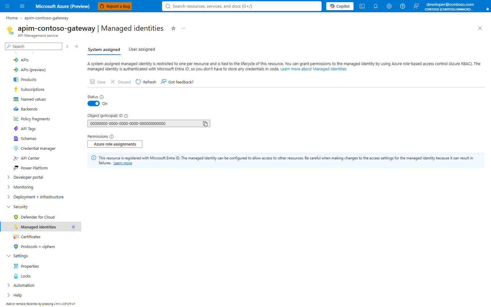
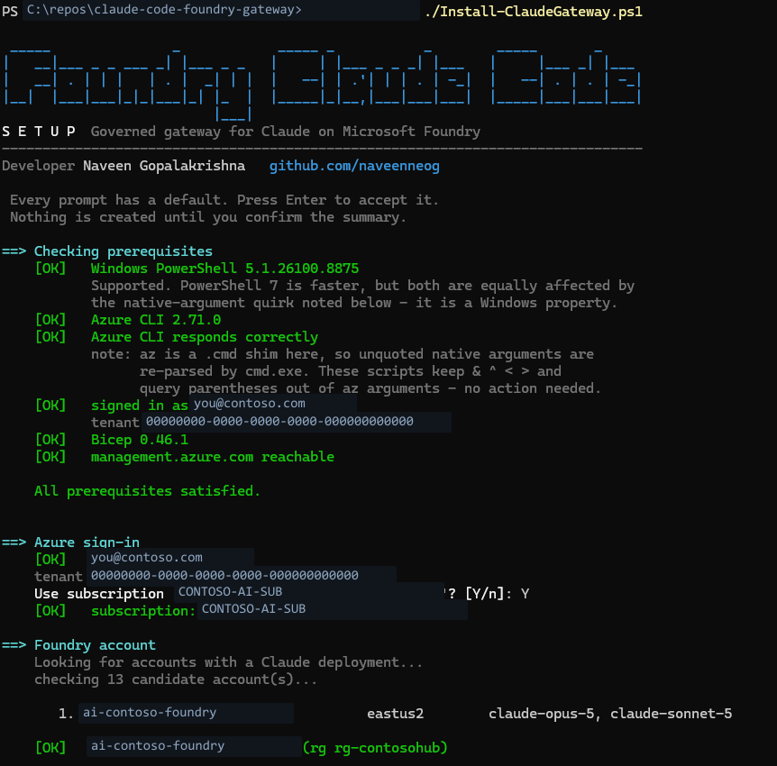
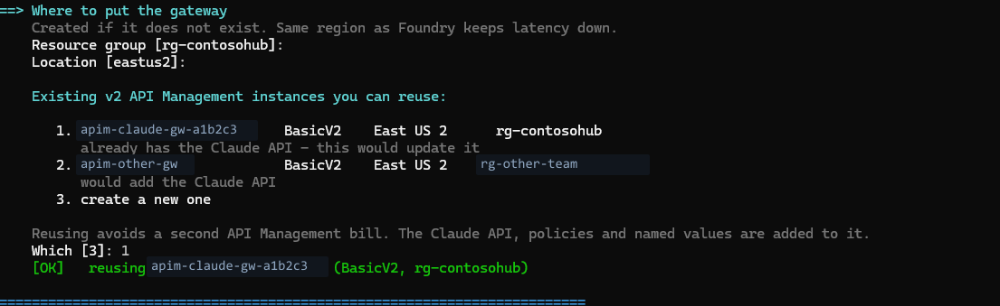
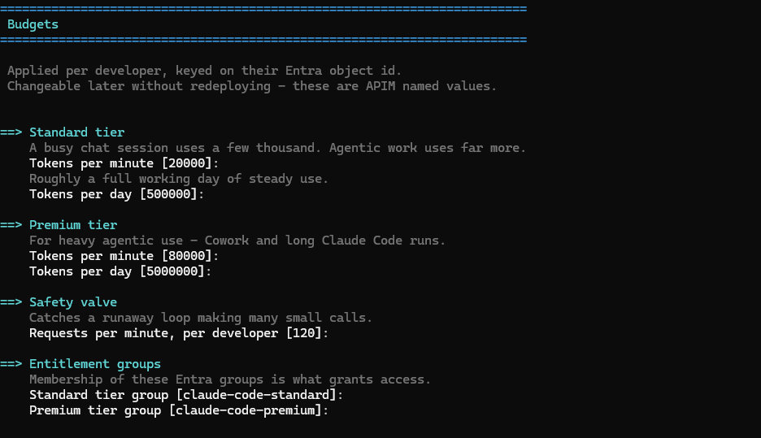
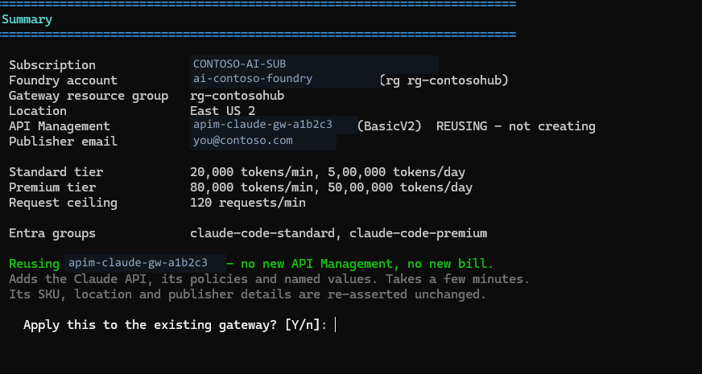

# Setup guide — prerequisites, permissions, and deployment

Who this is for: the platform, AI CoE, or cloud engineering team that stands up
the gateway once for the organisation.

Allow a deployment/change window: resource provisioning, quota approval and role
propagation vary by tenant. Review [Architecture](ARCHITECTURE.md) and
[Decisions](DECISIONS.md) before choosing a tier or network layout.

Run commands from the repository root. `<rg>` means the resource group named by
that step: the gateway and Foundry account need not share one. Use
[target discovery](OPERATIONS.md#1-select-the-gateway-and-workspace) to distinguish
the subscription, gateway group, Foundry group and telemetry workspace.

### Find the values used in this guide

The following are lookups, not permission grants or deployment commands. Run
them in the intended signed-in tenant. Select actual options from the returned
list; do not substitute a resource name copied from a screenshot.

| Placeholder | Azure portal source | Azure CLI equivalent |
|---|---|---|
| `<sub>` / subscription ID | Subscriptions > select the subscription > Overview > Subscription ID | `az account list --query "[].{name:name,id:id,tenant:tenantId,current:isDefault}" -o table` |
| `<tenant-id>` | Microsoft Entra ID > Overview > Tenant ID; confirm the subscription belongs to it | `az account show --query tenantId -o tsv` |
| Gateway `<rg>` and `<apim>` | API Management services > select the instance > Overview > Essentials > Resource group | `az apim list --query "[].{name:name,rg:resourceGroup,region:location,tier:sku.name}" -o table` |
| Foundry `<rg>` and `<account>` | Foundry account > Overview > Essentials; use the account, not a project | `az cognitiveservices account list --query "[].{name:name,rg:resourceGroup,kind:kind,region:location}" -o table` |
| `<region>` | The selected resource's Overview > Location; for a new service inspect the region/tier choices before creating it | `az apim list --query "[].{name:name,region:location,tier:sku.name}" -o table` shows existing instances, **not new regional capacity** |
| `<apim-principal-id>` | Selected APIM > managed identity settings > system-assigned Object (principal) ID | `az apim show -g <gateway-rg> -n <apim> --query identity.principalId -o tsv` |
| `<foundry-resource-id>` | Selected Foundry account > Overview > JSON View > `id` | `az cognitiveservices account show -g <foundry-rg> -n <account> --query id -o tsv` |

Where a step says `<rg>`, use that step's resource group from this table.
The role assignment uses the **Foundry** scope; APIM policy/limits use the
**gateway** group. They are not interchangeable. Pass the chosen parameters
for unattended deployment; the interactive installer presents numbered choices.
The [live gateway Overview](OPERATIONS.md#1-select-the-gateway-and-workspace)
shows the fields used for the gateway lookup.

**In this article**

1. [Prerequisites](#1-prerequisites)
2. [Permissions and roles](#2-permissions-and-roles)
3. [Deploy](#3-deploy)
4. [Verify before announcing](#4-verify-before-announcing)
5. [Next](#5-next)

---

## 1. Prerequisites

### Azure resources you must already have

| Resource | Requirement | Check |
|----------|-------------|-------|
| Microsoft Foundry account | An account of kind `AIServices`, eligible for Claude | `az cognitiveservices account list -o table` |
| Claude deployment | Optional. The installer deploys one if the account has none | `az cognitiveservices account deployment list -g <rg> -n <account> -o table` |
| Subscription | Able to create API Management **v2** SKUs in the target region | see [Region](#region) |

**Portal checks:** Foundry > select the account > Models + endpoints lists the
deployments. Azure portal > the account > Overview / JSON View gives its kind,
subscription, resource group and location.

The gateway is a front door and cannot create a model, but the installer can
deploy a model for you. If no account in the subscription has a Claude
deployment, it lists the models the account is entitled to deploy, asks which one
and at what capacity, and creates it before continuing. Claude is not offered in
every region, so an account in a region without it fails with that stated rather
than with a deployment error.

Two details of that deployment are easy to get wrong by hand:

- **Which version.** A model can be listed more than once. `claude-haiku-4-5`,
  for example, appears as version `2` (hosted on Azure, the default) and
  `20251001` (hosted on Anthropic). The installer offers the version Azure marks
  as default and shows where each is hosted. Choosing the highest version string
  picks `20251001`, because `'20251001'` sorts above `'2'`.
- **Organisation details.** Azure refuses an Anthropic deployment that does not
  carry your organisation name, industry and two-letter country code
  (`InvalidModelProviderData`), and `az cognitiveservices account deployment
  create` has no way to send them. The installer creates the deployment through
  Azure Resource Manager instead. It copies the three values from an existing
  Claude deployment in the subscription when there is one, and otherwise asks for
  them. Unattended installs pass `-ModelOrganizationName`, `-ModelIndustry` and
  `-ModelCountryCode`.

To deploy by hand, send the same body the installer sends. Write it to a file
first: on Windows `az` is a batch file, and a JSON body passed inline loses its
quotes on the way in, which fails with `the following arguments are required:
--url`. The form below was run in PowerShell 7.6 and Windows PowerShell 5.1.
Quote `'@deployment.json'`, because PowerShell reads a bare `@deployment` as
splatting.

```powershell
@{
  sku        = @{ name = 'GlobalStandard'; capacity = 1 }
  properties = @{
    model             = @{ format = 'Anthropic'; name = 'claude-haiku-4-5'; version = '2' }
    modelProviderData = @{ organizationName = 'Contoso'; industry = 'technology'; countryCode = 'US' }
  }
} | ConvertTo-Json -Depth 6 | Set-Content deployment.json

az rest --method put --headers Content-Type=application/json --body '@deployment.json' `
  --url "https://management.azure.com/subscriptions/<sub>/resourceGroups/<rg>/providers/Microsoft.CognitiveServices/accounts/<account>/deployments/claude-haiku-4-5?api-version=2025-12-01"
```

**Portal:** Foundry > Model catalog > select an available Claude model > Deploy.
Review hosting, version, deployment name and capacity; supply the requested
organisation details and accept the applicable Marketplace terms. Verify the
deployment's provisioning state is `Succeeded` in Models + endpoints. The
model/version above is an example, not a promise of regional availability.

### Choosing the SKU

The installer asks **how many developers** will use the gateway and suggests a
tier from it, showing the arithmetic so you can argue with it:

```text
50 developers x 500 requests/day x 22 days = 550,000 requests/month
Basic v2 includes 10,000,000 and Standard v2 50,000,000.
```

The basis is the included monthly request volume, because that is what Microsoft
actually publishes. There is no documented requests-per-second per unit for the
v2 tiers — the guidance is to load test your own workload — so a recommendation
built on an RPS figure would be a guess in a table.
([v2 tiers overview](https://learn.microsoft.com/azure/api-management/v2-service-tiers-overview))

On that arithmetic Basic v2 covers roughly 900 developers, so **volume rarely
decides this**. What usually moves an enterprise to Standard v2 is that Basic v2
has no VNet integration. Neither Basic v2 nor Standard v2 has availability zones;
Premium v2 does, but not multi-region. The installer says so rather
than implying the request count is the deciding factor, and the suggestion is
only a default — override it at the prompt.

This is included-request arithmetic, **not supported developer capacity**.
The shipped named-value membership map fills at roughly 93 developers with
six-character unit IDs; see [Scale](SCALE.md). Private projection deployment is
separate and needs Standard v2 or Premium v2.

### Tooling

| Tool | Version | Why |
|------|---------|-----|
| Azure CLI | 2.60+ | deployment and all verification commands |
| Bicep | Azure CLI-managed executable | `az bicep version`; if missing, `az bicep install` |
| PowerShell | 7+, or Windows PowerShell 5.1 | the setup wizard and scripts. macOS/Linux can use the `.sh` equivalents instead |
| Node.js | compatible with the selected tooling's `package.json` | only for optional screenshot/inspector tooling and the projection code |

### Region

APIM v2 SKUs are not available everywhere. **Portal:** Create a resource >
API Management > Basics > Region and Pricing tier. Check that your required
v2 tier is selectable, then cancel this preview. `az apim list-skus` is not an
Azure CLI command. Use the [v2 availability reference](https://learn.microsoft.com/azure/api-management/v2-service-tiers-overview)
and confirm the subscription's regional capacity before deploying.

Deploy the gateway in the **same region as the Foundry account** where possible.
A cross-region hop adds latency to every token.

---

## 2. Permissions and roles

This is the part that most often blocks a deployment, so it is worth reading in
full. There are three distinct identities involved and they need different
things.

### 2.1 You — the person running the deployment

| Scope | Role | Why it is needed | Can you substitute? |
|-------|------|------------------|---------------------|
| Target resource group | **Contributor** | create APIM, Application Insights, Log Analytics | Owner also works |
| Foundry account | **User Access Administrator** or **Owner** | create the role assignment that lets the gateway call Foundry | **No** — Contributor cannot create role assignments |
| Subscription | **Reader** | subscription-wide resource discovery during setup | A role on one resource group does not grant this |

If the resource group does not exist, arrange its creation or hold Contributor
at subscription scope. Directory permissions below are independent of Azure RBAC.
Check what you actually hold:

```bash
az role assignment list --assignee $(az ad signed-in-user show --query id -o tsv) \
  --all --query "[].{role:roleDefinitionName, scope:scope}" -o table
```

**Portal:** Subscription / resource group / Foundry account > Access control
(IAM) > View my access. Check inherited and active PIM assignments at each
scope. To grant the gateway role manually: Foundry account > IAM > Add role
assignment > Cognitive Services User > Managed identity > select the gateway.

The live Foundry **Access control (IAM)** blade exposes **Check access**,
**Role assignments**, **Roles** and **Deny assignments** tabs. On **Check access**,
**View my access** inspects the operator; **Check access** lets an authorised
operator inspect another principal. Choose **Role assignments** to review direct
and inherited grants before making a change.


This screenshot was captured read-only on 2026-09-24 UTC. No role assignment
was created or removed during the capture. For the equivalent CLI read, use the
role-assignment listing above; for another principal use its verified object
ID and the actual Foundry account scope, as in
[closing the bypass](#42-close-the-bypass).

> **The common failure.** People with Contributor on the resource group assume
> they are covered, then the deployment fails at the role-assignment step with
> `AuthorizationFailed`. Creating a role assignment requires
> `Microsoft.Authorization/roleAssignments/write`, which Contributor
> deliberately excludes. Get User Access Administrator on the Foundry account
> scope, or have someone who has it run just that one step:
>
> ```bash
> az role assignment create \
>   --assignee <apim-principal-id> \
>   --role "Cognitive Services User" \
>   --scope <foundry-resource-id>
> ```

### 2.2 The gateway — APIM's system-assigned managed identity

| Scope | Role | Role ID | Why |
|-------|------|---------|-----|
| Foundry account | **Cognitive Services User** | `a97b65f3-24c7-4388-baec-2e87135dc908` | call the Messages API |

This is the default gateway's Foundry permission. The optional projection,
Turnstile and scheduled writers have separate identities and grants.

> **Owner is not sufficient.** Owner is a management-plane role and confers no
> data-plane access to Cognitive Services. An identity with Owner and nothing
> else gets `401` from the model endpoint. It has to be Cognitive Services User
> (or Cognitive Services Contributor, which is broader than needed).

Propagation takes 2–5 minutes. A `401` from the backend immediately after
assignment usually just means you were too quick.

**Portal:** open the discovered gateway > **Identity** > **System assigned**.
Verify **Status** is **On**, then copy **Object (principal) ID** for the Foundry
role assignment. If it is Off, an authorised operator enables it and saves
before assigning the role; do not copy an application/client ID instead.



### 2.3 Developers

**No Azure role at all.**

This is the point of the design. A developer's entitlement is *group
membership*, not an RBAC assignment. They need:

| Requirement | Detail |
|-------------|--------|
| Entra ID account in the tenant | guests are fine, see the note below |
| Membership of `claude-code-standard` or `claude-code-premium` | this is the entitlement |
| Ability to run `az login` | no special rights needed |

> **Guest accounts** must sign in with the tenant named explicitly:
> `az login --tenant <tenant-id>`. A bare `az login` lands them in their home
> directory and the gateway rejects the token with `401`.
> If the account has no Azure subscriptions, add `--allow-no-subscriptions`.

### 2.4 Entra directory permissions

Creating the groups and reading their membership needs directory rights that
are separate from Azure RBAC.

| Action | Needs | If you do not have it |
|--------|-------|----------------------|
| Create the two groups | **Groups Administrator**, or tenant self-service group creation | Ask an admin to create them; the wizard reuses groups that already exist |
| Add or remove members | Group **Owner** or Groups Administrator | Ask the group owner |
| `Sync-ClaudeAccess.ps1` reading membership | Your delegated Graph token and permission to read those groups | Guest/restricted-directory policies may require an administrator |

> **What deliberately is *not* used.** Giving the gateway the Graph
> `GroupMember.Read.All` application permission would let APIM resolve group
> membership at request time. That grant needs tenant admin consent and was
> refused in the environment this was built in (`Authorization_RequestDenied`).
> The sync-script approach was chosen because it needs no admin consent at all:
> membership is resolved by a person who can already read the group, and the
> result is written to APIM named values.
>
> The trade-off is that membership changes are **not** instant — they apply when
> the sync runs. The default installer does not create an unattended membership
> schedule. A workload identity needs its own Graph application permission;
> subscription Owner does not grant it. See [Onboarding](ONBOARDING.md#step-3--push-the-change-to-the-gateway)
> and [U17](UNKNOWNS.md) before promising automatic revocation.

**Portal:** Entra ID > Groups > New group / Owners / Members performs directory
changes. APIM > APIs > Named values shows their published result. Directory
edits alone do not publish entitlement.

### 2.5 Everything, as one preflight check

Both setup scripts check the environment before touching anything, and stop with
a specific remedy rather than failing part-way through:

```text
==> Checking prerequisites
    [OK]   Windows PowerShell 5.1.26100.8875
    [OK]   Azure CLI 2.86.0
    [OK]   Azure CLI responds correctly
    [OK]   signed in as admin@contoso.com
    [OK]   Bicep 0.46.1
    [OK]   management.azure.com reachable

    All prerequisites satisfied.
```

Blocking issues stop the run before any change. Warnings continue. Run it on its
own if you just want the report:

```powershell
. ./scripts/Test-Prerequisites.ps1
Test-ClaudePrerequisites -Mode Admin
```

**Manual equivalent:** check each installed tool's version locally, sign in to
the Azure portal and verify the resources/roles above. There is no portal action
that inspects tools installed on your workstation.

To preview the whole plan without creating anything:

```powershell
./Install-ClaudeGateway.ps1 -WhatIf          # macOS/Linux: ./install-claude-gateway.sh --what-if
```

Resolves the resources, checks what you hold, and prints the full plan and every
budget without creating anything.

---

## 3. Deploy

### Option A — the interactive wizard (recommended)


```powershell
git clone https://github.com/naveenneog/claude-code-foundry-gateway
cd claude-code-foundry-gateway

az login
./Install-ClaudeGateway.ps1
```

```bash
# macOS and Linux - needs az and jq
./install-claude-gateway.sh
```

It lists only Foundry accounts that actually have a Claude deployment, asks for
every budget with a default already filled in, and shows a summary before
creating anything. Pressing Enter throughout gives a working, governed
deployment.

**1. Prerequisites, sign-in, and Foundry discovery.** Everything is checked
before anything is touched, and only accounts with a Claude deployment are
offered — here 13 candidates narrowed to one.



**2. Reuse an existing gateway, or create one.** API Management is the whole
cost of this accelerator, so any v2 instance you already own is offered first,
annotated with whether it already carries the Claude API.



**3. Budgets.** Every prompt has a working default in brackets — Enter accepts
it. These become APIM named values, so they are changeable later without
redeploying.



**The choices the wizard asks you to make.** Four of them are not budgets and
are not changeable in the same way, so each is asked with its consequence and,
where it costs money, with the figure at your stated developer count:

| Choice | Options | Why it is asked rather than defaulted |
|---|---|---|
| Revocation window | 15 min / 1 hour / 4 hours | A requested projection cache window, not an installed sync schedule. Current projection leases cap stale admission at two hours from scan start, including cache; named values remain stale until synced. |
| Team budget | `report` / `stop` | This legacy prompt changes guidance, not a unit's stored mode. The installer preserves `bu-modes`; a missing entry means strict. Configure strict, allowance or notify per unit through [Business units](BUSINESS-UNITS.md#budget-modes) or Turnstile. An enforcing token quota triggers later than the dollar figure suggests because it excludes cache. |
| Unassigned developers | `allow` / `deny` | `deny` on day one refuses people who have done nothing wrong. Start on `allow` and switch when `Get-ClaudeBusinessUnit.ps1` reports zero unassigned. |
| Developer sign-in | `interactive` / `device` / `helper` | How developers authenticate. Written into `claude-gateway.json` and applied by the onboarding script on each machine. |
| Developer address | `azure` / `custom` | The only one that is expensive to change afterwards — the instance name is part of the address, so replacing the gateway later means reconfiguring every machine. |

> [!IMPORTANT]
> **Developer sign-in is decided here, once, for everyone.** A fleet where half
> the workstations authenticate one way and half another is a fleet with two
> support paths and two sets of symptoms. Choose `device` if *any* developer
> works on a jump box, a VDI session or over SSH — it costs nothing on a laptop
> and is the only option that works without a browser. `helper` routes every
> client through the credential helper that Claude Desktop needs anyway.
>
> It is changeable later by reissuing `claude-gateway.json` and re-running
> `Onboard-ClaudeDeveloper.ps1`, which is safe to run repeatedly.
> Device-code sign-in still needs Conditional Access to allow that flow; review
> [Authentication](AUTHENTICATION.md#conditional-access) before choosing it.

**4. The summary, before anything is created.** Reusing is called out
explicitly, along with what will and will not be touched.



> Identifiers in these screenshots are redacted. The raw captures are not in the
> repository; `guide/redact-terminal.mjs` holds the redaction map.

It then deploys the Bicep template, enables the managed identity, creates the
role assignment, applies the policy, creates the Entra groups, syncs
entitlement, verifies the controls, and writes `onboarding/claude-gateway.json`
— the file your developers' setup script reads.

> **That file does not exist until you deploy.** It is not in the repository,
> because it describes your specific gateway. The `onboarding/` folder is
> created by the wizard, and
> [onboarding/README.md](../onboarding/README.md) explains what lands there.
>
> It holds the gateway URL, tenant id, group names and tier limits — **no
> secret**. Access is Entra group membership, enforced at the gateway, so the
> file is safe to email or put on a share. Someone holding it without being in
> the group still gets `403`.

Re-runnable, so it is also how you change budgets later.

Unattended:

```powershell
./Install-ClaudeGateway.ps1 -FoundryAccount <account> -Yes
```

```bash
# macOS/Linux preview or unattended equivalent, from the repository root
./install-claude-gateway.sh --what-if
./install-claude-gateway.sh --foundry-account ai-contoso --yes
```

### Option B — non-interactive script

```powershell
./deploy.ps1 -FoundryAccount <your-foundry-account> -ResourceGroup rg-claude-gateway
```

Takes explicit parameters without prompting, wraps the same Bicep, and — like
the wizard — creates the Entra groups and runs the entitlement sync. Use it if
you are scripting against the accelerator; use `Get-Help .\deploy.ps1 -Full`
for this script's parameters rather than assuming every wizard option exists.

It does **not** write `onboarding/claude-gateway.json`, the file your developers'
setup script reads. Only the wizard writes that. Run the wizard once afterwards
to produce it; it is re-runnable and will reuse what `deploy.ps1` created:

```powershell
./Install-ClaudeGateway.ps1 -FoundryAccount <account> -Yes
```

### Option C — portal

Use the **Deploy to Azure** button in the README. You supply the Foundry account
name; everything else is defaulted.

The button deploys the template only. Three things the wizard does are left to
you:

```powershell
# 1. create the two tier groups, if they do not exist
az ad group create --display-name claude-code-standard --mail-nickname claude-code-standard
az ad group create --display-name claude-code-premium  --mail-nickname claude-code-premium

# 2. push membership to the gateway
./scripts/Sync-ClaudeAccess.ps1 -ApimName <apim> -ResourceGroup <rg>

# 3. write the developer handover file
./Install-ClaudeGateway.ps1 -FoundryAccount <account> -Yes
```

Step 3 is the wizard again. Explicitly select the existing instance and review
its plan rather than assuming unattended discovery chose the intended gateway.

**Without the scripts, finish the same three tasks in the portal/manual path:**

1. Entra ID > Groups > New group > Security. Create or reuse both tier groups,
   then Members > Add members. Check transitive membership for nested teams.
2. APIM > APIs > Named values > `allow-premium` / `allow-standard` > Edit.
   Populate comma-delimited object IDs, including leading/trailing commas,
   with premium taking precedence. This is a one-time manual publication, not
   an automatic sync; use [Onboarding](ONBOARDING.md) for the durable workflow.
3. Resource group > Deployments > the completed deployment > Outputs provides
   the gateway URL. Entra ID > Overview gives the tenant ID. Create
   `onboarding/claude-gateway.json` using the
   [handover schema](../onboarding/README.md), matching your actual names,
   models, sign-in mode and limits. No Azure portal blade generates this file.

Then publish the reporting functions/workbook using [Monitoring](MONITORING.md#7-dashboard)
and complete all verification below. The template button alone is not a
completed developer rollout.

### What gets created

| Resource | Purpose | Rough cost |
|----------|---------|-----------:|
| API Management, Basic v2 | the gateway | ~$150/mo |
| Application Insights | metrics and identity traces | usage-based |
| Log Analytics workspace | backing store for the above | usage-based |
| 2 Entra groups | entitlement | free |

> Basic v2 has no VNet integration. Standard v2 supplies outbound VNet
> integration; Premium v2 adds zone redundancy. Neither is a multi-region
> deployment. Do not select classic Premium here to obtain multi-region:
> the Anthropic token policies require v2. See [Decisions](DECISIONS.md).

### Already have a v2 API Management instance?

API Management is essentially the whole cost of this accelerator, so the wizard
looks for v2 instances you already own and offers to reuse one:

```text
    Existing v2 API Management instances you can reuse:

       1. apim-contoso-claude     BasicV2    East US 2      rg-contoso-claude
          already has the Claude API - this would update it
       2. apim-contoso-shared     BasicV2    East US 2      rg-contoso-shared
          would add the Claude API
       3. create a new one
```

Reuse is additive. It adds the Claude API, its policies, named values and a
logger, and does not modify the instance itself — no SKU change, no identity
change, and no change to TLS or networking settings.

An ARM `PUT` asserts a whole resource, so a template that re-declared the
service would reset every property it does not mention. Checked with `what-if`
against a live gateway, that meant `customProperties` being cleared, which
re-enables TLS 1.0, TLS 1.1 and SSL 3.0, along with the NAT gateway switched
off and both developer portals switched on. The template therefore only writes
the service when it creates it.

Two constraints:

- **It must be a v2 SKU.** Classic tiers attach the policies without complaint
  but meter zero Anthropic tokens, so every budget reads as zero usage forever.
  Only v2 instances are listed.
- **The deployment follows the instance.** The API and named values are parented
  to API Management, so the wizard switches to that instance's resource group
  and region and tells you it has done so.

Re-running against a gateway you already set up is the supported way to update
policies or budgets. Live state is preserved: the wizard reads the current
`allow-standard`, `allow-premium`, `quota-overrides`, `bu-registry`,
`bu-members` and `bu-parents` values off the gateway and passes them back, so a
redeploy cannot silently revoke anyone or empty the chargeback registry. Each of
those template parameters defaults to `,,`, so omitting one does not preserve
it — it clears it.

---

## 4. Verify before announcing

Use an entitled test identity and an agreed change window. The governance
check sends model requests and its throttle test temporarily changes limits;
`-SkipThrottleTest` leaves that live limit untouched but does not prove throttling.

```powershell
./scripts/Show-Governance.ps1 -ApimName <apim> -ResourceGroup <rg>
```


Four things must pass:

| # | Control | Failure means |
|---|---------|---------------|
| 1 | Identity — unlisted callers rejected | anyone in the tenant can use your model budget |
| 2 | Tiering — the right limits per group | tiers are decorative |
| 3 | Rate limit — 429 with `Retry-After` | budgets are not enforced |
| 4 | Chargeback — tokens attributed per user | you have a bill you cannot allocate |

Full command reference: [GOVERNANCE-CHECKS.md](GOVERNANCE-CHECKS.md).

**Portal/manual:** APIM > Overview confirms the tier; APIs > Claude API >
Policies and Named values confirm configuration; the linked workbook confirms
observed usage. Run a developer request as well: those blades cannot prove
the developer's credential, streaming path or budget refusal.

In **APIs**, select **Claude on Foundry (governed)**, the API display name emitted
by this template, then **All operations**. Inspect **Inbound processing** and
open the policy code editor to review the token, entitlement and quota policies.
Do not select **Save** merely to inspect the policy. If the API was renamed,
identify it from its `claude-foundry` API ID and `/claude` path first.


### 4.1 Confirm the tier is v2

```bash
az apim show -g <rg> -n <apim> --query "sku.name" -o tsv
# expect: BasicV2, StandardV2 or PremiumV2
```

This is the most common silent failure. On a classic tier the policies attach,
the API returns 200, and every token count is **zero**, so none of the budgets
above ever trigger.


### 4.2 Close the bypass

```powershell
./scripts/Get-ClaudeBypass.ps1
```

It lists every principal that can reach Foundry without passing through the
gateway, excludes the gateway's own managed identity, and exits non-zero when it
finds one, so it can run as a check rather than only as a report.

The gateway only governs traffic that goes *through* it. Someone holding
data-plane access directly on the Foundry account can point Claude Code at the
endpoint and skip all of it: the group entitlement check, the per-developer and
per-business-unit budgets, the organisation-wide spend ceiling, and the
restriction on which models may be called.


Checking one role name by hand is not enough, for two reasons.

**More than one role grants it.** The audit reads each assigned role's
`dataActions` rather than matching names, because the set changes. On the
reference deployment four roles grant Cognitive Services data actions, and
**`Foundry User` grants the same `Microsoft.CognitiveServices/*` as `Cognitive
Services User`** — a hand check for one name reported clean while three
`Foundry User` assignments were live.

**Inherited assignments count.** A role granted at subscription or resource group
scope still applies to the Foundry account and does not appear unless you ask for
it. The audit passes `--include-inherited`; a hand check usually does not.

Findings are graded. `full` means `Microsoft.CognitiveServices/*` — a bypass.
`partial` means data actions scoped to some paths, where whether the Anthropic
route is covered depends on the role, so it is reported for review rather than
asserted. `read` is read-only data-plane access, shown with `-IncludeRead`.

Removing one:

```bash
az role assignment delete --assignee <principal-id> \
  --role "<role name>" --scope <scope shown by the audit>
```

Use the scope the audit reports, not the Foundry account id: an inherited
assignment has to be removed where it was granted.

**Portal:** Foundry account > Access control (IAM) > Role assignments. Include
inherited entries and inspect each role's data actions. Remove an unintended
assignment at its displayed subscription/resource-group/account scope; keep the
gateway identity's grant. Repeat the audit and an end-to-end gateway request.
Also review Foundry key access/local authentication and network exposure: an
RBAC-only audit does not prove an old API key cannot bypass the gateway.

> Read each principal before removing it. A deployment pipeline, Defender, or
> another application may hold the assignment legitimately. The finding is that
> the access is ungoverned, not that it is wrong.

---

## 5. Next

| Task | Guide |
|------|-------|
| Give a developer access | [Onboarding guide](ONBOARDING.md) |
| Watch usage and cost | [Monitoring guide](MONITORING.md) |
| Something is broken | [Debug guide](DEBUGGING.md) |
| Justify this to a stakeholder | [Foundry vs direct Anthropic](COMPARISON.md) |
