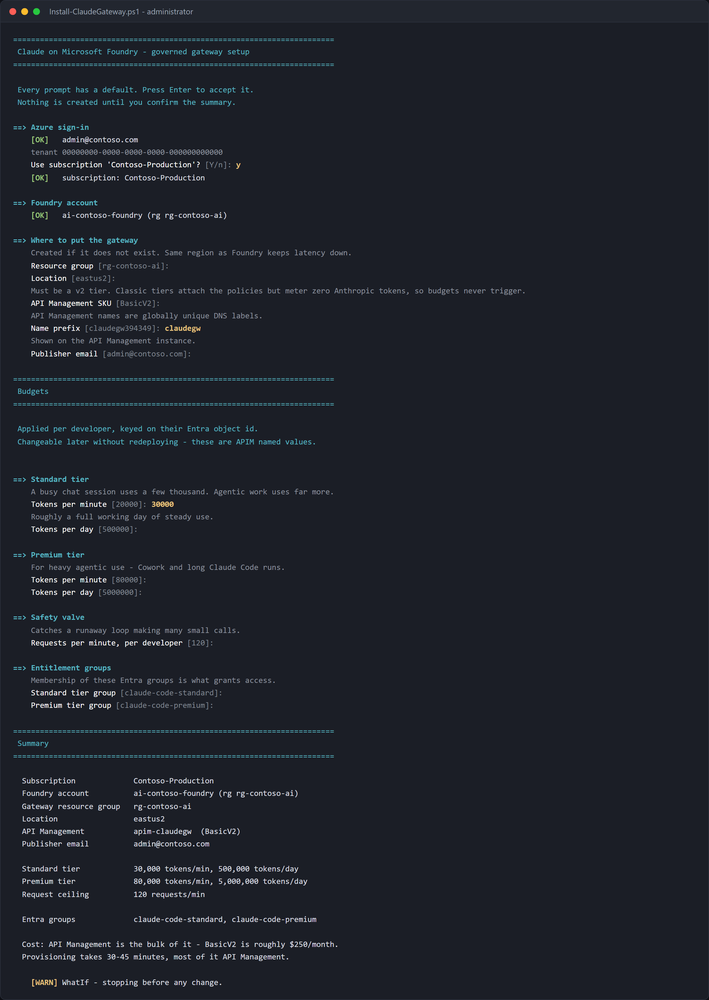

# Setup guide — prerequisites, permissions, and deployment

Who this is for: the platform, AI CoE, or cloud engineering team that stands up
the gateway once for the organisation.

Time: about 60 minutes, of which 40 is unattended APIM provisioning.

---

## 1. Prerequisites

### Azure resources you must already have

| Resource | Requirement | Check |
|----------|-------------|-------|
| Microsoft Foundry account | An AI Services / Cognitive Services account with at least one Claude deployment | `az cognitiveservices account deployment list -g <rg> -n <account> -o table` |
| Claude deployment | `claude-sonnet-5` and/or `claude-opus-5` | as above |
| Subscription | Able to create API Management **v2** SKUs in the target region | see [Region](#region) |

If the Foundry account does not exist yet, create the Claude deployment first.
The gateway is a front door — it cannot create the model behind it.

### Tooling

| Tool | Version | Why |
|------|---------|-----|
| Azure CLI | 2.60+ | deployment and all verification commands |
| Bicep | bundled with the CLI | `az bicep version` |
| PowerShell | 7+, or Windows PowerShell 5.1 | the setup wizard and scripts. macOS/Linux can use the `.sh` equivalents instead |
| Node.js | 18+ | only for the optional screenshot and inspector tooling |

### Region

APIM v2 SKUs are not available everywhere. Confirm before you start:

```bash
az apim list-skus --query "[?contains(name,'V2')].{sku:name,locations:locations}" -o table
```

Deploy the gateway in the **same region as the Foundry account** where possible.
A cross-region hop adds latency to every token.

---

## 2. Permissions and roles

This is the part that most often blocks a deployment, so it is worth reading in
full. There are three distinct identities involved and they need different
things.

### 2.1 You — the person running the deployment

| Scope | Role | Why it is needed | Can you substitute? |
|-------|------|------------------|---------------------|
| Target resource group | **Contributor** | create APIM, Application Insights, Log Analytics | Owner also works |
| Foundry account | **User Access Administrator** or **Owner** | create the role assignment that lets the gateway call Foundry | **No** — Contributor cannot create role assignments |
| Subscription | **Reader** | resource discovery during setup | inherited from the above |

Check what you actually hold:

```bash
az role assignment list --assignee $(az ad signed-in-user show --query id -o tsv) \
  --all --query "[].{role:roleDefinitionName, scope:scope}" -o table
```

> **The common failure.** People with Contributor on the resource group assume
> they are covered, then the deployment fails at the role-assignment step with
> `AuthorizationFailed`. Creating a role assignment requires
> `Microsoft.Authorization/roleAssignments/write`, which Contributor
> deliberately excludes. Get User Access Administrator on the Foundry account
> scope, or have someone who has it run just that one step:
>
> ```bash
> az role assignment create \
>   --assignee <apim-principal-id> \
>   --role "Cognitive Services User" \
>   --scope <foundry-resource-id>
> ```

### 2.2 The gateway — APIM's system-assigned managed identity

| Scope | Role | Role ID | Why |
|-------|------|---------|-----|
| Foundry account | **Cognitive Services User** | `a97b65f3-24c7-4388-baec-2e87135dc908` | call the Messages API |

This is the only standing permission in the whole design.

> **Owner is not sufficient.** Owner is a management-plane role and confers no
> data-plane access to Cognitive Services. An identity with Owner and nothing
> else gets `401` from the model endpoint. It has to be Cognitive Services User
> (or Cognitive Services Contributor, which is broader than needed).

Propagation takes 2–5 minutes. A `401` from the backend immediately after
assignment usually just means you were too quick.

### 2.3 Developers

**No Azure role at all.**

This is the point of the design. A developer's entitlement is *group
membership*, not an RBAC assignment. They need:

| Requirement | Detail |
|-------------|--------|
| Entra ID account in the tenant | guests are fine, see the note below |
| Membership of `claude-code-standard` or `claude-code-premium` | this is the entitlement |
| Ability to run `az login` | no special rights needed |

> **Guest accounts** must sign in with the tenant named explicitly:
> `az login --tenant <tenant-id>`. A bare `az login` lands them in their home
> directory and the gateway rejects the token with `401`.

### 2.4 Entra directory permissions

Creating the groups and reading their membership needs directory rights that
are separate from Azure RBAC.

| Action | Needs | If you do not have it |
|--------|-------|----------------------|
| Create the two groups | **Groups Administrator**, or tenant self-service group creation | Ask an admin to create them; the wizard reuses groups that already exist |
| Add or remove members | Group **Owner** or Groups Administrator | Ask the group owner |
| `Sync-ClaudeAccess.ps1` reading membership | Your own delegated token — no app role needed | — |

> **What deliberately is *not* used.** Giving the gateway the Graph
> `GroupMember.Read.All` application permission would let APIM resolve group
> membership at request time. That grant needs tenant admin consent and was
> refused in the environment this was built in (`Authorization_RequestDenied`).
> The sync-script approach was chosen because it needs no admin consent at all:
> membership is resolved by a person who can already read the group, and the
> result is written to APIM named values.
>
> The trade-off is that membership changes are **not** instant — they apply when
> the sync runs. Put it on a schedule if that matters to you.

### 2.5 Everything, as one preflight check

Both setup scripts check the environment before touching anything, and stop with
a specific remedy rather than failing part-way through:

```
==> Checking prerequisites
    [OK]   Windows PowerShell 5.1.26100.8875
    [OK]   Azure CLI 2.86.0
    [OK]   Azure CLI responds correctly
    [OK]   signed in as admin@contoso.com
    [OK]   Bicep 0.46.1
    [OK]   management.azure.com reachable

    All prerequisites satisfied.
```

Blocking issues stop the run before any change. Warnings continue. Run it on its
own if you just want the report:

```powershell
. ./scripts/Test-Prerequisites.ps1
Test-ClaudePrerequisites -Mode Admin
```

To preview the whole plan without creating anything:

```powershell
./Install-ClaudeGateway.ps1 -WhatIf          # macOS/Linux: ./install-claude-gateway.sh --what-if
```

Resolves the resources, checks what you hold, and prints the full plan and every
budget without creating anything.

---

## 3. Deploy

### Option A — the interactive wizard (recommended)


```powershell
git clone https://github.com/naveenneog/claude-code-foundry-gateway
cd claude-code-foundry-gateway

az login
./Install-ClaudeGateway.ps1
```

```bash
# macOS and Linux - needs az and jq
./install-claude-gateway.sh
```

It lists only Foundry accounts that actually have a Claude deployment, asks for
every budget with a default already filled in, and shows a summary before
creating anything. Pressing Enter throughout gives a working, governed
deployment.



Everything in brackets is the default — Enter accepts it. The one typed value
above is `30000`, overriding the standard tier's tokens per minute.

It then deploys the Bicep template, enables the managed identity, creates the
role assignment, applies the policy, creates the Entra groups, syncs
entitlement, verifies the controls, and writes `onboarding/claude-gateway.json`
— the file your developers' setup script reads.

> **That file does not exist until you deploy.** It is not in the repository,
> because it describes your specific gateway. The `onboarding/` folder is
> created by the wizard, and
> [onboarding/README.md](../onboarding/README.md) explains what lands there.
>
> It holds the gateway URL, tenant id, group names and tier limits — **no
> secret**. Access is Entra group membership, enforced at the gateway, so the
> file is safe to email or put on a share. Someone holding it without being in
> the group still gets `403`.

Re-runnable, so it is also how you change budgets later.

Unattended:

```powershell
./Install-ClaudeGateway.ps1 -FoundryAccount <account> -Yes
```

### Option B — non-interactive script

`deploy.ps1` takes the same parameters without prompting. The wizard wraps the
same Bicep and produces the same result; use `deploy.ps1` if you are scripting
against it.

```powershell
./deploy.ps1 -FoundryAccount <your-foundry-account> -ResourceGroup rg-claude-gateway
```

### Option C — portal

Use the **Deploy to Azure** button in the README. You supply the Foundry account
name; everything else is defaulted. Afterwards you still need to run:

```powershell
./scripts/Sync-ClaudeAccess.ps1 -ApimName <apim> -ResourceGroup <rg>
```

### What gets created

| Resource | Purpose | Rough cost |
|----------|---------|-----------:|
| API Management, Basic v2 | the gateway | ~$250/mo |
| Application Insights | token metrics and chargeback | usage-based |
| Log Analytics workspace | backing store for the above | usage-based |
| 2 Entra groups | entitlement | free |

> Basic v2 has no SLA-backed multi-region or VNet support. For production, use
> Standard v2 or Premium v2 — the policy is identical.

### Already have a v2 API Management instance?

API Management is essentially the whole cost of this accelerator, so the wizard
looks for v2 instances you already own and offers to reuse one:

```
    Existing v2 API Management instances you can reuse:

       1. apim-claude-gw-fzgql9    BasicV2    East US 2      rg-contosohub
          already has the Claude API - this would update it
       2. hocon-gateway            BasicV2    East US 2      rg-hello-agent-dev
          would add the Claude API
       3. create a new one
```

Reuse is **strictly additive**. It adds the Claude API, its policies, named
values and a logger, and does not touch the instance itself — no SKU change, no
identity change, and none of your TLS or networking settings.

That last point is load-bearing. An ARM `PUT` asserts a whole resource, so a
template that merely re-declared the service would reset every property it does
not mention. Verified with `what-if` against a live gateway, that meant
`customProperties` being cleared — re-enabling TLS 1.0, TLS 1.1 and SSL 3.0 —
along with the NAT gateway switched off and both developer portals switched on.
The template therefore only writes the service when it is creating it.

Two constraints:

- **It must be a v2 SKU.** Classic tiers attach the policies without complaint
  but meter zero Anthropic tokens, so every budget reads as zero usage forever.
  Only v2 instances are listed.
- **The deployment follows the instance.** The API and named values are parented
  to API Management, so the wizard switches to that instance's resource group
  and region and tells you it has done so.

Re-running against a gateway you already set up is the supported way to update
policies or budgets. Entitlement is preserved: the wizard reads the current
`allow-standard` and `allow-premium` values and passes them back, so a redeploy
cannot silently revoke anyone.

---

## 4. Verify before announcing

```powershell
./scripts/Show-Governance.ps1 -ApimName <apim> -ResourceGroup <rg>
```


Four things must pass:

| # | Control | Failure means |
|---|---------|---------------|
| 1 | Identity — unlisted callers rejected | anyone in the tenant can use your model budget |
| 2 | Tiering — the right limits per group | tiers are decorative |
| 3 | Rate limit — 429 with `Retry-After` | budgets are not enforced |
| 4 | Chargeback — tokens attributed per user | you have a bill you cannot allocate |

Full command reference: [GOVERNANCE-CHECKS.md](GOVERNANCE-CHECKS.md).

### 4.1 Confirm the tier is v2

The single most common silent failure. On a classic tier the policies attach,
the API returns 200, and every token count is **zero** — so the budgets above
never trigger.


```bash
az apim show -g <rg> -n <apim> --query "sku.name" -o tsv
# expect: BasicV2, StandardV2 or PremiumV2
```

### 4.2 Close the bypass — do not skip this

The gateway only governs traffic that goes *through* it. Anyone holding
**Cognitive Services User** directly on the Foundry account can point Claude
Code straight at Foundry and ignore every budget you just configured.


```bash
az role assignment list \
  --scope $(az cognitiveservices account show -g <rg> -n <foundry> --query id -o tsv) \
  --role "Cognitive Services User" \
  --query "[].{principal:principalName, type:principalType, id:principalId}" -o table
```

The only entry should be the gateway's principal id. Remove the rest:

```bash
az role assignment delete --assignee <principal-id> \
  --role "Cognitive Services User" --scope <foundry-resource-id>
```

> Check inherited assignments too. A role granted at subscription or resource
> group scope still applies to the Foundry account and will not appear unless
> you look. Add `--include-inherited` to the list command.

---

## 5. Next

| Task | Guide |
|------|-------|
| Give a developer access | [Onboarding guide](ONBOARDING.md) |
| Watch usage and cost | [Monitoring guide](MONITORING.md) |
| Something is broken | [Debug guide](DEBUGGING.md) |
| Justify this to a stakeholder | [Foundry vs direct Anthropic](COMPARISON.md) |
