# Setup guide — prerequisites, permissions, and deployment

Who this is for: the platform, AI CoE, or cloud engineering team that stands up
the gateway once for the organisation.

Allow a deployment/change window: resource provisioning, quota approval and role
propagation vary by tenant. Review [Architecture](ARCHITECTURE.md) and
[Decisions](DECISIONS.md) before choosing a tier or network layout.

Run commands from the repository root. `<rg>` means the resource group named by
that step: the gateway and Foundry account need not share one. Use
[target discovery](OPERATIONS.md#1-select-the-gateway-and-workspace) to distinguish
the subscription, gateway group, Foundry group and telemetry workspace.

## Quickstart

The default projection path requires PowerShell 7, Azure CLI/Bicep, Node.js/npm and ZIP-capable `tar`, an eligible Foundry account and the [deployment roles](#2-permissions-and-roles). The command runs from the repository root. The installer presents discovered targets, prices and an approval summary before writing.

```powershell
.\Install-ClaudeGateway.ps1
```

After installation, the generated record supplies the gateway target for the pilot handover and health check. The example uses `developer@contoso.com` as the selected standard-tier pilot account and handover recipient.

```powershell
$gateway = Get-Content .\onboarding\claude-gateway.json -Raw | ConvertFrom-Json
.\scripts\Set-ClaudeDeveloper.ps1 -ResourceGroup $gateway.resourceGroup -ApimName $gateway.apimName -User 'developer@contoso.com' -Tier standard -Sync
.\scripts\New-OnboardingEmail.ps1 -ConfigPath .\onboarding\claude-gateway.json -To 'developer@contoso.com'
.\scripts\Test-ClaudeHealth.ps1 -ResourceGroup $gateway.resourceGroup -ApimName $gateway.apimName
.\scripts\Get-ClaudeBypass.ps1 -ResourceGroup $gateway.resourceGroup -ApimName $gateway.apimName
```

**Expected result:** the installer writes `onboarding/claude-gateway.json`; the membership command publishes the pilot to the active store; the email command writes HTML, text and EML files; health exits zero; the bypass audit has no unapproved direct or inherited Foundry role. A separate developer setup run verifies the pilot request before broad rollout. Roll out only after bypass findings are clean or explicitly approved, and after section 4.2 reviews Foundry key access, local authentication and network exposure ([details](#42-close-the-bypass)).

## 1. Prerequisites

<details>

<summary>Azure resource lookups, SKU choice, tooling and region checks</summary>

### Find the values used in this guide

The following are lookups, not permission grants or deployment commands. Run
them in the intended signed-in tenant. Select actual options from the returned
list; do not substitute a resource name copied from a screenshot.

| Placeholder | Azure portal source | Azure CLI equivalent |
|---|---|---|
| `<sub>` / subscription ID | Subscriptions > select the subscription > Overview > Subscription ID | `az account list --query "[].{name:name,id:id,tenant:tenantId,current:isDefault}" -o table` |
| `<tenant-id>` | Microsoft Entra ID > Overview > Tenant ID; confirm the subscription belongs to it | `az account show --query tenantId -o tsv` |
| Gateway `<rg>` and `<apim>` | API Management services > select the instance > Overview > Essentials > Resource group | `az apim list --query "[].{name:name,rg:resourceGroup,region:location,tier:sku.name}" -o table` |
| Foundry `<rg>` and `<account>` | Foundry account > Overview > Essentials; use the account, not a project | `az cognitiveservices account list --query "[].{name:name,rg:resourceGroup,kind:kind,region:location}" -o table` |
| `<region>` | The selected resource's Overview > Location; for a new service inspect the region/tier choices before creating it | `az apim list --query "[].{name:name,region:location,tier:sku.name}" -o table` shows existing instances, **not new regional capacity** |
| `<apim-principal-id>` | Selected APIM > managed identity settings > system-assigned Object (principal) ID | `az apim show -g <gateway-rg> -n <apim> --query identity.principalId -o tsv` |
| `<foundry-resource-id>` | Selected Foundry account > Overview > JSON View > `id` | `az cognitiveservices account show -g <foundry-rg> -n <account> --query id -o tsv` |

Where a step says `<rg>`, use that step's resource group from this table.
The role assignment uses the **Foundry** scope; APIM policy/limits use the
**gateway** group. They are not interchangeable. Pass the chosen parameters
for unattended deployment; the interactive installer presents numbered choices.
The [live gateway Overview](OPERATIONS.md#1-select-the-gateway-and-workspace)
shows the fields used for the gateway lookup.

**In this article**

1. [Prerequisites](#1-prerequisites)
2. [Permissions and roles](#2-permissions-and-roles)
3. [Deploy](#3-deploy)
4. [Verify before announcing](#4-verify-before-announcing)
5. [Next](#5-next)

---

### Option D — Azure CLI commands only

The customer-deployment command guide is [Azure CLI commands for a customer gateway setup](AZ-COMMANDS.md). It mirrors the installer, setup and administration scripts in Cloud Shell bash, with one-line purpose statements, `az` commands, verification commands, expected results and source script references. Its current status is commands checked against Azure CLI help and the templates; not yet run end to end.


### Azure resources you must already have

| Resource | Requirement | Check |
|----------|-------------|-------|
| Microsoft Foundry account | An account of kind `AIServices`, eligible for Claude | `az cognitiveservices account list -o table` |
| Claude deployment | Optional. The installer deploys one if the account has none | `az cognitiveservices account deployment list -g <rg> -n <account> -o table` |
| Subscription | Able to create API Management **v2** SKUs in the target region | see [Region](#region) |

**Portal checks:** Foundry > select the account > Models + endpoints lists the
deployments. Azure portal > the account > Overview / JSON View gives its kind,
subscription, resource group and location.

The gateway is a front door and cannot create a model, but the installer can
deploy a model for you. If no account in the subscription has a Claude
deployment, it lists the models the account is entitled to deploy, asks which one
and at what capacity, and lists that deployment in its summary. It creates the
deployment first, after the summary is confirmed, and not at all under `-WhatIf`,
so declining at the summary leaves nothing behind. Claude is not offered in
every region, so an account in a region without it fails with that stated rather
than with a deployment error.

Two details of that deployment are easy to get wrong by hand:

- **Which version.** A model can be listed more than once. `claude-haiku-4-5`,
  for example, appears as version `2` (hosted on Azure, the default) and
  `20251001` (hosted on Anthropic). The installer offers the version Azure marks
  as default and shows where each is hosted. Choosing the highest version string
  picks `20251001`, because `'20251001'` sorts above `'2'`.
- **Organisation details.** Azure refuses an Anthropic deployment that does not
  carry your organisation name, industry and two-letter country code
  (`InvalidModelProviderData`), and `az cognitiveservices account deployment
  create` has no way to send them. The installer creates the deployment through
  Azure Resource Manager instead. It copies the three values from an existing
  Claude deployment in the subscription when there is one, and otherwise asks for
  them. Unattended installs pass `-ModelOrganizationName`, `-ModelIndustry` and
  `-ModelCountryCode`.

To deploy by hand, send the same body the installer sends. Write it to a file
first: on Windows `az` is a batch file, and a JSON body passed inline loses its
quotes on the way in, which fails with `the following arguments are required:
--url`. The form below was run in PowerShell 7.6 and Windows PowerShell 5.1.
Quote `'@deployment.json'`, because PowerShell reads a bare `@deployment` as
splatting.

```powershell
@{
  sku        = @{ name = 'GlobalStandard'; capacity = 1 }
  properties = @{
    model             = @{ format = 'Anthropic'; name = 'claude-haiku-4-5'; version = '2' }
    modelProviderData = @{ organizationName = 'Contoso'; industry = 'technology'; countryCode = 'US' }
  }
} | ConvertTo-Json -Depth 6 | Set-Content deployment.json

az rest --method put --headers Content-Type=application/json --body '@deployment.json' `
  --url "https://management.azure.com/subscriptions/<sub>/resourceGroups/<rg>/providers/Microsoft.CognitiveServices/accounts/<account>/deployments/claude-haiku-4-5?api-version=2025-12-01"
```

**Portal:** Foundry > Model catalog > select an available Claude model > Deploy.
Review hosting, version, deployment name and capacity; supply the requested
organisation details and accept the applicable Marketplace terms. Verify the
deployment's provisioning state is `Succeeded` in Models + endpoints. The
model/version above is an example, not a promise of regional availability.

### Choosing the SKU

The installer asks **how many developers** will use the gateway and suggests a
tier from it, showing the arithmetic so you can argue with it:

```text
50 developers x 500 requests/day x 22 days = 550,000 requests/month
Basic v2 includes 10,000,000 and Standard v2 50,000,000.
```

The basis is the included monthly request volume, because that is what Microsoft
actually publishes. There is no documented requests-per-second per unit for the
v2 tiers — the guidance is to load test your own workload — so a recommendation
built on an RPS figure would be a guess in a table.
([v2 tiers overview](https://learn.microsoft.com/azure/api-management/v2-service-tiers-overview))

On that arithmetic Basic v2 covers roughly 900 developers, so **volume rarely
decides this**. The facts that do, with the projection, from Microsoft Learn:

| Tier | Built-in cache | Scale units | Virtual network | Availability zones |
|---|---|---|---|---|
| Basic v2 | 250 MB | up to 10 | none | no |
| Standard v2 | 1 GB | up to 10 | outbound integration | yes |
| Premium v2 | 5 GB | up to 30 | injection | yes |

Sources: [features](https://learn.microsoft.com/azure/api-management/api-management-features)
(updated 2026-06-05), [outbound integration](https://learn.microsoft.com/azure/api-management/integrate-vnet-outbound)
(2025-12-04), [injection](https://learn.microsoft.com/azure/api-management/inject-vnet-v2) (2025-10-08) and
[reliability](https://learn.microsoft.com/azure/reliability/reliability-api-management) (2026-09-09).
Cosmos DB serverless, which the projection uses, is single-region
([serverless](https://learn.microsoft.com/azure/cosmos-db/serverless), 2026-04-27). The installer's
suggestion: Basic v2 for evaluation and small teams; Standard v2 for availability zones, outbound
virtual network integration or more than Basic v2's included volume; Premium v2 for virtual network
injection or more than 10 units. The installer creates API Management without zone-redundancy settings and without Premium v2 virtual network injection. Microsoft Learn says Premium v2 virtual network injection can be selected only when the instance is created and cannot be added to an existing instance (inject-vnet-v2, 2025-10-08); the reliability article lists zone support for Standard v2 and Premium v2 (reliability-api-management, 2026-09-09), and the v2 tiers overview lists the networking options (2026-09-04). A gateway that needs zone placement or Premium v2 injection is created with those settings first and then reused with `-ExistingApimName`. The suggestion is a default at the prompt.

This is included-request arithmetic, **not supported developer capacity**.
The shipped named-value membership map fills at roughly 93 developers with
six-character unit IDs; see [Scale](SCALE.md). The installer therefore asks
for an **entitlement store** as a separate choice:

| Store | When it fits | Network shape |
|---|---|---|
| Cosmos projection (default) | Every size ([ADR-0052](adr/0052-cosmos-default-installer.md)) | The resolver endpoint is public on every tier and accepts only the gateway managed identity's Microsoft Entra token; Cosmos remains private. `-ResolverInboundAccess private` on Standard v2 or Premium v2 needs the gateway's outbound virtual network integration into the projection network. |
| Named values | Teams within the measured ceiling | No extra components. |

The installer runs the projection deployer, `scripts/Deploy-ClaudeProjection.ps1`, which deploys
private Cosmos and the resolver, populates from Entra, compares the projection
against the named-value lists (or, on a new gateway, against the snapshot it applied) and leaves named
values authoritative; the installer then runs it with `-FlipAfterCleanCompare` to switch. Projection records persist until a sync removes or changes the person; a sync-job outage does not
stop developers. The installer also deploys the sync job, which applies Entra tier and business-unit group changes every 2 hours by default
(`-ProjectionSyncInterval`, [scheduled sync job](SECURE-PROJECTION.md#scheduled-sync-job-p104)). To publish a change at once, add or remove a developer in the Entra group, then run
`scripts/Sync-ClaudeAccess.ps1 -ResourceGroup <rg> -ApimName <apim> -User <name-or-object-id>` for one
person, or omit `-User` for everyone. The same command works for named values and the Cosmos projection;
named values publish a whole-list refresh and report the developer's written tier. If the group change happened
seconds ago, Microsoft Graph can still report the previous membership; rerun the sync until it reports the expected
`published_tier`, then allow at most `entitlement-cache-seconds` for the gateway cache. Disabled Entra accounts lose access when their current token expires,
60 to 90 minutes by default (Microsoft Learn access tokens, updated 2026-07-17:
https://learn.microsoft.com/entra/identity-platform/access-tokens). With `-FlipAfterCleanCompare` the
deployer deploys nothing: it runs resolver checks, the drift check, the runner compare and switch
evidence, and switches `entitlement-source` ([ADR-0051](adr/0051-persistent-sync-based-cosmos-entitlement.md)). The
Basic v2 resolver endpoint is public because Basic v2 has no outbound VNet
integration; APIM outbound IPs are not treated as the primary control.
Authentication is.

Named values chosen for more developers than they hold are refused at the store question, with the
capacity reason and the Cosmos projection as the remedy, before anything is created.

### Tooling

| Tool | Version | Why |
|------|---------|-----|
| Azure CLI | 2.60+ | deployment and all verification commands |
| Bicep | Azure CLI-managed executable | `az bicep version`; if missing, `az bicep install` |
| PowerShell | 7+ for the Cosmos projection, the default store; Windows PowerShell 5.1 runs the named-value store only | the installer and scripts; the installer checks the version before the projection steps (`scripts/ClaudeInstallProjection.ps1:67-80`). The macOS/Linux `.sh` installer deploys named values only ([ADR-0052](adr/0052-cosmos-default-installer.md)) |
| Node.js and npm | no `engines` constraint in `resolver/package.json` or `sync/package.json` | required for the Cosmos projection: the resolver and the sync code are packaged on this machine; otherwise only for screenshot and inspector tooling |
| tar | one that writes ZIP archives | required for the Cosmos projection: it packages the resolver ([SECURE-PROJECTION](SECURE-PROJECTION.md) prerequisites) |

### Region

APIM v2 SKUs are not available everywhere. **Portal:** Create a resource >
API Management > Basics > Region and Pricing tier. Check that your required
v2 tier is selectable, then cancel this preview. `az apim list-skus` is not an
Azure CLI command. Use the [v2 availability reference](https://learn.microsoft.com/azure/api-management/v2-service-tiers-overview)
and confirm the subscription's regional capacity before deploying.

Deploy the gateway in the **same region as the Foundry account** where possible.
A cross-region hop adds latency to every token.

In a console, `Install-ClaudeGateway.ps1` lists the Foundry account's region
first and then the other regions in its geography that publish an API
Management v2 price, each with the monthly list price of the three v2 tiers
for one unit at 730 hours. The prices come from one
[Azure Retail Prices API](https://learn.microsoft.com/rest/api/cost-management/retail-prices/azure-retail-prices)
call, and the geography from `az account list-locations`. A tier the API does
not publish in a region reads as not published. These are list prices: the
agreement's price sheet states what the organization pays, and reading it
takes a billing role rather than a subscription role
([View and download your organization's Azure pricing](https://learn.microsoft.com/azure/cost-management-billing/manage/ea-pricing),
**U31**). `install-claude-gateway.sh` lists the same regions and prices with the
same Retail Prices API query, and its tier prompt and summary are priced the
same way (P75). A region the subscription can use is accepted by name in any
case or spacing, or by its number in the list.

---

</details>

## 2. Permissions and roles

<details>

<summary>Operator, gateway, developer and directory role requirements</summary>

Three identities are involved, and each needs different roles.

### 2.1 You — the person running the deployment

| Scope | Role | Why it is needed | Can you substitute? |
|-------|------|------------------|---------------------|
| Target resource group | **Contributor** | create APIM, Application Insights, Log Analytics | Owner also works |
| Foundry account | **User Access Administrator** or **Owner** | create the role assignment that lets the gateway call Foundry | **No** — Contributor cannot create role assignments |
| Subscription | **Reader** | subscription-wide resource discovery during setup | A role on one resource group does not grant this |

If the resource group does not exist, arrange its creation or hold Contributor
at subscription scope. Directory permissions below are independent of Azure RBAC.
Check what you actually hold:

```bash
az role assignment list --assignee $(az ad signed-in-user show --query id -o tsv) \
  --all --query "[].{role:roleDefinitionName, scope:scope}" -o table
```

**Portal:** Subscription / resource group / Foundry account > Access control
(IAM) > View my access. Check inherited and active PIM assignments at each
scope. To grant the gateway role manually: Foundry account > IAM > Add role
assignment > Cognitive Services User > Managed identity > select the gateway.

The live Foundry **Access control (IAM)** blade exposes **Check access**,
**Role assignments**, **Roles** and **Deny assignments** tabs. On **Check access**,
**View my access** inspects the operator; **Check access** lets an authorised
operator inspect another principal. Choose **Role assignments** to review direct
and inherited grants before making a change.


This screenshot was captured read-only on 2026-09-24 UTC. No role assignment
was created or removed during the capture. For the equivalent CLI read, use the
role-assignment listing above; for another principal use its verified object
ID and the actual Foundry account scope, as in
[closing the bypass](#42-close-the-bypass).

> **The common failure.** People with Contributor on the resource group assume
> they are covered, then the deployment fails at the role-assignment step with
> `AuthorizationFailed`. Creating a role assignment requires
> `Microsoft.Authorization/roleAssignments/write`, which Contributor
> deliberately excludes. Get User Access Administrator on the Foundry account
> scope, or have someone who has it run just that one step:
>
> ```bash
> az role assignment create \
>   --assignee <apim-principal-id> \
>   --role "Cognitive Services User" \
>   --scope <foundry-resource-id>
> ```

### 2.2 The gateway — APIM's system-assigned managed identity

| Scope | Role | Role ID | Why |
|-------|------|---------|-----|
| Foundry account | **Cognitive Services User** | `a97b65f3-24c7-4388-baec-2e87135dc908` | call the Messages API |

This is the default gateway's Foundry permission. The optional projection,
Turnstile and scheduled writers have separate identities and grants.

> **Owner is not sufficient.** Owner is a management-plane role and confers no
> data-plane access to Cognitive Services. An identity with Owner and nothing
> else gets `401` from the model endpoint. It has to be Cognitive Services User
> (or Cognitive Services Contributor, which is broader than needed).

Propagation takes 2–5 minutes. A `401` from the backend immediately after
assignment usually just means you were too quick.

**Portal:** open the discovered gateway > **Identity** > **System assigned**.
Verify **Status** is **On**, then copy **Object (principal) ID** for the Foundry
role assignment. If it is Off, an authorised operator enables it and saves
before assigning the role; do not copy an application/client ID instead.

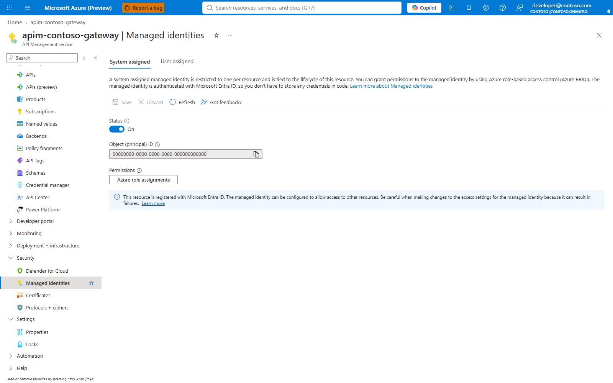

### 2.3 Developers

**No Azure role at all.**

This is the point of the design. A developer's entitlement is *group
membership*, not an RBAC assignment. They need:

| Requirement | Detail |
|-------------|--------|
| Entra ID account in the tenant | guests are fine, see the note below |
| Membership of `claude-code-standard` or `claude-code-premium` | this is the entitlement |
| Ability to run `az login` | no special rights needed |

> **Guest accounts** must sign in with the tenant named explicitly:
> `az login --tenant <tenant-id>`. A bare `az login` lands them in their home
> directory and the gateway rejects the token with `401`.
> If the account has no Azure subscriptions, add `--allow-no-subscriptions`.

### 2.4 Entra directory permissions

Creating the groups and reading their membership needs directory rights that
are separate from Azure RBAC.

| Action | Needs | If you do not have it |
|--------|-------|----------------------|
| Create the two groups | **Groups Administrator**, or tenant self-service group creation | Ask an admin to create them; the wizard reuses groups that already exist |
| Add or remove members | Group **Owner** or Groups Administrator | Ask the group owner |
| `Sync-ClaudeAccess.ps1` reading membership | Your delegated Graph token and permission to read those groups | Guest/restricted-directory policies may require an administrator |

> **What deliberately is *not* used.** Giving the gateway the Graph
> `GroupMember.Read.All` application permission would let APIM resolve group
> membership at request time. That grant needs tenant admin consent and was
> refused in the environment this was built in (`Authorization_RequestDenied`).
> The sync-script approach was chosen because it needs no admin consent at all:
> membership is resolved by a person who can already read the group, and the
> result is written to APIM named values.
>
> The trade-off is that membership changes are **not** instant — they apply when
> the sync runs. The default installer does not create an unattended membership
> schedule. A workload identity needs its own Graph application permission;
> subscription Owner does not grant it. See [Onboarding](ONBOARDING.md#step-3--push-the-change-to-the-gateway)
> and [U17](UNKNOWNS.md) before promising automatic revocation.

**Portal:** Entra ID > Groups > New group / Owners / Members performs directory
changes. APIM > APIs > Named values shows their published result. Directory
edits alone do not publish entitlement.

### 2.5 Everything, as one preflight check

Both setup scripts check the environment before touching anything, and stop with
a specific remedy rather than failing part-way through:

```text
==> Checking prerequisites
    [OK]   Windows PowerShell 5.1.26100.8875
    [OK]   Azure CLI 2.86.0
    [OK]   Azure CLI responds correctly
    [OK]   signed in as admin@contoso.com
    [OK]   Bicep 0.46.1
    [OK]   management.azure.com reachable

    All prerequisites satisfied.
```

Blocking issues stop the run before any change. Warnings continue. Run it on its
own if you just want the report:

```powershell
. ./scripts/Test-Prerequisites.ps1
Test-ClaudePrerequisites -Mode Admin
```

**Manual equivalent:** check each installed tool's version locally, sign in to
the Azure portal and verify the resources/roles above. There is no portal action
that inspects tools installed on your workstation.

To preview the whole plan without creating anything:

```powershell
./Install-ClaudeGateway.ps1 -WhatIf          # macOS/Linux: ./install-claude-gateway.sh --what-if
```

Resolves the resources, checks what you hold, and prints the full plan and every
budget without creating anything.

---

</details>

## 3. Deploy

<details>

<summary>Wizard, projection, company address and portal deployment paths</summary>

### Option A — the interactive wizard (recommended)

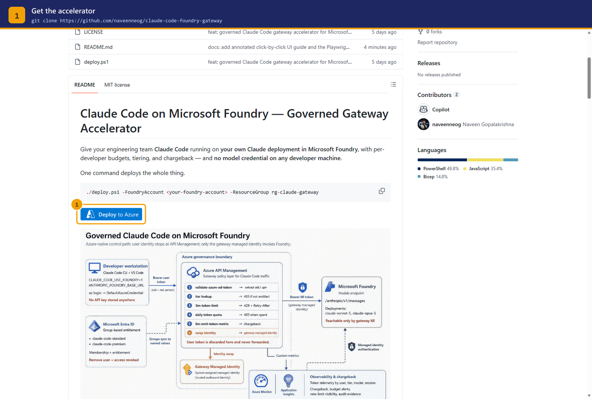

```powershell
git clone https://github.com/naveenneog/claude-code-foundry-gateway
cd claude-code-foundry-gateway

az login
./Install-ClaudeGateway.ps1
```

```bash
# macOS and Linux - needs az and jq
./install-claude-gateway.sh
```

It lists only Foundry accounts that actually have a Claude deployment, asks for
every budget with a default already filled in, and shows a summary before
creating anything. Pressing Enter throughout gives a working, governed
deployment.

**1. Prerequisites, sign-in, and Foundry discovery.** Everything is checked
before anything is touched, and only accounts with a Claude deployment are
offered — here 13 candidates narrowed to one. The search states its estimate
(about 4 s per account) and reports each account as it is read.

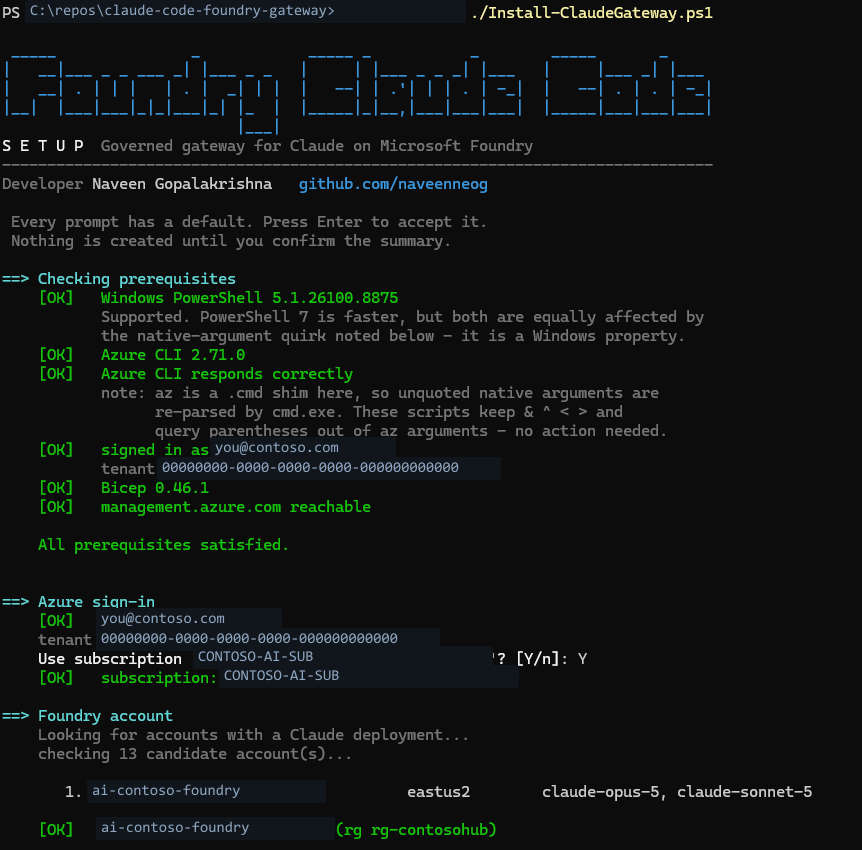

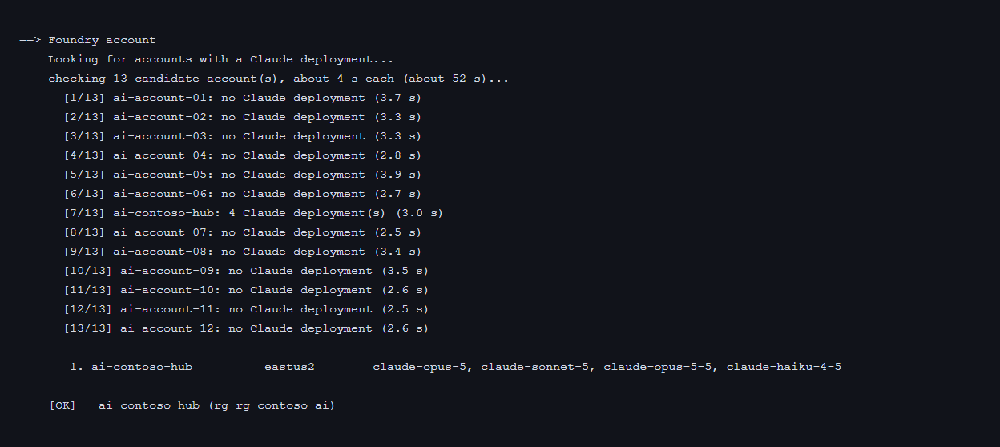

**2. Region and tier, priced.** The region prompt lists the Foundry account's
region and the rest of its geography with each v2 tier's monthly list price
([Region](#region)); the tier prompt repeats the three prices for the chosen
region.


**3. Reuse an existing gateway, or create one.** API Management is the whole
cost of this accelerator, so any v2 instance you already own is offered first,
annotated with whether it already carries the Claude API.

A re-run of an existing named-value gateway without `-EntitlementStore` migrates it to the Cosmos projection: the approval summary says `projection (migrating from named values: deploy, compare, switch)` before any write. `.\Update-ClaudeGateway.ps1 -ResourceGroup <rg> -ApimName <apim>` makes the same move without asking the setup questions again: its plan reuses the gateway's tier groups and values, checks quotas and prerequisites, and lists the resources, network and cost before `-Apply` ([Update and change](UPDATE-AND-CHANGE.md#move-a-named-value-gateway-with-the-update)). `-EntitlementStore named-value` keeps named values for a small organisation within the named-value capacity. A gateway already on the projection stays on the projection; `-EntitlementStore named-value` on it is refused before anything is created, with the rollback steps. A rollback to named values holds only a population within their capacity, about 93 developers in business-unit membership and about 110 per tier list ([Scale](SCALE.md#what-runs-out-first)).

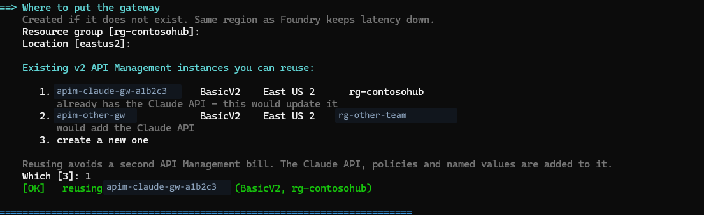

**4. Budgets.** Every prompt has a working default in brackets — Enter accepts
it. These become APIM named values, so they are changeable later without
redeploying.

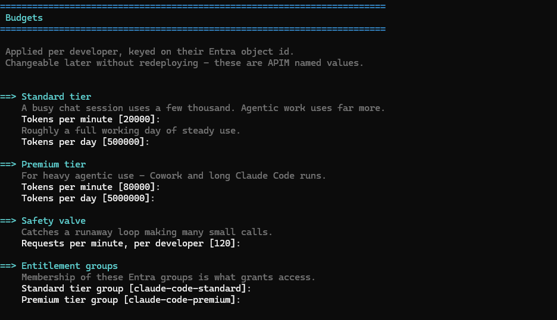

**The choices the wizard asks you to make.** Four of them are not budgets and
are not changeable in the same way, so each is asked with its consequence and,
where it costs money, with the figure at your stated developer count:

| Choice | Options | Why it is asked rather than defaulted |
|---|---|---|
| Revocation window | 15 min / 1 hour / 4 hours | Cache window after a sync. Projection records persist until a sync removes or changes the person; disabled Entra accounts lose access when the current token expires. |
| Team budget | `report` / `stop` | This legacy prompt changes guidance, not a unit's stored mode. The installer preserves `bu-modes`; a missing entry means strict. Configure strict, allowance or notify per unit through [Business units](BUSINESS-UNITS.md#budget-modes) or Turnstile. An enforcing token quota triggers later than the dollar figure suggests because it excludes cache. |
| Unassigned developers | `allow` / `deny` | `deny` on day one refuses people who have done nothing wrong. Start on `allow` and switch when `Get-ClaudeBusinessUnit.ps1` reports zero unassigned. |
| Developer sign-in | `interactive` / `device` / `helper` | How developers authenticate. Written into `claude-gateway.json` and applied by the onboarding script on each machine. |
| Claude Desktop sign-in | `helper-script` / `external-idp-browser` / `external-idp-broker` | How Desktop obtains the bearer token it sends to the gateway. Helper-script is unchanged and needs no app registration. External IdP modes need a Desktop public-client Entra app, consent review and a gateway audience recorded in `external-idp-extra-audience`. |
| Developer address | `azure` / `custom` | Azure keeps the default hostname. Custom asks for the company hostname, supplied certificate and DNS hosting, shows their costs, then configures and proves the address after deployment. A later address change requires redistributed workstation settings ([Company address](#company-address)). |

> [!IMPORTANT]
> **Developer sign-in is one setting for every developer.** A fleet where half
> the workstations authenticate one way and half another has two
> support paths and two sets of symptoms. `device` works on a jump box, in a VDI
> session and over SSH as well as on a laptop, and is
> the only option that works without a browser. `helper` routes every client
> through the credential helper that Claude Desktop uses.
>
> It is changeable later by reissuing `claude-gateway.json` and re-running
> `Onboard-ClaudeDeveloper.ps1`, which is safe to run repeatedly.
> Device-code sign-in needs Conditional Access to allow that flow
> ([Authentication](AUTHENTICATION.md#conditional-access)).

> [!NOTE]
> **Desktop sign-in is separate.** `helper-script` keeps today's Desktop
> behavior: `get-foundry-token` reuses Azure CLI sign-in and the gateway accepts
> only the Foundry data-plane audiences. `external-idp-browser` and
> `external-idp-broker` record Desktop's own Entra sign-in; the workstation setup
> writes it in the key spelling the Desktop release on the machine reads
> ([ADR-0031](adr/0031-client-keys-every-release-reads.md)). The gateway accepts
> the recorded Desktop app audience only when that choice is in
> `claude-gateway.json`. Use `scripts/New-ClaudeDesktopEntraApp.ps1 -WhatIf` to
> review the Entra app registration before creating it.

**5. The summary, before anything is created.** Reusing is called out
explicitly, along with what will and will not be touched. Below the budgets and
groups it lists every choice made above: the entitlement store (with the
resolver's access for the Cosmos projection), the revocation window, the team
budget behaviour, developers with no team, the developer address with the
gateway's hostname (`https://apim-<prefix>.azure-api.net/claude`), the developer
sign-in, and the Claude Desktop sign-in with its app and token type.

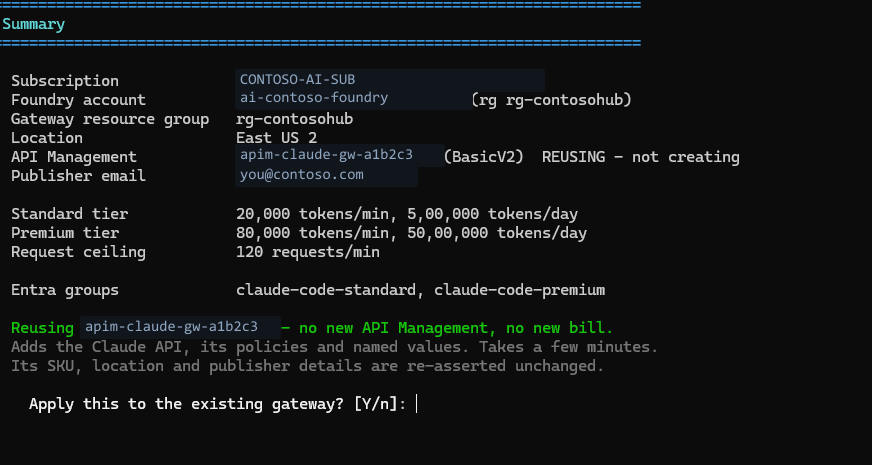


> Identifiers in these screenshots are redacted. The raw captures are not in the
> repository; `guide/redact-terminal.mjs` holds the redaction map.

It then deploys the Bicep template, enables the managed identity, creates the
role assignment, applies the policy, creates the Entra groups, syncs
entitlement, verifies the controls, and writes `onboarding/claude-gateway.json`
— the file your developers' setup script reads.

### Company address

`custom` configures a gateway hostname rather than printing manual steps at the
end. The installer asks for the hostname, certificate source and DNS hosting
with its other choices. The address review appears before the final summary;
declining or using `-WhatIf` makes no address change.
The prompt calls the address "expensive to change afterwards" because deployed
workstations need redistributed settings when the URL changes.

The installer checks an existing `onboarding/claude-gateway.json` against the
selected gateway as soon as the gateway is chosen (after the name prefix), before
the remaining questions and before creating resources. A different gateway,
resource group or recorded subscription is stated with both gateways and the
record path. In a console the installer offers to keep that record as
`onboarding/claude-gateway.<resource group>-<instance>.json` and start a new one
for the selected gateway (default yes); `-ArchiveSavedRecord` does the same
unattended. Otherwise the run stops and leaves the record unchanged; the selected
gateway then needs its own checkout, or the record can be moved first. Under
`-WhatIf` the record is not moved. This check applies to both Azure and
company-address choices and includes legacy subscriptions recorded under the
Foundation decision.
The guided flow's first Setup journal is recognized separately: it has no
gateway identity yet. After approval, it is bound to the selected gateway for
recovery, without publishing a URL until HTTPS proof succeeds.

All three v2 tiers support an uploaded PFX or a Key Vault certificate. None
supports a free API Management managed certificate. Basic v2 and Standard v2
allow one custom gateway hostname; Premium v2 allows multiple
([custom domains](https://learn.microsoft.com/azure/api-management/configure-custom-domain),
[v2 tiers](https://learn.microsoft.com/azure/api-management/v2-service-tiers-overview),
[U30](UNKNOWNS.md#u30--the-company-address--closed-2026-09-28)).

| Choice | What the installer configures |
|---|---|
| `KeyVault` | An existing certificate or its backing secret URL, referenced through the gateway's system-assigned managed identity. The identity receives Key Vault Secrets User on an RBAC vault, or additive secret get/list permissions on an access-policy vault. The vault's firewall, network access and permission model stay unchanged. |
| `Pfx` | A supplied PFX containing the hostname certificate, RSA private key of at least 2,048 bits and certificate chain. The password is a `SecureString`, never a recorded answer. Certificate issuer charges remain separate. |
| `AzureDns` | A CNAME in the selected existing public Azure DNS zone in the same subscription. A new record has TTL 300 seconds; an existing record retains its TTL and metadata. Conditional writes reject intervening edits. No zone or domain is purchased. |
| `External` | The complete CNAME for the DNS provider, followed by a bounded resolution wait. The record points to `<apim>.azure-api.net`. No `apimuid` TXT is required for these supplied-certificate choices. |

The DNS CNAME must resolve before the hostname can be bound. Azure also checks
public ownership: an undelegated zone that answers only at its authoritative
servers is insufficient, including on Basic v2 as measured below. A Key Vault
certificate uses its `application/x-pkcs12` backing secret; a versionless URL
permits rotation, whereas a versioned URL pins that version. Automatic Key Vault
certificate pickup can take 1-2 days
([certificate options and synchronization](https://learn.microsoft.com/azure/api-management/configure-custom-domain)).

The review distinguishes rates from monthly totals. Retail USD prices retrieved
2026-09-28 locally were USD 0.50 per public DNS zone-month for the first 25 zones,
USD 0.40 per million public DNS queries at the first tier, USD 0.03 per 10,000
Key Vault operations, and USD 3 per integrated certificate-renewal request.
An existing DNS zone has no new zone charge; its query usage is still billed.
APIM has no separate custom-domain meter; its existing tier charge continues.
The certificate issuer, domain registrar and external DNS provider are priced
separately, not assumed free. Unavailable prices remain unknown
([Retail Prices API](https://learn.microsoft.com/rest/api/cost-management/retail-prices/azure-retail-prices),
[U30 price evidence](UNKNOWNS.md#u30--the-company-address--closed-2026-09-28)).

The equivalent unattended installer inputs are:

```powershell
.\Install-ClaudeGateway.ps1 -Yes `
  -AddressMode custom -AddressHostname claude.contoso.com `
  -AddressCertificateSource KeyVault `
  -AddressKeyVaultCertificateId https://kv-contoso.vault.azure.net/certificates/company `
  -AddressDnsZoneResourceId '/subscriptions/<sub>/resourceGroups/<dns-rg>/providers/Microsoft.Network/dnsZones/contoso.com'
```

The other installer inputs still select the subscription, Foundry account and
gateway. For PFX, `-AddressPfxPath` selects the file and
`-AddressCertificatePassword` takes a `SecureString`. A different existing
custom hostname on Basic v2 or Standard v2 requires an explicit
`-AddressReplaceHostname`; the review names the old hostname whose callers
will need new settings.

Unattended Foundation resolves inherited company-address inputs before pricing
and passes that exact selection, including `-AddressDnsMode`. An explicit Azure
selection cannot inherit a company address from another local record. Returning
to Azure removes both address metadata copies and stale Foundation address
inputs, and updates generated profiles and onboarding mail to the Azure URL.
PFX validation and hashing use one byte buffer; apply uploads those same bytes
after waiting for DNS, even if the original path has been replaced.

After deployment, DNS is configured and verified, the certificate and Proxy
hostname are applied with an ARM PATCH, and a request uses the company hostname
for SNI and Host. Publication requires a matching, trusted certificate and the
gateway's unauthenticated HTTP 401. This proves routing and TLS, not model
inference or entitlement. Only then does `claude-gateway.json` receive the new
`gatewayUrl`. Existing generated profiles, onboarding mail and copied records
in that package are updated without replacing unrelated settings. Deployed
workstations still need the redistributed package.

DNS waits announce an estimate of 1-10 minutes and default to a 10-minute
timeout. APIM hostname updates announce 5-15 minutes, can take longer, and have
a 45-minute timeout. Progress and elapsed time are printed; a failed proof
leaves the previous developer URL recorded. The default Azure gateway endpoint
remains available
([update duration and default endpoint](https://learn.microsoft.com/azure/api-management/configure-custom-domain)).

Checks run in deadline-bound worker processes, including native Azure reads.
Expiry stops their process trees and removes their private temporary body
directories. Reported elapsed time includes cancellation and cleanup; a late
result cannot count as successful.

If a replacement removed the old hostname before proof failed, a separate
`pendingAddress` receipt records the unverified operation. `-Change address`
can review recovery only when the receipt, gateway, old recorded URL and exact
live hostname collection match. It requires a new fingerprint and publishes
nothing until proof succeeds; unrelated drift still stops the flow.

**Isolated proof, 2026-09-28.** A Basic v2 gateway deployed from `infra/main.bicep`
in 148.0 seconds. The reserved `.test` zone's CNAME answered directly at Azure
DNS in 0.576 seconds. Both uploaded-PFX binding attempts returned
`CustomHostnameOwnershipCheckFailed`, including the attempt after authoritative
DNS became ready. The company SNI request failed TLS; it is not a successful
company-address proof. The isolated Azure endpoint returned its governed 401.
No public domain was available or purchased. All proof resources were deleted
and the soft-deleted APIM instance was purged
([STATUS](status/P69.md#p69-the-company-address-in-the-flow-2026-09-28)).
The lead accepted the positive company-hostname proof as a scope deferral to
P74, not a completed acceptance criterion
([ADR-0033](adr/0033-company-address.md#accepted-scope-deferral-2026-09-28)).

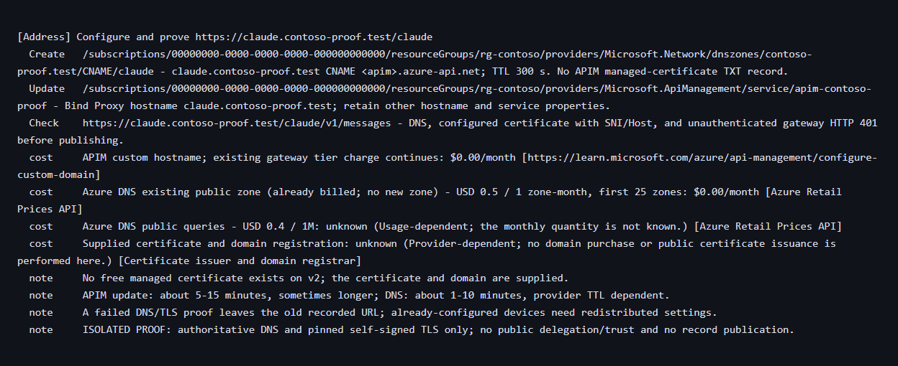

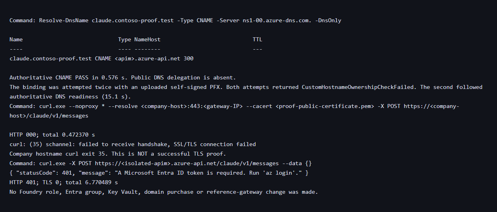

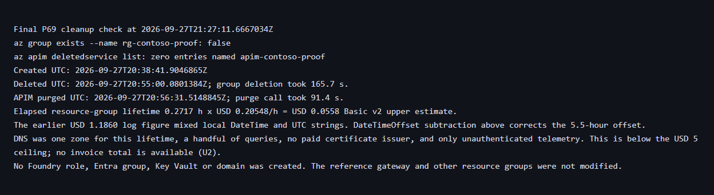

> **That file does not exist until you deploy.** It is not in the repository,
> because it describes your specific gateway. The `onboarding/` folder is
> created by the wizard, and
> [onboarding/README.md](../onboarding/README.md) explains what lands there.
>
> It holds the gateway URL, tenant id, the API Management tier and region, the
> Foundry account name, group names and tier limits — **no secret**. Access is
> Entra group membership, enforced at the gateway, so the
> file is safe to email or put on a share. Someone holding it without being in
> the group still gets `403`.

It ends with numbered next steps. Run on its own in a console, it then offers
the FinOps tool setup (`scripts/Select-ClaudeFinOpsTooling.ps1`), which lists
each tool with its monthly price in the gateway's region; `-ChooseFinOps` opens
it without asking. The guided flow passes `-SkipFinOpsOffer`, because its FinOps
step follows the installer ([Guided flow](GUIDED-FLOW.md#attended-setup)).

Re-runnable, so it is also how you change budgets later.

Unattended:

```powershell
./Install-ClaudeGateway.ps1 -FoundryAccount <account> -Yes
```

Under `-Yes`, an external IdP Claude Desktop sign-in needs
`-DesktopEntraClientId`, and `-DesktopBearerTokenType access_token` also needs
`-DesktopEntraScopes` and `-DesktopEntraAudience`. Without them the installer
stops before its summary, names the parameter and says that nothing was
created. `-DesktopSignInKind` applies whether or not `-AuthMode` is passed;
before P72, passing `-AuthMode` skipped the Desktop section, and the installer
recorded the helper script.

```bash
# macOS/Linux preview or unattended equivalent, from the repository root
./install-claude-gateway.sh --what-if
./install-claude-gateway.sh --foundry-account ai-contoso --yes
```

`install-claude-gateway.sh` ends the same way: run on its own in a terminal, it
offers the FinOps tool through PowerShell 7 (`pwsh`), `--choose-finops` opens it
without asking and `--skip-finops-offer` leaves it out. Under `--yes`, or
without PowerShell 7, the command is a numbered next step instead. Its record,
`onboarding/claude-gateway.json`, holds the tier, the region and the Foundry
account and resource group, as the PowerShell installer's record does.

### Resume after a failure

Both installers keep an install checkpoint for each checkout, from the confirmed
summary until the last step completes
([installer checkpoint design record (ADR-0046)](adr/0046-installer-checkpoint-and-resume.md)). A rerun after a failure
resumes after the last step whose result a live Azure read still shows. A run that
completes removes the checkpoint, so the next run asks every question again
(`Close-ClaudeInstallCheckpoint` in `scripts/ClaudeInstallCheckpoint.ps1`,
`ckpt_close_` in `scripts/install-checkpoint.sh`).

| On a rerun | Behaviour | Source |
|---|---|---|
| Start | The checkpoint path, the run id, each completed step as `done <UTC time>  <step>`, and `resumes at: <step>`. | [output](adr/0046-installer-checkpoint-and-resume.md#14-output) |
| Questions | Recorded non-secret answers are reused without asking. A parameter or flag passed again wins, and the summary's `Checkpoint` row names each answer that changed. Attended, the confirmation reads `Resume from <step>?`; under `-Yes` or `--yes` the run resumes without a question. | [answers and defaults](adr/0046-installer-checkpoint-and-resume.md#6-answers-and-defaults) |
| Completed steps | Skipped only when a live read shows the result (`verified live, skipped`). A missing result runs the step again; an unreadable one refuses, except in the resource group step, which runs again. | [verification before a skip](adr/0046-installer-checkpoint-and-resume.md#7-verification-before-a-skip) |
| Gateway deployment | The deployment name is recorded before `az deployment group create`. A recorded deployment that is still running is awaited for up to 3,600 s; one that succeeded supplies its outputs; one that failed or was cancelled is shown with its error and deployed again, after the read-backs in `Install-ClaudeGateway.ps1`. A new deployment first waits for any running `claude-gw-` or `claude-gateway-` deployment in the resource group, and the run refuses when that list cannot be read. | [deployments](adr/0046-installer-checkpoint-and-resume.md#10-deployments) |
| Changed files | A changed `infra/main.bicep`, or a file it references (`infra/foundry-role.bicep`, `infra/policy.xml`), runs the deployment step again; a changed projection template runs the projection step of `Install-ClaudeGateway.ps1` again. A changed installer alone resumes and prints `checkpoint written by <installer> <version>; running <installer> <version>`. | [binding](adr/0046-installer-checkpoint-and-resume.md#5-binding) |
| Entra groups | Read by the id the checkpoint recorded under the same name, and used only when `az ad group list --display-name <name> --filter "id eq '<id>'"` lists that id under the configured name; otherwise the run refuses and keeps the checkpoint. A lookup by name, `az ad group list --display-name`, lists the groups whose names start with the configured name; the one listed group with as many characters (Unicode code points) as the configured name is reused, and a group is created when none has. A failed lookup, or more than one listed group of that length, refuses and creates nothing. | [receipts](adr/0046-installer-checkpoint-and-resume.md#11-receipts) |
| Other recorded ids | `Install-ClaudeGateway.ps1` reads a recorded role assignment and uses it only when it grants Cognitive Services User on the Foundry account to the gateway's identity; a projection resolver app id from the checkpoint only when its display name is `claude-projection-resolver-<prefix>`; a Desktop client id only when `az ad app show --id` returns that `appId`. Otherwise the run refuses and keeps the checkpoint. | [receipts](adr/0046-installer-checkpoint-and-resume.md#11-receipts) |

`-Restart` (`Install-ClaudeGateway.ps1`) and `--restart` (`install-claude-gateway.sh`)
rename the checkpoint to `install-<key>.discarded-<UTC time>.json` and run as a
first run ([answers and defaults](adr/0046-installer-checkpoint-and-resume.md#6-answers-and-defaults)). `-WhatIf` and
`--what-if` preview a first run and write nothing.

The checkpoint is `install-<key>.json` beside a lock file `install-<key>.lock`;
the key is the first 16 hexadecimal digits of the SHA-256 of the checkout path
([store and location](adr/0046-installer-checkpoint-and-resume.md#1-store-and-location)). It holds answers, step states
and the ids of what the run created or found, and no token, key, password or
connection string ([no secrets](adr/0046-installer-checkpoint-and-resume.md#15-no-secrets)).

| Where the installer runs | Directory |
|---|---|
| Any platform, `CLAUDE_GATEWAY_STATE_DIR` set | that directory; one outside the user's home directory (Linux, macOS) or user profile (Windows) is refused |
| Azure Cloud Shell, storage mounted | `$HOME/clouddrive/.claude-gateway` |
| Azure Cloud Shell, ephemeral session | `$HOME/.claude-gateway` |
| Windows, `Install-ClaudeGateway.ps1` | `%LOCALAPPDATA%\claude-gateway` |
| Linux and macOS, either installer | `${XDG_STATE_HOME:-$HOME/.local/state}/claude-gateway` |
| Windows, `install-claude-gateway.sh` under Git Bash, MSYS2 or Cygwin | none: no checkpoint |

Source: `Get-ClaudeInstallLocation` in `scripts/ClaudeInstallStore.ps1` and
`ckpt_location_` in `scripts/install-store.sh`. A directory the installer
creates is owner-only: a protected access-control list for the current user on
Windows, mode 0700 with 0600 files on Linux and macOS, and each missing parent
directory created with mode 0700. Before either installer reads, locks or
replaces anything in the directory, it checks for a place or a file that another
account could have written or replaced
([file mechanics](adr/0046-installer-checkpoint-and-resume.md#2-file-mechanics)):

- Any platform: a state directory that is not an absolute path inside the home
  directory or user profile (in Cloud Shell, inside `clouddrive` when storage is
  mounted), and a state directory that is itself a symbolic link or junction. The
  installer then uses the directory's real path only.
- Linux, macOS and Cloud Shell outside `clouddrive`: a path the current user does
  not own, a path its group or other users can write, or a path that is a symbolic
  link; and any directory from the one that holds the state directory up to
  `$HOME` that is owned by another user than the current user or root, or that its
  group or other users can write without the sticky bit. A
  `CLAUDE_GATEWAY_STATE_DIR` in a shared directory such as `/tmp` is refused.
- Windows: a path that is a junction or symbolic link, a path owned by an account
  other than the current user, SYSTEM or Administrators, a path with an access rule
  that lets another account write it, including a rule inherited from the parent
  directory, a state directory whose access rules are inherited rather than its
  own, and any directory from the one that holds the state directory up to the user
  profile that is a junction or symbolic link, that another account owns, or that
  lets another account delete, rename or re-permission it or what it holds. A TEMP
  that grants another account `Modify` is such a directory.
- `clouddrive` is exempt: its mount sets the modes, and the Cloud Shell storage
  account's access control applies; only `$HOME` above it is checked.
- `install-claude-gateway.sh` reads no Windows access rules, so under Git Bash,
  MSYS2 or Cygwin it keeps no checkpoint: after the confirmed summary it prints
  `[WARN] on Windows under <uname -s> (Git Bash, MSYS2 or Cygwin) ...`, which names
  `Install-ClaudeGateway.ps1`, and a `Resume:` line with every recorded answer. A
  rerun there starts as a first run with those answers. `Install-ClaudeGateway.ps1`
  is the Windows installer.

A place that fails these checks stops the run when `CLAUDE_GATEWAY_STATE_DIR` names
it, or when it holds this checkout's checkpoint, lock or temporary file, which the
line names with the next step; otherwise the run keeps no checkpoint, prints
`[WARN] <the failed check> This run keeps no install checkpoint.` and a `Resume:`
line with every recorded answer, and continues on its live checks
([store and location](adr/0046-installer-checkpoint-and-resume.md#1-store-and-location)).

**Azure Cloud Shell.** The installers detect Cloud Shell by
`AZUREPS_HOST_ENVIRONMENT` beginning `cloud-shell/` or a non-empty `ACC_CLOUD`
([U64](UNKNOWNS.md#p91-research-before-implementation)). The checkpoint is in
`clouddrive` when storage is mounted; otherwise it is in the session's `$HOME`,
and the full resume command is printed.

- `clouddrive` persists across sessions. Principals with sufficient access rights
  in the subscription can read the file share
  ([Persist files in Cloud Shell](https://learn.microsoft.com/azure/cloud-shell/persisting-shell-storage#securing-storage-access)).
- In an ephemeral session, `$HOME` is deleted when the session ends
  ([Cloud Shell FAQ](https://learn.microsoft.com/azure/cloud-shell/faq-troubleshooting)).
  At the confirmed summary the run prints `[WARN] Cloud Shell without clouddrive
  (...)` and a `Resume:` line that passes every recorded parameter answer;
  the PowerShell installer also names the prompt-only answers that a new session
  asks again ([output](adr/0046-installer-checkpoint-and-resume.md#14-output)).
- Cloud Shell ends a session after 20 minutes without interactive activity
  ([Cloud Shell FAQ](https://learn.microsoft.com/azure/cloud-shell/faq-troubleshooting)).
  Before the gateway deployment, and before any wait longer than 60 s, the run
  prints one line: that fact; that the checkpoint and the ARM deployment outlive the
  session, or, without `clouddrive`, that the ARM deployment outlives it and this
  checkpoint does not, or, without a checkpoint, that this run keeps none; and the
  resume command ([deployments](adr/0046-installer-checkpoint-and-resume.md#10-deployments)).

**Refusals.** A refusal is one line on standard error that begins `Refused:`,
says what it left unchanged, and exits 1 ([output](adr/0046-installer-checkpoint-and-resume.md#14-output)). A secret
that a refusal or failure line quotes, such as one in an Azure CLI error, is printed as `[redacted]` by the
rules of `-Preflight`; Azure CLI draws no progress indicator while the run reads its error output, so the
gateway deployment shows no spinner ([ADR-0047](adr/0047-lean-installer-phase-0.md) decision 12). Each refusal
below ends with the command that resumes the run or discards the checkpoint, except
the last two: a name with a single quote is refused before the summary, and the last
names the other installer:

| Cause | What the line names | Source |
|---|---|---|
| The checkpoint is bound to another tenant, subscription, resource group, gateway or `reusedApim`, or was written by the other installer | the field, the recorded value and this run's value | [binding](adr/0046-installer-checkpoint-and-resume.md#5-binding), [resume across installers](adr/0046-installer-checkpoint-and-resume.md#13-resume-across-installers) |
| The checkpoint cannot be read: not JSON, another `schema` or `schemaVersion`, an unknown step id, an unsafe answer, or a receipt value of another shape | the reason; the file is kept unchanged | [file mechanics](adr/0046-installer-checkpoint-and-resume.md#2-file-mechanics) |
| The state directory, checkpoint or lock could have been written by another account, and `CLAUDE_GATEWAY_STATE_DIR` names the directory or a file of this checkout is there | the path and the owner, mode or access rule; nothing was read or changed; for a file of this checkout, the file and the next step | [store and location](adr/0046-installer-checkpoint-and-resume.md#1-store-and-location), [file mechanics](adr/0046-installer-checkpoint-and-resume.md#2-file-mechanics) |
| Another run holds the lock | its host, process id and start time, and when a later run takes the lock over | [lock](adr/0046-installer-checkpoint-and-resume.md#3-lock) |
| A live read fails for a step that is not idempotent | the step and the first sentence of the error | [verification before a skip](adr/0046-installer-checkpoint-and-resume.md#7-verification-before-a-skip) |
| A recorded deployment still runs after the wait | the deployment and resource group | [deployments](adr/0046-installer-checkpoint-and-resume.md#10-deployments) |
| An Entra group this run created is not returned by Microsoft Graph | the group, its id and creation time; a group created moments ago can take time to appear in Microsoft Graph, and a rerun later continues without creating a second group | [receipts](adr/0046-installer-checkpoint-and-resume.md#11-receipts), [U74](UNKNOWNS.md#p91-research-before-implementation) |
| An Entra group cannot be looked up by name, or more than one group has the name | the group name and the error, or the ids of the groups with that name | [receipts](adr/0046-installer-checkpoint-and-resume.md#11-receipts) |
| A tier group name, or the name prefix of `Install-ClaudeGateway.ps1`, holds a single quote, which Azure CLI would place inside an OData string literal (`startswith(displayName,'<name>')`) | the parameter and its value; a recorded one makes the checkpoint corrupt (second row) | [receipts](adr/0046-installer-checkpoint-and-resume.md#11-receipts) |
| `install-claude-gateway.sh` would deploy again over an API Management instance this run did not create | `Install-ClaudeGateway.ps1 -ExistingApimName`, which reads the named values back first | [steps of the bash installer](adr/0046-installer-checkpoint-and-resume.md#9-steps-of-install-claude-gatewaysh) |

The guided flow's resume of the steps after the installer is separate
([Guided flow](GUIDED-FLOW.md#resume-after-failure)).
### Answers file, preflight and selected steps

Both installers read one answers file, check it and the estate before anything changes, run selected
steps and write a progress stream
([lean installer design record (ADR-0047)](adr/0047-lean-installer-phase-0.md)).

The form-based installer UI uses the same schema and installer interfaces. It starts with
`node .\tools\installer-ui\server.mjs`, opens locally or through Cloud Shell Web preview, and has a
static `file://` fallback that writes `answers.json` and commands
([Installer UI](INSTALLER-UI.md)).

| Option (PowerShell / bash) | What it does |
|---|---|
| `-AnswersPath <file>` / `--answers-file <file>` | Reads the answers from a JSON file that [`schemas/claude-gateway.answers.schema.json`](../schemas/claude-gateway.answers.schema.json) describes. A file with any problem stops the run on one line before any Azure resource is read: the number of problems, the first problem with its remedy, and the command that lists every problem, `./Install-ClaudeGateway.ps1 -Preflight -AnswersPath '<file>'` or `./install-claude-gateway.sh --preflight --answers-file '<file>'` (`scripts/ClaudeInstallerAnswers.ps1:398-426`, `scripts/install-answers.sh:41-64`). A parameter or flag passed with it wins over the file, and the file wins over the install checkpoint. |
| `-Preflight` / `--preflight` | Runs 14 read-only checks and stops. Each check is PASS, FAIL or NOT-RUN with a reason, and each FAIL has a remedy; the exit code is 0 only when nothing fails and no check is NOT-RUN for `not-signed-in`, `prerequisite-failed` or `not-evaluated`, the reason a check starts with until a branch evaluates it (`Install-ClaudeGateway.ps1:174-180`, `scripts/install-preflight.sh:222-286`, [ADR-0047](adr/0047-lean-installer-phase-0.md) decision 5). A JWT, `Bearer <token>` or a named secret such as `sig=` or `password:` that a message or remedy quotes is printed as `[redacted]` (ADR-0047 decision 12). `-Json` / `--json` prints the result as JSON with `schemaVersion` 1. |
| `-ListSteps` / `--list-steps` | Prints each step with its title, prerequisites and the state the install checkpoint records, without an Azure call (`scripts/ClaudeInstallSteps.ps1:142-157`, `scripts/install-steps.sh:111-130`). `-Json` / `--json` prints JSON. |
| `-Steps <ids>` / `--steps <ids>` | Runs only the named steps. Each prerequisite outside the list is completed in the checkpoint and verified live, or the run stops on one line naming it (`scripts/ClaudeInstallSteps.ps1:103-131`, `scripts/install-steps.sh:87-108`). An id that names no step stops the run on one line that lists the steps and names `-ListSteps` / `--list-steps` (`scripts/ClaudeInstallSteps.ps1:72-82`, `scripts/install-steps.sh:60-67`). |
| `-ProgressPath <file>` / `--progress-file <file>` | Appends one JSON object per line: `schemaVersion`, `time` (UTC), `runId`, `stepId`, `event`, `message` and `resumeCommand` (`scripts/ClaudeInstallSteps.ps1:29-38`, `scripts/install-steps.sh:24-31`). A secret in a message or resume command is written as `[redacted]`, by the rules of `-Preflight`. A file that cannot be written, such as a directory, stops the run on one line before any Azure call, and the line ends "Give a writable file path, or run without -ProgressPath." (`scripts/ClaudeInstallSteps.ps1:19-27`, `scripts/install-steps.sh:142`). |

An answers file names each answer by its installer parameter, and both installers read this one:

```json
{
  "schemaVersion": 1,
  "SubscriptionId": "00000000-0000-0000-0000-000000000000",
  "FoundryAccount": "ai-contoso",
  "FoundryResourceGroup": "rg-ai-contoso",
  "ResourceGroup": "rg-claude-gateway",
  "NamePrefix": "contosogw",
  "PublisherEmail": "ops@contoso.com",
  "Sku": "BasicV2"
}
```

```powershell
./Install-ClaudeGateway.ps1 -AnswersPath ./answers.json -Preflight
./Install-ClaudeGateway.ps1 -AnswersPath ./answers.json -Yes -ProgressPath ./install-progress.ndjson
./Install-ClaudeGateway.ps1 -ListSteps -Json
```

```bash
./install-claude-gateway.sh --answers-file ./answers.json --preflight --json
```

`Install-ClaudeGateway.ps1` also applies `BusinessUnits`: it writes the units, then the teams, through
`scripts/Set-ClaudeBusinessUnit.ps1`, and prints the `scripts/Sync-ClaudeUsdBudgets.ps1` command when a
dollar budget is enforced (`scripts/ClaudeInstallSteps.ps1:175-227`). Each unit's Entra group is found by
its exact name, from the answers file or at the prompt: one group of that name is reused, none is created,
and two of that name or a failed read stop the answers' step with the resume command, or at the prompt skip
that unit with a remedy (`scripts/ClaudeInstallSteps.ps1:159-173`, `:195-197`; `Install-ClaudeGateway.ps1:1795-1800`).
At the prompt, a group name with a single quote, a comma, a colon or one of `& | < > ^ " % ( )`, which `cmd.exe`
re-reads in an Azure CLI argument on Windows, is refused with the schema's message and remedy before any Azure CLI call, and the prompt asks for the next unit (`Install-ClaudeGateway.ps1:1783-1791`).
A team names its unit as `parent`, and an `Allowance` unit takes `percent`:

```json
"BusinessUnits": [
  { "id": "finance", "group": "claude-bu-finance", "monthlyUsdBudget": 5000, "mode": "Strict" },
  { "id": "finance-emea", "group": "claude-bu-finance-emea", "parent": "finance", "monthlyUsdBudget": 1000, "mode": "Allowance", "percent": 50 }
]
```

`install-claude-gateway.sh` applies no business units, so it refuses an answers file that holds
`BusinessUnits` (`scripts/install-answers.sh:44-52`).
No answers file holds a secret: `AddressCertificatePassword` is passed as a parameter when the
installer runs, or typed at its prompt, and a file that names it is refused
(`schemas/claude-gateway.answers.schema.json`, `x-secrets`).

### Option B — non-interactive script

The interactive installer's projection flags are separate from `deploy.ps1`:
`-DeployProjection` and `-FlipProjectionAfterCleanCompare` remain accepted for existing scripts. Since P98, they do not change installer behavior: choosing `-EntitlementStore projection` deploys the projection, compares it, and switches through the shared switch.
Since P104 the sync job deploys with the projection: `-ProjectionSyncInterval` takes `30m`, `1h`, `2h` (default), `3h`, `4h`, `6h`, `8h`, `12h`, `manual` or `none`, a re-run keeps the deployed job's interval, and `-DeploySyncJob` is accepted and has no effect ([ADR-0058](adr/0058-scheduled-projection-sync.md)).

A staged deployment without switching uses the deployer directly, not the installer:

```powershell
./scripts/Deploy-ClaudeProjection.ps1 `
  -ResourceGroup <rg> -ApimName <apim> -NamePrefix <prefix> `
  -Location <region> -Sku BasicV2 -ResolverInboundAccess public `
  -StandardGroup <standard-group> -PremiumGroup <premium-group>

./scripts/Deploy-ClaudeProjection.ps1 `
  -ResourceGroup <rg> -ApimName <apim> -NamePrefix <prefix> `
  -StandardGroup <standard-group> -PremiumGroup <premium-group> `
  -FlipAfterCleanCompare
```

The first command deploys and compares while named values remain authoritative. The second command switches only after the shared switch checks pass.
switches right after a clean deploy comparison, with no 60-90 minute wait. The optional sync job deploys separately
with `scripts/Deploy-ClaudeProjectionRenewal.ps1` for very large directories. The read-only preflight normally takes 30-90 seconds, including
the 25-second Graph interval. [Private projection](SECURE-PROJECTION.md#one-command-deployment)
contains the `-PreflightOnly` command and admin registration steps;
[ADR-0040](adr/0040-projection-preflight-and-switch.md) records the preflight and
[ADR-0050](adr/0050-projection-switch-function.md) the switch.
Sources: `Install-ClaudeGateway.ps1:63-67,125-128`, `scripts/Deploy-ClaudeProjection.ps1:52-57`.

```powershell
./deploy.ps1 -FoundryAccount <your-foundry-account> -ResourceGroup rg-claude-gateway
```

Takes explicit parameters without prompting, wraps the same Bicep, and — like
the wizard — creates the Entra groups and runs the entitlement sync. Use it if
you are scripting against the accelerator; use `Get-Help .\deploy.ps1 -Full`
for this script's parameters rather than assuming every wizard option exists.

It does **not** write `onboarding/claude-gateway.json`, the file your developers'
setup script reads. Only the wizard writes that. Run the wizard once afterwards
to produce it; it is re-runnable and will reuse what `deploy.ps1` created:

```powershell
./Install-ClaudeGateway.ps1 -FoundryAccount <account> -Yes
```

### Option C — portal

Use the **Deploy to Azure** button in the README. You supply the Foundry account
name; everything else is defaulted.

The button deploys the template only. Three things the wizard does are left to
you:

```powershell
# 1. create the two tier groups, if they do not exist
az ad group create --display-name claude-code-standard --mail-nickname claude-code-standard
az ad group create --display-name claude-code-premium  --mail-nickname claude-code-premium

# 2. push membership to the gateway
./scripts/Sync-ClaudeAccess.ps1 -ApimName <apim> -ResourceGroup <rg>

# 3. write the developer handover file
./Install-ClaudeGateway.ps1 -FoundryAccount <account> -Yes
```

Step 3 is the wizard again. Explicitly select the existing instance and review
its plan rather than assuming unattended discovery chose the intended gateway.

**Without the scripts, finish the same three tasks in the portal/manual path:**

1. Entra ID > Groups > New group > Security. Create or reuse both tier groups,
   then Members > Add members. Check transitive membership for nested teams.
2. APIM > APIs > Named values > `allow-premium` / `allow-standard` > Edit.
   Populate comma-delimited object IDs, including leading/trailing commas,
   with premium taking precedence. This is a one-time manual publication, not
   an automatic sync; use [Onboarding](ONBOARDING.md) for the durable workflow.
3. Resource group > Deployments > the completed deployment > Outputs provides
   the gateway URL. Entra ID > Overview gives the tenant ID. Create
   `onboarding/claude-gateway.json` using the
   [handover schema](../onboarding/README.md), matching your actual names,
   models, sign-in mode and limits. No Azure portal blade generates this file.

Then publish the reporting functions/workbook using [Monitoring](MONITORING.md#7-dashboard)
and complete all verification below. The template button alone is not a
completed developer rollout.

### What gets created

| Resource | Purpose | Rough cost |
|----------|---------|-----------:|
| API Management, Basic v2 | the gateway | ~$150/mo |
| Application Insights | metrics and identity traces | usage-based |
| Log Analytics workspace | backing store for the above | usage-based |
| 2 Entra groups | entitlement | free |

> Basic v2 has no VNet integration. Standard v2 supplies outbound VNet
> integration; Premium v2 adds zone redundancy. Neither is a multi-region
> deployment. Do not select classic Premium here to obtain multi-region:
> the Anthropic token policies require v2. See [Decisions](DECISIONS.md).

### Already have a v2 API Management instance?

API Management is essentially the whole cost of this accelerator, so the wizard
looks for v2 instances you already own and offers to reuse one:

```text
    Existing v2 API Management instances you can reuse:

       1. apim-contoso-claude     BasicV2    East US 2      rg-contoso-claude
          already has the Claude API - this would update it
       2. apim-contoso-shared     BasicV2    East US 2      rg-contoso-shared
          would add the Claude API
       3. create a new one
```

Reuse is additive. It adds the Claude API, its policies, named values and a
logger, and does not modify the instance itself — no SKU change, no identity
change, and no change to TLS or networking settings.

An ARM `PUT` asserts a whole resource, so a template that re-declared the
service would reset every property it does not mention. Checked with `what-if`
against a live gateway, that meant `customProperties` being cleared, which
re-enables TLS 1.0, TLS 1.1 and SSL 3.0, along with the NAT gateway switched
off and both developer portals switched on. The template therefore only writes
the service when it creates it.

Two constraints:

- **It must be a v2 SKU.** Classic tiers attach the policies without complaint
  but meter zero Anthropic tokens, so every budget reads as zero usage forever.
  Only v2 instances are listed.
- **The deployment follows the instance.** The API and named values are parented
  to API Management, so the wizard switches to that instance's resource group
  and region and tells you it has done so.

To update a known gateway without the menu, name it:
`./Install-ClaudeGateway.ps1 -ExistingApimName <apim> -ResourceGroup <rg>`. The
installer takes the same reuse path, keeps the instance's region, tier, name and
publisher, and does not ask for them; it refuses an instance that is not found or
is not a v2 tier. The guided flow's `-Change foundation` runs it this way
([Guided flow](GUIDED-FLOW.md#attended-setup)).

On Windows the Azure CLI is `az.cmd`, and `cmd.exe` re-reads
`& | < > ^ ( ) " %` in an argument. The installer checks the parameters it was
given that reach `az` (subscription, Foundry account and group, gateway group,
region, name prefix, existing gateway name, publisher email, tier groups, and
the Desktop client id and audience) right after its prerequisites, before its
first `az` call that uses one. It checks again before its summary, covering the
values it adopted from a reused gateway and the Desktop gateway audience it
derived. Either check stops the installer, naming the value; nothing has been
created at that point. The organisation details for a first Claude deployment
are not checked: they go to Azure in a JSON body.

Re-running against a gateway you already set up is the supported way to update
policies or budgets. Live state is preserved: the wizard reads the current
`allow-standard`, `allow-premium`, `quota-overrides`, `bu-registry`,
`bu-members` and `bu-parents` values off the gateway and passes them back, so a
redeploy cannot silently revoke anyone or empty the chargeback registry. Each of
those template parameters defaults to `,,`, so omitting one does not preserve
it — it clears it.

---

</details>

## 4. Verify before announcing

<details>

<summary>Governance tests, v2 tier proof and bypass audit</summary>

Use an entitled test identity and an agreed change window. The governance
check sends model requests and its throttle test temporarily changes limits;
`-SkipThrottleTest` leaves that live limit untouched but does not prove throttling.

```powershell
./scripts/Show-Governance.ps1 -ApimName <apim> -ResourceGroup <rg>
```

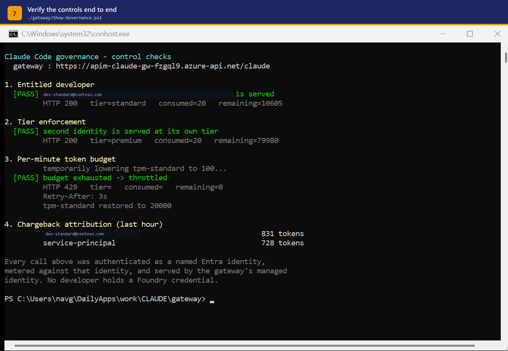

Four things must pass:

| # | Control | Failure means |
|---|---------|---------------|
| 1 | Identity — unlisted callers rejected | anyone in the tenant can use your model budget |
| 2 | Tiering — the right limits per group | tiers are decorative |
| 3 | Rate limit — 429 with `Retry-After` | budgets are not enforced |
| 4 | Chargeback — tokens attributed per user | you have a bill you cannot allocate |

Full command reference: [GOVERNANCE-CHECKS.md](GOVERNANCE-CHECKS.md).

**Portal/manual:** APIM > Overview confirms the tier; APIs > Claude API >
Policies and Named values confirm configuration; the linked workbook confirms
observed usage. Run a developer request as well: those blades cannot prove
the developer's credential, streaming path or budget refusal.

In **APIs**, select **Claude on Foundry (governed)**, the API display name emitted
by this template, then **All operations**. Inspect **Inbound processing** and
open the policy code editor to review the token, entitlement and quota policies.
Do not select **Save** merely to inspect the policy. If the API was renamed,
identify it from its `claude-foundry` API ID and `/claude` path first.


### 4.1 Confirm the tier is v2

```bash
az apim show -g <rg> -n <apim> --query "sku.name" -o tsv
# expect: BasicV2, StandardV2 or PremiumV2
```

This is the most common silent failure. On a classic tier the policies attach,
the API returns 200, and every token count is **zero**, so none of the budgets
above ever trigger.

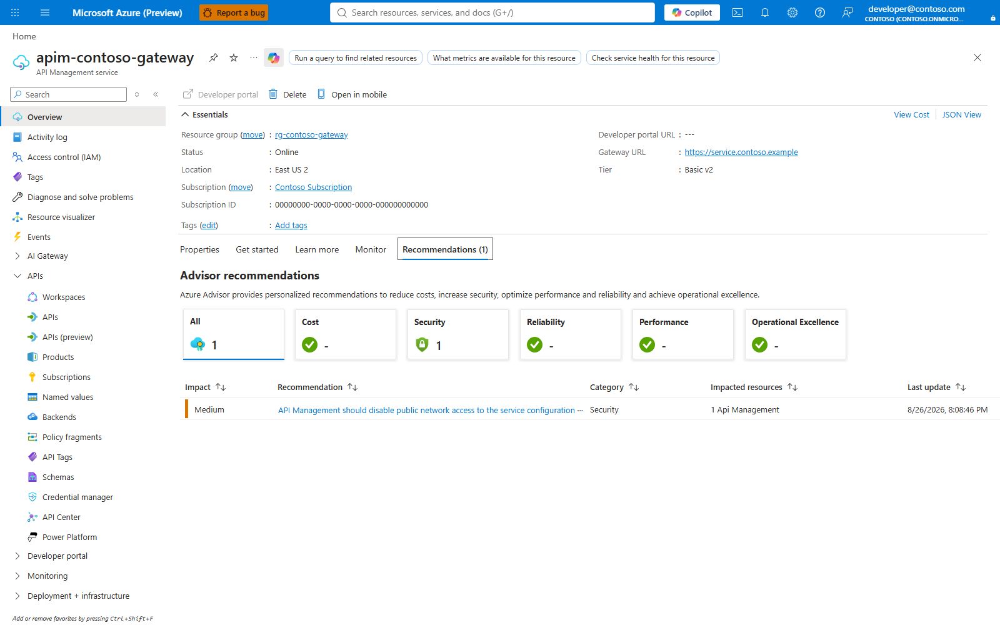

### 4.2 Close the bypass

```powershell
./scripts/Get-ClaudeBypass.ps1
```

It lists every principal that can reach Foundry without passing through the
gateway, excludes the gateway's own managed identity, and exits non-zero when it
finds one, so it can run as a check rather than only as a report.

The gateway only governs traffic that goes *through* it. Someone holding
data-plane access directly on the Foundry account can point Claude Code at the
endpoint and skip all of it: the group entitlement check, the per-developer and
per-business-unit budgets, the organisation-wide spend ceiling, and the
restriction on which models may be called.

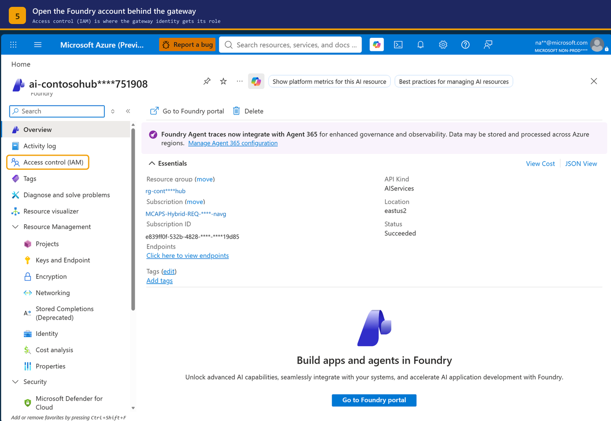

Checking one role name by hand is not enough, for two reasons.

**More than one role grants it.** The audit reads each assigned role's
`dataActions` rather than matching names, because the set changes. On the
reference deployment four roles grant Cognitive Services data actions, and
**`Foundry User` grants the same `Microsoft.CognitiveServices/*` as `Cognitive
Services User`** — a hand check for one name reported clean while three
`Foundry User` assignments were live.

**Inherited assignments count.** A role granted at subscription or resource group
scope still applies to the Foundry account and does not appear unless you ask for
it. The audit passes `--include-inherited`; a hand check usually does not.

Findings are graded. `full` means `Microsoft.CognitiveServices/*` — a bypass.
`partial` means data actions scoped to some paths, where whether the Anthropic
route is covered depends on the role, so it is reported for review rather than
asserted. `read` is read-only data-plane access, shown with `-IncludeRead`.

Removing one:

```bash
az role assignment delete --assignee <principal-id> \
  --role "<role name>" --scope <scope shown by the audit>
```

Use the scope the audit reports, not the Foundry account id: an inherited
assignment has to be removed where it was granted.

**Portal:** Foundry account > Access control (IAM) > Role assignments. Include
inherited entries and inspect each role's data actions. Remove an unintended
assignment at its displayed subscription/resource-group/account scope; keep the
gateway identity's grant. Repeat the audit and an end-to-end gateway request.
Also review Foundry key access/local authentication and network exposure: an
RBAC-only audit does not prove an old API key cannot bypass the gateway.

> Read each principal before removing it. A deployment pipeline, Defender, or
> another application may hold the assignment legitimately. The finding is that
> the access is ungoverned, not that it is wrong.

---

</details>

## 5. Next

| Task | Guide |
|------|-------|
| Give a developer access | [Onboarding guide](ONBOARDING.md) |
| Watch usage and cost | [Monitoring guide](MONITORING.md) |
| Something is broken | [Debug guide](DEBUGGING.md) |
| Justify this to a stakeholder | [Foundry vs direct Anthropic](COMPARISON.md) |
