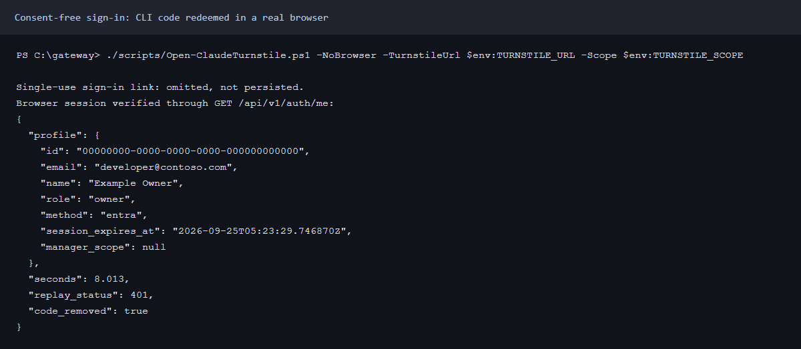
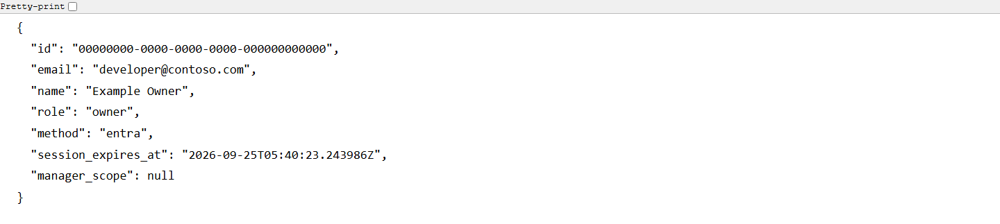
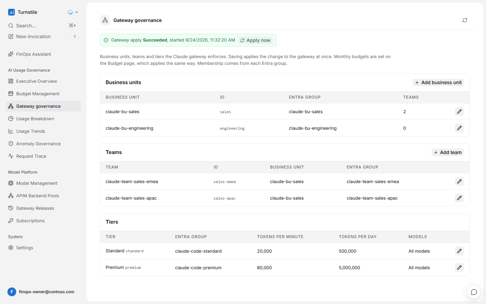
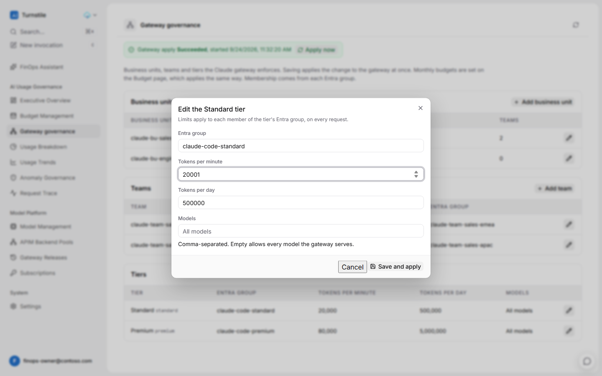
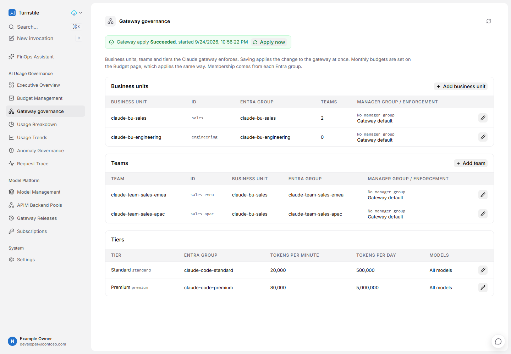
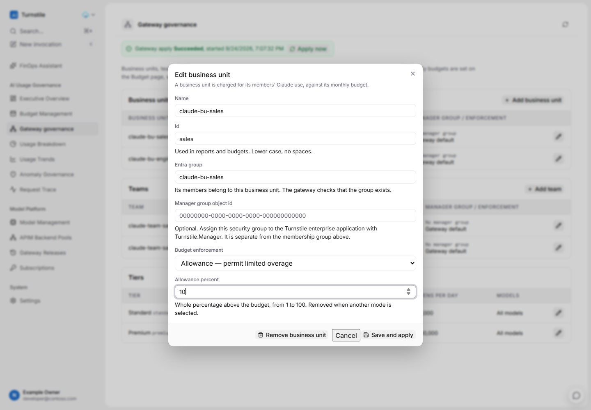
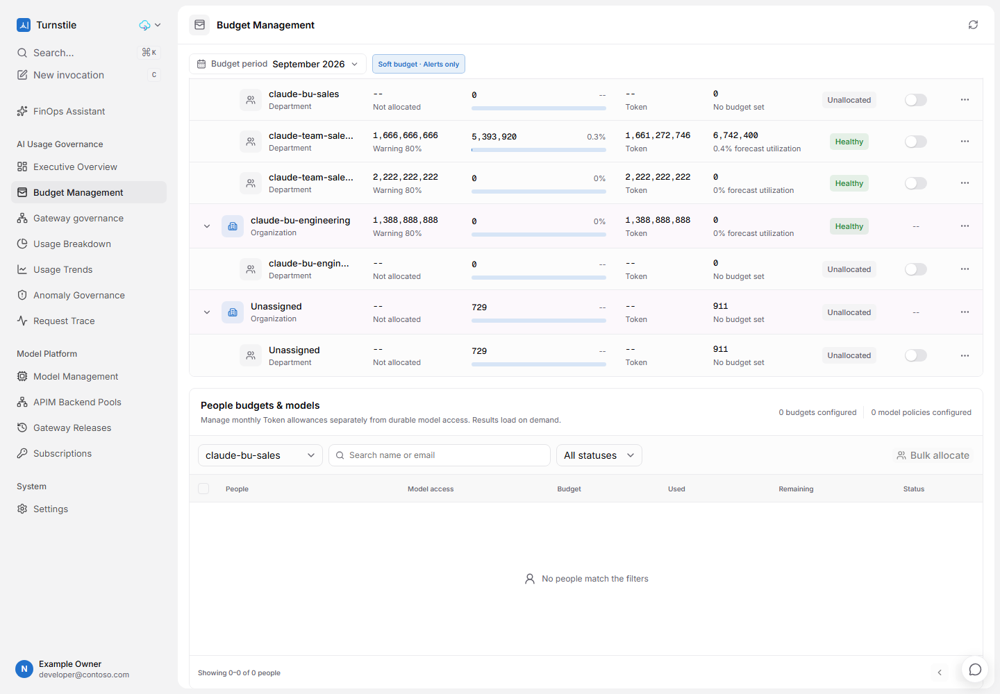

# Govern Claude usage in Turnstile

[Turnstile](https://github.com/xuleihive/turnstile) is an open-source (MIT) FinOps console for AI
usage: organizations, departments, people, budgets, usage breakdowns and request traces. This
article connects it to the Claude gateway, so that:

- the business units, teams and budgets you manage in the gateway appear in Turnstile;
- every Claude request, and every hour of cache reads, is accounted for there, per person;
- if you choose, budgets are edited on Turnstile's budget page and enforced by the gateway;
- or, if you choose, business units, teams, their Entra groups, budgets and tier limits are all
  managed on Turnstile's pages, and each save reaches the gateway in about two minutes.

It uses a fork, [naveenneog/turnstile](https://github.com/naveenneog/turnstile), branch
`claude-gateway`, which adds Microsoft Entra admin-only sign-in, an enterprise catalog API and a
deployer that runs on Windows. See [The fork](#the-fork).

Every command, result and figure on this page was measured on 2026-09-23 and 2026-09-24 against
the reference gateway and a Turnstile deployment in Central US. People, tenant and unit names in the pictures
are replaced by example ones: the units are `sales` (teams `sales-emea`, `sales-apac`) and
`engineering`.

## Live evidence and sign-in without additional grants

For numbered Azure portal/application-GUI steps and equivalent commands, see
[Turnstile manual operations](manual/turnstile.md). The copied portal profile now supplies
live application Overview, Expose an API, App roles and enterprise Properties screenshots.
Users and groups reached a sign-in prompt, so further portal capture stopped without
attempting authentication. That missing view is not replaced by a claimed portal screenshot.

The pictures below are fresh captures from the **reference deployment**, not examples copied
from upstream Turnstile. Names, email addresses, tenant/object ids and resource names are
replaced **before pixels are saved**. Charts keep their measured values. This is why the
people and units look like examples. The [capture manifest](guide/turnstile-captures.json)
records each image's UTC capture time, actual route or command, identity kind, fork and
accelerator revisions, redaction check and image SHA-256.

These captures use the signed-in operator's existing `Turnstile.Admin` assignment and the
pre-authorized Azure CLI. They do not request admin consent, a new directory role or a new
user. An operator who cannot obtain further grants can use:

```powershell
./scripts/Open-ClaudeTurnstile.ps1 -NoBrowser `
  -TurnstileUrl https://<turnstile-api>.azurewebsites.net `
  -Scope api://<turnstile-client-id>/Turnstile.Manage
```

Open the returned single-use link within 60 seconds. The browser redeems it, removes
`login_code` from the address, and establishes an Entra session. The link and access token
are not published in the captures. This is not the Microsoft button: that button's
tenant-wide consent requirement remains unresolved in the reference tenant.



*Captured live from the reference deployment on 2026-09-24; names replaced.*



*Captured live from the reference deployment on 2026-09-24; names replaced. This is the
server's profile response, not a fabricated Settings panel.*

### Evidence boundaries

- Phase 1 captures are the **Owner's** view. They are not claimed as Viewer or Manager
  evidence. Phase 2's manager-only browser journey is prepared but waits for an exclusive
  operator-authorized window; it must not interrupt another administrator's saves.
- The Entra overview, exposed API, app-role and enterprise Properties images are now
  **live Azure portal captures** from the copied, already-authenticated profile. The
  manifest distinguishes `owner_portal` from CLI command output. Users and groups remains
  a read-only preflight capture, not a portal picture or a membership mutation.
- The older screenshots of exhausting a real team's budget and revoking the admin
  assignment are superseded by safe live health/preflight captures. Those destructive
  historical experiments were **not replayed** for this recapture. Their earlier measured
  results remain historical results in the tables below.
- The reversible Owner journey changes only the Standard tier's tokens per minute by
  **+1**, saves through the UI, reads the resulting named value with `az`, then restores
  through the UI and verifies the original value. It never lowers a real team's budget
  to force a refusal. Catalog and budget definitions are compared before and after.

To reproduce with your existing access, set `TURNSTILE_URL`, `TURNSTILE_SCOPE`,
`TURNSTILE_APP_ID`, `TURNSTILE_SP_ID`, `TURNSTILE_FORK_COMMIT`, `GATEWAY_RG` and
`GATEWAY_APIM`, then run `npm ci` and `node guide/capture-turnstile-live.mjs`.
After the restore job succeeds, `node guide/verify-turnstile-live.mjs` checks the saved
baseline again and captures the successful restored state and readable live profile.
Private evidence stays in the ignored `.finops-evidence/p53` directory. The default
`node guide/capture-turnstile-manager.mjs --dry-run` checks current ownership, membership
and existing assignments **without changing any of them**. Execution requires both
`--execute --lead-go`, only after the lead authorizes it; recovery runs in `finally`.
`tests/Test-Screenshots.ps1` rejects missing, undated, non-live or changed-pixel evidence
and runs mutations proving those failures are detected.

## One enforcer

The gateway enforces. Turnstile shows, and optionally edits. Keep it that way.

- A developer's request never passes through Turnstile. No Turnstile outage, slow query or
  misconfiguration can refuse or delay a Claude call.
- Access, tier quotas and business-unit and team budgets are decided by the gateway's policy on
  every request, from its named values, as described in [BUSINESS-UNITS.md](BUSINESS-UNITS.md).
- A change made in Turnstile reaches developers only through the gateway's named values: a
  budget written back into `bu-registry` by `Sync-ClaudeTurnstileGovernance.ps1 -Direction
  FromTurnstile -Apply` ([step 7](#7-optional-edit-budgets-in-turnstile)), or, when governance is
  authored in Turnstile, whatever its pages save, written by the gateway's apply job
  ([Manage everything in Turnstile](#manage-everything-in-turnstile)). The gateway enforces it on
  the next request.

Turnstile can enforce budgets itself, for traffic routed through its own API Management policy.
Claude traffic is not routed that way, so Turnstile's budget page shows **Soft budget · Alerts
only** for it. Two enforcers would give two answers to "is this person over budget", and the
answer that refuses requests must be the gateway's, because the gateway also enforces tiers and
access that Turnstile does not know about. The decision is recorded in
[ADR-0014](adr/0014-turnstile-beside-the-gateway.md).

## How it fits together

```text
             Microsoft Entra ID (single tenant)
               │ developer token           │ admin sign-in: assigned users only,
               ▼                           ▼ Turnstile.Admin app role
Developer ──▶ Claude gateway (APIM) ──▶ Foundry          Turnstile web and API
               │  ledger in Log Analytics                  ▲            ▲
               │  bu-registry, bu-parents, quota-<tier>    │            │
               │                                           │            │
Export-ClaudeTurnstileUsage ─ Event Hubs REST, Entra ─▶ Event Hub ─▶ telemetry Function ─▶ PostgreSQL
Sync-ClaudeTurnstileGovernance ─ Turnstile API, Entra bearer ─────────────────┘
Sync ... -Direction FromTurnstile -Apply ─▶ bu-registry on the gateway
A save in Turnstile ─ starts ─▶ apply job ─ the same sync, as its own identity ─▶ named values
```

| In the gateway | In Turnstile | Carried by |
|---|---|---|
| Business unit (`bu-registry`) | Organization. Its Entra group is the external reference `entra-group:<group>` | Sync |
| Team (`bu-parents`) | Department under its unit's organization | Sync |
| People mapped to a unit directly | A department named after the unit | Sync |
| Unassigned developers (`bu-unassigned` = allow) | Organization and department `unassigned` | Sync |
| Unit and team monthly budgets | Organization and department budgets, tokens per month | Sync, when budgets are authored in the gateway |
| Tier | Project `tier-<tier>` on every usage row | Export |
| Developer | Person, discovered from usage. The id is the lower-cased UPN | Export |
| A request in the ledger | A usage event | Export |
| An hour of a developer's cache reads on a model | A usage event of its own | Export |

## Prerequisites

| Requirement | Detail |
|---|---|
| Gateway | Deployed from this repository, any API Management v2 tier. Business units optional. |
| Azure roles | Owner, or Contributor plus User Access Administrator, on the Turnstile resource group. API Management Service Contributor on the gateway, to write its named values. |
| Entra permissions | Create an app registration and assign its enterprise application. Assigning a **group** needs Microsoft Entra ID P1 or P2; without it, assign users directly. |
| Region | Check Azure Database for PostgreSQL Flexible Server version 16 and App Service quota in the region **before** planning. Measured for the test subscription: PostgreSQL 16 was restricted in East US 2, East US, West US 2 and South Central US, and App Service quota was 0 in Canada Central. Central US worked. |
| Tools | PowerShell 7 (parallel export), Azure CLI, Git, Python 3.11 or later, Node.js with npm (the deployer builds the web front end). Docker is not needed: images are built in the registry with `az acr build`. |

## 1. Create the Microsoft Entra application

Turnstile lets in only people who hold its admin app role, and Entra issues a token only to
people assigned to it. This creates the application that rule depends on. It is safe to run
again; anything already right is left alone.

```powershell
./scripts/New-ClaudeTurnstileEntraApp.ps1
```

| Created | Why |
|---|---|
| Single-tenant application, access tokens v2, Application ID URI `api://<client id>` | Turnstile accepts tokens only from its pinned tenant. In a multi-tenant app another tenant's administrator can assign the role to anyone, so the script refuses to use one. |
| App role `Turnstile.Admin`, for users and applications | People hold it through a group; a workload identity that runs the export on a schedule holds it directly. |
| Delegated scope `Turnstile.Manage`, with the Azure CLI (`04b07795-8ddb-461a-bbee-02f9e1bf7b46`) pre-authorized | `az account get-access-token --scope api://<client id>/Turnstile.Manage` works without a consent prompt. |
| Enterprise application with **Assignment required: Yes** | Entra refuses a token to anyone not assigned. [Measured](#admin-only-access). |
| Security group `turnstile-claude-admins`, with you as its first member, assigned the role | Adding a person to the group is how you give them Turnstile. |

Measured on a throwaway application: the first run took 38 s. A token requested 10 s later
carried `aud` = the client id, `ver` 2.0, `scp` `Turnstile.Manage` and `roles`
`Turnstile.Admin`. A second run changed nothing.

The output ends with the three values the deployment needs: `entraClientId`, `entraTenantId` and
`entraAdminRole`.

### In the portal instead

In the [Microsoft Entra admin center](https://entra.microsoft.com):

1. **App registrations > New registration**. Name it, choose **Accounts in this organizational
   directory only**, and register.
2. **Expose an API**. Set the Application ID URI to `api://<client id>`. Add the scope
   `Turnstile.Manage` for admins and users. Under **Authorized client applications**, add
   `04b07795-8ddb-461a-bbee-02f9e1bf7b46` (Azure CLI) with that scope.
3. **App roles > Create app role**. Value `Turnstile.Admin`, allowed member types **Both**.
4. **Manifest**. Set `api.requestedAccessTokenVersion` to `2`.
5. **Enterprise applications >** the app **> Properties**. Set **Assignment required?** to **Yes**.
6. **Users and groups > Add user/group**. Choose the admin group and the role.


*Captured live from the reference deployment on 2026-09-24; names replaced.*


*Captured live from the reference deployment on 2026-09-24; names replaced.*


*Captured live from the reference deployment on 2026-09-24; names replaced.*

The Authentication, Properties and Users and groups blades asked for a fresh multifactor sign-in
when captured, so their settings are shown from Microsoft Graph instead, in
[Admin-only access](#admin-only-access).

## 2. Deploy Turnstile

```powershell
git clone https://github.com/naveenneog/turnstile.git
cd turnstile
git checkout claude-gateway
New-Item -ItemType Directory .turnstile | Out-Null
Copy-Item infra/main.parameters.example.json .turnstile/main.parameters.json
```

Set these in `.turnstile/main.parameters.json`. `.turnstile/` is ignored by Git.

| Parameter | Value |
|---|---|
| `resourcePrefix`, `resourceGroupName`, `location`, `postgresLocation` | Your names and a region that passed the checks in [Prerequisites](#prerequisites) |
| `entraClientId`, `entraTenantId`, `entraAdminRole` | From step 1 |
| `entraAllowedEmailDomains` | The domains your administrators sign in with |
| `bootstrapOwnerEmail` | A break-glass Owner who signs in with a password. Keep its credential in a secret store; daily administration is through Entra |
| `existingApimName`, `existingApimResourceGroupName`, `existingApimPrincipalId`, `existingApimGatewayUrl` | Optional. Turnstile needs an API Management instance and creates a Standard v2 one if these are empty. **Do not point them at the Claude gateway.** The deployer grants itself custom roles on the instance it uses, rewrites the instance's `azuremonitor` logger, and adds a diagnostic setting on the whole instance that sends every API's `GatewayLlmLogs` and `GatewayLogs`, the Claude gateway's included, to Turnstile's workspace (the fork's `infra/modules/apim-integration.bicep`) |
| `observerPlanSkuName` | The plan for Turnstile's usage observer, P0v3 by default. See [What it costs](#what-it-costs) |

Then deploy:

```powershell
az login
uv sync --frozen
uv run python -m scripts.deploy deploy --subscription <subscription-id> --parameters .turnstile/main.parameters.json
```

The command prompts for the break-glass Owner's password, runs a what-if, asks you to type
`deploy`, and refuses any change that deletes a resource. `scripts.deploy plan` previews without
creating anything.

Where `uv` cannot reach PyPI (measured: a TLS handshake failure behind a corporate proxy), use
`pip`, which honours the machine's package feed. Keep the requirements file outside the clone:
the deployer refuses to run from a worktree with uncommitted changes.

```powershell
python -m venv $env:TEMP\turnstile-deployer
$py = "$env:TEMP\turnstile-deployer\Scripts\python.exe"
& $py -c "import tomllib;d=tomllib.load(open('pyproject.toml','rb'));print('\n'.join(d['project']['dependencies']+d['dependency-groups']['dev']))" |
    Set-Content $env:TEMP\turnstile-requirements.txt
& $py -m pip install -r $env:TEMP\turnstile-requirements.txt
$env:PATH = "$env:TEMP\turnstile-deployer\Scripts;$env:PATH"
python -m scripts.deploy deploy --subscription <subscription-id> --parameters .turnstile/main.parameters.json
```

On Windows, the upstream deployer stops before creating anything: it calls `az` and `npm`
without their `.cmd` extension, checks POSIX file modes and locks with `fcntl`. The fork's
`fix/windows-deployer` branch fixes all three and is part of `claude-gateway`.

## 3. Add the sign-in redirect

The web address exists only once Turnstile is deployed. Add it to the application:

```powershell
./scripts/New-ClaudeTurnstileEntraApp.ps1 -WebUrl https://<api-app>.azurewebsites.net
```

In the portal: **App registrations >** the app **> Authentication > Add a platform >
Single-page application**, with the Turnstile address as the redirect URI.

**Sign in with Microsoft** now goes to the tenant's own sign-in page. Measured: the authority in
the redirect is the tenant id, not `/organizations`, which is what upstream Turnstile uses.


*Captured live from the reference deployment on 2026-09-24; names replaced.*


*Captured live from the reference deployment on 2026-09-24; names replaced. Reaching this
page does not prove consent; the CLI-code journey above proves the working sign-in path.*

## 4. Connect the gateway

Nothing about a Turnstile deployment is written into this repository's scripts. This finds it and
stores what it found in one named value on the gateway, `turnstile-integration`, which every other
Turnstile script reads.

```powershell
./scripts/Connect-ClaudeTurnstile.ps1 -TurnstileResourceGroup <turnstile-resource-group>
```

| Discovered | From |
|---|---|
| Turnstile's address, client id, tenant and admin role | The web app whose settings carry `ENTRA_CLIENT_ID`. The script refuses a Turnstile that is not admin-only: `ENTRA_ADMIN_ROLE` and `ENTRA_TENANT_IDS` must both be set |
| The event hub | The telemetry function's `EVENT_HUB_NAME` and `EVENT_HUB_CONNECTION__fullyQualifiedNamespace` settings |

It grants you **Azure Event Hubs Data Sender** on that one hub, then proves the connection with an
admin token against Turnstile's API. Run it again with `-Show` to read the connection, with a
setting to change it, or with `-Disconnect`.


*Captured live from the reference deployment on 2026-09-24; names replaced.*

The value is `key=value;key=value`, with no quotes. On Windows `az` runs through `cmd.exe`,
which strips double quotes from arguments: measured, JSON written this way came back as
`{version:1,url:https://...}`.

## 5. Show units, teams and budgets in Turnstile

```powershell
./scripts/Sync-ClaudeTurnstileGovernance.ps1
```


*Captured live from the reference deployment on 2026-09-24; names replaced.*


*Captured live from the reference deployment on 2026-09-24; names replaced.*

Run it after you change a unit, a team or a budget. `-WhatIf` shows what it would write.

Person budgets are off by default. Turnstile treats a person's budget as a share that must fit
inside the department's; measured, it refused a department budget "lower than its 15000000
allocated child tokens". A tier is a ceiling each person may reach, not a share of a pot, so
mirroring tiers as person budgets blocks ordinary unit budgets once a department has more than a
handful of people. Tiers travel on every usage row instead, as the project `tier-<tier>`.

Turnstile also refuses a team budget larger than its unit's. The gateway allows that, because the
unit caps its teams together ([ADR-0008](DECISIONS.md)). The sync reports the refusal and carries
on; the gateway still enforces both.

## 6. Send usage to Turnstile

```powershell
./scripts/Export-ClaudeTurnstileUsage.ps1
```

With no dates, it sends the last 120 minutes, ending 15 minutes ago so the ledger has settled, and
the complete hours of cache reads that are at least 30 minutes old. Run it every hour and the
windows overlap, which is safe: Turnstile keys every row on its id and never overwrites a row that
is not estimated.

For history, pass dates, and use day slices:

```powershell
./scripts/Export-ClaudeTurnstileUsage.ps1 -From 2026-08-24 -To ([datetime]::UtcNow.AddMinutes(-15)) -SliceMinutes 1440 -ThrottleLimit 5
```

| 30 days of the reference gateway | Slices | Time |
|---|---|---|
| Hourly slices, five at a time | 738 | 586.5 s |
| Day slices, five at a time | 31 | 66.9 s |


*Captured live from the reference deployment on 2026-09-24; names replaced. This rerun
uses the command's current default window, not the historical 30-day benchmark.*


*Captured live from the reference deployment on 2026-09-24; names replaced.*


*Captured live from the reference deployment on 2026-09-24; names replaced.*


*Captured live from the reference deployment on 2026-09-24; names replaced.*


*Captured live from the reference deployment on 2026-09-24; names replaced.*

### What is sent, and why

Turnstile skips, zeroes or rewrites events that break its rules, and the sender is never told.
The rules below are the ones its ingest code enforces at commit `4e93935`, and the export checks
every event against them before anything leaves.

- **Nothing unknown.** An event with a field Turnstile does not define is skipped whole.
- **Source `backfill`.** Turnstile subtracts the cache of its own `eventhub` rows from its API's
  cache metric to correct its global cache total. A gateway row marked `eventhub` would shrink
  Turnstile's own cache correction.
- **Nothing estimated.** Turnstile's reconciliation starts each scan at the oldest row that is
  estimated and not yet reconciled. A row it can never match, such as an hour of cache reads,
  would hold its reconciliation window open for ever.
- **Cache is named, not guessed.** The ledger does not know a streamed request's cache reads, so
  `cached_tokens` is 0 and `ingest_error` is `stream_cache_usage_unavailable`, the value
  Turnstile's own reconciliation writes. Its request page shows it as "not measured", and totals
  as a lower bound.
- **Cache reads as their own rows.** They come from the gateway's token metric, per developer,
  model and hour. That metric is a lower bound too: custom metrics keep 100 unique values per
  dimension and drop the rest ([ADR-0006](DECISIONS.md)), and this one carries the user.
- **Cost from the gateway's price book**, so Turnstile and the chargeback report agree. Pass
  `-PriceSource Turnstile` to Connect to price in Turnstile's model registry instead.
- **Transport** is the Event Hubs REST batch API with an Entra token, one event per message:
  [Send batch events](https://learn.microsoft.com/rest/api/eventhub/send-batch-events).

### Measured

| Check | Result |
|---|---|
| Turnstile's own `UsageProcessor` at `4e93935`, run on the exported file with `tests/turnstile/check_contract.py` | 561 of 561 events accepted exactly; none skipped, altered or estimated; $2.972987 sent and stored. Its four controls behaved as the rules above say. An earlier export: 557 of 557 |
| The same 557 events sent twice to the live hub | 1,114 messages in (the hub's `IncomingMessages` over 30 days); 557 calls and $2.972581 stored |
| Stored against sent | Input 140,632, output 32,557, cache reads 10,811,758 tokens: identical in Turnstile and in the export |
| Mapping, checking and serialising, on a laptop | 1,471 events a second (20,000 events, PowerShell 7.6.6), before sending. The check found one bad event among the 20,000 |

At that rate one process keeps up with about 5 million requests an hour before the Log Analytics
query and the send. The query API returns at most 500,000 records and a user runs at most five
queries at once ([Azure Monitor service limits](https://learn.microsoft.com/azure/azure-monitor/fundamentals/service-limits#log-queries-and-language)),
so a busy gateway needs shorter slices, run side by side; a partial result stops the export
rather than sending part of it.

## 7. Optional: edit budgets in Turnstile

By default budgets are authored in the gateway and mirrored to Turnstile. To edit them on
Turnstile's budget page instead:

```powershell
./scripts/Connect-ClaudeTurnstile.ps1 -BudgetAuthority Turnstile
```


*Captured live from the reference deployment on 2026-09-24; names replaced.*

Change a unit's or a team's budget in Turnstile, then read it back. Nothing is written without
`-Apply`:


*Captured live from the reference deployment on 2026-09-24; names replaced.*


*Captured live from the reference deployment on 2026-09-24; names replaced.*


*Captured live from the reference deployment on 2026-09-24; names replaced. The legacy
filename is retained, but this image no longer claims an induced budget refusal.*

Measured round trip, with the `sales-emea` budget set to 1,000 tokens in Turnstile:

| Step | Result |
|---|---|
| Before | 200 |
| Read back, no `-Apply` | 16 s; one change found, nothing written |
| `-Apply` | 57 s, most of it the named value update, which the script waits for and reads back |
| The first request after `-Apply` returned | 403 `rate_limit_error`, "The Claude budget for your business unit (sales-emea) is spent for this period", 2 s later |
| Budget restored in Turnstile, applied, authority back to Gateway | The registry read back identical; the first request returned 200 |

With only budgets authored in Turnstile, structure stays the gateway's: a unit added in Turnstile
is not created in the gateway. To manage units, teams, groups and tiers in Turnstile as well, see
[Manage everything in Turnstile](#manage-everything-in-turnstile).

## Run it on a schedule

The export and the sync run every hour as an Azure Container Apps job signed in as its own
managed identity. No secret exists anywhere: not in the template, the job or a key vault
([ADR-0014](adr/0014-turnstile-beside-the-gateway.md)).

```powershell
./scripts/Register-ClaudeTurnstileSchedule.ps1 -RunNow
```

It deploys `infra/turnstile-schedule.bicep` into the gateway's resource group, grants the job's
identity through `Connect-ClaudeTurnstile.ps1 -ExporterPrincipalId`, waits for the grants to
take effect, and starts one run.

| Granted to the job's identity | On |
|---|---|
| Azure Event Hubs Data Sender | Turnstile's hub |
| API Management Service Reader Role | The gateway, to read its named values |
| Reader | The gateway's Application Insights resource, where the export finds the ledger |
| Log Analytics Reader | The workspace behind it |
| `Turnstile.Admin` app role, assigned directly | Turnstile, for the sync. A workload identity cannot join a group |

Each run starts from `mcr.microsoft.com/azure-cli`, adds PowerShell from its published release,
fetches this repository at the commit it was registered with, signs in as its identity and runs
`Invoke-ClaudeTurnstileSchedule.ps1`: the export's own window, then the sync in the direction the
connection says budgets are authored. The commit is a full commit id that must already be on the
remote. To run newer scripts, register again.

Measured on 2026-09-23 against the reference gateway:

| Check | Result |
|---|---|
| A run | Succeeded in 143 s, 54 s of it the pass: 2 requests sent in one batch, and the catalog of 3 organizations and 5 departments written by `app:<job identity>` |
| On its schedule | Every hourly run from 20:07 to 01:07 UTC succeeded while nobody watched: passes of 28 to 34 s, each window overlapping the last by an hour |
| A budget changed in the gateway | The next run wrote it to Turnstile, attributed to `app:<job identity>` |
| Azure Event Hubs Data Sender removed | The next run failed: `401 ... Unauthorized access for 'Send' operation` |
| Cost | $0.0021 a run at Container Apps list price with no free grant applied: $1.54 a month, hourly |

The first two runs failed, and both causes are now handled:

- The start script stopped with `set: pipefail\r: invalid option name`. A Windows checkout gives
  the template's multi-line string CRLF line endings, which bash does not accept. The template now
  strips them.
- A run failed with 504 from Turnstile: governance automation in the test subscription had
  stopped Turnstile's PostgreSQL server, and every Turnstile function was timing out at 30 s. See
  [Troubleshooting](#troubleshooting).

## Manage everything in Turnstile

### Concurrent saves and the stale-run guard

**Measured 2026-09-24 by the manager-scoping agent:** two catalog saves one second
apart started apply runs at 13:34:26 and 13:34:27 UTC. They finished out of order:
the later run at 13:36:05, then the earlier run at 13:36:15. Without a freshness
check, the earlier save can be written last, including restoring a stale budget
mode.

The apply records the catalog and tier documents' `updated_at` values and every
unit/team budget row's `updated_at`. The budget response's `generated_at` and
usage totals are not revisions: they can change without a save. **Measured
2026-09-24:** the catalog and tiers expose a document timestamp; budgets expose
timestamps per row.

Immediately before its first write, the run re-reads all three sources. If any
revision differs, including an added or removed budget row or a changed month,
it re-plans from the fresh snapshot, re-reading gateway state and checking groups
again. After three re-plans, another change defers the run with no writes. A
failed read or missing/invalid required revision also defers rather than applying
unchecked state. The run output includes source revision pairs, the number of
reconciliations and whether it verified or deferred the apply.

This **narrows the race window; it does not eliminate it**. The three reads are
not one atomic snapshot, and another save or writer can race after the final
check or during the individual named-value writes. The **single queue-driven
writer in roadmap P48** is the full fix. This guard does not add a lock, queue or
schedule, and it does not claim that overlapping jobs are serialized.

### Budget modes

The platform admin can also choose **strict** (the default), **allowance**
(an integer 1 to 100 percent beyond the base budget), or **notify** for a unit or
team. The catalog contract uses attributes `enforcement` and, only with allowance,
`allowance_percent`. The gateway apply validates them before writing `bu-modes`;
seeding Turnstile preserves existing gateway modes. Allocation remains separate
from enforcement. Parent budgets, tier quotas and the organization ceiling still
apply. See [Budget modes](BUSINESS-UNITS.md#budget-modes) for notice semantics:
APIM remaining quota is estimated, and notify reports usage without a monthly
blocking counter (Microsoft Learn reference retrieved 2026-09-24).

Business units, teams, their Entra groups, budgets and tier limits can all be managed on
Turnstile's pages, with no script for the Turnstile administrator. Each save starts the gateway's
apply job, which reads Turnstile and writes the gateway's named values; the gateway enforces them
on the next request. The gateway is still the one enforcer, and no Claude request passes through
Turnstile ([ADR-0015](adr/0015-governance-authored-in-turnstile.md)).

### Before you start

| Requirement | Detail |
|---|---|
| The schedule | Registered from this version. `Register-ClaudeTurnstileSchedule.ps1` creates the apply job, `job-turnstile-apply-<suffix>`, beside the hourly one. Nothing starts it until the next step. |
| Turnstile | The fork's `claude-gateway` branch with the **Gateway governance** page ([The fork](#the-fork)). |
| Azure roles | Owner, or User Access Administrator, on the gateway's resource group: the next step defines a custom role there and assigns it. |
| A tenant administrator, optional | To let the job read Entra groups ([step 3](#3-optional-let-the-job-read-entra-groups)). Everything else works without it. |

### 1. Move governance to Turnstile

```powershell
./scripts/Connect-ClaudeTurnstile.ps1 -GovernanceAuthority Turnstile
```

In order, it:

1. Checks that the apply job, its identity and Turnstile's API identity exist, before it writes
   anything.
2. Records `governanceAuthority=Turnstile` in the gateway's `turnstile-integration` named value.
3. Gives Turnstile the gateway's current units, teams, budgets and tiers, once. If that fails,
   governance stays with the gateway.
4. Grants the job's identity **Claude gateway governance writer**, a custom role with four
   actions: read the instance, read and write its named values, and read operation results. Not
   its policy, APIs, certificates or network.
5. Grants Turnstile's API **Container Apps Jobs Operator** on the apply job alone.
6. Sets Turnstile's `GATEWAY_APPLY_JOB_ID` app setting, only if it changed. Turnstile's API
   restarts once when it does; allow a minute before the first save.

Measured: 249 s. Turnstile received 3 organizations, 5 departments and 2 tiers, both roles were
granted, and validation returned `ok - catalog is configured`. Registering the schedule again
later neither seeded Turnstile again nor restarted it: the tier record's `updated_at` and the
API's last-modified time were unchanged.

Turnstile's own redeploys keep the setting, because its release step merges the app's current
settings. Only a deployment of Turnstile from scratch needs `gatewayApplyJobId` in its
parameters.

### 2. Edit in Turnstile

Open **Gateway governance**. Business units, teams and the two tiers the gateway's policy enforces
are edited here; monthly budgets stay on **Budget Management**, and a save there applies the same
way. **Apply now** applies again without a change, for example after a failed run.



*Captured live from the reference deployment on 2026-09-24; names replaced. Includes the
current manager-group and budget-enforcement columns.*



*Captured live from the reference deployment on 2026-09-24; names replaced.*



*Captured live from the reference deployment on 2026-09-24; names replaced. Shows the
successful restored state; the command capture records the temporary +1 value.*

### Current manager and people controls



*Captured live from the reference deployment on 2026-09-24; names replaced. The fields are
the deployed editor, not a design mockup; the allowance selection was cancelled.*



*Captured live from the reference deployment on 2026-09-24; names replaced. This is the
Owner's people panel, not evidence of a manager-only sign-in.*

Measured from the save to the gateway, reading the named value with `az` every 5 s and sending a
request every 10 s:

| Saved in Turnstile | On the gateway |
|---|---|
| Standard tier, tokens per minute 20,000 to 20,001, with **Save and apply** | `tpm-standard` read 20,001 after 112 s |
| Put back to 20,000 the same way | Read back after 109 s |
| Team `sales-emea` monthly budget 1,666,666,666 to 1,000, through the budget API the Budget page calls | The first refused request came 123 s after the save: 403 `rate_limit_error`, "The Claude budget for your business unit (sales-emea) is spent for this period" |
| The budget put back | The first 200 came 102 s after the save, and the registry read back as it was |

Most of the time is the job starting, not the apply. In the first run, before the named values
were read in one call: 33 s for the container to start, 55 s to add PowerShell, sign in and fetch
the commit, and 64 s for the pass. Reading the eight named values in one call instead of eight
took 3 s instead of 21.

Each apply is one run of the job, priced like a scheduled run: $0.0021 at Container Apps list
price ([Run it on a schedule](#run-it-on-a-schedule)).

### 3. Optional: let the job read Entra groups

The job checks that a unit's, team's or tier's group exists, and refreshes membership from the
groups, as its own managed identity. Both need the Microsoft Graph application permission
`GroupMember.Read.All`, which only a tenant administrator (Privileged Role Administrator or Global
Administrator) can grant:

```powershell
./scripts/Grant-ClaudeGovernanceGraphAccess.ps1
```

| | Without `GroupMember.Read.All` | With it |
|---|---|---|
| Budgets and tier limits | Applied | Applied |
| A unit or team whose group the gateway already uses | Applied | Applied, once the group is found |
| A unit or team with a group the gateway does not use yet | Not applied; the run names it | Applied if the group exists |
| Who is in each tier and unit | Left as it is | Refreshed from the groups on every apply |

Without it, membership is never rewritten, because a group that cannot be read looks empty, and
an empty tier list would refuse everyone in it. Azure caches a managed identity's tokens for up to
about 24 hours, so a grant can take that long to be seen; each run's log says which it saw.
`-Revoke` removes the permission. In the reference tenant it was not granted: every run applied
budgets and tier limits and logged `Membership: not refreshed: the apply identity cannot read
Entra groups (denied)`.

When the gateway reads entitlement from the projection, as it must beyond about 93 developers
([SCALE.md](SCALE.md)), the job never writes membership lists, with or without the grant.
`Sync-ClaudeProjection.ps1` refreshes membership, and reads the units the job wrote.

### What is applied, and what is not

- Only the tiers the policy enforces, `standard` and `premium`. Another tier is named in the run
  and not applied: a third tier is a policy change.
- A unit or team id is lower-case letters, digits and hyphens. A unit with no Entra group is not
  applied, and neither is a team under a unit that was not.
- Turnstile's seeded demonstration catalog is never applied, and neither is a catalog with no
  business unit at all: that is far more often a read that went wrong than a decision, so the
  gateway's units are left as they are.
- Budgets are read for the month Turnstile names, after Turnstile has given that month the
  previous month's budgets. Until then a new month has none, and reading it would remove every
  budget.
- Only named values that differ are written, and each is read back. Entries in another order are
  not a difference: the policy finds every entry by name.
- The hourly run applies the same way, so a start that failed is caught up within the hour.

### Move governance back to the gateway

```powershell
./scripts/Connect-ClaudeTurnstile.ps1 -GovernanceAuthority Gateway
```

It clears `GATEWAY_APPLY_JOB_ID` and removes the writer role. The gateway keeps what was last
applied, and from then on the hourly run shows the gateway's state in Turnstile again.
## Admin-only access

Three layers, each measured.

**Entra refuses the token.** With the admin group's assignment removed, Entra refused a token 5 s
later with `AADSTS50105`, and issued one again 22 s after the assignment was restored:


*Captured live from the reference deployment on 2026-09-24; names replaced.*


*Captured live from the reference deployment on 2026-09-24; names replaced. This is the
dry run, not a fresh revocation experiment or a manager access proof.*

**Turnstile checks the tenant and the role.** It accepts an Entra access token only when both
`ENTRA_ADMIN_ROLE` and `ENTRA_TENANT_IDS` are set, only from a pinned tenant, and only with the
role. A delegated token must also carry the scope `Turnstile.Manage` and an allowed email domain,
and maps to that person's Owner account; an application token acts as `app:<client id>`.
Measured against the deployment: an admin token returned role `owner`, method `entra`; no token
and a forged token both returned 401.

**The web sign-in is the tenant's.** See [step 3](#3-add-the-sign-in-redirect).

### Viewers and managers

Three app roles on Turnstile's Entra application decide who signs in, and as what:

| Entra app role | Signs in as | Can |
|---|---|---|
| `Turnstile.Admin` | Owner | Everything |
| `Turnstile.Viewer` | Member | See every page; change nothing an Owner governs. A reporting identity can hold it too |
| `Turnstile.Manager` | Member, scoped | Only the units and teams whose manager group is in their token: their usage, budgets and people. A unit manager sets its teams' budgets; any manager sets person budgets inside their scope ([Managers](#managers)) |
| none | Refused | Nothing: developers never sign in, and no account is written for them |

`New-ClaudeTurnstileEntraApp.ps1` creates the roles, and makes Turnstile's tokens carry only the
groups assigned to Turnstile, so a manager's token names their manager groups and never their
hundreds of others. Turnstile admits the two reader roles when `ENTRA_VIEWER_ROLE` and
`ENTRA_MANAGER_ROLE` are set; its redeploys keep them. As the application's owner you assign
people and manager groups on the enterprise application's **Users and groups** page, with no
directory role.

### Managers

A person who holds only `Turnstile.Manager` sees and manages the units and teams whose manager
group is in their own sign-in token. Turnstile needs no directory permission to know it: the
token lists the groups assigned to Turnstile that the person is in.

1. Create a security group for the unit's or team's managers, and add the managers to it.
2. On the enterprise application's **Users and groups** page, assign the group the
   `Turnstile.Manager` role. As the application's owner you can.
3. On **Gateway governance**, edit the unit or team and enter the group's object id as its
   **Manager group**. An owner can.
4. The managers sign in, or sign in again after their membership changes: a session keeps the
   groups its token carried.

| A manager of | Sees | Changes |
|---|---|---|
| A unit | The unit, all its teams and its direct members: usage, budgets, people, requests | Its teams' budgets, and person budgets in the unit |
| A team | The team and its people; the unit only as context | Person budgets in the team |

The unit budget, the catalog, tiers, budget modes and **Apply now** stay the owner's, and
Turnstile still refuses a child budget above its parent's. Every page or API a scoped manager
is not allowed is refused by default, including the organization-wide overview, the assistant
and model management. Admin and Viewer take precedence: a person who also holds either sees
everything.

Measured on 2026-09-24 in the fork: 203 manager-scope tests, and a browser run of the built
console against test-signed manager tokens (30 API requests, none outside the allow-list).
Live, the owner's sign-in stayed unrestricted, and a catalog change and its restore were each
applied to the gateway. A live sign-in with a manager-only account is an acceptance step for the
owner, because the account running the checks holds `Turnstile.Admin`, which takes precedence.

### Sign in before the tenant grants consent

**Sign in with Microsoft** needs a one-time, tenant-wide consent for its sign-in permissions
(`openid`, `profile`, `email`, `User.Read`), which a Cloud Application Administrator or
Application Administrator grants. Until then Entra shows everyone **Need admin approval**.
Sign in through the Azure CLI instead. It is pre-authorized on Turnstile's API, so its token needs
no consent:

```powershell
az login --tenant <tenant id> --allow-no-subscriptions
./scripts/Open-ClaudeTurnstile.ps1
```

The script exchanges the token for a code that works once, within a minute, and opens the browser
with it; the token itself never reaches the browser or the screen. An account that cannot read the
gateway passes `-TurnstileUrl` and `-Scope`. To keep your usual Azure CLI sign-in, set
`$env:AZURE_CONFIG_DIR` to a folder of its own first.

Measured on 2026-09-24: the link was issued in 13.4 s; the browser came back signed in as the
administrator, role `owner`, method `entra`, with the code already gone from the address; the same
link in a fresh browser returned 401. Only a person's token opens a browser session, and the code
is stored hashed and deleted as it is redeemed.

The break-glass Owner signs in with a password and is not affected by any of this. Keep its
credential in a secret store.

## What it costs

```powershell
./scripts/Get-ClaudeTurnstileBom.ps1
```

It lists what is in the Turnstile resource group that the connection names, and prices it from
[prices.azure.com](https://prices.azure.com) for the region each resource is in. Measured for the
test deployment, list prices in Central US on 2026-09-23, 730 hours a month:

| Resource | SKU | A month |
|---|---|---|
| Usage observer plan | P0v3 Linux | $62.05 |
| Event Hubs | Standard, 1 throughput unit | $21.90 |
| PostgreSQL Flexible Server | B1ms Burstable, plus 32 GB at $4.16 | $18.18 |
| API plan | B1 Linux | $13.14 |
| Private endpoints | 5, at $0.01 an hour each | $36.50 |
| Container registry | Basic | $5.07 |
| Private DNS zones | 4 | $2.00 |
| **At rest** | | **$158.84** |
| Usage, last 30 days | 1,114 Event Hubs messages, 0.003 GB of logs | $0.01 |

Not included: the API Management instance Turnstile uses, which is billed on that instance;
Functions on Flex Consumption, storage and Key Vault, which bill by use and which the script lists
without a figure; and Claude tokens, which are the gateway's
([Get-ClaudeBom.ps1](../scripts/Get-ClaudeBom.ps1)).

The largest line is the **usage observer**, an Envoy cache adapter that Turnstile's own API
Management policy sends streaming traffic through to measure cache. Claude traffic does not pass
through it, so for this integration it does nothing. The deployer always creates it;
`observerPlanSkuName` sets its size, and a smaller plan was not tested.

## Troubleshooting

| Symptom | Cause | Fix |
|---|---|---|
| The deployer stops at once on Windows | `az` and `npm` not found without `.cmd`, POSIX file-mode checks, `fcntl` | Deploy from the fork's `claude-gateway` branch |
| `uv sync` fails with a TLS handshake error | A proxy that `uv` does not trust | Use the `pip` route in [step 2](#2-deploy-turnstile) |
| The deployer refuses to start | Uncommitted changes in the clone | Keep generated files outside it |
| PostgreSQL or App Service creation fails | Region restriction or zero quota for the subscription | Check the region first; Central US worked |
| `AADSTS50105` | The account is not in the admin group | Add it to the group |
| 401 from Turnstile with an Entra token | Turnstile is not admin-only, or the token is from another tenant | Deploy with `entraTenantId` and `entraAdminRole`; Connect refuses otherwise |
| A setting read back as `{version:1,...}` | `cmd.exe` stripped the quotes from a JSON argument | Use the scripts, which write quote-free values |
| The sync reports `refused department/...` | A team budget above its unit's, or person allocations above a department's | Expected for oversubscribed teams; the gateway still enforces. Keep person budgets off |
| A department that is not in the registry | Usage keeps the unit it was charged to. Measured: 9 rows from 2026-09-15 under a unit since removed | Nothing to fix; history is not rewritten |
| A few requests have no person in Turnstile | Turnstile discovers a person only from an email id under a known department. Measured: 3 requests at 09:11–09:12 on 2026-09-15 carry object ids, because they were logged before the gateway recorded the caller's UPN; every request from 09:24 on carries it | Nothing to fix for new traffic |
| A 30-day export takes ten minutes | 738 hourly slices, each with its own queries and tokens | `-SliceMinutes 1440` |
| Turnstile requests hang and end in 504, and its functions all run 30 s | Its PostgreSQL server is stopped. Measured: governance automation in the test subscription stopped it | `az postgres flexible-server show --query state`, then `az postgres flexible-server start`: 127 s measured |
| The scheduled job stops at once with `set: pipefail\r` | CRLF line endings in the start script, from a Windows checkout of a changed template | Keep `replace(bootstrap, '\r', '')` in the template |
| A scheduled run reports `refused` budgets | A team budget above its unit's, which Turnstile refuses | Expected; the gateway still enforces both |
| The Entra capture stops with `MFA` | The blade needs a fresh multifactor sign-in, which pushed a request to your phone | `node guide/auth.mjs`, then capture again |
| **Need admin approval** at Turnstile's Microsoft sign-in | Nobody has consented to its sign-in permissions, and users may not consent in this tenant | Sign in with `./scripts/Open-ClaudeTurnstile.ps1`, which needs no consent, or ask a Cloud Application Administrator for the one-time consent |
| `AADSTS50105` from `Open-ClaudeTurnstile.ps1` | The account holds no Turnstile role | Assign it `Turnstile.Admin`, `Turnstile.Viewer` or `Turnstile.Manager` on the enterprise application |
| **Apply now** answers "No gateway apply job is configured" just after connecting | Turnstile's API restarts when `GATEWAY_APPLY_JOB_ID` changes. Measured: the first read after Connect still said not configured; the setting was there | Wait a minute and reload |
| A run reports "This Turnstile has no gateway governance endpoints" | Turnstile predates the Gateway governance page. A missing route answers 405, not 404, because Turnstile's page fallback owns the path | Deploy the fork's `claude-gateway` branch |
| A run stops with "Turnstile's catalog is its seeded demonstration set" | Governance was moved to Turnstile without seeding, or the catalog was reset | Run `Connect-ClaudeTurnstile.ps1 -GovernanceAuthority Turnstile` again after `-GovernanceAuthority Gateway`, which seeds it |
| A run logs `Membership: not refreshed ... (denied)` | The job's identity cannot read Entra groups | Expected without the grant; see [step 3](#3-optional-let-the-job-read-entra-groups) |
| A run names a unit "could not be checked" | Its group is new to the gateway and the directory cannot be read | Grant `GroupMember.Read.All`, or ask a gateway administrator to add the unit with `Set-ClaudeBusinessUnit.ps1` |
| The sync refuses: "pushing the gateway's state would overwrite what was saved there" | Governance is authored in Turnstile | `-Direction FromTurnstile -Apply`, or move governance back to the gateway first |

## FAQ

**Why does Turnstile show far more tokens "used" than the gateway's budget counter?**
Turnstile's "used" includes cache reads; the gateway's quota counter counts prompt and completion
tokens only. In the 30 days exported, cache reads were 10,811,758 tokens against 173,189 input
and output.

**Does Turnstile see prompts or responses?** No. The export sends counts, identities, models,
status, latency and cost.

**Can Turnstile add a person to a unit?** No. Membership is the Entra group's; add the person
there and run `Sync-ClaudeAccess.ps1` ([BUSINESS-UNITS.md](BUSINESS-UNITS.md)).

**What happens if Turnstile is down?** Nothing for developers. The scheduled run fails and the
next one, whose window overlaps, sends what was missed.

**Does a budget edited in Turnstile take effect if nobody runs the sync?** With governance
authored in Turnstile, yes: the save starts the apply job, and the budget was enforced about two
minutes later. With only budgets authored there, not until the sync runs with `-Apply`, which the
hourly job does.

**Why does the job need a tenant administrator, when I can read and create groups myself?** What
you can do, you do signed in: the scripts act as you, with the rights every member of the directory
has. The apply job runs when nobody is signed in, as its own managed identity, and Entra gives an
identity like that no directory access at all; measured, its read of the groups was refused. The
only ways to let it read groups are a Microsoft Graph application permission or a directory role,
and granting either takes Privileged Role Administrator or Global Administrator. Owner of the
subscription is an Azure role: it covers the gateway, the job and the telemetry, which is why
those work, but not the directory ([Azure roles and Microsoft Entra
roles](https://learn.microsoft.com/azure/role-based-access-control/rbac-and-directory-admin-roles)).
Turnstile itself never reads Entra. Without the grant, run the apply yourself when groups change:
`./scripts/Sync-ClaudeTurnstileGovernance.ps1 -Direction FromTurnstile -Apply` checks new groups
and refreshes membership as you.
**Can I add a third tier in Turnstile?** No. The gateway's policy enforces `standard` and
`premium`, so a third tier is a policy change. The Gateway governance page edits the two.

**Can Turnstile rename a business unit?** Its name, yes: the gateway stores a unit's id, group
and budget, not its name. A different id is a different unit, with a budget counter of its own.

## The fork

Upstream Turnstile could not be used unchanged: its catalog is fixed demo data, its web sign-in
accepts any organization's accounts, it creates an account for anyone who signs in, and its
deployer does not run on Windows. The fork's branches, merged in `claude-gateway`:

| Branch | Adds | Tests |
|---|---|---|
| `fix/windows-deployer` | `.cmd` resolution, Windows file modes, a Windows lock | 44 passed, 5 POSIX-only skipped |
| `feature/entra-admin-only` | Tenant pin, admin role required, no account for anyone else | 3 of 3 mutations caught |
| `feature/enterprise-catalog` | `GET`, `PUT` and `DELETE /api/v1/enterprise-catalog`, stored in PostgreSQL | 13 tests, 4 of 4 mutations caught |
| `feature/entra-bearer-admin` | Entra access tokens for the API, for scripts and workload identities | 12 tests, 5 of 5 mutations caught |
| `feature/manager-scoping` | Managers scoped to the units and teams of their manager groups; scoped usage, budgets and people; manager groups and budget modes on the Gateway governance page (migration 012) | 203 manager tests and 17 page-rule tests passed; 770 platform tests |
| `feature/entra-viewer-manager` | `ENTRA_VIEWER_ROLE` and `ENTRA_MANAGER_ROLE`, signing in as Member; `POST /api/v1/auth/cli` and `/api/v1/auth/code`, a browser sign-in through the Azure CLI | 21 new tests passed |
| `feature/gateway-governance` | The Gateway governance page; `GET`, `PUT /api/v1/gateway-tiers`; `GET`, `POST /api/v1/gateway-apply`; `POST /api/v1/gateway-governance/prepare`; a save that starts the gateway's apply job | 27 API tests and 9 page-rule tests passed |

## Reference

| Script | Does |
|---|---|
| `scripts/New-ClaudeTurnstileEntraApp.ps1` | Creates or corrects the Entra application, its admin, viewer and manager roles, the scope, the group claim, assignment and the admin group |
| `scripts/Open-ClaudeTurnstile.ps1` | Opens Turnstile signed in as you through the Azure CLI, with no consent; `-TurnstileUrl`, `-Scope`, `-NoBrowser` |
| `scripts/Connect-ClaudeTurnstile.ps1` | Discovers Turnstile, stores `turnstile-integration`, grants, validates; `-Show`, `-Disconnect`, `-BudgetAuthority`, `-GovernanceAuthority`, `-PriceSource`, `-PersonBudgets` |
| `scripts/Sync-ClaudeTurnstileGovernance.ps1` | Units, teams, budgets and tiers to Turnstile; `-Direction FromTurnstile [-Apply]` for budgets back, or for everything when governance is authored in Turnstile |
| `scripts/ClaudeTurnstileApply.ps1` | Turnstile's catalog, budgets and tiers as the gateway's named values, and the rules for what is applied |
| `scripts/Grant-ClaudeGovernanceGraphAccess.ps1` | The tenant administrator's one step: `GroupMember.Read.All` for the job's identity; `-Revoke` |
| `scripts/Export-ClaudeTurnstileUsage.ps1` | Usage to Turnstile's hub; `-From`, `-To`, `-SliceMinutes`, `-ThrottleLimit`, `-OutFile` |
| `scripts/Get-ClaudeTurnstileBom.ps1` | What the Turnstile deployment costs to keep |
| `scripts/Register-ClaudeTurnstileSchedule.ps1`, `infra/turnstile-schedule.bicep` | The hourly job, the apply job, their identity and its grants; `-RunNow`, `-Cron`, `-NoGovernance`, `-RepositoryRef` |
| `scripts/Invoke-ClaudeTurnstileSchedule.ps1` | One scheduled pass, which the job runs and you can run by hand |
| `scripts/ClaudeTurnstile.ps1`, `scripts/ClaudeTurnstileGovernance.ps1` | The mapping and the checks, shared by all of the above |
| `tests/Test-Turnstile.ps1`, `tests/Test-TurnstileGovernance.ps1` | Offline checks of the mapping, the rules and this page |
| `tests/turnstile/check_contract.py` | Runs exported events through Turnstile's own ingest code |
| `guide/capture-turnstile.mjs`, `guide/capture-turnstile-entra.mjs`, `guide/render-turnstile.mjs` | The pictures on this page, redacted in the page before capture |
| `guide/capture-turnstile-governance.mjs` | Times a save on the Gateway governance page to the gateway, and photographs it; redactions built from the gateway at run time |

`turnstile-integration` holds `version`, `url`, `clientId`, `tenantId`, `scope`,
`eventHubNamespace`, `eventHubName`, `resourceGroup`, `priceSource`, `budgetAuthority`,
`governanceAuthority`, `personBudgets`, `connectedAt` and `connectedBy`.

Turnstile endpoints used: `GET`, `PUT /api/v1/enterprise-catalog`; `GET /api/v1/budgets`;
`PUT /api/v1/budgets/{scope}/{id}`; `GET /api/v1/budgets/users`;
`POST /api/v1/budgets/users/bulk`; `GET`, `PUT /api/v1/gateway-tiers`;
`POST /api/v1/gateway-governance/prepare`.
