# Govern Claude usage in Turnstile

[Turnstile](https://github.com/xuleihive/turnstile) is an open-source (MIT) FinOps console for AI
usage: organizations, departments, people, budgets, usage breakdowns and request traces. This
article connects it to the Claude gateway, so that:

- the business units, teams and budgets you manage in the gateway appear in Turnstile;
- every Claude request, and every hour of cache reads, is accounted for there, per person;
- if you choose, budgets are edited on Turnstile's budget page and enforced by the gateway.

It uses a fork, [naveenneog/turnstile](https://github.com/naveenneog/turnstile), branch
`claude-gateway`, which adds Microsoft Entra admin-only sign-in, an enterprise catalog API and a
deployer that runs on Windows. See [The fork](#the-fork).

Every command, result and figure on this page was measured on 2026-09-23 against the reference
gateway and a Turnstile deployment in Central US. People, tenant and unit names in the pictures
are replaced by example ones: the units are `sales` (teams `sales-emea`, `sales-apac`) and
`engineering`.

## One enforcer

The gateway enforces. Turnstile shows, and optionally edits. Keep it that way.

- A developer's request never passes through Turnstile. No Turnstile outage, slow query or
  misconfiguration can refuse or delay a Claude call.
- Access, tier quotas and business-unit and team budgets are decided by the gateway's policy on
  every request, from its named values, as described in [BUSINESS-UNITS.md](BUSINESS-UNITS.md).
- A change made in Turnstile reaches developers one way only: a budget written back into the
  gateway's `bu-registry` by `Sync-ClaudeTurnstileGovernance.ps1 -Direction FromTurnstile -Apply`.
  The gateway enforces it on the next request.

Turnstile can enforce budgets itself, for traffic routed through its own API Management policy.
Claude traffic is not routed that way, so Turnstile's budget page shows **Soft budget · Alerts
only** for it. Two enforcers would give two answers to "is this person over budget", and the
answer that refuses requests must be the gateway's, because the gateway also enforces tiers and
access that Turnstile does not know about. The decision is recorded in
[ADR-0014](adr/0014-turnstile-beside-the-gateway.md).

## How it fits together

```text
             Microsoft Entra ID (single tenant)
               │ developer token           │ admin sign-in: assigned users only,
               ▼                           ▼ Turnstile.Admin app role
Developer ──▶ Claude gateway (APIM) ──▶ Foundry          Turnstile web and API
               │  ledger in Log Analytics                  ▲            ▲
               │  bu-registry, bu-parents, quota-<tier>    │            │
               │                                           │            │
Export-ClaudeTurnstileUsage ─ Event Hubs REST, Entra ─▶ Event Hub ─▶ telemetry Function ─▶ PostgreSQL
Sync-ClaudeTurnstileGovernance ─ Turnstile API, Entra bearer ─────────────────┘
Sync ... -Direction FromTurnstile -Apply ─▶ bu-registry on the gateway
```

| In the gateway | In Turnstile | Carried by |
|---|---|---|
| Business unit (`bu-registry`) | Organization. Its Entra group is the external reference `entra-group:<group>` | Sync |
| Team (`bu-parents`) | Department under its unit's organization | Sync |
| People mapped to a unit directly | A department named after the unit | Sync |
| Unassigned developers (`bu-unassigned` = allow) | Organization and department `unassigned` | Sync |
| Unit and team monthly budgets | Organization and department budgets, tokens per month | Sync, when budgets are authored in the gateway |
| Tier | Project `tier-<tier>` on every usage row | Export |
| Developer | Person, discovered from usage. The id is the lower-cased UPN | Export |
| A request in the ledger | A usage event | Export |
| An hour of a developer's cache reads on a model | A usage event of its own | Export |

## Prerequisites

| Requirement | Detail |
|---|---|
| Gateway | Deployed from this repository, any API Management v2 tier. Business units optional. |
| Azure roles | Owner, or Contributor plus User Access Administrator, on the Turnstile resource group. API Management Service Contributor on the gateway, to write its named values. |
| Entra permissions | Create an app registration and assign its enterprise application. Assigning a **group** needs Microsoft Entra ID P1 or P2; without it, assign users directly. |
| Region | Check Azure Database for PostgreSQL Flexible Server version 16 and App Service quota in the region **before** planning. Measured for the test subscription: PostgreSQL 16 was restricted in East US 2, East US, West US 2 and South Central US, and App Service quota was 0 in Canada Central. Central US worked. |
| Tools | PowerShell 7 (parallel export), Azure CLI, Git, Python 3.11 or later, Node.js with npm (the deployer builds the web front end). Docker is not needed: images are built in the registry with `az acr build`. |

## 1. Create the Microsoft Entra application

Turnstile lets in only people who hold its admin app role, and Entra issues a token only to
people assigned to it. This creates the application that rule depends on. It is safe to run
again; anything already right is left alone.

```powershell
./scripts/New-ClaudeTurnstileEntraApp.ps1
```

| Created | Why |
|---|---|
| Single-tenant application, access tokens v2, Application ID URI `api://<client id>` | Turnstile accepts tokens only from its pinned tenant. In a multi-tenant app another tenant's administrator can assign the role to anyone, so the script refuses to use one. |
| App role `Turnstile.Admin`, for users and applications | People hold it through a group; a workload identity that runs the export on a schedule holds it directly. |
| Delegated scope `Turnstile.Manage`, with the Azure CLI (`04b07795-8ddb-461a-bbee-02f9e1bf7b46`) pre-authorized | `az account get-access-token --scope api://<client id>/Turnstile.Manage` works without a consent prompt. |
| Enterprise application with **Assignment required: Yes** | Entra refuses a token to anyone not assigned. [Measured](#admin-only-access). |
| Security group `turnstile-claude-admins`, with you as its first member, assigned the role | Adding a person to the group is how you give them Turnstile. |

Measured on a throwaway application: the first run took 38 s. A token requested 10 s later
carried `aud` = the client id, `ver` 2.0, `scp` `Turnstile.Manage` and `roles`
`Turnstile.Admin`. A second run changed nothing.

The output ends with the three values the deployment needs: `entraClientId`, `entraTenantId` and
`entraAdminRole`.

### In the portal instead

In the [Microsoft Entra admin center](https://entra.microsoft.com):

1. **App registrations > New registration**. Name it, choose **Accounts in this organizational
   directory only**, and register.
2. **Expose an API**. Set the Application ID URI to `api://<client id>`. Add the scope
   `Turnstile.Manage` for admins and users. Under **Authorized client applications**, add
   `04b07795-8ddb-461a-bbee-02f9e1bf7b46` (Azure CLI) with that scope.
3. **App roles > Create app role**. Value `Turnstile.Admin`, allowed member types **Both**.
4. **Manifest**. Set `api.requestedAccessTokenVersion` to `2`.
5. **Enterprise applications >** the app **> Properties**. Set **Assignment required?** to **Yes**.
6. **Users and groups > Add user/group**. Choose the admin group and the role.

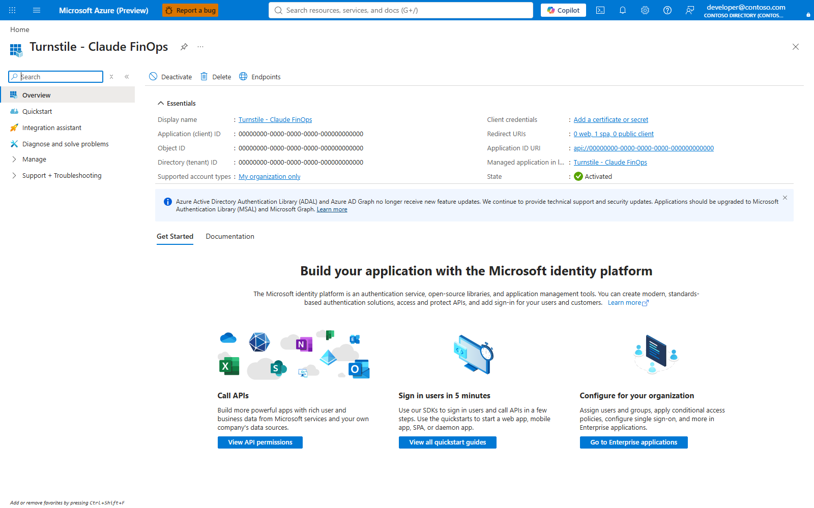

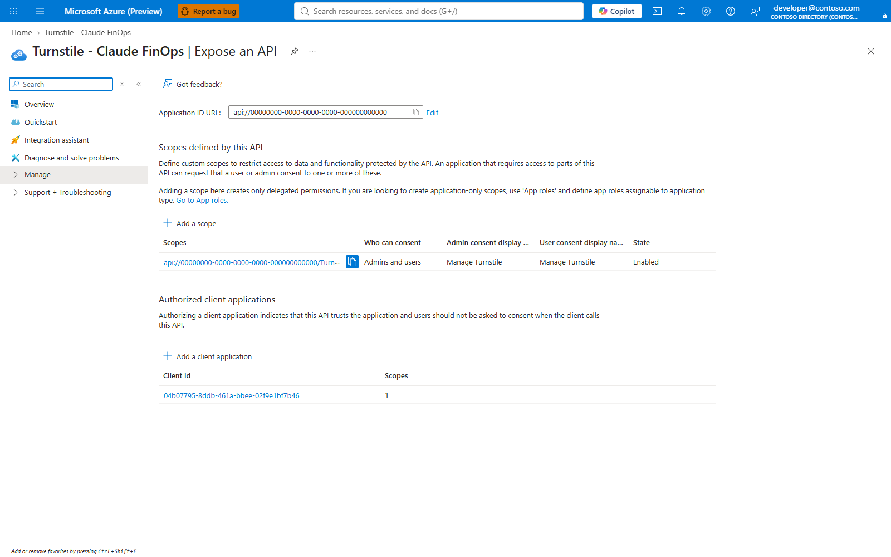

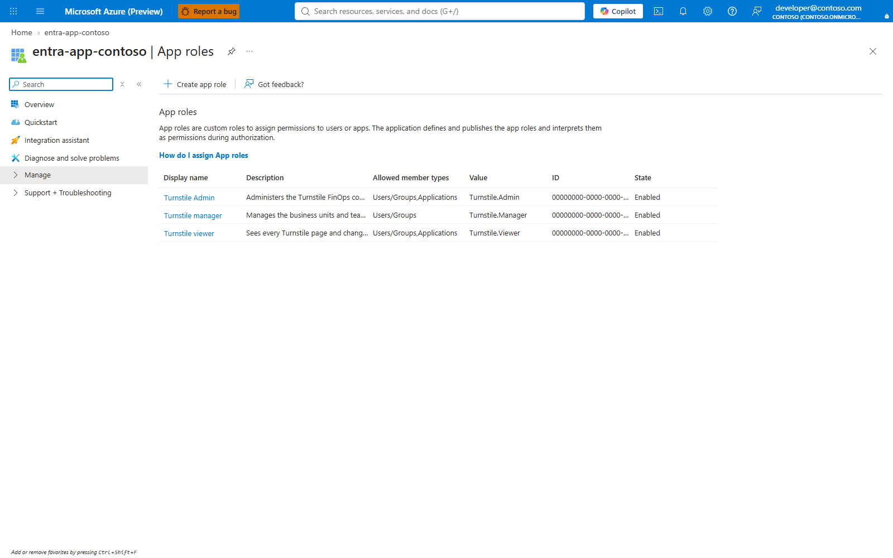

The Authentication, Properties and Users and groups blades asked for a fresh multifactor sign-in
when captured, so their settings are shown from Microsoft Graph instead, in
[Admin-only access](#admin-only-access).

## 2. Deploy Turnstile

```powershell
git clone https://github.com/naveenneog/turnstile.git
cd turnstile
git checkout claude-gateway
New-Item -ItemType Directory .turnstile | Out-Null
Copy-Item infra/main.parameters.example.json .turnstile/main.parameters.json
```

Set these in `.turnstile/main.parameters.json`. `.turnstile/` is ignored by Git.

| Parameter | Value |
|---|---|
| `resourcePrefix`, `resourceGroupName`, `location`, `postgresLocation` | Your names and a region that passed the checks in [Prerequisites](#prerequisites) |
| `entraClientId`, `entraTenantId`, `entraAdminRole` | From step 1 |
| `entraAllowedEmailDomains` | The domains your administrators sign in with |
| `bootstrapOwnerEmail` | A break-glass Owner who signs in with a password. Keep its credential in a secret store; daily administration is through Entra |
| `existingApimName`, `existingApimResourceGroupName`, `existingApimPrincipalId`, `existingApimGatewayUrl` | Optional. Turnstile needs an API Management instance and creates a Standard v2 one if these are empty. **Do not point them at the Claude gateway**: the deployer grants itself custom roles on the instance it uses |
| `observerPlanSkuName` | The plan for Turnstile's usage observer, P0v3 by default. See [What it costs](#what-it-costs) |

Then deploy:

```powershell
az login
uv sync --frozen
uv run python -m scripts.deploy deploy --subscription <subscription-id> --parameters .turnstile/main.parameters.json
```

The command prompts for the break-glass Owner's password, runs a what-if, asks you to type
`deploy`, and refuses any change that deletes a resource. `scripts.deploy plan` previews without
creating anything.

Where `uv` cannot reach PyPI (measured: a TLS handshake failure behind a corporate proxy), use
`pip`, which honours the machine's package feed. Keep the requirements file outside the clone:
the deployer refuses to run from a worktree with uncommitted changes.

```powershell
python -m venv $env:TEMP\turnstile-deployer
$py = "$env:TEMP\turnstile-deployer\Scripts\python.exe"
& $py -c "import tomllib;d=tomllib.load(open('pyproject.toml','rb'));print('\n'.join(d['project']['dependencies']+d['dependency-groups']['dev']))" |
    Set-Content $env:TEMP\turnstile-requirements.txt
& $py -m pip install -r $env:TEMP\turnstile-requirements.txt
$env:PATH = "$env:TEMP\turnstile-deployer\Scripts;$env:PATH"
python -m scripts.deploy deploy --subscription <subscription-id> --parameters .turnstile/main.parameters.json
```

On Windows, the upstream deployer stops before creating anything: it calls `az` and `npm`
without their `.cmd` extension, checks POSIX file modes and locks with `fcntl`. The fork's
`fix/windows-deployer` branch fixes all three and is part of `claude-gateway`.

## 3. Add the sign-in redirect

The web address exists only once Turnstile is deployed. Add it to the application:

```powershell
./scripts/New-ClaudeTurnstileEntraApp.ps1 -WebUrl https://<api-app>.azurewebsites.net
```

In the portal: **App registrations >** the app **> Authentication > Add a platform >
Single-page application**, with the Turnstile address as the redirect URI.

**Sign in with Microsoft** now goes to the tenant's own sign-in page. Measured: the authority in
the redirect is the tenant id, not `/organizations`, which is what upstream Turnstile uses.

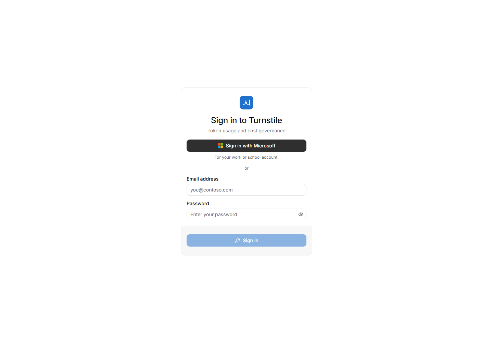

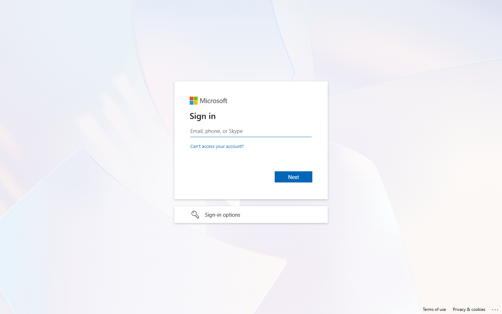

## 4. Connect the gateway

Nothing about a Turnstile deployment is written into this repository's scripts. This finds it and
stores what it found in one named value on the gateway, `turnstile-integration`, which every other
Turnstile script reads.

```powershell
./scripts/Connect-ClaudeTurnstile.ps1 -TurnstileResourceGroup <turnstile-resource-group>
```

| Discovered | From |
|---|---|
| Turnstile's address, client id, tenant and admin role | The web app whose settings carry `ENTRA_CLIENT_ID`. The script refuses a Turnstile that is not admin-only: `ENTRA_ADMIN_ROLE` and `ENTRA_TENANT_IDS` must both be set |
| The event hub | The telemetry function's `EVENT_HUB_NAME` and `EVENT_HUB_CONNECTION__fullyQualifiedNamespace` settings |

It grants you **Azure Event Hubs Data Sender** on that one hub, then proves the connection with an
admin token against Turnstile's API. Run it again with `-Show` to read the connection, with a
setting to change it, or with `-Disconnect`.

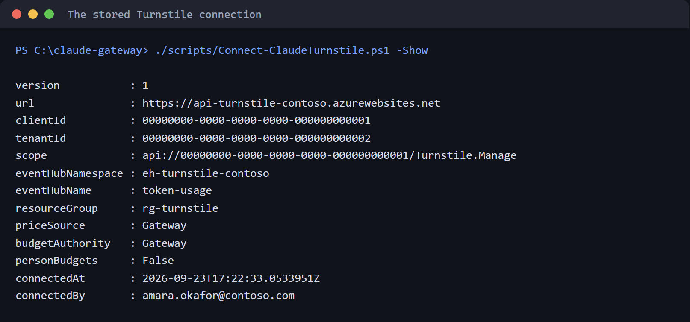

The value is `key=value;key=value`, with no quotes. On Windows `az` runs through `cmd.exe`,
which strips double quotes from arguments: measured, JSON written this way came back as
`{version:1,url:https://...}`.

## 5. Show units, teams and budgets in Turnstile

```powershell
./scripts/Sync-ClaudeTurnstileGovernance.ps1
```

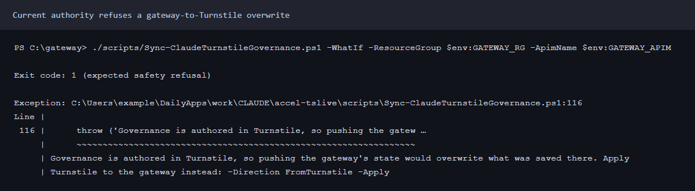

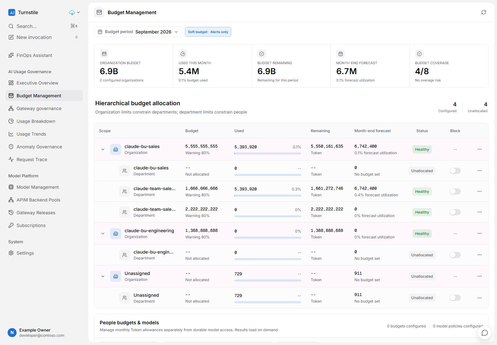

Run it after you change a unit, a team or a budget. `-WhatIf` shows what it would write.

Person budgets are off by default. Turnstile treats a person's budget as a share that must fit
inside the department's; measured, it refused a department budget "lower than its 15000000
allocated child tokens". A tier is a ceiling each person may reach, not a share of a pot, so
mirroring tiers as person budgets blocks ordinary unit budgets once a department has more than a
handful of people. Tiers travel on every usage row instead, as the project `tier-<tier>`.

Turnstile also refuses a team budget larger than its unit's. The gateway allows that, because the
unit caps its teams together ([ADR-0008](DECISIONS.md)). The sync reports the refusal and carries
on; the gateway still enforces both.

## 6. Send usage to Turnstile

```powershell
./scripts/Export-ClaudeTurnstileUsage.ps1
```

With no dates, it sends the last 120 minutes, ending 15 minutes ago so the ledger has settled, and
the complete hours of cache reads that are at least 30 minutes old. Run it every hour and the
windows overlap, which is safe: Turnstile keys every row on its id and never overwrites a row that
is not estimated.

For history, pass dates, and use day slices:

```powershell
./scripts/Export-ClaudeTurnstileUsage.ps1 -From 2026-08-24 -To ([datetime]::UtcNow.AddMinutes(-15)) -SliceMinutes 1440 -ThrottleLimit 5
```

| 30 days of the reference gateway | Slices | Time |
|---|---|---|
| Hourly slices, five at a time | 738 | 586.5 s |
| Day slices, five at a time | 31 | 66.9 s |

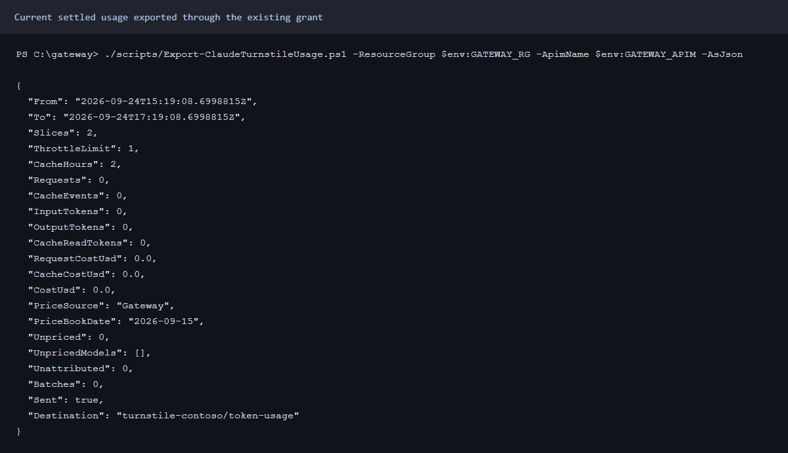

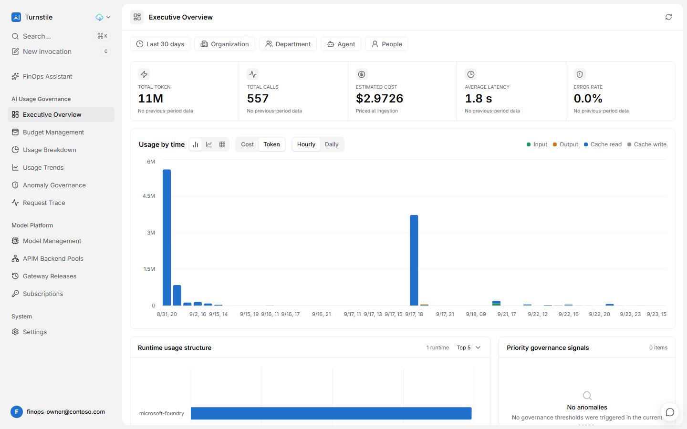

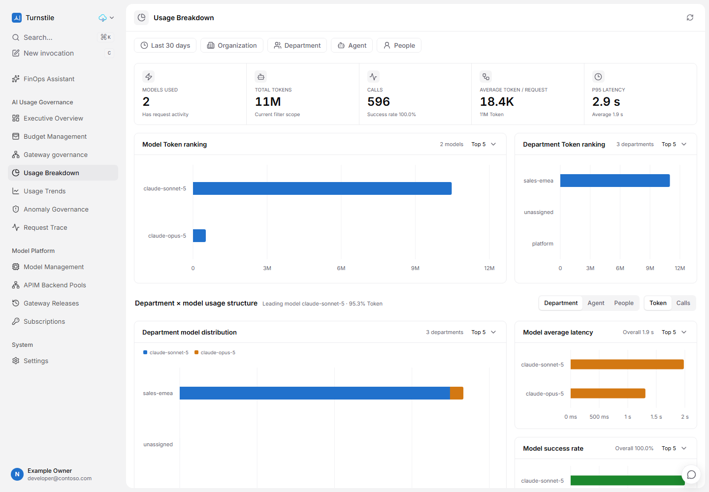

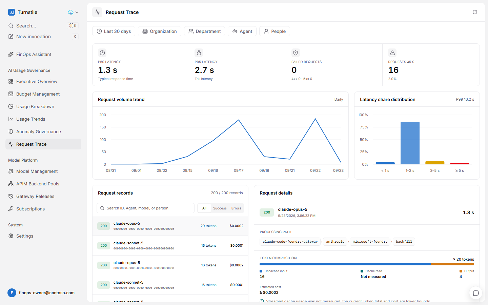

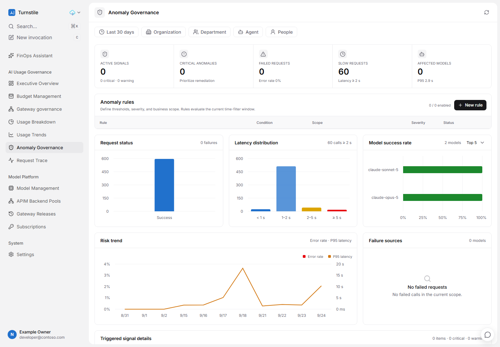

### What is sent, and why

Turnstile skips, zeroes or rewrites events that break its rules, and the sender is never told.
The rules below are the ones its ingest code enforces at commit `4e93935`, and the export checks
every event against them before anything leaves.

- **Nothing unknown.** An event with a field Turnstile does not define is skipped whole.
- **Source `backfill`.** Turnstile subtracts the cache of its own `eventhub` rows from its API's
  cache metric to correct its global cache total. A gateway row marked `eventhub` would shrink
  Turnstile's own cache correction.
- **Nothing estimated.** Turnstile's reconciliation starts each scan at the oldest row that is
  estimated and not yet reconciled. A row it can never match, such as an hour of cache reads,
  would hold its reconciliation window open for ever.
- **Cache is named, not guessed.** The ledger does not know a streamed request's cache reads, so
  `cached_tokens` is 0 and `ingest_error` is `stream_cache_usage_unavailable`, the value
  Turnstile's own reconciliation writes. Its request page shows it as "not measured", and totals
  as a lower bound.
- **Cache reads as their own rows.** They come from the gateway's token metric, per developer,
  model and hour. That metric is a lower bound too: custom metrics keep 100 unique values per
  dimension and drop the rest ([ADR-0006](DECISIONS.md)), and this one carries the user.
- **Cost from the gateway's price book**, so Turnstile and the chargeback report agree. Pass
  `-PriceSource Turnstile` to Connect to price in Turnstile's model registry instead.
- **Transport** is the Event Hubs REST batch API with an Entra token, one event per message:
  [Send batch events](https://learn.microsoft.com/rest/api/eventhub/send-batch-events).

### Measured

| Check | Result |
|---|---|
| Turnstile's own `UsageProcessor` at `4e93935`, run on the exported file with `tests/turnstile/check_contract.py` | 561 of 561 events accepted exactly; none skipped, altered or estimated; $2.972987 sent and stored. Its four controls behaved as the rules above say. An earlier export: 557 of 557 |
| The same 557 events sent twice to the live hub | 1,114 messages in (the hub's `IncomingMessages` over 30 days); 557 calls and $2.972581 stored |
| Stored against sent | Input 140,632, output 32,557, cache reads 10,811,758 tokens: identical in Turnstile and in the export |
| Mapping, checking and serialising, on a laptop | 1,471 events a second (20,000 events, PowerShell 7.6.6), before sending. The check found one bad event among the 20,000 |

At that rate one process keeps up with about 5 million requests an hour before the Log Analytics
query and the send. The query API returns at most 500,000 records and a user runs at most five
queries at once ([Azure Monitor service limits](https://learn.microsoft.com/azure/azure-monitor/fundamentals/service-limits#log-queries-and-language)),
so a busy gateway needs shorter slices, run side by side; a partial result stops the export
rather than sending part of it.

## 7. Optional: edit budgets in Turnstile

By default budgets are authored in the gateway and mirrored to Turnstile. To edit them on
Turnstile's budget page instead:

```powershell
./scripts/Connect-ClaudeTurnstile.ps1 -BudgetAuthority Turnstile
```

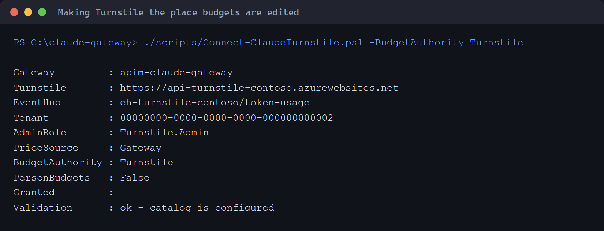

Change a unit's or a team's budget in Turnstile, then read it back. Nothing is written without
`-Apply`:

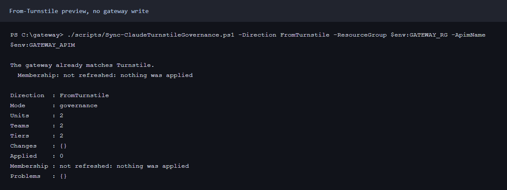

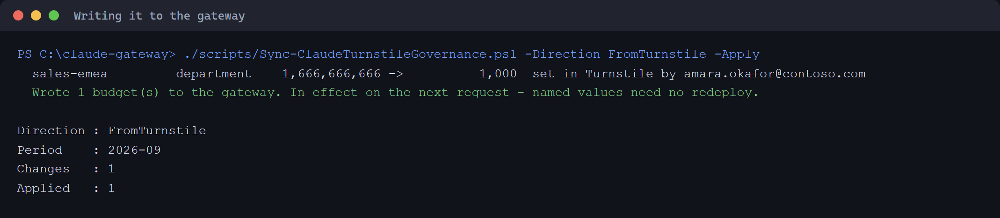

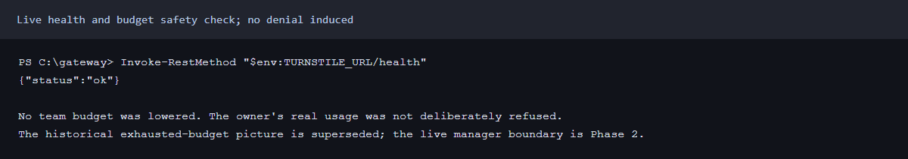

Measured round trip, with the `sales-emea` budget set to 1,000 tokens in Turnstile:

| Step | Result |
|---|---|
| Before | 200 |
| Read back, no `-Apply` | 16 s; one change found, nothing written |
| `-Apply` | 57 s, most of it the named value update, which the script waits for and reads back |
| The first request after `-Apply` returned | 403 `rate_limit_error`, "The Claude budget for your business unit (sales-emea) is spent for this period", 2 s later |
| Budget restored in Turnstile, applied, authority back to Gateway | The registry read back identical; the first request returned 200 |

Structure never comes back from Turnstile. A unit needs an Entra group, and groups belong to the
gateway, so a unit added in Turnstile is not created in the gateway.

## Run it on a schedule

The export and the sync run every hour as an Azure Container Apps job signed in as its own
managed identity. No secret exists anywhere: not in the template, the job or a key vault
([ADR-0014](adr/0014-turnstile-beside-the-gateway.md)).

```powershell
./scripts/Register-ClaudeTurnstileSchedule.ps1 -RunNow
```

It deploys `infra/turnstile-schedule.bicep` into the gateway's resource group, grants the job's
identity through `Connect-ClaudeTurnstile.ps1 -ExporterPrincipalId`, waits for the grants to
take effect, and starts one run.

| Granted to the job's identity | On |
|---|---|
| Azure Event Hubs Data Sender | Turnstile's hub |
| API Management Service Reader Role | The gateway, to read its named values |
| Reader | The gateway's Application Insights resource, where the export finds the ledger |
| Log Analytics Reader | The workspace behind it |
| `Turnstile.Admin` app role, assigned directly | Turnstile, for the sync. A workload identity cannot join a group |

Each run starts from `mcr.microsoft.com/azure-cli`, adds PowerShell from its published release,
fetches this repository at the commit it was registered with, signs in as its identity and runs
`Invoke-ClaudeTurnstileSchedule.ps1`: the export's own window, then the sync in the direction the
connection says budgets are authored. The commit is a full commit id that must already be on the
remote. To run newer scripts, register again.

Measured on 2026-09-23 against the reference gateway:

| Check | Result |
|---|---|
| A run | Succeeded in 143 s, 54 s of it the pass: 2 requests sent in one batch, and the catalog of 3 organizations and 5 departments written by `app:<job identity>` |
| A budget changed in the gateway | The next run wrote it to Turnstile, attributed to `app:<job identity>` |
| Azure Event Hubs Data Sender removed | The next run failed: `401 ... Unauthorized access for 'Send' operation` |
| Cost | $0.0021 a run at Container Apps list price with no free grant applied: $1.54 a month, hourly |

The first two runs failed, and both causes are now handled:

- The start script stopped with `set: pipefail\r: invalid option name`. A Windows checkout gives
  the template's multi-line string CRLF line endings, which bash does not accept. The template now
  strips them.
- A run failed with 504 from Turnstile: governance automation in the test subscription had
  stopped Turnstile's PostgreSQL server, and every Turnstile function was timing out at 30 s. See
  [Troubleshooting](#troubleshooting).

## Admin-only access

Three layers, each measured.

**Entra refuses the token.** With the admin group's assignment removed, Entra refused a token 5 s
later with `AADSTS50105`, and issued one again 22 s after the assignment was restored:

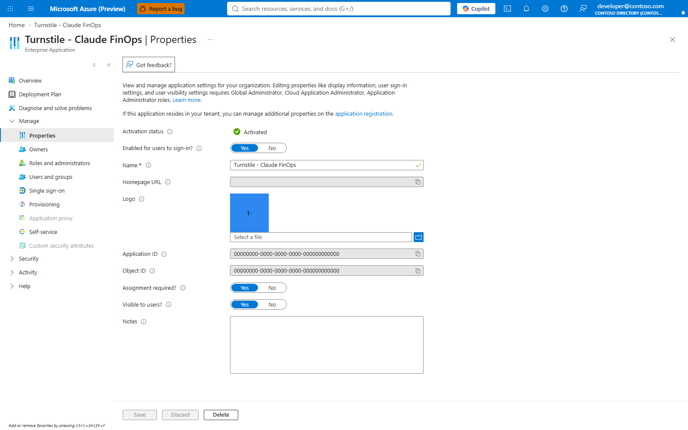

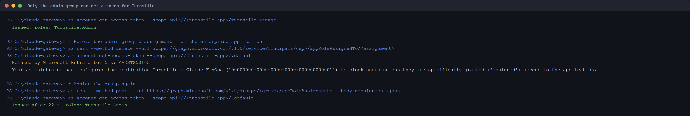

**Turnstile checks the tenant and the role.** It accepts an Entra access token only when both
`ENTRA_ADMIN_ROLE` and `ENTRA_TENANT_IDS` are set, only from a pinned tenant, and only with the
role. A delegated token must also carry the scope `Turnstile.Manage` and an allowed email domain,
and maps to that person's Owner account; an application token acts as `app:<client id>`.
Measured against the deployment: an admin token returned role `owner`, method `entra`; no token
and a forged token both returned 401.

**The web sign-in is the tenant's.** See [step 3](#3-add-the-sign-in-redirect).

The break-glass Owner signs in with a password and is not affected by any of this. Keep its
credential in a secret store.

## What it costs

```powershell
./scripts/Get-ClaudeTurnstileBom.ps1
```

It lists what is in the Turnstile resource group that the connection names, and prices it from
[prices.azure.com](https://prices.azure.com) for the region each resource is in. Measured for the
test deployment, list prices in Central US on 2026-09-23, 730 hours a month:

| Resource | SKU | A month |
|---|---|---|
| Usage observer plan | P0v3 Linux | $62.05 |
| Event Hubs | Standard, 1 throughput unit | $21.90 |
| PostgreSQL Flexible Server | B1ms Burstable, plus 32 GB at $4.16 | $18.18 |
| API plan | B1 Linux | $13.14 |
| Private endpoints | 5, at $0.01 an hour each | $36.50 |
| Container registry | Basic | $5.07 |
| Private DNS zones | 4 | $2.00 |
| **At rest** | | **$158.84** |
| Usage, last 30 days | 1,114 Event Hubs messages, 0.003 GB of logs | $0.01 |

Not included: the API Management instance Turnstile uses, which is billed on that instance;
Functions on Flex Consumption, storage and Key Vault, which bill by use and which the script lists
without a figure; and Claude tokens, which are the gateway's
([Get-ClaudeBom.ps1](../scripts/Get-ClaudeBom.ps1)).

The largest line is the **usage observer**, an Envoy cache adapter that Turnstile's own API
Management policy sends streaming traffic through to measure cache. Claude traffic does not pass
through it, so for this integration it does nothing. The deployer always creates it;
`observerPlanSkuName` sets its size, and a smaller plan was not tested.

## Troubleshooting

| Symptom | Cause | Fix |
|---|---|---|
| The deployer stops at once on Windows | `az` and `npm` not found without `.cmd`, POSIX file-mode checks, `fcntl` | Deploy from the fork's `claude-gateway` branch |
| `uv sync` fails with a TLS handshake error | A proxy that `uv` does not trust | Use the `pip` route in [step 2](#2-deploy-turnstile) |
| The deployer refuses to start | Uncommitted changes in the clone | Keep generated files outside it |
| PostgreSQL or App Service creation fails | Region restriction or zero quota for the subscription | Check the region first; Central US worked |
| `AADSTS50105` | The account is not in the admin group | Add it to the group |
| 401 from Turnstile with an Entra token | Turnstile is not admin-only, or the token is from another tenant | Deploy with `entraTenantId` and `entraAdminRole`; Connect refuses otherwise |
| A setting read back as `{version:1,...}` | `cmd.exe` stripped the quotes from a JSON argument | Use the scripts, which write quote-free values |
| The sync reports `refused department/...` | A team budget above its unit's, or person allocations above a department's | Expected for oversubscribed teams; the gateway still enforces. Keep person budgets off |
| A department that is not in the registry | Usage keeps the unit it was charged to. Measured: 9 rows from 2026-09-15 under a unit since removed | Nothing to fix; history is not rewritten |
| A few requests have no person in Turnstile | Turnstile discovers a person only from an email id under a known department. Measured: 3 requests at 09:11–09:12 on 2026-09-15 carry object ids, because they were logged before the gateway recorded the caller's UPN; every request from 09:24 on carries it | Nothing to fix for new traffic |
| A 30-day export takes ten minutes | 738 hourly slices, each with its own queries and tokens | `-SliceMinutes 1440` |
| Turnstile requests hang and end in 504, and its functions all run 30 s | Its PostgreSQL server is stopped. Measured: governance automation in the test subscription stopped it | `az postgres flexible-server show --query state`, then `az postgres flexible-server start`: 127 s measured |
| The scheduled job stops at once with `set: pipefail\r` | CRLF line endings in the start script, from a Windows checkout of a changed template | Keep `replace(bootstrap, '\r', '')` in the template |
| A scheduled run reports `refused` budgets | A team budget above its unit's, which Turnstile refuses | Expected; the gateway still enforces both |
| The Entra capture stops with `MFA` | The blade needs a fresh multifactor sign-in, which pushed a request to your phone | `node guide/auth.mjs`, then capture again |

## FAQ

**Why does Turnstile show far more tokens "used" than the gateway's budget counter?**
Turnstile's "used" includes cache reads; the gateway's quota counter counts prompt and completion
tokens only. In the 30 days exported, cache reads were 10,811,758 tokens against 173,189 input
and output.

**Does Turnstile see prompts or responses?** No. The export sends counts, identities, models,
status, latency and cost.

**Can Turnstile add a person to a unit?** No. Membership is the Entra group's; add the person
there and run `Sync-ClaudeAccess.ps1` ([BUSINESS-UNITS.md](BUSINESS-UNITS.md)).

**What happens if Turnstile is down?** Nothing for developers. The scheduled run fails and the
next one, whose window overlaps, sends what was missed.

**Does a budget edited in Turnstile take effect if nobody runs the sync?** No. The gateway
enforces its own registry. Run the sync with `-Apply`, on a schedule if Turnstile is where budgets
are edited.

## The fork

Upstream Turnstile could not be used unchanged: its catalog is fixed demo data, its web sign-in
accepts any organization's accounts, it creates an account for anyone who signs in, and its
deployer does not run on Windows. The fork's branches, merged in `claude-gateway`:

| Branch | Adds | Tests |
|---|---|---|
| `fix/windows-deployer` | `.cmd` resolution, Windows file modes, a Windows lock | 44 passed, 5 POSIX-only skipped |
| `feature/entra-admin-only` | Tenant pin, admin role required, no account for anyone else | 3 of 3 mutations caught |
| `feature/enterprise-catalog` | `GET`, `PUT` and `DELETE /api/v1/enterprise-catalog`, stored in PostgreSQL | 13 tests, 4 of 4 mutations caught |
| `feature/entra-bearer-admin` | Entra access tokens for the API, for scripts and workload identities | 12 tests, 5 of 5 mutations caught |

## Reference

| Script | Does |
|---|---|
| `scripts/New-ClaudeTurnstileEntraApp.ps1` | Creates or corrects the Entra application, role, scope, assignment and admin group |
| `scripts/Connect-ClaudeTurnstile.ps1` | Discovers Turnstile, stores `turnstile-integration`, grants, validates; `-Show`, `-Disconnect`, `-BudgetAuthority`, `-PriceSource`, `-PersonBudgets` |
| `scripts/Sync-ClaudeTurnstileGovernance.ps1` | Units, teams and budgets to Turnstile; `-Direction FromTurnstile [-Apply]` for budgets back |
| `scripts/Export-ClaudeTurnstileUsage.ps1` | Usage to Turnstile's hub; `-From`, `-To`, `-SliceMinutes`, `-ThrottleLimit`, `-OutFile` |
| `scripts/Get-ClaudeTurnstileBom.ps1` | What the Turnstile deployment costs to keep |
| `scripts/Register-ClaudeTurnstileSchedule.ps1`, `infra/turnstile-schedule.bicep` | The hourly job, its identity and its grants; `-RunNow`, `-Cron`, `-NoGovernance`, `-RepositoryRef` |
| `scripts/Invoke-ClaudeTurnstileSchedule.ps1` | One scheduled pass, which the job runs and you can run by hand |
| `scripts/ClaudeTurnstile.ps1`, `scripts/ClaudeTurnstileGovernance.ps1` | The mapping and the checks, shared by all of the above |
| `tests/Test-Turnstile.ps1`, `tests/Test-TurnstileGovernance.ps1` | Offline checks of the mapping, the rules and this page |
| `tests/turnstile/check_contract.py` | Runs exported events through Turnstile's own ingest code |
| `guide/capture-turnstile.mjs`, `guide/capture-turnstile-entra.mjs`, `guide/render-turnstile.mjs` | The pictures on this page, redacted in the page before capture |

`turnstile-integration` holds `version`, `url`, `clientId`, `tenantId`, `scope`,
`eventHubNamespace`, `eventHubName`, `resourceGroup`, `priceSource`, `budgetAuthority`,
`personBudgets`, `connectedAt` and `connectedBy`.

Turnstile endpoints used: `GET`, `PUT /api/v1/enterprise-catalog`; `GET /api/v1/budgets`;
`PUT /api/v1/budgets/{scope}/{id}`; `GET /api/v1/budgets/users`;
`POST /api/v1/budgets/users/bulk`.
