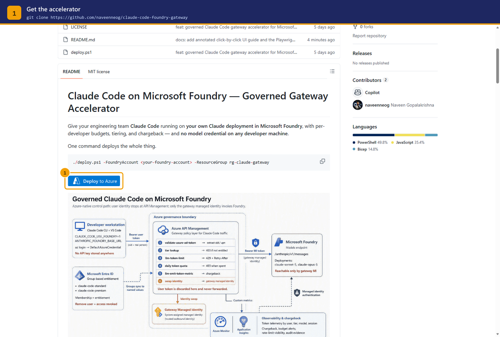
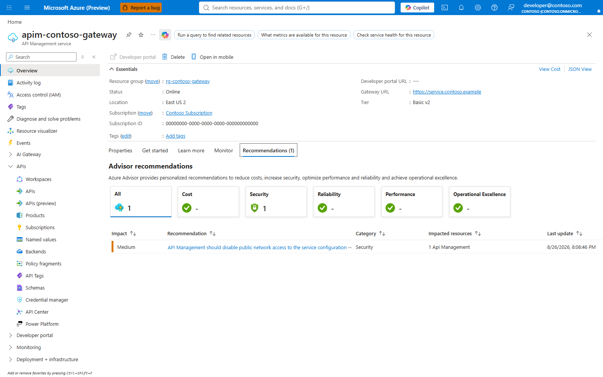
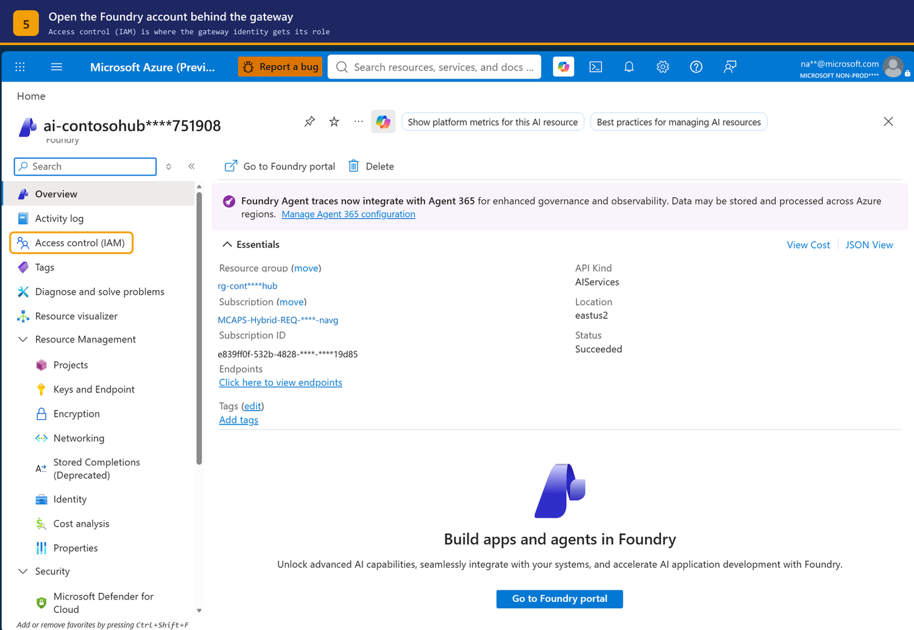
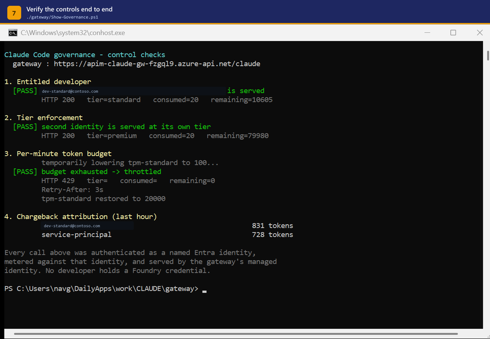
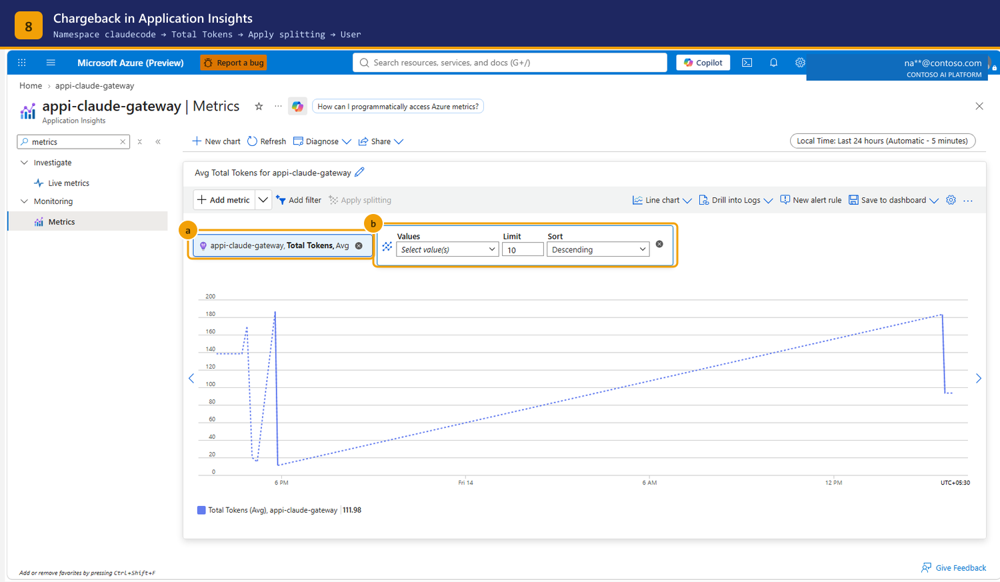
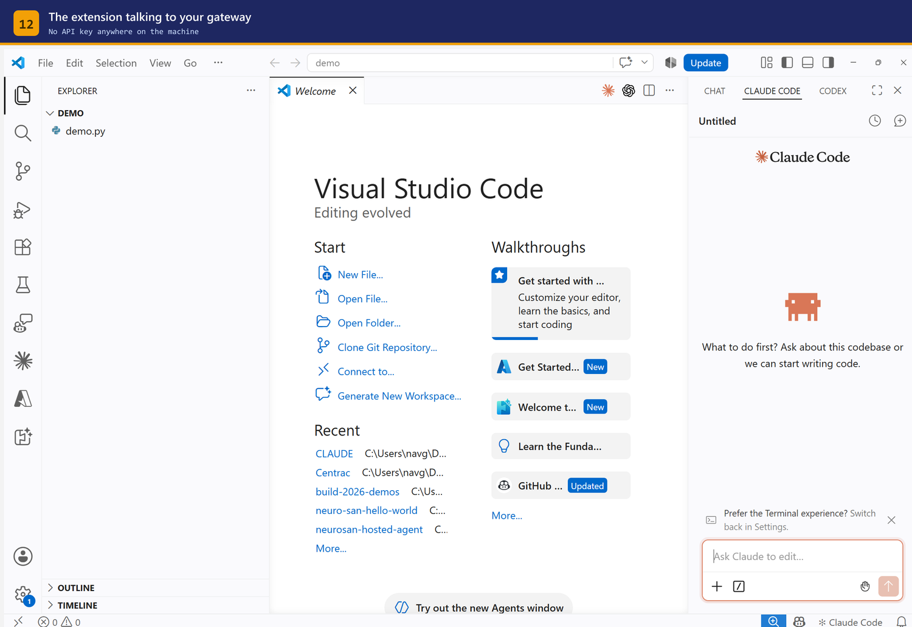
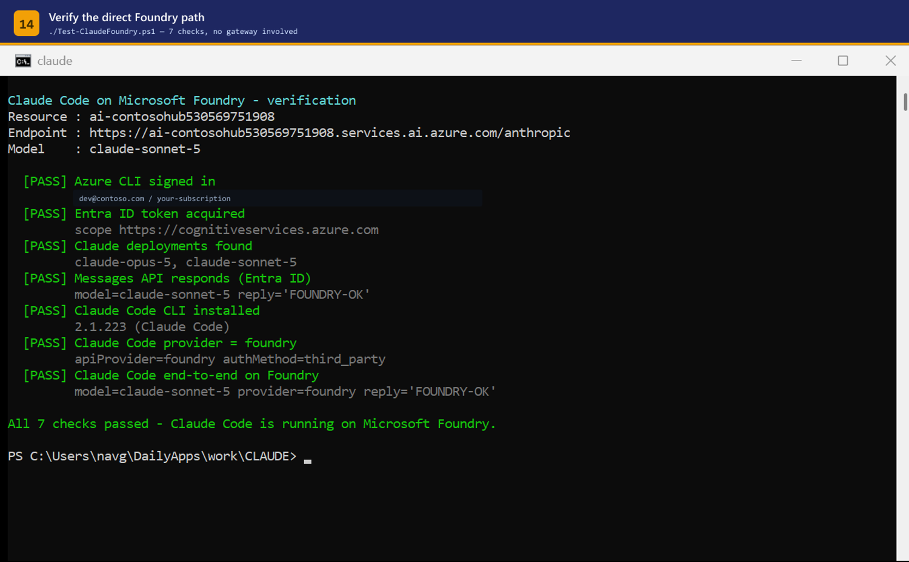

# UI Guide — Standing up the gateway and enabling Claude Code

A click-by-click walkthrough of the two jobs in this accelerator:

| Part | Who | Outcome |
|------|-----|---------|
| **A** | Platform / AI CoE | An APIM gateway that fronts your Foundry Claude deployment with per-developer budgets and chargeback |
| **B** | Each developer | Claude Code in VS Code and the terminal, pointed at that gateway, with no API key on the machine |

Every screenshot below is a real capture of a working deployment. Identity and
tenant strings are masked; resource names are the live ones.

Steps 2 and 4 are described from the CLI rather than illustrated — capture them
against your own deployment with the tooling in
[Regenerating the screenshots](#regenerating-the-screenshots).

---

## Part A — Platform team

### Step 1 — Get the accelerator



```bash
git clone https://github.com/naveenneog/claude-code-foundry-gateway
cd claude-code-foundry-gateway
```

Two ways to deploy. Pick one:

```powershell
# Scripted — auto-discovers the Foundry account and wires everything up
./deploy.ps1 -FoundryAccount <your-foundry-account> -ResourceGroup rg-claude-gateway
```

or click **Deploy to Azure** (ringed above) for the portal form.

> Run `./deploy.ps1 -WhatIf` first if you want to see the plan before anything is created.

### Step 2 — Fill the deployment form

The template only asks for one thing you have to know: the **Foundry account
name**. Everything else is defaulted.

| Field | Value |
|-------|-------|
| Resource group | `rg-claude-gateway` (or existing) |
| Foundry account | the Cognitive Services account holding your Claude deployment |
| APIM SKU | `BasicV2` — **must be a v2 tier**, see Step 3 |
| Publisher email | your team alias |

Deployment takes roughly 30–45 minutes. APIM provisioning dominates that time.

### Step 3 — Confirm the gateway tier



**This is the single most important check in Part A.**

The `llm-token-limit` and `llm-emit-token-metric` policies only parse Anthropic
token usage on **v2 SKUs**. On classic tiers (Developer, Basic, Standard,
Premium) the policies attach without error, the API returns 200, and every
token count is silently **zero** — you get a governance layer that governs
nothing.

Verify from the CLI:

```bash
az apim show -g rg-claude-gateway -n <apim-name> --query "sku.name" -o tsv
# expect: BasicV2  (or StandardV2 / PremiumV2)
```

> `az apim create` rejects v2 SKU names outright. That is why this accelerator
> deploys through Bicep/ARM rather than the CLI.

### Step 4 — Turn on the gateway managed identity

**APIM → Security → Managed identities → System assigned → Status: On**

This identity is the whole point of the design. It becomes the *only* principal
that is allowed to call Foundry, so every request must pass through the gateway
to reach a model.

```bash
az apim show -g rg-claude-gateway -n <apim-name> --query "identity.principalId" -o tsv
```

### Step 5 — Grant Foundry access to the gateway, and to nothing else



**Foundry account → Access control (IAM) → Role assignments**

Grant the gateway identity **Cognitive Services User**
(`a97b65f3-24c7-4388-baec-2e87135dc908`). Owner is *not* sufficient — that role
carries no data-plane permission.

```bash
az role assignment create \
  --assignee <apim-principal-id> \
  --role "Cognitive Services User" \
  --scope $(az cognitiveservices account show -g <rg> -n <foundry> --query id -o tsv)
```

Then audit what else is on that scope:

```bash
az role assignment list \
  --scope $(az cognitiveservices account show -g <rg> -n <foundry> --query id -o tsv) \
  --role "Cognitive Services User" \
  --query "[].{principal:principalName, type:principalType}" -o table
```

**Every principal in that list other than the gateway is a way around your
budgets.** A developer holding this role directly can point Claude Code at the
Foundry endpoint and skip the gateway entirely. Remove them before you announce
the platform.

### Step 6 — Set the per-developer budgets


**APIM → APIs → Named values**

All governance knobs live here, so they can be changed without touching policy XML:

| Ring | Names | Meaning |
|------|-------|---------|
| **a** | `tpm-standard`, `tpm-premium` | tokens per minute, per developer |
| **b** | `quota-standard`, `quota-premium` | tokens per day, per developer |
| **c** | `allow-standard`, `allow-premium` | comma-separated Entra **object ids** entitled to each tier |

Defaults shipped by the accelerator:

| Tier | Per minute | Per day |
|------|-----------:|--------:|
| standard | 20,000 | 500,000 |
| premium | 80,000 | 5,000,000 |

Changing a value takes effect on the next request — no redeploy.

```bash
az apim nv show -g <rg> --service-name <apim> --named-value-id tpm-standard \
  --query value -o tsv
```

> The `allow-*` lists hold object ids, not UPNs, because that is what arrives in
> the token. `Sync-ClaudeAccess.ps1` keeps them in step with the Entra groups
> `claude-code-standard` and `claude-code-premium`.

### Step 7 — Verify the controls end to end



```powershell
./scripts/Show-Governance.ps1 -ApimName <apim> -ResourceGroup <rg>
```

Four things must be true before you hand this to developers:

1. **Identity** — a request with no token, or a token for an unlisted object id, is rejected
2. **Tiering** — the same request gets standard or premium limits depending on group membership
3. **Rate limit** — exceeding tokens-per-minute returns `429` with a `Retry-After` header
4. **Chargeback** — the token counts land in Application Insights, attributed to the caller

### Step 8 — Read the chargeback



**Application Insights → Metrics**

- ring **a** — Metric namespace `claudecode`, metric **Total Tokens**
- ring **b** — **Apply splitting** → **User**

Two settings have to be right or this chart stays empty:

```bash
# the APIM diagnostic must emit metrics
az apim diagnostic show -g <rg> --service-name <apim> --diagnostic-id applicationinsights \
  --query metrics

# App Insights must accept custom dimensions
az monitor app-insights component show -g <rg> -a appi-claude-gateway \
  --query "properties.CustomMetricsOptedInType"
# expect: WithDimensions
```

Without `WithDimensions` the totals still appear but the per-user split is
dropped at ingestion, which leaves you with a bill and no way to allocate it.

Each series in the split is one Entra object id. That is the chargeback record,
and it is derived from the token the developer's own machine presented — so it
cannot be spoofed by editing a client config.

---

## Part B — Developer

Nothing in this part requires elevated rights, and no API key is issued.

### Step 9 — Install the VS Code extension


```bash
code --install-extension anthropic.claude-code
```

The extension bundles its own engine, so this is the only install needed for the
IDE experience.

### Step 10 — Point it at the gateway

Sign in first — this is what supplies the identity the gateway meters:

```bash
az login
# guest accounts must name the tenant explicitly:
az login --tenant <tenant-id>
```

Then set the environment for your session:

```powershell
$env:ANTHROPIC_BASE_URL = "https://<apim-name>.azure-api.net/claude"
$env:ANTHROPIC_AUTH_TOKEN = (az account get-access-token `
    --resource https://cognitiveservices.azure.com `
    --query accessToken -o tsv)
```

```bash
export ANTHROPIC_BASE_URL="https://<apim-name>.azure-api.net/claude"
export ANTHROPIC_AUTH_TOKEN="$(az account get-access-token \
    --resource https://cognitiveservices.azure.com \
    --query accessToken -o tsv)"
```

Restart VS Code so the extension host picks the variables up.

### Step 11 — Open the panel



The panel behaves exactly as it does against the public API. The difference is
entirely on the wire: every request carries the developer's Entra token to your
gateway, and the gateway swaps in its own managed identity to reach Foundry.

### Step 12 — Confirm a real answer


The response is served by `claude-sonnet-5` in your own Foundry resource. No
prompt or completion leaves your tenant boundary.

---

## Verifying from the terminal

### Step 13 — Check the direct Foundry path



```powershell
./scripts/Test-FoundryDirect.ps1 -Resource <foundry-account>
```

This script exercises the **direct** path — CLI sign-in, token acquisition,
deployment discovery, the Messages API, and Claude Code end to end. It
deliberately bypasses the gateway, which makes it the right tool for isolating
whether a failure is in Foundry or in your policy.

### Step 14 — Check which provider is in effect


```bash
claude
> /status
```

`API provider` and `Microsoft Foundry resource` tell you which path the CLI is
actually using. In gateway mode you will see the APIM base URL instead of the
resource name.

> `/status` is a terminal-only command. It is not available in the VS Code
> panel, so use the CLI when you need to confirm the provider.

---

## Direct-to-Foundry, without the gateway

If you are evaluating before building the governance layer, Claude Code can talk
to Foundry directly:

```powershell
$env:CLAUDE_CODE_USE_FOUNDRY = "1"
$env:ANTHROPIC_FOUNDRY_RESOURCE = "<foundry-account-name>"   # bare name, not a URL
```

Notes that cost time if you learn them the hard way:

- `ANTHROPIC_FOUNDRY_RESOURCE` and `ANTHROPIC_FOUNDRY_BASE_URL` are **mutually exclusive**
- `CLAUDE_CODE_USE_AZURE` does not exist — the variable is `CLAUDE_CODE_USE_FOUNDRY`
- Foundry exposes the **native Anthropic Messages API** at `/anthropic/v1/messages`.
  OpenAI-shaped paths return `404 api_not_supported`
- The caller needs **Cognitive Services User** on the account; Owner is not enough

This path has no budgets, no tiering, and no chargeback. Use it to prove the
model works, then move to the gateway.

---

## Regenerating the screenshots

The portal captures are produced by a Playwright script in `guide/`, so they can
be refreshed against your own deployment rather than reused from this repo.

```bash
npm install     # playwright + sharp; the capture uses your installed Edge
```

```powershell
# one-time sign-in — approve the Authenticator prompt when it appears.
# The session is stored in .pw-profile and reused afterwards.
npm run guide:auth

# capture; append step ids to capture only those
$env:AZURE_SUB    = "<subscription-id>"
$env:AZURE_TENANT = "<tenant-id>"
$env:APIM_NAME    = "<apim-name>"
$env:GATEWAY_RG   = "<resource-group>"
npm run guide:capture

# re-apply banners to already-captured stills
npm run guide:compose
```

Two behaviours worth knowing:

- **Portal identity is masked by default.** `annotate()` covers the signed-in
  account block unless you pass `maskIdentity: false`. Opting out is deliberate
  so that forgetting it cannot leak an account into a published document.
- **Steps needing sign-in are skipped, not failed.** Running `capture.mjs`
  without a portal session still produces the public-page screenshots and tells
  you which ones it skipped.

Use `channel: 'msedge'` (already set) if your tenant enforces device
compliance — a plain Chromium profile is rejected with `AADSTS530033`.

---

## Reference

- Accelerator — <https://github.com/naveenneog/claude-code-foundry-gateway>
- Governance command reference — [GOVERNANCE-CHECKS.md](GOVERNANCE-CHECKS.md)
