# Verify the gateway architecture in the Azure portal

Use this procedure to compare the [architecture](../ARCHITECTURE.md) with an existing
deployment. The screenshots are live captures, not diagram mock-ups. Identifiers and
addresses are replaced with Contoso placeholders; status, configuration labels and
measurements are not invented.

This is a **verification** procedure. It does not deploy resources, assign roles, change
budgets or send reports. Review the relevant deployment guide before making changes.
A screenshot of a resource is evidence of its configuration, not proof of an entire
data flow. The [coverage table](#live-coverage-and-limitations) distinguishes the two.

> [!IMPORTANT]
> Portal capture is now lead-operated. Tenant Conditional Access can require a fresh
> sign-in on resource or Entra blades within about an hour. **Do not retry**, sign in,
> or launch the original profile from this packet. The lead runs the shared batch
> immediately after the owner's fresh sign-in. Existing dated images below remain
> historical live evidence; the [batch table](#pending-portal-batch) tracks required captures.

## Prerequisites

- An Azure CLI sign-in and Azure portal session in the deployment's tenant.
- Permission to read the selected subscription, gateway and related resources.
- A VNet-connected workstation for private **data-plane** operations. Subscription
  Owner does not bypass a private endpoint.
- For local rendering/validation, `npm ci` in the repository root.
  Only the lead operates the single original profile for the scheduled portal batch.

Do not copy the placeholders in a screenshot into a deployment. Select your actual
resources from discovery results.

## 1. Select the subscription and gateway

### Azure portal

1. Open **Subscriptions** from the portal search box. Select the subscription you intend
   to inspect. Check its name and subscription ID privately.
2. Open **API Management services**. Select the gateway rather than guessing its name
   from a prefix.
3. On **Overview**, expand **Essentials**. Verify **Status**, **Location**, **Gateway URL**
   and **Tier**. The tier must be a supported v2 tier.
4. Follow the **Resource group** link to inspect associated resources. Do not assume every
   resource in that group belongs to the gateway.

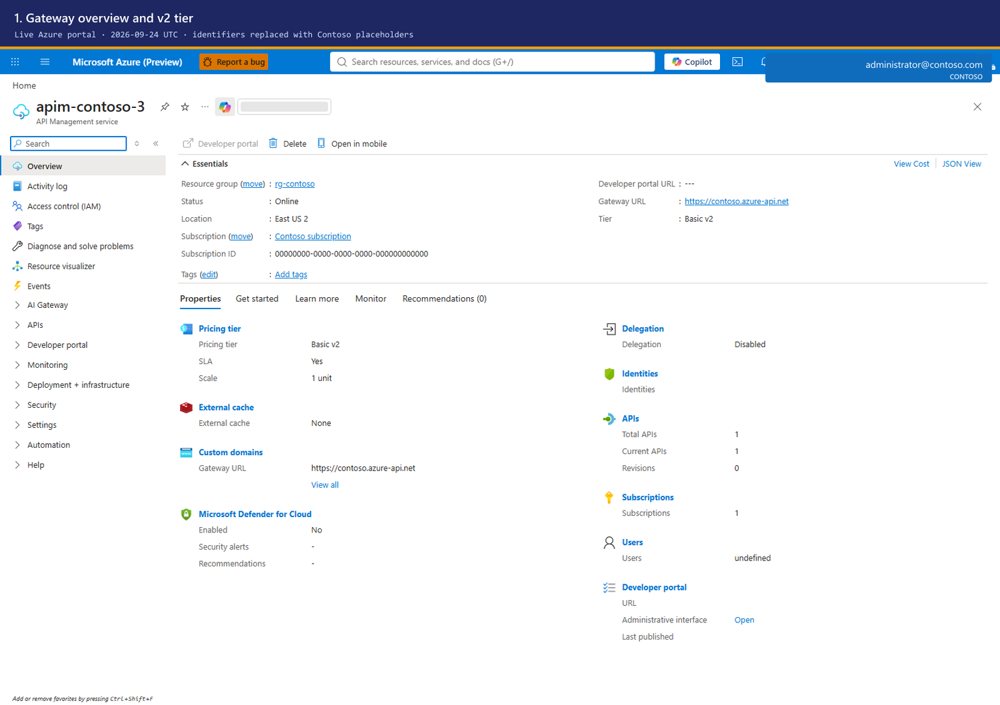

### Azure CLI

List the real choices, then assign variables from the selected objects:

```powershell
$subscriptions = @(az account list -o json | ConvertFrom-Json |
    Where-Object state -eq Enabled)
for ($i = 0; $i -lt $subscriptions.Count; $i++) {
    "{0}. {1}" -f ($i + 1), $subscriptions[$i].name
}
$subscription = $subscriptions[[int](Read-Host 'Subscription number') - 1]
$sub = $subscription.id
$gateways = @(az apim list --subscription $sub -o json | ConvertFrom-Json)
for ($i = 0; $i -lt $gateways.Count; $i++) {
    "{0}. {1} ({2})" -f ($i + 1), $gateways[$i].name, $gateways[$i].resourceGroup
}
$gateway = $gateways[[int](Read-Host 'Gateway number') - 1]
$rg = $gateway.resourceGroup
$apim = $gateway.name
az apim show --subscription $sub -g $rg -n $apim --query '{state:provisioningState,sku:sku.name,gateway:gatewayUrl}' -o json
```

Use `--subscription` on commands rather than changing another terminal's global Azure CLI
context. The capture-plan script reuses `Get-ClaudeGatewayTarget.ps1` when a deployment
has already recorded a gateway, offers numbered choices and accepts explicit parameters:

```powershell
pwsh -NoProfile -File guide/Get-ArchitectureCapturePlan.ps1
# Automation: values come from the selections above, not checked-in defaults.
pwsh -NoProfile -File guide/Get-ArchitectureCapturePlan.ps1 `
  -SubscriptionId $sub -ResourceGroup $rg -ApimName $apim -NonInteractive
```

The generated plan stays under `.shots-entra/architecture-live/`, which is ignored.
It contains real resource identifiers and must not be committed.

## 2. Inspect identity, entitlement and the API

### Azure portal

1. In the gateway's resource menu search box, enter **identity**. Under **Security**,
   select **Managed identities**. Inspect the **System assigned** identity. Do not
   switch it off: doing so changes the principal and can break Foundry access.
2. Search the resource menu for **Named values** and open that blade. Verify that
   `entitlement-source`, tier limits and the unit registry exist. `named-value` and
   `projection` are different membership paths; do not flip the setting as a test.
3. Open **APIs**, select the Claude API and inspect its operations and policy. Verify
   token validation, limits and the managed-identity replacement rather than assuming
   the API's display name proves enforcement.
4. Open the Foundry account selected by the API's backend. Select **Access control (IAM)**
   and then **Role assignments**. Filter for the gateway identity and verify its
   `Cognitive Services User` grant at the intended scope.

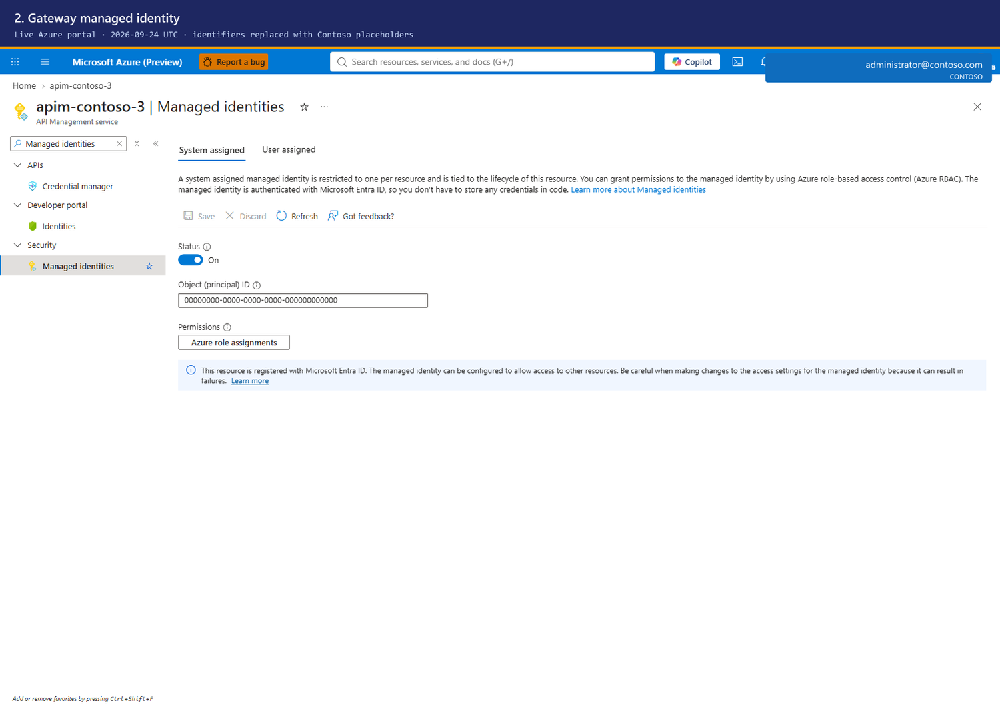

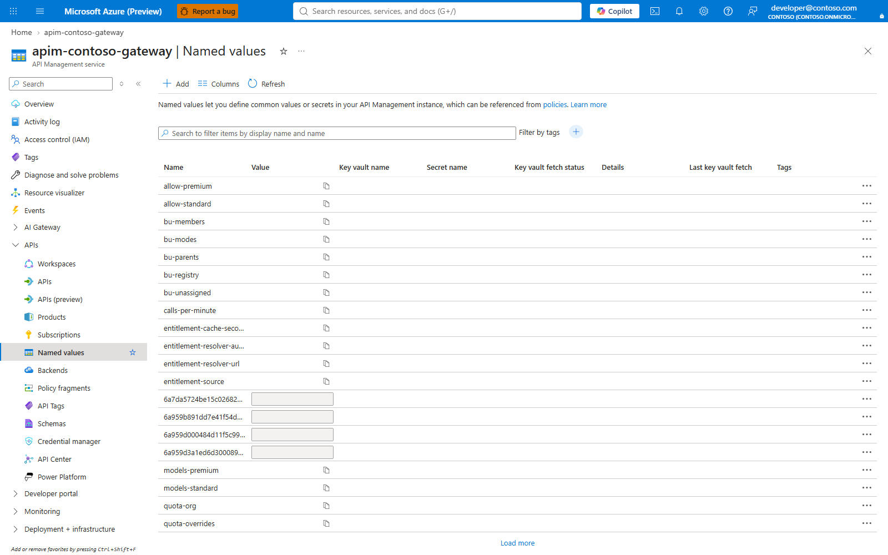

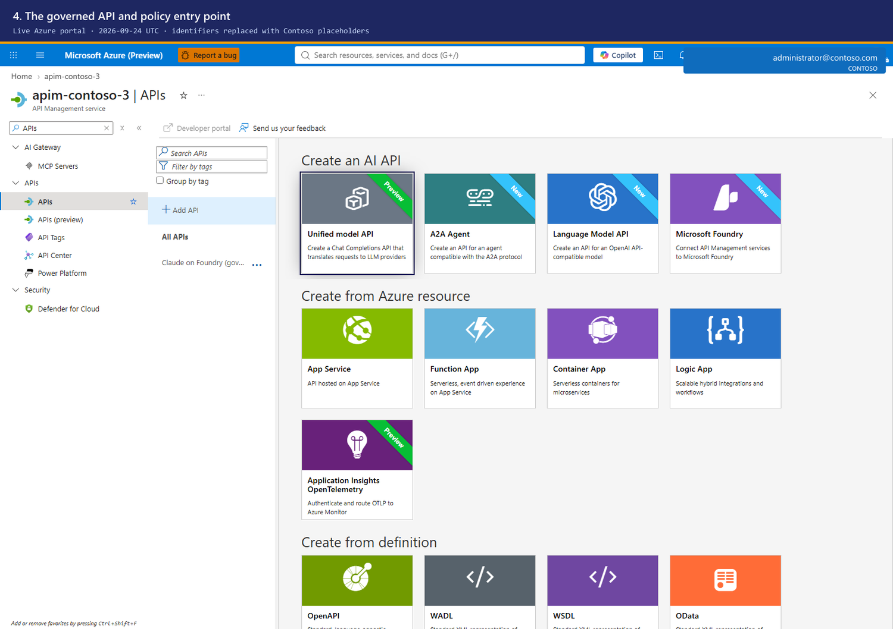

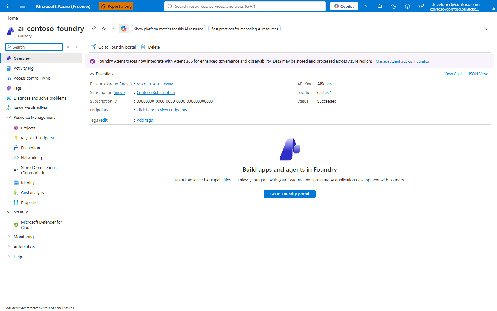

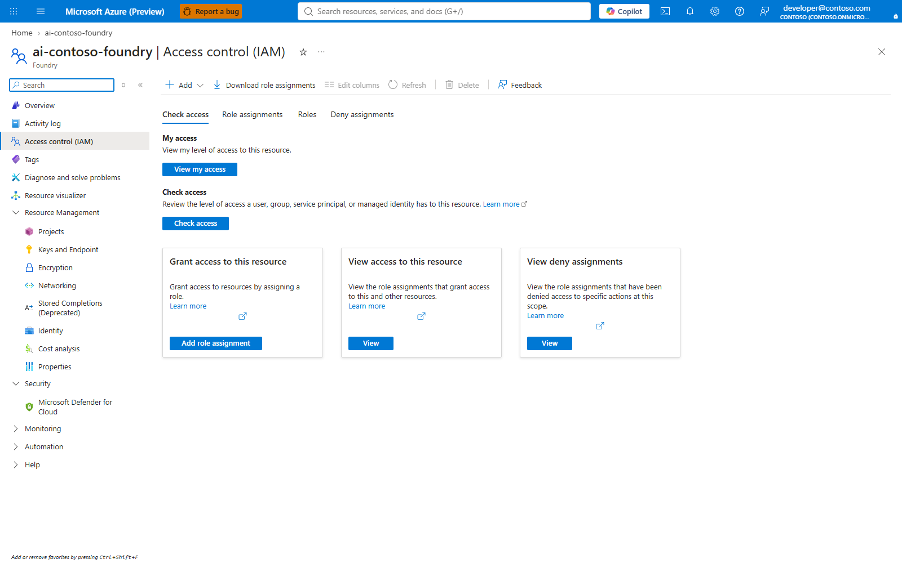

### Azure CLI

```powershell
$apis = @(az apim api list --subscription $sub -g $rg --service-name $apim -o json |
    ConvertFrom-Json)
$apis | Select-Object name, displayName, path, serviceUrl
$api = $apis[[int](Read-Host 'API array index, starting at zero') ]
az apim nv list --subscription $sub -g $rg --service-name $apim `
    --query '[].{name:name,secret:secret}' -o table
az apim nv show --subscription $sub -g $rg --service-name $apim `
    --named-value-id entitlement-source --query value -o tsv
az apim show --subscription $sub -g $rg -n $apim --query identity -o json
```

Policy responses can be raw XML with a BOM. Save the response instead of assuming that
Azure CLI will parse it as JSON:

```powershell
az rest --subscription $sub --method get `
    --url "https://management.azure.com$($api.id)/policies/policy?api-version=2024-05-01" `
    --output-file policy.xml -o none
```

Discover the Foundry account by matching the API's backend host to account endpoints.
After selecting its resource object as `$foundry`, inspect the grant without listing
other people's names:

```powershell
$assignments = @(az role assignment list --subscription $sub --scope $foundry.id `
    --include-inherited --fill-principal-name false -o json | ConvertFrom-Json)
$assignments | Where-Object {
    $_.principalId -eq $gateway.identity.principalId -and
    $_.roleDefinitionName -eq 'Cognitive Services User'
} | Select-Object roleDefinitionName, scope
```

This checks the gateway's grant. It is not a complete bypass audit. Use
`Get-ClaudeBypass.ps1` to review other principals; do not revoke an operator's access
as part of a documentation capture.

## 3. Verify a request and its telemetry

### Azure portal

1. In the Claude API's **Test** tab, select **Create Message**.
2. Use a deployment selected from the customer's actual Foundry deployment list. Use a
   harmless prompt and a small `max_tokens` value. Obtain the Entra bearer token in
   memory through Azure CLI; do not put it in a screenshot or a checked-in file.
3. Verify the response status and the `x-governed-by` / `x-claude-tier` headers.
4. Open the workspace linked through the API diagnostic's Application Insights resource.
   On the workspace **Overview**, verify the ingestion table names. In **Logs**, run the
   request/trace join, using the request's diagnostic marker or correlation identifier.
5. The join is `AppTraces.Properties.RequestId` to
   `ApiManagementGatewayLlmLog.CorrelationId`, not Application Insights operation id.
   Allow for ingestion delay.

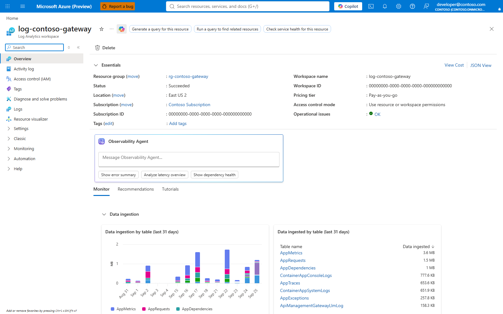

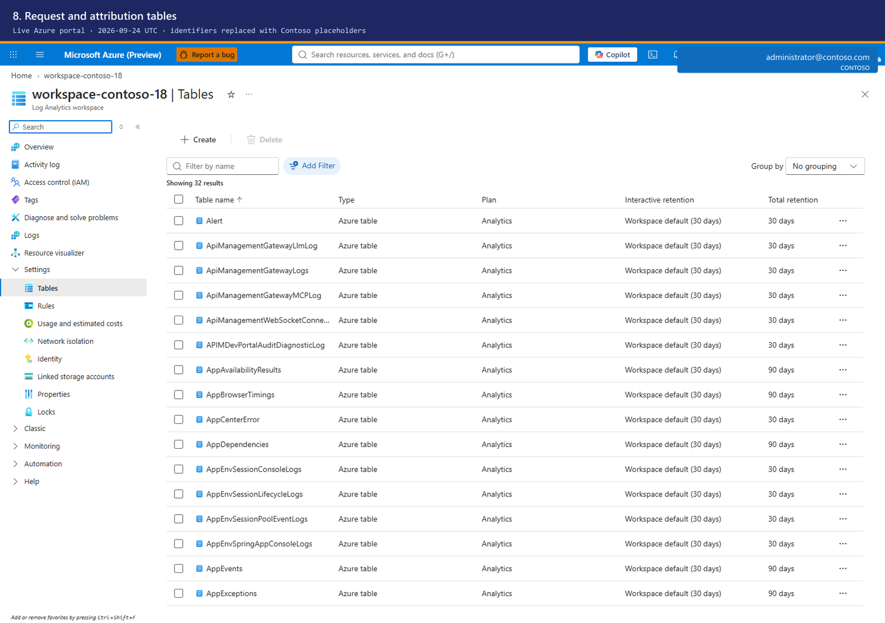

### Azure CLI

Discover rather than assume the model deployment:

```powershell
$deployments = @(az cognitiveservices account deployment list --subscription $sub `
    -g $foundry.resourceGroup -n $foundry.name -o json | ConvertFrom-Json)
$deployments | Select-Object name, @{n='model';e={$_.properties.model.name}}
# Select the intended deployment from this list before sending a request.
```

For a manual query, store only the KQL in the request body file:

```powershell
@{ query = 'ApiManagementGatewayLlmLog | where TimeGenerated > ago(1h) | summarize Requests=count()' } |
    ConvertTo-Json | Set-Content query.json -Encoding utf8
az rest --subscription $sub --method post --resource https://api.loganalytics.io `
    --url "https://api.loganalytics.io/v1$workspaceResourceId/query" --body '@query.json'
```

The capture run proved one marked request returned 200, used 14 prompt / 4 completion
tokens, and joined to exactly one log/trace row. A request without a token returned 401.
The live policy also contained the token-validation, limit, identity-swap and API-key
removal stages. These observations do not prove invoice accuracy or hard quota precision.

## 4. Inspect the optional private projection

### Azure portal

1. Select the projection-enabled gateway discovered from `entitlement-source=projection`.
   Verify the gateway's VNet configuration, not only its SKU.
2. Open the resolver Function. Search its resource menu for **Authentication**.
   Verify **App Service authentication: Enabled**, **Restrict access: Require
   authentication**, **Unauthenticated requests: Return HTTP 401 Unauthorized**, and
   the Microsoft identity provider.
3. Inspect **Networking** for the resolver's inbound and outbound paths.
4. Open the associated Cosmos DB account. Select **Settings > Networking**.
   On **Public access**, verify **Public network access: Disabled** for the private profile.
   On **Private access**, inspect the endpoint connection and its approval.
5. Inspect the linked private DNS zone and VNet link. A private endpoint without usable
   DNS is not a working lookup path.

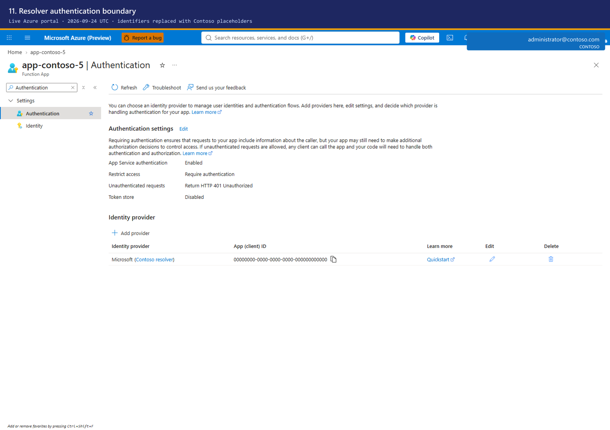

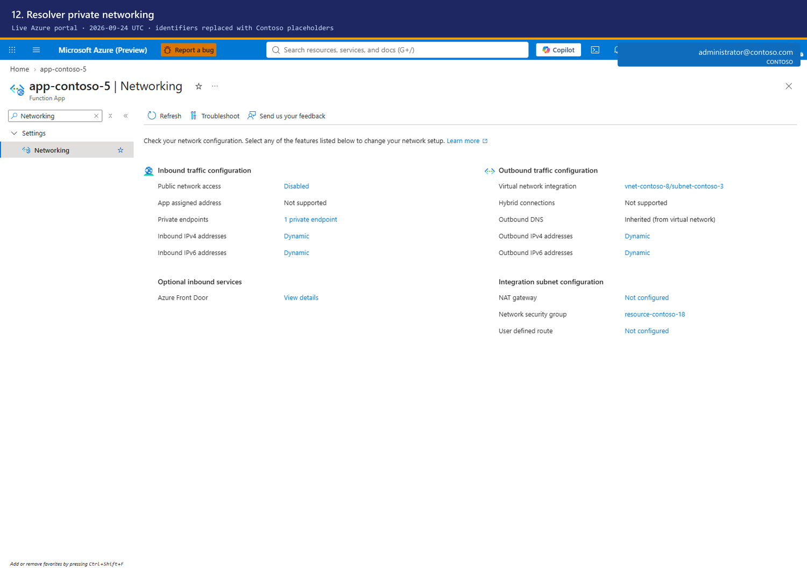

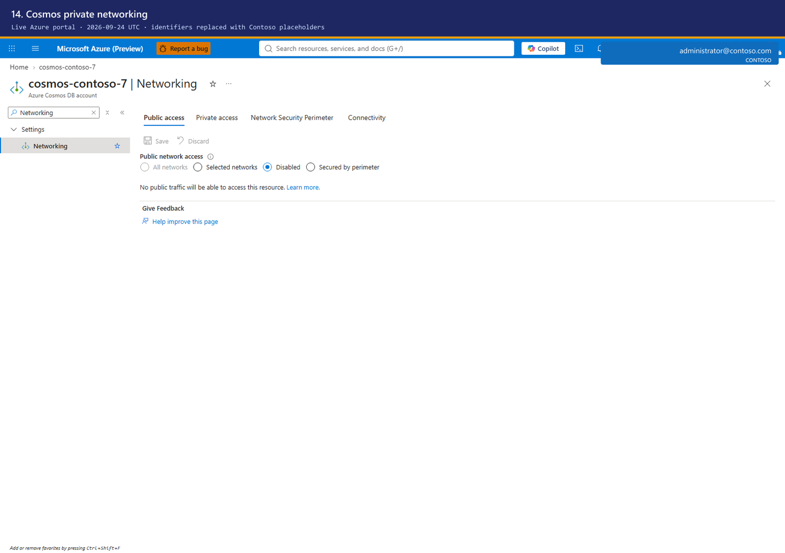

### Azure CLI

Use the resolver URI/audience named values to discover the resolver, then follow its
configuration and private endpoint references. Do not derive names from a fixed prefix.

```powershell
az apim show --subscription $sub -g $projectionGateway.resourceGroup `
    -n $projectionGateway.name --query '{mode:virtualNetworkType,network:virtualNetworkConfiguration}'
az resource show --subscription $sub --ids $resolver.id --api-version 2024-04-01 `
    --query '{inbound:properties.publicNetworkAccess,subnet:properties.virtualNetworkSubnetId,scale:properties.functionAppConfig.scaleAndConcurrency}'
az resource show --subscription $sub --ids $cosmos.id --api-version 2024-05-15 `
    --query '{public:properties.publicNetworkAccess,keysDisabled:properties.disableLocalAuth}'
az network private-endpoint list --subscription $sub -o table
az network private-dns zone list --subscription $sub -o table
```

The live projection gateway retained outbound VNet integration, but the test returned
503 with the policy's freshness-or-availability error. That error alone does **not**
distinguish an expired record from a resolver fault. No positive entitlement read, renewal,
burst admission or writer run is claimed by this capture.

Run a complete reconciliation from an authorized in-VNet writer before asserting the
positive path. Follow [the private projection guide](../SECURE-PROJECTION.md). Do not
temporarily enable public access, extend an expired lease, or invent a portal-only
substitute for the paged directory reconciliation.

## 5. Inspect governance jobs and console authorization

### Azure portal

1. Open **Container App Jobs** and select the discovered apply job. On **Overview**,
   inspect **Trigger Type**, **Container Apps Environment**, **Workload profile**,
   **Replica timeout**, **Replica retry limit**, **Parallelism** and **Completion count**.
2. Use the **Execution history** view to inspect status and timing. **Run now** starts a
   job; it is not a read-only check. Review desired governance before using it.
3. On the apply job's **Access control (IAM)**, inspect the console identity's
   **Container Apps Jobs Operator** assignment. Inspect the job identity's custom
   named-value writer role on the gateway separately.
4. In **Microsoft Entra ID > App registrations**, select the discovered Turnstile
   application. On **App roles**, inspect `Turnstile.Admin`, `Turnstile.Viewer` and
   `Turnstile.Manager`. In **Manifest**, inspect `groupMembershipClaims=ApplicationGroup`.
5. On the corresponding **Enterprise application > Users and groups**, review assignments.
   Do not change roles merely to make a screenshot look like a manager session.

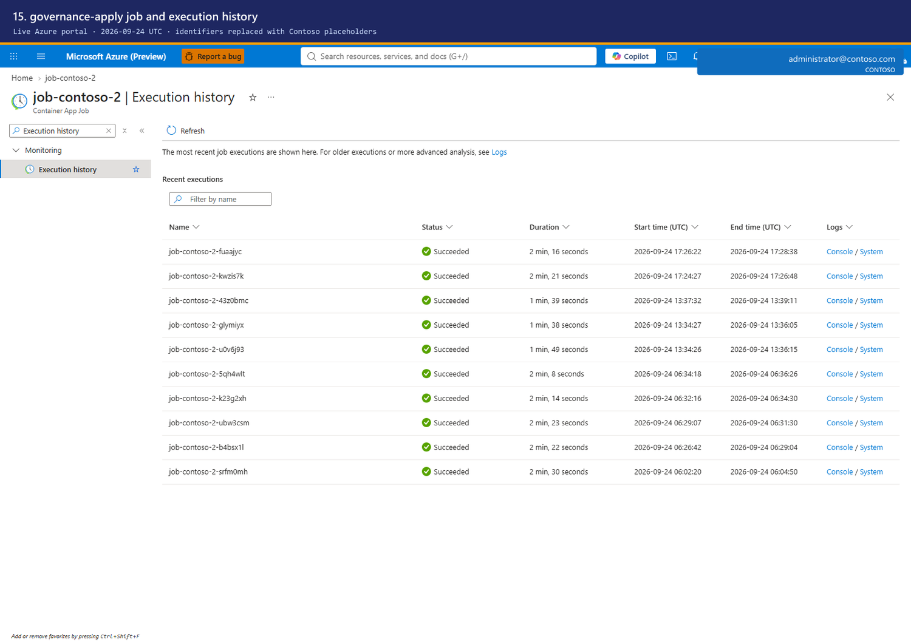

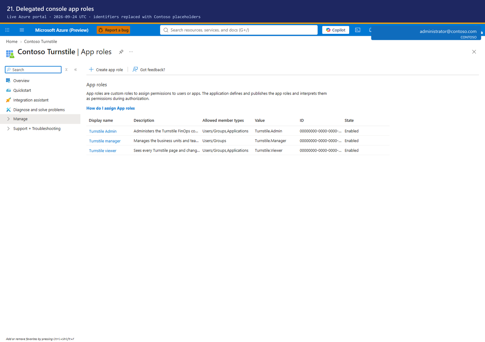

### Azure CLI

```powershell
$jobs = @(az resource list --subscription $sub --resource-type Microsoft.App/jobs -o json |
    ConvertFrom-Json)
$jobs | Select-Object name, resourceGroup, id
# Select the actual job object; do not assume its generated suffix.
az resource show --subscription $sub --ids $job.id --api-version 2025-01-01 -o json
az rest --subscription $sub --method get `
    --url "https://management.azure.com$($job.id)/executions?api-version=2025-01-01"
az ad app show --id $turnstileClientId `
    --query '{roles:appRoles,groups:groupMembershipClaims}' -o json
```

The live API recognized the current account as Owner using Entra. The CLI sign-in
exchange issued a 60-second code, redemption returned 200 and replay returned 401.
The account is not manager-only; scoped manager authorization was not impersonated.

The non-portal follow-up also redeemed a fresh code in a real, isolated browser and
captured the live governance and budgets pages as that Owner. No portal profile was
opened. Only the initial login-code redemption POST was permitted; management writes
were blocked by the capture harness.

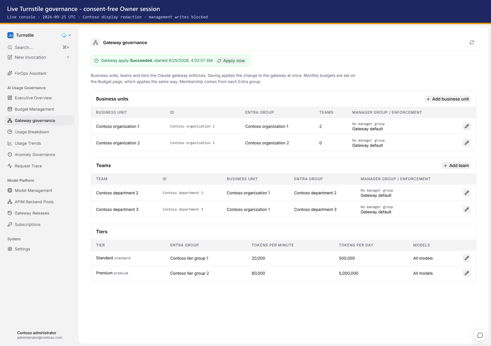

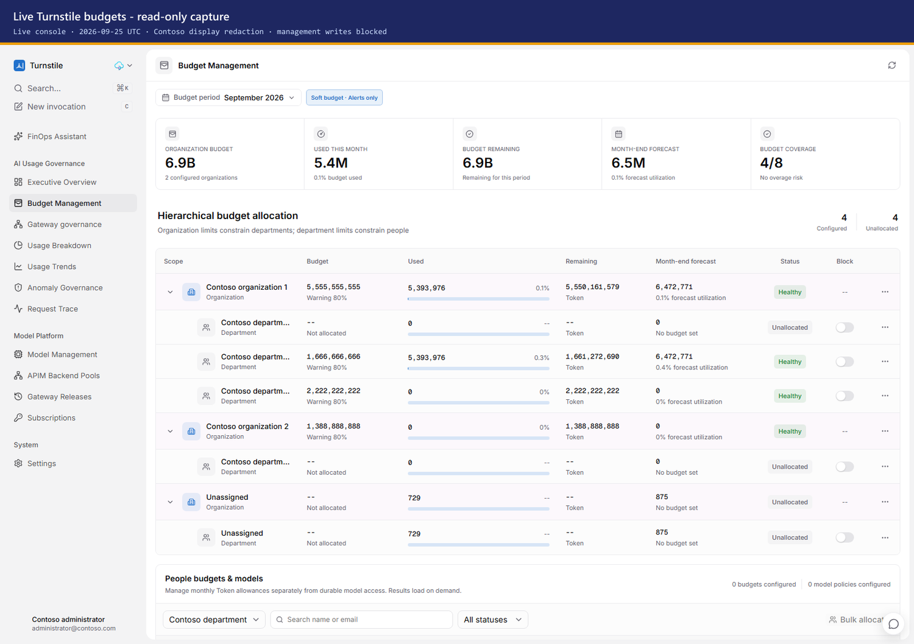

Before considering a new apply, the read-only comparison found **one pending governance
change**. No new save or apply was requested from this packet. Existing execution history
included a successful apply; that is not a new end-to-end apply test.

There is no Azure portal button that performs the console's custom login-code protocol.
`Open-ClaudeTurnstile.ps1` is equivalent to the documented token/HTTP exchange, not to
the Microsoft web sign-in button, which has different consent requirements. Unit/team
manager scopes are application catalog data, not an Azure RBAC blade.

## 6. Inspect P50 report resources

### Azure portal

1. Select the discovered reports jobs, not the Turnstile environment.
   Verify the generator's **Trigger Type: Schedule** and **Cron expression**.
   The default is `0 6 1 * *`; use **Execution history** to inspect actual runs.
2. Open the associated **Container Apps Environment** and VNet. Verify the dedicated
   jobs subnet and private-endpoint subnet.
3. Open report Storage. Under **Networking**, inspect **Public network access** and
   private endpoint connections. Under **Data storage > Containers**, the `configuration`
   and `reports` containers require private data-plane connectivity.
4. On **Access control (IAM)**, inspect the distinct reporting and administration identities.
   The administration identity must not have an email or workspace role.
5. Open the dedicated **Communication Services** and **Email Communication Services**
   resources. Inspect the linked domain and provisioning state. A successful resource
   deployment is not proof of email delivery or inbox placement.

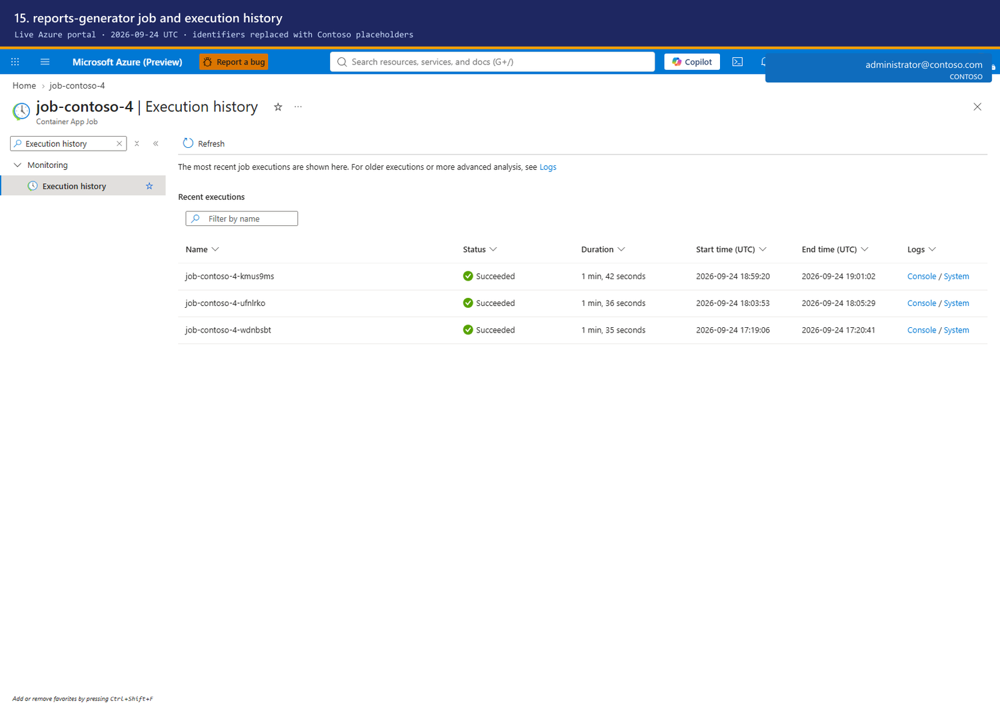

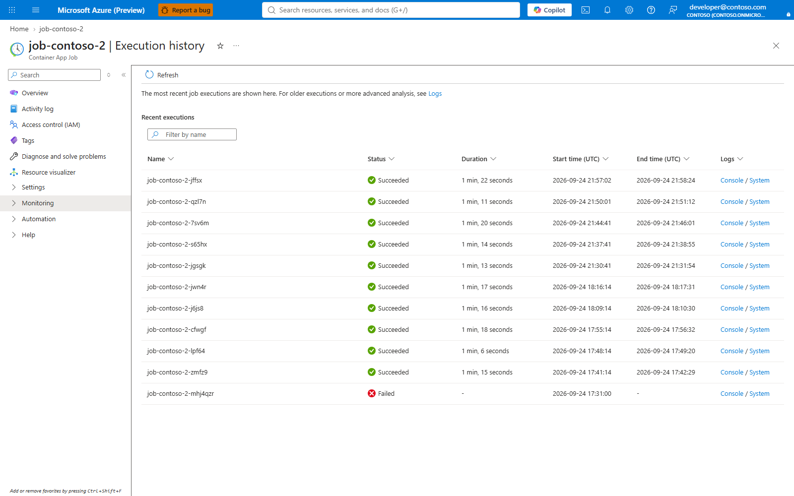

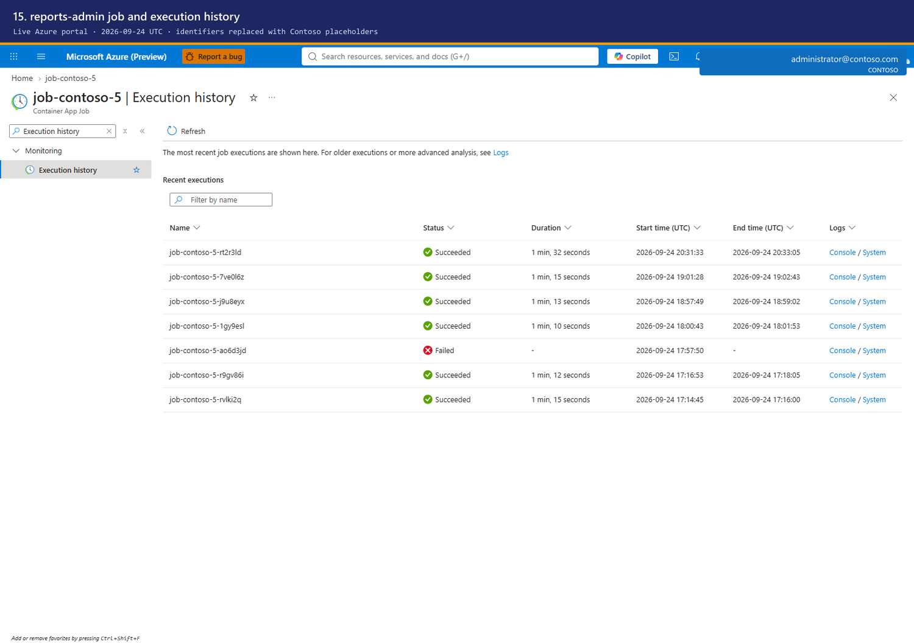

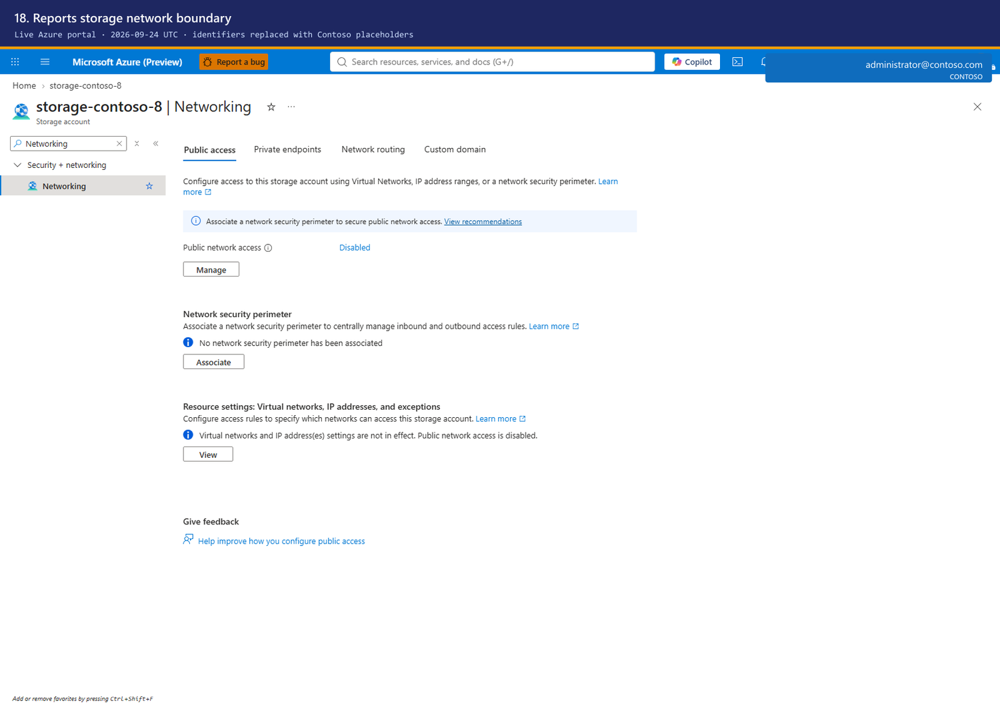

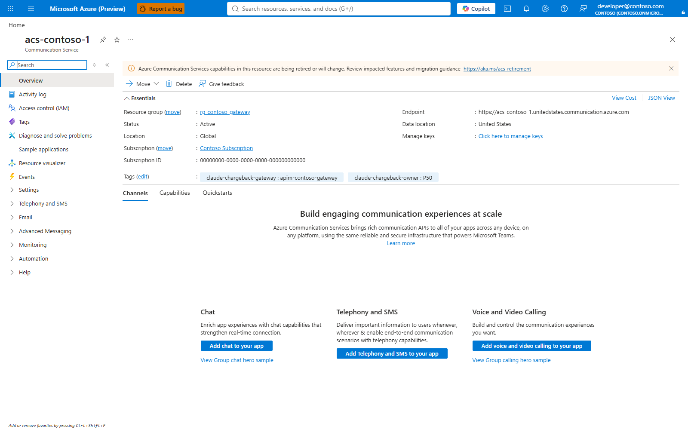

### Azure CLI

```powershell
az resource list --subscription $sub --resource-type Microsoft.App/jobs -o json
az resource list --subscription $sub --resource-type Microsoft.Storage/storageAccounts -o json
az resource list --subscription $sub --resource-type Microsoft.Communication/communicationServices -o json
az resource list --subscription $sub --resource-type Microsoft.Communication/emailServices -o json
az resource show --subscription $sub --ids $reportsStorage.id --api-version 2023-05-01 `
    --query '{public:properties.publicNetworkAccess,sharedKeys:properties.allowSharedKeyAccess,https:properties.supportsHttpsTrafficOnly}'
```

The live execution list contained successful generator, dispatcher and administration
runs. This packet did not send another email to configured recipients or modify private
settings. Private Blob editing cannot be performed from an off-network portal browser
merely because the operator has Owner. See the P50 guide for the in-VNet administration
path and the exact ETag-protected CLI/API operations.

## 7. Verify the terminal consumer

The live terminal capture used the actual Turnstile HTTP backend, not `FakeBackend`.
It loaded 21 overview rows and 8 budget rows with writes blocked. Display-only Contoso
pseudonyms were applied before layout. The captured core still shows the legacy
`claude-finops` label; it is not presented as a screenshot of an unmerged redesigned UI.

The Azure portal alternatives for its underlying data are **Log Analytics > Logs** and
the gateway's **Named values**. There is no native Azure portal blade that reproduces
the application's preview, allocation and delegated-scope engine. Use the
[AUM guide](../CLI-FINOPS.md) for the supported command and console surfaces.

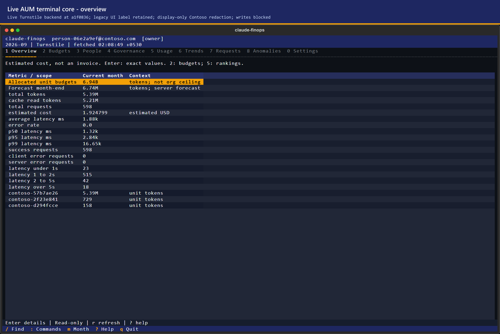

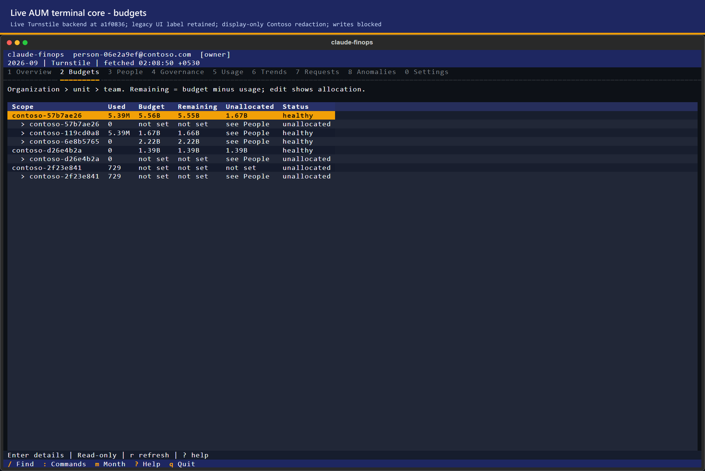

## Capture and publish evidence safely

Portal requirements are declared in
[`guide/captures/architecture.json`](../../guide/captures/architecture.json), using the
shared P53 schema: version 1 with a `steps` array. Targets use discovery aliases,
resource types with runtime filter variables/logical tags, and shared selection keys.
There are no deployed names, ids or URLs in that file.

1. Prepare discovery and redaction inputs before the sign-in window.
   `Get-ArchitectureCapturePlan.ps1` remains a read-only way to inspect actual choices.
2. The lead validates the combined specs without a browser, resolves the real targets,
   then runs one locked batch using the single original profile.
3. At an authentication surface the batch stops without typing credentials. Remaining
   ids stay pending, rather than becoming screenshots of a sign-in page.
4. Review every redacted image and its output path before committing it.
   Existing historical PNGs are not silently relabeled as new batch evidence.

```powershell
# Lead, after the shared P53 runner is integrated:
node guide/capture-portal.mjs --list
node guide/capture-portal.mjs --dry-run --only architecture-gateway-overview
# Only the lead supplies the explicitly authorized profile for the real batch.
# Local, browser-free architecture-spec validation:
node --test guide/architecture-batch.test.mjs
```

Manual capture uses the same portal blades and a local screenshot/redaction tool.
The Azure portal does not render repository diagrams, calculate Git source hashes or
publish files into a checkout; those are local tooling operations, not hidden Azure steps.
The previous per-worktree portal command is retired. Non-portal terminal, console and
report captures do not use the portal profile and remain separate.

### Non-portal console capture

The consent-free browser flow can still be captured without the portal:

```powershell
# Reuse the private discovered plan. This opens an isolated console-only browser.
node guide/capture-architecture-console.mjs
# Inspect both PNGs staged under .shots-entra/architecture-live/redacted first.
```

The script reuses `Open-ClaudeTurnstile.ps1 -NoBrowser`; it does not print or persist
the one-minute link or bearer token. It reads the catalog/tiers for display redaction,
blocks management writes and records the verified browser role. It never clicks the
Microsoft web sign-in button, changes a role, edits a budget or starts an apply.

### Runtime target choices

Use the actual discovered objects, not names from an image. The lead can pass
`--select architecture-gateway=<discovered-id-or-name>` and corresponding selection keys
without a prompt; selections must still match discovered candidates. Generic/Entra
filters are environment variables supplied for that run:

- `ARCHITECTURE_RESOLVER_FILTER` and `ARCHITECTURE_COSMOS_FILTER`
- `ARCHITECTURE_APPLY_JOB_FILTER`
- `ARCHITECTURE_TURNSTILE_APP_FILTER` and `ARCHITECTURE_TURNSTILE_DATABASE_FILTER`
- `ARCHITECTURE_REPORT_GENERATOR_FILTER`, `ARCHITECTURE_REPORT_DISPATCHER_FILTER`
  and `ARCHITECTURE_REPORT_ADMIN_FILTER`

Report storage and ACS use the logical `claude-chargeback-owner=P50` tag plus an explicit
selection if more than one candidate matches. `PORTAL_REDACTIONS_FILE` points to a private,
uncommitted array of `[real value, Contoso replacement]` pairs. Include resource, subnet,
Entra display-name and configuration-map values. The named-value capture additionally
hides read-only value inputs; it does not expose entitlement maps or secrets.

### Pending portal batch

All rows await the lead's next batch. Eighteen output paths already contain individually
reviewed earlier live images; they remain dated evidence, not proof of a new capture.
The database recovery output is new and is an inline path only, not a broken image.
Its manual path is **Azure Database for PostgreSQL flexible servers > selected server >
Overview**: inspect **Server name** and state; the spec does not click **Start** or **Stop**.

| Pending state | Final output |
|---|---|
| pending batch capture (architecture-gateway-overview) | `docs/images/architecture-live/gateway-overview.png` |
| pending batch capture (architecture-gateway-identity) | `docs/images/architecture-live/gateway-identity.png` |
| pending batch capture (architecture-gateway-named-values) | `docs/images/architecture-live/gateway-named-values.png` |
| pending batch capture (architecture-gateway-apis) | `docs/images/architecture-live/gateway-apis.png` |
| pending batch capture (architecture-foundry-overview) | `docs/images/architecture-live/foundry-overview.png` |
| pending batch capture (architecture-foundry-access) | `docs/images/architecture-live/foundry-access.png` |
| pending batch capture (architecture-telemetry-workspace) | `docs/images/architecture-live/telemetry-workspace.png` |
| pending batch capture (architecture-telemetry-tables) | `docs/images/architecture-live/telemetry-tables.png` |
| pending batch capture (architecture-resolver-authentication) | `docs/images/architecture-live/resolver-authentication.png` |
| pending batch capture (architecture-resolver-networking) | `docs/images/architecture-live/resolver-networking.png` |
| pending batch capture (architecture-projection-networking) | `docs/images/architecture-live/projection-networking.png` |
| pending batch capture (architecture-governance-apply-job) | `docs/images/architecture-live/governance-apply-job.png` |
| pending batch capture (architecture-turnstile-app-roles) | `docs/images/architecture-live/turnstile-app-roles.png` |
| pending batch capture (architecture-reports-generator-job) | `docs/images/architecture-live/reports-generator-job.png` |
| pending batch capture (architecture-reports-dispatcher-job) | `docs/images/architecture-live/reports-dispatcher-job.png` |
| pending batch capture (architecture-reports-admin-job) | `docs/images/architecture-live/reports-admin-job.png` |
| pending batch capture (architecture-reports-networking) | `docs/images/architecture-live/reports-networking.png` |
| pending batch capture (architecture-reports-email) | `docs/images/architecture-live/reports-email.png` |
| pending batch capture (architecture-turnstile-database) | `docs/images/architecture-live/turnstile-database.png` |

## Live coverage and limitations

| Flow | Evidence from this pass | Not established |
|---|---|---|
| Default request / Foundry identity | 401 without a token; 200 with 14 input and 4 output tokens; gateway identity grant and live policy guards present | All client applications, streaming edge cases and exact quota limits |
| Merged budget modes | Read-only live inspection found the default strict map and deployed mode, advisory-header and budget-trace code | No additional strict/allowance/notify mutation was performed by this architecture packet |
| Meter / attribute / observe | The marked request joined exactly once across LLM log and trace | Invoice reconciliation and completeness of all historic telemetry |
| Delegated sign-in | Live Owner role; 60-second code; 200 redemption; 401 replay; fresh console-only browser session and two populated pages | Manager-only or Viewer-only sessions |
| Governance apply | Live status and prior successful execution; one pending change detected | A new save/apply cycle; it was deliberately not started |
| Projection | VNet configuration, private Cosmos network setting and live 503 refusal | A fresh positive lookup, complete writer renewal and overload test |
| P50 reports | Prior successful generator, dispatcher and administration executions | A newly generated-and-delivered report or recipient edit from this packet |
| Terminal FinOps | Live HTTP backend and two populated read-only views | Budget writes, Direct Azure UI and service-backend scenarios |

The first console probe timed out because PostgreSQL was **Stopped** while the API
was Running. A stop operation was present in the activity log. Starting that uniquely
discovered database restored **Ready**, and the subsequent auth checks passed. No role,
budget or network configuration changed.

In the portal, that recovery is **Azure Database for PostgreSQL flexible servers >
the selected server > Overview > Start**; verify **Ready** afterwards. The equivalent is:

```powershell
az postgres flexible-server start --subscription $sub -g $database.resourceGroup -n $database.name
az postgres flexible-server show --subscription $sub -g $database.resourceGroup -n $database.name `
    --query state -o tsv
```

The gaps above remain explicit. Configuration screenshots and prior job histories are
not relabeled as freshly executed flows. Completing every positive/mutating flow under
the owner's standing requirement needs a manager-only test identity, a safe governance
change window, an authorized private writer/data-plane path and approved email recipients.

Machine-readable records are [the reviewed capture manifest](../images/architecture-live/captures.json)
and [the bounded live verification results](../images/architecture-live/verification.json).
The verification record intentionally sets `completeUnderStandingRequirements` to false.
