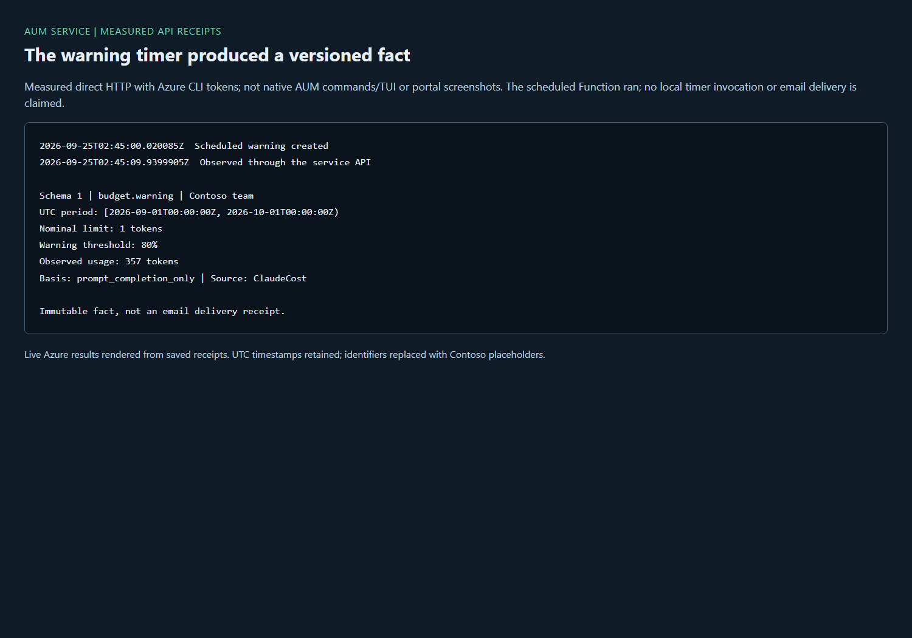
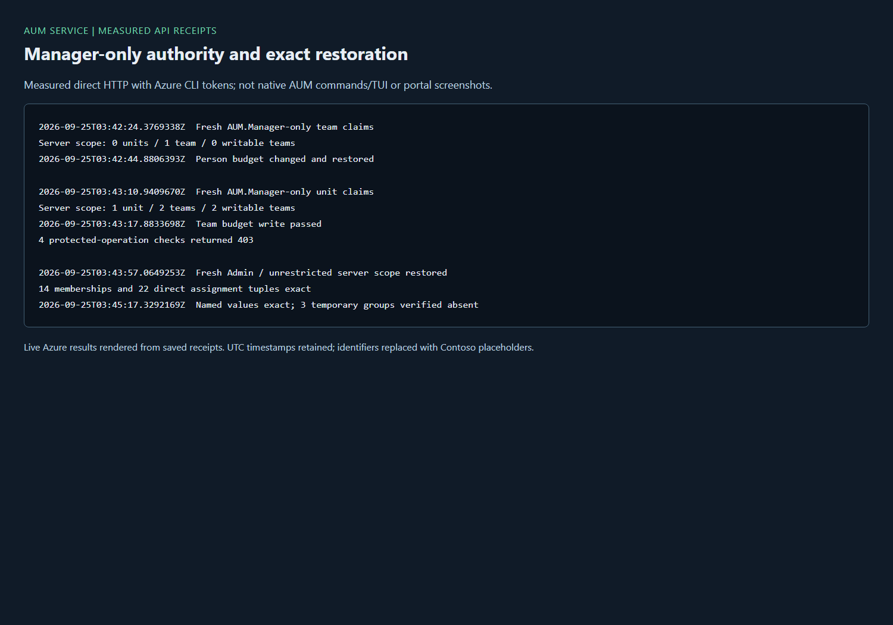

# AUM service: measured live verification

These receipts come from Azure, not mocks. The rendered images show saved API
results with identifiers removed; they are **not native AUM commands/TUI or
Azure portal screenshots**. All timestamps are UTC. See the
[deployment and operations guide](../AUM-SERVICE.md).

## September 24: independent service pilot

An existing isolated non-production gateway/workspace was used because the
reference gateway already had Turnstile authority. That authority was not
bypassed. No reference policy or network was changed.

| Flow | Measured result |
|---|---|
| App-owner registration and CLI token | `AUM.Admin`, v2 `AUM.Access`, expected audience, no consent prompt |
| Authenticated reads | `/me`, capabilities, usage, budgets, people, trends, requests: 200; anonymous `/me`: 401 |
| Analytics | 3,883 requests, one observed person; four unpriced rows, not a zero-cost claim |
| Request cursor | Two real 100-row pages without overlapping IDs; both had continuations |
| Budget and headroom | Limit changed through the Function and read from ARM; byte-identical restore at 20:25:38Z; above-parent write: 409 |
| Decisions | Default self-approval: 403; explicit audited Admin override, rejection and escalation succeeded |
| Boost expiry | Due at 20:27:04Z; actual scheduled timer restored the registry, observed at 20:28:09Z |
| Restore/export | Original empty registry exact, no active boosts, Admin retained, 38 audit records exported at 20:53:06Z |
| Cleanup | All paid pilot resources and its isolated group removed at 21:11:56Z; free owned AUM registration retained |

## September 25: real Claude on a dedicated Basic v2 gateway

The owner separately approved a new, isolated test gateway installed with the
repository installer, its own managed identity and the discovered existing
Foundry deployment. The controlling order was P53's restored/closed window,
then this HTTP fallback, then the Manager-only window below. No native-client
journey was substituted silently.

Five new owned groups provided a test unit, two teams and manager mappings.
Only the test team received temporary inference entitlement. Catalog, budgets
and modes were written through the service; only the dedicated gateway was synced.

| Flow | Measured result, 2026-09-25 |
|---|---|
| Real inference | Standard-tier Claude response: 200 at 02:30:03Z |
| Strict | Team limit 1 eventually refused with 403 at 02:30:38Z |
| Allowance | Nominal 163 / effective 326 tokens, 100% allowance: 200 with `estimated-over-budget` at 02:31:32Z, then 403 at 02:32:44Z |
| Notify | Limit 1 served with 200 and `usage-reported` at 02:32:55Z |
| Attribution | At 02:33:01Z, 17 matching requests, 221 prompt + 68 completion tokens, estimated USD 0.001122, no unpriced rows |
| Scheduled warning | Created at 02:45:00Z and observed at 02:45:09Z: schema 1, 80% threshold, limit 1, observed usage `"357"`, prompt/completion basis; no email claim |
| Configuration recovery | All 22 named values, saved cost-function authored fields and caller memberships exact; five created groups deleted at 02:47:34Z |
| Policy recovery | Transient ARM read-back failure after restore: mutations stopped. Read-only retry proved the exact original test policy at 02:50:31Z; only then was the window closed |

APIM configuration propagation and approximate quota counters allowed requests
before the refusals. These observations do not establish an exact token or
monetary ceiling. The later warning includes later ingested usage, so its 357
tokens need not equal the earlier 289-token attribution snapshot.

## Separate Manager-only service journey

The account had a direct `AUM.Admin` assignment: removing only an Admin group
would not establish Manager-only authority. The approved journey snapshotted all
memberships and direct assignments, temporarily removed the AUM privilege,
and checked newly issued claims **and** the signed-token `/me` server result.
Turnstile assignments were untouched.

| Flow | Measured result, 2026-09-25 |
|---|---|
| Team Manager | Fresh `AUM.Manager` only at 03:42:24Z; scope 0 units / 1 team / 0 writable teams |
| Person budget | Changed to 1,001 daily tokens and removed back to inheritance at 03:42:44Z |
| Team boundaries | Parent-unit filter, outside-team write and own-team allocation write each returned 403 |
| Unit Manager | Fresh `AUM.Manager` only at 03:43:10Z; scope 1 unit / 2 teams / 2 writable teams |
| Unit authority | Team budget +1 succeeded; unit-budget write returned 403 |
| Recovery | Fresh Admin/unrestricted scope at 03:43:57Z; all 14 memberships and 22 principal/resource/role tuples exact |
| Fixture recovery | Original catalog, tiers and all 22 named values exact, three temporary groups deleted at 03:44:25Z; each independently returned 404 by 03:45:17Z |

## Failures discovered, not hidden

- Duplicate Graph owner binding stopped the first inference attempt before a
  group was created. Creation now checks ownership before adding it.
- Empty required APIM budget-trace metadata caused 500 (`The value field is
  required`). The current policy uses `none` for absent parent/notice values;
  tests compile the real expression bodies. The reference policy was untouched.
- A real Manager person write exposed Kusto `SYN0002` at `let latest`.
  `last_observations` compiled and returned the latest real request's team.
  The fix retains bounded IDs and ambiguous-timestamp denial.
- Windows broker caching retained old claims despite MSAL `force_refresh`.
  An in-process renewal helper supplied the previous access token to the
  installed runtime. No new scope, consent grant, cache deletion or SDK-file
  modification was used. One silent renewal failed and was retried; wider
  claims were never accepted as Manager evidence.
- Every failed attempt ran recovery. The shipped inference harness also tests
  publish-before-probe and restoration of exact saved-query properties rather
  than regenerating a snapshot that may have been authored on another day.
- Teardown initially failed on generic private-endpoint deletion. Both
  endpoints remained unchanged; the provider-specific network delete succeeded.
  Removal now uses that scoped operation before DNS cleanup, with a regression.

## Cost and evidence boundaries

The second footprint's discovered Basic v2 rate was $0.20548/hour
($4.93152/day), plus about $0.512877/day for private service networking and
additional consumption/storage: approximately **$5.44/day**, not a sub-$5/month
public-storage profile. Its resource group was verified absent at
**2026-09-25 05:33:00Z**, with zero remaining grants for both retired identities
and both empty foundation groups deleted. Before removal, 132 audit records and
the warning fact were exported; there were no active boosts. At 05:36:31Z,
the account's 14 memberships and 22 direct assignment tuples still matched.
No paid P55 test resources remain; the free app registration is retained.

Portal capture obtained two resource images in the first pilot, then stopped at
Entra sign-in. The twelve versioned `guide/captures/p55.json` capture targets
remain lead-owned and pending. Neither these API cards nor the bounded-query
tests prove portal completion, native-client support, or 500,000-person latency.
Entra targets remain; Function/Storage captures need another explicitly priced
deployment, not stale screenshots of the retired service.
