# Operate chargeback reports in the portal and Azure CLI

## Overview

This reference accompanies [Chargeback reports](../CHARGEBACK-REPORTS.md). The portal images
on this page are **live Azure portal captures**, taken on 2026-09-24 and redacted before saving:
resource names, identifiers and identities are Contoso placeholders. The settings, execution
statuses and controls are real. The separate example email/CSV images in the overview are
fixtures and are labeled as such.

The portal can manage report resources and run the private administration job. It cannot
render this repository's CSV/HTML reports itself. Private blob contents also require a
network-connected browser; an Owner role does not bypass a disabled public endpoint.

These two images use **actual generated report data**, not the fixture. Identity/unit
labels are replaced with Contoso placeholders; counts and cost estimates are unchanged.

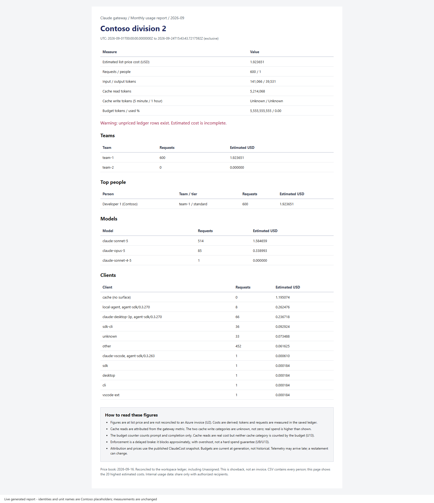

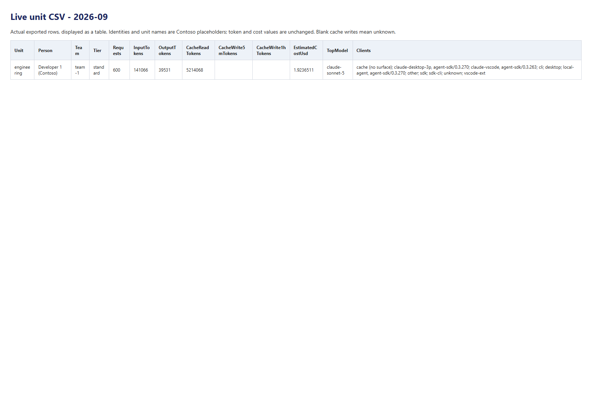

## Prerequisites and discovery

1. Sign in to **Azure portal > Directories + subscriptions** and select the intended directory
   and subscription. Do not assume the directory shown when the portal first opens.
2. Open **Resource groups**, select the gateway's group, and open its **API Management service**.
3. Follow its **Application Insights diagnostic > Logger > Application Insights > Properties >
   Workspace** to identify the telemetry workspace.
4. For scripts, use the numbered discovery command. Enter accepts the displayed default:

   ```powershell
   .\scripts\Get-ClaudeChargebackTarget.ps1 -Inventory
   ```

5. For unattended use, supply choices explicitly. The command validates ambiguous selections
   rather than silently choosing the first gateway:

   ```powershell
   $target = .\scripts\Get-ClaudeChargebackTarget.ps1 `
     -SubscriptionId '<subscription-id>' -ResourceGroup 'rg-contoso' `
     -ApimName 'apim-contoso' -NonInteractive -Inventory
   $rg = $target.ResourceGroup
   $apim = $target.ApimName
   $subscription = $target.SubscriptionId
   $workspace = $target.WorkspaceResourceId
   ```

Equivalent Azure CLI inventory:

```powershell
az account list -o table
az account set --subscription '<selected-subscription-id>'
az group list -o table
az apim list -o table
az monitor diagnostic-settings list --resource '<selected-apim-resource-id>'
az network vnet list -o table
az network vnet subnet list -g $rg --vnet-name '<selected-vnet>' -o table
az network private-dns zone list -o table
az storage sku list -o json
az containerapp env workload-profile list-supported -l '<selected-region>' -o table
```

`Get-ClaudeGatewayTarget.ps1` supplies existing installer/environment choices. New-network
registration shows regional VNets/subnets/DNS zones and requires an explicit private CIDR
plan when creating a network; no reference VNet range is built in. StorageV2 Standard LRS
and Consumption availability are checked in the chosen region. No Key Vault is selected:
this feature uses Entra authentication and has no connection string.

For the following procedures, select the reports resources from the actual inventory:

```powershell
$resources = $target.Resources
$storage = @($resources | Where-Object type -eq 'Microsoft.Storage/storageAccounts')[0]
$generator = @($resources | Where-Object { $_.type -eq 'Microsoft.App/jobs' -and $_.name -notmatch 'mail|admin' })[0]
$dispatcher = @($resources | Where-Object { $_.type -eq 'Microsoft.App/jobs' -and $_.name -match 'mail' })[0]
$adminJob = @($resources | Where-Object { $_.type -eq 'Microsoft.App/jobs' -and $_.name -match 'admin' })[0]
$communication = @($resources | Where-Object type -eq 'Microsoft.Communication/CommunicationServices')[0]
$emailService = @($resources | Where-Object type -eq 'Microsoft.Communication/EmailServices')[0]
```

If an inventory has multiple candidates, choose the intended row by its resource ID. Do not
copy names from a screenshot or select an unrelated application's resource.

## Create and verify email resources

### Portal

1. Select **Create a resource > Email Communication Services > Create**.
2. Set **Subscription**, **Resource group**, a new resource **Name**, and **Data location**
   appropriate to your deployment. Select **Review + create > Create**.
3. Open the Email Communication Service. Expand **Settings > Provision domains**.
4. Select **Add domain > Azure subdomain** (the overview also offers **1-click add**).
   No customer DNS ownership or tenant-administrator consent is required.
5. Verify **Domain status**, **SPF status**, **DKIM1 status** and **DKIM2 status** are **Verified**.
6. Create a separate **Communication Services** resource in the same data location.
7. Open it and select **Email > Domains > Connect domains**. Choose the Email Communication
   Service and its Azure-managed domain. Confirm **Status: Connected**.

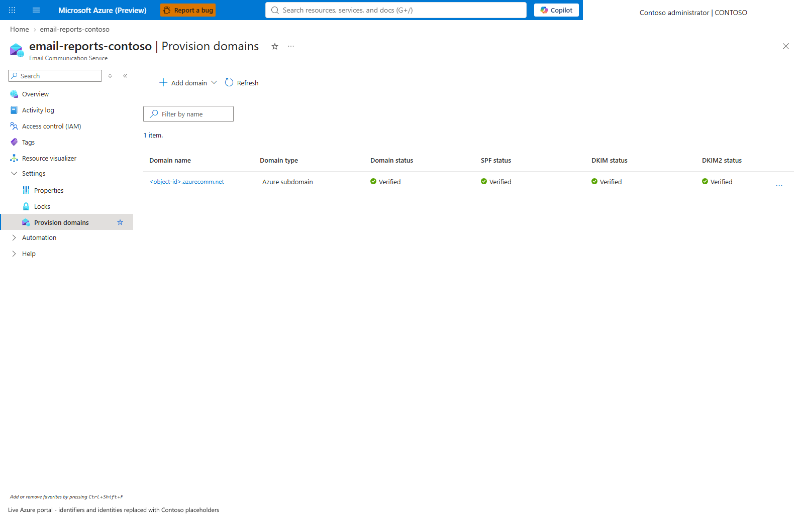

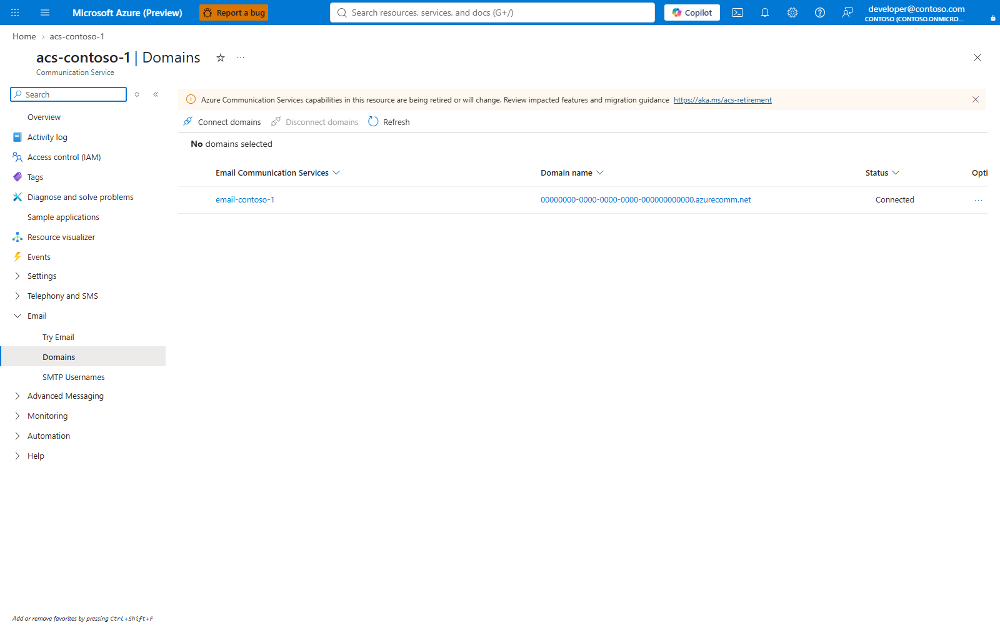

### Azure CLI

The repository template creates these resources without reading keys:

```powershell
az deployment group create -g $rg -n '<report-deployment-name>' `
  --template-file .\infra\chargeback-reports.bicep --parameters '@reports.parameters.json'
az resource show --ids $emailService.id -o json
az resource show --ids ($emailService.id + '/domains/AzureManagedDomain') -o json
az resource show --ids $communication.id -o json
```

Supply a parameter file containing the discovered gateway/workspace, selected region,
published commit and chosen network/subnet/DNS values. Use
`Register-ClaudeChargebackSchedule.ps1` to create that parameter file safely.

## Create private storage, recovery and retention

### Portal

1. Select **Storage accounts > Create**. Choose **StorageV2**, **Standard**, **Locally-redundant
   storage (LRS)** and your selected region.
2. Under **Advanced**, require secure transfer, choose **Minimum TLS version: Version 1.2**,
   disable **Allow Blob anonymous access**, and disable **Allow storage account key access**.
3. Under **Networking**, set **Public network access: Disabled**. Add a private endpoint for
   the **blob** target subresource in the selected endpoint subnet.
4. In **Private DNS zones**, create or select `privatelink.blob.core.windows.net`. Add a
   link under **DNS Management > Virtual Network Links** to the reports VNet. Existing zones are selected by ID, not
   retagged as if they belonged to reports.
5. Open Storage **Data storage > Containers > Add container**. Create `configuration` and
   `reports`; set **Anonymous access level: Private**.
6. Open **Data management > Data protection**. Enable blob versioning, blob soft delete and
   container soft delete. The template uses seven days for soft delete.
7. Open **Data management > Lifecycle management > Add a rule**:
   - **Rule name:** `report-retention`.
   - **Rule scope:** limit with filters.
   - **Blob type:** block blobs.
   - **Prefixes:** `reports/runs/` and `reports/outbox/`.
   - Delete current blobs after **400 days since last modification**.
   - Delete previous versions and snapshots after **400 days since creation**.
8. Add `configuration-history`: prefix `configuration/`, delete **previous versions only**
   after 400 days. Do not expire the current settings or dispatch-control blob.
9. Verify these values on the overview and lifecycle pages.

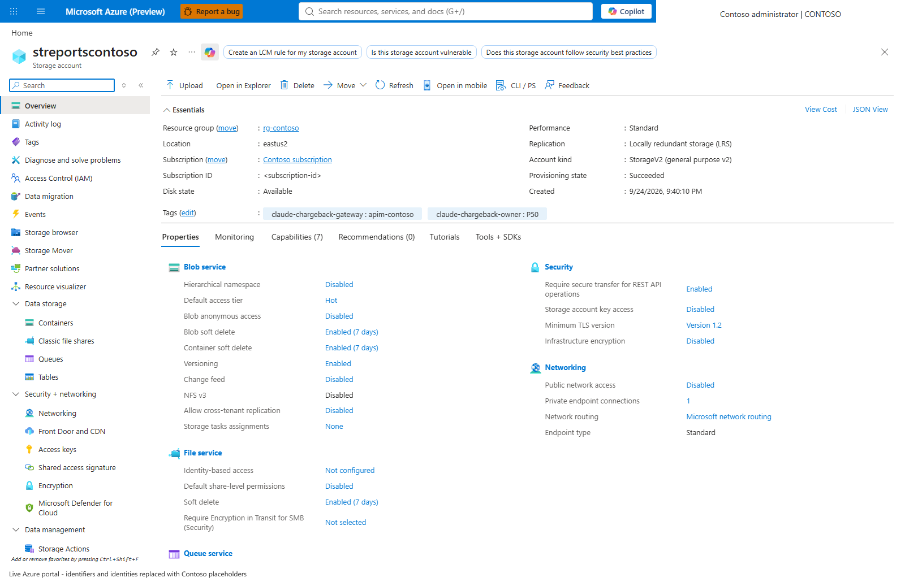

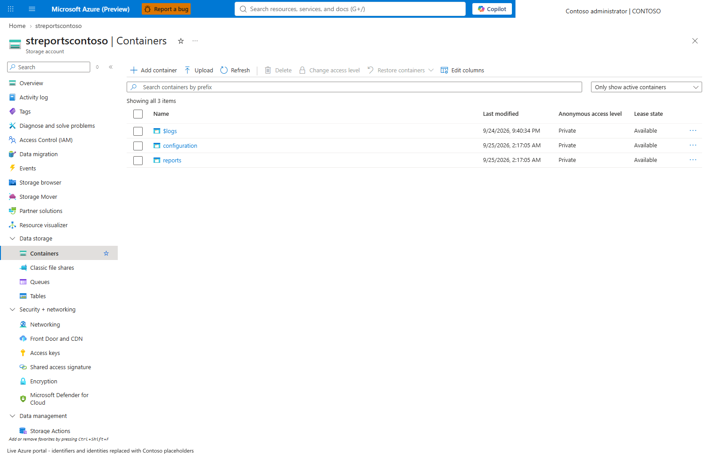

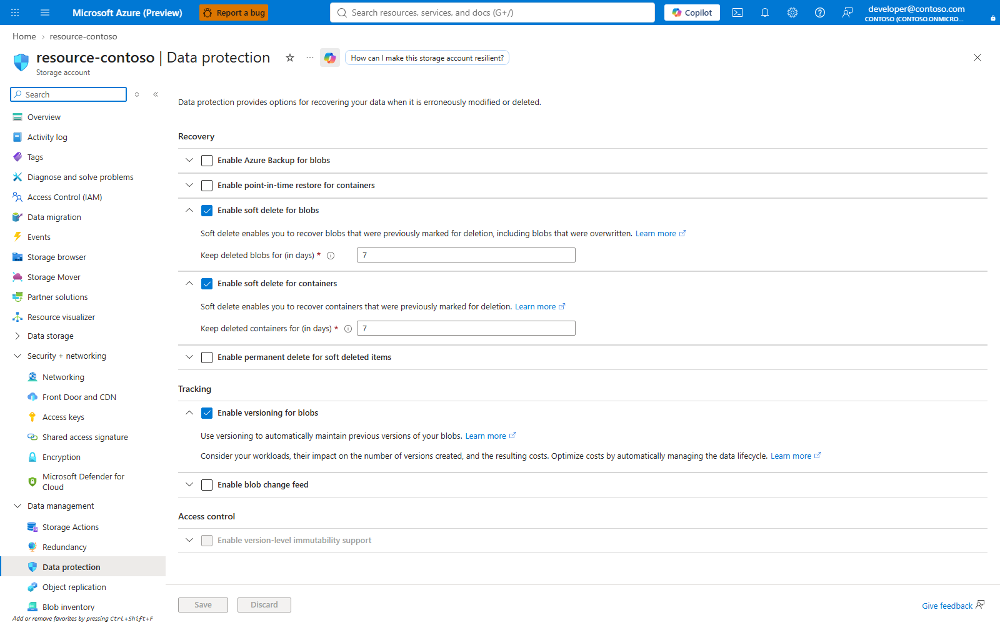

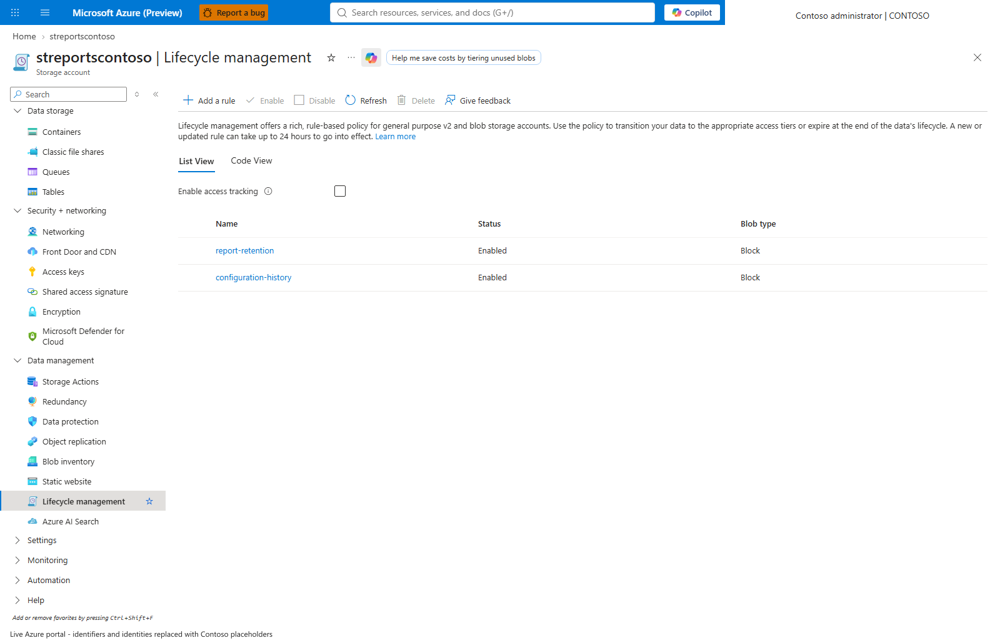

### Azure CLI

```powershell
az storage account show --ids $storage.id -o json
az storage account update --ids $storage.id `
  --allow-blob-public-access false --allow-shared-key-access false `
  --https-only true --min-tls-version TLS1_2 --public-network-access Disabled
az storage account blob-service-properties update -g $rg --account-name $storage.name `
  --enable-versioning true --enable-delete-retention true --delete-retention-days 7 `
  --enable-container-delete-retention true --container-delete-retention-days 7
az storage account management-policy show -g $rg --account-name $storage.name -o json
az storage account management-policy create -g $rg --account-name $storage.name `
  --policy '@report-lifecycle.json'
```

The lifecycle JSON must contain the rule filters and actions above. The script
`Set-ClaudeChargebackSettings.ps1 -RetentionDays 400` updates the existing rule without
replacing unrelated rules.

On a connected terminal, create/list containers with Entra, never account keys:

```powershell
az storage container create --account-name $storage.name --name configuration --auth-mode login
az storage container create --account-name $storage.name --name reports --auth-mode login
az storage container list --account-name $storage.name --auth-mode login -o table
```

## Select networking and assign identities

### Portal

1. Open **Virtual networks** and inspect the real regional networks and address spaces.
2. For a new dedicated network, select **Create** and enter an address range approved by your
   network owner. There is no deployment-specific CIDR default in the scripts.
3. Open **Settings > Subnets**. Create a jobs subnet of `/27` or larger and delegate it to
   **Microsoft.App/environments**. Use a separate, undelegated subnet for private endpoints.
4. Create **Container Apps environments > Create** with **Workload profiles** and
   **Consumption**. Under **Networking**, choose that VNet and jobs subnet.
5. Under **Managed Identities**, create separate reporting and administration identities.
6. In each job, open **Settings > Identity > User assigned > Add** and select its identity.
7. Use the target resource's **Access control (IAM) > Add > Add role assignment**:
   - Select the role from the table in the main guide.
   - Under **Members**, choose **Managed identity > Select members**.
   - Select the correct reporting/admin identity, then **Review + assign**.
8. Open the reporting identity's **Azure role assignments** and verify scope and role.

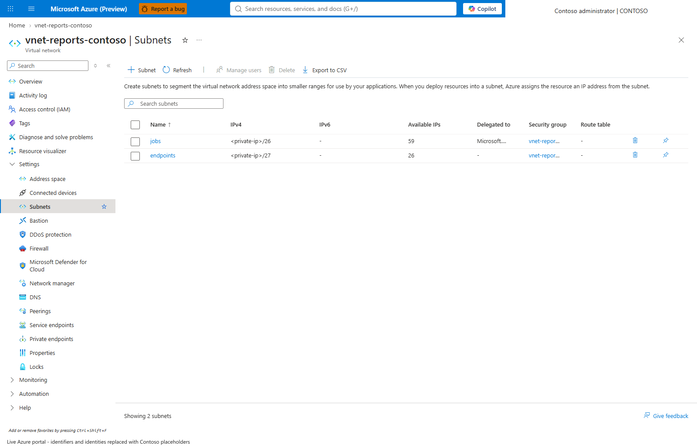

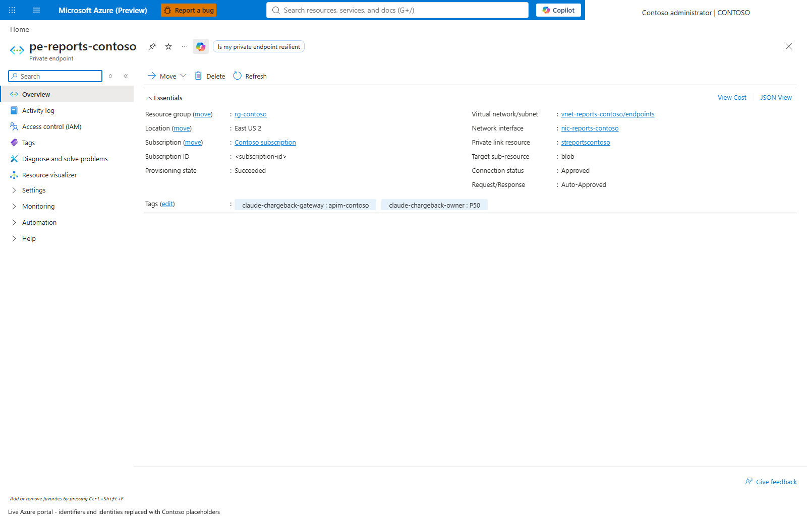

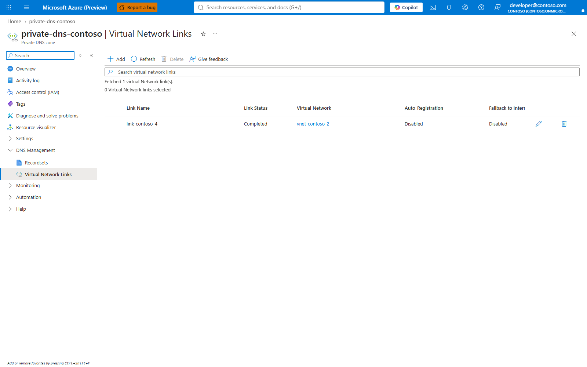

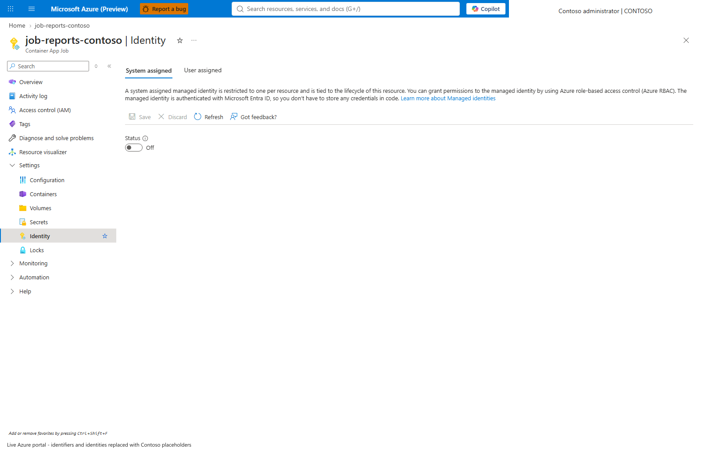

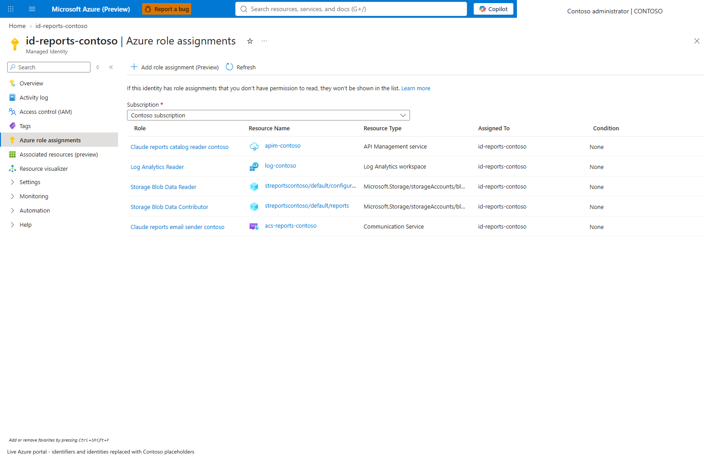

### Azure CLI

```powershell
az network vnet list -o table
az network vnet subnet list -g '<network-resource-group>' --vnet-name '<selected-vnet>' -o table
az network private-endpoint list -g $rg -o table
az network private-dns link vnet list -g '<dns-resource-group>' `
  --zone-name privatelink.blob.core.windows.net -o table
az identity list -g $rg -o table
az containerapp job identity show -g $rg -n $generator.name -o json
az role assignment list --assignee-object-id '<selected-reporting-principal-id>' --all -o table
az role assignment create --assignee-object-id '<selected-reporting-principal-id>' `
  --assignee-principal-type ServicePrincipal --role 'Log Analytics Reader' --scope $workspace
```

Assign blob roles at the **container**, not subscription. The custom gateway reader contains
only `Microsoft.ApiManagement/service/namedValues/read`. The custom email role contains
CommunicationServices read/write at the dedicated ACS resource, not keys/delete. The Bicep
files contain the exact assignable scopes and definitions.

## Generate, schedule and inspect a report

### Portal

1. Open the generator job's **Overview**. Verify **Provisioning status: Succeeded**,
   **Trigger Type: Schedule**, and **Workload profile: Consumption**.
2. Select **Settings > Configuration**. Set **Cron Expression** to `0 6 1 * *` for
   06:00 UTC on day 1. Set **Replica Timeout: 3600**, **Replica retry limit: 0**,
   **Parallelism: 1**, **Completion count: 1**. Select **Apply**.
3. On **Overview**, select **Run now**. This uses current configuration and the pinned code.
4. Under **Monitoring > Execution history** (or **Overview > Execution history > View**),
   verify **Succeeded** and inspect start/end times.
5. Select **Console** for recent pods or **Monitoring > Logs** for durable evidence.
   Completed pods can be removed; that is not loss of the durable workspace log.
6. To select units/formats or month-to-date mode, use the configuration procedure below.
   For a specific historic month by hand, run `New-ClaudeChargebackReport.ps1 -Month yyyy-MM`
   on an authorized terminal. The portal does not implement the report renderer.


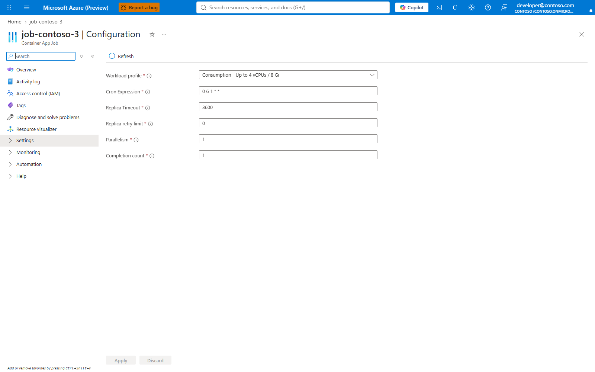

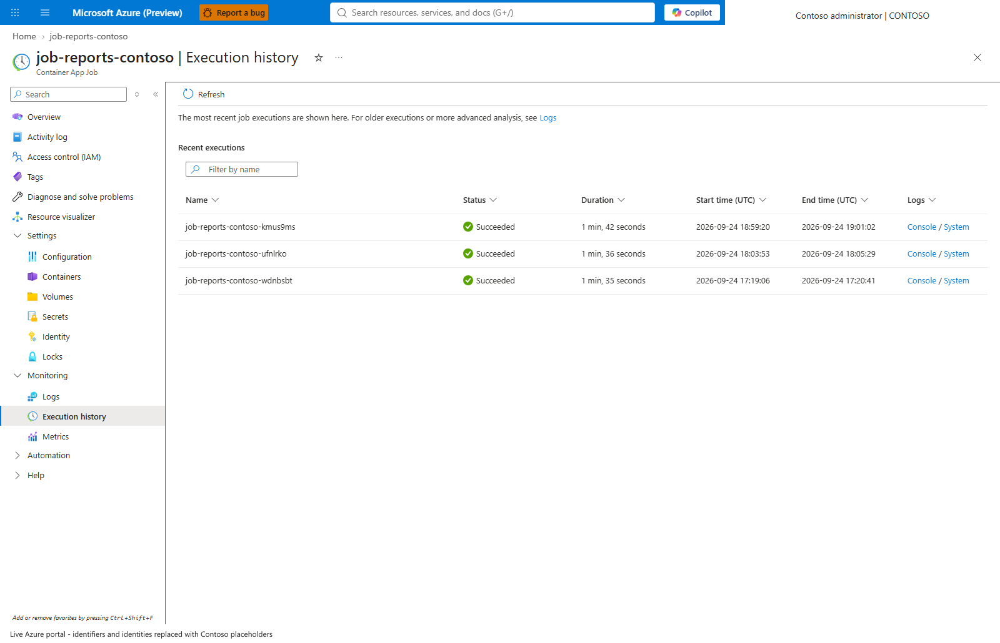

### Azure CLI

```powershell
az containerapp job show -g $rg -n $generator.name -o json
az containerapp job update -g $rg -n $generator.name --cron-expression '0 6 1 * *'
$execution = az containerapp job start -g $rg -n $generator.name --query name -o tsv
az containerapp job execution show -g $rg -n $generator.name --job-execution-name $execution -o json
az containerapp job execution list -g $rg -n $generator.name -o table
az containerapp job logs show -g $rg -n $generator.name `
  --execution $execution --container reports --tail 30
```

For a direct Logs export, open the discovered workspace's **Logs**, run the saved function
with the exact UTC window, and select **Export > CSV**. This exports the query result only;
it does not replace the script's artifact hashes, per-unit privacy and reconciliation checks.

## Change recipients, domains, units and formats

### Portal on a connected network

1. Open Storage **Data storage > Containers > configuration > settings.json**.
2. Select **Download** or **Edit**. Change only schema-supported values:
   - `AllowedDomains`: exact organizational DNS domains; never empty.
   - `Units`: unit identifier mapped to recipient-address array.
   - `AllUnitsRecipients`: authorized administrators.
   - `BusinessUnits`: selected root identifiers; empty means all.
   - `Formats`: `CSV`, `HTML` or both; delivery requires both.
   - `MonthToDate`, `DeliveryEnabled`: JSON booleans.
   - `RetentionDays`: 1-3650; also update lifecycle management.
3. Save/upload the document. For concurrent administrators, prefer the ETag-protected script;
   a blind portal overwrite can lose another person's edit.
4. Verify the current version and **Versions** history.

**Measured network restriction:** the supplied capture browser is outside the reports VNet.
The container list is visible, but blob contents correctly return **403**. These images show
the real restriction, not a fabricated successful editor. Connect the browser/terminal through
your approved network path or use the private administration job. Do not enable public
Storage access just to make this blade work.

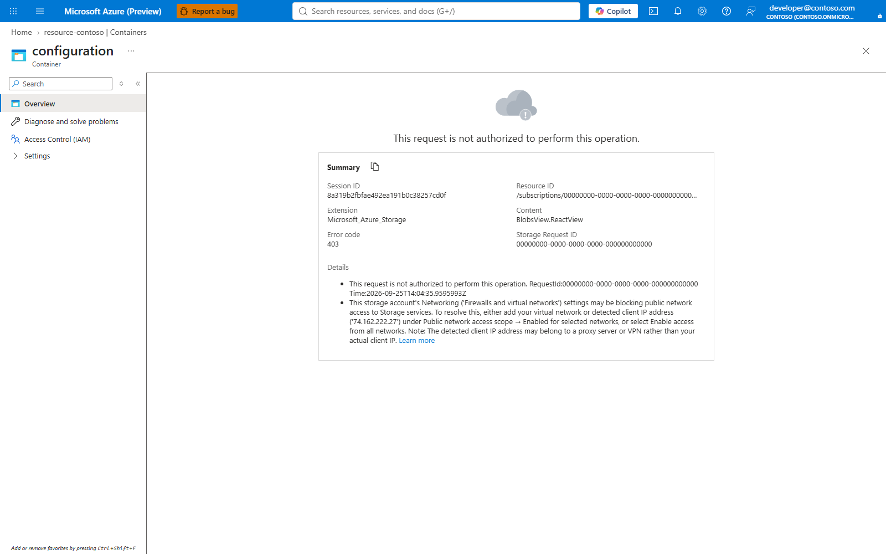

### Portal without a network-connected browser

1. Open the **administration job > Settings > Containers**.
2. Select the `reports` container to edit it, then select **Environment variables**.
3. Add **Name:** `REPORT_ADMIN_JSON`; **Source:** manual/value; **Value:** readable JSON.
   For example, to add one recipient:

   ```json
   {"Operation":"Recipients","Scope":"engineering","Add":["alice@contoso.com"]}
   ```

4. Use `Remove` instead of `Add` to remove an address. Use `{"Operation":"Inspect"}` to read
   counts/settings without logging full address lists. To change selection/formats:

   ```json
   {"Operation":"Settings","Settings":{"BusinessUnits":["engineering"],"Formats":["CSV","HTML"],"MonthToDate":false,"DeliveryEnabled":true}}
   ```

5. Do not keep `REPORT_ADMIN_REQUEST` and `REPORT_ADMIN_JSON` together. The job refuses an
   ambiguous payload. Do not modify the pinned command, image or identity.
6. Select the editor's save button, then **Apply** on the Containers page.
7. Select **Overview > Run now**; verify success in **Monitoring > Execution history**.
8. Remove `REPORT_ADMIN_JSON` and select **Apply** after the operation. Repeated add/remove
   operations are idempotent, but leaving an old action in the job can confuse the next admin.

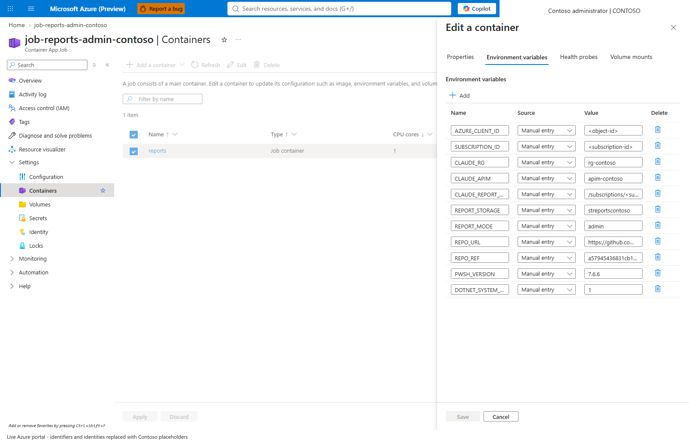

### Azure CLI

On a connected terminal, download/edit/upload with Entra:

```powershell
az storage blob download --account-name $storage.name --container-name configuration `
  --name settings.json --file settings.json --auth-mode login
# Edit the JSON and retain its schema; do not paste secrets or negotiated prices.
az storage blob upload --account-name $storage.name --container-name configuration `
  --name settings.json --file settings.json --auth-mode login --overwrite true --if-match '<last-read-etag>'
```

Off-network, submit an execution override rather than editing the persistent job:

```powershell
az containerapp job show -g $rg -n $adminJob.name -o json
az rest --method post --url `
  ("https://management.azure.com" + $adminJob.id + "/start?api-version=2025-01-01") `
  --body '@admin-execution.json'
```

`admin-execution.json` contains `containers` with the existing `name`, `image`, `command`,
`resources` and `env`, plus `REPORT_ADMIN_JSON`. Do not send management-only `volumes` or
`imageType`: the start-execution API rejects them. The PowerShell `-ViaJob` commands build
this execution-only shape and leave the persistent job untouched.

## Deliver, resend and verify

### Portal

1. Open the dispatcher **Settings > Event-driven scaling**.
2. Verify **Polling interval: 420**, **Minimum executions: 0**, **Maximum executions: 1**.
3. The `azure-blob` rule uses the discovered storage account, container `reports`, and prefix
   **`outbox`**, without a trailing slash; KEDA adds its delimiter.
4. Use the reporting managed identity for scale authentication. Where the portal does not
   expose identity auth, use the template/CLI; do not substitute a connection string.
5. On the dispatcher **Overview**, **Run now** performs one paced action. Do not remove the
   pacing guard to force a send.
6. Inspect **Execution history** and the archived manifest `Sends` records. `Submitted` is
   not completed. `Succeeded` from ACS is not proof of Inbox placement.
7. For manual resend, run `Send-ClaudeChargebackReport.ps1 -Resend` on a connected terminal.
   The portal's job run button is not a report-specific resend editor.

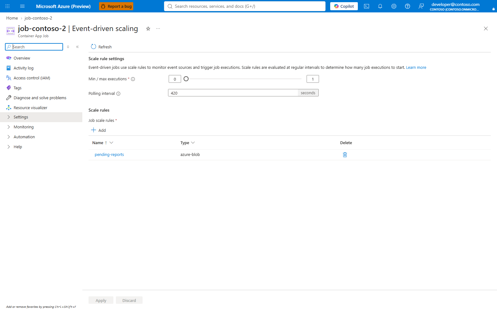

### Azure CLI

```powershell
az containerapp job show -g $rg -n $dispatcher.name -o json
az containerapp job start -g $rg -n $dispatcher.name
az containerapp job execution list -g $rg -n $dispatcher.name -o table
az storage blob list --account-name $storage.name --container-name reports `
  --prefix 'runs/<month>/<run-id>/' --auth-mode login -o table
az storage blob download --account-name $storage.name --container-name reports `
  --name 'runs/<month>/<run-id>/manifest.json' --file manifest.json --auth-mode login
```

Those blob commands need network access. Mail operation IDs/counts, not address lists, appear
in the manifest. The renderer/queue scripts are the equivalent CLI for report-specific
generation and resend; generic `az communication email send` does not enforce the per-unit
privacy, archive hashes or current recipient policy implemented here.

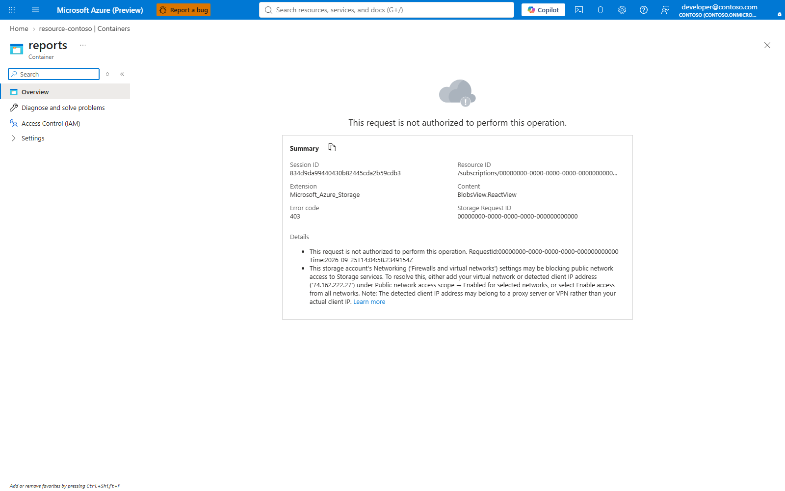

## Remove and recover

### Portal

1. In the resource group, filter on `claude-chargeback-gateway` and verify every selected
   resource belongs to the intended reports deployment.
2. Delete jobs before the environment. Remove only the reports private endpoint and VNet
   link. Do not delete a shared VNet/DNS zone selected during discovery.
3. Delete the dedicated Communication Service, Email Service/domain and identities.
4. Keep storage to preserve reports/configuration, or explicitly delete it for a purge.
5. Review the dedicated identity's remaining role assignments and custom roles.
6. Do not delete the resource group: it also contains the gateway and workspace.

### Azure CLI

```powershell
.\scripts\Register-ClaudeChargebackSchedule.ps1 -Remove -WhatIf
.\scripts\Register-ClaudeChargebackSchedule.ps1 -Remove
.\scripts\Register-ClaudeChargebackSchedule.ps1 -Remove -PurgeArchive -WhatIf

# Individual GUI Delete buttons correspond to ARM resource deletion:
az resource delete --ids '<verified-report-resource-id>'
```

The remove/preserve/purge flow was exercised against isolated tagged canary storage and
identity resources; the working report archive was not destroyed. The original unnetworked
reports environment was also actually removed during the private-network correction.

For a stale dispatch lease, first verify no execution is active. On a connected terminal:

```powershell
az storage blob lease break --account-name $storage.name --container-name reports `
  --blob-name state/dispatch.json --auth-mode login
```

Portal: **reports > state > dispatch.json > Break lease**. Never break an active sender's
lease. Restore accidental deletion through Storage **Data protection / Versions / Show
deleted blobs**, subject to the configured Azure recovery period.

## Verification and troubleshooting

- Report resource names in screenshots are placeholders, not defaults. Use discovery.
- Portal bodies can be embedded in frames. The capture tool finds visible controls across
  frames and scrubs text and input values before pixels exist.
- `az storage sku list`, not `az storage account list-skus`, is the inventory command.
- **Configuration** holds cron; **Event-driven scaling** holds event rules; **Monitoring >
  Execution history** or the overview **View** link opens job runs.
- An off-network 403 is expected with private endpoints, even for an Owner.
- The signed-in profile is copied to this worktree. A sign-in page stops capture; no sign-in
  is attempted and no login-form image is published.

### Measured flow coverage

Live checks were run on 2026-09-24. Mutating checks restored the original settings; test
email used only the approved owner address. No other project resources were reused.

| Flow | Live result |
|---|---|
| Subscription/gateway/workspace/resource inventory | Actual gateway diagnostic link and tagged reports inventory discovered |
| VNet/subnet/DNS and SKU choices | Existing selected resources resolved; LRS/Consumption availability verified; template update with those choices succeeded |
| Complete month and month-to-date generation | Both periods reconciled to separate saved-function totals and were archived |
| One unit, CSV only and HTML only | Both generated live with a manifest and workspace reconciliation |
| Recipients add/list/remove/repeated edits | Private configuration probe passed; exact original configuration restored |
| Bad recipient domain and empty allow-list | Refused before a write; no email sent |
| Formats, selected units and period mode | Saved and read back in the private probe, then restored |
| Cron update | Changed to `5 6 1 * *`, verified, restored to `0 6 1 * *` |
| Retention | Changed from 400 to 399 in config and lifecycle rule, verified, restored to 400 |
| Readable portal JSON request | Private administration execution returned the original settings/counts successfully |
| Manual send, repeat and explicit resend | First queue count 1; repeated send 0; explicit resend 1; only the approved recipient |
| Delivery | Earlier current/previous-month messages and the new manual-send message reached Inbox with attachments |
| Remove/preserve/purge | Isolated tagged canary identity removed, storage preserved by default, then storage purged; working deployment untouched |

The two direct private-blob GUI reads returned 403 from the off-network capture browser,
as shown above. A successful connected GUI blob edit/download is **not claimed**. The
private administration path, archive writes, attachment reads and email delivery were
proved live instead. Production quotas and a 500,000-person Azure query load were not
tested by this flow check; see the main guide's limits and measured offline benchmark.

### Additional live reference views

These views locate the resources and controls named in the procedures. They do not replace
the verification steps or turn a successful job into proof of mailbox delivery.

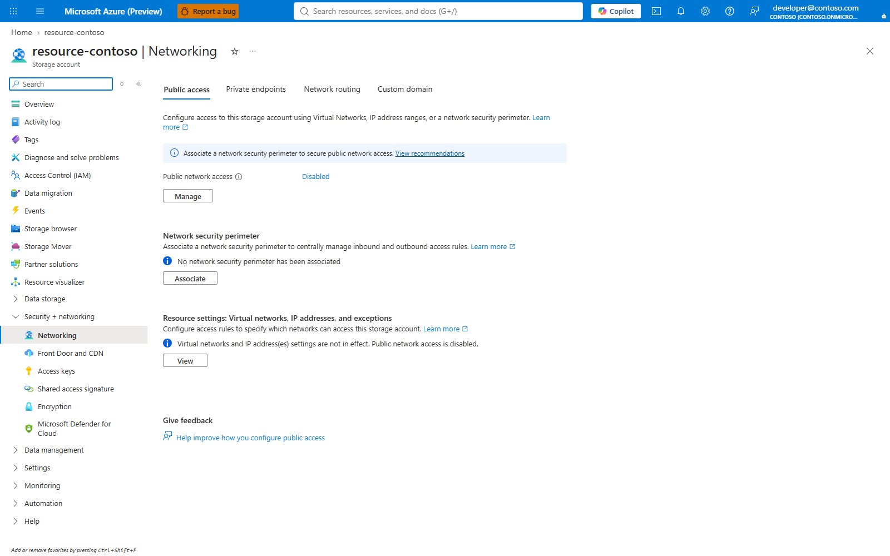

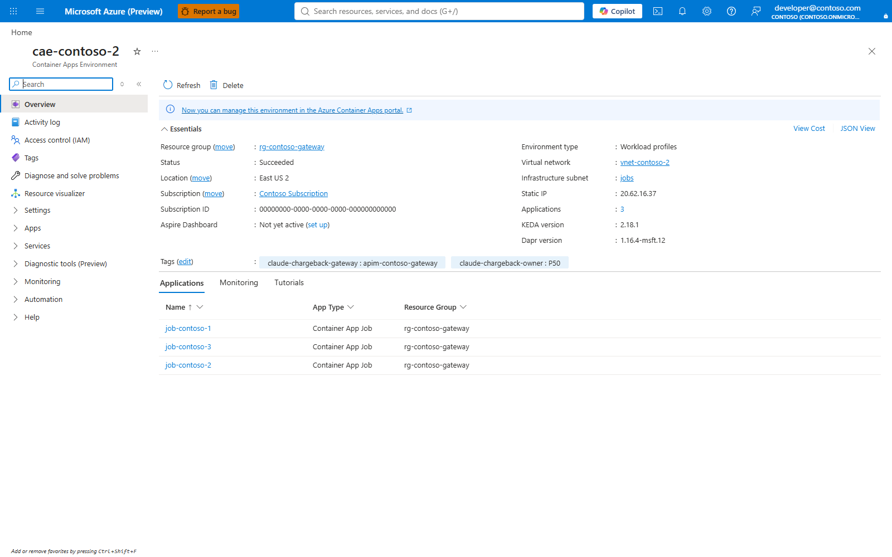

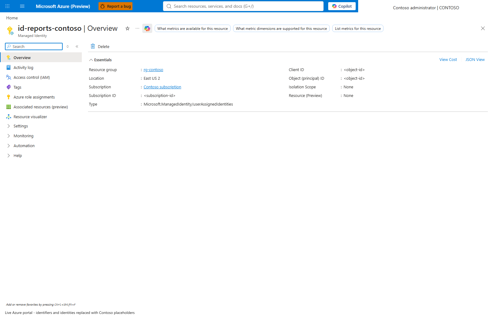


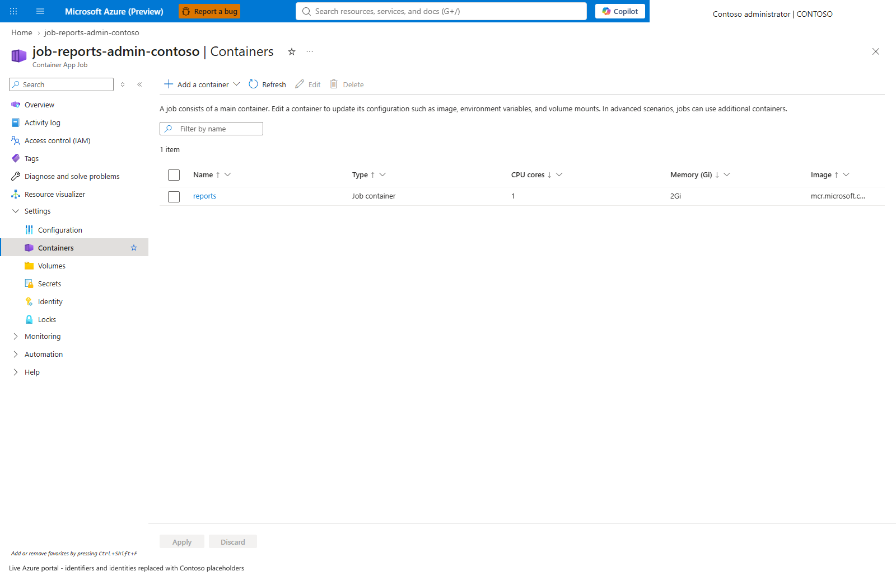

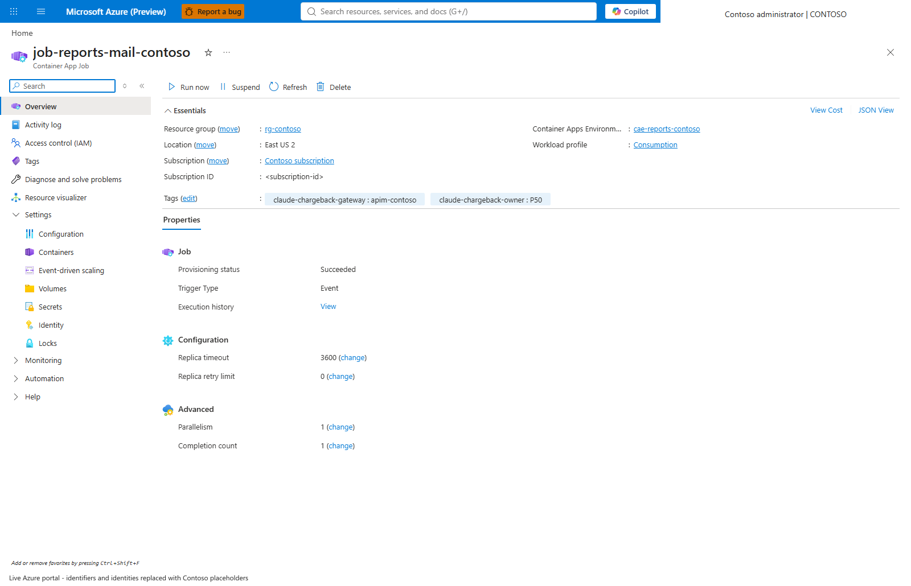

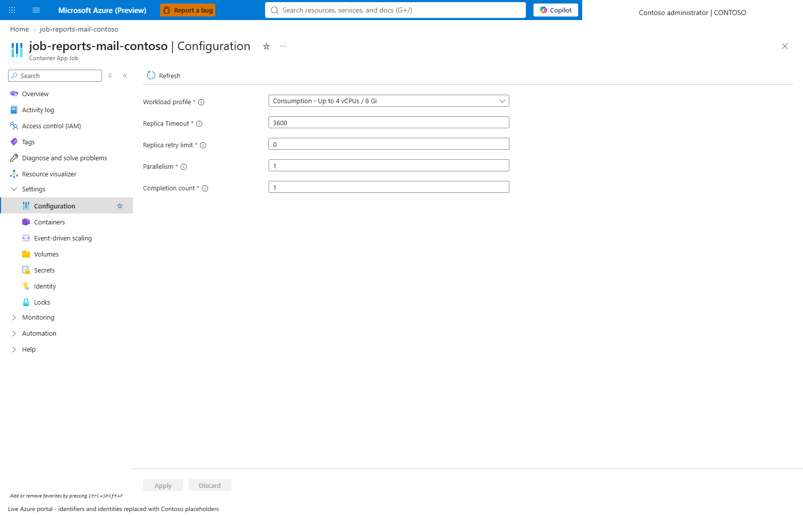

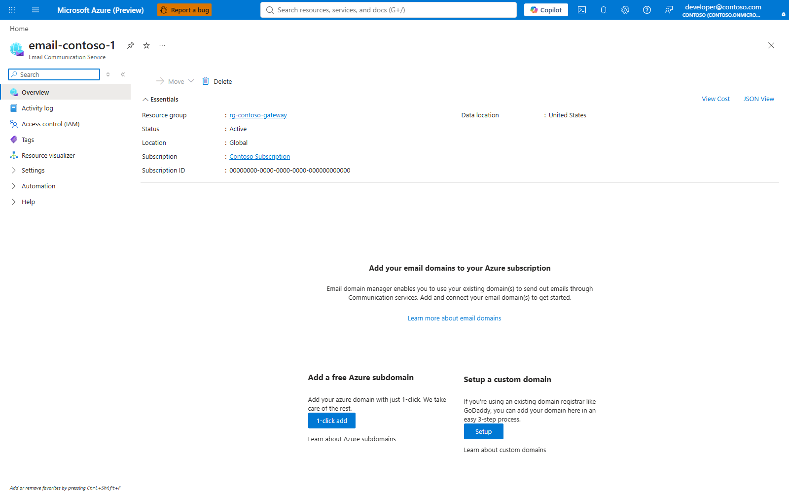

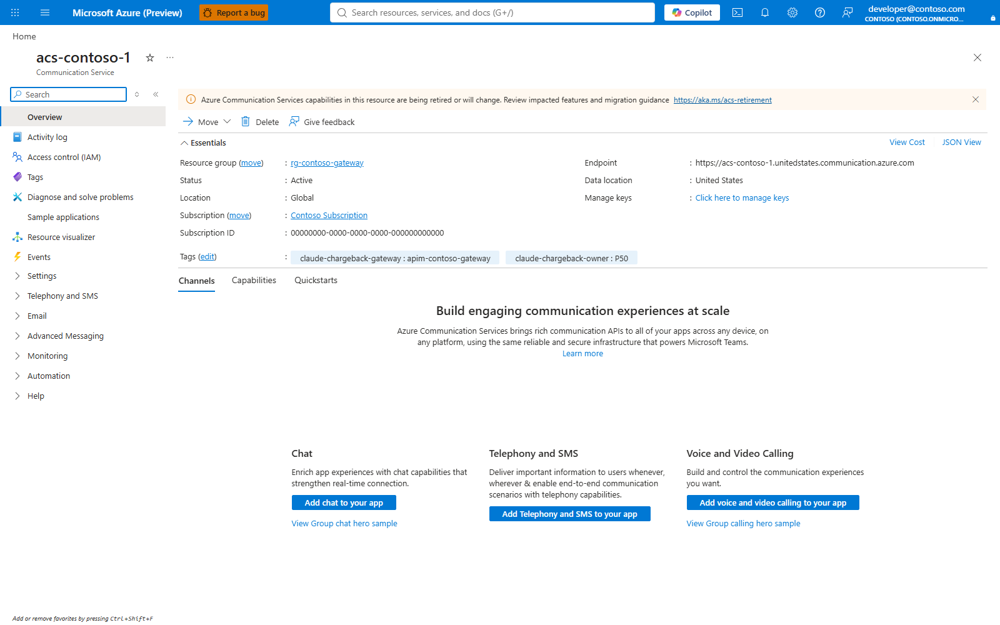

## Next steps

Return to [Chargeback reports](../CHARGEBACK-REPORTS.md) for schema, limits, cost basis, columns
and caveats. Confirm your organizational recipient authorization and email-domain quota
before enabling delivery to additional units.
