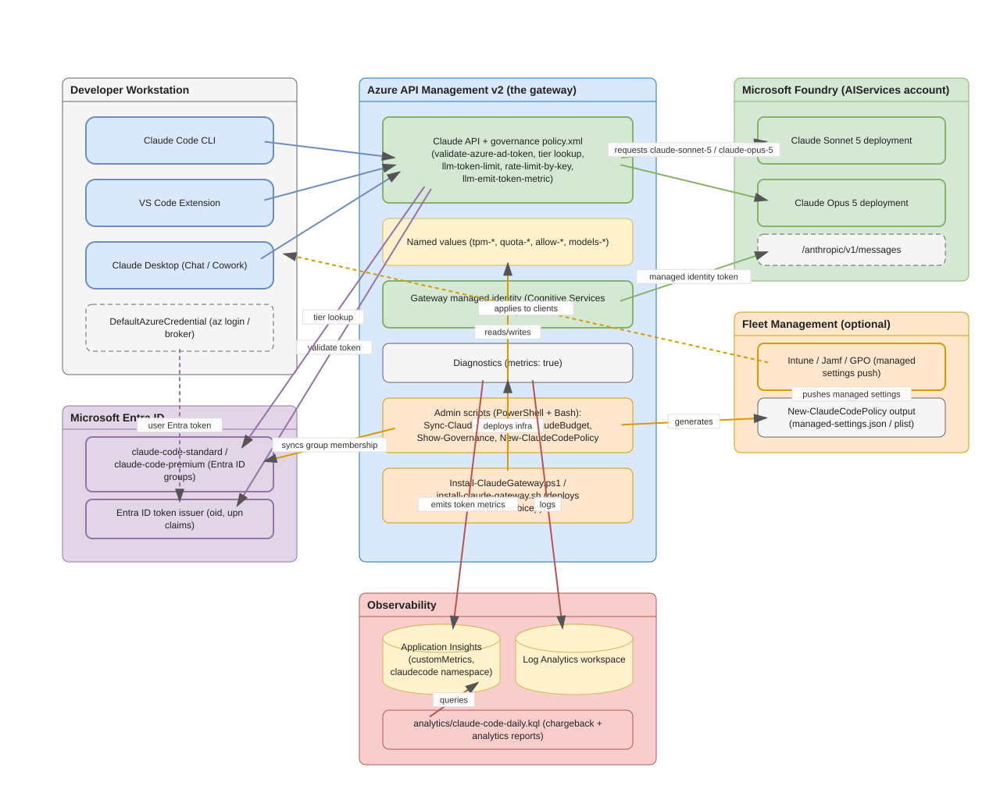
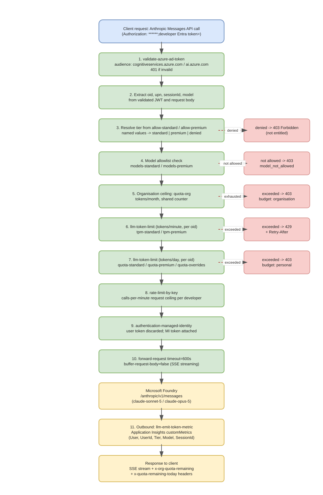
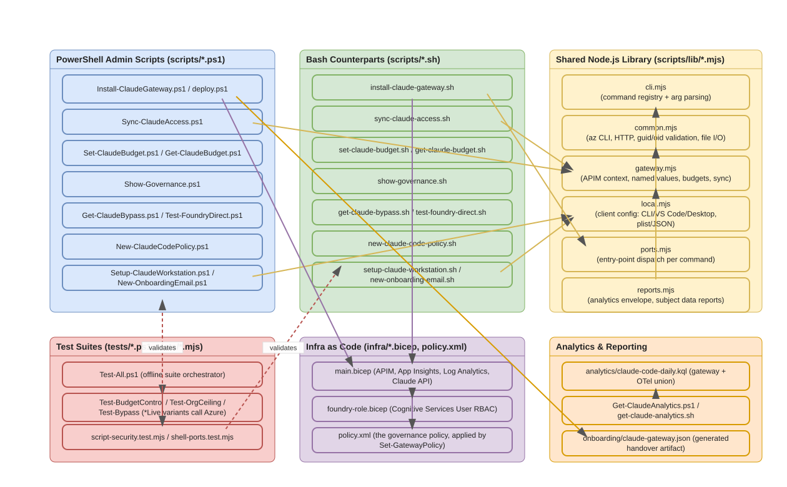
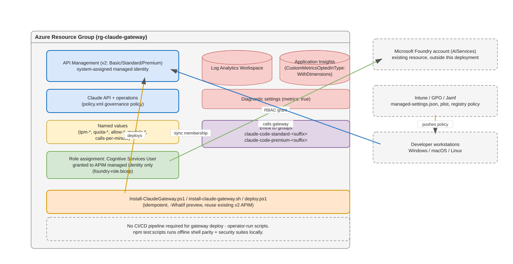

# claude-code-foundry-gateway — Project Summary

## 1. Executive Summary

`claude-code-foundry-gateway` is a governed-access accelerator that lets an organization roll
out **Claude Code**, the **VS Code extension**, and **Claude Desktop** against its own
**Microsoft Foundry** Claude deployment — without ever putting a vendor API key on a developer
machine. An **Azure API Management (APIM) v2** gateway sits between every client and Foundry: it
validates each developer's own Microsoft Entra ID token, resolves their tier from Entra group
membership, enforces per-developer and organization-wide token budgets, meters usage for
chargeback in Application Insights, and only then calls Foundry using its own managed identity.
The repository is a **PowerShell-and-Bash-first automation suite** (one interactive installer,
onboarding and workstation setup scripts, governance and budget tooling, and Bicep
infrastructure-as-code) rather than a running service — the "product" is a **reusable deployment
and governance pattern**, verified end to end against a live Foundry tenant.

## 2. Architecture Overview



The system has five cooperating parts:

| Part | Role |
|---|---|
| **Developer workstations** | Run Claude Code CLI, the VS Code extension, and Claude Desktop, all authenticating through `DefaultAzureCredential` (`az login`) — no client holds a credential. |
| **Microsoft Entra ID** | Source of truth for entitlement. Two groups, `claude-code-standard` and `claude-code-premium`, gate access; the developer's `oid` claim in their Entra token is unforgeable. |
| **Azure API Management v2 (the gateway)** | The enforcement point. Hosts the Claude API, the governance `policy.xml`, named values holding every budget, and the sole managed identity permitted to call Foundry. |
| **Observability** | Log Analytics and Application Insights receive gateway diagnostics; `llm-emit-token-metric` writes per-developer token counts as custom metrics that `analytics/claude-code-daily.kql` turns into chargeback and usage reports. |
| **Microsoft Foundry** | Hosts the actual Claude Sonnet 5 and Claude Opus 5 deployments behind the Anthropic Messages API shape (`/anthropic/v1/messages`). |

An optional sixth part, **fleet management** (Intune, Jamf, or Group Policy), distributes
managed-settings payloads generated by `New-ClaudeCodePolicy.ps1` so that client-side capability
controls (permission rules, hooks, available Desktop tabs, connectors) roll out centrally. The
project's own [`docs/ARCHITECTURE.md`](../ARCHITECTURE.md) is explicit that this layer is a
**management convenience, not a security boundary** — Anthropic's own guidance is that a modified
client binary can bypass any client-side control, so entitlement, budgets, and model access are
enforced only at the gateway.

### Why an APIM v2 SKU is mandatory

The `llm-token-limit`, `llm-emit-token-metric`, and related policies parse the **Anthropic
Messages API** shape only on v2 tiers (Basic v2, Standard v2, Premium v2). On a classic tier the
same policy applies without error but counts zero tokens, so budgets silently never trigger. The
Bicep template (`infra/main.bicep`) restricts `apimSku` to the three v2 values for exactly this
reason.

### Why the identity model is trustworthy

Claude Code's Foundry mode calls Azure's `DefaultAzureCredential`, which resolves to the
developer's own signed-in session. The resulting Entra ID token carries a genuine, signed `oid`
claim that cannot be shared or forged. The gateway validates that token, uses the `oid` to meter
usage and resolve a tier, and then **discards the user token entirely**, re-issuing the call to
Foundry with `authentication-managed-identity`. Foundry never sees a developer's credential, and
removing someone from the Entra group revokes their access immediately — nothing has to be
revoked at the Foundry endpoint itself.

## 3. Processing Pipeline



Every request from a client passes through the following ordered stages, all defined in
[`infra/policy.xml`](../../infra/policy.xml):

1. **`validate-azure-ad-token`** — checks signature, issuer, expiry, and audience
   (`https://cognitiveservices.azure.com` / `https://ai.azure.com`). An invalid token is
   rejected with `401`.
2. **Claim extraction** — reads `oid`, `upn` (falling back to `unique_name`,
   `preferred_username`, or `azp`), the `x-claude-code-session-id` header, and the request's
   `model` field.
3. **Tier resolution** — checks the `oid` against the `allow-standard` / `allow-premium` named
   values (sentinel-comma exact match). No match means `denied`, and the request is refused with
   an actionable `403`.
4. **Model allowlist** — `models-standard` / `models-premium` restrict which Claude deployments a
   tier may call, checked before anything is forwarded so a modified client cannot widen it.
5. **Organization ceiling** — `quota-org` is a single, shared monthly counter across every
   developer. It is a **soft cap**: the underlying `llm-token-limit` policy can let
   high-concurrency requests briefly exceed it, and it is enforced **per gateway**, not
   aggregated across regions.
6. **Per-developer rate limit** — `llm-token-limit` on tokens-per-minute (`tpm-standard` /
   `tpm-premium`), keyed on `oid`. Exceeding it returns `429` with `Retry-After`.
7. **Per-developer daily budget** — a second `llm-token-limit` check on tokens-per-day
   (`quota-standard` / `quota-premium`, or a `quota-overrides` entry for that developer).
   Exceeding it returns `403` until the period resets.
8. **Request-rate ceiling** — `rate-limit-by-key` bounds requests-per-minute
   (`calls-per-minute`), guarding against a runaway agent loop rather than token spend.
9. **`authentication-managed-identity`** — the validated user token is discarded, and the
   gateway's own managed-identity token is attached for the outbound call.
10. **Forwarding** — `forward-request` uses a 600-second timeout (agent turns can run for
    minutes) and `buffer-request-body="false"` (tool schemas and file context routinely produce
    large request bodies), then calls Foundry's `/anthropic/v1/messages`.
11. **Metering** — `llm-emit-token-metric` writes token counts to Application Insights as
    custom metrics dimensioned by `User`, `UserId`, `Tier`, `Model`, and `SessionId`. The
    response also carries `x-org-quota-remaining` and `x-quota-remaining-today` headers.

Both budget refusals return `403` with a JSON body naming which budget was exhausted
(`"budget": "organisation"` or `"budget": "personal"`), so a developer or platform engineer can
tell the two apart without inspecting logs.

## 4. Core Components



The repository ships **parallel PowerShell and Bash implementations** of every administrative
command, sharing a common Node.js library so behavior does not drift between platforms.

### 4.1 Entry points

| Component | File(s) | Purpose |
|---|---|---|
| Interactive installer | `Install-ClaudeGateway.ps1`, `install-claude-gateway.sh` | Discovers Foundry accounts, collects budgets, shows a summary, and deploys the Bicep template. Supports `-WhatIf` / `--what-if` previews and unattended flags (`-Yes` / `--yes`). |
| Scriptable deploy | `deploy.ps1` | The underlying Bicep wrapper the installer calls; usable directly for automation. |
| Developer setup | `scripts/Setup-ClaudeWorkstation.ps1`, `scripts/setup-claude-workstation.sh` | Installs/configures Claude Code CLI, VS Code extension, and Claude Desktop from a `claude-gateway.json` handover file; verifies with a real call through the gateway. |

### 4.2 Administrative scripts (PowerShell ↔ Bash pairs)

| Function | PowerShell | Bash |
|---|---|---|
| Sync Entra group membership to the gateway | `Sync-ClaudeAccess.ps1` | `sync-claude-access.sh` |
| Read/set per-developer budget overrides | `Get-ClaudeBudget.ps1` / `Set-ClaudeBudget.ps1` | `get-claude-budget.sh` / `set-claude-budget.sh` |
| Verify all governance controls | `Show-Governance.ps1` | `show-governance.sh` |
| Audit direct (bypassing) Foundry role holders | `Get-ClaudeBypass.ps1` | `get-claude-bypass.sh` |
| Verify Foundry with the gateway bypassed | `Test-FoundryDirect.ps1` | `test-foundry-direct.sh` |
| Generate managed-settings/MDM policy payloads | `New-ClaudeCodePolicy.ps1` | `new-claude-code-policy.sh` |
| Generate onboarding email | `New-OnboardingEmail.ps1` | `new-onboarding-email.sh` |
| Discover Foundry deployment values | `Get-FoundryValues.ps1` | `get-foundry-values.sh` |
| Apply the governance policy on its own | `Set-GatewayPolicy.ps1` | `set-gateway-policy.sh` |
| End-to-end health check | `Debug-ClaudeCode.ps1` | `debug-claude-code.sh` |
| Analytics reporting | `Get-ClaudeAnalytics.ps1` | `get-claude-analytics.sh` |
| Bulk entitlement import from a roster | `Import-ClaudeEntitlement.ps1` | `import-claude-entitlement.sh` |
| Subject data discovery / removal (privacy) | `Find-ClaudeUserData.ps1`, `Remove-ClaudeUserData.ps1` | `find-claude-user-data.sh`, `remove-claude-user-data.sh` |
| Script encoding repair (BOM for PS 5.1) | `Repair-ScriptEncoding.ps1` | `repair-script-encoding.sh` |

`docs/SHELL-SCRIPTS.md` is the authoritative command-mapping reference, including flag-name
differences (PowerShell uses `-CamelCase`; Bash uses `--kebab-case`).

### 4.3 Shared Node.js library (`scripts/lib/*.mjs`)

Both the Bash scripts and several PowerShell scripts route through common Node.js modules so
Azure REST calls, validation, and formatting logic exist once:

| Module | Responsibility |
|---|---|
| `cli.mjs` | Command registry and `parseArgs`-based argument parsing for every Bash-invoked command. |
| `common.mjs` | Wraps the Azure CLI (`az`), builds ARM/Graph/Insights HTTP requests, validates GUIDs and object ids, and handles safe file I/O. |
| `gateway.mjs` | Resolves APIM context (subscription, resource group, service name), reads/writes named values, and implements sync, budget, and bypass logic. |
| `local.mjs` | Configures local client files — Claude Code, VS Code, and Claude Desktop (including `plist` generation for macOS) — from the onboarding JSON. |
| `ports.mjs` | Dispatches each CLI command name to its underlying implementation; the "port" of a `.ps1` script's behavior into JavaScript. |
| `reports.mjs` | Builds the Claude Code Analytics API-shaped envelope and subject-data reports used by `Get-ClaudeAnalytics`/`Find-ClaudeUserData`. |

### 4.4 Infrastructure as code

| File | Purpose |
|---|---|
| `infra/main.bicep` | Deploys APIM (v2, system-assigned identity), Log Analytics, Application Insights (with `CustomMetricsOptedInType: WithDimensions`), the Claude API and its operations, and applies the governance policy. |
| `infra/foundry-role.bicep` | Grants `Cognitive Services User` on the Foundry account to the gateway's managed identity only. |
| `infra/policy.xml` | The governance policy described in Section 3, applied by `Set-GatewayPolicy.ps1` / `set-gateway-policy.sh`. |
| `infra/azuredeploy.json` | Compiled ARM template powering the README's "Deploy to Azure" button. |

### 4.5 Tests

`tests/Test-All.ps1` orchestrates an offline suite (encoding checks, shell-script parity,
PowerShell 5.1/7 compatibility) plus opt-in live suites (`-IncludeAzure`) that call real Azure
resources: `Test-BudgetControlLive.ps1`, `Test-OrgCeilingLive.ps1`, `Test-CapabilityScopingLive.ps1`.
`tests/script-security.test.mjs` and `tests/shell-ports.test.mjs` are Node's built-in test runner
suites invoked by `npm run test:scripts`, validating the Bash command surface and hardening
against unsafe inputs (documented in `docs/SCRIPT-SECURITY-REVIEW.md`).

## 5. API Contracts / Message Schemas

### 5.1 Governance error responses

Every gateway-side refusal returns a JSON body shaped like the Anthropic Messages API's own
error envelope, so clients handle it the same way as a model-side error:

| Field | Type | Meaning |
|---|---|---|
| `type` | string | Always `"error"` at the top level. |
| `error.type` | string | `permission_error` (not entitled), `invalid_request_error` (model not allowed), or `rate_limit_error` (budget exhausted). |
| `error.code` | string | Present for model restrictions, e.g. `model_not_allowed`. |
| `error.budget` | string | Present only on budget refusals: `organisation` or `personal`. |
| `error.message` | string | Actionable, human-readable explanation. |

### 5.2 Response headers on success

| Header | Meaning |
|---|---|
| `x-org-quota-remaining` | Tokens left in the shared organization-wide monthly ceiling. |
| `x-quota-remaining-today` | Tokens left in the caller's own daily budget. |

### 5.3 `onboarding/claude-gateway.json` (generated handover artifact)

Written by the installer at the end of a successful deployment; consumed by the workstation
setup scripts so a developer types nothing.

| Field | Type | Meaning |
|---|---|---|
| `gatewayUrl` | string | Base URL of the Claude API on the gateway. |
| `tenantId` | string | Entra tenant guid the gateway trusts. |
| `apimName`, `resourceGroup` | string | The deployed APIM instance and its resource group. |
| `standardGroup`, `premiumGroup` | string | Entra group names for the two tiers. |
| `tiers.standard` / `tiers.premium` | object | `tokensPerMinute` and `tokensPerDay` for each tier, shown to the developer. |
| `desktopInteractive` (optional) | object | `clientId`, `authFlow`, `scopes`, `sessionLifetimeSec`, `redirectPort`, and related OIDC settings for Claude Desktop's interactive sign-in, instead of the Azure CLI credential helper. |
| `generated` | string | Timestamp of generation. |

The file contains no secret — access is enforced by Entra group membership, not by anything in
this JSON — so it is safe to email or place on an internal share, and is gitignored only because
it is environment-specific.

### 5.4 Named values (governance configuration surface)

| Named value | Default | Meaning |
|---|---|---|
| `tpm-standard` | 20,000 | Standard tier tokens/minute per developer. |
| `quota-standard` | 500,000 | Standard tier tokens/day per developer. |
| `tpm-premium` | 80,000 | Premium tier tokens/minute per developer. |
| `quota-premium` | 5,000,000 | Premium tier tokens/day per developer. |
| `quota-org` | 100,000,000 | Shared tokens/month ceiling across everyone (soft cap, per gateway). |
| `models-standard` / `models-premium` | empty (all) | Sentinel-comma model allowlist per tier. |
| `calls-per-minute` | 120 | Request-rate ceiling per developer. |
| `quota-overrides` | none | Per-developer daily budget overrides, independent of tier. |

## 6. Infrastructure & Deployment



- **Compute/runtime**: no application server ships in this repository — the "runtime" is Azure
  API Management itself, configured entirely by Bicep and a policy document. There is no
  Dockerfile or container image, because the workload is a managed PaaS gateway, not a
  containerized service.
- **Deployment mechanism**: `Install-ClaudeGateway.ps1` / `install-claude-gateway.sh` deploy
  `infra/main.bicep` idempotently — they detect and offer to reuse an existing v2 APIM instance
  rather than creating a duplicate, and `-WhatIf` / `--what-if` previews changes with no writes.
  `deploy.ps1` exposes the same Bicep deployment non-interactively for scripting.
  Re-running the installer is also how budgets are changed later.
- **Identity and RBAC**: `infra/foundry-role.bicep` grants `Cognitive Services User` on the
  Foundry account **only** to the gateway's system-assigned managed identity. Closing the bypass
  (removing any direct developer role assignment on the Foundry account) is a documented manual
  step — until it is done, a developer with a direct role can call Foundry directly and skip all
  governance.
- **Observability wiring**: the Bicep template enables APIM diagnostics with `metrics: true` and
  sets the Application Insights component's `CustomMetricsOptedInType` to `WithDimensions` —
  both are required, and both fail silently if omitted (no metrics at all, or metrics with no
  `User` breakdown, respectively).
- **CI/CD**: there is no build/release pipeline in this repository (no `.github/workflows/`).
  Verification is developer-run: `pwsh -NoProfile -File ./tests/Test-All.ps1` (offline) and
  `-IncludeAzure` for live checks, plus `npm run test:scripts` for the Node.js-based Bash test
  suites. `node .ironclad/gate.mjs --stage packet` is the project's own definition-of-done gate,
  described in `AGENTS.md`.
- **Fleet management (optional)**: `New-ClaudeCodePolicy.ps1` / `new-claude-code-policy.sh`
  generate managed-settings JSON or a macOS `plist`, which an administrator pushes through
  Intune, Jamf, or Group Policy to control client-side capability (permission rules, hooks,
  Desktop tabs, connectors) fleet-wide.
- **Cost model**: roughly $250/month for one APIM Basic v2 unit, plus ingestion-based Log
  Analytics/Application Insights costs, plus unchanged Foundry CCU token billing.

## 7. Extension Patterns

### 7.1 Add a new administrative command (Bash + PowerShell parity)

1. Implement the PowerShell version first as `scripts/Verb-Noun.ps1`, following the existing
   scripts' `-WhatIf` / dry-run and parameter-validation conventions.
2. Register the Bash-visible command shape in `scripts/lib/cli.mjs` (`commands` map): give it a
   description and its flag list.
3. Implement the behavior in the appropriate `scripts/lib/*.mjs` module (`gateway.mjs` for
   APIM/Entra operations, `local.mjs` for client-side file changes, `reports.mjs` for
   analytics/reporting shapes).
4. Wire the command into `scripts/lib/ports.mjs`'s dispatch table, and add a matching
   `scripts/verb-noun.sh` thin wrapper that calls the shared Node.js entry point.
5. Add the mapping row to `docs/SHELL-SCRIPTS.md`, and add both an offline test case
   (`tests/script-security.test.mjs` or `tests/shell-ports.test.mjs`) and, if it touches Azure, a
   `*Live` PowerShell Pester-style script under `tests/`.
6. Update `CHANGELOG.md` in the same change, per the project's `AGENTS.md` contract.

### 7.2 Change a governance budget without redeploying

Budgets are APIM named values, not code. Use:

```powershell
az apim nv update -g <rg> --service-name <apim-name> --named-value-id tpm-standard --value 40000
```

or the higher-level `Set-ClaudeBudget.ps1 -User <email> -Tokens <n>` for a single developer's
daily override. Changes take effect on the next request — the policy resolves the value per call.

### 7.3 Add a new governance control to the policy

Edit `infra/policy.xml` directly (it is heavily commented with the reasoning behind ordering),
then apply it in isolation with `Set-GatewayPolicy.ps1` / `set-gateway-policy.sh` rather than a
full redeploy. Keep new checks **before** the `authentication-managed-identity` step, since
anything after that point runs with the gateway's own identity rather than the caller's context.

### 7.4 Extend the analytics pipeline

`analytics/claude-code-daily.kql` already unions two sources (gateway metrics and an optional
OpenTelemetry export) with `isfuzzy=true`, so it degrades gracefully if only one source is
present. To add a new dimension, extend both the `llm-emit-token-metric` policy's dimension list
(bounded — only 5 custom dimension slots remain out of Azure Monitor's 10-key limit, 5 of which
are APIM built-ins) and the corresponding `extend`/`summarize` clause in the KQL.

## 8. Rules & Anti-Patterns

Sourced from `AGENTS.md`, `docs/ARCHITECTURE.md`, and the ADRs in `docs/adr/`:

**Do:**
- Treat `docs/adr/` as binding once accepted; reconcile conflicts with a new ADR rather than
  silently picking a side (`AGENTS.md`, "Contract precedence").
- Keep governance checks (entitlement, budgets, model access) **at the gateway**, never
  client-side only — `docs/adr/0004-policy-out-of-band.md`.
- Preserve PowerShell/Bash parity: every new administrative capability needs both a `.ps1` and
  a `.sh` entry point sharing the Node.js library — `docs/adr/0005-shell-parity-security.md`.
- Save any PowerShell script containing non-ASCII characters as UTF-8 **with a BOM** — Windows
  PowerShell 5.1 reads `.ps1` as ANSI otherwise, corrupting characters silently.
- Keep `&`, `^`, `<`, `>`, `|`, and `( )` inside `--query` out of literal Azure CLI arguments on
  Windows; `az` is a `.cmd` shim and these are interpreted by `cmd.exe` before `az` sees them.
  Filter in PowerShell or call the REST API directly instead.
- Validate every external input at the trust boundary and check authorization per object, not
  just per user (`AGENTS.md` non-negotiables).

**Don't:**
- Don't assume a classic (non-v2) APIM SKU works — the `llm-*` policies parse the Anthropic
  shape only on v2 tiers; on classic tiers budgets silently never trigger.
- Don't rely on `quota-org` as a hard ceiling — it is a soft cap that can be briefly exceeded
  under high concurrency, and it is enforced **per gateway/region**, not globally.
- Don't add prompt inspection, content logging, or semantic caching by default — the project
  deliberately records only token counts and identities, and caching an agent's tool-using turns
  is considered unsafe (`docs/ARCHITECTURE.md`, "What this deliberately does not do").
- Don't skip, weaken, or delete a test to reach green; don't disable a detector without an ADR
  recording why (`AGENTS.md` non-negotiables).
- Don't commit `onboarding/claude-gateway.json` or any generated per-deployment artifact — it is
  environment-specific and gitignored by design, even though it contains no secret.
- Don't leave a direct `Cognitive Services User` role assignment on a developer identity after
  standing up the gateway — that is the documented "bypass" that `Get-ClaudeBypass.ps1` audits
  for and the README explicitly instructs closing.

## 9. Dependencies

### 9.1 Root tooling (`package.json`)

| Package | Version | Purpose |
|---|---|---|
| `playwright` | ^1.62.1 | Drives the screenshot-capture tooling in `guide/` against the Azure portal and clients. |
| `sharp` | ^0.34.4 | Image composition for the guide's annotated screenshots. |

### 9.2 Azure / cloud dependencies (via Azure CLI, not npm)

| Dependency | Role |
|---|---|
| Azure API Management (v2 SKU) | The governance gateway itself. |
| Microsoft Entra ID | Identity, groups, and token issuance. |
| Microsoft Foundry (`AIServices` account) | Hosts the Claude model deployments. |
| Log Analytics + Application Insights | Diagnostics and chargeback metrics. |
| Azure CLI (`az`), `jq` (Bash path) | Required tooling for every administrative script. |
| PowerShell 5.1+ or PowerShell 7+ | Runtime for the `.ps1` scripts; PowerShell 7 (`pwsh`) additionally needed for the entitlement-sync step on macOS/Linux. |
| Node.js (built-in `fetch`) | Runtime for `scripts/lib/*.mjs` and every Bash script's transport layer. |

### 9.3 Infrastructure as code

| File | Technology |
|---|---|
| `infra/main.bicep`, `infra/foundry-role.bicep` | Azure Bicep, compiled to `infra/azuredeploy.json` (ARM) for the one-click deploy button. |
| `infra/policy.xml` | Azure API Management policy XML with embedded C#-like expressions. |

### 9.4 Development / testing

| Tool | Purpose |
|---|---|
| `tests/Test-All.ps1` and sibling `Test-*.ps1` scripts | PowerShell-based offline and live (`-IncludeAzure`) regression suites. |
| `tests/*.test.mjs` (Node's built-in test runner) | Bash-script parity and security regression tests, run via `npm run test:scripts`. |
| `.ironclad/gate.mjs` | The project's own packet/pre-commit/release gate (see `AGENTS.md`). |

## 10. Code Structure

```
claude-code-foundry-gateway/
├── Install-ClaudeGateway.ps1      # Interactive admin setup — start here (Windows)
├── install-claude-gateway.sh      # Same wizard, for macOS and Linux
├── deploy.ps1                     # Non-interactive Bicep deployment wrapper
├── DEVELOPER.md                   # The developer's whole side — send them this
├── README.md                      # Project overview, quickstart, governance reference
├── AGENTS.md                      # Binding coding-agent contract (ironclad skill)
├── CHANGELOG.md                   # Keep-a-Changelog formatted history
│
├── infra/                         # Infrastructure as code
│   ├── main.bicep                 #   Gateway, observability, API, policy, RBAC
│   ├── foundry-role.bicep         #   Cognitive Services User grant for the gateway identity
│   ├── policy.xml                 #   The governance policy (Section 3 of this document)
│   └── azuredeploy.json           #   Compiled ARM, for the "Deploy to Azure" button
│
├── scripts/                       # Administrative tooling, PowerShell + Bash pairs
│   ├── Setup-ClaudeWorkstation.ps1 / setup-claude-workstation.sh
│   ├── Sync-ClaudeAccess.ps1 / sync-claude-access.sh
│   ├── Set-ClaudeBudget.ps1 / set-claude-budget.sh, Get-ClaudeBudget.ps1 / get-claude-budget.sh
│   ├── Show-Governance.ps1 / show-governance.sh
│   ├── Get-ClaudeBypass.ps1 / get-claude-bypass.sh, Test-FoundryDirect.ps1 / test-foundry-direct.sh
│   ├── New-ClaudeCodePolicy.ps1 / new-claude-code-policy.sh
│   ├── New-OnboardingEmail.ps1 / new-onboarding-email.sh
│   ├── Get-FoundryValues.ps1 / get-foundry-values.sh
│   ├── Debug-ClaudeCode.ps1 / debug-claude-code.sh
│   ├── Get-ClaudeAnalytics.ps1 / get-claude-analytics.sh
│   ├── Import-ClaudeEntitlement.ps1 / import-claude-entitlement.sh
│   ├── Find-ClaudeUserData.ps1 / Remove-ClaudeUserData.ps1 (+ Bash equivalents)
│   ├── get-foundry-token.ps1 / .sh / .cmd   # Credential helper for Claude Desktop
│   ├── inspect-proxy.mjs                    # Decodes and prints the JWT Claude Code sends
│   └── lib/                                 # Shared Node.js modules
│       ├── cli.mjs        # Command registry + argument parsing
│       ├── common.mjs     # az CLI wrapper, HTTP, GUID/oid validation, safe file I/O
│       ├── gateway.mjs    # APIM context, named values, budgets, entitlement sync
│       ├── local.mjs      # Client config: CLI / VS Code / Desktop, plist/JSON writers
│       ├── ports.mjs      # Dispatches each Bash command to its implementation
│       └── reports.mjs    # Analytics envelope and subject-data report builders
│
├── docs/                          # Reference and explanation documentation
│   ├── SETUP.md                   #   Prerequisites, roles, deployment, closing the bypass
│   ├── ONBOARDING.md              #   Add/change/revoke access; developer setup
│   ├── MONITORING.md              #   Metrics, chargeback, KQL, alerts
│   ├── DEBUGGING.md                #   Isolate a failure layer by layer
│   ├── MIGRATION.md               #   Moving a population off first-party Claude
│   ├── COMPARISON.md              #   Foundry vs. Anthropic direct
│   ├── ARCHITECTURE.md            #   Request path, identity model, design decisions
│   ├── GOVERNANCE-CHECKS.md       #   Command reference for verifying controls
│   ├── TROUBLESHOOTING.md         #   Symptom → fix lookup
│   ├── SHELL-SCRIPTS.md           #   PowerShell ↔ Bash command mapping
│   ├── SCRIPT-SECURITY-REVIEW.md  #   Security review of the shell/PowerShell scripts
│   ├── ROADMAP.md / STATUS.md / UNKNOWNS.md / CHARTER.md   # ironclad project-governance docs
│   ├── adr/                       #   Accepted architecture decision records
│   └── generated/                 #   This generated documentation set (see below)
│
├── analytics/
│   └── claude-code-daily.kql      # Chargeback + Claude Code Analytics API-shaped query
│
├── onboarding/
│   └── README.md                  # Explains the generated claude-gateway.json handover file
│
├── guide/                         # Playwright-based screenshot tooling for the docs
│   ├── capture.mjs, compose.mjs, auth.mjs
│   └── lib/annotate.mjs
│
└── tests/                         # PowerShell and Node.js test suites
    ├── Test-All.ps1               #   Offline suite orchestrator
    ├── Test-BudgetControl(Live).ps1, Test-OrgCeiling(Live).ps1, Test-Bypass.ps1, ...
    └── script-security.test.mjs, shell-ports.test.mjs
```

---

*This document was generated by an automated documentation agent from the repository's own
source files, scripts, infrastructure templates, and existing documentation. It does not modify
any file outside `docs/generated/`. Cross-check specific commands and values against the
authoritative files referenced throughout before relying on them operationally.*
